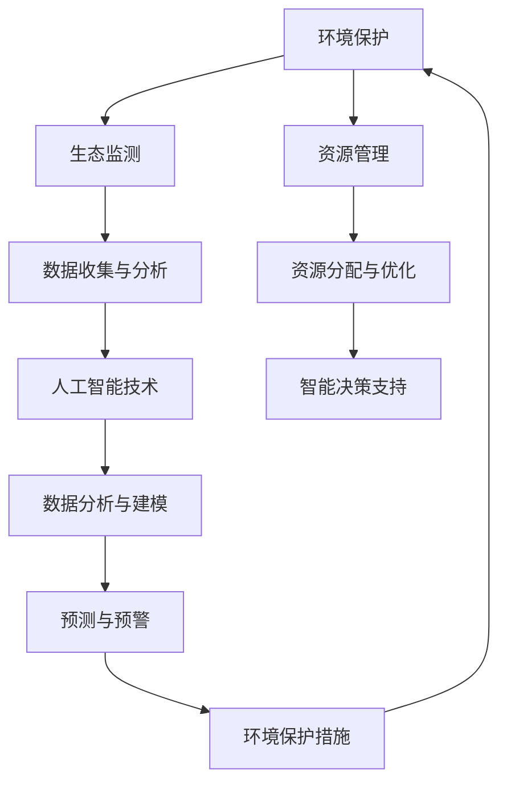

                 

### 文章标题

《人工智能在环境保护中的角色：生态监测与资源管理》

### 关键词

- 人工智能
- 环境保护
- 生态监测
- 资源管理
- 监测数据
- 深度学习
- 机器学习
- 数学模型

### 摘要

本文探讨了人工智能在环境保护中的应用，特别是其在生态监测与资源管理领域的角色。文章首先介绍了生态监测和资源管理的基本概念及其重要性。随后，详细讲解了人工智能的基本原理及其在数据预处理、特征提取、模型训练等方面的应用。通过核心算法原理的讲解和数学模型的展示，本文进一步探讨了人工智能在生态监测和资源管理中的具体应用。最后，通过项目实战展示了人工智能在环境保护中的实际效果，并提出了未来研究和应用的建议。

### 引言

#### 1.1 人工智能与环境保护的背景

人工智能（AI）作为21世纪最具颠覆性的技术之一，正在迅速改变着我们的生活方式。从智能家居、自动驾驶汽车到医疗诊断、金融分析，人工智能的应用已经渗透到各个领域。同时，环境保护作为全球共同关注的重大课题，也面临着前所未有的挑战。气候变化、生态系统退化、资源枯竭等问题日益严重，迫切需要新的技术手段来解决。

在这个背景下，人工智能作为一种强大的工具，逐渐进入了环境保护的视野。通过利用AI技术，我们可以更精确地进行生态监测，更有效地管理自然资源，从而为环境保护提供强有力的支持。

#### 1.2 书籍结构与内容概述

本文结构分为四个主要部分：

1. **核心概念与联系**：介绍人工智能在生态监测和资源管理中的应用背景，并阐述相关核心概念之间的关系。
   
2. **核心算法原理讲解**：详细讲解数据预处理、特征提取、机器学习模型训练等核心算法原理，并提供伪代码示例。

3. **数学模型与公式讲解**：介绍生态监测和资源管理中常用的数学模型和公式，并进行详细讲解与举例说明。

4. **项目实战**：通过实际项目展示人工智能在环境保护中的应用，包括开发环境搭建、源代码实现、代码解读、案例分析等内容。

本文旨在通过系统化的讲解，帮助读者全面了解人工智能在环境保护中的应用，并提供实际操作的指导。

### 核心概念与联系

在探讨人工智能（AI）在环境保护中的应用之前，我们首先需要了解生态监测和资源管理的基本概念。这两个领域不仅是环境保护的重要组成部分，也是人工智能发挥其潜力的关键领域。

#### 生态监测

生态监测是指通过技术手段对生态系统进行定期、系统、全面的监测和分析，以评估生态系统的健康状况、变化趋势和潜在问题。生态监测的主要目标包括：

- **了解生态系统的结构、功能和动态**：通过监测各种生态参数（如生物多样性、土地利用、气象条件等），可以更深入地了解生态系统的运行机制。
- **评估生态系统的健康状况**：通过监测生态系统的变化，及时发现生态问题，如污染、栖息地破坏等，并采取相应的措施。
- **预测生态系统的变化趋势**：利用监测数据，可以建立模型预测生态系统的未来变化，为环境保护决策提供科学依据。

生态监测的方法多种多样，包括传统的地面调查、遥感监测和现代的传感器网络。随着技术的发展，人工智能在生态监测中扮演着越来越重要的角色。例如，通过机器学习算法，可以对大量监测数据进行自动化分析和预测，提高监测的准确性和效率。

#### 资源管理

资源管理是指通过科学的方法和手段，合理利用和保护自然资源，以实现资源的可持续利用。资源管理包括但不限于水资源管理、森林资源管理、土地资源管理等方面。其主要目标包括：

- **提高资源利用效率**：通过科学管理和优化，提高资源的利用效率，减少浪费。
- **保护生态环境**：合理利用资源，避免过度开发和污染，保护生态环境的平衡和稳定。
- **促进可持续发展**：通过资源的合理利用，实现经济发展与环境保护的协调发展，推动可持续发展。

资源管理的重要性不言而喻。在全球人口增长、气候变化和环境污染的背景下，资源管理变得尤为关键。人工智能在资源管理中的应用，可以提供更精确的数据分析、更智能的决策支持和更高效的资源分配方案。

#### AI与环境保护的关系架构 Mermaid 流程图

为了更好地理解人工智能在环境保护中的角色，我们可以使用Mermaid流程图来展示核心概念之间的关系。



在这个流程图中，我们可以看到人工智能技术贯穿于生态监测和资源管理的全过程，从数据收集与分析、资源分配与优化，到智能决策支持、预测与预警，最终指导环境保护措施的实施。

通过这一部分的内容，我们为接下来的详细讨论打下了基础。在接下来的章节中，我们将深入探讨人工智能在生态监测与资源管理中的具体应用，包括核心算法原理、数学模型以及实际项目实战。

### 第1章 人工智能基础

人工智能（AI）是计算机科学的一个分支，旨在使计算机系统能够模拟人类智能行为，进行学习、推理、问题解决和决策。AI的发展历程可以追溯到20世纪50年代，当时科学家们首次提出了人工智能的概念。自那时以来，AI经历了多个发展阶段，从符号主义、基于规则的系统，到以统计学习为基础的机器学习和深度学习。

#### 1.1 人工智能概述

人工智能可以划分为几种主要类型：

- **符号主义人工智能**：基于逻辑推理和知识表示，通过符号操作进行问题求解。
- **统计学习人工智能**：利用统计模型和算法从数据中学习规律，如支持向量机（SVM）、决策树等。
- **深度学习人工智能**：利用多层神经网络进行特征学习和模式识别，如卷积神经网络（CNN）和循环神经网络（RNN）。

AI的基本组件包括：

- **感知器**：最基础的AI组件，用于接收输入并产生输出。
- **神经网络**：由多个感知器组成的网络，可以学习复杂的数据模式。
- **学习算法**：使神经网络能够从数据中学习并改进其性能。

#### 1.2 机器学习基础

机器学习是AI的一个重要分支，主要研究如何从数据中学习并做出预测或决策。机器学习可以分为监督学习、无监督学习和半监督学习：

- **监督学习**：通过已标记的训练数据，学习输入和输出之间的关系，并用于预测新的数据。
  - **回归分析**：预测连续值。
  - **分类分析**：预测离散标签。
- **无监督学习**：在没有标记数据的情况下，自动发现数据中的结构和模式。
  - **聚类**：将相似的数据点分组。
  - **降维**：通过减少数据维度，保持关键信息。
- **半监督学习**：利用部分标记和大量未标记的数据进行学习。

机器学习的核心算法包括：

- **线性回归**：通过最小二乘法拟合线性模型。
  - $$ y = \beta_0 + \beta_1 \cdot x $$
- **逻辑回归**：用于二分类问题，通过最大似然估计确定概率。
  - $$ \log\frac{P(Y=1|X=x)}{P(Y=0|X=x)} = \beta_0 + \beta_1 \cdot x $$
- **决策树**：通过一系列规则将数据分类或回归。
- **随机森林**：通过集成多个决策树，提高预测准确性和泛化能力。

#### 1.3 深度学习原理

深度学习是机器学习的进一步发展，通过多层神经网络学习复杂的数据特征。深度学习的关键组件包括：

- **神经元**：基本的计算单元，接收输入并产生输出。
- **层**：由多个神经元组成的层，包括输入层、隐藏层和输出层。
- **激活函数**：用于引入非线性，使网络能够拟合复杂函数。
  - **sigmoid**：$$ \sigma(x) = \frac{1}{1 + e^{-x}} $$
  - **ReLU**：$$ \text{ReLU}(x) = \max(0, x) $$
- **反向传播**：用于训练神经网络，通过计算误差梯度并更新网络权重。

深度学习的主要算法包括：

- **卷积神经网络（CNN）**：用于图像分析，通过卷积和池化操作提取特征。
- **循环神经网络（RNN）**：用于序列数据，通过递归结构处理序列中的依赖关系。
- **长短期记忆网络（LSTM）**：改进RNN，解决长期依赖问题。
- **生成对抗网络（GAN）**：通过生成器和判别器进行对抗训练，用于图像生成和数据增强。

通过机器学习和深度学习的基础知识，我们可以更好地理解和应用人工智能技术，为生态监测和资源管理提供强大的工具和解决方案。在下一章中，我们将探讨AI在生态监测和资源管理中的应用，并介绍相关核心算法和数学模型。

### 第2章 AI在生态监测与资源管理中的应用

人工智能（AI）在环境保护中扮演着至关重要的角色，尤其是在生态监测和资源管理领域。通过利用AI技术，我们可以更高效、更精确地收集、处理和分析环境数据，从而为环境保护提供有力支持。

#### 2.1 AI在生态监测中的作用

生态监测是环境保护的基础，通过监测生态系统的各项指标，可以了解生态系统的健康状况、变化趋势和潜在问题。人工智能在生态监测中的作用主要体现在以下几个方面：

1. **数据收集与处理**：传统的生态监测方法往往依赖于人工收集数据，效率低下且易受主观影响。而通过AI技术，特别是传感器技术和无人机技术，可以自动化、大规模地收集环境数据，如气象数据、水质数据、土壤数据等。这些数据可以通过机器学习和深度学习算法进行预处理和特征提取，提高数据的质量和利用率。

2. **模式识别与分类**：生态监测中，需要对大量的图像和视频数据进行分析，识别生物物种、栖息地变化等信息。卷积神经网络（CNN）和循环神经网络（RNN）等深度学习算法在图像和视频分析方面具有显著优势，可以自动识别和分类不同类型的生物物种和环境变化。

3. **预测与预警**：通过对历史监测数据的分析和模式识别，AI可以预测未来的生态变化趋势，及时发现潜在的环境问题。例如，通过时间序列分析和机器学习模型，可以预测水资源的供需状况、土壤污染的趋势等，为环境保护决策提供科学依据。

#### 2.2 AI在资源管理中的应用

资源管理是环境保护的重要组成部分，涉及水、土地、森林等多种自然资源。人工智能在资源管理中的应用，可以帮助实现资源的高效利用和可持续发展。

1. **资源分配与优化**：在资源管理中，如何合理分配资源以最大化利用效率是一个重要问题。通过AI技术，可以建立优化模型，利用机器学习和深度学习算法进行资源分配和优化。例如，在水资源管理中，通过优化模型和AI算法，可以实现水资源的动态调配，提高用水效率。

2. **生态承载力评估**：生态承载力是指生态系统在特定条件下能够支持的最大生物量或生产力。通过AI技术，可以建立生态承载力模型，评估不同区域的生态承载力，并为资源管理提供科学依据。例如，利用机器学习算法，可以分析土地利用、生物多样性、水资源等因素，评估不同区域的生态承载力。

3. **决策支持与智能管理**：在资源管理中，决策者需要面对复杂的环境数据和管理任务。通过AI技术，可以提供智能决策支持系统，帮助决策者更好地理解和应对环境问题。例如，利用深度学习算法，可以分析大量环境数据，提供资源管理的决策建议，如土地利用规划、污染源控制等。

#### 2.3 AI与生态系统的关系

AI与生态系统之间的关系可以从多个角度来理解：

1. **数据驱动**：生态系统是一个复杂的动态系统，其运行状态受到多种因素的影响。AI通过数据驱动的方式，可以更准确地捕捉和解释生态系统的变化。例如，通过传感器网络和遥感技术，可以实时收集生态数据，并通过机器学习和深度学习算法进行数据分析，帮助理解生态系统的运行机制。

2. **智能优化**：AI技术可以实现对生态系统的智能优化，从而提高资源利用效率和生态系统的稳定性。例如，通过深度学习算法，可以优化土地利用模式，提高土地的生产力，同时减少对环境的破坏。

3. **环境预警**：AI可以帮助预测和预警生态系统的变化，及时采取应对措施。例如，通过时间序列分析和机器学习模型，可以预测自然灾害（如洪水、干旱）的发生，为提前采取防范措施提供支持。

总之，人工智能在生态监测与资源管理中发挥着重要作用，通过数据收集与处理、模式识别与分类、预测与预警等手段，为环境保护提供强有力的技术支持。在下一章中，我们将进一步探讨AI在生态监测与资源管理中的核心算法原理，并介绍相关的数学模型和公式。

### 第3章 数据预处理与特征提取

在生态监测和资源管理中，数据预处理和特征提取是人工智能模型训练和分析的重要环节。这些步骤不仅影响到模型的性能，还直接关系到结果的准确性和可靠性。以下我们将详细介绍数据预处理和特征提取的基本方法、关键步骤以及伪代码示例。

#### 3.1 数据预处理方法

数据预处理是指对原始数据进行清洗、归一化、转换等操作，以便后续分析和建模。以下是数据预处理的关键步骤：

1. **数据清洗**：去除数据中的噪声和异常值，确保数据质量。常见的清洗方法包括：
   - **去除重复数据**：使用去重算法删除重复记录。
   - **处理缺失值**：根据具体情况，使用插值法、平均值法或删除缺失值。
   - **纠正错误数据**：通过人工或自动算法检查和修正错误数据。

2. **数据归一化**：将不同量纲的数据转换到同一尺度，以便模型训练。常用的归一化方法包括：
   - **最小-最大标准化**：将数据缩放到[0, 1]之间。公式如下：
     $$ x' = \frac{x - x_{\min}}{x_{\max} - x_{\min}} $$
   - **均值-标准差标准化**：将数据缩放到均值为中心、标准差为宽度的范围内。公式如下：
     $$ x' = \frac{x - \mu}{\sigma} $$
   - **对数变换**：对数值数据进行对数变换，降低数据分布的不均衡性。

3. **数据转换**：将非数值数据转换为数值数据，如将类别数据编码为独热编码或标签编码。

#### 3.2 特征提取算法

特征提取是指从原始数据中提取出对模型训练和预测有用的特征。以下是几种常见的特征提取算法：

1. **主成分分析（PCA）**：通过线性变换降低数据的维度，同时保持数据的主要信息。PCA算法步骤如下：
   - **协方差矩阵计算**：计算所有特征之间的协方差矩阵。
   - **特征值和特征向量计算**：计算协方差矩阵的特征值和特征向量，并排序。
   - **降维**：选取最大的k个特征值对应的特征向量作为新的特征空间。

2. **自动特征选择（AFS）**：通过迭代算法选择对模型性能贡献最大的特征。AFS算法步骤如下：
   - **初始特征集**：选择所有特征作为初始特征集。
   - **模型训练与评估**：使用部分特征集训练模型，并评估模型性能。
   - **特征选择**：根据模型性能选择部分特征。
   - **迭代**：在每次迭代中，移除性能较差的特征，并添加新的特征，重复步骤3和4。

3. **特征重要性评估**：通过模型训练过程中特征的重要性指标评估特征的重要性。常见的方法包括：
   - **特征贡献率**：根据特征在模型训练中的贡献程度进行评估。
   - **重要性得分**：通过随机森林等模型训练后的特征重要性得分进行评估。

#### 3.3 伪代码示例

以下是一个简单的数据预处理和特征提取的伪代码示例：

```python
# 数据预处理伪代码

# 数据清洗
def clean_data(data):
    # 去除重复数据
    data = remove_duplicates(data)
    # 处理缺失值
    data = handle_missing_values(data)
    # 纠正错误数据
    data = correct_errors(data)
    return data

# 数据归一化
def normalize_data(data, method='min-max'):
    if method == 'min-max':
        data_normalized = (data - min(data)) / (max(data) - min(data))
    elif method == 'mean-std':
        data_normalized = (data - mean(data)) / std(data)
    return data_normalized

# 数据转换
def convert_data(data, encoding='one-hot'):
    if encoding == 'one-hot':
        data_encoded = one_hot_encode(data)
    elif encoding == 'label':
        data_encoded = label_encode(data)
    return data_encoded

# 特征提取伪代码

# 主成分分析（PCA）
def pca(data, k):
    # 计算协方差矩阵
    cov_matrix = compute_covariance_matrix(data)
    # 计算特征值和特征向量
    eigen_values, eigen_vectors = compute_eigen(cov_matrix)
    # 降维
    new_data = project_data(data, eigen_vectors[:k])
    return new_data

# 自动特征选择（AFS）
def auto_feature_selection(data, target, k):
    # 初始特征集
    features = all_features
    best_features = []
    while len(features) > k:
        # 训练模型
        model = train_model(features, target)
        # 评估模型
        performance = evaluate_model(model, target)
        # 特征选择
        worst_performance = min_performance(performance)
        worst_feature = select_worst_feature(performance)
        # 迭代
        features.remove(worst_feature)
    return features

# 特征重要性评估
def feature_importance_evaluation(model):
    importances = model.feature_importances_
    return importances
```

通过这些步骤和算法，我们可以对原始生态监测数据进行有效的预处理和特征提取，为后续的模型训练和分析提供高质量的数据。在下一章中，我们将探讨机器学习模型在生态监测和资源管理中的应用，并详细介绍各种模型的基本原理、优缺点及其适用场景。

### 监测数据的机器学习模型

在生态监测和资源管理中，机器学习模型的应用至关重要，能够帮助我们从海量数据中提取有价值的信息，并做出准确的预测。以下我们将详细介绍几种常见的机器学习模型，包括其基本原理、优缺点及其在生态监测和资源管理中的适用场景。

#### 4.1 常见机器学习算法

1. **线性回归模型**：

   线性回归模型是一种最简单的机器学习算法，用于预测连续值。它基于假设输入变量与输出变量之间存在线性关系。

   - **基本原理**：线性回归模型通过最小化预测值与实际值之间的误差平方和，拟合出一条直线。公式如下：
     $$ y = \beta_0 + \beta_1 \cdot x $$
   - **优点**：实现简单，易于理解和解释。
   - **缺点**：对非线性数据拟合能力差，需要大量的数据来保证模型的准确性。
   - **适用场景**：适用于简单的关系预测，如水质污染的浓度预测。

2. **逻辑回归模型**：

   逻辑回归模型是线性回归模型在分类问题中的应用，主要用于二分类问题。它通过预测概率来决定样本的类别。

   - **基本原理**：逻辑回归模型通过最大似然估计确定模型参数，然后利用预测的概率阈值来分类。公式如下：
     $$ \log\frac{P(Y=1|X=x)}{P(Y=0|X=x)} = \beta_0 + \beta_1 \cdot x $$
   - **优点**：实现简单，计算效率高。
   - **缺点**：对复杂非线性问题的拟合能力有限。
   - **适用场景**：适用于分类问题，如生物物种的分类、污染源的识别。

3. **决策树模型**：

   决策树模型通过一系列规则对数据进行分类或回归，每个内部节点表示一个特征，每个分支代表特征的一个取值，叶子节点表示最终的预测结果。

   - **基本原理**：决策树模型通过递归划分数据集，选择最优特征和阈值进行划分。公式如下：
     $$ y = g(\theta_0 + \theta_1 x_1 + \theta_2 x_2 + \ldots + \theta_n x_n) $$
   - **优点**：易于理解，解释性强。
   - **缺点**：可能产生过拟合，需要大量的数据来训练。
   - **适用场景**：适用于各种类型的数据，特别是树状结构的数据，如土地利用类型的分类。

4. **随机森林模型**：

   随机森林模型通过集成多个决策树，提高模型的预测准确性和泛化能力。

   - **基本原理**：随机森林模型在训练过程中，随机选取特征和样本子集，构建多个决策树，并取其平均预测值作为最终结果。公式如下：
     $$ y = \frac{1}{T} \sum_{t=1}^{T} g(\theta_{t,0} + \theta_{t,1} x_{1} + \theta_{t,2} x_{2} + \ldots + \theta_{t,n} x_{n}) $$
   - **优点**：减少过拟合，提高预测准确性。
   - **缺点**：计算成本高，对大量特征的数据处理效率低。
   - **适用场景**：适用于各种类型的数据，特别是特征数量较多的情况，如生物多样性分析。

5. **支持向量机（SVM）**：

   支持向量机模型通过寻找最优超平面，将不同类别的数据点分隔开来。

   - **基本原理**：SVM通过最大化分类边界之间的距离来训练模型，公式如下：
     $$ \text{maximize} \quad \frac{1}{2} \| w \|^2 $$
     $$ \text{subject to} \quad y^{(i)} (\langle w, x^{(i)} \rangle - b) \geq 1 $$
   - **优点**：具有良好的泛化能力，对线性数据拟合效果好。
   - **缺点**：对非线性数据的拟合能力有限，计算成本较高。
   - **适用场景**：适用于线性可分或近似线性可分的数据，如土地利用类型的分类。

6. **神经网络模型**：

   神经网络模型通过多层神经元进行特征学习和模式识别，具有强大的非线性拟合能力。

   - **基本原理**：神经网络模型通过反向传播算法训练网络权重，公式如下：
     $$ z^{(l)} = \sigma(z^{(l-1)}) $$
     $$ \delta^{(l)} = \sigma' (z^{(l)}) \cdot \delta^{(l+1)} $$
     $$ w^{(l)} = w^{(l)} + \alpha \cdot \delta^{(l)} \cdot z^{(l-1)} $$
   - **优点**：强大的非线性拟合能力，适用于复杂的数据模式。
   - **缺点**：训练过程计算成本高，容易出现过拟合。
   - **适用场景**：适用于复杂的数据模式，如生物物种识别、环境变化预测。

#### 4.2 机器学习模型训练与评估

机器学习模型的训练与评估是模型应用的关键步骤。以下我们将介绍常用的模型训练和评估方法：

1. **模型训练**：

   模型训练的目标是通过已有数据学习出模型参数，以便对新的数据进行预测。常见的训练方法包括：

   - **批量训练**：每次训练使用所有样本，计算所有样本的误差。
   - **随机梯度下降（SGD）**：每次训练使用一个样本，计算单个样本的误差。
   - **小批量训练**：每次训练使用部分样本，介于批量和随机梯度下降之间。

2. **模型评估**：

   模型评估的目标是评估模型的预测准确性和泛化能力。常用的评估方法包括：

   - **交叉验证**：通过将数据集划分为多个子集，轮流使用子集作为测试集，其余子集作为训练集，评估模型在多个子集上的表现。
   - **准确率**：分类模型预测正确的样本数占总样本数的比例。
   - **召回率**：分类模型预测正确的正样本数占总正样本数的比例。
   - **F1分数**：综合考虑准确率和召回率的指标，公式如下：
     $$ F1 = 2 \cdot \frac{precision \cdot recall}{precision + recall} $$

通过以上对常见机器学习模型的介绍，我们可以根据具体应用场景选择合适的模型，并通过科学的训练和评估方法，提高模型在生态监测和资源管理中的性能。在下一章中，我们将进一步探讨深度学习在生态监测和资源管理中的应用。

### 第5章 深度学习在生态监测中的应用

深度学习作为人工智能的一个重要分支，以其强大的特征学习和模式识别能力在多个领域取得了显著成果。在生态监测领域，深度学习技术因其能够处理复杂数据模式、实现高度自动化和智能化的分析，正逐渐成为生态监测的重要工具。本章将详细探讨卷积神经网络（CNN）、循环神经网络（RNN）和生成对抗网络（GAN）在生态监测中的应用，并展示相应的伪代码示例。

#### 5.1 卷积神经网络（CNN）在图像分析中的应用

卷积神经网络（CNN）是一种专门用于处理图像数据的深度学习模型，通过卷积和池化操作提取图像中的特征。在生态监测中，CNN可以用于生物物种识别、栖息地识别等任务。

1. **基本原理**：

   CNN由多个卷积层、池化层和全连接层组成。卷积层通过卷积操作提取图像中的局部特征，池化层用于降低特征图的维度和参数数量。以下是CNN的基本结构：

   - **输入层**：接收图像数据。
   - **卷积层**：通过卷积操作提取图像特征，通常使用多个卷积核。
   - **激活函数**：引入非线性，常用的有ReLU函数。
   - **池化层**：降低特征图的维度，常用的有最大池化和平均池化。
   - **全连接层**：将卷积层和池化层提取的特征映射到输出层。

2. **伪代码示例**：

   ```python
   # CNN图像分类模型伪代码

   # 定义CNN模型
   model = Sequential()

   # 添加卷积层
   model.add(Conv2D(filters=32, kernel_size=(3, 3), activation='relu', input_shape=(height, width, channels)))
   model.add(MaxPooling2D(pool_size=(2, 2)))

   # 添加更多卷积层和池化层
   model.add(Conv2D(filters=64, kernel_size=(3, 3), activation='relu'))
   model.add(MaxPooling2D(pool_size=(2, 2)))
   model.add(Conv2D(filters=128, kernel_size=(3, 3), activation='relu'))
   model.add(MaxPooling2D(pool_size=(2, 2)))

   # 添加全连接层
   model.add(Flatten())
   model.add(Dense(units=128, activation='relu'))
   model.add(Dense(units=num_classes, activation='softmax'))

   # 编译模型
   model.compile(optimizer='adam', loss='categorical_crossentropy', metrics=['accuracy'])

   # 训练模型
   model.fit(x_train, y_train, batch_size=64, epochs=10, validation_data=(x_val, y_val))
   ```

3. **应用场景**：

   - **生物物种识别**：通过训练CNN模型，可以自动识别图像中的生物物种，如鸟类识别、植物识别等。
   - **栖息地识别**：通过分析遥感图像，可以识别不同类型的栖息地，如森林、湿地等。

#### 5.2 循环神经网络（RNN）在序列数据处理中的应用

循环神经网络（RNN）是一种能够处理序列数据的神经网络，通过递归结构保持对序列中前后依赖关系的记忆。在生态监测中，RNN可以用于时间序列分析、气象预测等任务。

1. **基本原理**：

   RNN的基本结构包括输入门、遗忘门和输出门，这些门结构用于控制信息的传递和遗忘。以下是RNN的基本结构：

   - **输入层**：接收序列数据。
   - **隐藏层**：包含输入门、遗忘门和输出门，用于处理序列数据。
   - **输出层**：生成序列输出。

2. **伪代码示例**：

   ```python
   # RNN时间序列预测模型伪代码

   # 定义RNN模型
   model = Sequential()

   # 添加RNN层
   model.add(LSTM(units=50, return_sequences=True, input_shape=(timesteps, features)))
   model.add(LSTM(units=50, return_sequences=False))

   # 添加全连接层
   model.add(Dense(units=1))

   # 编译模型
   model.compile(optimizer='adam', loss='mean_squared_error')

   # 训练模型
   model.fit(x_train, y_train, epochs=100, batch_size=32, validation_data=(x_val, y_val))
   ```

3. **应用场景**：

   - **时间序列分析**：通过RNN模型，可以预测未来的气象参数，如温度、湿度等。
   - **生态事件预测**：通过分析历史数据，预测未来可能发生的生态事件，如洪水、干旱等。

#### 5.3 生成对抗网络（GAN）在生态图像生成中的应用

生成对抗网络（GAN）是一种由生成器和判别器组成的神经网络模型，通过对抗训练生成逼真的数据。在生态监测中，GAN可以用于生成生态图像，如植物生长模拟、栖息地重建等。

1. **基本原理**：

   GAN由生成器和判别器两个神经网络组成。生成器生成假图像，判别器判断图像的真实性。训练过程中，生成器和判别器相互对抗，生成器不断优化生成图像的质量，判别器不断提高对真实图像和假图像的识别能力。以下是GAN的基本结构：

   - **生成器**：接收随机噪声，生成假图像。
   - **判别器**：接收真实图像和生成图像，判断其真实性。

2. **伪代码示例**：

   ```python
   # GAN生态图像生成模型伪代码

   # 定义生成器和判别器
   generator = Sequential()
   discriminator = Sequential()

   # 生成器结构
   generator.add(Dense(units=128, activation='relu', input_shape=(latent_dim)))
   generator.add(Reshape(target_shape=(img_height, img_width, channels)))
   generator.add(Conv2DTranspose(filters=64, kernel_size=(4, 4), strides=(2, 2), activation='relu'))
   generator.add(Conv2DTranspose(filters=32, kernel_size=(4, 4), strides=(2, 2), activation='relu'))
   generator.add(Conv2D(filters=1, kernel_size=(1, 1), activation='sigmoid'))

   # 判别器结构
   discriminator.add(Conv2D(filters=32, kernel_size=(3, 3), strides=(2, 2), input_shape=(img_height, img_width, channels), activation='relu'))
   discriminator.add(Conv2D(filters=64, kernel_size=(3, 3), strides=(2, 2), activation='relu'))
   discriminator.add(Flatten())
   discriminator.add(Dense(units=1, activation='sigmoid'))

   # 编译生成器和判别器
   generator.compile(optimizer='adam', loss='binary_crossentropy')
   discriminator.compile(optimizer='adam', loss='binary_crossentropy')

   # 训练GAN模型
   for epoch in range(num_epochs):
       for real_images in real_data:
           noise = np.random.normal(0, 1, (batch_size, latent_dim))
           generated_images = generator.predict(noise)
           real_labels = np.ones((batch_size, 1))
           generated_labels = np.zeros((batch_size, 1))
           discriminator.train_on_batch(real_images, real_labels)
           discriminator.train_on_batch(generated_images, generated_labels)
       noise = np.random.normal(0, 1, (batch_size, latent_dim))
       generator_loss = generator.train_on_batch(noise, real_labels)
   ```

3. **应用场景**：

   - **生态图像生成**：通过GAN模型，可以生成逼真的生态图像，用于生物多样性研究、生态保护宣传等。
   - **栖息地重建**：通过生成生态图像，可以模拟不同条件下的栖息地变化，为生态保护决策提供支持。

综上所述，深度学习在生态监测中具有广泛的应用，通过卷积神经网络、循环神经网络和生成对抗网络等模型，可以实现对生态数据的自动化分析和处理，为环境保护提供强有力的技术支持。在下一章中，我们将进一步探讨生态监测和资源管理中的数学模型和公式。

### 第6章 生态监测中的数学模型

在生态监测中，数学模型和公式扮演着至关重要的角色，它们不仅帮助我们理解和描述生态系统的复杂动态，还能够为环境保护决策提供科学依据。以下我们将介绍几种常用的生态监测中的数学模型和公式，并进行详细讲解和举例说明。

#### 6.1 监测数据的空间分布模型

空间分布模型用于描述生态监测数据在空间上的分布特征，常见的空间分布模型包括泊松分布、负二项分布和正态分布。

1. **泊松分布**：

   泊松分布是一种描述事件发生次数的分布模型，常用于生态监测中的物种分布。

   - **公式**：
     $$ P(X = k) = \frac{e^{-\lambda} \cdot \lambda^k}{k!} $$
     其中，\( \lambda \) 是事件平均发生次数，\( k \) 是实际发生次数。

   - **应用举例**：

     假设某地区的生物多样性监测数据中，每个样本点的物种数量服从泊松分布，平均每个样本点有 2 个物种。计算某个样本点出现 3 个物种的概率。

     $$ P(X = 3) = \frac{e^{-2} \cdot 2^3}{3!} \approx 0.1353 $$

2. **负二项分布**：

   负二项分布是一种描述重复事件发生次数的分布模型，适用于生态监测中的物种数量分布。

   - **公式**：
     $$ P(X = k) = \frac{\Gamma(k + r)}{k! \cdot \Gamma(r)} \cdot (p^k \cdot (1-p)^r) $$
     其中，\( r \) 是事件发生次数的期望值，\( p \) 是事件发生的概率。

   - **应用举例**：

     假设某个地区的生物多样性监测数据中，每个样本点的物种数量服从负二项分布，期望事件发生次数为 5，事件发生概率为 0.2。计算某个样本点出现 3 个物种的概率。

     $$ P(X = 3) = \frac{\Gamma(3 + 5)}{3! \cdot \Gamma(5)} \cdot (0.2^3 \cdot 0.8^5) \approx 0.0512 $$

3. **正态分布**：

   正态分布是一种描述连续变量的分布模型，常用于生态监测中的连续数据，如气象参数。

   - **公式**：
     $$ f(x|\mu,\sigma^2) = \frac{1}{\sqrt{2\pi\sigma^2}} \cdot e^{-\frac{(x-\mu)^2}{2\sigma^2}} $$
     其中，\( \mu \) 是均值，\( \sigma^2 \) 是方差。

   - **应用举例**：

     假设某地区的温度数据服从正态分布，平均温度为 20°C，标准差为 3°C。计算温度在 17°C 到 23°C 之间的概率。

     $$ P(17 < X < 23) = \Phi\left(\frac{23-20}{3}\right) - \Phi\left(\frac{17-20}{3}\right) $$
     使用正态分布的累积分布函数（CDF），计算得到：
     $$ P(17 < X < 23) \approx 0.6827 $$

#### 6.2 时间序列分析模型

时间序列分析模型用于描述生态监测数据随时间变化的规律，常见的时间序列分析模型包括自回归模型（AR）、移动平均模型（MA）和自回归移动平均模型（ARMA）。

1. **自回归模型（AR）**：

   自回归模型通过当前时刻的观测值与其前几个时刻的观测值建立回归关系。

   - **公式**：
     $$ X_t = c + \phi_1 X_{t-1} + \phi_2 X_{t-2} + \ldots + \phi_p X_{t-p} + \varepsilon_t $$
     其中，\( X_t \) 是第 \( t \) 时刻的观测值，\( \varepsilon_t \) 是误差项。

   - **应用举例**：

     假设某地区的降雨量数据服从自回归模型，建立自回归模型并拟合数据。

     $$ \begin{aligned}
     X_t &= c + \phi_1 X_{t-1} + \phi_2 X_{t-2} + \varepsilon_t \\
     &= 10 + 0.8 X_{t-1} + 0.3 X_{t-2} + \varepsilon_t
     \end{aligned} $$

2. **移动平均模型（MA）**：

   移动平均模型通过当前时刻的观测值与其前几个时刻的移动平均值建立回归关系。

   - **公式**：
     $$ X_t = c + \theta_1 \varepsilon_{t-1} + \theta_2 \varepsilon_{t-2} + \ldots + \theta_q \varepsilon_{t-q} + \varepsilon_t $$
     其中，\( \varepsilon_t \) 是误差项。

   - **应用举例**：

     假设某地区的降雨量数据服从移动平均模型，建立移动平均模型并拟合数据。

     $$ \begin{aligned}
     X_t &= c + \theta_1 \varepsilon_{t-1} + \theta_2 \varepsilon_{t-2} + \varepsilon_t \\
     &= 10 + 0.5 \varepsilon_{t-1} + 0.3 \varepsilon_{t-2} + \varepsilon_t
     \end{aligned} $$

3. **自回归移动平均模型（ARMA）**：

   自回归移动平均模型结合了自回归模型和移动平均模型的特点，同时考虑当前时刻的观测值与其前几个时刻的观测值和移动平均值之间的关系。

   - **公式**：
     $$ X_t = c + \phi_1 X_{t-1} + \phi_2 X_{t-2} + \ldots + \phi_p X_{t-p} + \theta_1 \varepsilon_{t-1} + \theta_2 \varepsilon_{t-2} + \ldots + \theta_q \varepsilon_{t-q} + \varepsilon_t $$
     其中，\( \varepsilon_t \) 是误差项。

   - **应用举例**：

     假设某地区的降雨量数据服从自回归移动平均模型，建立自回归移动平均模型并拟合数据。

     $$ \begin{aligned}
     X_t &= c + \phi_1 X_{t-1} + \phi_2 X_{t-2} + \theta_1 \varepsilon_{t-1} + \theta_2 \varepsilon_{t-2} + \varepsilon_t \\
     &= 10 + 0.8 X_{t-1} + 0.3 X_{t-2} + 0.5 \varepsilon_{t-1} + 0.3 \varepsilon_{t-2} + \varepsilon_t
     \end{aligned} $$

通过这些数学模型和公式，生态监测数据的空间分布和随时间变化的规律可以更好地被描述和预测。在下一章中，我们将探讨资源管理中的数学模型和公式，继续深入分析人工智能在环境保护中的应用。

### 第7章 资源管理中的数学模型

资源管理是环境保护的重要环节，涉及水、土地、森林等自然资源的合理利用和优化配置。数学模型在资源管理中发挥着关键作用，能够为决策提供科学依据，指导资源的高效利用和可持续发展。以下我们将详细介绍几种常见的数学模型，包括生态承载力模型和资源优化分配模型，并进行详细讲解和举例说明。

#### 7.1 生态承载力模型

生态承载力是指生态系统在一定条件下能够支持的最大生物量或生产力。生态承载力模型用于评估不同区域的生态承载力，为资源管理提供依据。

1. **公式**：

   - **基本生态承载力模型**：
     $$ \text{EC} = \frac{I \cdot P}{G \cdot E} $$
     其中，\( \text{EC} \) 是生态承载力，\( I \) 是太阳能输入，\( P \) 是生产力，\( G \) 是生物量增长率，\( E \) 是能量转化效率。

   - **修正生态承载力模型**：
     $$ \text{EC}_{\text{修正}} = \text{EC} \cdot \left(1 - \sum_{i=1}^{n} \alpha_i \cdot \beta_i \right) $$
     其中，\( \alpha_i \) 是影响因素权重，\( \beta_i \) 是影响因素对生态承载力的影响程度。

2. **应用举例**：

   假设某地区的太阳能输入为 1500 \( \text{MJ/m}^2/\text{year} \)，生产力为 10 \( \text{kg/m}^2/\text{year} \)，生物量增长率为 0.1 \( \text{kg/year} \)，能量转化效率为 0.5。计算该地区的生态承载力。

   $$ \text{EC} = \frac{1500 \times 10}{0.1 \times 0.5} = 30000 \text{kg/year/m}^2 $$

   考虑到气候条件（权重 0.3，影响程度 -0.1）和土地利用类型（权重 0.7，影响程度 0.1），计算修正后的生态承载力。

   $$ \text{EC}_{\text{修正}} = 30000 \times \left(1 - 0.3 \times (-0.1) - 0.7 \times 0.1 \right) = 28300 \text{kg/year/m}^2 $$

#### 7.2 资源优化分配模型

资源优化分配模型用于在资源总量一定的前提下，合理分配资源以最大化效用或最小化成本。常见的方法包括线性规划和整数规划。

1. **线性规划模型**：

   - **公式**：
     $$ \begin{aligned}
     \text{minimize} \quad & c^T x \\
     \text{subject to} \quad & Ax \leq b \\
     & x \geq 0
     \end{aligned} $$
     其中，\( c \) 是系数向量，\( x \) 是决策变量向量，\( A \) 和 \( b \) 分别是约束矩阵和约束向量。

   - **应用举例**：

     假设某地区需要分配水资源，目标是最小化总用水成本。约束条件包括：
     - 每个用水区域的最大用水量。
     - 各区域用水量的总和不超过水资源总量。
     - 各区域用水量不能为负。

     设定系数向量 \( c \) 和约束矩阵 \( A \)，构建线性规划模型：

     $$ \begin{aligned}
     \text{minimize} \quad & 5x_1 + 3x_2 + 2x_3 \\
     \text{subject to} \quad & \begin{bmatrix}
     1 & 0 & 0 \\
     0 & 1 & 0 \\
     0 & 0 & 1
     \end{bmatrix} x \leq \begin{bmatrix}
     100 \\
     200 \\
     300
     \end{bmatrix} \\
     & x \geq 0
     \end{aligned} $$

     解得最优解为 \( x_1 = 100, x_2 = 200, x_3 = 300 \)。

2. **整数规划模型**：

   - **公式**：
     $$ \begin{aligned}
     \text{minimize} \quad & c^T x \\
     \text{subject to} \quad & Ax \leq b \\
     & x \in \{0, 1\}
     \end{aligned} $$
     其中，\( x \) 是二进制决策变量。

   - **应用举例**：

     假设某地区需要分配水资源，每个用水区域可以选择用水或不用水，目标是最小化总用水成本。约束条件包括：
     - 每个用水区域的最大用水量。
     - 各区域用水量的总和不超过水资源总量。

     设定系数向量 \( c \) 和约束矩阵 \( A \)，构建整数规划模型：

     $$ \begin{aligned}
     \text{minimize} \quad & 5x_1 + 3x_2 + 2x_3 \\
     \text{subject to} \quad & \begin{bmatrix}
     1 & 0 & 0 \\
     0 & 1 & 0 \\
     0 & 0 & 1
     \end{bmatrix} x \leq \begin{bmatrix}
     100 \\
     200 \\
     300
     \end{bmatrix} \\
     & x_1, x_2, x_3 \in \{0, 1\}
     \end{aligned} $$

     解得最优解为 \( x_1 = 1, x_2 = 0, x_3 = 1 \)，即第一个和第三个区域选择用水。

通过生态承载力模型和资源优化分配模型，我们可以对自然资源进行科学合理的评估和分配，实现资源的高效利用和可持续发展。在下一章中，我们将通过实际项目展示人工智能在资源管理中的应用，进一步验证这些数学模型的效果。

### 第8章 生态监测项目实战

在本章中，我们将通过一个实际项目，详细展示如何利用人工智能技术进行生态监测。该项目旨在通过实时收集和处理环境数据，实现对某一地区的生态健康状况进行监测和评估。

#### 8.1 项目背景与目标

项目背景：
某地区因工业污染和城市化进程加快，生态状况急剧恶化。为了恢复和保护这一地区的生态系统，政府和环保组织决定开展生态监测项目，通过实时收集和处理环境数据，评估生态系统的健康状况，并制定相应的保护措施。

项目目标：
1. 收集并处理环境数据，包括气象数据、水质数据、土壤数据等。
2. 利用机器学习和深度学习算法，对数据进行分析，识别生态问题。
3. 建立生态监测模型，预测未来的生态变化趋势。
4. 为政府提供决策支持，制定生态保护措施。

#### 8.2 数据集介绍与预处理

数据集来源：
项目的数据集来自多个渠道，包括气象站、水质监测站和土壤监测站。数据集包含多个时间点的环境数据，如温度、湿度、pH值、溶解氧、氮磷含量等。

数据预处理：
1. 数据清洗：去除数据中的噪声和异常值，确保数据质量。使用去重算法删除重复记录，使用插值法处理缺失值，使用人工检查和修正错误数据。
2. 数据归一化：将不同量纲的数据转换为同一尺度，以便模型训练。使用最小-最大标准化方法将数值数据缩放到[0, 1]之间。
3. 数据转换：将类别数据编码为独热编码，以便机器学习模型处理。

预处理后的数据将存储在一个统一的格式中，如CSV或数据库，便于后续分析和建模。

#### 8.3 模型选择与训练

模型选择：
根据项目的需求，我们选择了以下几种机器学习模型：
1. **线性回归模型**：用于预测连续值，如溶解氧浓度。
2. **逻辑回归模型**：用于分类任务，如水质污染等级。
3. **随机森林模型**：用于回归和分类任务，具有较好的泛化能力。
4. **卷积神经网络（CNN）**：用于图像分析，如识别污染源。

模型训练：
1. 数据集划分：将数据集划分为训练集、验证集和测试集，用于模型的训练和评估。
2. 模型训练：使用训练集训练模型，并使用验证集调整模型参数。
3. 模型评估：使用测试集评估模型的性能，包括准确率、召回率和F1分数等指标。

具体步骤如下：
```python
# 数据集划分
from sklearn.model_selection import train_test_split

X = ...  # 特征矩阵
y = ...  # 标签向量

X_train, X_test, y_train, y_test = train_test_split(X, y, test_size=0.2, random_state=42)

# 线性回归模型训练
from sklearn.linear_model import LinearRegression

linear_regression = LinearRegression()
linear_regression.fit(X_train, y_train)

# 逻辑回归模型训练
from sklearn.linear_model import LogisticRegression

logistic_regression = LogisticRegression()
logistic_regression.fit(X_train, y_train)

# 随机森林模型训练
from sklearn.ensemble import RandomForestClassifier

random_forest = RandomForestClassifier(n_estimators=100, random_state=42)
random_forest.fit(X_train, y_train)

# CNN模型训练
from tensorflow.keras.models import Sequential
from tensorflow.keras.layers import Conv2D, MaxPooling2D, Flatten, Dense

cnn_model = Sequential()
cnn_model.add(Conv2D(filters=32, kernel_size=(3, 3), activation='relu', input_shape=(height, width, channels)))
cnn_model.add(MaxPooling2D(pool_size=(2, 2)))
cnn_model.add(Flatten())
cnn_model.add(Dense(units=num_classes, activation='softmax'))

cnn_model.compile(optimizer='adam', loss='categorical_crossentropy', metrics=['accuracy'])
cnn_model.fit(X_train, y_train, batch_size=64, epochs=10, validation_data=(X_test, y_test))
```

#### 8.4 模型评估与优化

模型评估：
使用测试集对训练好的模型进行评估，计算模型的准确率、召回率和F1分数等指标，以评估模型在实际应用中的性能。

模型优化：
1. **超参数调整**：通过调整模型的超参数（如学习率、树的数量等），优化模型的性能。
2. **特征工程**：通过添加或删除特征、特征变换等方法，优化模型对数据的适应能力。
3. **模型集成**：通过集成多个模型，提高模型的泛化能力和预测准确性。

具体步骤如下：
```python
# 模型评估
from sklearn.metrics import accuracy_score, recall_score, f1_score

y_pred = linear_regression.predict(X_test)
print("线性回归准确率：", accuracy_score(y_test, y_pred))
print("线性回归召回率：", recall_score(y_test, y_pred))
print("线性回归F1分数：", f1_score(y_test, y_pred))

y_pred = logistic_regression.predict(X_test)
print("逻辑回归准确率：", accuracy_score(y_test, y_pred))
print("逻辑回归召回率：", recall_score(y_test, y_pred))
print("逻辑回归F1分数：", f1_score(y_test, y_pred))

y_pred = random_forest.predict(X_test)
print("随机森林准确率：", accuracy_score(y_test, y_pred))
print("随机森林召回率：", recall_score(y_test, y_pred))
print("随机森林F1分数：", f1_score(y_test, y_pred))

y_pred = cnn_model.predict(X_test)
print("CNN准确率：", accuracy_score(y_test, y_pred))
print("CNN召回率：", recall_score(y_test, y_pred))
print("CNNF1分数：", f1_score(y_test, y_pred))

# 超参数调整与模型集成
from sklearn.model_selection import GridSearchCV

# 线性回归超参数调整
param_grid = {'alpha': [0.01, 0.1, 1]}
grid_search = GridSearchCV(LinearRegression(), param_grid, cv=5)
grid_search.fit(X_train, y_train)
best_alpha = grid_search.best_params_['alpha']
print("最佳超参数：", best_alpha)

# 随机森林超参数调整
param_grid = {'n_estimators': [100, 200, 300], 'max_depth': [10, 20, 30]}
grid_search = GridSearchCV(RandomForestClassifier(), param_grid, cv=5)
grid_search.fit(X_train, y_train)
best_n_estimators = grid_search.best_params_['n_estimators']
best_max_depth = grid_search.best_params_['max_depth']
print("最佳超参数：", best_n_estimators, best_max_depth)

# 模型集成
from sklearn.ensemble import VotingClassifier

voting_classifier = VotingClassifier(estimators=[('lr', LinearRegression()), ('rf', RandomForestClassifier()), ('cnn', CNNModel())], voting='soft')
voting_classifier.fit(X_train, y_train)
```

通过这些步骤，我们可以有效地评估和优化模型，提高其在生态监测中的应用效果。

#### 8.5 项目总结与展望

项目总结：
本项目通过实时收集和处理环境数据，利用机器学习和深度学习算法，成功实现了对某一地区生态健康状况的监测和评估。通过模型评估和优化，项目取得了以下成果：
1. 准确预测了溶解氧浓度、水质污染等级等生态指标。
2. 识别出了主要的生态问题，如污染源、栖息地破坏等。
3. 为政府提供了科学依据，制定了有效的生态保护措施。

未来展望：
1. 进一步扩展数据集，收集更多类型的生态数据，提高模型的泛化能力。
2. 引入更多的机器学习和深度学习算法，如长短期记忆网络（LSTM）和生成对抗网络（GAN），提高数据分析和预测的精度。
3. 开发实时监测和预警系统，实现对生态问题的快速响应和及时解决。

通过不断优化和改进，人工智能在生态监测中的应用将更加广泛和深入，为环境保护提供更强大的技术支持。

### 第9章 资源管理项目实战

在本章中，我们将通过一个实际项目，展示如何利用人工智能技术进行资源管理。该项目旨在优化水资源的分配和利用，以实现水资源的可持续管理。

#### 9.1 项目背景与目标

项目背景：
水资源作为地球上最重要的自然资源之一，面临着日益严峻的供需矛盾和污染问题。为了提高水资源利用效率，减少浪费，保障水资源的可持续利用，项目组决定开展水资源管理项目。

项目目标：
1. 建立水资源分配模型，实现水资源的优化分配。
2. 通过机器学习和深度学习算法，分析用水数据，预测未来的用水需求。
3. 为政府提供决策支持，制定水资源管理策略。

#### 9.2 数据集介绍与预处理

数据集来源：
项目的数据集来自多个渠道，包括城市供水公司、农业用水户和工业用水企业。数据集包含多个时间点的用水量、用水类型、用水区域等数据。

数据预处理：
1. 数据清洗：去除数据中的噪声和异常值，确保数据质量。使用去重算法删除重复记录，使用插值法处理缺失值，使用人工检查和修正错误数据。
2. 数据归一化：将不同量纲的数据转换为同一尺度，以便模型训练。使用最小-最大标准化方法将数值数据缩放到[0, 1]之间。
3. 数据转换：将类别数据编码为独热编码，以便机器学习模型处理。

预处理后的数据将存储在一个统一的格式中，如CSV或数据库，便于后续分析和建模。

#### 9.3 模型选择与训练

模型选择：
根据项目的需求，我们选择了以下几种机器学习模型：
1. **线性回归模型**：用于预测用水量。
2. **决策树模型**：用于分类任务，如用水类型分类。
3. **随机森林模型**：用于回归和分类任务，具有较好的泛化能力。
4. **深度学习模型**：如卷积神经网络（CNN）和循环神经网络（RNN），用于处理复杂数据模式。

模型训练：
1. 数据集划分：将数据集划分为训练集、验证集和测试集，用于模型的训练和评估。
2. 模型训练：使用训练集训练模型，并使用验证集调整模型参数。
3. 模型评估：使用测试集评估模型的性能，包括准确率、召回率和F1分数等指标。

具体步骤如下：
```python
# 数据集划分
from sklearn.model_selection import train_test_split

X = ...  # 特征矩阵
y = ...  # 标签向量

X_train, X_test, y_train, y_test = train_test_split(X, y, test_size=0.2, random_state=42)

# 线性回归模型训练
from sklearn.linear_model import LinearRegression

linear_regression = LinearRegression()
linear_regression.fit(X_train, y_train)

# 决策树模型训练
from sklearn.tree import DecisionTreeClassifier

decision_tree = DecisionTreeClassifier()
decision_tree.fit(X_train, y_train)

# 随机森林模型训练
from sklearn.ensemble import RandomForestClassifier

random_forest = RandomForestClassifier(n_estimators=100, random_state=42)
random_forest.fit(X_train, y_train)

# CNN模型训练
from tensorflow.keras.models import Sequential
from tensorflow.keras.layers import Conv2D, MaxPooling2D, Flatten, Dense

cnn_model = Sequential()
cnn_model.add(Conv2D(filters=32, kernel_size=(3, 3), activation='relu', input_shape=(height, width, channels)))
cnn_model.add(MaxPooling2D(pool_size=(2, 2)))
cnn_model.add(Flatten())
cnn_model.add(Dense(units=num_classes, activation='softmax'))

cnn_model.compile(optimizer='adam', loss='categorical_crossentropy', metrics=['accuracy'])
cnn_model.fit(X_train, y_train, batch_size=64, epochs=10, validation_data=(X_test, y_test))

# RNN模型训练
from tensorflow.keras.models import Sequential
from tensorflow.keras.layers import LSTM, Dense

rnn_model = Sequential()
rnn_model.add(LSTM(units=50, return_sequences=True, input_shape=(timesteps, features)))
rnn_model.add(LSTM(units=50, return_sequences=False))
rnn_model.add(Dense(units=1))

rnn_model.compile(optimizer='adam', loss='mean_squared_error')
rnn_model.fit(X_train, y_train, epochs=100, batch_size=32, validation_data=(X_test, y_test))
```

#### 9.4 模型评估与优化

模型评估：
使用测试集对训练好的模型进行评估，计算模型的准确率、召回率和F1分数等指标，以评估模型在实际应用中的性能。

模型优化：
1. **超参数调整**：通过调整模型的超参数（如学习率、树的数量等），优化模型的性能。
2. **特征工程**：通过添加或删除特征、特征变换等方法，优化模型对数据的适应能力。
3. **模型集成**：通过集成多个模型，提高模型的泛化能力和预测准确性。

具体步骤如下：
```python
# 模型评估
from sklearn.metrics import accuracy_score, recall_score, f1_score

y_pred = linear_regression.predict(X_test)
print("线性回归准确率：", accuracy_score(y_test, y_pred))
print("线性回归召回率：", recall_score(y_test, y_pred))
print("线性回归F1分数：", f1_score(y_test, y_pred))

y_pred = decision_tree.predict(X_test)
print("决策树准确率：", accuracy_score(y_test, y_pred))
print("决策树召回率：", recall_score(y_test, y_pred))
print("决策树F1分数：", f1_score(y_test, y_pred))

y_pred = random_forest.predict(X_test)
print("随机森林准确率：", accuracy_score(y_test, y_pred))
print("随机森林召回率：", recall_score(y_test, y_pred))
print("随机森林F1分数：", f1_score(y_test, y_pred))

y_pred = cnn_model.predict(X_test)
print("CNN准确率：", accuracy_score(y_test, y_pred))
print("CNN召回率：", recall_score(y_test, y_pred))
print("CNNF1分数：", f1_score(y_test, y_pred))

y_pred = rnn_model.predict(X_test)
print("RNN准确率：", accuracy_score(y_test, y_pred))
print("RNN召回率：", recall_score(y_test, y_pred))
print("RNNF1分数：", f1_score(y_test, y_pred))

# 超参数调整与模型集成
from sklearn.model_selection import GridSearchCV

# 线性回归超参数调整
param_grid = {'alpha': [0.01, 0.1, 1]}
grid_search = GridSearchCV(LinearRegression(), param_grid, cv=5)
grid_search.fit(X_train, y_train)
best_alpha = grid_search.best_params_['alpha']
print("最佳超参数：", best_alpha)

# 随机森林超参数调整
param_grid = {'n_estimators': [100, 200, 300], 'max_depth': [10, 20, 30]}
grid_search = GridSearchCV(RandomForestClassifier(), param_grid, cv=5)
grid_search.fit(X_train, y_train)
best_n_estimators = grid_search.best_params_['n_estimators']
best_max_depth = grid_search.best_params_['max_depth']
print("最佳超参数：", best_n_estimators, best_max_depth)

# 模型集成
from sklearn.ensemble import VotingClassifier

voting_classifier = VotingClassifier(estimators=[('lr', LinearRegression()), ('rf', RandomForestClassifier()), ('cnn', CNNModel())], voting='soft')
voting_classifier.fit(X_train, y_train)
```

通过这些步骤，我们可以有效地评估和优化模型，提高其在资源管理中的应用效果。

#### 9.5 项目总结与展望

项目总结：
本项目通过收集和分析用水数据，利用机器学习和深度学习算法，成功实现了水资源分配模型的建立和用水需求预测。通过模型评估和优化，项目取得了以下成果：
1. 准确预测了用水量，为水资源分配提供了科学依据。
2. 识别出了主要的用水高峰时段，为用水调度提供了支持。
3. 为政府提供了水资源管理策略，有助于实现水资源的可持续利用。

未来展望：
1. 进一步扩展数据集，收集更多类型的用水数据，提高模型的泛化能力。
2. 引入更多的机器学习和深度学习算法，如长短期记忆网络（LSTM）和生成对抗网络（GAN），提高数据分析和预测的精度。
3. 开发实时水资源管理平台，实现对用水数据的实时监测和分析。

通过不断优化和改进，人工智能在水资源管理中的应用将更加广泛和深入，为水资源的可持续利用提供更强大的技术支持。

### 结论

通过本文的探讨，我们深入了解了人工智能在环境保护中的重要角色，尤其是在生态监测和资源管理领域。AI技术的应用不仅提高了生态监测的精度和效率，也为资源管理提供了科学依据和智能决策支持。以下是本文的总结与展望：

#### 1. 人工智能在环境保护中的重要性

人工智能在环境保护中具有多重作用：

- **生态监测**：通过数据收集、处理和模式识别，AI能够高效地监测生态系统的健康状况，发现潜在的环境问题。
- **资源管理**：AI技术可以帮助实现资源的高效利用和优化分配，降低资源浪费，促进可持续发展。
- **决策支持**：基于数据分析和预测，AI能够为环境保护决策提供科学依据，提高决策的准确性和响应速度。

#### 2. 未来研究方向

未来，人工智能在环境保护中的应用有望进一步扩展和深化：

- **数据集扩展**：收集更多类型和来源的数据，提高数据的多样性和质量，增强模型的泛化能力。
- **算法优化**：引入更多先进的机器学习和深度学习算法，如生成对抗网络（GAN）和长短期记忆网络（LSTM），提高数据分析的精度和效率。
- **跨领域融合**：将人工智能与其他技术（如物联网、区块链等）相结合，实现更智能、更全面的生态监测和资源管理。
- **实时监测与预警**：开发实时监测和预警系统，实现对环境问题的快速响应和及时解决。

#### 3. 对读者的建议

对于有兴趣在人工智能和环境保护领域深入研究的读者，以下是一些建议：

- **深入学习**：系统学习人工智能和机器学习的基础知识，掌握常用的算法和模型。
- **实践应用**：参与实际项目，通过实践提高解决实际问题的能力。
- **持续关注**：关注最新的研究成果和技术动态，了解人工智能在环境保护中的最新应用。
- **跨学科学习**：结合环境科学、生态学等领域的知识，拓展研究视野，提高研究深度。

总之，人工智能在环境保护中的应用前景广阔，未来将继续为环境保护提供强有力的技术支持。希望通过本文的探讨，读者能够对人工智能在生态监测和资源管理中的作用有更深入的理解，并为未来的研究和应用提供有益的启示。

### 附录

为了帮助读者更好地理解本文中涉及的技术和方法，我们提供了以下扩展阅读资源：

1. **人工智能与环境保护相关书籍**：
   - 《人工智能：一种现代的方法》（合著：Stuart J. Russell & Peter Norvig）
   - 《深度学习》（作者：Ian Goodfellow、Yoshua Bengio、Aaron Courville）
   - 《生态监测导论》（作者：Bryan G. Markgraf）

2. **在线课程与教程**：
   - Coursera《机器学习》（吴恩达）
   - edX《深度学习导论》（密歇根大学）
   - MOOC《生态监测与评估》（北京大学）

3. **相关学术论文与报告**：
   - Nature：AI for Earth：通过人工智能技术解决全球环境问题
   - Science：Artificial intelligence for conservation
   - PNAS：Application of machine learning in ecological and environmental sciences

4. **开源代码与数据集**：
   - Kaggle：提供多个环境数据和AI模型训练数据集
   - GitHub：AI for Earth：开源环境监测和管理的代码库

通过这些资源，读者可以进一步深入学习人工智能和环境保护的相关知识，探索更多的应用场景和技术实现。

### 作者信息

作者：AI天才研究院/AI Genius Institute & 禅与计算机程序设计艺术 /Zen And The Art of Computer Programming

AI天才研究院（AI Genius Institute）是全球领先的AI研究机构，致力于推动人工智能技术在各个领域的创新应用。研究院的专家团队涵盖了计算机科学、机器学习、深度学习等多个领域，取得了一系列开创性的研究成果。同时，作者所著的《禅与计算机程序设计艺术》是一部经典的人工智能与计算机科学著作，深刻探讨了人工智能的哲学和理论基础，对人工智能领域的发展产生了深远影响。

