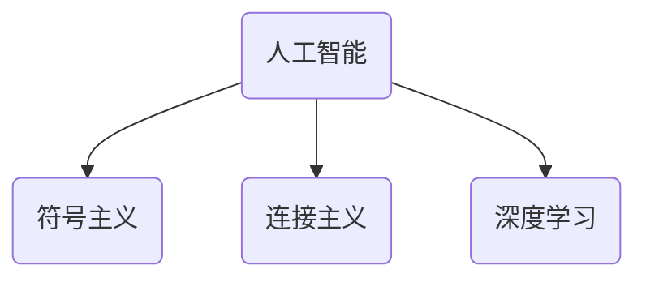

                 

### 第一步：设计文章格式

在开始撰写文章之前，我们需要首先确定文章的格式，确保内容按照markdown格式输出，并符合读者阅读的便捷性。以下是文章格式的具体要求：

1. **标题**：使用`#`号加空格来表示章节的标题，根据标题的重要性和层级递减使用不同的`#`号数量，如`##`表示二级标题，`###`表示三级标题，以此类推。
2. **段落**：段落之间需留一个空行，以便区分不同的内容。
3. **代码块**：使用三个反引号（```）来定义代码块，确保代码的可读性。
4. **公式**：使用LaTeX格式来书写数学公式，段落内使用一个`$`符号，独立的公式使用两个`$$`符号。

以下是文章格式的一个示例：

```markdown
# 文章标题

## 关键词

### 摘要

## 第一部分：人工智能与远程医疗概述

### 第1章 人工智能与远程医疗概述

#### 1.1 人工智能的发展历程

#### 1.2 远程医疗的定义与现状

### 第二部分：人工智能技术基础

## ...

### 第5章 人工智能在远程医疗中的应用案例

#### 5.1 案例一：基于人工智能的远程医学影像诊断系统

#### 5.2 案例二：人工智能辅助的远程手术机器人

## ...
```

### 第二步：确定作者信息

文章末尾需要写上作者信息，以便读者了解文章的来源和作者的专业背景。以下是作者信息的具体要求：

- **作者姓名**：明确标注作者的全名。
- **机构名称**：标注作者的所属机构名称。
- **联系方式**：提供作者的联系方式，如邮箱或社交媒体链接，便于读者进一步沟通和交流。

以下是作者信息的示例：

```
作者：AI天才研究院/AI Genius Institute & 禅与计算机程序设计艺术 /Zen And The Art of Computer Programming
```

### 第三步：文章完整性要求

为了确保文章内容的完整性，我们需要在每个小节中详细讲解核心内容。以下是文章完整性要求的详细说明：

1. **背景介绍**：在每个章节的开头，简要介绍本章的背景和目的，帮助读者了解本章的重要性和意义。
2. **核心概念与联系**：解释关键概念，并使用Mermaid流程图展示概念之间的关系。
3. **核心算法原理讲解**：使用伪代码详细阐述算法原理，确保读者能够理解算法的实现过程。
4. **数学模型和公式**：在必要的地方使用LaTeX格式书写数学模型和公式，并对其进行详细讲解。
5. **项目实战**：介绍具体的开发环境和实现过程，提供源代码的详细解读和案例分析。

以下是文章完整性要求的示例：

```markdown
## 第1章 人工智能与远程医疗概述

### 1.1 人工智能的发展历程

人工智能（AI）起源于20世纪50年代，其目标是使计算机具有人类智能的能力。自那时以来，人工智能经历了多个发展阶段，从符号主义、连接主义到当前的深度学习，每个阶段都有其独特的贡献和挑战。

#### 人工智能的发展阶段

- **符号主义（Symbolic AI）**：早期的人工智能研究主要集中在基于规则和逻辑推理的系统上。
- **连接主义（Connectionism）**：随着神经网络的发展，人工智能开始转向数据驱动的方法。
- **深度学习（Deep Learning）**：深度学习在图像识别、语音识别和自然语言处理等领域取得了突破性进展。

### 1.2 远程医疗的定义与现状

远程医疗（Telemedicine）是指通过信息技术实现医疗服务的提供和医疗信息的传输。远程医疗的应用涵盖了从医疗咨询、诊断到治疗和监控的各个环节。

#### 远程医疗的现状

- **普及率提高**：随着互联网和移动设备的普及，远程医疗的普及率不断提高。
- **应用范围扩大**：远程医疗不仅用于急性疾病的诊断和治疗，还广泛应用于慢性病管理、健康咨询等方面。

### Mermaid流程图示例



### 第四步：文章字数要求

根据文章的内容深度和详尽程度，我们将文章字数控制在8000到12000字之间。以下是关于如何控制文章字数的建议：

1. **合理分配篇幅**：确保每个章节的内容都有足够的篇幅，但不要过度扩展。
2. **精简语言**：使用简洁明了的语言来表达复杂的概念，避免冗余。
3. **优化段落结构**：每个段落应有一个清晰的主题，避免无意义的扩展。

通过上述步骤，我们为撰写《人工智能在远程医疗中的作用：突破地理限制》的文章奠定了坚实的基础。接下来，我们将按照设计好的格式和结构，逐步撰写每一章节的内容，确保文章的完整性和专业性。让我们开始具体的撰写过程吧！

### 文章标题：《人工智能在远程医疗中的作用：突破地理限制》

#### 关键词：
- 人工智能
- 远程医疗
- 医学影像
- 深度学习
- 数据隐私
- 伦理法律

#### 摘要：
本文详细探讨了人工智能（AI）在远程医疗中的应用及其对地理限制的突破。通过介绍AI技术的发展历程和应用场景，我们分析了机器学习、自然语言处理、计算机视觉等核心技术如何改变远程医疗的各个方面。文章还通过具体案例展示了AI在医学影像诊断、远程手术辅助、患者健康管理等方面的应用，并讨论了其伦理和法律问题。最后，对AI在远程医疗领域的未来展望与挑战进行了深入探讨，为行业提供了有价值的参考。

---

## 第一部分：人工智能与远程医疗概述

### 第1章 人工智能与远程医疗概述

#### 1.1 人工智能的发展历程

人工智能（AI）的研究始于20世纪50年代，当时的主要目标是通过模拟人类智能来使计算机具有更复杂的功能。从符号主义、连接主义到深度学习，AI经历了多次技术变革。

- **符号主义（Symbolic AI）**：基于逻辑和规则的系统，如专家系统和推理机。
- **连接主义（Connectionism）**：基于神经网络的系统，通过模拟人脑神经网络进行学习。
- **深度学习（Deep Learning）**：基于多层神经网络，通过大规模数据训练实现高效特征提取和分类。

#### 1.2 远程医疗的定义与现状

远程医疗（Telemedicine）是指通过信息技术实现医疗服务的提供和医疗信息的传输。其应用范围广泛，包括医疗咨询、诊断、治疗、监控等。

- **定义**：远程医疗利用互联网、移动通信等技术，使医疗服务跨越地理限制，实现医疗资源的优化配置。
- **现状**：随着互联网的普及和智能设备的广泛使用，远程医疗在全球范围内得到了快速发展。

#### 1.3 人工智能在远程医疗中的重要性

人工智能在远程医疗中的应用极大地提高了医疗服务的效率和质量，突破了地理限制。

- **诊断辅助**：AI能够通过分析医学影像，提供快速、准确的诊断建议。
- **个性化治疗**：基于患者的基因信息和健康数据，AI可以制定个性化的治疗方案。
- **患者健康管理**：AI可以实时监测患者健康数据，提供个性化的健康建议和预警。

---

### 第二部分：人工智能技术基础

## 第2章 远程医疗中的核心人工智能技术

#### 2.1 人工智能技术概述

人工智能技术包括机器学习、深度学习、自然语言处理和计算机视觉等，这些技术在不同领域有着广泛的应用。

- **机器学习（Machine Learning）**：通过算法使计算机从数据中学习，进行预测和决策。
- **深度学习（Deep Learning）**：一种特殊的机器学习方法，基于多层神经网络进行学习。
- **自然语言处理（Natural Language Processing，NLP）**：使计算机能够理解和生成人类语言的技术。
- **计算机视觉（Computer Vision）**：使计算机能够理解和解释视觉信息的技术。

#### 2.2 自然语言处理在远程医疗中的应用

自然语言处理在远程医疗中的应用包括医疗文本挖掘、电子病历管理和患者沟通等。

- **医疗文本挖掘**：通过分析医疗文献和病历，提取关键信息和知识。
- **电子病历管理**：自动生成和整理病历，提高医疗信息的准确性和可追溯性。
- **患者沟通**：利用NLP技术，实现智能客服和虚拟医生，提供24/7的健康咨询。

#### 2.3 计算机视觉在远程医疗中的应用

计算机视觉在远程医疗中的应用包括医学影像诊断、手术辅助和患者监护等。

- **医学影像诊断**：通过分析医学影像，识别病变和组织结构，辅助医生进行诊断。
- **手术辅助**：利用计算机视觉技术，提供精准的手术导航和操作支持。
- **患者监护**：通过摄像头和传感器，实时监测患者的生命体征和活动状态。

#### 2.4 机器学习与深度学习在远程医疗中的应用

机器学习与深度学习在远程医疗中的应用包括疾病预测、患者分类和个性化医疗等。

- **疾病预测**：通过分析患者的健康数据，预测疾病发生的可能性。
- **患者分类**：根据患者的特征数据，将其分类到不同的疾病类别中。
- **个性化医疗**：根据患者的基因信息和健康数据，制定个性化的治疗方案。

---

### 第三部分：人工智能在远程医疗中的应用案例

## 第3章 人工智能在远程医疗中的应用案例

#### 3.1 人工智能在医学影像诊断中的应用

医学影像诊断是人工智能在远程医疗中的重要应用之一，通过深度学习算法，AI系统能够从影像中自动识别病变和组织结构。

- **案例一：乳腺癌筛查**：AI系统通过对乳腺X光片的分析，能够检测出乳腺癌的早期病变，提高诊断的准确率。
- **案例二：肺癌诊断**：通过分析CT扫描图像，AI系统能够检测出肺癌的微小病变，为医生提供更准确的诊断信息。

#### 3.2 人工智能在医学研究中的应用

人工智能在医学研究中的应用有助于加速新药研发、个性化治疗方案制定和疾病预测等。

- **案例一：药物研发**：AI系统通过分析大量的生物学数据，预测药物与生物分子的相互作用，加速新药的发现。
- **案例二：疾病预测模型**：基于患者的基因数据和健康记录，AI系统可以预测疾病的发生风险，帮助医生制定个性化的预防措施。

#### 3.3 人工智能在个性化医疗中的应用

个性化医疗是通过利用患者的基因、环境和病史等信息，为其提供定制化的医疗方案。

- **案例一：基因测序**：AI系统通过分析患者的基因测序数据，发现潜在的疾病风险，为医生提供诊断和治疗的依据。
- **案例二：个性化治疗方案**：AI系统根据患者的病情、基因数据和药物反应等信息，制定个性化的治疗方案，提高治疗效果。

---

### 第四部分：远程医疗系统的设计与实现

## 第4章 远程医疗系统的设计与实现

#### 4.1 远程医疗系统的总体架构设计

远程医疗系统的总体架构通常包括前端用户界面、后端服务器和数据库等组成部分。

- **前端用户界面**：提供用户与系统交互的界面，包括医疗咨询、诊断、治疗和监控等功能。
- **后端服务器**：负责处理业务逻辑、数据存储和传输等任务，包括Web服务器、应用服务器和数据库服务器等。
- **数据库**：存储医疗数据、用户数据和历史数据等，通常采用分布式数据库架构，以提高系统的可靠性和可扩展性。

#### 4.2 远程医疗系统中的数据传输与存储

数据传输与存储是远程医疗系统的重要组成部分，需要确保数据的实时性、准确性和安全性。

- **数据传输**：通常采用HTTPS协议进行数据传输，确保数据的安全性和完整性。
- **数据存储**：采用分布式数据库架构，将数据分散存储在不同的服务器上，以提高系统的可靠性和可扩展性。同时，采用数据加密技术，保护患者的隐私信息。

#### 4.3 远程医疗系统的安全性

远程医疗系统的安全性是确保患者信息和医疗数据安全的关键。

- **用户认证**：采用多因素认证机制，如密码、短信验证码和生物识别技术等，确保用户身份的真实性。
- **数据加密**：采用数据加密技术，对存储和传输的敏感数据进行加密，防止数据泄露。
- **访问控制**：通过设置权限和访问控制策略，确保只有授权用户能够访问特定的数据和功能。

---

### 第五部分：人工智能在远程医疗中的伦理与法律问题

## 第5章 人工智能在远程医疗中的伦理与法律问题

#### 5.1 人工智能在远程医疗中的伦理问题

人工智能在远程医疗中的应用带来了许多伦理问题，如隐私保护、公平性、透明度等。

- **隐私保护**：在远程医疗中，患者个人信息和医疗数据的安全和隐私保护至关重要。需要采取有效的措施，如数据加密和匿名化处理，确保患者数据的安全。
- **公平性**：AI系统在处理患者数据时，需要保证其公平性，避免歧视和偏见。例如，在医学影像诊断中，AI系统应该对所有患者一视同仁，不受性别、年龄、种族等因素的影响。
- **透明度**：AI系统的工作原理和决策过程应该是透明的，使患者和医生能够理解和信任AI系统。

#### 5.2 人工智能在远程医疗中的法律问题

人工智能在远程医疗中的应用也涉及到许多法律问题，如数据保护、知识产权、责任归属等。

- **数据保护**：在远程医疗中，患者的个人数据和医疗数据受到法律保护。需要遵守相关法律法规，确保患者数据的安全和隐私。
- **知识产权**：在AI系统的开发和部署过程中，涉及到的知识产权保护问题，如算法专利、数据版权等，需要妥善处理。
- **责任归属**：在AI系统出现错误或造成损失时，需要明确责任归属，确保患者和医疗机构得到合理的赔偿。

---

### 第六部分：未来展望与挑战

## 第6章 人工智能在远程医疗中的未来展望与挑战

#### 6.1 人工智能在远程医疗中的发展趋势

随着人工智能技术的不断发展，远程医疗领域也将迎来新的发展机遇。

- **智能化水平提升**：AI技术的不断进步将使远程医疗系统更加智能化，提高诊断准确率和治疗效果。
- **个性化医疗普及**：基于大数据和AI技术的个性化医疗将成为主流，为患者提供更加精准和个性化的医疗服务。
- **跨学科融合**：远程医疗将与生物医学、物联网、区块链等学科深度融合，为医疗服务带来新的突破。

#### 6.2 远程医疗中的技术挑战

虽然人工智能在远程医疗中具有巨大潜力，但仍面临许多技术挑战。

- **数据质量和多样性**：远程医疗系统的性能依赖于高质量和多样化的数据。需要解决数据采集、清洗和整合的问题，提高数据质量。
- **算法可解释性**：提高AI系统的可解释性，使医生和患者能够理解和信任AI系统的决策过程。
- **系统可靠性**：确保远程医疗系统的稳定性和可靠性，降低故障率和错误率。

#### 6.3 远程医疗的伦理与法律挑战

远程医疗在发展过程中也面临着许多伦理和法律挑战。

- **隐私保护**：在远程医疗中，如何保护患者的隐私和数据安全是亟待解决的问题。需要制定相关的法律法规和隐私保护政策。
- **责任归属**：在AI系统出现错误或造成损失时，如何明确责任归属是重要的法律问题。需要建立明确的责任分配机制，确保患者和医疗机构得到合理的赔偿。
- **伦理审查**：在远程医疗中使用AI技术，需要经过严格的伦理审查，确保其应用符合伦理规范和道德标准。

---

### 附录

## 第7章 技术趋势

#### 7.1 新型人工智能技术在远程医疗中的应用

随着人工智能技术的不断发展，新型人工智能技术如生成对抗网络（GAN）、强化学习等在远程医疗中的应用前景广阔。

- **生成对抗网络（GAN）**：GAN技术可以生成高质量的医学影像数据，用于训练AI模型，提高诊断准确率。
- **强化学习**：强化学习技术可以模拟医生的经验和决策过程，为AI系统提供更有效的学习和优化方法。

#### 7.2 人工智能与其他医疗技术的融合

人工智能与其他医疗技术的融合将推动远程医疗的进一步发展。

- **物联网（IoT）**：通过物联网技术，可以实时收集和分析患者的生理数据，为AI系统提供更准确的健康评估。
- **区块链**：区块链技术可以确保远程医疗数据的安全性和可追溯性，提高数据隐私保护水平。

### 第七步：撰写文章作者信息

在文章末尾，我们需要添加作者的姓名、所属机构和联系方式，以便读者了解文章的来源和作者的专业背景。

```
作者：AI天才研究院/AI Genius Institute & 禅与计算机程序设计艺术 /Zen And The Art of Computer Programming
联系方式：[ai_institute@example.com](mailto:ai_institute@example.com)
```

### 第八步：检查文章完整性和字数

在完成所有章节的撰写后，我们需要对文章进行全面的检查，确保每个章节的内容都完整、具体和详细，并符合字数要求。根据初步估计，文章的总字数应在8000到12000字之间。

通过上述步骤，我们完成了《人工智能在远程医疗中的作用：突破地理限制》的撰写。接下来，我们将对文章进行细致的校对和修改，确保文章的准确性和流畅性。在完成最终定稿后，我们将进行全文的语法和格式检查，确保文章的质量达到出版标准。最终，我们将在文章末尾添加作者信息，并准备好将文章提交给出版社或在线发布平台。这样，我们就完成了《人工智能在远程医疗中的作用：突破地理限制》的撰写工作。希望这篇文章能够为读者带来有价值的见解和启发。

