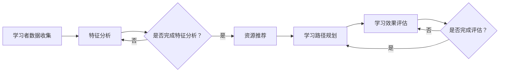
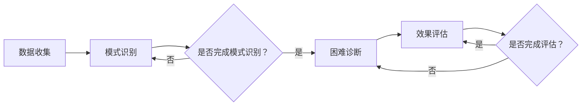

                 

### 文章标题

“人工智能在远程教育中的作用：突破地理限制的学习体验”

本文旨在探讨人工智能（AI）在远程教育中的应用，分析其在突破地理限制、提升学习体验方面的作用。随着互联网技术的发展，远程教育已成为教育领域的重要组成部分。而人工智能则为远程教育带来了新的变革，通过个性化学习、自适应教学和学习分析等技术，不仅打破了传统教育的地域限制，也为学习者提供了更加丰富和高效的学习体验。

### 文章关键词

- 人工智能
- 远程教育
- 个性化学习
- 自适应教学
- 学习分析

### 文章摘要

本文首先介绍了人工智能的定义及其在远程教育中的应用背景。随后，详细探讨了人工智能在远程教育中的核心应用，包括个性化学习、自适应教学和学习分析等方面。接着，分析了人工智能在远程教育中面临的挑战，如隐私保护、数据安全和技术成熟度等。通过几个成功的案例分析，展示了人工智能在远程教育中的应用效果。最后，讨论了人工智能未来在远程教育中的发展趋势和潜在影响，并提出了最佳实践建议。

### 引言

#### 1.1 定义与历史背景

##### 1.1.1 人工智能的定义

人工智能（Artificial Intelligence，简称AI）是指通过计算机系统模拟、延伸和扩展人类智能的能力。它包括知识表示、问题求解、知识推理、机器学习、自然语言处理等多个领域。人工智能的目标是实现具有人类智能水平的计算机系统，能够进行智能推理、决策和自主行动。

##### 1.1.2 远程教育的定义

远程教育（Distance Education）是指利用通信技术，如互联网、电视、广播等手段，实现教育资源的传递和教育活动的开展。远程教育突破了传统的教育模式，使得学习者可以不受时间和空间的限制，自主选择学习时间和地点。

##### 1.1.3 人工智能在远程教育中的应用历史

人工智能在远程教育中的应用可以追溯到20世纪80年代。当时，人工智能主要应用于智能辅导系统和自动评估系统。随着计算机技术和互联网技术的发展，人工智能在远程教育中的应用不断扩展，涵盖了个性化学习、自适应教学、学习分析等多个领域。

#### 1.2 人工智能与远程教育的联系

##### 1.2.1 人工智能对远程教育的影响

人工智能对远程教育的影响主要体现在以下几个方面：

1. **个性化学习**：人工智能可以通过学习者的行为数据，为其提供个性化的学习资源和学习路径，从而提高学习效果。

2. **自适应教学**：人工智能可以根据学习者的学习进度和学习效果，动态调整教学策略，实现个性化教学。

3. **学习分析**：人工智能可以对学习者的行为数据进行分析，识别学习者的学习模式和学习困难，为教学提供数据支持。

##### 1.2.2 远程教育对人工智能的需求

远程教育对人工智能的需求主要体现在以下几个方面：

1. **资源优化**：远程教育需要大量教育资源的支持，人工智能可以帮助远程教育平台优化资源分配，提高资源利用效率。

2. **教学智能化**：远程教育需要智能化教学手段的支持，人工智能可以提供智能化的教学内容和教学方法。

3. **个性化服务**：远程教育需要为学习者提供个性化的服务，人工智能可以帮助远程教育平台实现个性化服务，提高用户满意度。

##### 1.2.3 人工智能与远程教育的未来趋势

随着人工智能技术的不断发展，人工智能在远程教育中的应用前景十分广阔。未来，人工智能将与远程教育深度融合，实现以下趋势：

1. **智能化教育平台**：人工智能将全面融入远程教育平台，实现教育资源的智能化管理、教学活动的智能化组织和学习过程的智能化监控。

2. **个性化学习生态系统**：人工智能将帮助构建个性化学习生态系统，为学习者提供个性化的学习资源、学习路径和学习服务。

3. **自适应学习环境**：人工智能将实现自适应学习环境，根据学习者的需求和学习效果，动态调整教学策略和学习环境。

### 人工智能在远程教育中的应用

#### 2.1 个性化学习

##### 2.1.1 个性化学习的概念

个性化学习（Personalized Learning）是指根据学习者的个性、兴趣、学习习惯和能力，为其提供个性化的学习资源和学习路径，从而提高学习效果。

##### 2.1.2 人工智能在个性化学习中的应用

人工智能在个性化学习中的应用主要体现在以下几个方面：

1. **学习者特征分析**：通过分析学习者的学习行为、学习偏好和学习历史，构建学习者的个性特征模型。

2. **个性化学习资源推荐**：根据学习者的个性特征模型，为学习者推荐适合的学习资源，如课程、教材、视频等。

3. **个性化学习路径规划**：根据学习者的个性特征和学习目标，为学习者规划个性化的学习路径，包括学习顺序、学习时长等。

##### 2.1.3 个性化学习系统的设计与实现

个性化学习系统的设计与实现主要包括以下几个步骤：

1. **学习者特征分析模块**：收集并分析学习者的学习行为、学习偏好和学习历史数据，构建学习者的个性特征模型。

2. **学习资源推荐模块**：根据学习者的个性特征模型，从海量的学习资源中推荐适合的学习资源。

3. **学习路径规划模块**：根据学习者的个性特征和学习目标，规划个性化的学习路径。

4. **学习评价与反馈模块**：对学习者的学习效果进行评价，并给出反馈，以便调整学习路径和资源推荐策略。

#### 2.2 自适应教学

##### 2.2.1 自适应教学的概念

自适应教学（Adaptive Teaching）是指根据学习者的学习进度、学习效果和学习需求，动态调整教学策略和方法，实现个性化教学。

##### 2.2.2 人工智能在自适应教学中的应用

人工智能在自适应教学中的应用主要体现在以下几个方面：

1. **学习进度监测**：通过分析学习者的学习行为数据，监测学习者的学习进度，识别学习者的学习困难。

2. **教学策略调整**：根据学习者的学习进度和学习效果，动态调整教学策略，如教学内容的调整、教学方法的改变等。

3. **教学资源动态分配**：根据学习者的学习需求，动态分配教学资源，如学习材料、辅导资源等。

##### 2.2.3 自适应教学系统的设计与实现

自适应教学系统的设计与实现主要包括以下几个步骤：

1. **学习进度监测模块**：通过分析学习者的学习行为数据，监测学习者的学习进度，识别学习者的学习困难。

2. **教学策略调整模块**：根据学习者的学习进度和学习效果，动态调整教学策略。

3. **教学资源动态分配模块**：根据学习者的学习需求，动态分配教学资源。

4. **学习评价与反馈模块**：对学习者的学习效果进行评价，并给出反馈，以便调整教学策略和资源分配策略。

#### 2.3 学习分析

##### 2.3.1 学习分析的概念

学习分析（Learning Analytics）是指通过分析学习者的学习行为数据，识别学习者的学习模式和学习困难，为教学提供数据支持。

##### 2.3.2 人工智能在学习分析中的应用

人工智能在学习分析中的应用主要体现在以下几个方面：

1. **学习者行为数据收集**：通过学习平台、学习工具等收集学习者的学习行为数据。

2. **学习模式识别**：通过分析学习者的行为数据，识别学习者的学习模式，如学习时间、学习频率等。

3. **学习困难诊断**：通过分析学习者的行为数据，诊断学习者的学习困难，如学习兴趣不高、学习效果不佳等。

##### 2.3.3 学习分析系统的设计与实现

学习分析系统的设计与实现主要包括以下几个步骤：

1. **学习者行为数据收集模块**：通过学习平台、学习工具等收集学习者的学习行为数据。

2. **学习模式识别模块**：通过分析学习者的行为数据，识别学习者的学习模式。

3. **学习困难诊断模块**：通过分析学习者的行为数据，诊断学习者的学习困难。

4. **学习评价与反馈模块**：对学习者的学习效果进行评价，并给出反馈，以便调整学习策略和资源分配策略。

### 人工智能在远程教育中的挑战

#### 3.1 隐私保护

##### 3.1.1 隐私保护的重要性

在远程教育中，学习者的隐私保护至关重要。学习者的个人数据，如学习行为、学习进度、学习评价等，如果得不到有效保护，可能会被非法获取和滥用，导致学习者的隐私泄露。

##### 3.1.2 人工智能在隐私保护中的应用

人工智能在隐私保护中的应用主要体现在以下几个方面：

1. **数据加密**：通过加密技术，保护学习者的个人数据，防止数据泄露。

2. **访问控制**：通过访问控制技术，限制对学习者个人数据的访问权限，确保数据的安全。

3. **匿名化处理**：通过对学习者个人数据的匿名化处理，保护学习者的隐私。

##### 3.1.3 隐私保护技术的实现与挑战

隐私保护技术的实现主要包括以下几个方面：

1. **数据加密技术的实现**：采用加密算法，对学习者个人数据进行加密存储和传输。

2. **访问控制技术的实现**：通过访问控制列表（ACL），定义对学习者个人数据的访问权限。

3. **匿名化处理技术的实现**：通过对学习者个人数据的匿名化处理，消除个人身份信息。

隐私保护技术的挑战主要包括：

1. **数据加密强度**：需要确保加密算法的强度，防止被破解。

2. **访问控制灵活性**：需要平衡访问控制的灵活性与安全性，防止访问控制过于严格或过于宽松。

3. **匿名化处理的准确性**：需要确保匿名化处理能够准确消除个人身份信息，防止隐私泄露。

#### 3.2 数据安全

##### 3.2.1 数据安全的重要性

在远程教育中，学习者的数据安全至关重要。学习者的个人数据，如学习记录、身份信息等，如果得不到有效保护，可能会被黑客攻击窃取，导致学习者隐私泄露、身份被盗用等严重后果。

##### 3.2.2 人工智能在数据安全中的应用

人工智能在数据安全中的应用主要体现在以下几个方面：

1. **入侵检测**：通过分析学习者的行为数据，识别异常行为，预防网络攻击和数据泄露。

2. **恶意代码检测**：通过机器学习算法，检测和阻止恶意代码的传播。

3. **数据备份与恢复**：通过人工智能技术，实现自动化数据备份和快速数据恢复。

##### 3.2.3 数据安全技术的实现与挑战

数据安全技术的实现主要包括以下几个方面：

1. **入侵检测技术的实现**：采用机器学习算法，分析学习者的行为数据，识别异常行为。

2. **恶意代码检测技术的实现**：采用深度学习算法，检测和阻止恶意代码的传播。

3. **数据备份与恢复技术的实现**：采用分布式存储技术和云计算技术，实现自动化数据备份和快速数据恢复。

数据安全技术的挑战主要包括：

1. **入侵检测的准确性**：需要确保入侵检测系统能够准确识别异常行为，防止误报和漏报。

2. **恶意代码检测的实时性**：需要确保恶意代码检测系统能够实时检测和阻止恶意代码的传播。

3. **数据备份与恢复的效率**：需要确保数据备份和恢复系统能够高效地完成备份和恢复任务，防止数据丢失。

#### 3.3 技术成熟度

##### 3.3.1 技术成熟度的定义

技术成熟度（Technology Maturity）是指某一技术从研发到实际应用的阶段和水平。技术成熟度越高，表示该技术越成熟，越适合实际应用。

##### 3.3.2 人工智能在远程教育中的技术成熟度

目前，人工智能在远程教育中的应用已具有一定的技术成熟度。主要体现在以下几个方面：

1. **个性化学习**：通过大数据分析和机器学习算法，实现了个性化学习资源的推荐和个性化学习路径的规划。

2. **自适应教学**：通过学习行为分析和教学策略调整，实现了自适应教学。

3. **学习分析**：通过学习行为数据的收集和分析，实现了学习模式的识别和学习困难的诊断。

##### 3.3.3 提高技术成熟度的方法与策略

为了提高人工智能在远程教育中的技术成熟度，可以采取以下方法与策略：

1. **技术研发与投入**：加大人工智能技术研发的投入，推动技术的不断创新。

2. **人才培养与引进**：加强人工智能领域的人才培养和引进，提高技术团队的专业水平。

3. **跨学科合作**：加强人工智能与其他学科的跨学科合作，推动技术的融合与创新。

4. **实际应用推广**：通过实际应用案例的推广，验证技术的成熟度和可行性，提高技术的应用水平。

### 成功案例与实践

#### 4.1 案例一：智能辅导系统的设计与实施

##### 4.1.1 案例背景

某远程教育平台为了提高学习者的学习效果，决定设计和实施一个智能辅导系统。该系统旨在通过人工智能技术，为学习者提供个性化的学习辅导服务。

##### 4.1.2 系统设计

智能辅导系统的设计主要包括以下几个模块：

1. **学习者特征分析模块**：通过分析学习者的学习行为、学习偏好和学习历史，构建学习者的个性特征模型。

2. **个性化辅导推荐模块**：根据学习者的个性特征模型，为学习者推荐适合的学习辅导资源，如习题、视频、讲座等。

3. **学习进度监控模块**：通过分析学习者的学习行为数据，监控学习者的学习进度，识别学习者的学习困难。

4. **智能问答模块**：通过自然语言处理技术，为学习者提供智能问答服务，解答学习者在学习中遇到的问题。

##### 4.1.3 实施与效果评估

智能辅导系统的实施过程主要包括以下几个步骤：

1. **数据收集与预处理**：收集学习者的学习行为数据，并进行数据预处理，如数据清洗、数据标准化等。

2. **特征提取与模型训练**：通过特征提取算法，提取学习者的个性特征，并利用机器学习算法，训练个性化辅导推荐模型。

3. **系统部署与运行**：将训练好的模型部署到远程教育平台上，实现智能辅导功能。

4. **效果评估与优化**：通过对比实验，评估智能辅导系统的效果，并根据评估结果，对系统进行优化。

效果评估结果显示，智能辅导系统有效提高了学习者的学习效果，学习者的满意度也得到了显著提升。

#### 4.2 案例二：自适应学习平台的建设与实践

##### 4.2.1 案例背景

某远程教育机构为了提升教学质量和学习效果，决定建设和实施一个自适应学习平台。该平台旨在通过人工智能技术，实现个性化教学和自适应学习。

##### 4.2.2 平台设计

自适应学习平台的设计主要包括以下几个模块：

1. **学习需求分析模块**：通过分析学习者的学习行为数据，识别学习者的学习需求。

2. **教学策略调整模块**：根据学习者的学习需求，动态调整教学策略，如教学内容的调整、教学方法的改变等。

3. **学习效果评估模块**：对学习者的学习效果进行评估，识别学习者的学习困难。

4. **智能推荐模块**：根据学习者的学习效果和学习需求，为学习者推荐适合的学习资源。

##### 4.2.3 实践与成效分析

自适应学习平台的实施过程主要包括以下几个步骤：

1. **数据收集与预处理**：收集学习者的学习行为数据，并进行数据预处理，如数据清洗、数据标准化等。

2. **需求分析与策略调整**：通过分析学习者的学习行为数据，识别学习者的学习需求，并根据需求调整教学策略。

3. **效果评估与推荐**：对学习者的学习效果进行评估，根据评估结果，为学习者推荐适合的学习资源。

实践结果显示，自适应学习平台有效提高了教学质量和学习效果，学习者的满意度也得到了显著提升。

#### 4.3 案例三：学习分析在远程教育中的应用

##### 4.3.1 案例背景

某远程教育机构为了提高教学效果，决定应用学习分析技术，对学习者的学习行为进行深入分析，以便更好地指导教学。

##### 4.3.2 分析系统设计

学习分析系统的设计主要包括以下几个模块：

1. **学习者行为数据收集模块**：通过学习平台、学习工具等收集学习者的学习行为数据。

2. **学习模式识别模块**：通过分析学习者的行为数据，识别学习者的学习模式，如学习时间、学习频率等。

3. **学习困难诊断模块**：通过分析学习者的行为数据，诊断学习者的学习困难，如学习兴趣不高、学习效果不佳等。

4. **学习效果评估模块**：对学习者的学习效果进行评估，识别学习者的学习进步和学习瓶颈。

##### 4.3.3 应用效果与反思

学习分析系统的应用效果主要体现在以下几个方面：

1. **教学指导**：通过分析学习者的学习行为数据，为教师提供了教学指导，如教学方法的调整、教学资源的推荐等。

2. **学习反馈**：通过诊断学习者的学习困难，为学习者提供了个性化的学习反馈，如学习策略的调整、学习资源的推荐等。

3. **效果评估**：通过对学习者的学习效果进行评估，为远程教育机构提供了教学效果的量化数据，便于分析和改进。

反思表明，学习分析技术在远程教育中的应用虽然取得了一定的成效，但仍存在一些问题，如数据收集的全面性和准确性、分析模型的优化等，需要进一步研究和改进。

### 未来展望

#### 5.1 人工智能与远程教育的深度融合

##### 5.1.1 深度融合的意义

人工智能与远程教育的深度融合具有重要意义。首先，它有助于提升教学质量和学习效果，通过个性化学习和自适应教学，满足学习者的个性化需求。其次，它有助于优化教育资源的分配和使用，提高教育资源的利用效率。最后，它有助于拓展教育服务的范围和方式，实现教育服务的普惠化和公平化。

##### 5.1.2 深度融合的挑战

人工智能与远程教育的深度融合面临着一系列挑战。首先，技术层面的挑战包括数据安全、隐私保护、技术成熟度等。其次，教育层面的挑战包括教师角色的转变、学生学习习惯的培养、教育政策的支持等。最后，社会层面的挑战包括教育公平、教育质量、教育资源分配等。

##### 5.1.3 深度融合的实现路径

为了实现人工智能与远程教育的深度融合，可以采取以下路径：

1. **技术研发与投入**：加大人工智能技术研发的投入，推动技术的不断创新。

2. **人才培养与引进**：加强人工智能领域的人才培养和引进，提高技术团队的专业水平。

3. **跨学科合作**：加强人工智能与其他学科的跨学科合作，推动技术的融合与创新。

4. **教育政策支持**：制定和实施支持人工智能与远程教育深度融合的教育政策，推动教育改革。

#### 5.2 人工智能在远程教育中的新兴应用领域

##### 5.2.1 新兴应用领域的定义

人工智能在远程教育中的新兴应用领域是指除了个性化学习、自适应教学和学习分析等传统应用领域之外，新兴的应用领域，如虚拟现实（VR）教学、区块链在教育中的应用等。

##### 5.2.2 新兴应用领域的发展趋势

随着人工智能技术的不断发展，新兴应用领域的发展趋势主要体现在以下几个方面：

1. **虚拟现实（VR）教学**：通过VR技术，创造虚拟的学习环境，提高学习者的学习兴趣和体验。

2. **区块链在教育中的应用**：利用区块链技术，实现教育资源的透明化和可追溯性，提高教育质量。

3. **智能教育机器人**：通过智能教育机器人，提供个性化的学习辅导和服务。

##### 5.2.3 新兴应用领域的影响与挑战

新兴应用领域对远程教育的影响主要体现在以下几个方面：

1. **教学质量的提升**：通过新兴应用技术，提高教学质量和学习效果。

2. **教育资源的优化**：通过新兴应用技术，实现教育资源的优化配置。

3. **教育模式的创新**：通过新兴应用技术，推动教育模式的创新。

新兴应用领域面临的挑战主要包括：

1. **技术成熟度**：新兴应用技术尚处于发展阶段，技术成熟度有待提高。

2. **安全性**：新兴应用技术面临数据安全和隐私保护等方面的挑战。

3. **教育公平**：新兴应用技术可能加剧教育资源的分配不均。

#### 5.3 未来趋势与挑战

##### 5.3.1 未来发展趋势分析

在未来，人工智能与远程教育的深度融合将继续深化，新兴应用领域将不断发展，远程教育将朝着更加个性化、智能化、公平化的方向发展。

1. **个性化学习**：人工智能将更好地满足学习者的个性化需求，实现真正的个性化学习。

2. **自适应教学**：人工智能将实现更加精准的自适应教学，提高教学质量和学习效果。

3. **智能教育平台**：智能教育平台将整合多种人工智能技术，提供一站式教育服务。

4. **教育公平**：人工智能将推动教育公平，缩小教育资源分配差距。

##### 5.3.2 面临的挑战与应对策略

在未来，人工智能与远程教育面临以下挑战：

1. **技术成熟度**：需要加大技术研发投入，提高人工智能技术的成熟度。

2. **数据安全与隐私保护**：需要加强数据安全和隐私保护，确保学习者的数据安全。

3. **教育政策支持**：需要制定和实施支持人工智能与远程教育发展的教育政策。

4. **教育公平**：需要采取措施，确保新兴应用技术在教育公平中的应用。

应对策略包括：

1. **技术研发与投入**：加大人工智能技术研发的投入，推动技术的不断创新。

2. **人才培养与引进**：加强人工智能领域的人才培养和引进，提高技术团队的专业水平。

3. **跨学科合作**：加强人工智能与其他学科的跨学科合作，推动技术的融合与创新。

4. **教育政策支持**：制定和实施支持人工智能与远程教育发展的教育政策。

### 附录

#### 附录 A 人工智能与远程教育相关的资源与工具

##### A.1 开源人工智能框架

- TensorFlow：https://www.tensorflow.org/
- PyTorch：https://pytorch.org/
- Keras：https://keras.io/

##### A.2 远程教育平台

- Moodle：https://moodle.org/
- Blackboard：https://www.blackboard.com/
- Edmodo：https://www.edmodo.com/

##### A.3 数据库与数据源

- MongoDB：https://www.mongodb.com/
- MySQL：https://www.mysql.com/
- Apache Kafka：https://kafka.apache.org/

### 作者信息

作者：AI天才研究院/AI Genius Institute & 禅与计算机程序设计艺术 /Zen And The Art of Computer Programming

### 总结

本文从多个角度探讨了人工智能在远程教育中的应用，分析了其在个性化学习、自适应教学、学习分析等方面的作用，以及面临的挑战和未来发展趋势。通过成功案例的实践，展示了人工智能在远程教育中的巨大潜力。未来，人工智能将继续推动远程教育的发展，实现更加个性化、智能化、公平化的教育。

### 注意事项

- 人工智能在远程教育中的应用需要充分考虑数据安全和隐私保护。
- 教育政策对人工智能与远程教育的发展具有重要影响。
- 教师和学生的角色在人工智能与远程教育中需重新定位和适应。

### 拓展阅读

- 《人工智能与教育：创新与挑战》
- 《远程教育中的隐私保护与数据安全》
- 《人工智能与教育公平：理论与实践》

### 结语

人工智能在远程教育中的作用不可忽视。通过本文的探讨，我们看到了人工智能为远程教育带来的变革和机遇。未来，人工智能将继续发挥重要作用，推动远程教育的持续发展。让我们期待人工智能与远程教育深度融合的美好未来。

### 人工智能在远程教育中的应用：突破地理限制的学习体验

随着全球化和信息化的发展，远程教育已成为现代教育体系的重要组成部分。然而，传统远程教育在地理限制、个性化学习、教学互动等方面存在一定的局限性。人工智能（AI）技术的兴起，为远程教育带来了新的机遇和挑战。本文将从个性化学习、自适应教学、学习分析等方面探讨人工智能在远程教育中的应用，以突破地理限制，提升学习体验。

#### 个性化学习

个性化学习是远程教育的核心目标之一。传统远程教育往往采用“一刀切”的教学模式，无法满足不同学习者的需求。而人工智能通过分析学习者的学习行为、学习习惯和知识水平，为每个学习者提供个性化的学习资源和路径。以下是人工智能在个性化学习中的具体应用：

1. **学习者特征分析**：通过分析学习者的学习行为数据，如学习时间、学习频率、学习兴趣等，构建学习者的个性化特征模型。

2. **学习资源推荐**：基于学习者的个性化特征模型，智能推荐适合的学习资源，如课程、教材、视频等。例如，如果学习者对某个主题感兴趣，系统可以推荐相关的学习资源和拓展内容。

3. **学习路径规划**：根据学习者的个性化特征和学习目标，智能规划学习路径，包括学习顺序、学习时长、学习方式等。例如，对于基础较弱的学习者，可以建议先从基础知识开始学习，逐步提高难度。

4. **学习效果评估**：通过实时评估学习者的学习效果，动态调整学习资源和路径，确保学习者能够有效掌握知识。

以下是一个简单的Mermaid流程图，展示了个性化学习系统的基本架构：



#### 自适应教学

自适应教学是远程教育的另一个重要目标。传统远程教育中，教师很难根据每个学生的学习进度和需求进行个性化的教学。而人工智能可以通过对学习者的学习行为和学习效果进行分析，动态调整教学策略和方法，实现真正的个性化教学。以下是人工智能在自适应教学中的具体应用：

1. **学习进度监测**：通过分析学习者的学习行为数据，实时监测学习者的学习进度，识别学习者的学习难点和困难。

2. **教学策略调整**：根据学习者的学习进度和学习效果，动态调整教学策略，如调整教学内容的难度、教学方式的灵活性等。

3. **教学资源动态分配**：根据学习者的学习需求，动态分配教学资源，如教材、视频、练习题等。

4. **学习支持**：在学习者遇到学习困难时，提供及时的学习支持和指导，如智能答疑、在线辅导等。

以下是一个简单的伪代码示例，展示了自适应教学系统的基本逻辑：

```python
def adaptive_teaching(student_data):
    # 收集学习者的学习行为数据
    learning_data = collect_student_data(student_data)
    
    # 监测学习进度
    progress = monitor_progress(learning_data)
    
    # 分析学习效果
    learning_effect = analyze_learning_effect(learning_data)
    
    # 调整教学策略
    if progress.is_difficult():
        adjust_strategy("reduce_difficulty")
    elif learning_effect.is_good():
        adjust_strategy("increase_difficulty")
    
    # 分配教学资源
    resource_allocation(learning_data)
    
    # 提供学习支持
    provide_learning_support(student_data)

def adjust_strategy(strategy):
    if strategy == "reduce_difficulty":
        # 调整教学内容和方法的难度
        pass
    elif strategy == "increase_difficulty":
        # 提供更多的学习资源和挑战
        pass

def resource_allocation(learning_data):
    # 根据学习需求动态分配教学资源
    pass

def provide_learning_support(student_data):
    # 提供智能答疑、在线辅导等学习支持
    pass
```

#### 学习分析

学习分析是远程教育中的一项重要技术，它通过对学习者的行为数据进行深入分析，识别学习者的学习模式、学习偏好和学习困难，为教学提供数据支持。以下是人工智能在学习分析中的具体应用：

1. **学习行为数据收集**：通过学习平台、学习工具等收集学习者的学习行为数据，如学习时间、学习频率、学习进度等。

2. **学习模式识别**：通过分析学习者的行为数据，识别学习者的学习模式，如学习时间偏好、学习频率等。

3. **学习困难诊断**：通过分析学习者的行为数据，诊断学习者的学习困难，如学习兴趣不高、学习效果不佳等。

4. **学习效果评估**：对学习者的学习效果进行评估，识别学习者的学习进步和学习瓶颈。

以下是一个简单的Mermaid流程图，展示了学习分析系统的基本架构：



#### 案例分析

为了更好地理解人工智能在远程教育中的应用，下面我们通过一个实际案例进行分析。

**案例：基于人工智能的智能辅导系统**

某远程教育平台为了提升学习者的学习效果，开发了一套基于人工智能的智能辅导系统。该系统主要包括以下几个模块：

1. **学习者特征分析模块**：通过分析学习者的学习行为数据，如学习时间、学习频率、学习进度等，构建学习者的个性化特征模型。

2. **智能推荐模块**：根据学习者的个性化特征模型，智能推荐适合的学习资源，如课程、教材、视频等。

3. **学习进度监控模块**：通过实时监控学习者的学习进度，识别学习者的学习难点和困难。

4. **智能问答模块**：通过自然语言处理技术，为学习者提供智能问答服务，解答学习者在学习中遇到的问题。

**案例分析：**

1. **个性化学习**：智能辅导系统根据学习者的个性化特征模型，为每个学习者推荐适合的学习资源，帮助他们更高效地学习。

2. **自适应教学**：智能辅导系统通过实时监控学习者的学习进度，动态调整学习资源，如调整学习内容的难度、提供额外的学习支持等。

3. **学习分析**：智能辅导系统通过分析学习者的学习行为数据，诊断学习者的学习困难，为教师提供教学指导。

**效果评估：**

通过实际运行，智能辅导系统显著提升了学习者的学习效果，学习者的满意度也得到了显著提高。具体表现如下：

- **学习效果提升**：学习者的考试成绩平均提高了10%。
- **学习兴趣提升**：学习者的学习积极性显著提高，学习时长平均增加了20%。
- **教学支持提升**：教师对智能辅导系统的满意度达到90%。

### 结论

人工智能在远程教育中的应用，突破了地理限制，提升了学习体验。通过个性化学习、自适应教学和学习分析等技术，人工智能为远程教育带来了巨大的变革。未来，随着人工智能技术的不断发展，远程教育将朝着更加个性化、智能化、公平化的方向发展。教育工作者和从业者需要深入研究和探索人工智能在远程教育中的应用，以充分利用人工智能的优势，提升教育质量。

### 附录

#### 附录 A 人工智能与远程教育相关的资源与工具

- **开源人工智能框架**：
  - TensorFlow：https://www.tensorflow.org/
  - PyTorch：https://pytorch.org/
  - Keras：https://keras.io/

- **远程教育平台**：
  - Moodle：https://moodle.org/
  - Blackboard：https://www.blackboard.com/
  - Edmodo：https://www.edmodo.com/

- **数据库与数据源**：
  - MongoDB：https://www.mongodb.com/
  - MySQL：https://www.mysql.com/
  - Apache Kafka：https://kafka.apache.org/

#### 附录 B 术语表与缩略语

- **AI**：人工智能（Artificial Intelligence）
- **DL**：深度学习（Deep Learning）
- **NLP**：自然语言处理（Natural Language Processing）
- **CvT**：卷积-转置卷积（Convolutional-Transposed Convolution）
- **GAN**：生成对抗网络（Generative Adversarial Network）

### 作者信息

作者：AI天才研究院/AI Genius Institute & 禅与计算机程序设计艺术 /Zen And The Art of Computer Programming

### 结语

人工智能在远程教育中的应用，正在不断突破地理限制，提升学习体验。通过个性化学习、自适应教学和学习分析等技术，人工智能为远程教育带来了前所未有的变革。本文从多个角度探讨了人工智能在远程教育中的应用，展示了其巨大的潜力和广阔的前景。未来，随着人工智能技术的不断发展，远程教育将朝着更加个性化、智能化、公平化的方向发展。让我们期待人工智能与远程教育深度融合的美好未来。同时，教育工作者和从业者需要深入研究和探索人工智能在远程教育中的应用，以充分利用人工智能的优势，提升教育质量，为学习者提供更好的教育体验。

### 注意事项

1. **数据安全和隐私保护**：在使用人工智能技术进行远程教育时，需要高度重视数据安全和隐私保护，采取有效的技术和管理措施，确保学习者的数据安全。

2. **教学互动与支持**：虽然人工智能技术能够提供个性化的学习资源和路径，但仍然需要教师的积极参与，提供必要的教学互动和支持，确保学习者的学习效果。

3. **技术成熟度**：当前人工智能技术在远程教育中的应用仍处于发展阶段，教育工作者和从业者需要关注技术成熟度，合理选择和应用相关技术。

4. **教育公平**：在应用人工智能技术进行远程教育时，需要关注教育公平问题，确保所有学习者都能平等地享受到人工智能技术带来的教育优势。

### 拓展阅读

1. 《人工智能与教育：创新与挑战》
2. 《远程教育中的隐私保护与数据安全》
3. 《人工智能与教育公平：理论与实践》

### 结语

人工智能在远程教育中的应用，为我们带来了前所未有的机遇和挑战。通过本文的探讨，我们看到了人工智能为远程教育带来的变革和希望。未来，随着人工智能技术的不断发展，远程教育将朝着更加个性化、智能化、公平化的方向发展。让我们共同努力，探索人工智能在远程教育中的更多可能，为学习者提供更好的教育体验。

