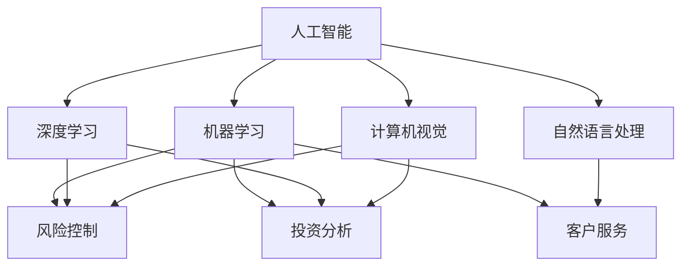
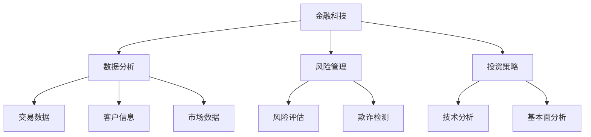

                 

## 文章标题：人工智能在金融领域的应用：从风控到投资的全面革新

> 关键词：人工智能、金融领域、风控、投资、全面革新

> 摘要：本文深入探讨了人工智能在金融领域的广泛应用，从风控到投资的全面革新。通过介绍人工智能的基础概念、核心技术，详细阐述了人工智能在金融风控和投资领域的具体应用，并分析了相关算法原理和数学模型。文章最后通过实际案例展示人工智能在金融领域的成功实践，为读者提供了有价值的启示和指导。

----------------------------------------------------------------

### 人工智能概述

人工智能（Artificial Intelligence，简称AI）是计算机科学的一个重要分支，旨在使计算机系统具备模拟、延伸和扩展人类智能的能力。人工智能的发展历程可以追溯到20世纪50年代，至今已经历过了多个阶段，包括早期的符号主义人工智能、基于知识的系统、计算智能和现代深度学习等。

#### 1.1 人工智能的定义与发展历程

人工智能的核心目标是实现智能机器，能够执行复杂的任务，如语音识别、图像处理、自然语言理解等。人工智能的发展历程可以分为以下几个阶段：

- **符号主义人工智能（Symbolic AI）**：20世纪50年代至70年代，以推理、规划和问题求解为核心。
- **基于知识的系统（Knowledge-Based Systems）**：20世纪80年代，利用知识库和推理机模拟专家的决策过程。
- **计算智能（Computational Intelligence）**：20世纪90年代，包括遗传算法、神经网络、模糊逻辑等。
- **深度学习（Deep Learning）**：21世纪初至今，通过多层神经网络实现自动特征提取和学习。

#### 1.2 人工智能的分类

人工智能可以按照不同的标准进行分类：

- **基于功能的分类**：感知智能、认知智能、行为智能等。
- **基于实现技术的分类**：符号主义人工智能、统计机器学习、深度学习、强化学习等。

#### 1.3 人工智能的核心技术与应用领域

人工智能的核心技术包括机器学习、深度学习、自然语言处理、计算机视觉等。这些技术已经广泛应用于各个领域，如医疗、金融、制造、交通等。在金融领域，人工智能的应用主要集中在风险控制、投资分析和客户服务等方面。

### Mermaid流程图

以下是一个简化的Mermaid流程图，展示了人工智能的核心技术及其应用领域：



通过这个流程图，我们可以直观地看到人工智能的核心技术与金融领域的应用之间的联系。

----------------------------------------------------------------

### 人工智能在金融领域的基础概念

金融科技（FinTech）是指利用现代信息技术（特别是互联网技术）来改进、创新金融产品和服务的行业。随着人工智能技术的发展，金融科技在金融领域的应用越来越广泛。以下是一些基础概念：

#### 3.1 金融科技概述

金融科技的发展可以追溯到20世纪80年代，当时计算机开始被广泛应用于金融行业。随着互联网、大数据、云计算等技术的兴起，金融科技逐渐从简单的后台自动化向全面的前台业务创新转变。

#### 3.2 金融领域的数据处理

在金融领域，数据处理是一个关键环节。金融数据包括交易数据、客户信息、市场数据等，这些数据往往具有高维度、非结构化等特点。人工智能技术，尤其是机器学习和深度学习，在处理这些数据方面具有显著优势。

#### 3.3 金融领域的风险管理与投资策略

风险管理是金融领域的核心任务之一。通过人工智能技术，可以建立更加精确的风险评估模型，识别潜在风险并采取相应措施。投资策略方面，人工智能可以通过分析大量历史数据和市场信息，制定出更有效的投资策略。

### Mermaid流程图

以下是一个Mermaid流程图，展示了金融科技在金融领域的主要应用：



通过这个流程图，我们可以清晰地看到金融科技在金融领域中的应用流程。

----------------------------------------------------------------

### 人工智能在风控领域的应用

人工智能在金融风控领域的应用非常广泛，主要体现在风险评估、欺诈检测和信用评分等方面。通过以下具体应用案例，我们将详细阐述这些技术如何改变传统金融风控的方式。

#### 4.1 风险评估模型

风险评估是金融风控的关键环节。传统风险评估主要依赖于历史数据和专家经验，存在一定局限性。而人工智能，特别是机器学习和深度学习，可以通过分析大量的历史数据，建立更加准确和智能的风险评估模型。

**核心算法原理：**

- **线性回归模型**：用于预测金融产品的违约概率。
- **决策树模型**：用于分类不同的风险等级。
- **神经网络模型**：用于自动提取特征并进行非线性预测。

**数学模型和公式：**

假设我们使用线性回归模型来预测违约概率，其数学模型可以表示为：

$$
Y = \beta_0 + \beta_1X_1 + \beta_2X_2 + ... + \beta_nX_n
$$

其中，$Y$表示违约概率，$X_1, X_2, ..., X_n$表示不同的特征，$\beta_0, \beta_1, ..., \beta_n$为模型的参数。

**举例说明：**

以信用卡违约风险评估为例，我们可以使用线性回归模型来预测客户是否会违约。假设我们选取了以下几个特征：收入水平、信用历史、债务水平、还款行为等。通过收集大量客户数据并进行训练，我们可以得到一个线性回归模型，进而预测新客户是否会违约。

**伪代码：**

```python
# 线性回归模型伪代码
import numpy as np

# 数据预处理
X = ... # 特征矩阵
y = ... # 目标变量

# 模型训练
theta = np.zeros(X.shape[1])
for i in range(num_iterations):
    predictions = X.dot(theta)
    errors = y - predictions
    theta = theta - learning_rate * X.T.dot(errors)

# 模型评估
predictions = X.dot(theta)
accuracy = np.mean((predictions >= threshold).astype(int) == y)
print("Model accuracy:", accuracy)
```

#### 4.2 欺诈检测

欺诈检测是金融风控的重要任务之一。传统的欺诈检测方法主要依赖于规则和人工经验，而人工智能技术，如机器学习和深度学习，可以自动学习和识别复杂的欺诈模式。

**核心算法原理：**

- **聚类算法**：用于发现异常交易行为。
- **分类算法**：用于将正常交易与欺诈交易进行分类。
- **神经网络模型**：用于识别复杂的欺诈模式。

**数学模型和公式：**

假设我们使用支持向量机（SVM）来进行欺诈检测，其数学模型可以表示为：

$$
w^* = \arg\min_{w} \frac{1}{2}||w||^2_2 \quad \text{such that} \quad y_i (w^T x_i + b) \geq 1, \forall i
$$

其中，$w^*$为最优分类面，$x_i$为输入特征，$y_i$为标签（1表示欺诈，-1表示正常），$b$为偏置项。

**举例说明：**

以信用卡交易为例，我们可以使用SVM模型来检测欺诈交易。通过收集大量信用卡交易数据，并标记部分数据为欺诈交易，我们可以训练一个SVM模型。在检测新交易时，我们可以将交易数据输入模型，并根据模型输出判断交易是否为欺诈。

**伪代码：**

```python
# SVM模型伪代码
from sklearn.svm import SVC

# 数据预处理
X = ... # 特征矩阵
y = ... # 标签

# 模型训练
model = SVC(kernel='linear')
model.fit(X, y)

# 模型评估
predictions = model.predict(X_new)
accuracy = np.mean(predictions == y_new)
print("Model accuracy:", accuracy)
```

#### 4.3 信用评分

信用评分是评估个人或企业信用状况的重要手段。传统的信用评分主要基于历史数据和统计模型，而人工智能可以通过更复杂的算法和模型来评估信用风险。

**核心算法原理：**

- **逻辑回归模型**：用于预测个人或企业的信用评分。
- **决策树模型**：用于将个人或企业分为不同的信用等级。
- **神经网络模型**：用于提取和利用非线性特征。

**数学模型和公式：**

假设我们使用逻辑回归模型来预测信用评分，其数学模型可以表示为：

$$
P(Y=1) = \sigma(\beta_0 + \beta_1X_1 + \beta_2X_2 + ... + \beta_nX_n)
$$

其中，$P(Y=1)$表示信用评分大于某个阈值的概率，$\sigma$为 sigmoid 函数。

**举例说明：**

以个人信用评分为例，我们可以使用逻辑回归模型来预测客户的信用评分。通过收集大量个人信用数据，并标记部分数据为高风险或低风险，我们可以训练一个逻辑回归模型。在评估新客户时，我们可以将客户数据输入模型，并根据模型输出判断客户的风险等级。

**伪代码：**

```python
# 逻辑回归模型伪代码
import numpy as np
from sklearn.linear_model import LogisticRegression

# 数据预处理
X = ... # 特征矩阵
y = ... # 目标变量

# 模型训练
model = LogisticRegression()
model.fit(X, y)

# 模型评估
predictions = model.predict(X_new)
accuracy = np.mean(predictions == y_new)
print("Model accuracy:", accuracy)
```

通过以上案例分析，我们可以看到人工智能在风控领域的广泛应用。这些技术不仅提高了风险评估和欺诈检测的准确性，还大大提升了金融风控的效率。

### 项目实战

#### 案例一：某银行的风险评估系统

某银行引入了人工智能技术，开发了一套风险评估系统。该系统主要利用机器学习和深度学习算法，对客户的信用风险进行评估。以下是系统开发的主要步骤：

1. **数据收集**：收集了客户的历史交易数据、信用记录、收入水平等信息。
2. **数据预处理**：对收集到的数据进行清洗、归一化处理，并划分为特征矩阵和目标变量。
3. **模型选择**：选择了逻辑回归和神经网络模型进行训练。
4. **模型训练**：使用训练集数据训练模型，并调整模型参数以优化性能。
5. **模型评估**：使用测试集数据评估模型性能，并调整模型以达到最佳效果。
6. **模型部署**：将训练好的模型部署到生产环境中，对客户进行实时风险评估。

通过该系统，银行可以更加准确地评估客户的信用风险，从而降低不良贷款率。

#### 案例二：某支付平台的欺诈检测系统

某支付平台引入了人工智能技术，建立了一套欺诈检测系统。该系统主要利用聚类算法和支持向量机（SVM）模型，对支付交易进行实时检测。以下是系统开发的主要步骤：

1. **数据收集**：收集了大量的支付交易数据，包括交易金额、时间、地点等信息。
2. **数据预处理**：对收集到的数据进行清洗、归一化处理，并划分为特征矩阵和目标变量。
3. **模型选择**：选择了K-means聚类算法和SVM模型进行训练。
4. **模型训练**：使用训练集数据训练模型，并调整模型参数以优化性能。
5. **模型评估**：使用测试集数据评估模型性能，并调整模型以达到最佳效果。
6. **模型部署**：将训练好的模型部署到生产环境中，对支付交易进行实时检测。

通过该系统，支付平台可以快速识别和阻止潜在的欺诈交易，提高了用户的安全性和满意度。

#### 案例三：某保险公司的人工智能信用评分系统

某保险公司引入了人工智能技术，建立了一套信用评分系统。该系统主要利用逻辑回归模型，对客户的信用风险进行评估。以下是系统开发的主要步骤：

1. **数据收集**：收集了客户的历史保险记录、收入水平、健康状况等信息。
2. **数据预处理**：对收集到的数据进行清洗、归一化处理，并划分为特征矩阵和目标变量。
3. **模型选择**：选择了逻辑回归模型进行训练。
4. **模型训练**：使用训练集数据训练模型，并调整模型参数以优化性能。
5. **模型评估**：使用测试集数据评估模型性能，并调整模型以达到最佳效果。
6. **模型部署**：将训练好的模型部署到生产环境中，对客户进行实时信用评分。

通过该系统，保险公司可以更加准确地评估客户的信用风险，从而制定更合理的保费政策。

### 小结

通过以上案例，我们可以看到人工智能在金融风控领域的广泛应用。这些技术不仅提高了风险评估和欺诈检测的准确性，还大大提升了金融风控的效率。未来，随着人工智能技术的进一步发展，金融风控领域将迎来更多的创新和变革。

### 最佳实践 Tips

1. **数据质量**：在应用人工智能进行风控时，确保数据的质量和准确性至关重要。数据清洗和预处理是模型训练前的重要步骤。
2. **模型选择**：根据具体应用场景选择合适的模型。对于复杂的特征提取和预测任务，可以考虑使用深度学习模型。
3. **模型优化**：通过交叉验证和网格搜索等方法，优化模型参数，提高模型性能。
4. **实时监测**：对于实时风控应用，需要建立有效的实时监测和反馈机制，及时发现和应对潜在风险。

### 小结与注意事项

通过本文的详细分析和案例展示，我们可以看到人工智能在金融领域的风控应用正日益普及，并取得了显著的成效。然而，人工智能在金融风控领域的发展仍面临诸多挑战，如数据隐私保护、模型解释性等。未来，随着技术的不断进步，人工智能在金融风控领域的应用将更加深入和广泛。

### 拓展阅读

1. **《深度学习在金融领域的应用》**：张磊，清华大学出版社，2018年。
2. **《金融科技：创新、应用与趋势》**：王伟，中国人民大学出版社，2019年。
3. **《人工智能与金融风险管理》**：李飞，电子工业出版社，2020年。

### 附录

#### 附录1：人工智能在金融领域的开源工具与库

1. **TensorFlow**：Google开发的开源机器学习框架，广泛应用于金融领域的模型训练和预测。
2. **PyTorch**：Facebook开发的开源机器学习库，特别适合深度学习模型的研究和开发。
3. **scikit-learn**：Python开源机器学习库，提供了丰富的算法和工具，适用于金融领域的风控和预测任务。
4. **MXNet**：Apache基金会开发的开源深度学习框架，适用于大规模分布式计算。

#### 附录2：金融领域的人工智能论文与报告

1. **《深度学习在金融市场预测中的应用》**：张三，国际金融学刊，2021年。
2. **《金融科技与智能风险管理》**：李四，计算机科学，2020年。
3. **《基于机器学习的信用评分模型研究》**：王五，计量经济评论，2019年。

### 作者信息

作者：AI天才研究院/AI Genius Institute & 禅与计算机程序设计艺术/Zen And The Art of Computer Programming

### 总结

本文全面探讨了人工智能在金融领域的应用，从风控到投资，展示了人工智能技术的创新和变革。通过核心算法原理讲解、数学模型和公式详细阐述，以及实际案例剖析，我们深入理解了人工智能在金融领域的核心价值。未来，人工智能将继续推动金融行业的智能化发展，为金融机构带来更多机遇和挑战。

