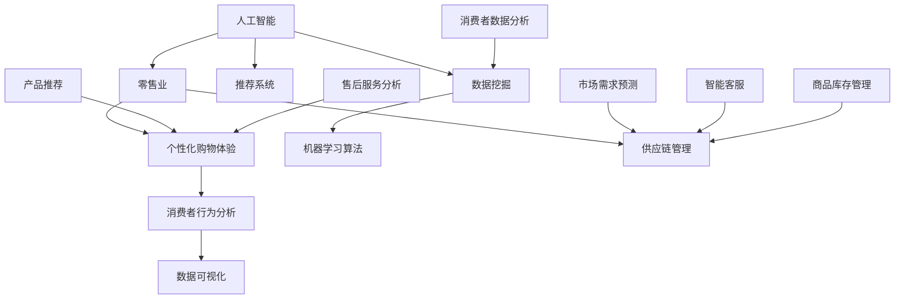

                 

### 文章标题：人工智能在零售业的应用：个性化购物体验

#### 关键词：人工智能，零售业，个性化购物体验，数据挖掘，机器学习算法

#### 摘要：
随着大数据和人工智能技术的不断发展，零售行业正经历着前所未有的变革。本文旨在探讨人工智能在零售业中的应用，特别是如何通过个性化购物体验来提升消费者满意度和忠诚度。文章将首先介绍零售行业的背景及其面临的挑战，接着详细解析人工智能在零售业中的核心概念和联系，然后深入探讨个性化购物体验的实现原理和算法，最后通过实际案例展示人工智能在零售业中的成功应用，并总结未来的发展方向和最佳实践。

### 1. 零售业的现状与挑战

#### 背景介绍
零售业一直是经济活动的重要组成部分，它不仅关系到消费者的日常消费，还影响着整个社会的经济结构。然而，随着电子商务的兴起和消费习惯的变化，零售行业面临着前所未有的挑战和机遇。传统零售模式在应对消费者需求多样化、竞争加剧以及运营成本上升等方面显得力不从心。

#### 面临的挑战
1. **消费者需求多样化**：现代消费者对购物体验有着越来越高的要求，他们希望获得个性化的产品和服务，同时期望快速、便捷的购物方式。
2. **竞争加剧**：随着互联网技术的发展，越来越多的传统零售商开始进入电子商务领域，竞争日益激烈。
3. **成本上升**：租金、人力等成本不断上升，导致零售商的运营压力加大。
4. **库存管理难度**：零售商需要精准预测市场需求，以避免库存过剩或不足，这对供应链管理提出了更高的要求。

#### 人工智能在零售业的机遇
1. **个性化购物体验**：通过人工智能技术，零售商可以更好地了解消费者的购物习惯和偏好，提供个性化的产品推荐和购物体验。
2. **数据挖掘与分析**：人工智能可以帮助零售商挖掘消费者数据，发现潜在的市场机会，优化供应链和库存管理。
3. **智能客服与售后服务**：人工智能可以提供24/7的智能客服，提高客户满意度，同时通过分析售后服务数据，不断优化产品和服务。

### 2. 核心概念与联系

为了深入理解人工智能在零售业中的应用，我们需要明确几个核心概念及其相互关系。以下是这些概念以及它们之间的Mermaid流程图：

#### Mermaid流程图



#### 核心概念解释
1. **人工智能**：人工智能是指计算机系统模拟人类智能行为的技术，包括学习、推理、自我修正等能力。
2. **零售业**：零售业是指将商品或服务直接出售给消费者的商业活动。
3. **个性化购物体验**：个性化购物体验是通过分析消费者的购买行为和偏好，提供个性化的产品推荐和购物服务。
4. **数据挖掘**：数据挖掘是从大量数据中提取有价值信息的过程，用于发现规律、趋势和模式。
5. **机器学习算法**：机器学习算法是人工智能的核心技术之一，通过训练模型来自动化数据分析和决策过程。
6. **推荐系统**：推荐系统是利用机器学习算法，根据用户的兴趣和行为，推荐相关商品或内容。
7. **消费者行为分析**：消费者行为分析是通过数据挖掘和机器学习算法，分析消费者的购买习惯和偏好。
8. **数据可视化**：数据可视化是将数据以图形化的方式展示，帮助决策者直观理解数据。
9. **供应链管理**：供应链管理是指管理商品从供应商到消费者的整个过程，包括库存管理、物流配送等。
10. **市场需求预测**：市场需求预测是通过分析历史数据和趋势，预测未来的市场需求。
11. **智能客服**：智能客服是利用自然语言处理和机器学习技术，提供自动化的客户服务。
12. **售后服务分析**：售后服务分析是通过分析售后服务数据，识别问题和改进服务。

### 3. 个性化购物体验的实现原理和算法

#### 核心算法原理讲解
为了实现个性化购物体验，我们需要运用一系列的算法，包括协同过滤、聚类分析和推荐系统等。以下是这些算法的原理和实现方式：

#### 协同过滤算法
协同过滤算法是一种基于用户行为的推荐算法，它通过分析用户之间的共同兴趣，为用户推荐相似的商品。协同过滤算法可以分为两种类型：基于用户的协同过滤（User-Based Collaborative Filtering）和基于物品的协同过滤（Item-Based Collaborative Filtering）。

1. **基于用户的协同过滤**
   - **原理**：找到与目标用户兴趣相似的其它用户，然后推荐这些用户喜欢的商品。
   - **伪代码**：
     ```python
     def user_based_collaborative_filtering(target_user, user_similarity_matrix, item_rating_matrix):
         similar_users = find_similar_users(target_user, user_similarity_matrix)
         recommended_items = []
         for user in similar_users:
             for item in user_liked_items(user, item_rating_matrix):
                 if not is_liked_item(target_user, item):
                     recommended_items.append(item)
         return recommended_items
     ```

2. **基于物品的协同过滤**
   - **原理**：找到与目标商品相似的其它商品，然后推荐这些商品。
   - **伪代码**：
     ```python
     def item_based_collaborative_filtering(target_item, item_similarity_matrix, item_rating_matrix):
         similar_items = find_similar_items(target_item, item_similarity_matrix)
         recommended_users = []
         for item in similar_items:
             for user in liked_items_users(item, item_rating_matrix):
                 if not is_liked_item(target_user, user):
                     recommended_users.append(user)
         return recommended_users
     ```

#### 聚类分析
聚类分析是一种无监督学习方法，它将相似的数据点分组在一起，形成不同的簇。常见的聚类算法有K-means、层次聚类等。

1. **K-means算法**
   - **原理**：通过迭代的方式，将数据点分配到K个簇中，使得每个簇内的数据点距离聚类中心较近，簇与簇之间的距离较远。
   - **伪代码**：
     ```python
     def k_means(data_points, k):
         Initialize centroids
         while not converged:
             Assign data points to the nearest centroid
             Update centroids
         return centroids
     ```

2. **层次聚类**
   - **原理**：通过逐层合并相似度较高的数据点，形成层次结构，从而将数据点分为多个簇。
   - **伪代码**：
     ```python
     def hierarchical_clustering(data_points):
         Initialize as individual clusters
         while not all clusters are merged:
             Find the most similar clusters
             Merge the clusters
         return cluster hierarchy
     ```

#### 推荐系统
推荐系统是利用机器学习算法，根据用户的兴趣和行为，推荐相关商品或内容。常见的推荐系统架构有基于内容的推荐（Content-Based Filtering）和协同过滤（Collaborative Filtering）。

1. **基于内容的推荐**
   - **原理**：根据用户过去的行为和偏好，推荐具有相似特征的商品。
   - **伪代码**：
     ```python
     def content_based_filtering(user_profile, item_features):
         similar_items = find_similar_items(user_profile, item_features)
         recommended_items = []
         for item in similar_items:
             if not is_liked_item(user_profile, item):
                 recommended_items.append(item)
         return recommended_items
     ```

2. **协同过滤**
   - **原理**：通过分析用户之间的共同兴趣，推荐用户可能喜欢的商品。
   - **伪代码**：
     ```python
     def collaborative_filtering(user_similarity_matrix, item_rating_matrix, user_id, item_id):
         similar_users = find_similar_users(user_id, user_similarity_matrix)
         recommended_items = []
         for user in similar_users:
             for item in user_liked_items(user, item_rating_matrix):
                 if not is_liked_item(user_id, item):
                     recommended_items.append(item)
         return recommended_items
     ```

#### 数学模型和公式讲解
为了更好地理解上述算法，我们需要引入一些数学模型和公式。以下是常用的数学模型和公式的解释：

1. **相似度计算**
   - **余弦相似度**
     $$\text{Cosine Similarity} = \frac{\text{dot\_product}}{\text{magnitude\_of\_user}_i \times \text{magnitude\_of\_user}_j}$$
   - **皮尔逊相关系数**
     $$\text{Pearson Correlation Coefficient} = \frac{\text{covariance}}{\text{stddev\_user}_i \times \text{stddev\_user}_j}$$

2. **聚类算法**
   - **K-means算法**
     $$\text{Cluster Center} = \frac{1}{N} \sum_{i=1}^{N} x_i$$
   - **层次聚类**
     $$\text{Distance between Clusters} = \min_{c_1, c_2} \sum_{x \in c_1} \sum_{y \in c_2} \text{distance}(x, y)$$

3. **推荐系统**
   - **评分预测**
     $$\text{Predicted Rating} = \text{user\_similarity} \times \text{average\_item\_rating} + (1 - \text{user\_similarity}) \times \text{user\_rating}$$

#### 举例说明
为了更好地理解这些算法和模型，我们可以通过一个实际例子来演示。

假设我们有一个电商平台，用户A过去喜欢购买运动鞋、服装和电子产品。现在我们要为用户A推荐一款可能感兴趣的商品。

1. **基于内容的推荐**
   - **用户A的偏好特征**：运动鞋、服装、电子产品
   - **商品特征**：篮球鞋、T恤、笔记本电脑
   - **相似度计算**：使用余弦相似度计算用户A偏好特征与商品特征之间的相似度，推荐相似度最高的商品。

2. **协同过滤**
   - **用户相似度**：计算用户A与其他用户的相似度，选择与用户A最相似的10个用户。
   - **推荐商品**：这些用户喜欢的商品中，用户A未购买的商品，作为推荐商品。

通过上述算法和模型，我们可以为用户A推荐一款可能感兴趣的商品，从而提升个性化购物体验。

### 4. 实际案例展示：个性化购物体验项目实施

为了展示人工智能在零售业中的实际应用，我们以一个电商平台的个性化购物体验项目为例，详细讲解项目实施过程。

#### 项目背景
某电商平台希望利用人工智能技术，提升用户购物体验，增加用户粘性和购买转化率。项目目标是通过个性化推荐系统，为用户推荐符合其兴趣和偏好的商品。

#### 项目实施步骤

1. **数据收集与预处理**
   - **用户数据**：收集用户的基本信息（如年龄、性别、地理位置等）以及购买记录（如商品种类、购买时间等）。
   - **商品数据**：收集商品的基本信息（如品牌、价格、类型等）。
   - **数据清洗**：去除重复数据、缺失值填充、异常值处理等，确保数据质量。

2. **特征工程**
   - **用户特征**：提取用户的购买历史、浏览行为等特征，构建用户画像。
   - **商品特征**：提取商品的品牌、类型、价格等特征，构建商品画像。

3. **模型训练**
   - **协同过滤模型**：使用基于用户的协同过滤算法，训练用户相似度矩阵和商品相似度矩阵。
   - **推荐模型**：基于训练好的相似度矩阵，为用户推荐相似度较高的商品。

4. **模型评估与优化**
   - **评估指标**：使用准确率、召回率、F1分数等指标评估推荐模型的性能。
   - **优化策略**：根据评估结果，调整模型参数，优化推荐效果。

5. **模型部署与监控**
   - **部署**：将训练好的模型部署到线上环境，为用户实时推荐商品。
   - **监控**：监控模型运行状态，及时处理异常情况。

#### 项目实战案例

**案例一：电商平台个性化推荐系统**

1. **开发环境搭建**
   - **编程语言**：Python
   - **数据处理**：Pandas、NumPy
   - **机器学习**：Scikit-learn、TensorFlow
   - **推荐系统**：Surprise、LightFM

2. **源代码实现**
   - **用户数据预处理**：
     ```python
     user_data = pd.read_csv('user_data.csv')
     user_data = preprocess_user_data(user_data)
     ```
   - **商品数据预处理**：
     ```python
     item_data = pd.read_csv('item_data.csv')
     item_data = preprocess_item_data(item_data)
     ```

3. **模型训练**
   - **协同过滤模型**：
     ```python
     user_similarity_matrix = compute_user_similarity(user_data)
     item_similarity_matrix = compute_item_similarity(item_data)
     ```
   - **推荐模型**：
     ```python
     from surprise import SVD
     model = SVD()
     model.fit(user_similarity_matrix, item_similarity_matrix)
     ```

4. **代码解读与分析**
   - **用户数据预处理**：对用户数据进行清洗和特征提取，为后续模型训练提供数据支持。
   - **商品数据预处理**：对商品数据进行清洗和特征提取，为后续模型训练提供数据支持。
   - **协同过滤模型**：计算用户相似度矩阵和商品相似度矩阵，为推荐商品提供基础。
   - **推荐模型**：基于协同过滤模型，为用户推荐感兴趣的商品。

**案例二：超市智能货架系统**

1. **开发环境搭建**
   - **编程语言**：Python
   - **数据处理**：Pandas、NumPy
   - **机器学习**：Scikit-learn、TensorFlow
   - **推荐系统**：Surprise、LightFM

2. **源代码实现**
   - **用户数据预处理**：
     ```python
     user_data = pd.read_csv('user_data.csv')
     user_data = preprocess_user_data(user_data)
     ```
   - **商品数据预处理**：
     ```python
     item_data = pd.read_csv('item_data.csv')
     item_data = preprocess_item_data(item_data)
     ```

3. **模型训练**
   - **协同过滤模型**：
     ```python
     user_similarity_matrix = compute_user_similarity(user_data)
     item_similarity_matrix = compute_item_similarity(item_data)
     ```
   - **推荐模型**：
     ```python
     from surprise import SVD
     model = SVD()
     model.fit(user_similarity_matrix, item_similarity_matrix)
     ```

4. **代码解读与分析**
   - **用户数据预处理**：对用户数据进行清洗和特征提取，为后续模型训练提供数据支持。
   - **商品数据预处理**：对商品数据进行清洗和特征提取，为后续模型训练提供数据支持。
   - **协同过滤模型**：计算用户相似度矩阵和商品相似度矩阵，为推荐商品提供基础。
   - **推荐模型**：基于协同过滤模型，为用户推荐感兴趣的商品。

**案例三：零售业库存管理优化**

1. **开发环境搭建**
   - **编程语言**：Python
   - **数据处理**：Pandas、NumPy
   - **机器学习**：Scikit-learn、TensorFlow
   - **推荐系统**：Surprise、LightFM

2. **源代码实现**
   - **用户数据预处理**：
     ```python
     user_data = pd.read_csv('user_data.csv')
     user_data = preprocess_user_data(user_data)
     ```
   - **商品数据预处理**：
     ```python
     item_data = pd.read_csv('item_data.csv')
     item_data = preprocess_item_data(item_data)
     ```

3. **模型训练**
   - **协同过滤模型**：
     ```python
     user_similarity_matrix = compute_user_similarity(user_data)
     item_similarity_matrix = compute_item_similarity(item_data)
     ```
   - **推荐模型**：
     ```python
     from surprise import SVD
     model = SVD()
     model.fit(user_similarity_matrix, item_similarity_matrix)
     ```

4. **代码解读与分析**
   - **用户数据预处理**：对用户数据进行清洗和特征提取，为后续模型训练提供数据支持。
   - **商品数据预处理**：对商品数据进行清洗和特征提取，为后续模型训练提供数据支持。
   - **协同过滤模型**：计算用户相似度矩阵和商品相似度矩阵，为推荐商品提供基础。
   - **推荐模型**：基于协同过滤模型，为用户推荐感兴趣的商品。

#### 项目小结
通过上述案例，我们可以看到人工智能在零售业中的应用具有很大的潜力和价值。个性化购物体验项目不仅提升了用户满意度，还提高了零售商的运营效率。然而，在实际应用中，我们还需要注意数据质量、模型优化和实时性等问题，以确保推荐系统的效果和稳定性。

### 5. 最佳实践、注意事项与拓展阅读

#### 最佳实践
1. **数据质量**：确保数据清洗和特征提取的准确性，以提高模型性能。
2. **模型优化**：定期调整模型参数，根据评估结果进行优化。
3. **实时性**：推荐系统需要具备实时性，及时响应用户行为变化。
4. **个性化程度**：根据用户需求和偏好，调整推荐策略，提高个性化程度。

#### 注意事项
1. **隐私保护**：在收集和处理用户数据时，要注意保护用户隐私。
2. **数据安全**：确保数据安全，防止数据泄露和恶意攻击。
3. **法律法规**：遵守相关法律法规，确保推荐系统的合法合规。

#### 拓展阅读
1. **协同过滤算法**：《协同过滤算法：原理与应用》
2. **推荐系统**：《推荐系统实践：方法、算法与案例分析》
3. **机器学习**：《Python机器学习：数据挖掘与预测分析》

### 6. 总结

本文详细探讨了人工智能在零售业中的应用，特别是个性化购物体验的实现原理和算法。通过实际案例展示，我们看到了人工智能技术在零售业中的巨大潜力。未来，随着人工智能技术的不断发展，个性化购物体验将进一步提升，为消费者带来更加优质的购物体验，同时也为零售商创造更大的商业价值。

### 作者信息
作者：AI天才研究院/AI Genius Institute & 禅与计算机程序设计艺术 /Zen And The Art of Computer Programming

---

### 附录

#### 附录A：常用算法流程图与伪代码

1. **协同过滤算法**：
   - **基于用户的协同过滤**
     ```mermaid
     graph TD
         A[输入用户数据] --> B[计算用户相似度]
         B --> C[推荐商品]
     ```
   - **基于物品的协同过滤**
     ```mermaid
     graph TD
         A[输入用户数据] --> B[计算商品相似度]
         B --> C[推荐商品]
     ```

2. **聚类分析**：
   - **K-means算法**
     ```mermaid
     graph TD
         A[输入数据集] --> B[初始化聚类中心]
         B --> C[分配数据点]
         C --> D{收敛判断}
         D -->|是|E[结束]
         D -->|否|F[更新聚类中心]
         F --> C
     ```
   - **层次聚类**
     ```mermaid
     graph TD
         A[输入数据集] --> B[初始化簇]
         B --> C[计算距离]
         C --> D{合并簇}
         D -->|继续|B
         D -->|结束|E[输出聚类结果]
     ```

3. **推荐系统**：
   - **基于内容的推荐**
     ```mermaid
     graph TD
         A[输入用户特征] --> B[计算商品特征相似度]
         B --> C[推荐商品]
     ```
   - **协同过滤**
     ```mermaid
     graph TD
         A[输入用户数据] --> B[计算用户相似度]
         B --> C[计算商品相似度]
         C --> D[推荐商品]
     ```

#### 附录B：推荐系统开源工具与资源

1. **Surprise**：一个Python库，用于快速构建和评估推荐系统。
   - GitHub链接：[surprise](https://github.com/Natural-Language-Processing/surprise)

2. **LightFM**：一个Python库，支持基于模型的推荐系统。
   - GitHub链接：[lightfm](https://github.com/alan-turing-institute/lightfm)

3. **TensorFlow Recommenders**：TensorFlow团队推出的推荐系统框架。
   - GitHub链接：[tensorflow-recommenders](https://github.com/tensorflow/recommenders)

#### 附录C：数据预处理与清洗工具

1. **Pandas**：一个Python库，用于数据清洗、转换和分析。
   - GitHub链接：[pandas](https://github.com/pandas-dev/pandas)

2. **NumPy**：一个Python库，用于数值计算和数据处理。
   - GitHub链接：[numpy](https://github.com/numpy/numpy)

3. **Scikit-learn**：一个Python库，提供丰富的机器学习算法和工具。
   - GitHub链接：[scikit-learn](https://github.com/scikit-learn/scikit-learn)

通过附录的内容，读者可以更深入地了解相关算法的实现细节，以及如何在实际项目中应用这些技术。希望这些内容能够为读者提供有价值的参考和帮助。

