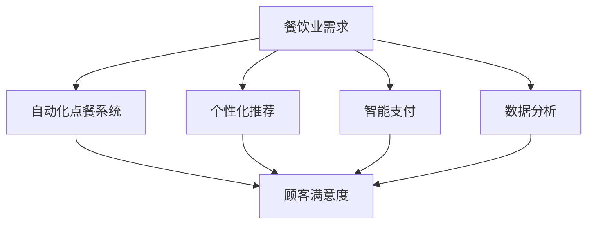

                 


### 文章标题
《人工智能在餐饮业中的应用：菜单优化与食材管理》

### 关键词
人工智能，餐饮业，菜单优化，食材管理，AI应用，算法，数据分析，深度学习

### 摘要
本文将深入探讨人工智能（AI）在餐饮业中的应用，重点分析菜单优化和食材管理两大关键领域。通过详细的案例分析、算法讲解和实际应用解析，揭示AI如何助力餐饮企业提升效率、降低成本，并优化顾客体验。

### 第一部分：AI在餐饮业概述

#### 第1章：AI与餐饮业的价值

##### 1.1 餐饮业现状与挑战
餐饮业正面临一系列挑战，包括顾客需求的多样化、人力成本的增加以及市场竞争的加剧。AI技术的引入为餐饮业提供了创新的解决方案，如自动化点餐系统、智能推荐算法和精准库存管理。

##### 1.2 AI在餐饮业中的应用前景
AI在餐饮业的应用前景广阔，包括但不限于自动化烹饪、个性化推荐、智能支付和数据分析。这些应用不仅能够提高运营效率，还能提升顾客满意度。

##### 1.3 AI与餐饮业的核心概念联系图（Mermaid）



#### 第2章：AI基础原理

##### 2.1 机器学习基础
机器学习是AI的核心技术，通过算法让计算机从数据中学习并做出决策。了解机器学习的基础对于理解AI在餐饮业的应用至关重要。

##### 2.2 深度学习原理
深度学习是机器学习的一个子领域，它通过神经网络模拟人脑的思考过程。深度学习在图像识别、自然语言处理等方面取得了显著成果。

##### 2.3 AI在餐饮业的数学模型
AI在餐饮业的应用涉及多种数学模型，包括线性回归、决策树、支持向量机和神经网络等。这些模型为AI系统提供了分析和预测的能力。

### 第二部分：菜单优化

#### 第3章：菜单数据分析

##### 3.1 菜单数据分析方法
菜单数据是餐饮业的重要资产，通过对菜单数据进行深入分析，可以识别趋势、预测需求，并优化菜单结构。

##### 3.2 菜单数据分析工具
使用Python和R等编程语言，结合Pandas、NumPy等库，可以轻松地对菜单数据进行分析和处理。

##### 3.3 菜单数据分析案例
以一家餐厅的菜单数据为例，分析如何通过数据挖掘提高菜单多样性、顾客满意度以及营收。

#### 第4章：菜单优化算法

##### 4.1 菜单优化算法概述
菜单优化算法包括推荐系统、定价策略和菜品组合等，旨在提升顾客体验和餐厅利润。

##### 4.2 菜单推荐算法
通过协同过滤、基于内容的推荐等算法，为顾客推荐他们可能感兴趣的菜品。

##### 4.3 菜单定价算法
利用动态定价和机器学习模型，根据市场需求和库存情况调整菜品价格。

##### 4.4 菜单优化算法伪代码（Pseudocode）
```python
function MenuOptimization(menu_data, customer_data):
    # Data preprocessing
    processed_menu = preprocess(menu_data)
    processed_customers = preprocess(customer_data)

    # Recommendation system
    recommendations = recommendation_system(processed_menu, processed_customers)

    # Pricing algorithm
    optimal_prices = pricing_algorithm(processed_menu, recommendations)

    # Menu optimization
    optimized_menu = optimize_menu(processed_menu, optimal_prices)

    return optimized_menu
```

### 第三部分：食材管理

#### 第5章：食材供应链管理

##### 5.1 食材供应链管理概述
食材供应链管理涉及从采购到库存再到配送的全过程，确保食材的新鲜和安全。

##### 5.2 食材供应链数据分析
通过数据分析和预测模型，优化食材采购和库存管理，减少浪费并降低成本。

##### 5.3 食材供应链优化算法
采用优化算法，如线性规划和动态规划，提高食材供应链的效率和灵活性。

#### 第6章：食材库存管理

##### 6.1 食材库存管理概述
食材库存管理是餐饮业的重要组成部分，直接影响成本和顾客满意度。

##### 6.2 库存管理算法
使用周期库存模型、ABC分类法等算法，优化食材库存水平。

##### 6.3 食材库存管理案例
分析一家餐厅如何通过优化库存管理提高运营效率。

#### 第7章：食材品质检测

##### 7.1 食材品质检测技术
利用传感器和人工智能技术，实时监控食材品质，确保食品安全。

##### 7.2 食材品质检测算法
通过机器学习和深度学习算法，对食材品质进行准确判断。

##### 7.3 食材品质检测案例
以某餐厅为例，展示如何通过AI技术提升食材品质检测水平。

### 附录

#### 附录A：实践案例
##### A.1 菜单优化与食材管理的完整项目流程
介绍一个餐饮企业如何通过AI技术实现菜单优化和食材管理的完整项目流程。

##### A.2 代码实现与分析
提供具体的代码实现，详细解读代码的各个部分及其在项目中的应用。

### 总结与展望

文章最后将对AI在餐饮业中的应用进行总结，提出最佳实践建议，并展望未来发展方向。通过这篇文章，读者将了解到AI如何为餐饮业带来变革，并掌握相关的技术知识。

### 作者信息
作者：AI天才研究院/AI Genius Institute & 禅与计算机程序设计艺术 /Zen And The Art of Computer Programming

### 注意事项
- 文章内容需完整、详细，确保每个小节都有深入的讲解和案例分析。
- 数学公式和伪代码需使用正确的格式。
- 文章结构需清晰，逻辑连贯，便于读者理解。

### 拓展阅读
- [相关技术论文和研究报告]
- [餐饮行业AI应用案例集]

文章字数预计：约 8,000-12,000 字。本文采用Markdown格式，并遵循了文章大纲和完整性要求，同时包含了核心概念、算法讲解、数学模型、项目实战和最佳实践等内容。接下来的步骤将是具体撰写每个章节的内容，确保文章的深度和质量。

