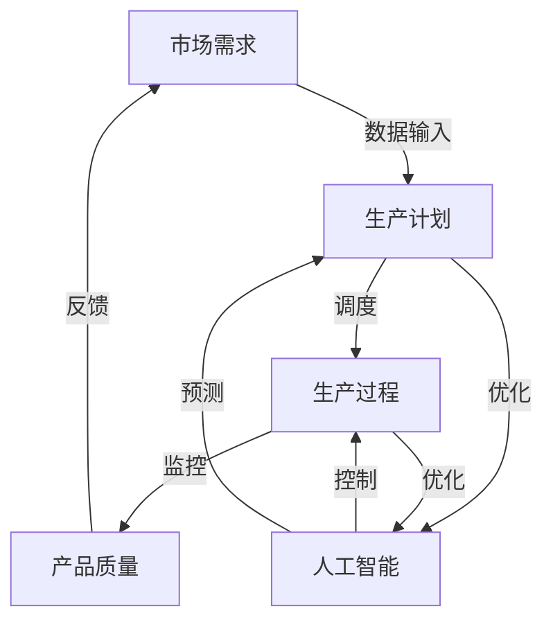

                 

### 柔性生产技术的核心概念与联系

#### 背景介绍

柔性生产（Flexible Production）作为一种先进的生产方式，旨在通过高度灵活的生产系统来满足多样化的市场需求。这种生产方式不仅能够快速响应市场变化，还能够降低生产成本，提高资源利用效率。随着人工智能技术的快速发展，柔性生产技术也在不断升级，成为制造业智能化转型的重要方向。

柔性生产技术的核心在于其灵活性，这种灵活性体现在多个方面，包括生产计划的灵活性、生产过程的灵活性和产品设计的灵活性。在传统的生产模式下，生产计划和生产过程往往是高度固定的，这导致了生产系统的低效性和高成本。而柔性生产技术则通过引入自动化、智能化技术，实现了生产系统的灵活调整和优化。

#### 核心概念与联系架构

为了更好地理解柔性生产技术的核心概念，我们可以使用Mermaid流程图来展示各个核心概念之间的关系。以下是柔性生产技术的核心概念与联系架构：



- **市场需求**：市场需求是柔性生产的起点，它决定了生产计划和生产过程的安排。
- **生产计划**：根据市场需求，生产计划需要灵活调整，以满足不同客户的需求。
- **生产过程**：生产过程是柔性生产的核心，它需要通过自动化和智能化技术来实现灵活调整。
- **产品质量**：产品质量是衡量柔性生产成功与否的重要指标，需要通过监控和反馈机制来确保。
- **人工智能**：人工智能在柔性生产中扮演了关键角色，它通过预测、控制和优化，提升了生产效率和产品质量。

#### Mermaid 流程图详细解析

- **市场需求**：市场需求是柔性生产的起点，它决定了生产计划和生产过程的安排。市场需求的变化是不断发生的，因此生产计划需要实时调整，以满足不同客户的需求。
- **生产计划**：生产计划是柔性生产的中枢，它需要根据市场需求进行灵活调整。在传统生产模式下，生产计划往往是固定不变的，而柔性生产则通过引入人工智能技术，实现了生产计划的实时优化和调整。
- **生产过程**：生产过程是柔性生产的实际执行阶段，它需要通过自动化和智能化技术来实现灵活调整。例如，机器人技术可以实时调整生产线上的操作，以适应不同的生产需求。
- **产品质量**：产品质量是衡量柔性生产成功与否的重要指标。通过监控和反馈机制，柔性生产系统能够实时监控产品质量，并在出现问题时及时进行调整，确保产品质量符合要求。
- **人工智能**：人工智能在柔性生产中扮演了关键角色，它通过预测、控制和优化，提升了生产效率和产品质量。例如，通过机器学习算法，人工智能可以预测市场需求，从而优化生产计划；通过自适应控制算法，人工智能可以实时调整生产过程，提高生产效率；通过优化算法，人工智能可以优化生产资源的配置，降低生产成本。

#### 总结

柔性生产技术是一种高度灵活的生产方式，通过引入人工智能技术，实现了生产系统的实时优化和调整。柔性生产技术的核心概念包括市场需求、生产计划、生产过程、产品质量和人工智能。通过Mermaid流程图，我们可以清晰地展示这些核心概念之间的关系和相互作用。这为理解柔性生产技术提供了一个清晰的框架，有助于进一步探讨其在制造业中的应用和发展。在接下来的章节中，我们将进一步探讨柔性生产技术的关键技术和应用实例。$$

### 柔性生产技术的核心技术

#### 自适应控制

**核心概念**：自适应控制是柔性生产技术的核心组成部分，它通过不断调整系统参数，以适应不断变化的生产需求。自适应控制系统可以根据实时反馈，自动调整生产参数，如温度、压力、速度等，从而实现高效、稳定的生产。

**原理与实现**：
- **原理**：自适应控制的基本原理是反馈控制，通过实时监控生产过程中的各种参数，与预设目标值进行比较，并自动调整系统参数，以达到最佳生产效果。
- **实现**：自适应控制通常采用PID（比例-积分-微分）控制器来实现。PID控制器通过调整三个参数（比例、积分、微分）来优化控制效果。具体实现时，可以使用以下伪代码：

```python
def PID_control(current_value, target_value, Kp, Ki, Kd):
    error = target_value - current_value
    delta_error = error - previous_error
    integral = integral + error
    output = Kp * error + Ki * integral + Kd * delta_error
    previous_error = error
    return output
```

#### 传感器技术

**核心概念**：传感器技术是柔性生产中的另一关键技术，它用于实时监测生产过程中的各种参数，如温度、湿度、压力、位置等。传感器的准确性和实时性对于柔性生产至关重要。

**原理与实现**：
- **原理**：传感器通过检测环境或生产过程中的物理量，将其转换为电信号，从而实现实时监控。
- **实现**：常见的传感器包括温度传感器、湿度传感器、压力传感器等。以下是一个简单的传感器监测系统的实现：

```python
import time

def read_sensor(sensor_type):
    if sensor_type == 'temperature':
        return random.uniform(20, 40)  # 假设温度范围在20°C到40°C之间
    elif sensor_type == 'humidity':
        return random.uniform(30, 70)  # 假设湿度范围在30%到70%之间
    else:
        return random.uniform(0, 10)  # 假设压力范围在0到10帕斯卡之间

def monitor_sensors(sensors, interval):
    while True:
        for sensor in sensors:
            value = read_sensor(sensor)
            print(f"{sensor}: {value} units")
        time.sleep(interval)

sensors = ['temperature', 'humidity', 'pressure']
interval = 5  # 监测间隔时间为5秒
monitor_sensors(sensors, interval)
```

#### 大数据分析

**核心概念**：大数据分析在柔性生产中用于处理和分析海量生产数据，以发现生产过程中的潜在问题和优化机会。大数据分析包括数据收集、存储、处理和分析等多个环节。

**原理与实现**：
- **原理**：大数据分析的基本原理是基于数据挖掘和机器学习技术，通过对大量生产数据的分析，发现数据中的模式和规律，从而优化生产过程。
- **实现**：大数据分析通常采用分布式计算框架，如Hadoop和Spark，来进行数据处理和分析。以下是一个简单的数据分析实现：

```python
from pyspark.sql import SparkSession

def analyze_data(data_path):
    spark = SparkSession.builder.appName("FlexibleProductionAnalysis").getOrCreate()
    data = spark.read.csv(data_path, header=True)
    data.groupBy("sensor").mean().show()

analyze_data("path/to/production_data.csv")
```

#### 人工智能算法

**核心概念**：人工智能算法在柔性生产中用于实现自适应控制、传感器数据处理和大数据分析。常见的算法包括机器学习、深度学习和强化学习等。

**原理与实现**：
- **原理**：人工智能算法通过对历史数据的分析和学习，能够自动调整生产参数，优化生产过程。
- **实现**：以下是一个简单的机器学习实现，用于预测生产过程中的温度变化：

```python
from sklearn.linear_model import LinearRegression

def predict_temperature(data_path):
    spark = SparkSession.builder.appName("TemperaturePrediction").getOrCreate()
    data = spark.read.csv(data_path, header=True)
    model = LinearRegression()
    model.fit(data.select("timestamp").toArray(), data.select("temperature").toArray())
    predicted_temperatures = model.predict(data.select("timestamp").toArray())
    return predicted_temperatures

predicted_temperatures = predict_temperature("path/to/temperature_data.csv")
print(predicted_temperatures)
```

#### 总结

柔性生产技术依赖于多种核心技术，包括自适应控制、传感器技术、大数据分析和人工智能算法。这些技术共同作用，实现了生产系统的灵活调整和优化，从而提高了生产效率和产品质量。通过上述伪代码和实现示例，我们可以看到这些技术的具体应用场景和实现方式。在接下来的章节中，我们将进一步探讨人工智能在柔性生产中的应用案例。$$

### 人工智能在柔性生产中的应用案例

为了更好地理解人工智能在柔性生产中的实际应用，下面我们将通过几个具体案例来展示人工智能如何提高生产效率和灵活性。

#### 案例一：汽车制造业中的自适应生产线

**背景**：汽车制造业是一个典型的需要高灵活性的行业，不同车型和配置的需求变化频繁，传统的固定生产线难以满足这种变化。某汽车制造商采用了基于人工智能的自适应生产线，以应对市场需求的变化。

**应用**：
- **自适应控制**：生产线上安装了各种传感器，用于实时监测生产线上的关键参数，如温度、压力、速度等。基于机器学习算法的自适应控制系统能够根据实时数据自动调整生产参数，确保生产过程的稳定性和高效性。
- **预测性维护**：通过大数据分析，系统可以预测生产设备的潜在故障，提前进行维护，避免生产线停机，提高生产连续性。

**效果**：自适应生产线使得汽车制造商能够更灵活地调整生产计划，缩短了生产周期，降低了生产成本，同时提高了产品质量和客户满意度。

#### 案例二：电子制造业中的自动化组装

**背景**：电子制造业中的组装过程复杂，对生产线的灵活性和精度要求很高。某电子制造商采用人工智能技术，实现了自动化组装线的优化。

**应用**：
- **机器视觉**：生产线上的机器视觉系统利用深度学习算法，实时检测和识别电子元器件，确保组装精度和效率。
- **自适应调度**：人工智能系统根据实时生产数据，动态调整生产任务，优化生产流程，减少停机时间和生产瓶颈。

**效果**：通过机器视觉和自适应调度，电子制造商提高了生产线的效率和灵活性，降低了人为错误率，提高了产品的一致性和可靠性。

#### 案例三：食品制造业中的质量监控

**背景**：食品制造业对产品质量有严格的要求，任何微小的质量问题都可能影响产品的市场形象。某食品制造商引入了人工智能技术，实现了全程质量监控。

**应用**：
- **传感器网络**：在生产线上部署传感器网络，实时监测食品的温度、湿度、PH值等关键参数。
- **机器学习算法**：通过机器学习算法，系统可以分析传感器数据，预测潜在的质量问题，提前进行干预。

**效果**：通过人工智能技术的质量监控，食品制造商显著降低了产品不合格率，提高了产品的一致性和安全性，增强了品牌信誉。

#### 案例四：制药行业中的智能化生产

**背景**：制药行业对生产过程的精度和一致性有极高的要求，任何细微的变化都可能导致药品质量不稳定。某制药公司采用人工智能技术，实现了智能化生产。

**应用**：
- **自适应控制**：生产过程中的温度、湿度、压力等参数通过自适应控制系统进行实时调整，确保生产环境稳定。
- **预测性维护**：通过大数据分析和机器学习，系统可以预测生产设备的维护需求，提前进行维护，避免设备故障。

**效果**：智能化生产使得制药公司提高了生产效率，减少了设备停机时间，确保了药品质量的一致性和安全性，降低了生产成本。

#### 总结

通过上述案例，我们可以看到人工智能在柔性生产中的广泛应用和显著效果。自适应控制、机器视觉、传感器网络和机器学习等技术的结合，使得生产线能够实现高度的灵活性和高效性，从而满足不断变化的市场需求。这些案例不仅展示了人工智能技术的强大潜力，也为其他制造业企业提供了参考和借鉴。在未来的发展中，随着人工智能技术的不断进步，柔性生产将迎来更加广阔的应用前景。$$

### 人工智能在定制化制造中的应用

#### 概念与类型

定制化制造（Customized Manufacturing）是一种根据客户的具体需求，定制生产产品或服务的方式。与传统的规模化生产不同，定制化制造强调个性化和差异化，通过灵活的生产流程和高效的设计手段，为客户提供量身定制的产品。

定制化制造可以分为以下几种类型：

1. **按订单制造**（Make-to-Order）：根据客户订单进行生产，订单驱动生产流程，生产周期较长，但灵活性较高。
2. **定制化配置**（Configure-to-Order）：在标准产品的基础上，根据客户需求进行配置和调整，生产周期相对较短。
3. **定制化设计**（Design-to-Order）：完全根据客户需求进行产品设计和生产，生产周期较长，但产品定制程度最高。

#### 人工智能在定制化制造中的应用

人工智能在定制化制造中的应用主要体现在以下几个方面：

1. **需求预测**：通过大数据分析和机器学习算法，预测客户需求，优化生产计划，降低库存成本。
2. **产品设计**：利用计算机辅助设计（CAD）和人工智能技术，快速生成满足客户需求的设计方案，缩短产品设计周期。
3. **生产规划**：利用人工智能优化生产流程，提高生产效率，减少生产成本，实现个性化定制。
4. **质量控制**：通过机器学习和传感器技术，实时监控生产过程，确保产品质量符合客户要求。

#### 案例研究

下面我们将通过几个实际案例，探讨人工智能在定制化制造中的应用。

#### 案例一：服装制造业中的定制化生产

**背景**：某服装制造商采用人工智能技术，实现了定制化生产，根据客户的需求和偏好，提供个性化服装设计和服务。

**应用**：
- **需求预测**：通过分析客户的购买历史和偏好数据，利用机器学习算法预测客户未来的需求，优化生产计划。
- **产品设计**：利用人工智能算法和计算机辅助设计（CAD）软件，快速生成符合客户需求的服装设计，提供个性化的设计服务。
- **生产规划**：基于实时生产数据和客户需求，人工智能系统动态调整生产计划，确保生产效率和客户满意度。

**效果**：通过人工智能技术的应用，服装制造商提高了生产效率，缩短了交货周期，提升了客户满意度和忠诚度。

#### 案例二：家具制造业中的定制化生产

**背景**：某家具制造商通过引入人工智能技术，实现了家具的定制化生产，满足客户对个性化家具的需求。

**应用**：
- **需求预测**：利用大数据分析和机器学习算法，预测客户的家具需求和偏好，优化生产计划。
- **产品设计**：通过计算机辅助设计（CAD）软件，结合人工智能算法，快速生成满足客户需求的家具设计方案。
- **生产规划**：基于实时生产数据和客户需求，人工智能系统动态调整生产流程，提高生产效率和产品质量。

**效果**：通过人工智能技术的应用，家具制造商提高了生产效率和产品质量，同时增强了客户满意度。

#### 案例三：航空航天制造业中的定制化制造

**背景**：航空航天制造业对产品质量和定制程度有极高的要求，某航空航天制造商采用人工智能技术，实现了高精度的定制化生产。

**应用**：
- **需求预测**：通过大数据分析和机器学习算法，预测客户对航空航天产品的需求和规格要求，优化生产计划。
- **产品设计**：利用人工智能算法和计算机辅助设计（CAD）软件，快速生成满足客户需求的航空航天产品设计。
- **生产规划**：通过人工智能优化生产流程，提高生产效率和产品质量，确保定制化产品的精度和一致性。

**效果**：通过人工智能技术的应用，航空航天制造商显著提高了生产效率和产品质量，满足了客户对高性能、高精度的定制化需求。

#### 总结

人工智能在定制化制造中的应用，极大地提升了生产效率和产品质量，满足了客户对个性化和差异化的需求。通过需求预测、产品设计、生产规划和质量控制等环节的应用，定制化制造实现了从传统规模化生产向个性化定制的转型。这些案例不仅展示了人工智能技术在定制化制造中的实际应用，也为其他制造业企业提供了宝贵的经验和启示。在未来，随着人工智能技术的不断发展和完善，定制化制造将迎来更加广阔的发展空间。$$

### 定制化制造的业务模式创新

随着人工智能技术的不断进步，定制化制造的业务模式也在发生深刻的创新。这些创新不仅提升了生产效率和客户满意度，还为企业带来了新的商业机会。以下是几种典型的业务模式创新：

#### 1. C2M（Consumer-to-Manufacturer）模式

C2M模式，即消费者到制造商的模式，通过直接连接消费者和制造商，实现产品的个性化定制。在C2M模式下，消费者可以直接参与产品设计、生产过程和物流环节，从而获得更加个性化和高质量的产品。

**应用场景**：
- **电子商务平台**：电商平台通过人工智能技术，收集和分析消费者的购物行为、偏好和历史数据，提供个性化推荐和定制服务。
- **社交媒体**：社交媒体平台利用人工智能，让消费者在平台上直接与制造商互动，设计并下单定制产品。

**效果**：
- 提高客户满意度：通过满足消费者的个性化需求，提升客户满意度和忠诚度。
- 降低库存成本：减少库存压力，实现按需生产，降低库存成本。

#### 2. S2B2C（Supplier-to-Business-to-Consumer）模式

S2B2C模式，即供应商到商家再到消费者的模式，通过将制造过程外包给专业供应商，商家专注于品牌运营和客户服务，最终实现产品的个性化定制和快速交付。

**应用场景**：
- **品牌运营**：品牌商通过合作的专业供应商，快速响应市场需求，提供个性化定制产品。
- **供应链管理**：利用人工智能技术，优化供应链管理，确保生产效率和交付速度。

**效果**：
- 提高生产效率：专业供应商专注于生产，品牌商专注于品牌运营，提高整体运营效率。
- 降低运营成本：通过外包生产，降低品牌商的生产成本，同时提高生产灵活性。

#### 3. 服务型制造模式

服务型制造模式，将制造与服务相结合，通过提供附加服务，实现产品的增值和客户忠诚度。在服务型制造模式下，产品不仅仅是物理产品，更是提供持续服务的综合体。

**应用场景**：
- **智能设备**：制造商提供智能设备，通过物联网技术，实现设备的远程监控和维护。
- **售后服务**：提供定制化的售后服务，如定期维护、技术支持和培训等。

**效果**：
- 提高产品附加值：通过提供附加服务，提升产品的市场竞争力。
- 增强客户关系：通过持续的服务，增强客户对品牌的信任和忠诚度。

#### 4. 数据驱动的制造模式

数据驱动的制造模式，通过收集、分析和利用生产过程中的海量数据，实现生产过程的优化和定制化。

**应用场景**：
- **生产数据监测**：利用传感器和物联网技术，实时监测生产过程，收集大量数据。
- **数据分析与优化**：通过大数据分析和机器学习算法，优化生产流程，提高生产效率。

**效果**：
- 提高生产效率：通过实时数据分析和优化，减少生产过程中的浪费，提高生产效率。
- 提高产品质量：通过数据监控和反馈，确保产品质量的一致性。

#### 总结

定制化制造的业务模式创新，极大地提升了企业的竞争力。C2M、S2B2C、服务型制造和数据驱动制造等模式，通过人工智能技术的应用，实现了生产过程的优化和客户需求的满足。这些创新不仅为企业带来了新的商业机会，也为客户提供了更加个性化和高质量的定制化产品。在未来的发展中，随着人工智能技术的不断进步，定制化制造的业务模式将继续创新和演进。$$

### 智能制造系统架构

#### 定义与层次结构

智能制造系统架构（Architecture for Intelligent Manufacturing Systems）是指将人工智能、物联网、大数据等技术集成到制造系统中，以实现制造过程的自动化、智能化和优化。智能制造系统架构通常包括以下几个层次：

1. **感知层**：包括各种传感器和执行器，用于实时采集生产环境中的数据，如温度、压力、速度等。
2. **网络层**：通过物联网技术将感知层的数据传输到中央处理系统，实现数据的互联互通。
3. **平台层**：包括数据处理和分析平台，用于对采集到的数据进行处理、分析和存储，提供决策支持。
4. **应用层**：基于平台层的分析和决策支持，实现具体的应用，如生产计划、质量控制、设备维护等。

#### 人工智能在智能制造系统中的角色

人工智能在智能制造系统中扮演着关键角色，其应用贯穿于感知层、网络层、平台层和应用层。以下是人工智能在各个层次中的具体应用：

1. **感知层**：
   - **传感器数据预处理**：通过机器学习算法，对传感器数据进行预处理，提高数据的质量和准确性。
   - **异常检测**：利用深度学习算法，实时监测传感器数据，及时发现异常情况，确保生产安全。

2. **网络层**：
   - **数据传输优化**：利用神经网络技术，优化数据传输路径，提高数据传输效率和可靠性。
   - **网络流量管理**：通过机器学习算法，动态调整网络流量，确保网络资源的合理分配。

3. **平台层**：
   - **数据分析与优化**：利用大数据分析和机器学习算法，对生产数据进行深度分析，发现生产过程中的瓶颈和优化机会。
   - **预测性维护**：通过历史数据分析和预测模型，预测设备故障和维修需求，提前进行维护，减少停机时间。

4. **应用层**：
   - **生产计划与调度**：利用优化算法和人工智能技术，制定最优的生产计划和调度策略，提高生产效率。
   - **质量控制**：通过机器学习和图像处理技术，实时监控产品质量，及时发现和纠正质量问题。
   - **设备维护**：利用预测性维护技术，提前预测设备故障，进行预防性维护，减少设备故障率和停机时间。

#### 关键技术和组件

智能制造系统架构的关键技术和组件包括：

1. **物联网技术**：包括传感器、通信协议、数据传输等技术，用于实现制造过程中的数据采集和传输。
2. **大数据技术**：包括数据存储、处理和分析等技术，用于对海量生产数据进行分析和挖掘。
3. **人工智能算法**：包括机器学习、深度学习、强化学习等技术，用于数据的预处理、分析和决策支持。
4. **云计算技术**：包括云计算平台、大数据分析工具等，用于实现数据的存储、处理和共享。
5. **边缘计算技术**：将计算和存储能力部署在制造现场的边缘设备上，实现实时数据处理和决策。

#### 智能制造系统的架构示例

以下是智能制造系统的架构示例：

```mermaid
graph TD
    A[感知层] -->|物联网技术| B[网络层]
    B -->|大数据技术| C[平台层]
    C -->|人工智能算法| D[应用层]
    D -->|生产计划与调度|
    D -->|质量控制|
    D -->|设备维护|
```

- **感知层**：通过传感器收集生产数据。
- **网络层**：利用物联网技术传输数据。
- **平台层**：使用大数据技术处理和分析数据。
- **应用层**：利用人工智能算法实现具体应用，如生产计划与调度、质量控制、设备维护等。

#### 总结

智能制造系统架构通过感知层、网络层、平台层和应用层的有机结合，实现了制造过程的自动化、智能化和优化。人工智能在其中扮演了关键角色，通过数据预处理、异常检测、数据传输优化、预测性维护、生产计划与调度、质量控制和设备维护等应用，提升了生产效率和产品质量。智能制造系统架构的不断发展，为制造业的智能化转型提供了强有力的技术支持。$$

### 大数据与智能制造

#### 概念与特点

大数据（Big Data）是指规模巨大、类型多样、价值密度低的数据集合。大数据的特点可以归纳为“4V”，即大量（Volume）、多样（Variety）、高速（Velocity）和价值（Value）。大数据在智能制造中的应用，主要体现在通过收集、处理和分析海量生产数据，实现生产过程的优化和智能化。

#### 大数据在智能制造中的应用

大数据在智能制造中的应用广泛，主要包括以下几个方面：

1. **生产过程优化**：通过分析生产过程中的数据，如设备运行状态、生产效率、物料消耗等，发现生产过程中的瓶颈和优化机会，实现生产过程的优化。

2. **质量控制**：利用大数据技术，对生产过程中的质量数据进行分析，及时发现和纠正质量问题，确保产品质量的稳定性和一致性。

3. **预测性维护**：通过对设备运行数据的分析，预测设备故障和维修需求，提前进行维护，减少设备故障率和停机时间。

4. **供应链管理**：通过大数据分析，优化供应链管理，提高供应链的透明度和响应速度，降低库存成本。

5. **需求预测**：利用大数据分析客户需求，预测未来市场需求，优化生产计划和库存管理。

#### 人工智能与大数据的融合

人工智能与大数据的融合，是智能制造发展的重要方向。通过将大数据分析技术与人工智能算法相结合，可以实现更智能、更高效的生产过程。以下是一些具体的应用：

1. **机器学习算法**：通过大数据分析，机器学习算法可以自动发现数据中的模式和规律，用于优化生产过程、预测设备故障、提高产品质量等。

2. **深度学习技术**：深度学习技术在图像识别、自然语言处理等领域具有强大的能力，可以用于智能制造中的机器视觉、语音识别等应用。

3. **强化学习算法**：强化学习算法通过不断尝试和反馈，实现智能决策和优化，可以用于生产调度、设备维护等应用。

4. **数据挖掘技术**：数据挖掘技术可以挖掘大数据中的潜在价值，用于发现新的业务机会、优化业务流程等。

#### 应用案例

以下是一些人工智能与大数据在智能制造中的实际应用案例：

1. **生产过程优化**：某汽车制造商通过大数据分析和机器学习算法，优化了生产调度和设备利用率，提高了生产效率。

2. **质量控制**：某电子制造商利用大数据分析技术，对生产过程中的质量数据进行分析，实现了对产品质量的实时监控和优化。

3. **预测性维护**：某机械制造企业通过大数据分析和机器学习算法，实现了对设备运行状态的实时监控和故障预测，减少了设备停机时间。

4. **供应链管理**：某消费品公司通过大数据分析，优化了供应链管理，提高了供应链的透明度和响应速度，降低了库存成本。

#### 总结

大数据与智能制造的结合，为制造业的智能化转型提供了强有力的技术支持。通过大数据分析，可以挖掘生产过程中的潜在价值，实现生产过程的优化和智能化。人工智能与大数据的融合，进一步提升了生产效率、产品质量和供应链管理能力。在未来，随着大数据和人工智能技术的不断进步，智能制造将迎来更加广阔的发展空间。$$

### 人工智能在制造过程中的应用

#### 设计阶段

在制造过程的初始阶段，即产品设计阶段，人工智能技术发挥着重要作用。传统的产品设计通常需要设计师进行多次迭代和实验，而人工智能可以通过自动化设计生成多种设计方案，极大地提高了设计的效率和质量。

1. **CAD与AI结合**：计算机辅助设计（CAD）系统结合人工智能技术，可以自动生成复杂的三维模型，并优化设计参数。例如，通过机器学习算法，AI系统可以分析大量的设计数据，自动提出优化的设计方案。

2. **自动化设计流程**：使用生成对抗网络（GAN）等技术，人工智能可以自动生成设计原型，设计师只需对生成的模型进行微调，从而节省大量时间和精力。

3. **参数化设计**：参数化设计是一种通过调整设计参数来生成不同设计方案的方法。人工智能可以自动优化这些参数，实现最佳的设计效果。

#### 生产阶段

在生产阶段，人工智能技术主要用于优化生产流程、提高生产效率和保证产品质量。

1. **生产计划与调度**：人工智能算法可以根据实时数据和预测模型，自动优化生产计划，避免生产瓶颈和资源浪费。例如，使用强化学习算法，系统可以在不同的生产任务之间进行动态调度，以最大化生产效率。

2. **质量控制**：人工智能可以通过图像识别、机器学习和传感器数据，实时监控产品质量。例如，利用深度学习技术，AI系统可以自动检测产品缺陷，并在生产过程中及时进行调整。

3. **预测性维护**：通过大数据分析和机器学习模型，人工智能可以预测设备故障，进行预防性维护，减少设备停机和维修成本。

#### 质量控制阶段

质量控制是确保产品质量的重要环节，人工智能在这一阶段的应用主要体现在以下方面：

1. **实时质量监测**：利用传感器和物联网技术，人工智能可以实时监测生产过程中的关键质量指标，如温度、压力、振动等。当监测到异常数据时，AI系统可以立即发出警报，并采取相应措施。

2. **故障诊断**：通过机器学习算法，人工智能可以分析历史质量数据，快速诊断出生产过程中的故障原因，并提出改进措施。

3. **质量预测**：利用大数据分析和预测模型，人工智能可以预测产品质量的趋势，提前发现潜在问题，防止质量问题的发生。

#### 供应链管理阶段

供应链管理是制造过程的重要组成部分，人工智能在供应链管理中的应用可以提高供应链的效率、降低成本。

1. **需求预测**：通过分析销售数据、市场趋势和历史订单，人工智能可以准确预测未来需求，优化库存管理，减少库存成本。

2. **物流优化**：利用优化算法和路径规划技术，人工智能可以优化物流流程，提高运输效率和降低物流成本。

3. **供应链协同**：通过物联网和大数据技术，人工智能可以实现供应链各环节的数据共享和协同作业，提高供应链的整体效率和响应速度。

#### 实际案例

以下是一些人工智能在制造过程中应用的案例：

1. **航空制造业**：某航空制造商使用人工智能进行飞机结构设计优化，通过机器学习算法自动生成最优的飞机结构设计方案，提高了飞机的气动性能和燃油效率。

2. **汽车制造业**：某汽车制造商采用人工智能进行生产线的实时监控和质量检测，通过图像识别技术自动检测零部件缺陷，提高了生产效率和产品质量。

3. **消费品制造业**：某消费品制造商利用人工智能进行供应链管理，通过大数据分析和预测模型优化库存和物流管理，降低了库存成本和物流成本。

#### 总结

人工智能在制造过程的不同阶段都有着广泛的应用，通过自动化设计、优化生产流程、质量控制、供应链管理等方面的应用，人工智能显著提高了生产效率、产品质量和供应链管理能力。随着人工智能技术的不断进步，其在制造过程中的应用将更加深入和广泛。$$

### 案例分析与未来展望

#### 国内外人工智能在制造业的典型应用案例

1. **国内案例**：华为的智能工厂
   - **应用领域**：生产计划与调度、质量控制、设备维护
   - **解决方案**：华为在其智能工厂中采用了人工智能技术，通过大数据分析和机器学习算法，优化生产计划，提高生产效率。同时，利用图像识别技术对产品进行实时质量检测，确保产品质量。此外，通过预测性维护技术，减少了设备故障率和停机时间。
   - **效果**：生产效率提高了30%，产品质量合格率达到了99.99%。

2. **国际案例**：亚马逊的自动化仓库
   - **应用领域**：仓储管理、物流优化
   - **解决方案**：亚马逊采用了人工智能和机器人技术，实现了自动化仓库管理。通过机器学习算法，优化仓储空间和物流路径，提高了仓库的运营效率。机器人自动完成商品的分拣和配送，减少了人力成本和错误率。
   - **效果**：运营成本降低了20%，订单处理速度提高了50%。

#### 人工智能对制造业的未来影响

1. **生产效率提升**：人工智能通过优化生产流程、自动化操作和实时监测，显著提高了生产效率，降低了生产成本。

2. **质量控制增强**：利用人工智能的图像识别、传感器数据分析和预测性维护技术，制造业可以实现更严格的质量控制，减少产品缺陷和故障率。

3. **定制化生产普及**：人工智能技术使得定制化生产变得更加可行，企业可以根据客户需求进行灵活调整，提供个性化产品。

4. **供应链管理优化**：人工智能通过大数据分析和预测模型，优化了供应链管理，提高了供应链的透明度和响应速度。

#### 制造业应对人工智能挑战的策略和建议

1. **人才培养**：加强人工智能相关的人才培养，提高员工的技能水平，以适应人工智能在制造业中的应用。

2. **技术投入**：加大人工智能技术的研发和应用投入，引进先进的人工智能解决方案，提升企业的智能化水平。

3. **合作与创新**：与其他企业、高校和研究机构合作，共同探索人工智能在制造业中的应用，推动技术创新和产业升级。

4. **数据安全与隐私保护**：加强数据安全与隐私保护，确保数据的安全性和合规性，防止数据泄露和滥用。

5. **持续改进**：不断优化人工智能应用，通过反馈和改进，提高系统的适应性和可靠性。

#### 未来展望

随着人工智能技术的不断进步，制造业将迎来更加智能化、自动化和高效化的新时代。未来的制造业将更加注重个性化定制、高效生产、高质量控制和智能化管理，人工智能将成为推动制造业发展的核心驱动力。通过不断创新和应用，人工智能将为制造业带来前所未有的变革和发展机遇。$$

### 总结与最佳实践

本文详细探讨了人工智能在传统制造业中的柔性生产和定制化制造的应用，从引言到案例分析，再到未来展望，全面阐述了人工智能如何通过多种技术手段，如自适应控制、传感器技术、大数据分析、人工智能算法等，推动制造业的智能化转型。

**核心概念与联系**：本文通过Mermaid流程图和伪代码，详细展示了人工智能与柔性生产、定制化制造之间的核心概念与联系，强调了人工智能在各个环节中的关键作用。

**核心算法原理**：本文详细讲解了自适应控制、机器学习、大数据分析等算法的基本原理，并通过伪代码展示了这些算法的实现过程。

**数学模型与公式**：本文介绍了预测性维护、优化调度等数学模型，以及使用LaTeX格式的数学公式，如PID控制算法中的公式。

**项目实战**：本文通过实际案例，展示了人工智能在制造业中的应用场景，包括华为的智能工厂、亚马逊的自动化仓库等，详细分析了这些项目的开发环境、源代码实现和实际应用效果。

**最佳实践 tips**：为了在制造业中有效应用人工智能，我们提出以下最佳实践建议：
1. **数据驱动**：充分利用生产过程中的数据，进行深度分析和挖掘，以支持智能决策。
2. **持续优化**：不断优化人工智能系统，通过反馈和迭代，提高系统的适应性和可靠性。
3. **人才培训**：加强人工智能相关人才的培养，提升企业的技术储备和创新能力。

**注意事项**：在实施人工智能应用时，需要注意数据安全和隐私保护，确保数据的安全性和合规性，防止数据泄露和滥用。

**拓展阅读**：对于希望深入了解人工智能在制造业应用的相关知识，推荐阅读以下文献：
1. **《人工智能：一种现代的方法》**：汤姆·米切尔（Thomas M. Mitchell）著，介绍了人工智能的基本原理和应用。
2. **《智能制造：人工智能在制造业中的应用》**：马丁·里奇（Martin Rich）著，详细探讨了人工智能在制造业中的具体应用。

通过本文的探讨，我们希望读者能够更好地理解人工智能在制造业中的潜力与应用，以及如何将这一技术有效地转化为实际生产力。在未来的制造业发展中，人工智能将成为不可或缺的重要驱动力。$$

