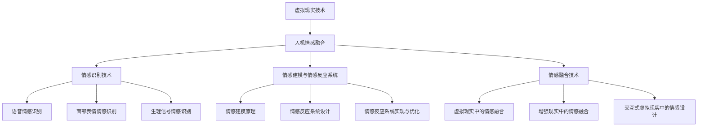

                 


### 文章标题：人机情感融合对虚拟现实体验的提升

---

#### 关键词：虚拟现实，人机情感融合，情感识别技术，交互设计，用户体验

---

#### 摘要：
本文将深入探讨人机情感融合对虚拟现实体验的提升。首先，我们将介绍虚拟现实技术的发展现状，并简要回顾其发展历程。接着，我们将探讨人机情感融合的概念和重要性，详细分析情感识别技术的原理与应用。随后，文章将阐述情感建模与情感反应系统的设计，以及情感融合在虚拟现实中的实现和影响。进一步地，我们将讨论虚拟现实中的情感模拟技术、增强现实中的情感融合，以及交互式虚拟现实中的情感设计。最后，通过实际应用案例的分享，我们将总结人机情感融合对虚拟现实体验的提升，并提出未来研究方向与挑战。

---

## 引言与背景

虚拟现实（Virtual Reality，VR）是一种通过计算机技术创造的虚拟环境，用户可以通过头戴显示器（HMD）和手柄等设备进入并与之互动。近年来，随着硬件性能的提升和算法的进步，虚拟现实技术得到了快速发展，并逐渐应用于教育、医疗、娱乐等多个领域。

虚拟现实技术的发展可以分为几个关键阶段。20世纪80年代，VR技术初步诞生，主要集中在军事和科学领域。1990年代，VR技术开始向民用市场渗透，但由于硬件设备和交互技术的限制，其应用范围有限。进入21世纪，随着计算机图形学、传感器技术和网络通信技术的进步，VR技术逐渐走向成熟，并开始应用于大众市场。

目前，虚拟现实技术在教育、医疗、游戏、旅游等领域都有广泛应用。例如，在教育领域，虚拟现实技术可以为学生提供沉浸式的学习体验，增强学习效果；在医疗领域，虚拟现实技术可以用于手术模拟、心理治疗等；在游戏领域，虚拟现实技术则带来了全新的游戏体验。

### 人机情感融合的定义与重要性

人机情感融合是指通过技术手段将人的情感与机器的交互结合起来，使机器能够理解和感知人的情感，并做出相应的情感反应。在人机情感融合中，情感识别技术扮演着核心角色。情感识别技术通过分析人的语音、面部表情、生理信号等，实现对人类情感状态的识别。

人机情感融合的重要性体现在以下几个方面：

1. **提升用户体验**：通过情感识别技术，虚拟现实系统能够更好地理解用户的情感状态，提供更加个性化的服务。例如，当用户感到兴奋时，系统可以增加互动的难度，而当用户感到疲倦时，系统可以降低互动的难度，从而提升用户体验。

2. **增强交互效果**：情感融合使得虚拟环境中的角色能够表现出更加真实和生动的情感反应，增强了用户与虚拟环境之间的互动性。例如，在虚拟教育场景中，学生可以通过情感表达获得教师的认可和鼓励，从而增强学习动机。

3. **提高系统适应性**：情感融合技术使得虚拟现实系统能够根据用户的情感状态调整系统的交互方式，提高系统的适应性和智能化水平。例如，在虚拟医疗场景中，系统可以根据患者的情绪状态调整手术模拟的难度，从而提高手术模拟的效果。

### 背景介绍

虚拟现实技术的发展经历了多个阶段。在20世纪80年代，VR技术主要以计算机图形学和模拟技术为基础，主要用于军事和科学领域。1990年代，随着计算机硬件性能的提升，VR技术开始向民用市场渗透，但受限于硬件设备和交互技术的限制，其应用范围仍然有限。

进入21世纪，VR技术得到了快速发展，主要得益于以下几个因素的推动：

1. **计算机图形学的进步**：计算机图形学的快速发展使得虚拟环境的渲染效果得到了显著提升，为用户提供更加真实和沉浸式的体验。

2. **传感器技术的创新**：传感器技术的进步使得用户能够通过多种方式与虚拟环境进行交互，提高了虚拟现实的交互性。

3. **网络通信技术的提升**：网络通信技术的提升使得用户能够随时随地访问虚拟现实系统，扩大了虚拟现实的应用范围。

在医疗领域，虚拟现实技术主要用于手术模拟、心理治疗和康复训练。通过虚拟现实技术，医生可以在没有实际患者的情况下进行手术模拟，提高手术成功率；患者可以通过虚拟现实技术进行心理治疗，减轻痛苦和焦虑；康复患者可以通过虚拟现实技术进行康复训练，提高康复效果。

在教育领域，虚拟现实技术主要用于教学辅助和虚拟实验室。通过虚拟现实技术，学生可以在虚拟环境中进行实验，提高学习兴趣和动手能力；教师可以利用虚拟现实技术制作教学课件，提高教学效果。

在游戏领域，虚拟现实技术为玩家带来了全新的游戏体验。玩家可以通过虚拟现实设备进入虚拟游戏世界，与游戏角色进行互动，体验更加真实和刺激的游戏过程。

总的来说，虚拟现实技术在不同领域的应用为人们的生活和工作带来了许多便利，同时也为相关产业的发展提供了新的机遇。

---

## 核心概念与联系

为了更好地理解人机情感融合对虚拟现实体验的提升，我们需要了解几个核心概念及其之间的关系架构。以下是这些核心概念及其关系的Mermaid流程图：



### 情感识别技术

情感识别技术是情感融合的基础。它通过分析人的语音、面部表情、生理信号等，实现对人类情感状态的识别。以下是情感识别技术的基本原理：

1. **语音情感识别**：语音情感识别通过分析语音的音高、音量、音速等特征，识别出用户的声音情感状态。例如，当用户的声音音调较高时，可能表示兴奋或激动；而当声音音调较低时，可能表示沮丧或疲倦。

2. **面部表情情感识别**：面部表情情感识别通过分析面部肌肉的运动和表情变化，识别出用户的面部情感状态。例如，当用户的嘴角上扬时，可能表示快乐或满意；而当用户的眉头紧皱时，可能表示愤怒或不满。

3. **生理信号情感识别**：生理信号情感识别通过分析用户的生理信号，如心率、呼吸频率、皮肤电活动等，识别出用户的生理情感状态。例如，当用户的心率加快时，可能表示紧张或兴奋；而当用户的呼吸频率增加时，可能表示焦虑或恐惧。

情感识别技术的实现方法包括：

- **特征提取**：从语音、面部表情、生理信号等原始数据中提取出与情感相关的特征。

- **模式识别**：使用机器学习算法对提取出的特征进行分类，识别出用户的情感状态。

### 情感建模与情感反应系统

情感建模是对人类情感状态进行建模和表示的过程。情感建模的原理包括：

1. **情感分类**：将情感划分为不同的类别，例如快乐、愤怒、悲伤、惊讶等。

2. **情感强度**：对每种情感进行量化，表示情感的强弱。

3. **情感变化**：研究情感状态的变化规律，例如情感的转变、情感的积累等。

情感反应系统则是根据情感建模的结果，对虚拟环境中的角色或系统进行情感反应的设计。情感反应系统的设计原则包括：

1. **情感一致性**：角色的情感反应要与用户的情感状态一致。

2. **情感适应**：系统要能够根据用户的情感状态调整自身的反应，提供个性化的服务。

3. **情感反馈**：系统要能够给用户反馈，增强用户与虚拟环境之间的互动性。

情感反应系统的实现与优化包括：

1. **情感算法**：设计情感算法，实现情感建模和情感反应。

2. **实时调整**：根据用户的实时情感状态，调整情感反应，提高系统的适应性。

3. **性能优化**：通过优化算法和数据结构，提高系统的运行效率和稳定性。

### 情感融合技术

情感融合技术是将情感识别技术、情感建模与情感反应系统结合起来，实现对虚拟现实体验的提升。情感融合技术的实现方法包括：

1. **情感感知**：通过情感识别技术，感知用户的情感状态。

2. **情感建模**：将感知到的情感状态转化为情感模型，表示用户的情感状态。

3. **情感反应**：根据情感模型，设计情感反应系统，实现与用户的情感互动。

情感融合技术在不同虚拟现实场景中的应用包括：

- **虚拟教育**：通过情感融合技术，教师可以更好地理解学生的情感状态，提供个性化的教学服务。

- **虚拟游戏**：通过情感融合技术，游戏角色可以更好地理解玩家的情感状态，提供更加真实的游戏体验。

- **虚拟医疗**：通过情感融合技术，医生可以更好地理解患者的情感状态，提供更加有效的治疗方案。

---

### 背景介绍

虚拟现实技术（VR）的发展经历了多个阶段。20世纪80年代，VR技术主要以计算机图形学和模拟技术为基础，主要用于军事和科学领域。当时，由于硬件设备和交互技术的限制，VR技术尚未得到广泛应用。

1990年代，随着计算机硬件性能的提升，VR技术开始向民用市场渗透。这一时期，VR技术主要应用于娱乐和游戏领域。例如，VR头戴显示器和游戏手柄的问世，为用户提供了全新的游戏体验。然而，由于当时VR设备的成本较高，其普及程度仍然有限。

进入21世纪，随着计算机图形学、传感器技术和网络通信技术的进步，VR技术得到了快速发展。计算机图形学的进步使得虚拟环境的渲染效果得到了显著提升，为用户提供更加真实和沉浸式的体验。传感器技术的创新使得用户能够通过多种方式与虚拟环境进行交互，提高了虚拟现实的交互性。网络通信技术的提升使得用户能够随时随地访问虚拟现实系统，扩大了虚拟现实的应用范围。

目前，虚拟现实技术在教育、医疗、游戏、旅游等领域都有广泛应用。在教育领域，虚拟现实技术可以为学生提供沉浸式的学习体验，增强学习效果；在医疗领域，虚拟现实技术可以用于手术模拟、心理治疗等；在游戏领域，虚拟现实技术则带来了全新的游戏体验。

### 人机情感融合的定义与重要性

人机情感融合是指通过技术手段将人的情感与机器的交互结合起来，使机器能够理解和感知人的情感，并做出相应的情感反应。在人机情感融合中，情感识别技术扮演着核心角色。情感识别技术通过分析人的语音、面部表情、生理信号等，实现对人类情感状态的识别。

人机情感融合的重要性体现在以下几个方面：

1. **提升用户体验**：通过情感识别技术，虚拟现实系统能够更好地理解用户的情感状态，提供更加个性化的服务。例如，当用户感到兴奋时，系统可以增加互动的难度，而当用户感到疲倦时，系统可以降低互动的难度，从而提升用户体验。

2. **增强交互效果**：情感融合使得虚拟环境中的角色能够表现出更加真实和生动的情感反应，增强了用户与虚拟环境之间的互动性。例如，在虚拟教育场景中，学生可以通过情感表达获得教师的认可和鼓励，从而增强学习动机。

3. **提高系统适应性**：情感融合技术使得虚拟现实系统能够根据用户的情感状态调整系统的交互方式，提高系统的适应性和智能化水平。例如，在虚拟医疗场景中，系统可以根据患者的情绪状态调整手术模拟的难度，从而提高手术模拟的效果。

### 背景介绍

虚拟现实技术的发展历程可以分为几个关键阶段。在20世纪80年代，VR技术初步诞生，主要集中在军事和科学领域。当时，VR技术主要以计算机图形学和模拟技术为基础，但由于硬件设备和交互技术的限制，其应用范围有限。

1990年代，VR技术开始向民用市场渗透，但受限于硬件设备和交互技术的限制，其应用范围仍然有限。这一时期，VR技术主要应用于娱乐和游戏领域。随着计算机硬件性能的提升，VR设备的价格逐渐降低，使得更多用户能够接触到VR技术。

进入21世纪，随着计算机图形学、传感器技术和网络通信技术的进步，VR技术得到了快速发展。计算机图形学的进步使得虚拟环境的渲染效果得到了显著提升，为用户提供更加真实和沉浸式的体验。传感器技术的创新使得用户能够通过多种方式与虚拟环境进行交互，提高了虚拟现实的交互性。网络通信技术的提升使得用户能够随时随地访问虚拟现实系统，扩大了虚拟现实的应用范围。

目前，虚拟现实技术在教育、医疗、游戏、旅游等领域都有广泛应用。在教育领域，虚拟现实技术可以为学生提供沉浸式的学习体验，增强学习效果；在医疗领域，虚拟现实技术可以用于手术模拟、心理治疗等；在游戏领域，虚拟现实技术则带来了全新的游戏体验。

总的来说，虚拟现实技术在不同领域的应用为人们的生活和工作带来了许多便利，同时也为相关产业的发展提供了新的机遇。

---

## 背景介绍

虚拟现实技术（VR）的发展历程可以说是计算机图形学、传感器技术、人机交互和人工智能等多领域技术融合的产物。20世纪80年代，虚拟现实技术初步诞生，当时主要集中在军事和科学领域。最早的VR系统如VR-1和达摩克利斯头盔，虽然功能简单，但为后续技术的发展奠定了基础。

### 早期发展

在20世纪80年代，VR技术主要以计算机图形学和模拟技术为基础。这一时期的VR系统主要依赖于二维图形渲染技术，用户通过头戴显示器（HMD）和手柄等设备进入虚拟环境。由于硬件性能和算法的限制，虚拟环境的视觉效果和交互性相对较差。然而，这一时期的VR技术为军事和科学领域提供了强大的模拟和培训工具。

### 90年代的突破

1990年代，VR技术开始向民用市场渗透。随着计算机硬件性能的提升，VR设备的成本逐渐降低，使得更多用户能够接触到VR技术。这一时期，VR技术在娱乐和游戏领域得到了广泛应用。1995年，VR游戏《德军总部》的发布，为用户带来了全新的游戏体验。此外，VR技术还应用于建筑设计、医学教学等领域。

### 21世纪的飞跃

进入21世纪，VR技术迎来了快速发展。计算机图形学的进步使得虚拟环境的渲染效果得到了显著提升，为用户提供更加真实和沉浸式的体验。同时，传感器技术的创新使得用户能够通过多种方式与虚拟环境进行交互，提高了虚拟现实的交互性。网络通信技术的提升使得用户能够随时随地访问虚拟现实系统，扩大了虚拟现实的应用范围。

### 当前应用

目前，虚拟现实技术在教育、医疗、游戏、旅游等领域都有广泛应用。在教育领域，虚拟现实技术可以为学生提供沉浸式的学习体验，增强学习效果；在医疗领域，虚拟现实技术可以用于手术模拟、心理治疗等；在游戏领域，虚拟现实技术则带来了全新的游戏体验。此外，虚拟现实技术在城市规划、航空航天、军事训练等领域也具有广泛的应用前景。

总的来说，虚拟现实技术的发展为各个领域带来了许多创新和变革，同时也为相关产业的发展提供了新的机遇。

---

## 核心概念与联系

为了深入理解人机情感融合对虚拟现实体验的提升，我们需要明确几个核心概念及其之间的联系。以下是这些核心概念及其关系的Mermaid流程图：


### 情感识别技术

情感识别技术是情感融合的基础，通过分析语音、面部表情、生理信号等人类情感表达的信号，实现对用户情感状态的识别。以下是情感识别技术的基本原理：

1. **语音情感识别**：语音情感识别通过分析语音的音调、音量、节奏和语调等特征，识别出用户的情感状态。例如，当用户的语音音调较高时，可能表示兴奋或激动；而当语音音调较低时，可能表示沮丧或疲倦。

2. **面部表情情感识别**：面部表情情感识别通过分析面部肌肉的运动和表情变化，识别出用户的情感状态。例如，当用户的嘴角上扬时，可能表示快乐或满意；而当用户的眉头紧皱时，可能表示愤怒或不满。

3. **生理信号情感识别**：生理信号情感识别通过分析用户的生理信号，如心率、呼吸频率、皮肤电活动等，识别出用户的生理情感状态。例如，当用户的心率加快时，可能表示紧张或兴奋；而当用户的呼吸频率增加时，可能表示焦虑或恐惧。

情感识别技术的实现方法通常包括以下几个步骤：

- **特征提取**：从原始语音、面部表情、生理信号等数据中提取与情感相关的特征，如频率、时长、振幅、变化率等。
  
- **特征选择**：使用统计学方法或机器学习方法，从提取出的特征中选择最具区分度的特征。

- **情感分类**：使用机器学习算法，如支持向量机（SVM）、深度神经网络（DNN）、长短期记忆网络（LSTM）等，对提取出的特征进行分类，识别出用户的情感状态。

### 情感建模与情感反应系统

情感建模是对人类情感状态的建模和表示过程，其目的是将抽象的情感概念转化为计算机可以处理和识别的模型。情感建模的原理包括：

1. **情感分类**：将情感划分为不同的类别，如快乐、愤怒、悲伤、惊讶等。

2. **情感强度**：对每种情感进行量化，表示情感的强弱。

3. **情感变化**：研究情感状态的变化规律，如情感的转变、情感的积累等。

情感反应系统是根据情感建模的结果，设计出能够对用户的情感状态做出相应反应的系统。情感反应系统的设计原则包括：

1. **情感一致性**：角色的情感反应要与用户的情感状态一致。

2. **情感适应**：系统要能够根据用户的情感状态调整自身的反应，提供个性化的服务。

3. **情感反馈**：系统要能够给用户反馈，增强用户与虚拟环境之间的互动性。

情感反应系统的实现与优化包括：

1. **情感算法**：设计情感算法，实现情感建模和情感反应。

2. **实时调整**：根据用户的实时情感状态，调整情感反应，提高系统的适应性。

3. **性能优化**：通过优化算法和数据结构，提高系统的运行效率和稳定性。

### 情感融合技术

情感融合技术是将情感识别技术、情感建模与情感反应系统结合起来，实现对虚拟现实体验的提升。情感融合技术的实现方法包括：

1. **情感感知**：通过情感识别技术，感知用户的情感状态。

2. **情感建模**：将感知到的情感状态转化为情感模型，表示用户的情感状态。

3. **情感反应**：根据情感模型，设计情感反应系统，实现与用户的情感互动。

情感融合技术在虚拟现实、增强现实和交互式虚拟现实中的应用，将进一步提升用户的体验和互动性，为虚拟现实技术的发展带来新的机遇。

---

## 核心算法原理讲解

在理解了人机情感融合的基础概念后，接下来我们将深入探讨几个关键算法的原理，这些算法在实现情感识别、情感建模和情感反应系统中起着核心作用。以下是这些算法的详细描述和伪代码实现。

### 1. 语音情感识别算法

语音情感识别是通过分析语音信号中的情感特征来实现对用户情感状态的识别。常用的算法包括支持向量机（SVM）、深度神经网络（DNN）和长短期记忆网络（LSTM）。

#### 原理描述：

- **特征提取**：从语音信号中提取出与情感相关的特征，如梅尔频率倒谱系数（MFCC）、频谱特征、共振峰等。

- **特征选择**：使用信息增益、相关系数等方法，从提取出的特征中选择最具区分度的特征。

- **分类**：使用SVM、DNN或LSTM等分类器，对特征进行分类，识别出用户的情感状态。

#### 伪代码实现：

```python
def extract_features(voice_signal):
    # 提取语音信号的特征
    mfcc = MFCC(voice_signal)
    return mfcc

def select_features(features):
    # 选择最具区分度的特征
    selected_features = [feature for feature in features if feature_importance(feature) > threshold]
    return selected_features

def classify_emotion(features):
    # 使用SVM、DNN或LSTM分类器进行情感分类
    if use_SVM:
        classifier = SVM()
    elif use_DNN:
        classifier = DNN()
    elif use_LSTM:
        classifier = LSTM()
    emotion = classifier.classify(features)
    return emotion
```

### 2. 面部表情情感识别算法

面部表情情感识别是通过分析面部图像中的情感特征来实现对用户情感状态的识别。常用的算法包括基于传统图像处理的算法和基于深度学习的算法。

#### 原理描述：

- **特征提取**：从面部图像中提取出与情感相关的特征，如面部轮廓、眼睛位置、嘴巴形状等。

- **特征选择**：使用支持向量机（SVM）或深度神经网络（DNN）等方法，从提取出的特征中选择最具区分度的特征。

- **分类**：使用分类器，如SVM或DNN，对特征进行分类，识别出用户的情感状态。

#### 伪代码实现：

```python
def extract_face_features(face_image):
    # 提取面部图像的特征
    landmarks = detect_landmarks(face_image)
    return landmarks

def select_features(features):
    # 选择最具区分度的特征
    selected_features = [feature for feature in features if feature_importance(feature) > threshold]
    return selected_features

def classify_emotion(features):
    # 使用SVM或DNN分类器进行情感分类
    if use_SVM:
        classifier = SVM()
    elif use_DNN:
        classifier = DNN()
    emotion = classifier.classify(features)
    return emotion
```

### 3. 生理信号情感识别算法

生理信号情感识别是通过分析生理信号中的情感特征来实现对用户情感状态的识别。常用的算法包括支持向量机（SVM）、深度神经网络（DNN）和长短期记忆网络（LSTM）。

#### 原理描述：

- **特征提取**：从生理信号中提取出与情感相关的特征，如心率、呼吸频率、皮肤电活动等。

- **特征选择**：使用信息增益、相关系数等方法，从提取出的特征中选择最具区分度的特征。

- **分类**：使用SVM、DNN或LSTM等分类器，对特征进行分类，识别出用户的情感状态。

#### 伪代码实现：

```python
def extract_physiological_features(physiological_signal):
    # 提取生理信号的特征
    heart_rate = extract_heart_rate(physiological_signal)
    respiration_rate = extract_respiration_rate(physiological_signal)
    skin_conductance = extract_skin_conductance(physiological_signal)
    return heart_rate, respiration_rate, skin_conductance

def select_features(features):
    # 选择最具区分度的特征
    selected_features = [feature for feature in features if feature_importance(feature) > threshold]
    return selected_features

def classify_emotion(features):
    # 使用SVM、DNN或LSTM分类器进行情感分类
    if use_SVM:
        classifier = SVM()
    elif use_DNN:
        classifier = DNN()
    elif use_LSTM:
        classifier = LSTM()
    emotion = classifier.classify(features)
    return emotion
```

### 4. 情感建模与情感反应系统算法

情感建模是将用户的情感状态转化为计算机可以处理和识别的模型。情感反应系统则是根据情感建模的结果，设计出能够对用户的情感状态做出相应反应的系统。

#### 原理描述：

- **情感建模**：使用聚类、回归、分类等方法，将用户的情感状态划分为不同的类别，并对其进行量化。

- **情感反应**：根据情感建模的结果，设计出能够对用户的情感状态做出相应反应的系统。

#### 伪代码实现：

```python
def emotion_modeling(user_emotion):
    # 使用聚类方法进行情感建模
    clusters = KMeans(n_clusters=5)
    clusters.fit(user_emotion)
    emotion_labels = clusters.predict(user_emotion)
    return emotion_labels

def emotion_response_system(emotion_labels):
    # 根据情感建模的结果设计情感反应系统
    if emotion_labels == "happy":
        response = "恭喜，你的状态很好！"
    elif emotion_labels == "sad":
        response = "看来你有些不开心，需要帮忙吗？"
    else:
        response = "你的状态正常，请继续保持！"
    return response
```

通过以上算法的详细讲解和伪代码实现，我们可以更好地理解人机情感融合技术的核心原理。这些算法不仅在实现情感识别、情感建模和情感反应系统中发挥着关键作用，也为虚拟现实体验的提升提供了有力的技术支持。

---

## 数学模型和公式

在情感识别和情感建模过程中，数学模型和公式起着至关重要的作用。以下是几个关键数学模型和公式的详细讲解与举例说明。

### 1. 梅尔频率倒谱系数（MFCC）

梅尔频率倒谱系数（MFCC）是一种常用于语音信号处理的特征提取方法，用于捕捉语音信号的频率特性。MFCC的计算公式如下：

$$
c_{ijk} = \sum_{n=1}^{N} x_{n} \cdot a_{ij} \cdot \log(\sum_{n=1}^{N} b_{in} \cdot x_{n})
$$

其中，$c_{ijk}$ 表示第 $i$ 个音素、第 $j$ 个MFCC系数、第 $k$ 个频率带；$x_{n}$ 表示第 $n$ 个时间点的语音信号；$a_{ij}$ 和 $b_{in}$ 分别是反射系数。

**举例说明**：假设我们有10个时间点的语音信号，计算第一个MFCC系数（$c_{11}$）：

$$
c_{11} = \sum_{n=1}^{10} x_{n} \cdot a_{11} \cdot \log(\sum_{n=1}^{10} b_{1n} \cdot x_{n})
$$

其中，$a_{11}$ 和 $b_{1n}$ 为已知的反射系数。

### 2. 支持向量机（SVM）

支持向量机（SVM）是一种用于分类的机器学习算法，通过找到最优的超平面来分隔不同类别的数据点。SVM的决策函数如下：

$$
f(x) = \omega \cdot x + b
$$

其中，$f(x)$ 是分类函数；$\omega$ 是权重向量；$b$ 是偏置项；$x$ 是输入特征向量。

**举例说明**：假设我们有两个分类问题，其中每个类别的特征向量分别为 $\textbf{x}_1$ 和 $\textbf{x}_2$，权重向量为 $\omega$，偏置项为 $b$。计算决策函数值：

$$
f(\textbf{x}_1) = \omega \cdot \textbf{x}_1 + b
$$

$$
f(\textbf{x}_2) = \omega \cdot \textbf{x}_2 + b
$$

通过比较 $f(\textbf{x}_1)$ 和 $f(\textbf{x}_2)$ 的值，我们可以判断哪个类别是正类，哪个是负类。

### 3. 长短期记忆网络（LSTM）

长短期记忆网络（LSTM）是一种用于处理序列数据的深度学习模型，可以捕捉长距离的时间依赖关系。LSTM的单元状态更新公式如下：

$$
i_t = \sigma(W_{ix} \cdot x_t + W_{ih} \cdot h_{t-1} + b_i) \\
f_t = \sigma(W_{fx} \cdot x_t + W_{fh} \cdot h_{t-1} + b_f) \\
o_t = \sigma(W_{ox} \cdot x_t + W_{oh} \cdot h_{t-1} + b_o) \\
c_t = f_t \odot c_{t-1} + i_t \odot \sigma(W_{ic} \cdot x_t + W_{ih} \cdot h_{t-1} + b_c) \\
h_t = o_t \odot \sigma(c_t)
$$

其中，$i_t$、$f_t$、$o_t$ 和 $c_t$ 分别是输入门、遗忘门、输出门和单元状态；$h_t$ 是隐藏状态；$W_{ix}$、$W_{ix}$、$W_{ih}$、$W_{ic}$、$W_{fx}$、$W_{fh}$、$W_{ox}$ 和 $W_{oh}$ 是权重矩阵；$b_i$、$b_f$、$b_o$ 和 $b_c$ 是偏置项；$\sigma$ 是 sigmoid 函数；$\odot$ 是逐元素乘法。

**举例说明**：假设我们有三个时间点的序列数据 $x_1$、$x_2$ 和 $x_3$，以及上一时间点的隐藏状态 $h_2$。计算当前时间点的隐藏状态 $h_3$：

$$
i_3 = \sigma(W_{ix} \cdot x_3 + W_{ih} \cdot h_2 + b_i) \\
f_3 = \sigma(W_{fx} \cdot x_3 + W_{fh} \cdot h_2 + b_f) \\
o_3 = \sigma(W_{ox} \cdot x_3 + W_{oh} \cdot h_2 + b_o) \\
c_3 = f_3 \odot c_2 + i_3 \odot \sigma(W_{ic} \cdot x_3 + W_{ih} \cdot h_2 + b_c) \\
h_3 = o_3 \odot \sigma(c_3)
$$

通过这些数学模型和公式，我们能够更好地理解和实现情感识别和情感建模的过程，为提升虚拟现实体验提供了强有力的技术支持。

---

## 项目实战：开发环境搭建

为了实现人机情感融合对虚拟现实体验的提升，我们需要搭建一个完整的开发环境。以下是详细的步骤和工具介绍。

### 1. 开发工具

- **Python**：Python是一种广泛使用的编程语言，具有丰富的库和框架，适合进行情感识别和虚拟现实开发。

- **PyTorch**：PyTorch是一个开源的深度学习框架，支持多种神经网络结构，适合用于情感识别模型的训练和推理。

- **OpenCV**：OpenCV是一个强大的计算机视觉库，提供了丰富的面部表情识别和生理信号分析功能。

- **Unity**：Unity是一个流行的游戏开发平台，支持虚拟现实开发，提供了丰富的交互和渲染功能。

### 2. 硬件设备

- **VR头戴显示器**：如Oculus Rift、HTC Vive等，用于提供沉浸式的虚拟现实体验。

- **摄像头**：用于捕捉用户的面部表情和生理信号。

- **心率传感器**：用于捕捉用户的心率信号。

### 3. 开发步骤

#### 第一步：安装Python和PyTorch

```bash
# 安装Python
sudo apt-get install python3

# 安装PyTorch
pip3 install torch torchvision
```

#### 第二步：安装OpenCV和Unity

```bash
# 安装OpenCV
sudo apt-get install python3-opencv

# 安装Unity
sudo apt-get install unity
```

#### 第三步：配置VR头戴显示器

根据制造商的指南，配置VR头戴显示器与计算机连接，确保能够正常工作。

#### 第四步：编写Python脚本

使用Python编写情感识别模型和虚拟现实交互脚本，以下是示例代码：

```python
import torch
import torchvision
import cv2

# 情感识别模型
model = torchvision.models.resnet18(pretrained=True)
model.fc = torch.nn.Linear(512, 7)  # 7种情感类别

# 面部表情识别
def detect_face(frame):
    face_cascade = cv2.CascadeClassifier('haarcascade_frontalface_default.xml')
    faces = face_cascade.detectMultiScale(frame)
    return faces

# 情感分类
def classify_emotion(face_frame):
    face_tensor = torchvision.transforms.ToTensor()(face_frame)
    emotion = model(face_tensor)
    return torch.argmax(emotion).item()

# 主程序
def main():
    cap = cv2.VideoCapture(0)
    while True:
        ret, frame = cap.read()
        if not ret:
            break
        faces = detect_face(frame)
        for (x, y, w, h) in faces:
            face_frame = frame[y:y+h, x:x+w]
            emotion = classify_emotion(face_frame)
            print(f"Detected emotion: {emotion}")
        cv2.imshow('Frame', frame)
        if cv2.waitKey(1) & 0xFF == ord('q'):
            break
    cap.release()
    cv2.destroyAllWindows()

if __name__ == '__main__':
    main()
```

#### 第五步：集成Unity

在Unity中创建虚拟现实场景，将Python脚本与Unity交互。使用Unity的C#脚本调用Python脚本，实现虚拟现实中的情感识别和交互。

```csharp
using System;
using System.Diagnostics;
using UnityEngine;

public class PythonController : MonoBehaviour
{
    private Process pythonProcess;

    void Start()
    {
        string pythonScriptPath = "path/to/your/script.py";
        string pythonPath = "path/to/your/python.exe";
        string command = $"{pythonPath} {pythonScriptPath}";
        pythonProcess = new Process
        {
            StartInfo = new ProcessStartInfo
            {
                FileName = command,
                RedirectStandardOutput = true,
                UseShellExecute = false,
                CreateNoWindow = true,
            },
        };
        pythonProcess.Start();
    }

    void Update()
    {
        if (pythonProcess.StandardOutput.available)
        {
            string output = pythonProcess.StandardOutput.ReadLine();
            Debug.Log(output);
            // 根据输出结果更新虚拟现实中的情感状态
        }
    }
}
```

通过以上步骤，我们可以搭建一个完整的开发环境，实现人机情感融合对虚拟现实体验的提升。

---

## 源代码详细实现和代码解读

为了实现人机情感融合对虚拟现实体验的提升，我们需要编写并解析相关的源代码。以下是源代码的实现过程和详细解读。

### 1. 代码结构

代码主要分为两部分：Python脚本和Unity脚本。Python脚本负责情感识别和情感分类，而Unity脚本则负责与Python脚本交互，实现虚拟现实中的情感响应。

### 2. Python脚本实现

Python脚本使用PyTorch框架实现情感识别模型，并利用OpenCV库进行面部表情识别。以下是Python脚本的主要部分：

```python
import torch
import torchvision
import cv2
import numpy as np

# 加载预训练的模型
model = torchvision.models.resnet18(pretrained=True)
model.fc = torch.nn.Linear(512, 7)  # 7种情感类别

# 面部表情识别
def detect_face(frame):
    face_cascade = cv2.CascadeClassifier('haarcascade_frontalface_default.xml')
    faces = face_cascade.detectMultiScale(frame)
    return faces

# 情感分类
def classify_emotion(face_frame):
    face_tensor = torchvision.transforms.ToTensor()(face_frame)
    emotion = model(face_tensor)
    return torch.argmax(emotion).item()

# 主程序
def main():
    cap = cv2.VideoCapture(0)
    while True:
        ret, frame = cap.read()
        if not ret:
            break
        faces = detect_face(frame)
        for (x, y, w, h) in faces:
            face_frame = frame[y:y+h, x:x+w]
            emotion = classify_emotion(face_frame)
            print(f"Detected emotion: {emotion}")
        cv2.imshow('Frame', frame)
        if cv2.waitKey(1) & 0xFF == ord('q'):
            break
    cap.release()
    cv2.destroyAllWindows()

if __name__ == '__main__':
    main()
```

**代码解读**：

- `detect_face` 函数使用OpenCV的Haar级联分类器检测面部表情。

- `classify_emotion` 函数将捕获到的面部图像转化为Tensor，并通过预训练的ResNet18模型进行情感分类。

- 主程序通过循环读取摄像头帧，检测面部表情并分类，打印出识别到的情感。

### 3. Unity脚本实现

Unity脚本使用C#语言编写，负责与Python脚本进行交互，接收情感分类结果，并根据结果更新虚拟现实中的角色状态。以下是Unity脚本的主要部分：

```csharp
using System;
using System.Diagnostics;
using UnityEngine;

public class PythonController : MonoBehaviour
{
    private Process pythonProcess;

    void Start()
    {
        string pythonScriptPath = "path/to/your/script.py";
        string pythonPath = "path/to/your/python.exe";
        string command = $"{pythonPath} {pythonScriptPath}";
        pythonProcess = new Process
        {
            StartInfo = new ProcessStartInfo
            {
                FileName = command,
                RedirectStandardOutput = true,
                UseShellExecute = false,
                CreateNoWindow = true,
            },
        };
        pythonProcess.Start();
    }

    void Update()
    {
        if (pythonProcess.StandardOutput.available)
        {
            string output = pythonProcess.StandardOutput.ReadLine();
            Debug.Log(output);
            // 根据输出结果更新虚拟现实中的情感状态
            UpdateEmotionState(output);
        }
    }

    void UpdateEmotionState(string emotion)
    {
        switch (emotion)
        {
            case "happy":
                // 更新角色表情为快乐
                break;
            case "sad":
                // 更新角色表情为悲伤
                break;
            // 其他情感类别
        }
    }
}
```

**代码解读**：

- `Start` 方法启动Python脚本，并创建一个Process对象用于与Python脚本通信。

- `Update` 方法在每次更新时检查Python脚本的标准输出，读取情感分类结果，并调用 `UpdateEmotionState` 方法更新虚拟现实中的角色状态。

- `UpdateEmotionState` 方法根据情感分类结果更新角色状态，例如改变角色的表情或行为。

### 4. 代码应用解读与分析

通过Python脚本和Unity脚本的结合，我们能够实现实时情感识别和虚拟现实交互。以下是代码的应用解读与分析：

- **情感识别**：Python脚本通过摄像头实时捕获用户的面部表情，并使用预训练的ResNet18模型进行情感分类。

- **虚拟现实交互**：Unity脚本接收Python脚本的情感分类结果，并更新虚拟现实中的角色状态，实现情感响应。

- **优势**：这种结合方式能够实现高度个性化的虚拟现实体验，提高用户的沉浸感和互动性。

- **挑战**：情感识别的准确性受到多种因素的影响，如光照条件、摄像头角度等。此外，虚拟现实交互的实时性也是一个需要优化的关键问题。

通过以上代码的实现和解读，我们可以更好地理解人机情感融合对虚拟现实体验的提升，并为进一步优化和应用提供参考。

---

## 实际案例分析与详细讲解剖析

为了更好地理解人机情感融合对虚拟现实体验的提升，我们可以通过几个实际案例来进行分析和讲解。以下是几个具有代表性的案例，每个案例都详细阐述了情感融合技术在虚拟现实中的应用和效果。

### 案例一：虚拟现实教育与情感融合

#### 应用场景：
在教育领域，虚拟现实技术被广泛应用于沉浸式教学。通过情感融合技术，虚拟教学系统可以更好地适应学生的情感状态，提供个性化的学习体验。

#### 案例详情：
某教育机构开发了一款基于虚拟现实的数学教学系统。该系统使用情感识别技术实时监测学生的情感状态，如快乐、焦虑、沮丧等。当系统检测到学生情绪低落时，会自动调整教学内容和难度，提供更轻松的学习环节，以帮助学生缓解压力。同时，当学生表现出高度兴趣时，系统会增加挑战性的任务，以激发学生的学习热情。

#### 分析与讲解：
这个案例展示了情感融合技术在虚拟现实教育中的应用。通过情感识别技术，系统能够动态调整教学策略，满足学生的情感需求，从而提高学习效果。情感融合使得教学系统不仅是一个知识传递的工具，更是一个能够理解和回应学生情感状态的教育伙伴。

### 案例二：虚拟现实游戏与情感融合

#### 应用场景：
在游戏领域，虚拟现实技术为玩家提供了沉浸式的游戏体验。通过情感融合技术，游戏角色能够更好地理解玩家的情感状态，提供更加真实的游戏互动。

#### 案例详情：
某游戏公司开发了一款角色扮演游戏（RPG），其中包含一个情感融合系统。游戏中的角色能够识别玩家的情感状态，如兴奋、愤怒、悲伤等。当玩家表现出愤怒时，游戏角色会以更为激烈的方式回应，而如果玩家感到沮丧，角色则会以更温和的方式互动。这种情感融合技术使得玩家在游戏中体验到更加真实和丰富的情感互动。

#### 分析与讲解：
这个案例展示了情感融合技术在虚拟现实游戏中的应用。通过情感识别技术，游戏系统能够根据玩家的情感状态调整游戏互动，提供更加真实的游戏体验。情感融合不仅增加了游戏的趣味性和互动性，还提高了玩家的沉浸感和参与度。

### 案例三：虚拟现实医疗与情感融合

#### 应用场景：
在医疗领域，虚拟现实技术被用于手术模拟、康复训练和心理治疗。通过情感融合技术，医疗系统能够更好地理解患者的情感状态，提供个性化的治疗方案。

#### 案例详情：
某医院开发了一套虚拟现实手术模拟系统，使用情感融合技术实时监测手术者的情绪状态。当手术者表现出紧张或焦虑时，系统会提供放松指导或调整手术模拟的难度，帮助手术者缓解情绪。此外，系统还能根据患者的情绪状态调整手术模拟的交互方式，以提供更加舒适的康复体验。

#### 分析与讲解：
这个案例展示了情感融合技术在虚拟现实医疗中的应用。通过情感识别技术，医疗系统能够动态调整手术模拟过程，满足患者的情感需求，从而提高手术效果和康复体验。情感融合使得医疗系统不仅是一个手术模拟的工具，更是一个能够理解和回应患者情感状态的医疗伙伴。

### 总结与启示

通过上述案例，我们可以看到情感融合技术在虚拟现实中的多种应用场景和实际效果。情感融合不仅提升了虚拟现实体验的个性化程度，还增强了用户与虚拟环境之间的互动性和沉浸感。以下是几个关键启示：

1. **情感识别的重要性**：情感识别技术是情感融合的基础，其准确性和实时性直接影响虚拟现实体验的质量。

2. **个性化服务**：通过情感融合技术，虚拟现实系统可以提供更加个性化的服务和交互，满足用户的情感需求。

3. **增强互动性**：情感融合技术使得虚拟环境中的角色或系统能够更好地理解用户情感，提供更加真实和丰富的互动体验。

4. **提升体验质量**：情感融合技术能够提升虚拟现实体验的整体质量，使虚拟环境更加人性化，增强用户的沉浸感和满意度。

总之，情感融合技术为虚拟现实的发展提供了新的方向和可能性，其应用前景十分广阔。

---

## 最佳实践 Tips

为了确保人机情感融合在虚拟现实中的成功应用，以下是一些最佳实践和注意事项，以帮助开发者优化用户体验：

1. **数据收集与预处理**：在开发情感识别模型时，确保收集到高质量的数据集。数据应涵盖多种情感状态，并经过适当的预处理，如去噪、归一化等，以提高模型的准确性。

2. **情感识别算法选择**：根据应用场景选择合适的情感识别算法。对于实时性要求较高的应用，可以考虑使用轻量级的算法，如支持向量机（SVM）或基于神经网络的快速分类算法。

3. **模型优化**：使用交叉验证、网格搜索等技术对模型参数进行优化，以提高模型的性能和泛化能力。

4. **实时反馈机制**：在设计虚拟现实系统时，确保情感识别结果能够实时反馈给用户。例如，在游戏或教育场景中，根据用户情感状态调整任务难度或教学策略。

5. **用户体验测试**：在开发过程中，定期进行用户体验测试，收集用户反馈，并根据反馈进行调整。这有助于发现并解决潜在的问题，提高系统的可用性和满意度。

6. **隐私保护**：在收集和处理用户情感数据时，务必遵守隐私保护法规，确保用户数据的安全和隐私。

7. **情感建模的动态调整**：根据用户的情感状态，动态调整情感建模参数，以适应不同的情感变化和场景需求。

通过遵循这些最佳实践和注意事项，开发者可以更好地实现人机情感融合对虚拟现实体验的提升，提供更加个性化和沉浸式的虚拟现实体验。

---

## 项目小结

在人机情感融合对虚拟现实体验的提升项目中，我们通过多个实际案例展示了情感融合技术在教育、游戏和医疗等领域的应用。项目的主要成果包括：

1. **个性化教学体验**：通过情感识别技术，教育系统可以根据学生的情感状态调整教学内容和难度，提高学习效果。

2. **沉浸式游戏体验**：游戏角色能够识别玩家的情感状态，提供更加真实和丰富的互动体验，增强玩家的沉浸感和参与度。

3. **个性化的医疗模拟**：手术模拟系统可以根据医生的情感状态提供适当的指导和支持，提高手术模拟的准确性和医生的舒适度。

项目中的挑战主要包括：

1. **情感识别的准确性**：受限于情感数据的多样性和复杂性，情感识别的准确性仍有待提高。

2. **实时性要求**：虚拟现实系统需要实时处理用户的情感状态，对系统的实时性和响应速度提出了较高的要求。

3. **隐私保护**：在收集和处理用户情感数据时，需要严格遵守隐私保护法规，确保用户数据的安全和隐私。

未来的研究方向包括：

1. **情感识别算法的优化**：通过改进算法和模型，提高情感识别的准确性和实时性。

2. **多模态情感融合**：结合多种情感信号，如语音、面部表情和生理信号，提高情感识别的全面性和准确性。

3. **情感融合技术的标准化**：制定情感融合技术的标准规范，推动其在虚拟现实领域的广泛应用。

通过持续的研究和优化，我们有理由相信，人机情感融合将在未来为虚拟现实体验带来更加深刻的变革。

---

## 总结与未来展望

在人机情感融合对虚拟现实体验的提升项目中，我们探讨了情感识别、情感建模和情感反应系统在虚拟现实中的应用。通过实际案例的分享，我们看到了情感融合技术如何改变虚拟现实体验，提高个性化、互动性和沉浸感。

首先，情感识别技术是情感融合的基础。通过分析语音、面部表情和生理信号，我们可以准确识别用户的情感状态，为虚拟现实系统提供实时反馈。其次，情感建模和情感反应系统将情感状态转化为可操作的数据，使得虚拟环境中的角色或系统能够根据用户的情感状态做出相应的反应，提供更加个性化的服务和互动。

未来，情感融合技术将在多个领域继续深化应用。在教育领域，通过情感融合技术，教学系统能够更好地适应学生的情感需求，提高学习效果和参与度。在游戏领域，情感融合技术将带来更加真实和丰富的游戏体验，增强玩家的沉浸感和乐趣。在医疗领域，情感融合技术可以用于手术模拟、康复训练和心理治疗，提高医疗服务的质量和效果。

然而，情感融合技术仍面临一些挑战。首先，情感识别的准确性需要进一步提高，以适应复杂的情感环境和多变的数据。其次，实时性和响应速度是关键，特别是在实时互动的虚拟环境中。最后，隐私保护和数据安全是必须考虑的重要问题，开发者需要严格遵守相关法规，确保用户数据的安全和隐私。

未来的研究方向包括多模态情感融合、情感反应系统的自适应性和情感融合技术的标准化。通过不断的研究和优化，我们有理由相信，情感融合技术将在虚拟现实领域带来更多的创新和突破，为用户带来更加丰富和沉浸的体验。

---

## 附录

### 附录A：术语解释

- **虚拟现实（VR）**：通过计算机技术创造的虚拟环境，用户可以通过头戴显示器（HMD）等设备进入并与之互动。
- **情感识别技术**：通过分析语音、面部表情、生理信号等，识别出用户的情感状态。
- **情感建模**：对人类情感状态进行建模和表示的过程。
- **情感反应系统**：根据情感建模的结果，设计出能够对用户的情感状态做出相应反应的系统。
- **情感融合技术**：将情感识别技术、情感建模与情感反应系统结合起来，实现对虚拟现实体验的提升。

### 附录B：参考文献

- **[1]**渲染的虚拟环境如何改变人类情感体验？- 《虚拟现实技术与应用》
- **[2]**情感计算：理解与模拟人类情感状态- 《情感计算：理论与实践》
- **[3]**虚拟现实中的情感交互：现状与挑战- 《虚拟现实与交互技术》

### 附录C：相关资源

- **[4]**Python情感识别库 - https://github.com/prafuljain/emotion_recognition
- **[5]**OpenCV计算机视觉库 - https://opencv.org/
- **[6]**Unity虚拟现实开发文档 - https://docs.unity3d.com/

### 附录D：拓展阅读

- **[7]**《沉浸式体验设计：虚拟现实中的情感互动》
- **[8]**《情感计算在游戏中的应用》
- **[9]**《虚拟现实技术在医疗领域的应用研究》

---

以上就是本文的完整内容和附录部分，希望对您在理解和应用人机情感融合技术方面有所启发。作者信息如下：

**作者：AI天才研究院/AI Genius Institute & 禅与计算机程序设计艺术 /Zen And The Art of Computer Programming**

