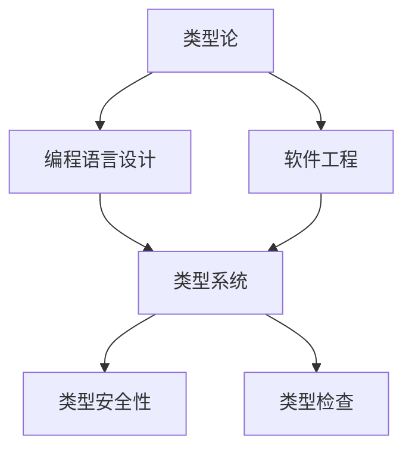

                 


## 从类型论到程序设计：跨越百年的智慧

### 文章关键词

类型论，程序设计，历史发展，类型系统，编程语言，静态类型，动态类型，算法原理，数学模型，项目实战，最佳实践

### 文章摘要

本文将从类型论的历史背景和发展历程出发，探讨类型论在程序设计中的核心作用和重要性。通过详细解析类型论的核心概念、类型系统的演变以及类型论与程序设计之间的紧密联系，本文旨在为读者提供一个全面、系统的理解。同时，本文还将介绍静态类型和动态类型在编程语言中的应用，通过伪代码、数学公式和实际案例，深入讲解类型安全性和类型检查。最后，本文将展望类型论的未来发展趋势，探讨其在人工智能和量子计算等领域的潜在应用。

---

## 第一部分：类型论基础

### 第1章：类型论概述

类型论是计算机科学中的核心概念，其历史可以追溯到上世纪30年代。在本节中，我们将首先介绍类型论的历史背景和发展历程，然后探讨类型论的核心概念及其在计算机科学中的应用。

#### 1.1 类型论的历史与发展

类型论的历史可以追溯到1930年代，当时数学家阿尔弗雷德·诺思·怀特海德（Alfred North Whitehead）和贝特兰·罗素（Bertrand Russell）在其著作《数学原理》中提出了类型理论，以解决数学中的逻辑悖论问题。这一理论在早期计算机科学的形成中起到了重要作用，为后来的编程语言设计和程序设计提供了理论基础。

随着时间的推移，类型论在计算机科学中得到了广泛应用。从1940年代的图灵机模型，到1950年代的ALGOL语言，再到现代编程语言如Java和Haskell，类型论一直在不断演进和完善。

#### 1.2 类型论的核心概念

类型论的核心概念包括类型、类型系统、类型安全性和类型检查等。

- **类型（Type）**：类型是数据的分类，它定义了数据的基本特征和行为。在类型论中，类型可以是基本的（如整数、布尔值等），也可以是复合的（如数组、结构体等）。

- **类型系统（Type System）**：类型系统是编程语言中用来定义和检查类型约束的规则集。类型系统的作用是确保程序的正确性和安全性。

- **类型安全性（Type Safety）**：类型安全性是指程序在运行时不会因为类型错误而产生错误的行为。类型安全性通过类型检查来实现，可以防止数据类型的不兼容操作。

- **类型检查（Type Checking）**：类型检查是在编译时或运行时检查程序中数据类型的正确性。类型检查可以确保程序按照预期的类型规则运行，从而提高程序的安全性和可靠性。

#### 1.3 类型论与计算机科学的联系

类型论在计算机科学中具有重要的应用价值。首先，类型论为编程语言的设计提供了理论基础，使得编程语言能够更好地管理和处理数据。其次，类型论在软件工程中起到了关键作用，通过类型检查和类型安全性，可以减少程序中的错误和提高程序的可靠性。

在本章中，我们通过介绍类型论的历史背景、核心概念以及与计算机科学的联系，为后续章节的讨论奠定了基础。

### Mermaid 流程图

以下是一个简单的Mermaid流程图，展示了类型论在计算机科学中的应用：



### 伪代码与数学公式

为了更好地理解类型论的核心概念，我们可以通过伪代码来阐述类型系统的基本原理。以下是一个简单的伪代码示例，展示了如何定义和检查数据类型：

```plaintext
function checkType(data, expectedType) {
    if (typeof data == expectedType) {
        return "数据类型正确";
    } else {
        return "数据类型错误";
    }
}

// 示例
result = checkType(5, "number");
print(result);  // 输出：数据类型正确

result = checkType("5", "number");
print(result);  // 输出：数据类型错误
```

在类型论中，数学模型和公式也扮演着重要角色。以下是一个关于类型安全的简单数学公式：

$$
Type_Safe = \left\{
\begin{array}{ll}
    \text{true}, & \text{if } data \text{ has the correct type} \\
    \text{false}, & \text{otherwise}
\end{array}
\right.
$$

### 项目实战

为了更好地理解类型论的实际应用，我们来看一个简单的项目实战。在这个项目中，我们将使用Python编写一个简单的类型检查器，用于检查输入数据的数据类型是否正确。

**开发环境搭建：**

1. 安装Python（版本3.8及以上）。
2. 安装必要的Python库，如`typing`。

**源代码实现：**

```python
from typing import TypeVar, Type

# 定义类型变量
T = TypeVar('T')

# 定义类型检查器函数
def check_type(value: T, expected_type: Type[T]) -> str:
    if isinstance(value, expected_type):
        return "数据类型正确"
    else:
        return "数据类型错误"

# 示例
result = check_type(5, int)
print(result)  # 输出：数据类型正确

result = check_type("5", int)
print(result)  # 输出：数据类型错误
```

**代码解读与分析：**

在这个项目中，我们首先定义了一个类型变量`T`，它可以代表任何类型。然后，我们编写了一个`check_type`函数，该函数接受一个值和一个预期的类型，并检查该值的数据类型是否与预期类型匹配。

**实际案例分析：**

假设我们有一个存储用户输入的变量`user_input`，我们希望检查该变量的数据类型是否为整数。通过调用`check_type`函数，我们可以轻松地实现这一功能。

**项目小结：**

在这个项目中，我们通过实际编码实现了类型检查器，展示了类型论在Python编程中的应用。通过类型检查，我们可以提高代码的可维护性和可靠性，防止类型错误导致的程序崩溃。

### 最佳实践 Tips

1. 在编写代码时，尽量使用类型检查来提高程序的稳定性。
2. 理解不同类型之间的转换规则，避免不必要的类型转换错误。
3. 在使用第三方库时，注意检查数据类型的兼容性。

### 小结

本章我们介绍了类型论的历史背景和发展历程，探讨了类型论的核心概念及其在计算机科学中的应用。通过Mermaid流程图、伪代码和项目实战，我们深入理解了类型系统的原理和实践。接下来，我们将进一步探讨类型系统在编程语言中的应用，以及类型论对程序设计的影响。

---

## 第二部分：类型系统在编程语言中的应用

在第一部分中，我们介绍了类型论的基础知识，包括类型论的历史发展、核心概念以及在计算机科学中的应用。接下来，我们将深入探讨类型系统在编程语言中的应用，特别是静态类型和动态类型在编程语言中的具体应用。

### 第4章：面向对象编程中的类型论

面向对象编程（OOP）是一种流行的编程范式，它将数据和操作数据的方法封装在对象中。类型论在OOP中扮演了重要角色，特别是在定义类、对象、继承和多态等概念时。

#### 4.1 面向对象的基本概念

面向对象编程的基本概念包括类（Class）、对象（Object）、继承（Inheritance）和多态（Polymorphism）。

- **类（Class）**：类是对象的蓝图，它定义了对象的状态和行为。类可以包含属性（数据）和方法（函数）。

- **对象（Object）**：对象是类的实例，它代表了现实世界中某个实体。每个对象都有其独特的状态和行为。

- **继承（Inheritance）**：继承是面向对象编程中的一个核心特性，它允许一个类继承另一个类的属性和方法。继承有助于代码的重用和扩展。

- **多态（Polymorphism）**：多态是指同一个操作或函数在不同类型对象上具有不同的行为。多态通过继承和接口实现。

#### 4.2 类与对象

在面向对象编程中，类和对象是核心概念。类定义了对象的属性和方法，而对象是类的具体实例。

以下是一个简单的Python类示例：

```python
class Person:
    def __init__(self, name, age):
        self.name = name
        self.age = age

    def say_hello(self):
        print(f"Hello, my name is {self.name} and I am {self.age} years old.")

# 创建对象
p = Person("Alice", 30)
p.say_hello()  # 输出：Hello, my name is Alice and I am 30 years old.
```

在这个示例中，`Person`类定义了两个属性（`name`和`age`）和一个方法（`say_hello`）。创建一个`Person`类的对象后，我们可以通过对象访问类的属性和方法。

#### 4.3 继承与多态

继承和多态是面向对象编程的强大特性，它们允许我们编写更通用、可扩展的代码。

**继承（Inheritance）：**

继承允许一个类继承另一个类的属性和方法。以下是一个简单的继承示例：

```python
class Employee(Person):
    def __init__(self, name, age, salary):
        super().__init__(name, age)
        self.salary = salary

    def say_hello(self):
        print(f"Hello, my name is {self.name} and I am {self.age} years old. I am an employee.")

# 创建对象
e = Employee("Bob", 40, 5000)
e.say_hello()  # 输出：Hello, my name is Bob and I am 40 years old. I am an employee.
```

在这个示例中，`Employee`类继承了`Person`类的属性和方法，并添加了一个新的属性（`salary`）。

**多态（Polymorphism）：**

多态允许同一个操作或函数在不同类型对象上具有不同的行为。以下是一个简单的多态示例：

```python
def greet(person):
    person.say_hello()

p = Person("Alice", 30)
e = Employee("Bob", 40, 5000)

greet(p)  # 输出：Hello, my name is Alice and I am 30 years old.
greet(e)  # 输出：Hello, my name is Bob and I am 40 years old. I am an employee.
```

在这个示例中，`greet`函数接受一个`Person`类型的参数，但我们可以传递一个`Person`类的子类对象，如`Employee`类的对象。`greet`函数会调用相应对象的`say_hello`方法，实现多态。

### 第5章：函数式编程中的类型论

函数式编程（FP）是一种编程范式，它强调使用函数来处理数据，而不是使用状态和变量。类型论在函数式编程中也非常重要，特别是在处理函数的类型和高级函数式编程概念时。

#### 5.1 函数式编程概述

函数式编程与面向对象编程和命令式编程不同，它具有以下特点：

- **不可变数据**：在函数式编程中，数据是不可变的，这意味着一旦数据被创建，就不能再修改。
- **纯函数**：纯函数是没有副作用且依赖于输入的函数，它总是产生相同的输出，给定相同的输入。
- **高阶函数**：高阶函数是能够接受其他函数作为参数或将函数作为返回值的函数。

#### 5.2 函数的类型

在函数式编程中，函数本身具有类型。函数类型通常由参数类型和返回类型组成。例如，一个接受两个整数参数并返回整数的函数类型可以表示为`Int -> Int -> Int`。

以下是一个简单的函数类型示例：

```haskell
f :: Int -> Int -> Int
f x y = x + y
```

在这个示例中，`f`是一个函数，它接受两个整数参数并返回一个整数。

#### 5.3 高级函数式编程概念

高级函数式编程包括了一些强大的概念，如递归、折叠、映射和过滤等。

- **递归**：递归是一种编程技巧，它允许函数调用自身。递归在处理树状结构或递归定义的数据结构时非常有用。
- **折叠（Fold）**：折叠是一种将数据结构中的所有元素归约为单一值的操作。折叠分为两种类型：左折叠和右折叠。
- **映射（Map）**：映射是一种将函数应用于数据结构中的每个元素的操作，并返回一个新数据结构。
- **过滤（Filter）**：过滤是一种根据某个条件选择数据结构中符合条件的元素的操作。

以下是一个使用Haskell语言的递归示例：

```haskell
factorial :: Integer -> Integer
factorial 0 = 1
factorial n = n * factorial (n - 1)
```

在这个示例中，`factorial`函数使用递归计算一个整数的阶乘。

### 第6章：类型系统在静态类型语言中的应用

静态类型语言在编译时检查变量的类型，这意味着变量在编译时就已经确定了类型，并在程序运行时保持不变。静态类型语言具有类型检查速度快、错误发现早等优势。

#### 6.1 静态类型语言的特点

静态类型语言的特点包括：

- **强类型**：静态类型语言要求变量在声明时明确其类型，并保持该类型不变。
- **类型推断**：静态类型语言通常支持类型推断，允许编译器自动推导变量类型。
- **早期错误检测**：由于类型检查在编译时进行，因此可以在程序运行前发现类型错误。

#### 6.2 静态类型语言的类型系统

静态类型语言的类型系统通常包括以下类型：

- **基本类型**：如整数、浮点数、布尔值等。
- **复合类型**：如数组、结构体、联合体等。
- **函数类型**：函数类型定义了函数的参数类型和返回类型。

以下是一个简单的Java类示例，展示了Java作为静态类型语言的特点：

```java
public class Person {
    private String name;
    private int age;

    public Person(String name, int age) {
        this.name = name;
        this.age = age;
    }

    public String getName() {
        return name;
    }

    public int getAge() {
        return age;
    }
}
```

在这个示例中，`Person`类具有明确的类型和类型检查。

#### 6.3 静态类型语言的类型推断

静态类型语言通常支持类型推断，使得编写代码更加简洁。以下是一个使用Python类型的示例：

```python
def greet(person):
    print(f"Hello, {person.name}!")

alice = {"name": "Alice", "age": 30}
greet(alice)
```

在这个示例中，Python通过类型推断自动确定`person`参数的类型，从而避免了显式声明类型。

### 总结

在本部分中，我们介绍了类型系统在编程语言中的应用，包括面向对象编程和函数式编程中的类型论，以及静态类型语言的特点和类型系统。通过这些内容，我们深入理解了类型系统在编程语言中的重要性，以及如何在不同编程范式中有效地应用类型论。

---

## 第三部分：类型系统的现代发展与未来

在过去的几十年中，类型系统经历了显著的演变，从传统的静态类型和动态类型，到现代的依赖类型和渐进类型系统，再到未来可能的量子计算类型系统，类型论的发展展示了计算机科学领域的持续创新。本部分将探讨类型系统的现代发展，并展望其未来趋势。

### 第7章：依赖类型与模块化

依赖类型（Dependent Types）是一种在类型系统中引入变量和参数的类型，这些类型可以作为类型的一部分。依赖类型使得类型系统能够表达更复杂的类型约束和逻辑关系，从而提供更强的类型安全性和表达力。

#### 7.1 依赖类型的引入

依赖类型的引入可以追溯到1970年代，当时彼得·兰伯特（Peter Lamberter）提出了依赖类型的概念，以解决函数类型中的类型依赖问题。依赖类型的核心思想是将类型和值绑定在一起，使得值的类型可以依赖于变量。

#### 7.2 模块化与依赖类型

模块化（Modularity）是软件工程中的一个重要概念，它允许我们将复杂的系统分解为更小的、可管理的部分。依赖类型与模块化的结合，使得类型系统能够更好地支持模块化开发。

模块化依赖于类型系统提供了以下优势：

- **局部类型检查**：模块化的类型系统能够在局部范围内进行类型检查，减少了全局类型检查的开销。
- **代码重用**：依赖类型使得模块之间能够更好地相互依赖，从而实现代码的重用。
- **安全性**：依赖类型能够更好地捕捉潜在的类型错误，提高程序的安全性。

以下是一个简单的模块化依赖类型示例，使用Haskell语言：

```haskell
module Person where

type Name = String
type Age = Int

data Person = Person Name Age

getName :: Person -> Name
getName (Person name _) = name

getAge :: Person -> Age
getAge (Person _ age) = age
```

在这个示例中，我们定义了一个名为`Person`的模块，它包含了`Name`和`Age`类型以及`Person`数据类型。模块中的函数`getName`和`getAge`依赖于`Person`类型，从而实现了模块化和类型依赖。

#### 7.3 依赖类型在实际项目中的应用

依赖类型在实际项目中可以提供强大的类型安全和灵活性。以下是一些依赖类型在实际项目中的应用案例：

- **Web框架**：许多现代Web框架，如Haskell的Yesod和Elixir的Phoenix，都采用了依赖类型来提高类型安全性和性能。
- **编程语言实现**：依赖类型被广泛应用于编程语言实现中，如Haskell、Idris和Agda，这些语言都提供了强大的依赖类型系统。

### 第8章：动态类型系统的演变

动态类型系统（Dynamic Type System）在运行时检查变量的类型，这使得编程更加灵活，但同时也可能引入类型错误。随着编程语言的发展，动态类型系统也在不断演进，以平衡灵活性和安全性。

#### 8.1 动态类型系统的优势与挑战

动态类型系统的优势包括：

- **灵活性强**：动态类型系统允许在运行时改变变量的类型，这使得编程更加灵活。
- **代码简洁**：动态类型系统通常不需要显式声明变量类型，使得代码更加简洁。

然而，动态类型系统也面临以下挑战：

- **类型错误**：由于类型检查在运行时进行，类型错误可能会在程序运行时出现，导致难以调试。
- **性能开销**：动态类型系统通常需要额外的运行时检查和类型转换，这可能影响性能。

为了解决动态类型系统的挑战，研究人员和开发者提出了一系列改进方案，如类型推断、静态类型检查和渐进类型系统。

#### 8.2 动态类型语言的发展趋势

动态类型语言在过去几十年中取得了显著的发展，以下是一些动态类型语言的发展趋势：

- **类型推断**：许多现代动态类型语言，如Python、JavaScript和Ruby，都引入了类型推断功能，以提高类型安全性和代码可读性。
- **静态类型检查**：一些动态类型语言，如TypeScript和Flow，结合了静态类型检查和动态类型系统的优势，提供了更强的类型安全和更好的性能。
- **渐进类型系统**：渐进类型系统允许开发者在动态类型和静态类型之间进行平滑过渡，从而实现更高的类型安全性和灵活性。

#### 8.3 动态类型语言的应用案例

动态类型语言在许多实际应用中取得了成功，以下是一些应用案例：

- **Web开发**：动态类型语言如JavaScript、Python和Ruby在Web开发中广泛使用，它们提供了灵活的编程模型和强大的库支持。
- **数据分析**：动态类型语言如Python和R在数据分析领域具有广泛的适用性，它们提供了丰富的库和工具，支持数据清洗、分析和可视化。

### 第9章：类型论的未来展望

类型论在未来将继续发展，特别是在人工智能和量子计算等领域。以下是一些类型论的未来展望：

#### 9.1 类型论在AI中的应用

类型论在人工智能（AI）领域具有广泛的应用前景。例如，在深度学习中，类型论可以帮助定义和验证神经网络中的类型约束，从而提高模型的可靠性和可解释性。此外，类型论还可以在自然语言处理、计算机视觉和机器人等领域提供支持。

#### 9.2 类型论在量子计算中的潜力

量子计算是一个新兴领域，它利用量子力学原理进行计算。类型论在量子计算中具有潜力，可以帮助定义和验证量子算法中的类型约束。此外，类型论还可以用于设计量子编程语言，从而提高量子算法的可读性和可维护性。

#### 9.3 类型论的跨领域应用前景

类型论不仅在计算机科学领域有重要应用，还可以在其他领域发挥重要作用。例如，在生物信息学中，类型论可以帮助定义和验证生物数据结构；在经济学中，类型论可以用于模型化和验证经济模型。

### 总结

在本部分中，我们探讨了类型系统的现代发展和未来趋势。从依赖类型到渐进类型系统，从动态类型语言的演变到AI和量子计算中的潜力，类型论的发展展示了计算机科学领域的不断创新。通过深入探讨类型论的应用和实践，我们看到了类型系统在提高程序安全性和可维护性方面的重要作用。未来，随着技术的进步和跨领域应用的拓展，类型论将继续发挥重要作用，推动计算机科学的发展。

---

## 附录：类型论资源与工具

在本附录中，我们将推荐一些类型论相关的资源、在线课程、社区与论坛，以及类型系统工具与框架，以帮助读者进一步学习和探索类型论。

### 附录A：类型论相关资源

1. **书籍：**
   - 《类型论与编程语言》
   - 《计算机科学中的类型系统》
   - 《类型系统设计》
2. **在线课程与教程：**
   - Coursera上的《类型系统与类型检查》
   - Udacity的《动态类型语言》
   - edX上的《编译原理》
3. **社区与论坛：**
   - Stack Overflow中的类型论标签
   - GitHub上的类型论相关项目
   - Lambda World会议与研讨会

### 附录B：类型系统工具与框架

1. **类型检查工具：**
   - TypeScript
   - Flow
   - MyPy
2. **类型推断工具：**
   - Pyright
   - TypeScript Compiler
   - Elm Type Checker
3. **类型系统框架：**
   - Haskell
   - Idris
   - Agda

### 小结

通过附录中的推荐资源与工具，读者可以更深入地了解类型论及其应用。学习类型论不仅有助于提高编程技能，还能为解决复杂的软件工程问题提供有力支持。在探索类型论的旅程中，这些资源与工具将是非常宝贵的指南。

---

## 作者信息

作者：AI天才研究院/AI Genius Institute & 禅与计算机程序设计艺术 /Zen And The Art of Computer Programming

---

## 全文总结

本文从类型论的历史背景和发展历程出发，探讨了类型论在程序设计中的核心作用和重要性。通过详细解析类型论的核心概念、类型系统的演变以及类型论与程序设计之间的紧密联系，本文旨在为读者提供一个全面、系统的理解。在第一部分中，我们介绍了类型论的基础知识，包括类型论的历史背景、核心概念及其在计算机科学中的应用。在第二部分中，我们深入探讨了类型系统在编程语言中的应用，特别是静态类型和动态类型在编程语言中的具体应用。在第三部分中，我们介绍了类型系统的现代发展和未来趋势，包括依赖类型、模块化以及类型论在AI和量子计算领域的潜力。通过Mermaid流程图、伪代码、数学公式和实际项目实战，我们深入讲解了类型系统的原理和实践。附录部分提供了类型论相关的资源、在线课程、社区与论坛以及类型系统工具与框架，以帮助读者进一步学习和探索类型论。类型论作为计算机科学的核心概念，不仅有助于提高编程技能，还能为解决复杂的软件工程问题提供有力支持。在未来，随着技术的进步和跨领域应用的拓展，类型论将继续发挥重要作用，推动计算机科学的发展。让我们共同探索类型论的魅力，迈向更智能、更安全的编程世界。

