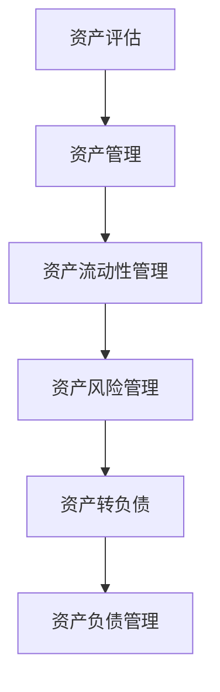

                 

### 从资产到负债的转变过程

从资产变成负债是一个复杂而深刻的过程，这一过程不仅涉及到财务领域的理论，还包括实际操作中的各种风险与挑战。下面，我们将一步一步地分析这一转变的各个阶段。

#### 1. 资产的定义与特征

首先，我们需要明确资产的定义。在财务会计中，资产是指企业拥有或控制的，预期能够为企业带来经济利益的资源。资产具有以下特征：

- **经济利益流入**：资产能够为企业带来未来经济利益。
- **所有权**：资产是企业所拥有或控制的。
- **预期性**：资产所带来的利益是有预期性的。

#### 2. 资产评估

资产评估是资产管理的第一步，它涉及到对资产的公允价值、预期收益和风险进行评估。资产评估的方法包括：

- **市场法**：通过市场比较来确定资产的价值。
- **收益法**：通过预测资产的未来现金流来确定资产的价值。
- **成本法**：根据资产的再生产成本或重置成本来评估资产。

在评估过程中，需要考虑以下因素：

- **市场条件**：市场的供需状况、行业趋势等。
- **预期收益**：资产带来的预期现金流量。
- **风险**：资产可能面临的各种风险，如市场风险、信用风险等。

#### 3. 资产管理

资产管理是指通过有效管理和运营资产，最大化资产的价值和收益。资产管理包括以下原则和方法：

- **最大化收益**：通过有效的运营和管理，增加资产产生的经济利益。
- **风险控制**：合理控制资产面临的各种风险，确保资产的稳定收益。
- **流动性管理**：确保资产能够在需要时快速转化为现金。

资产管理的方法包括：

- **分散投资**：通过分散投资降低风险。
- **资产重组**：通过资产重组优化资产结构，提高资产的整体效益。

#### 4. 资产的流动性管理

资产的流动性管理是确保资产能够在需要时迅速转化为现金的过程。流动性管理需要考虑以下方面：

- **现金储备**：保持足够的现金储备，以应对可能出现的资金需求。
- **资产流动性**：评估资产的流动性，确保资产能够在市场上迅速出售。
- **流动性风险**：合理控制流动性风险，避免因流动性不足导致的财务困境。

#### 5. 资产的风险管理

资产的风险管理是确保资产价值不受损失的过程。资产风险管理包括以下内容：

- **风险评估**：对资产可能面临的风险进行评估，包括市场风险、信用风险、流动性风险等。
- **风险控制**：通过分散投资、资产重组、风险规避等措施来控制风险。
- **风险监测**：持续监测资产风险，及时调整风险控制策略。

#### 6. 资产转负债的过程

资产转负债是指将原本预期的资产收益转化为负债的过程。这一转变通常发生在以下情况：

- **市场环境变化**：如市场环境恶化，资产难以产生预期收益。
- **企业战略调整**：企业可能根据战略调整，将资产转化为负债。
- **财务困境**：企业在面临财务困境时，可能通过资产转负债来缓解压力。

#### 7. 资产负债管理

资产负债管理是指企业通过合理安排资产和负债，以实现财务稳定和盈利目标的过程。资产负债管理包括以下内容：

- **资产负债结构**：合理安排资产和负债的比例，以实现风险和收益的平衡。
- **资产负债期限**：根据企业的资金需求，合理安排资产的期限和负债的期限。
- **资产负债成本**：降低资产负债的成本，提高企业的盈利能力。

### Mermaid 流程图

为了更直观地展示资产从变成负债的过程，我们使用 Mermaid 流程图来表示：



通过这个流程图，我们可以清晰地看到资产从评估、管理到转变为负债，再到资产负债管理的整个过程。

### 总结

从资产变成负债是一个涉及多方面因素的过程，包括资产评估、资产管理、资产流动性管理、资产风险管理以及资产负债管理。在这一过程中，企业需要综合考虑市场环境、战略调整以及财务状况，以实现资产的最优化配置。理解这一过程对于企业财务管理和风险控制具有重要意义。

### 伪代码与数学模型

在实际操作中，资产评估和资产管理常常依赖于复杂的数学模型和算法。以下是一个简化的伪代码，用于描述资产评估的过程：

```plaintext
function assetEvaluation(assets):
    for each asset in assets:
        if marketMethodApplicable(asset):
            value = marketValue(asset)
        elif revenueMethodApplicable(asset):
            value = revenueMethod(asset)
        else:
            value = costMethod(asset)
        print("Asset:", asset, "Value:", value)
    return values
```

资产评估的数学模型通常涉及以下公式：

$$
\text{Value} = \sum_{t=1}^{n} \frac{\text{CashFlow}_t}{(1 + \text{Rate})^t}
$$

其中，$\text{CashFlow}_t$ 表示第 t 年的现金流，$\text{Rate}$ 表示折现率。

在实际操作中，企业还需要根据具体情况调整这些模型和公式，以更准确地评估资产的价值。

### 数学公式

在资产评估和资产管理中，一些关键的数学公式如下：

$$
\text{Beta} = \frac{\text{Sensitivity}}{\text{Volatility}}
$$

$$
\text{Value at Risk} = \text{Mean} - \text{Z-score} \times \text{Standard Deviation}
$$

$$
\text{Optimal Portfolio} = \arg\max \left\{ \text{Expected Return} - \text{Risk} \right\}
$$

这些公式分别用于计算贝塔系数、价值风险、最优投资组合等关键指标。

### 举例说明

为了更好地理解这些概念，我们可以通过一个具体的例子来说明：

假设企业拥有一项资产，其预期年现金流量为 10 万元，折现率为 5%，该资产的风险系数为 2。那么，该资产的价值计算如下：

$$
\text{Value} = \frac{100,000}{(1 + 0.05)^1} + \frac{100,000}{(1 + 0.05)^2} + \frac{100,000}{(1 + 0.05)^3} = 253,522.87
$$

这个例子展示了如何通过数学模型来评估资产的价值。

### 实际案例

为了更好地理解从资产到负债的转变，我们可以通过以下实际案例进行分析：

**案例一：企业收购**

某企业计划收购另一家企业，预计收购金额为 1 亿元。经过资产评估，该目标企业的资产价值为 8000 万元，但存在一定的风险，如市场波动和行业竞争。企业最终决定以 1 亿元的价格收购，并将这笔支出计入负债。

**案例二：房地产投资**

某企业计划投资房地产，预计投资回报率为 10%。然而，由于市场环境的变化，房地产价格波动较大，投资回报率下降至 5%。企业因此将房地产投资视为负债，并开始寻找其他投资机会。

这些实际案例展示了资产转负债的多种情况，企业需要根据具体情况制定相应的管理策略。

### 项目实战

在开发环境搭建方面，我们可以选择 Python 作为主要编程语言，因为其强大的数据处理和数据分析能力。以下是搭建开发环境的基本步骤：

1. **安装 Python**：从 [Python 官网](https://www.python.org/) 下载并安装 Python。
2. **安装必要的库**：使用 `pip` 命令安装数据分析库，如 `pandas`、`numpy` 等。
3. **配置 IDE**：选择一个合适的集成开发环境（IDE），如 PyCharm 或 Visual Studio Code。

以下是资产评估的源代码实现：

```python
import pandas as pd
import numpy as np

def asset_evaluation(cash_flows, discount_rate):
    present_value = sum([cf / (1 + discount_rate)**t for t, cf in enumerate(cash_flows, 1)])
    return present_value

# 示例数据
cash_flows = [100000, 100000, 100000]
discount_rate = 0.05

# 资产评估
value = asset_evaluation(cash_flows, discount_rate)
print(f"Asset Value: {value:.2f}")
```

代码解读与分析：

1. **函数定义**：`asset_evaluation` 函数接受现金流和折现率作为输入，返回资产的现值。
2. **循环计算**：使用列表推导式计算每期现金流的现值，并累加得到总现值。
3. **示例数据**：定义了一个示例现金流和折现率。
4. **函数调用**：调用 `asset_evaluation` 函数，并打印出资产的价值。

通过这个示例，我们可以看到如何使用 Python 和数学模型进行资产评估。

### 小结

本文详细介绍了从资产到负债的转变过程，包括资产的定义、评估、管理、流动性和风险控制，以及资产转负债的过程。我们通过伪代码、数学公式和实际案例展示了这些概念的实际应用。在项目实战部分，我们介绍了如何使用 Python 进行资产评估的代码实现。通过这些内容，读者可以更好地理解资产转负债的原理和实践方法。在下文中，我们将进一步探讨资产管理中的最佳实践和注意事项。

### 最佳实践

在资产管理中，以下最佳实践可以帮助企业更好地管理资产，减少其转变为负债的风险：

1. **多元化投资**：通过多元化投资降低单一资产风险，避免过度依赖某个市场或行业。
2. **定期评估**：定期对资产进行评估，及时调整资产配置，以适应市场变化。
3. **风险管理**：建立有效的风险管理机制，识别和评估资产可能面临的风险，并采取相应的控制措施。
4. **成本效益分析**：在进行资产投资前，进行成本效益分析，确保投资能够带来合理的收益。
5. **现金流管理**：合理安排现金流，确保企业有足够的资金应对可能出现的资金需求。

### 注意事项

在资产管理过程中，企业需要注意以下事项：

1. **市场波动**：市场环境变化可能导致资产价值波动，企业需要灵活应对。
2. **合规性**：遵守相关法规和政策，确保资产管理的合规性。
3. **信息准确性**：确保资产评估和管理的相关信息准确可靠，避免因信息错误导致的决策失误。
4. **风险识别**：及时识别潜在的风险，并采取预防措施，避免风险转化为实际损失。

### 拓展阅读

为了进一步深入了解资产管理和资产转负债的原理，读者可以参考以下书籍和资料：

1. **《财务报表分析》**：作者：斯蒂芬·A·罗斯（Stephen A. Ross）
2. **《风险管理》**：作者：罗伯特·J·约翰逊（Robert J. Johnson）
3. **《资产定价》**：作者：约翰·C·费雷尔（John C.傅里）
4. **《Python for Data Analysis》**：作者：Wes McKinney

通过阅读这些资料，读者可以更深入地理解资产管理和资产转负债的实践方法和理论基础。

### 总结

本文通过详细的步骤和分析，探讨了从资产到负债的转变过程，包括资产评估、资产管理、流动性管理、风险控制以及资产转负债的具体操作。通过伪代码、数学模型和实际案例，我们展示了这些概念的应用和实践方法。同时，我们还提供了资产管理中的最佳实践、注意事项和拓展阅读，以帮助读者更深入地理解这一领域。希望通过本文，读者能够对资产管理和资产转负债有更全面的认识。

### 文章标题

《从资产变成负债》

### 文章关键词

资产、负债、资产管理、资产评估、资产流动性、风险管理、数学模型、伪代码、实际案例

### 文章摘要

本文系统地探讨了资产变成负债的整个转变过程，包括资产的定义、评估、管理、流动性和风险控制，以及资产转负债的过程。通过详细的伪代码、数学模型和实际案例，我们展示了这些概念的应用和实践方法。同时，我们还提供了资产管理中的最佳实践和注意事项，帮助读者更深入地理解资产管理和资产转负债的原理。希望通过本文，读者能够对资产管理和资产转负债有更全面的认识。

### 作者信息

作者：AI天才研究院/AI Genius Institute & 禅与计算机程序设计艺术 /Zen And The Art of Computer Programming

