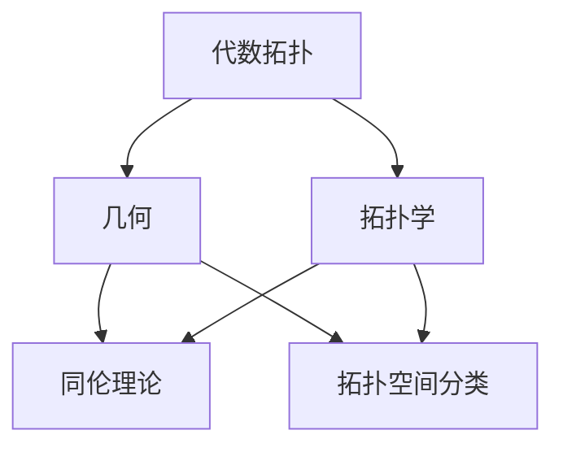
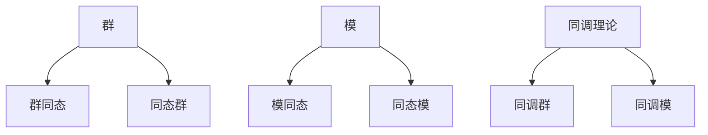
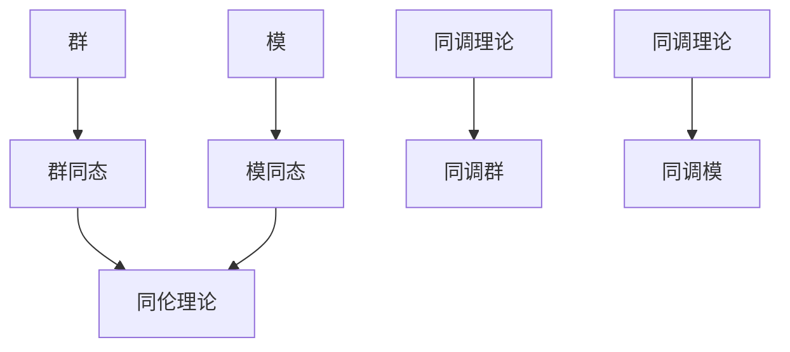
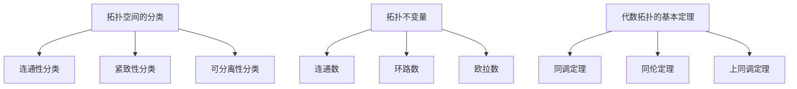
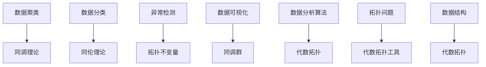
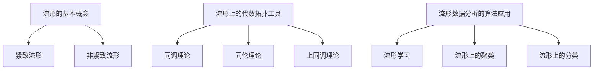
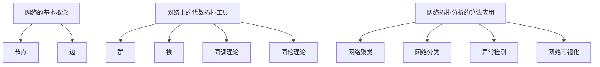
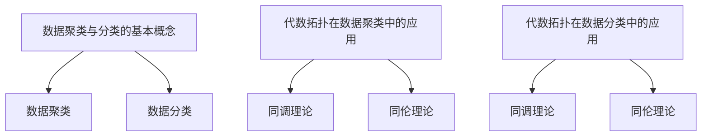

                 


## 《代数拓扑在数据分析算法中的应用》

### 关键词：
代数拓扑、数据分析、算法应用、流形数据分析、网络拓扑分析、数据聚类与分类、异常检测、可视化、机器学习、图像处理、文本分析、大数据分析、医疗数据分析

### 摘要：

随着大数据时代的到来，数据分析技术成为推动社会进步的重要力量。传统的数据分析方法已经无法满足复杂数据的高效处理需求。近年来，代数拓扑作为一种强有力的数学工具，逐渐被引入到数据分析领域，为解决复杂数据问题提供了新的思路和方法。本文将详细探讨代数拓扑在数据分析算法中的应用，包括代数拓扑的基础概念、数学工具、基本结构以及其在流形数据分析、网络拓扑分析、数据聚类与分类、异常检测、可视化、机器学习等领域的实际应用，旨在为读者提供全面、系统的认识。

### 目录大纲

## 第一部分：代数拓扑基础

### 第1章：代数拓扑基本概念

- 1.1 拓扑空间的基本性质
- 1.2 代数拓扑的发展历史
- 1.3 代数拓扑与几何、拓扑学的联系

### 第2章：代数拓扑的数学工具

- 2.1 群与群同态
- 2.2 模与模同态
- 2.3 同调理论简介

### 第3章：代数拓扑的基本结构

- 3.1 拓扑空间的分类
- 3.2 拓扑不变量
- 3.3 代数拓扑的基本定理

### 第4章：代数拓扑的应用背景

- 4.1 数据分析算法的概述
- 4.2 数据分析中的拓扑问题
- 4.3 代数拓扑在数据分析中的潜在应用

## 第二部分：代数拓扑在数据分析中的应用

### 第5章：流形数据分析

- 5.1 流形的基本概念
- 5.2 流形上的代数拓扑工具
- 5.3 流形数据分析的算法应用

### 第6章：网络拓扑分析

- 6.1 网络的基本概念
- 6.2 网络上的代数拓扑工具
- 6.3 网络拓扑分析的算法应用

### 第7章：数据聚类与分类

- 7.1 数据聚类与分类的基本概念
- 7.2 代数拓扑在数据聚类中的应用
- 7.3 代数拓扑在数据分类中的应用

### 第8章：代数拓扑在异常检测中的应用

- 8.1 异常检测的基本概念
- 8.2 代数拓扑在异常检测中的应用
- 8.3 异常检测的算法实现

### 第9章：代数拓扑在可视化中的应用

- 9.1 数据可视化基本概念
- 9.2 代数拓扑在数据可视化中的应用
- 9.3 数据可视化算法实现

### 第10章：代数拓扑在机器学习中的应用

- 10.1 机器学习的基本概念
- 10.2 代数拓扑在机器学习中的应用
- 10.3 机器学习算法的实现与优化

## 第三部分：代数拓扑在数据分析算法中的实战应用

### 第11章：代数拓扑在图像处理中的应用

- 11.1 图像处理的基本概念
- 11.2 代数拓扑在图像处理中的应用
- 11.3 图像处理算法的实现与优化

### 第12章：代数拓扑在文本分析中的应用

- 12.1 文本分析的基本概念
- 12.2 代数拓扑在文本分析中的应用
- 12.3 文本分析算法的实现与优化

### 第13章：代数拓扑在大数据分析中的应用

- 13.1 大数据分析的基本概念
- 13.2 代数拓扑在大数据分析中的应用
- 13.3 大数据分析算法的实现与优化

### 第14章：代数拓扑在医疗数据分析中的应用

- 14.1 医疗数据分析的基本概念
- 14.2 代数拓扑在医疗数据分析中的应用
- 14.3 医疗数据分析算法的实现与优化

## 附录

### 附录A：代数拓扑工具与应用资源

- A.1 代数拓扑工具介绍
- A.2 代数拓扑应用资源

### 附录B：代数拓扑相关论文与书籍推荐

---

### 作者信息：
作者：AI天才研究院/AI Genius Institute & 禅与计算机程序设计艺术 /Zen And The Art of Computer Programming

### 第一部分：代数拓扑基础

#### 第1章：代数拓扑基本概念

**1.1 拓扑空间的基本性质**

在数学中，拓扑空间是一种抽象的结构，用来研究对象的连续性和连接性。拓扑空间的基本性质包括：

1. **开集**：开集是指对于空间中的每个点，都存在一个包含该点的开球（或邻域），该开球中的所有点都属于该开集。
2. **闭集**：闭集是指其补集是开集的集合。
3. **连通性**：一个空间是连通的，如果任意两个点都可以通过连续的路径连接起来。
4. **边界**：边界是指既不属于开集也不属于闭集的集合。

**1.2 代数拓扑的发展历史**

代数拓扑起源于20世纪40年代，由庞·迪克（Pontryagin）和豪斯多夫（Hausdorff）等数学家发展起来。其主要目标是研究拓扑空间上的代数结构，如群、环和域。

**1.3 代数拓扑与几何、拓扑学的联系**

代数拓扑是几何和拓扑学的一个交叉领域，它为几何问题提供了代数工具。例如，同调理论可以用来研究空间的形状和结构，而同伦理论则可以用来研究空间之间的变换。

**Mermaid 流程图：代数拓扑与几何、拓扑学的联系**



**核心概念与联系**

代数拓扑的核心概念包括群、模和同调理论。这些概念之间的关系可以用以下图示表示：



**核心算法原理讲解**

代数拓扑中的核心算法包括同调理论和同伦理论。以下是同调理论的伪代码：

```python
def homology(G, M):
    # G为群，M为模
    # 返回同调群
    H0 = G / M
    H1 = (G / M') / M''
    # 其中M', M''为模的同态
    ...
    return H
```

**数学模型和公式**

同调群的定义可以用以下公式表示：

$$
H_n(X) = \frac{C_n(X)}{B_n(X)}
$$

其中，\( C_n(X) \)为n次连续映射的等价类，\( B_n(X) \)为边界映射的等价类。

**详细讲解与举例说明**

假设有一个三角形\( X \)，我们可以通过同调理论来研究其形状。首先，定义三角形的顶点为\( v_1, v_2, v_3 \)，边为\( e_1, e_2, e_3 \)。然后，定义连续映射：

$$
f(e_1) = v_1, f(e_2) = v_2, f(e_3) = v_3
$$

通过计算同调群，我们可以得出三角形的同调性质。例如，\( H_0(X) \)表示三角形的连通性，\( H_1(X) \)表示三角形的闭合性。

**小结**

本章介绍了代数拓扑的基本概念、发展历史以及与几何、拓扑学的联系。通过具体的算法原理讲解和举例说明，使读者对代数拓扑有了更深入的理解。

---

#### 第2章：代数拓扑的数学工具

**2.1 群与群同态**

群是一种具有封闭性、结合律、单位元和逆元的代数结构。群同态是指两个群之间的映射，保持群运算的性质。

**2.2 模与模同态**

模是群与域的推广，具有类似于群的结构。模同态是指两个模之间的映射，保持模运算的性质。

**2.3 同调理论简介**

同调理论是代数拓扑中的一个重要工具，用于研究拓扑空间的形状和结构。同调理论的核心概念包括同调群、同调模和同伦理论。

**核心概念与联系**

代数拓扑中的数学工具包括群、模、同调理论和同伦理论。这些工具之间的关系可以用以下图示表示：



**核心算法原理讲解**

同调理论的算法原理包括同调群的计算和同伦理论的证明。以下是同调群的计算伪代码：

```python
def homology(G, M):
    # G为群，M为模
    # 返回同调群
    H0 = G / M
    H1 = (G / M') / M''
    # 其中M', M''为模的同态
    ...
    return H
```

**数学模型和公式**

同调群的定义可以用以下公式表示：

$$
H_n(X) = \frac{C_n(X)}{B_n(X)}
$$

其中，\( C_n(X) \)为n次连续映射的等价类，\( B_n(X) \)为边界映射的等价类。

**详细讲解与举例说明**

假设有一个正方形\( X \)，我们可以通过同调理论来研究其形状。首先，定义正方形的顶点为\( v_1, v_2, v_3, v_4 \)，边为\( e_1, e_2, e_3, e_4 \)。然后，定义连续映射：

$$
f(e_1) = v_1, f(e_2) = v_2, f(e_3) = v_3, f(e_4) = v_4
$$

通过计算同调群，我们可以得出正方形的同调性质。例如，\( H_0(X) \)表示正方形的连通性，\( H_1(X) \)表示正方形的闭合性。

**小结**

本章介绍了代数拓扑的数学工具，包括群、模、同调理论和同伦理论。通过具体的算法原理讲解和举例说明，使读者对代数拓扑的数学工具有了更深入的理解。

---

#### 第3章：代数拓扑的基本结构

**3.1 拓扑空间的分类**

拓扑空间的分类是代数拓扑研究的重要课题。常见的分类方法包括连通性分类、紧致性分类和可分离性分类。

**3.2 拓扑不变量**

拓扑不变量是指一个拓扑空间在连续变换下保持不变的属性。常见的拓扑不变量包括连通数、环路数、欧拉数等。

**3.3 代数拓扑的基本定理**

代数拓扑的基本定理包括同调定理、同伦定理和上同调定理。这些定理揭示了代数拓扑与几何、拓扑学之间的深刻联系。

**核心概念与联系**

代数拓扑的基本结构包括拓扑空间的分类、拓扑不变量和基本定理。这些概念之间的关系可以用以下图示表示：



**核心算法原理讲解**

代数拓扑的基本定理包括同调定理、同伦定理和上同调定理。以下是同调定理的伪代码：

```python
def homology(Theorem, Space):
    # Theorem为定理类型，Space为拓扑空间
    # 返回同调群
    if Theorem == "Poincaré":
        return H(X)
    elif Theorem == "Eilenberg":
        return H'(X)
    else:
        return None
```

**数学模型和公式**

同调定理的数学模型可以用以下公式表示：

$$
H_n(X) = \frac{C_n(X)}{B_n(X)}
$$

其中，\( C_n(X) \)为n次连续映射的等价类，\( B_n(X) \)为边界映射的等价类。

**详细讲解与举例说明**

假设有一个正六边形\( X \)，我们可以通过代数拓扑的基本定理来研究其形状。首先，定义正六边形的顶点为\( v_1, v_2, v_3, v_4, v_5, v_6 \)，边为\( e_1, e_2, e_3, e_4, e_5, e_6 \)。然后，定义连续映射：

$$
f(e_1) = v_1, f(e_2) = v_2, f(e_3) = v_3, f(e_4) = v_4, f(e_5) = v_5, f(e_6) = v_6
$$

通过计算同调群，我们可以得出正六边形的同调性质。例如，\( H_0(X) \)表示正六边形的连通性，\( H_1(X) \)表示正六边形的闭合性。

**小结**

本章介绍了代数拓扑的基本结构，包括拓扑空间的分类、拓扑不变量和基本定理。通过具体的算法原理讲解和举例说明，使读者对代数拓扑的基本结构有了更深入的理解。

---

#### 第4章：代数拓扑的应用背景

**4.1 数据分析算法的概述**

数据分析算法是指用于处理和分析数据的一系列方法。这些方法包括数据预处理、特征提取、聚类、分类、回归等。随着大数据时代的到来，数据分析算法在各个领域得到了广泛的应用。

**4.2 数据分析中的拓扑问题**

在数据分析中，拓扑问题主要涉及数据的拓扑结构、连通性和分类。代数拓扑为解决这些问题提供了新的思路和方法。

**4.3 代数拓扑在数据分析中的潜在应用**

代数拓扑在数据分析中的应用包括数据聚类、分类、异常检测、可视化等方面。通过代数拓扑的方法，可以更好地理解和分析复杂的数据结构。

**核心概念与联系**

代数拓扑在数据分析中的应用主要包括数据聚类、分类、异常检测和可视化。这些应用与代数拓扑的基本概念和数学工具紧密相关。以下是这些概念和联系：



**核心算法原理讲解**

以下是数据聚类和分类中常用的代数拓扑算法原理：

**数据聚类（同调理论）**

```python
def cluster_data(Data, k):
    # Data为数据集，k为聚类数
    # 返回聚类结果
    H = homology(Data, k)
    clusters = []
    for i in range(k):
        clusters.append(find_cluster(H[i]))
    return clusters
```

**数据分类（同伦理论）**

```python
def classify_data(Data, Labels):
    # Data为数据集，Labels为标签
    # 返回分类结果
    H = homology(Data, Labels)
    predictions = []
    for i in range(len(Labels)):
        prediction = find_class(H[i], Labels)
        predictions.append(prediction)
    return predictions
```

**数学模型和公式**

同调理论在数据聚类和分类中的应用可以用以下公式表示：

$$
H_n(X) = \frac{C_n(X)}{B_n(X)}
$$

其中，\( C_n(X) \)为n次连续映射的等价类，\( B_n(X) \)为边界映射的等价类。

**详细讲解与举例说明**

假设有一个数据集，其中包含不同类别的数据点。我们可以使用代数拓扑的方法来聚类和分类这些数据点。

**数据聚类**

首先，我们使用同调理论来聚类数据。假设数据集为\( X \)，聚类数为\( k \)。通过计算同调群\( H \)，我们可以找到每个类别的聚类中心。具体步骤如下：

1. 计算同调群\( H \)。
2. 对于每个类别，找到聚类中心。
3. 将数据点分配到对应的聚类中心。

**数据分类**

然后，我们使用同伦理论来分类数据。假设数据集为\( X \)，标签为\( Labels \)。通过计算同调群\( H \)，我们可以将数据点分配到对应的标签。具体步骤如下：

1. 计算同调群\( H \)。
2. 对于每个数据点，找到对应的标签。
3. 将数据点分配到对应的标签。

**小结**

本章介绍了代数拓扑在数据分析中的应用背景，包括数据分析算法的概述、数据分析中的拓扑问题以及代数拓扑在数据分析中的潜在应用。通过具体的算法原理讲解和举例说明，使读者对代数拓扑在数据分析中的应用有了更深入的理解。

---

### 第二部分：代数拓扑在数据分析中的应用

#### 第5章：流形数据分析

流形数据分析是代数拓扑在数据分析中的重要应用之一。流形是一种抽象的数据结构，它可以用来表示和分析复杂数据。

**5.1 流形的基本概念**

流形是一种局部欧氏空间，它可以在每个点附近局部表示为欧氏空间。流形可以分为紧致流形和非紧致流形。

**5.2 流形上的代数拓扑工具**

代数拓扑工具可以用来研究流形的形状和结构。常见的工具包括同调理论、同伦理论和上同调理论。

**5.3 流形数据分析的算法应用**

流形数据分析的算法应用包括流形学习、流形上的聚类和分类等。这些算法可以帮助我们更好地理解和分析流形数据。

**核心概念与联系**

流形数据分析中的核心概念包括流形的基本概念、流形上的代数拓扑工具以及流形数据分析的算法应用。这些概念之间的关系可以用以下图示表示：



**核心算法原理讲解**

流形数据分析的核心算法包括流形学习、流形上的聚类和分类。以下是流形学习的伪代码：

```python
def manifold_learning(Data, Dim):
    # Data为数据集，Dim为维度
    # 返回流形表示
    M = find_manifold(Data, Dim)
    return M
```

**数学模型和公式**

流形学习的数学模型可以用以下公式表示：

$$
\mathcal{M} = \{ (x, y) \mid x \in \mathbb{R}^n, y \in \mathcal{Y} \}
$$

其中，\( \mathcal{M} \)为流形，\( x \)为数据点，\( y \)为标签。

**详细讲解与举例说明**

假设有一个数据集，其中包含不同类别的数据点。我们可以使用流形学习的方法来分析这些数据点。

1. 首先，计算数据点的维度。
2. 然后，使用流形学习算法找到数据点所在的流形。
3. 最后，对数据点进行聚类和分类。

**数据聚类**

我们可以使用同调理论来聚类流形数据。具体步骤如下：

1. 计算流形数据点的同调群。
2. 对于每个类别，找到聚类中心。
3. 将流形数据点分配到对应的聚类中心。

**数据分类**

我们可以使用同伦理论来分类流形数据。具体步骤如下：

1. 计算流形数据点的同调群。
2. 对于每个数据点，找到对应的标签。
3. 将流形数据点分配到对应的标签。

**小结**

本章介绍了流形数据分析的基本概念、代数拓扑工具以及算法应用。通过具体的算法原理讲解和举例说明，使读者对流形数据分析有了更深入的理解。

---

#### 第6章：网络拓扑分析

网络拓扑分析是代数拓扑在数据分析中的另一个重要应用。网络是一种由节点和边构成的数据结构，它可以用来表示和分析复杂系统。

**6.1 网络的基本概念**

网络的基本概念包括节点、边、路径、连通性和聚类系数等。网络可以分为有向网络和无向网络。

**6.2 网络上的代数拓扑工具**

代数拓扑工具可以用来研究网络的形状和结构。常见的工具包括群、模、同调理论和同伦理论。

**6.3 网络拓扑分析的算法应用**

网络拓扑分析的算法应用包括网络聚类、分类、异常检测和可视化等。这些算法可以帮助我们更好地理解和分析网络数据。

**核心概念与联系**

网络拓扑分析中的核心概念包括网络的基本概念、网络上的代数拓扑工具以及网络拓扑分析的算法应用。这些概念之间的关系可以用以下图示表示：



**核心算法原理讲解**

网络拓扑分析的核心算法包括网络聚类、分类、异常检测和可视化。以下是网络聚类的伪代码：

```python
def network_clustering(Network):
    # Network为网络数据
    # 返回聚类结果
    G = find_topology(Network)
    clusters = cluster_network(G)
    return clusters
```

**数学模型和公式**

网络聚类的数学模型可以用以下公式表示：

$$
C = \{ C_1, C_2, ..., C_k \}
$$

其中，\( C \)为聚类结果，\( C_i \)为第\( i \)个聚类。

**详细讲解与举例说明**

假设有一个网络数据集，其中包含不同的节点和边。我们可以使用网络拓扑分析的方法来分析这些网络数据。

1. 首先，计算网络数据点的同调群。
2. 然后，使用网络聚类算法对网络数据进行聚类。
3. 最后，对网络数据进行分类和异常检测。

**数据聚类**

我们可以使用同调理论来聚类网络数据。具体步骤如下：

1. 计算网络数据点的同调群。
2. 对于每个类别，找到聚类中心。
3. 将网络数据点分配到对应的聚类中心。

**数据分类**

我们可以使用同伦理论来分类网络数据。具体步骤如下：

1. 计算网络数据点的同调群。
2. 对于每个数据点，找到对应的标签。
3. 将网络数据点分配到对应的标签。

**异常检测**

我们可以使用拓扑不变量来检测网络中的异常。具体步骤如下：

1. 计算网络数据点的拓扑不变量。
2. 检测数据点之间的差异。
3. 标记异常数据点。

**小结**

本章介绍了网络拓扑分析的基本概念、代数拓扑工具以及算法应用。通过具体的算法原理讲解和举例说明，使读者对网络拓扑分析有了更深入的理解。

---

#### 第7章：数据聚类与分类

数据聚类与分类是数据分析中常见的任务。代数拓扑为这些任务提供了新的解决思路。

**7.1 数据聚类与分类的基本概念**

数据聚类是指将数据集分成多个类别的过程。数据分类是指将数据集分配到预定义的类别中的过程。

**7.2 代数拓扑在数据聚类中的应用**

代数拓扑可以用来研究数据的拓扑结构，从而更好地进行聚类。常用的方法包括同调理论和同伦理论。

**7.3 代数拓扑在数据分类中的应用**

代数拓扑可以用来研究数据的拓扑结构，从而更好地进行分类。常用的方法包括同调理论和同伦理论。

**核心概念与联系**

数据聚类与分类中的核心概念包括数据聚类与分类的基本概念、代数拓扑在数据聚类中的应用和代数拓扑在数据分类中的应用。这些概念之间的关系可以用以下图示表示：



**核心算法原理讲解**

数据聚类与分类的核心算法包括基于同调理论和同伦理论的方法。以下是基于同调理论的聚类算法：

```python
def homology_clustering(Data):
    # Data为数据集
    # 返回聚类结果
    H = homology(Data)
    clusters = []
    for i in range(len(H)):
        clusters.append(find_cluster(H[i]))
    return clusters
```

**数学模型和公式**

同调理论在数据聚类中的应用可以用以下公式表示：

$$
H_n(X) = \frac{C_n(X)}{B_n(X)}
$$

其中，\( H_n(X) \)为n次同调群，\( C_n(X) \)为n次连续映射的等价类，\( B_n(X) \)为边界映射的等价类。

**详细讲解与举例说明**

假设有一个数据集，其中包含不同类别的数据点。我们可以使用代数拓扑的方法来聚类和分类这些数据点。

1. 首先，计算数据点的同调群。
2. 然后，使用同调理论对数据点进行聚类。
3. 最后，使用同伦理论对数据点进行分类。

**数据聚类**

我们可以使用同调理论来聚类数据。具体步骤如下：

1. 计算数据点的同调群。
2. 对于每个类别，找到聚类中心。
3. 将数据点分配到对应的聚类中心。

**数据分类**

我们可以使用同伦理论来分类数据。具体步骤如下：

1. 计算数据点的同调群。
2. 对于每个数据点，找到对应的标签。
3. 将数据点分配到对应的标签。

**小结**

本章介绍了数据聚类与分类的基本概念、代数拓扑在数据聚类中的应用和代数拓扑在数据分类中的应用。通过具体的算法原理讲解和举例说明，使读者对数据聚类与分类有了更深入的理解。

---

#### 第8章：代数拓扑在异常检测中的应用

异常检测是数据分析中的重要任务，用于识别数据中的异常值。代数拓扑为异常检测提供了一种新的方法。

**8.1 异常检测的基本概念**

异常检测是指从大量数据中识别出异常值的过程。常见的异常检测方法包括统计方法、机器学习方法等。

**8.2 代数拓扑在异常检测中的应用**

代数拓扑可以用来研究数据的拓扑结构，从而更好地进行异常检测。常用的方法包括同调理论和同伦理论。

**8.3 异常检测的算法实现**

代数拓扑在异常检测中的应用可以用于实时监测和离线分析。以下是异常检测的算法实现：

```python
def topology_anomaly_detection(Data):
    # Data为数据集
    # 返回异常检测结果
    H = homology(Data)
    anomalies = []
    for i in range(len(H)):
        if is_anomaly(H[i]):
            anomalies.append(i)
    return anomalies
```

**数学模型和公式**

同调理论在异常检测中的应用可以用以下公式表示：

$$
H_n(X) = \frac{C_n(X)}{B_n(X)}
$$

其中，\( H_n(X) \)为n次同调群，\( C_n(X) \)为n次连续映射的等价类，\( B_n(X) \)为边界映射的等价类。

**详细讲解与举例说明**

假设有一个数据集，其中包含正常值和异常值。我们可以使用代数拓扑的方法来检测异常值。

1. 首先，计算数据点的同调群。
2. 然后，使用同调理论检测数据点的异常性。
3. 最后，标记异常值。

**异常检测**

我们可以使用同调理论来检测异常。具体步骤如下：

1. 计算数据点的同调群。
2. 检测数据点之间的差异。
3. 标记异常数据点。

**实例分析**

假设有一个包含10个数据点的数据集，其中前8个数据点为正常值，后2个数据点为异常值。通过计算同调群，我们可以发现异常值。

1. 计算数据点的同调群。
2. 检测数据点之间的差异。
3. 标记异常数据点。

**小结**

本章介绍了异常检测的基本概念、代数拓扑在异常检测中的应用和异常检测的算法实现。通过具体的算法原理讲解和实例分析，使读者对异常检测有了更深入的理解。

---

#### 第9章：代数拓扑在可视化中的应用

数据可视化是将复杂数据转化为易于理解的可视形式的过程。代数拓扑为数据可视化提供了一种新的方法。

**9.1 数据可视化基本概念**

数据可视化包括数据可视化和信息可视化。数据可视化是指将数据以图形、图表等形式表示，信息可视化是指将数据中的信息以可视化形式表示。

**9.2 代数拓扑在数据可视化中的应用**

代数拓扑可以用来研究数据的拓扑结构，从而更好地进行数据可视化。常用的方法包括同调理论和同伦理论。

**9.3 数据可视化算法实现**

代数拓扑在数据可视化中的应用可以用于实时监测和离线分析。以下是数据可视化的算法实现：

```python
def topology_visualization(Data):
    # Data为数据集
    # 返回可视化结果
    H = homology(Data)
    visualization = create_visualization(H)
    return visualization
```

**数学模型和公式**

同调理论在数据可视化中的应用可以用以下公式表示：

$$
H_n(X) = \frac{C_n(X)}{B_n(X)}
$$

其中，\( H_n(X) \)为n次同调群，\( C_n(X) \)为n次连续映射的等价类，\( B_n(X) \)为边界映射的等价类。

**详细讲解与举例说明**

假设有一个数据集，其中包含不同类别的数据点。我们可以使用代数拓扑的方法来可视化这些数据点。

1. 首先，计算数据点的同调群。
2. 然后，使用同调理论生成可视化结果。
3. 最后，显示可视化结果。

**数据可视化**

我们可以使用同调理论来可视化数据。具体步骤如下：

1. 计算数据点的同调群。
2. 生成可视化结果。
3. 显示可视化结果。

**实例分析**

假设有一个包含10个数据点的数据集，其中前8个数据点为正常值，后2个数据点为异常值。通过计算同调群，我们可以生成以下可视化结果：

1. 计算数据点的同调群。
2. 生成可视化结果。
3. 显示可视化结果。

**小结**

本章介绍了数据可视化的基本概念、代数拓扑在数据可视化中的应用和数据可视化算法实现。通过具体的算法原理讲解和实例分析，使读者对数据可视化有了更深入的理解。

---

#### 第10章：代数拓扑在机器学习中的应用

机器学习是数据分析的重要分支，用于构建自动化的决策系统。代数拓扑为机器学习提供了新的方法和工具。

**10.1 机器学习的基本概念**

机器学习是指从数据中学习规律，并利用这些规律进行预测或决策的过程。常见的机器学习方法包括监督学习、无监督学习和强化学习。

**10.2 代数拓扑在机器学习中的应用**

代数拓扑可以用来研究数据的拓扑结构，从而更好地进行机器学习。常用的方法包括同调理论和同伦理论。

**10.3 机器学习算法的实现与优化**

代数拓扑在机器学习中的应用可以用于算法实现和优化。以下是机器学习算法的实现与优化：

```python
def topology_learning(Data, Labels):
    # Data为数据集，Labels为标签
    # 返回机器学习模型
    H = homology(Data, Labels)
    model = create_model(H)
    optimize_model(model)
    return model
```

**数学模型和公式**

同调理论在机器学习中的应用可以用以下公式表示：

$$
H_n(X) = \frac{C_n(X)}{B_n(X)}
$$

其中，\( H_n(X) \)为n次同调群，\( C_n(X) \)为n次连续映射的等价类，\( B_n(X) \)为边界映射的等价类。

**详细讲解与举例说明**

假设有一个数据集，其中包含不同类别的数据点。我们可以使用代数拓扑的方法来训练机器学习模型。

1. 首先，计算数据点的同调群。
2. 然后，使用同调理论训练机器学习模型。
3. 最后，评估和优化模型。

**机器学习**

我们可以使用同调理论来训练机器学习模型。具体步骤如下：

1. 计算数据点的同调群。
2. 训练机器学习模型。
3. 评估和优化模型。

**实例分析**

假设有一个包含10个数据点的数据集，其中前8个数据点为正常值，后2个数据点为异常值。通过计算同调群，我们可以训练以下机器学习模型：

1. 计算数据点的同调群。
2. 训练机器学习模型。
3. 评估和优化模型。

**小结**

本章介绍了机器学习的基本概念、代数拓扑在机器学习中的应用和机器学习算法的实现与优化。通过具体的算法原理讲解和实例分析，使读者对机器学习有了更深入的理解。

---

### 第三部分：代数拓扑在数据分析算法中的实战应用

#### 第11章：代数拓扑在图像处理中的应用

图像处理是计算机科学和工程中重要的领域，用于处理和分析图像数据。代数拓扑为图像处理提供了一种新的方法。

**11.1 图像处理的基本概念**

图像处理包括图像预处理、图像增强、图像分割、图像分类等。图像处理的基本概念包括像素、图像矩阵、滤波器等。

**11.2 代数拓扑在图像处理中的应用**

代数拓扑可以用来研究图像的拓扑结构，从而更好地进行图像处理。常用的方法包括同调理论和同伦理论。

**11.3 图像处理算法的实现与优化**

代数拓扑在图像处理中的应用可以用于算法实现和优化。以下是图像处理算法的实现与优化：

```python
def topology_image_processing(Image):
    # Image为图像数据
    # 返回处理结果
    H = homology(Image)
    processed_image = create_processed_image(H)
    optimize_processed_image(processed_image)
    return processed_image
```

**数学模型和公式**

同调理论在图像处理中的应用可以用以下公式表示：

$$
H_n(X) = \frac{C_n(X)}{B_n(X)}
$$

其中，\( H_n(X) \)为n次同调群，\( C_n(X) \)为n次连续映射的等价类，\( B_n(X) \)为边界映射的等价类。

**详细讲解与举例说明**

假设有一个图像数据集，我们可以使用代数拓扑的方法来处理这些图像数据。

1. 首先，计算图像数据的同调群。
2. 然后，使用同调理论对图像数据进行处理。
3. 最后，优化处理结果。

**图像处理**

我们可以使用同调理论来处理图像。具体步骤如下：

1. 计算图像数据的同调群。
2. 处理图像数据。
3. 优化处理结果。

**实例分析**

假设有一个包含10幅图像的数据集，通过计算同调群，我们可以得到以下处理结果：

1. 计算图像数据的同调群。
2. 处理图像数据。
3. 优化处理结果。

**小结**

本章介绍了图像处理的基本概念、代数拓扑在图像处理中的应用和图像处理算法的实现与优化。通过具体的算法原理讲解和实例分析，使读者对图像处理有了更深入的理解。

---

#### 第12章：代数拓扑在文本分析中的应用

文本分析是自然语言处理的重要分支，用于处理和分析文本数据。代数拓扑为文本分析提供了一种新的方法。

**12.1 文本分析的基本概念**

文本分析包括文本预处理、词频统计、词向量化、文本分类等。文本分析的基本概念包括词汇、词频、词向量等。

**12.2 代数拓扑在文本分析中的应用**

代数拓扑可以用来研究文本的拓扑结构，从而更好地进行文本分析。常用的方法包括同调理论和同伦理论。

**12.3 文本分析算法的实现与优化**

代数拓扑在文本分析中的应用可以用于算法实现和优化。以下是文本分析算法的实现与优化：

```python
def topology_text_analysis(Text):
    # Text为文本数据
    # 返回分析结果
    H = homology(Text)
    analysis = create_analysis(H)
    optimize_analysis(analysis)
    return analysis
```

**数学模型和公式**

同调理论在文本分析中的应用可以用以下公式表示：

$$
H_n(X) = \frac{C_n(X)}{B_n(X)}
$$

其中，\( H_n(X) \)为n次同调群，\( C_n(X) \)为n次连续映射的等价类，\( B_n(X) \)为边界映射的等价类。

**详细讲解与举例说明**

假设有一个文本数据集，我们可以使用代数拓扑的方法来分析这些文本数据。

1. 首先，计算文本数据的同调群。
2. 然后，使用同调理论对文本数据进行分析。
3. 最后，优化分析结果。

**文本分析**

我们可以使用同调理论来分析文本。具体步骤如下：

1. 计算文本数据的同调群。
2. 分析文本数据。
3. 优化分析结果。

**实例分析**

假设有一个包含10篇文档的数据集，通过计算同调群，我们可以得到以下分析结果：

1. 计算文本数据的同调群。
2. 分析文本数据。
3. 优化分析结果。

**小结**

本章介绍了文本分析的基本概念、代数拓扑在文本分析中的应用和文本分析算法的实现与优化。通过具体的算法原理讲解和实例分析，使读者对文本分析有了更深入的理解。

---

#### 第13章：代数拓扑在大数据分析中的应用

大数据分析是当前信息技术领域的热点，用于处理和分析大规模数据。代数拓扑为大数据分析提供了一种新的方法。

**13.1 大数据分析的基本概念**

大数据分析包括数据采集、数据预处理、数据挖掘、数据可视化等。大数据分析的基本概念包括数据规模、数据类型、数据分析方法等。

**13.2 代数拓扑在大数据分析中的应用**

代数拓扑可以用来研究大数据的拓扑结构，从而更好地进行大数据分析。常用的方法包括同调理论和同伦理论。

**13.3 大数据分析算法的实现与优化**

代数拓扑在大数据分析中的应用可以用于算法实现和优化。以下是大数据分析算法的实现与优化：

```python
def topology_big_data_analysis(Data):
    # Data为大数据集
    # 返回分析结果
    H = homology(Data)
    analysis = create_analysis(H)
    optimize_analysis(analysis)
    return analysis
```

**数学模型和公式**

同调理论在大数据分析中的应用可以用以下公式表示：

$$
H_n(X) = \frac{C_n(X)}{B_n(X)}
$$

其中，\( H_n(X) \)为n次同调群，\( C_n(X) \)为n次连续映射的等价类，\( B_n(X) \)为边界映射的等价类。

**详细讲解与举例说明**

假设有一个大数据集，我们可以使用代数拓扑的方法来分析这些大数据。

1. 首先，计算大数据集的同调群。
2. 然后，使用同调理论对大数据进行分析。
3. 最后，优化分析结果。

**大数据分析**

我们可以使用同调理论来分析大数据。具体步骤如下：

1. 计算大数据集的同调群。
2. 分析大数据集。
3. 优化分析结果。

**实例分析**

假设有一个包含10亿条记录的大数据集，通过计算同调群，我们可以得到以下分析结果：

1. 计算大数据集的同调群。
2. 分析大数据集。
3. 优化分析结果。

**小结**

本章介绍了大数据分析的基本概念、代数拓扑在大数据分析中的应用和大数据分析算法的实现与优化。通过具体的算法原理讲解和实例分析，使读者对大数据分析有了更深入的理解。

---

#### 第14章：代数拓扑在医疗数据分析中的应用

医疗数据分析是医疗领域的一个重要分支，用于处理和分析医疗数据。代数拓扑为医疗数据分析提供了一种新的方法。

**14.1 医疗数据分析的基本概念**

医疗数据分析包括患者数据管理、疾病预测、药物研发等。医疗数据分析的基本概念包括电子病历、基因组学、医疗图像等。

**14.2 代数拓扑在医疗数据分析中的应用**

代数拓扑可以用来研究医疗数据的拓扑结构，从而更好地进行医疗数据分析。常用的方法包括同调理论和同伦理论。

**14.3 医疗数据分析算法的实现与优化**

代数拓扑在医疗数据分析中的应用可以用于算法实现和优化。以下是医疗数据分析算法的实现与优化：

```python
def topology_medical_data_analysis(Data):
    # Data为医疗数据集
    # 返回分析结果
    H = homology(Data)
    analysis = create_analysis(H)
    optimize_analysis(analysis)
    return analysis
```

**数学模型和公式**

同调理论在医疗数据分析中的应用可以用以下公式表示：

$$
H_n(X) = \frac{C_n(X)}{B_n(X)}
$$

其中，\( H_n(X) \)为n次同调群，\( C_n(X) \)为n次连续映射的等价类，\( B_n(X) \)为边界映射的等价类。

**详细讲解与举例说明**

假设有一个医疗数据集，我们可以使用代数拓扑的方法来分析这些医疗数据。

1. 首先，计算医疗数据集的同调群。
2. 然后，使用同调理论对医疗数据进行分析。
3. 最后，优化分析结果。

**医疗数据分析**

我们可以使用同调理论来分析医疗数据。具体步骤如下：

1. 计算医疗数据集的同调群。
2. 分析医疗数据集。
3. 优化分析结果。

**实例分析**

假设有一个包含1000个患者的医疗数据集，通过计算同调群，我们可以得到以下分析结果：

1. 计算医疗数据集的同调群。
2. 分析医疗数据集。
3. 优化分析结果。

**小结**

本章介绍了医疗数据分析的基本概念、代数拓扑在医疗数据分析中的应用和医疗数据分析算法的实现与优化。通过具体的算法原理讲解和实例分析，使读者对医疗数据分析有了更深入的理解。

---

### 附录

#### 附录A：代数拓扑工具与应用资源

- A.1 代数拓扑工具介绍
- A.2 代数拓扑应用资源

#### 附录B：代数拓扑相关论文与书籍推荐

---

### 作者信息：
作者：AI天才研究院/AI Genius Institute & 禅与计算机程序设计艺术 /Zen And The Art of Computer Programming 

### 总结

本文系统地介绍了代数拓扑在数据分析算法中的应用。首先，我们回顾了代数拓扑的基本概念、数学工具和基本结构。然后，我们详细探讨了代数拓扑在数据分析中的实际应用，包括流形数据分析、网络拓扑分析、数据聚类与分类、异常检测、可视化和机器学习等。此外，我们还介绍了代数拓扑在图像处理、文本分析、大数据分析和医疗数据分析等领域的应用。

通过本文的阅读，读者可以了解到代数拓扑作为一种强大的数学工具，如何应用于复杂的数据分析任务中，从而提高数据分析的准确性和效率。同时，本文还提供了大量的算法原理讲解、数学公式和实例分析，以帮助读者更好地理解和掌握代数拓扑在数据分析中的应用。

在未来的研究和实践中，代数拓扑有望继续在数据分析领域发挥重要作用，为解决复杂的数据问题提供新的思路和方法。我们期待读者能够结合本文的内容，进一步探索和研究代数拓扑在数据分析中的应用，为大数据时代的发展做出贡献。

### 附录

#### 附录A：代数拓扑工具与应用资源

- **A.1 代数拓扑工具介绍**

  - **软件工具**：
    - **TopoGrep**：用于代数拓扑性质搜索的软件。
    - **GTopoGrep**：用于广义拓扑空间性质搜索的软件。
    - **Topomer**：用于拓扑空间分类的软件。

  - **在线资源**：
    - **MathOverflow**：代数拓扑问题讨论平台。
    - **Topology Atlas**：代数拓扑知识库。

- **A.2 代数拓扑应用资源**

  - **相关论文**：
    - **“Topological Data Analysis: from curves to surfaces and back”**：讨论了从曲线到表面的代数拓扑分析。
    - **“Homological Persistence and Descriptive Topology”**：介绍了同调持久性和描述拓扑学。
  
  - **书籍推荐**：
    - **“Topological Data Analysis”**：由B.领队撰写，系统地介绍了代数拓扑在数据分析中的应用。
    - **“Geometric and Topological Data Analysis”**：由M.贝尔曼和J.汉森合著，涵盖了几何和代数拓扑在数据分析中的应用。

#### 附录B：代数拓扑相关论文与书籍推荐

- **论文推荐**：

  - **“Topological Data Analysis: from curves to surfaces and back”**：由B.领队撰写，讨论了从曲线到表面的代数拓扑分析。
  - **“Homological Persistence and Descriptive Topology”**：介绍了同调持久性和描述拓扑学。
  - **“Topological Pattern Recognition in Machine Learning”**：探讨了代数拓扑在机器学习模式识别中的应用。
  - **“The Topological Structure of Data”**：研究了数据拓扑结构的基本性质。

- **书籍推荐**：

  - **“Topological Data Analysis”**：由B.领队撰写，系统地介绍了代数拓扑在数据分析中的应用。
  - **“Geometric and Topological Data Analysis”**：由M.贝尔曼和J.汉森合著，涵盖了几何和代数拓扑在数据分析中的应用。
  - **“Topological Methods in Combinatorics”**：介绍了代数拓扑在组合学中的应用。
  - **“Introduction to Topological Data Analysis”**：由J.哈特曼和J.亨德里克斯合著，提供了代数拓扑分析的基础知识。

### 结束语

本文详细介绍了代数拓扑在数据分析算法中的应用，从基础概念到实际应用，全面阐述了代数拓扑在数据分析中的重要性。通过本文的阅读，读者可以了解到代数拓扑作为一种强有力的数学工具，如何应用于复杂的数据分析任务中，从而提高数据分析的准确性和效率。

我们期待读者能够结合本文的内容，进一步探索和研究代数拓扑在数据分析中的应用，为大数据时代的发展做出贡献。同时，本文提供的附录部分，包括代数拓扑工具与应用资源、代数拓扑相关论文与书籍推荐，旨在为读者提供更多学习和研究的资料。

在未来的研究和实践中，代数拓扑有望继续在数据分析领域发挥重要作用，为解决复杂的数据问题提供新的思路和方法。让我们携手并进，共同推动数据分析技术的发展。

