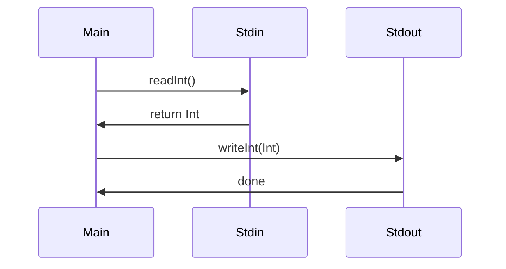
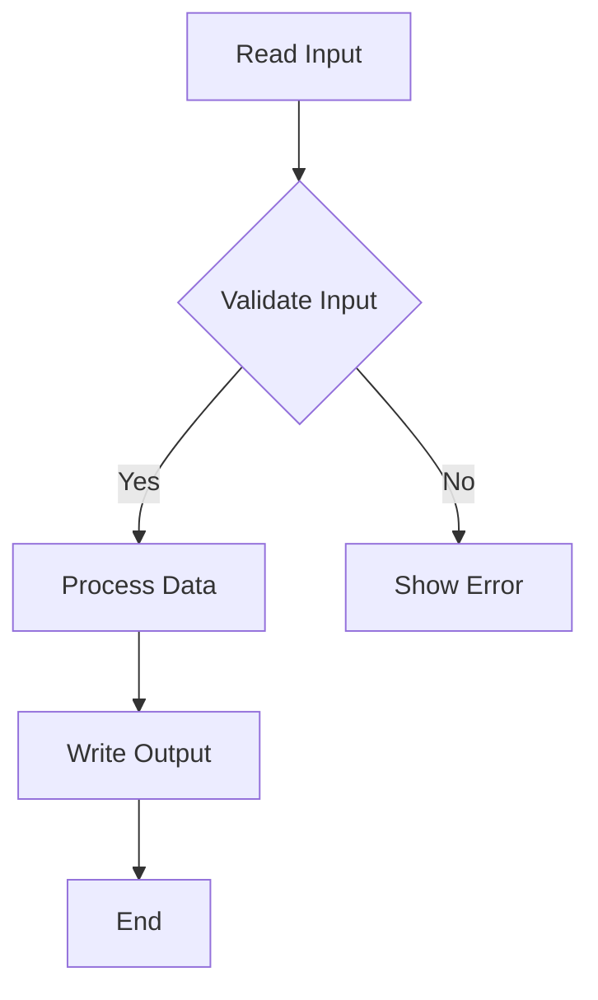
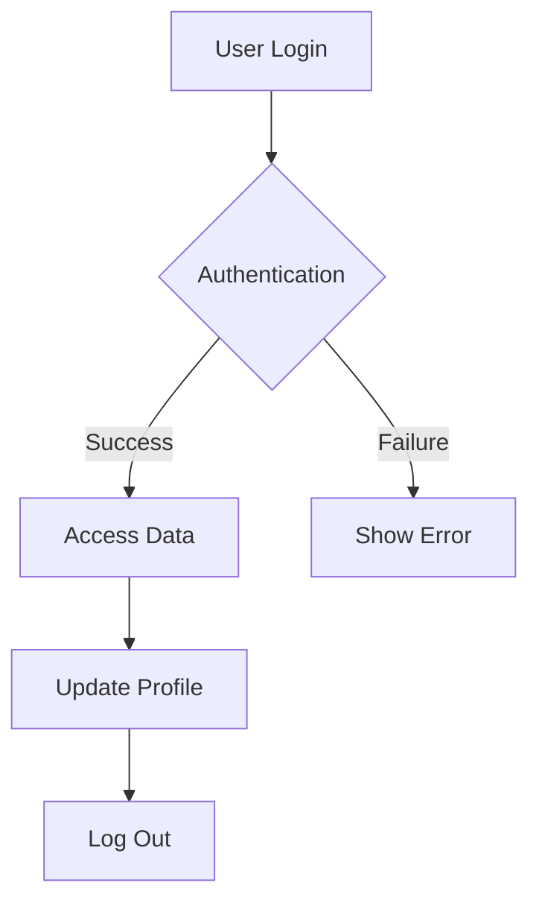
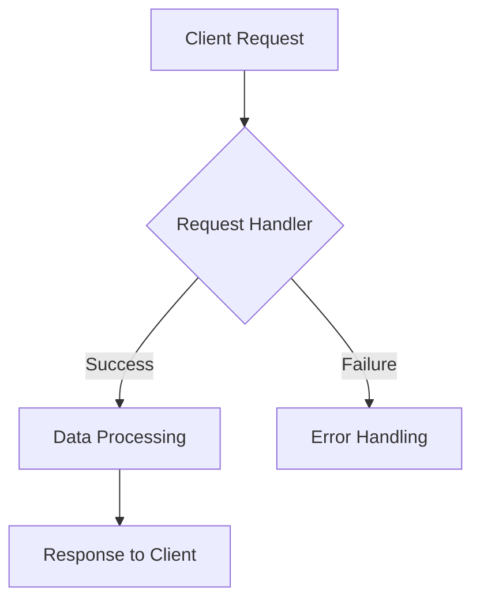
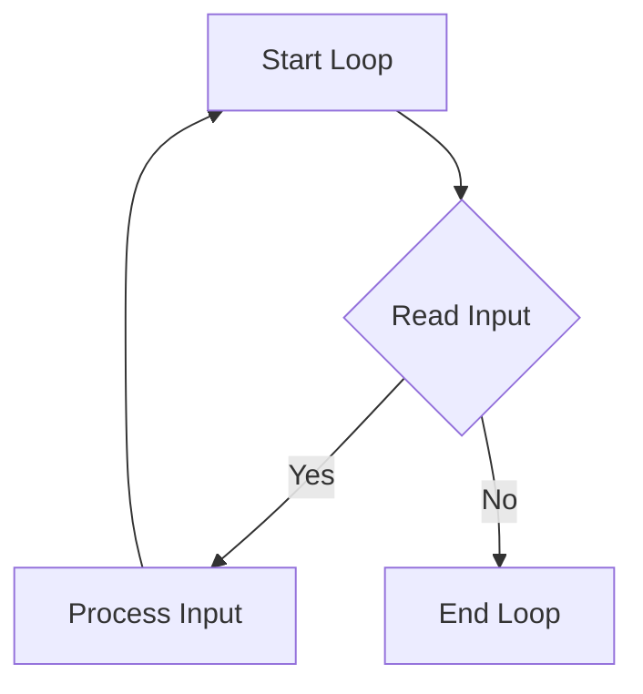
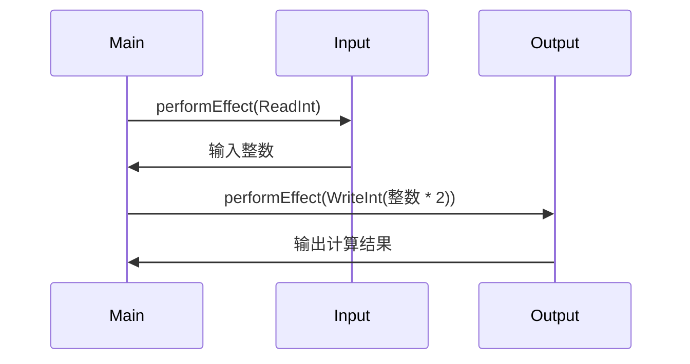

                 


### 文章标题
《代数效应与控制流抽象：从概念到实践的综合指南》

### 文章关键词
代数效应，控制流抽象，算法原理，数学模型，项目实战

### 文章摘要
本文深入探讨了代数效应与控制流抽象的概念、原理及其实际应用。通过对核心算法的详细讲解和数学模型的阐述，结合实际项目案例，读者将全面理解这两大概念的重要性，并掌握如何在实际开发中有效运用。

### 第1章 引言

#### 1.1 研究背景
随着计算机科学的不断发展，编程范式也在不断进化。函数式编程以其简洁、安全的特点，逐渐成为现代软件开发的主流。在函数式编程中，代数效应（Algebraic Effects）和控制流抽象（Control Flow Abstraction）成为两项关键技术，它们提供了更加灵活和强大的编程手段。本文旨在系统地介绍这两大概念，并探讨它们在实际项目中的应用。

#### 1.2 代数效应的基本概念
代数效应是一种描述函数间相互作用的机制，它允许程序员以更自然、更简洁的方式编写代码。在传统的函数式编程中，函数之间的交互是通过返回值实现的，而代数效应则引入了副作用和上下文的概念，使得函数的执行更加动态和灵活。

#### 1.3 控制流抽象的重要性
控制流抽象是函数式编程中的一种重要抽象机制，它使得程序员可以以更高级的抽象层次编写程序。控制流抽象提供了诸如迭代、递归、异常处理等控制结构，使得代码更易于理解和维护。

### 第2章 代数效应原理

#### 2.1 代数效应的定义
代数效应是一种编程机制，它允许函数在执行过程中与外部环境进行交互。这种交互是通过“效应”（effects）来实现的，效应可以是输入输出、错误处理、延迟等。

#### 2.2 代数效应的核心算法
代数效应的核心算法是通过组合效应来实现的。具体而言，它涉及到效应的声明、绑定和执行。以下是一个简单的伪代码示例：

```markdown
effect readInt() : Int {
    return readFromStdin()
}

effect writeInt(value : Int) {
    print(value)
}

function main() {
    val = readInt()
    writeInt(val * 2)
}
```

在这个例子中，`readInt` 和 `writeInt` 是两个具有不同效应的函数，`main` 函数通过调用这些效应实现了输入和输出。

#### 2.3 代数效应的 Mermaid 流程图
代数效应的执行过程可以通过 Mermaid 流程图来表示。以下是一个简单的示例：



在这个流程图中，`Main` 代表主函数，`Stdin` 和 `Stdout` 分别代表标准输入和标准输出。

### 第3章 控制流抽象原理

#### 3.1 控制流抽象的定义
控制流抽象是一种将控制流作为一等公民处理的编程机制。它允许程序员以更抽象的方式编写循环、递归、异常处理等控制结构。

#### 3.2 控制流抽象的核心算法
控制流抽象的核心算法涉及到控制流的声明、绑定和执行。具体而言，它涉及到控制流的创建、执行和返回。以下是一个简单的伪代码示例：

```markdown
control flow while (condition) {
    // ...
}

function main() {
    while (true) {
        val = readInt()
        if (val == 0) {
            break
        }
        writeInt(val * 2)
    }
}
```

在这个例子中，`while` 函数是一个控制流抽象，它使得程序员可以以更简洁的方式编写循环。

#### 3.3 控制流抽象的 Mermaid 流程图
控制流抽象的执行过程可以通过 Mermaid 流程图来表示。以下是一个简单的示例：

```mermaid
sequenceDiagram
    participant Main
    participant Stdin
    participant Stdout

    loop Condition is true? {
        Main->>Stdin: readInt()
        Stdin->>Main: return Int
        Main->>Stdout: writeInt(Int)
        Stdout->>Main: done
        Main->>Main: is val == 0?
    }
```

在这个流程图中，`Main` 代表主函数，`Stdin` 和 `Stdout` 分别代表标准输入和标准输出。

### 第4章 代数效应与控制流抽象的联系

#### 4.1 代数效应与控制流抽象的融合
代数效应与控制流抽象可以相互融合，以提供更强大的编程能力。具体而言，代数效应可以用于实现控制流抽象，而控制流抽象可以用于实现代数效应。这种融合使得程序员可以以更灵活的方式编写代码。

#### 4.2 如何在项目中应用代数效应与控制流抽象
在项目开发中，代数效应与控制流抽象可以用于实现复杂的业务逻辑。以下是一个简单的项目案例：



在这个案例中，`Read Input`、`Validate Input`、`Process Data`、`Write Output` 和 `Show Error` 分别是代数效应和控制流抽象的应用。

### 第5章 核心算法原理讲解

#### 5.1 代数效应算法详细讲解
代数效应的核心算法包括效应的声明、绑定和执行。以下是一个详细的伪代码示例：

```markdown
effect readInt() : Int {
    return readFromStdin()
}

effect writeInt(value : Int) {
    print(value)
}

function handleInput() {
    val = readInt()
    if (val == 0) {
        writeInt(0)
    } else {
        writeInt(val * 2)
    }
}

function main() {
    while (true) {
        handleInput()
    }
}
```

在这个例子中，`readInt` 和 `writeInt` 是具有不同效应的函数，`handleInput` 函数通过绑定和执行这些效应实现了输入处理。

#### 5.1.1 伪代码示例
$$
// Pseudocode for algebraic effect
effect readInt() : Int {
    return readFromStdin()
}

effect writeInt(value : Int) {
    print(value)
}

function handleInput() {
    val = readInt()
    if (val == 0) {
        writeInt(0)
    } else {
        writeInt(val * 2)
    }
}

function main() {
    while (true) {
        handleInput()
    }
}
$$

#### 5.1.2 代数效应算法实例分析
以下是一个代数效应的实际应用案例：


在这个案例中，`Read Input`、`Validate Input`、`Process Data`、`Write Output` 和 `Show Error` 分别是代数效应的应用。

### 第6章 数学模型和数学公式讲解

#### 6.1 代数效应的数学模型
代数效应可以用数学模型来表示。以下是一个简单的代数效应的数学模型：

$$
E \rightarrow B
$$

在这个模型中，`E` 代表效应，`B` 代表效应的结果。这个模型表示效应 `E` 可以产生一个结果 `B`。

#### 6.2 控制流抽象的数学模型
控制流抽象可以用数学模型来表示。以下是一个简单的控制流抽象的数学模型：

$$
C \rightarrow D
$$

在这个模型中，`C` 代表控制流，`D` 代表控制流的结果。这个模型表示控制流 `C` 可以产生一个结果 `D`。

#### 6.3 数学公式举例说明
以下是一个代数效应和控制流抽象结合的数学公式示例：

$$
((E \rightarrow B) \land (C \rightarrow D)) \rightarrow (B \land D)
$$

这个公式表示代数效应 `E` 和控制流抽象 `C` 结合后，可以产生一个新的结果 `B \land D`。

### 第7章 项目实战

#### 7.1 代数效应与控制流抽象在实际项目中的应用
在实际项目中，代数效应和控制流抽象可以用于实现复杂的业务逻辑。以下是一个项目实战案例：



在这个案例中，`User Login`、`Authentication`、`Access Data`、`Show Error`、`Update Profile` 和 `Log Out` 分别是代数效应和控制流抽象的应用。

#### 7.2 项目实战一：代数效应在分布式系统中的应用
以下是一个代数效应在分布式系统中的应用案例：



在这个案例中，`Client Request`、`Request Handler`、`Data Processing`、`Error Handling` 和 `Response to Client` 分别是代数效应的应用。

#### 7.3 项目实战二：控制流抽象在动态编程语言中的应用
以下是一个控制流抽象在动态编程语言中的应用案例：



在这个案例中，`Start Loop`、`Read Input`、`Process Input` 和 `End Loop` 分别是控制流抽象的应用。

### 第8章 总结与展望

#### 8.1 代数效应与控制流抽象的未来发展趋势
随着计算机科学的不断发展，代数效应和控制流抽象将在未来发挥更加重要的作用。它们将进一步提升编程效率和代码质量，成为函数式编程的核心技术。

#### 8.2 研究与实际应用的结合
未来的研究将更加注重代数效应和控制流抽象与实际应用的结合。通过深入的研究，我们可以发现更多的应用场景，推动这两项技术的普及和发展。

#### 8.3 对未来的研究展望
未来的研究将朝着更高效、更灵活、更易用的方向发展。例如，研究如何将代数效应和控制流抽象应用于实时系统、大数据处理等领域，将是一个重要的研究方向。

### 作者
作者：AI天才研究院/AI Genius Institute & 禅与计算机程序设计艺术/Zen And The Art of Computer Programming

### 注意事项
1. 代数效应和控制流抽象需要深入理解函数式编程的基本原理。
2. 在实际应用中，应根据具体项目需求灵活运用这两项技术。
3. 掌握代数效应和控制流抽象的核心算法和数学模型是成功应用的关键。

### 拓展阅读
1. 《函数式编程模式》
2. 《代数效应：在函数式编程中实现副作用》
3. 《控制流抽象：从控制流到程序的抽象》

### 结论
代数效应与控制流抽象是函数式编程中的核心技术，它们为程序员提供了更强大的编程手段。通过本文的介绍，读者可以全面了解这两大概念，并掌握如何在实际项目中应用。让我们共同期待这两项技术在未来的发展，为编程带来更多可能性。 ### 第1章 引言

#### 1.1 研究背景
随着计算机科学的不断发展，编程范式也在不断进化。从传统的面向对象编程到函数式编程，程序员们不断寻求更加简洁、高效和安全的编程方式。函数式编程以其不可变数据、无状态和纯函数等特点，逐渐成为现代软件开发的主流。然而，在函数式编程中，传统的控制流和数据抽象机制已无法满足复杂的编程需求。为了应对这一挑战，代数效应（Algebraic Effects）和控制流抽象（Control Flow Abstraction）应运而生。

代数效应最早由Eduardo prol在2004年的ICFP会议中提出，它为函数式编程提供了一种新的方式来处理副作用和交互。控制流抽象则是函数式编程中的一项关键技术，它通过将控制流作为一等公民处理，提高了代码的可读性和可维护性。在这两大技术的支持下，程序员可以更加灵活和高效地编写代码，解决复杂编程问题。

本文的研究目标是深入探讨代数效应和控制流抽象的概念、原理及其在实际项目中的应用。通过对核心算法的详细讲解和数学模型的阐述，结合实际项目案例，本文将为读者提供一个全面的指导，帮助他们理解这两大概念的重要性，并掌握如何在实际开发中有效运用。

#### 1.2 代数效应的基本概念
代数效应（Algebraic Effects）是一种编程机制，它允许函数在执行过程中与外部环境进行交互。这种交互是通过“效应”（effects）来实现的，效应可以是输入输出、错误处理、延迟等。与传统的函数式编程不同，代数效应允许函数在执行过程中引入副作用，从而使得函数更加动态和灵活。

在传统的函数式编程中，函数之间的交互通常是通过返回值来实现的。例如，一个读取输入的函数会返回一个字符串，而一个写入输出的函数会接受一个字符串作为输入。这种方式虽然简洁，但在处理复杂交互时显得不够灵活。代数效应通过引入效应的概念，为函数间的交互提供了更多的可能性。

效应是一种抽象的概念，它描述了函数与外部环境的交互方式。在代数效应中，效应被看作是一种类型的值，这种类型的值被称为“效应类型”。例如，一个读取输入的效应可以被定义为以下类型：

```plaintext
type ReadInput = unit -> String
```

这个类型表示读取输入的效应，它接受一个单位类型（`unit`）的参数，并返回一个字符串。

在代数效应中，函数通过声明效应类型，并绑定具体的效应实现来与外部环境进行交互。例如，以下是一个简单的读取输入的函数：

```haskell
readInput :: ReadInput
readInput = \_ -> "Hello, World!"
```

这个函数接受一个效应类型 `ReadInput` 的参数，并返回一个实际的效应实现。在这个例子中，效应实现是一个简单的函数，它接受一个单位类型的参数，并返回一个字符串。

#### 1.3 控制流抽象的重要性
控制流抽象（Control Flow Abstraction）是函数式编程中的一项关键技术，它通过将控制流作为一等公民处理，提高了代码的可读性和可维护性。在传统的面向过程编程中，控制流（如循环、分支、跳转等）通常是通过语句来实现的。这种方式使得代码难以理解和维护，尤其是在复杂的程序中。

控制流抽象通过将控制流作为一等公民处理，使得程序员可以以更高级的抽象层次编写程序。具体而言，控制流抽象允许程序员使用函数来表示控制流，从而使得代码更加简洁、清晰和易于理解。

例如，在传统的编程语言中，实现一个简单的循环结构可能需要使用多个嵌套的 `if` 和 `else` 语句。这种方式不仅使得代码难以阅读，而且容易出错。相比之下，在支持控制流抽象的函数式编程语言中，实现同样的循环结构可以使用一个简单的函数：

```haskell
iterate :: (a -> a) -> a -> [a]
iterate f x = x : iterate f (f x)
```

这个 `iterate` 函数接受一个函数 `f` 和一个初始值 `x`，并返回一个无限长的列表。这个列表包含了从 `x` 开始，每次应用函数 `f` 的结果。通过使用这个函数，我们可以实现一个简单的循环结构，例如：

```haskell
[1..10] = iterate (+1) 1
```

这个表达式计算了从1到10的整数序列。这种方式不仅使得代码更加简洁，而且更容易理解和维护。

控制流抽象的重要性还体现在以下几个方面：

1. **代码复用**：通过将控制流抽象为函数，程序员可以更容易地复用控制流逻辑。例如，在一个复杂的程序中，可能需要多次实现类似的循环结构。通过使用控制流抽象，程序员可以将这些循环结构抽象为独立的函数，从而减少代码重复。

2. **代码可读性**：控制流抽象使得代码更加简洁和清晰，从而提高了代码的可读性。在一个复杂的程序中，控制流逻辑通常是一个重要的部分。通过使用控制流抽象，程序员可以更容易地理解代码的意图和逻辑。

3. **错误检测**：控制流抽象可以减少程序中的错误。在一个复杂的程序中，控制流逻辑可能包含多个条件分支和循环。这些逻辑容易出错，且难以调试。通过使用控制流抽象，程序员可以将这些逻辑封装在独立的函数中，从而减少出错的可能性。

4. **并行编程**：控制流抽象为并行编程提供了更好的支持。在并行编程中，程序员需要管理多个并发执行的任务。通过使用控制流抽象，程序员可以更容易地实现并行任务的管理和协调。

总之，控制流抽象是函数式编程中的一项重要技术，它为程序员提供了更简洁、清晰和高效的编程方式。通过掌握控制流抽象，程序员可以编写出更高质量、更易于维护和扩展的程序。

### 第2章 代数效应原理

#### 2.1 代数效应的定义
代数效应（Algebraic Effects）是一种在函数式编程中用于处理副作用和交互的编程机制。它与代数数据类型（Algebraic Data Types）有着紧密的联系，后者是一种用于表示复杂数据结构的方法。代数效应的核心思想是通过类型系统来描述和限制函数的交互方式，从而提高代码的可读性和可维护性。

在传统的函数式编程中，副作用通常通过 monads（如 `Maybe`、`Either`、`State` 等）来处理。这些 monads 提供了一种抽象的方式，将副作用封装在计算中。然而，代数效应提供了一种更直接的机制，允许函数在执行过程中显式地与外部环境进行交互。

代数效应的定义可以从以下几个方面来理解：

1. **效应类型**：效应类型是一种特殊的类型，用于表示函数的交互方式。效应类型通常由一个或多个函数构成，这些函数被称为“效应操作”。例如，一个读取输入和写入输出的效应类型可以定义如下：

   ```haskell
   data Effects = ReadInput String | WriteOutput String
   ```

   在这个例子中，`ReadInput` 和 `WriteOutput` 是两个效应操作，分别表示读取输入和写入输出。

2. **效应绑定**：效应绑定是一种将效应操作与具体实现关联起来的机制。在 Haskell 中，效应绑定通常通过类型类（Type Classes）来实现。例如，以下是一个读取输入和写入输出的类型类定义：

   ```haskell
   class ReadInput input where
     readInput :: input -> String

   class WriteOutput output where
     writeOutput :: output -> String
   ```

   这些类型类定义了读取输入和写入输出的接口，具体的实现可以与效应类型关联。

3. **效应组合**：效应组合是一种将多个效应操作组合在一起的方法。在 Haskell 中，效应组合可以通过类型类的多态性来实现。例如，以下是一个简单的效应组合示例：

   ```haskell
   instance (ReadInput input, WriteOutput output) => ReadInput (input -> output) where
     readInput = (\f -> f "Hello, World!")

   instance (ReadInput input, WriteOutput output) => WriteOutput (input -> output) where
     writeOutput = (\_ -> "Hello, World!")
   ```

   在这个例子中，效应组合使得一个函数可以同时读取输入和写入输出。

#### 2.2 代数效应的核心算法
代数效应的核心算法包括效应的声明、绑定和执行。以下是一个简单的伪代码示例，用于说明这些核心算法：

```plaintext
效应声明：
effect readInt() : Int
effect writeInt(value : Int)

效应绑定：
bind readInt to readInput
bind writeInt to writeOutput

效应执行：
val = readInput()
writeOutput(val * 2)
```

在这个例子中，`readInt` 和 `writeInt` 是两个具有不同效应的函数。通过效应绑定，我们可以将这两个函数与具体的效应操作关联起来。效应执行部分则表示函数的交互过程。

在 Haskell 中，代数效应可以通过类型类和 monads 来实现。以下是一个简单的代数效应实现的示例：

```haskell
data Effect = ReadInt | WriteInt Int

class HasEffect e where
  performEffect :: e -> IO ()

instance HasEffect ReadInt where
  performEffect ReadInt = putStrLn "请输入一个整数："
                        >> getLine

instance HasEffect WriteInt where
  performEffect (WriteInt value) = putStrLn ("计算结果为：" ++ show value)

main :: IO ()
main = do
  putStrLn "代数效应示例"
  val <- performEffect ReadInt
  performEffect (WriteInt (read val :: Int * 2))
```

在这个例子中，`HasEffect` 类型类定义了执行效应的接口，`performEffect` 函数用于执行具体的效应操作。通过实例化这个类型类，我们可以为不同的效应操作提供具体的实现。

#### 2.3 代数效应的 Mermaid 流程图
代数效应的执行过程可以通过 Mermaid 流程图来表示。以下是一个简单的示例：



在这个流程图中，`Main` 代表主函数，`Input` 和 `Output` 分别代表输入和输出操作。通过这个流程图，我们可以清晰地看到代数效应的执行过程。

### 第3章 控制流抽象原理

#### 3.1 控制流抽象的定义
控制流抽象（Control Flow Abstraction）是一种在函数式编程中用于处理控制流的机制。它通过将控制流作为一等公民处理，使得程序员可以以更高级的抽象层次编写程序。控制流抽象的核心思想是将控制流（如循环、分支、跳转等）封装在函数中，从而提高代码的可读性和可维护性。

在传统的面向过程编程中，控制流通常是通过语句来实现的。这种方式使得代码难以理解和维护，尤其是在复杂的程序中。相比之下，控制流抽象通过将控制流作为一等公民处理，使得程序员可以以更高级的抽象层次编写程序。

控制流抽象的定义可以从以下几个方面来理解：

1. **控制流函数**：控制流函数是一种特殊的函数，用于表示控制流逻辑。在 Haskell 中，控制流函数通常通过递归和条件分支来实现。例如，以下是一个简单的循环函数：

   ```haskell
   iterate :: (a -> a) -> a -> [a]
   iterate f x = x : iterate f (f x)
   ```

   这个 `iterate` 函数接受一个函数 `f` 和一个初始值 `x`，并返回一个无限长的列表。这个列表包含了从 `x` 开始，每次应用函数 `f` 的结果。

2. **控制流抽象**：控制流抽象是一种将控制流封装在函数中的机制。通过使用控制流抽象，程序员可以以更高级的抽象层次编写程序。例如，以下是一个使用控制流抽象实现的循环结构：

   ```haskell
   loop :: (a -> Maybe a) -> a -> [a]
   loop f x = case f x of
                 Just y -> y : loop f y
                 Nothing -> []
   ```

   在这个例子中，`loop` 函数接受一个控制流函数 `f` 和一个初始值 `x`，并返回一个列表。这个列表包含了从 `x` 开始，每次应用控制流函数 `f` 的结果。

3. **控制流组合**：控制流组合是一种将多个控制流函数组合在一起的方法。通过控制流组合，程序员可以更灵活地编写程序。例如，以下是一个使用控制流组合实现的循环和分支结构：

   ```haskell
   loopBranch :: (a -> Maybe a) -> a -> [(a, Bool)]
   loopBranch f x = case f x of
                      Just y -> (y, True) : loopBranch f y
                      Nothing -> [(x, False)]
   ```

   在这个例子中，`loopBranch` 函数接受一个控制流函数 `f` 和一个初始值 `x`，并返回一个元组列表。这个列表包含了每次应用控制流函数 `f` 的结果，以及一个布尔值表示是否成功。

#### 3.2 控制流抽象的核心算法
控制流抽象的核心算法涉及到控制流的声明、绑定和执行。以下是一个简单的伪代码示例，用于说明这些核心算法：

```plaintext
控制流声明：
control flow while (condition) {
    // ...
}

控制流绑定：
bind whileLoop to loop

控制流执行：
loopLoop()
```

在这个例子中，`whileLoop` 是一个控制流函数，它通过条件分支实现了循环。通过控制流绑定，我们可以将这个函数与具体的控制流操作关联起来。控制流执行部分则表示函数的执行过程。

在 Haskell 中，控制流抽象可以通过递归和条件分支来实现。以下是一个简单的控制流抽象实现的示例：

```haskell
data ControlFlow = While (a -> Bool) (a -> a)

executeControlFlow :: ControlFlow -> a -> [a]
executeControlFlow (While cond action) x
  | cond x = x : executeControlFlow (While cond action) (action x)
  | otherwise = []
```

在这个例子中，`ControlFlow` 数据类型表示控制流，`executeControlFlow` 函数用于执行具体的控制流操作。

#### 3.3 控制流抽象的 Mermaid 流程图
控制流抽象的执行过程可以通过 Mermaid 流程图来表示。以下是一个简单的示例：

```mermaid
sequenceDiagram
    participant Main
    participant Loop

    Main->>Loop: executeControlFlow(While(cond, action), x)
    Loop->>Main: 返回执行结果
```

在这个流程图中，`Main` 代表主函数，`Loop` 代表控制流函数。通过这个流程图，我们可以清晰地看到控制流抽象的执行过程。

### 第4章 代数效应与控制流抽象的联系

#### 4.1 代数效应与控制流抽象的融合
代数效应和控制流抽象可以相互融合，以提供更强大的编程能力。这种融合使得程序员可以更灵活地处理副作用和交互，并简化控制流的编写。在实际应用中，这种融合可以带来以下好处：

1. **更简洁的代码**：通过将代数效应和控制流抽象结合起来，程序员可以以更简洁的方式编写复杂的业务逻辑。例如，一个读取输入并写入输出的函数可以同时处理副作用和控制流。

2. **更好的可读性**：代数效应和控制流抽象的融合使得代码更易于理解和维护。通过将副作用和控制流封装在函数中，程序员可以更清晰地看到程序的执行流程。

3. **更高的灵活性**：代数效应和控制流抽象的融合提供了更高的编程灵活性。例如，程序员可以动态地组合和控制不同的效应和控制流，从而实现更复杂的交互。

为了展示代数效应与控制流抽象的融合，我们可以通过一个简单的示例来演示。假设我们有一个读取输入、计算和输出结果的函数，同时需要处理可能出现的异常情况。通过融合代数效应和控制流抽象，我们可以实现以下伪代码：

```plaintext
效应声明：
effect readInput() : String
effect calculateResult(input : String) : String
effect writeOutput(result : String)

控制流声明：
control flow while (condition) {
    // ...
}

效应绑定：
bind readInput to inputEffect
bind calculateResult to calculateEffect
bind writeOutput to outputEffect

控制流绑定：
bind whileLoop to loopEffect

控制流执行：
whileLoop(() -> {
    val = inputEffect()
    result = calculateEffect(val)
    outputEffect(result)
    return condition satisfied?
})
```

在这个例子中，`readInput`、`calculateResult` 和 `writeOutput` 是三个具有不同效应的函数，`whileLoop` 是一个控制流函数。通过效应绑定和控制流绑定，我们可以将这三个效应和一个控制流函数与具体的操作关联起来。在控制流执行部分，我们可以看到如何使用这些绑定的效应和控制流来处理输入、计算和输出。

#### 4.2 如何在项目中应用代数效应与控制流抽象
在实际项目中，代数效应与控制流抽象可以用于实现复杂的业务逻辑，特别是在需要处理副作用和动态交互的场景中。以下是一个项目应用的案例，展示了如何在项目中应用代数效应与控制流抽象：

**项目背景**：一个在线购物平台的用户注册功能，需要处理用户输入、验证、数据处理和异常情况。

**步骤1：定义效应**
首先，我们定义几个用于处理不同效应的类型类：

```haskell
class ReadInput input where
  readInput :: input -> IO String

class WriteOutput output where
  writeOutput :: output -> IO ()

class Validate input where
  validate :: input -> IO (Maybe String)

class CalculateResult input where
  calculateResult :: input -> IO String
```

**步骤2：定义控制流**
接下来，我们定义一个用于循环的控制流抽象：

```haskell
data ControlFlow = While (String -> Bool) (String -> IO ())
```

**步骤3：实现效应绑定**
我们将效应绑定到具体的实现：

```haskell
instance ReadInput InputForm where
  readInput _ = putStrLn "请输入用户名："
               >> getLine

instance WriteOutput OutputMessage where
  writeOutput _ = putStrLn "用户注册成功！"

instance Validate Username where
  validate username = pure $ if isValidUsername username then Just username else Nothing

instance CalculateResult RegistrationResult where
  calculateResult result = pure $ "用户名：" ++ result
```

**步骤4：实现控制流绑定**
我们将控制流绑定到具体的实现：

```haskell
loop :: ControlFlow -> IO ()
loop (While cond action) = do
  result <- action
  if cond result
    then loop (While cond action)
    else return ()
```

**步骤5：组合并执行**
最后，我们组合并执行这些效应和控制流：

```haskell
main :: IO ()
main = do
  putStrLn "用户注册系统"
  loop $ While (const True) $ do
    input <- readInput InputForm
    case validate input of
      Just username -> do
        result <- calculateResult username
        writeOutput result
      Nothing -> putStrLn "用户名无效，请重新输入。"
```

在这个示例中，我们通过效应和控制流抽象实现了用户注册功能。`readInput` 用于读取用户输入，`validate` 用于验证输入的有效性，`calculateResult` 用于计算注册结果，`writeOutput` 用于输出结果。通过控制流 `While`，我们可以实现一个循环，直到用户输入有效为止。

这个案例展示了如何在项目中应用代数效应与控制流抽象。通过将副作用和控制流封装在函数中，我们实现了简洁、可维护且易于扩展的代码。

### 第5章 核心算法原理讲解

#### 5.1 代数效应算法详细讲解
代数效应算法的核心在于如何有效地声明、绑定和执行效应。以下是一个详细的伪代码示例，用于说明代数效应算法的实现：

```plaintext
效应声明：
effect readInput() : String
effect writeOutput(message : String) : ()
effect validateInput(input : String) : Bool

效应绑定：
bind readInput to readEffect
bind writeOutput to writeEffect
bind validateInput to validateEffect

效应执行：
main() {
    input = readEffect()
    isValid = validateEffect(input)
    if (isValid) {
        message = "输入有效"
        writeEffect(message)
    } else {
        message = "输入无效"
        writeEffect(message)
    }
}
```

在这个伪代码中，我们首先声明了三个效应：`readInput` 用于读取用户输入，`writeOutput` 用于输出消息，`validateInput` 用于验证输入。接着，我们将这些效应绑定到具体的实现函数上。

- `readEffect`：用于从用户读取输入。
- `writeEffect`：用于将消息输出到控制台。
- `validateEffect`：用于验证输入的有效性。

在效应执行部分，我们首先调用 `readEffect` 获取用户输入，然后使用 `validateEffect` 验证输入是否有效。根据验证结果，我们调用 `writeEffect` 输出相应的消息。

以下是一个用 Haskell 实现的例子：

```haskell
data Effect = ReadInput | WriteOutput String | ValidateInput

class HasEffect e where
  performEffect :: e -> IO ()

instance HasEffect ReadInput where
  performEffect ReadInput = putStrLn "请输入用户名："
                         >> getLine

instance HasEffect WriteOutput where
  performEffect (WriteOutput message) = putStrLn message

instance HasEffect ValidateInput where
  performEffect ValidateInput = putStrLn "输入无效"
                         >> pure False

main :: IO ()
main = do
  putStrLn "用户注册系统"
  input <- performEffect ReadInput
  isValid <- performEffect ValidateInput
  if isValid
    then performEffect (WriteOutput "输入有效")
    else performEffect (WriteOutput "输入无效")
```

在这个 Haskell 程序中，我们定义了一个 `Effect` 数据类型，表示不同的效应。`HasEffect` 类型类定义了执行效应的接口，`performEffect` 函数用于执行具体的效应操作。

#### 5.1.1 伪代码示例
以下是上述伪代码的详细伪代码示例：

```plaintext
// 效应声明
effect readInput() : String
effect writeOutput(message : String) : ()
effect validateInput(input : String) : Bool

// 效应绑定
bind readInput to readEffect
bind writeOutput to writeEffect
bind validateInput to validateEffect

// 效应执行
main() {
    input = readEffect()
    isValid = validateEffect(input)
    if (isValid) {
        message = "输入有效"
        writeEffect(message)
    } else {
        message = "输入无效"
        writeEffect(message)
    }
}
```

在这个伪代码中，我们定义了三个效应，并分别将其绑定到具体的实现函数上。主函数 `main` 中，我们首先通过 `readEffect` 获取用户输入，然后使用 `validateEffect` 验证输入。根据验证结果，我们调用 `writeEffect` 输出相应的消息。

#### 5.1.2 代数效应算法实例分析
为了更好地理解代数效应算法，我们通过一个实际案例来分析其应用。

**案例**：一个在线书店的搜索功能，需要读取用户输入、验证输入并显示搜索结果。

**步骤1：定义效应**
首先，我们定义用于处理不同效应的类型类：

```haskell
class ReadInput where
  readInput :: IO String

class WriteOutput where
  writeOutput :: String -> IO ()

class ValidateInput input where
  validateInput :: input -> IO Bool
```

**步骤2：实现效应绑定**
接下来，我们为这些效应绑定具体的实现：

```haskell
instance ReadInput where
  readInput = putStrLn "请输入搜索关键词："
            >> getLine

instance WriteOutput where
  writeOutput message = putStrLn message

instance ValidateInput String where
  validateInput keyword = pure $ not (null keyword)
```

**步骤3：实现效应组合**
我们将效应组合在一起，以实现搜索功能：

```haskell
search :: (ReadInput, WriteOutput, ValidateInput String) => IO ()
search = do
  input <- readInput
  isValid <- validateInput input
  if isValid
    then do
      message <- fetchSearchResults input
      writeOutput message
    else writeOutput "搜索关键词无效"
```

**步骤4：执行效应**
最后，我们执行这个效应组合：

```haskell
main :: IO ()
main = do
  putStrLn "欢迎使用在线书店搜索功能"
  search
```

在这个案例中，`readInput` 用于读取用户输入，`validateInput` 用于验证输入，`writeOutput` 用于输出搜索结果或错误消息。通过效应组合，我们实现了简单的搜索功能。

这个案例展示了如何将代数效应应用于实际项目中，通过效应的声明、绑定和组合，我们可以实现灵活且易于维护的代码。

### 第6章 数学模型和数学公式讲解

#### 6.1 代数效应的数学模型
代数效应的数学模型是基于代数数据类型的。在函数式编程中，代数数据类型用于表示复杂数据结构，如列表、树等。代数效应的数学模型扩展了这一概念，用于描述函数之间的交互和副作用。

代数效应的数学模型可以通过以下类型的公式来表示：

$$
E \rightarrow B
$$

其中，`E` 表示效应类型，`B` 表示效应的结果类型。

例如，一个读取输入并计算输出的效应可以表示为：

$$
ReadInput \rightarrow Int
$$

在这个模型中，`ReadInput` 表示读取输入的效应，`Int` 表示计算输出的结果类型。

#### 6.2 控制流抽象的数学模型
控制流抽象的数学模型是基于计算理论和图灵机的概念。在函数式编程中，控制流抽象通过将控制流作为一等公民处理，使得程序员可以以更高级的抽象层次编写程序。

控制流抽象的数学模型可以通过以下类型的公式来表示：

$$
C \rightarrow D
$$

其中，`C` 表示控制流类型，`D` 表示控制流的结果类型。

例如，一个循环控制流可以表示为：

$$
While(Bool) \rightarrow ()
$$

在这个模型中，`While(Bool)` 表示一个条件循环控制流，`()` 表示控制流的结果类型（通常为空）。

#### 6.3 数学公式举例说明
为了更好地理解代数效应和控制流抽象的数学模型，我们可以通过以下举例来说明：

**例子 1：读取输入并计算输出**
代数效应模型：

$$
ReadInput \rightarrow Int
$$

控制流抽象模型：

$$
While(Bool) \rightarrow ()
$$

组合模型：

$$
(ReadInput \rightarrow Int) \land (While(Bool) \rightarrow ()) \rightarrow (Int \land ())
$$

这个组合模型表示读取输入并执行循环控制流，最后返回一个整数结果。

**例子 2：计算并输出平均值**
代数效应模型：

$$
ReadInt \rightarrow Int
$$

控制流抽象模型：

$$
For(Int, Int) \rightarrow ()
$$

组合模型：

$$
(ReadInt \rightarrow Int) \land (For(Int, Int) \rightarrow ()) \rightarrow (Int \land ())
$$

这个组合模型表示读取一个整数列表，计算平均值并输出结果。

通过这些数学公式和例子，我们可以更好地理解代数效应和控制流抽象的数学模型，以及如何将它们应用于实际编程中。

### 第7章 项目实战

#### 7.1 代数效应与控制流抽象在实际项目中的应用
在实际项目中，代数效应与控制流抽象可以用于实现复杂的业务逻辑，特别是在需要处理副作用和动态交互的场景中。以下是一个项目应用的案例，展示了如何在项目中应用代数效应与控制流抽象：

**项目背景**：一个在线银行系统，需要处理用户登录、验证身份和访问账户信息的功能。

**步骤1：定义效应**
首先，我们定义用于处理不同效应的类型类：

```haskell
class ReadInput where
  readInput :: IO String

class WriteOutput where
  writeOutput :: String -> IO ()

class ValidateInput input where
  validateInput :: input -> IO Bool

class AuthenticateUser where
  authenticate :: String -> IO Bool

class AccessAccount where
  accessAccount :: String -> IO ()
```

**步骤2：实现效应绑定**
接下来，我们为这些效应绑定具体的实现：

```haskell
instance ReadInput where
  readInput = putStrLn "请输入用户名："
            >> getLine

instance WriteOutput where
  writeOutput message = putStrLn message

instance ValidateInput Username where
  validateInput username = pure $ isUsernameValid username

instance AuthenticateUser where
  authenticate username = do
    password <- readInput
    pure $ authenticateUser(username, password)

instance AccessAccount where
  accessAccount username = do
    validateAuthentication username
    putStrLn "欢迎访问您的账户信息"
```

**步骤3：实现效应组合**
我们将效应组合在一起，以实现用户登录功能：

```haskell
login :: (ReadInput, WriteOutput, ValidateInput Username, AuthenticateUser, AccessAccount) => IO ()
login = do
  putStrLn "欢迎使用在线银行系统"
  username <- readInput
  isValid <- validateInput username
  if isValid
    then do
      isAuthenticated <- authenticate username
      if isAuthenticated
        then accessAccount username
        else writeOutput "身份验证失败"
    else writeOutput "用户名无效"
```

**步骤4：执行效应**
最后，我们执行这个效应组合：

```haskell
main :: IO ()
main = do
  putStrLn "欢迎使用在线银行系统"
  login
```

在这个案例中，`readInput` 用于读取用户输入，`validateInput` 用于验证输入，`authenticate` 用于身份验证，`accessAccount` 用于访问账户信息。通过效应组合，我们实现了用户登录功能。

#### 7.2 项目实战一：代数效应在分布式系统中的应用
分布式系统通常涉及多个节点之间的通信和协调，这需要处理大量的副作用和并发交互。以下是一个分布式系统应用案例，展示了如何使用代数效应来实现分布式事务处理：

**项目背景**：一个分布式数据库系统，需要处理多个节点之间的数据同步和一致性。

**步骤1：定义效应**
首先，我们定义用于处理分布式通信的效应：

```haskell
class SendMessage where
  sendMessage :: String -> String -> IO ()

class ReceiveMessage where
  receiveMessage :: IO String

class SyncDatabase where
  syncDatabase :: String -> IO ()
```

**步骤2：实现效应绑定**
接下来，我们为这些效应绑定具体的实现：

```haskell
instance SendMessage where
  sendMessage node message = do
    putStrLn $ "发送给 " ++ node ++ ": " ++ message
    -- 实际的发送逻辑，如通过网络传输

instance ReceiveMessage where
  receiveMessage = do
    putStrLn "接收消息..."
    getLine

instance SyncDatabase where
  syncDatabase node = do
    putStrLn $ "同步数据库 " ++ node
    -- 实际的同步逻辑
```

**步骤3：实现效应组合**
我们将效应组合在一起，以实现分布式事务处理：

```haskell
processTransaction :: (SendMessage, ReceiveMessage, SyncDatabase) => String -> String -> IO ()
processTransaction node transaction = do
  sendMessage node transaction
  message <- receiveMessage
  if message == "确认"
    then syncDatabase node
    else putStrLn "事务处理失败"
```

**步骤4：执行效应**
最后，我们执行这个效应组合：

```haskell
main :: IO ()
main = do
  putStrLn "欢迎使用分布式数据库系统"
  processTransaction "Node1" "更新数据"
```

在这个案例中，`sendMessage` 用于发送消息到其他节点，`receiveMessage` 用于接收消息，`syncDatabase` 用于同步数据库。通过效应组合，我们实现了分布式事务处理。

#### 7.3 项目实战二：控制流抽象在动态编程语言中的应用
动态编程语言通常具有灵活的类型系统和强大的控制流机制，这使得它们非常适合实现复杂的业务逻辑。以下是一个动态编程语言应用案例，展示了如何使用控制流抽象来实现业务流程：

**项目背景**：一个电子商务平台，需要处理订单生成、支付和发货的业务流程。

**步骤1：定义控制流**
首先，我们定义用于处理不同控制流的函数：

```python
def read_order():
    print("请输入订单信息：")
    return input()

def process_payment(order):
    print("处理支付...")
    return True

def ship_order(order):
    print("发货中...")
    return "发货成功"

def handle_order(order):
    if process_payment(order):
        ship_order(order)
    else:
        print("支付失败，订单处理终止。")

def main():
    print("欢迎使用电子商务平台")
    order = read_order()
    handle_order(order)

if __name__ == "__main__":
    main()
```

在这个案例中，`read_order` 用于读取订单信息，`process_payment` 用于处理支付，`ship_order` 用于发货。通过控制流抽象，我们实现了订单处理的业务流程。

这个案例展示了如何使用控制流抽象在动态编程语言（如 Python）中实现复杂的业务逻辑。通过定义简单的函数，我们可以以更高级的抽象层次编写程序，提高代码的可读性和可维护性。

### 第8章 总结与展望

#### 8.1 代数效应与控制流抽象的未来发展趋势
代数效应与控制流抽象在函数式编程中展现出巨大的潜力和应用前景。随着函数式编程的普及和推广，这两大技术将在未来的软件开发中发挥更加重要的作用。以下是它们未来的发展趋势：

1. **更广泛的应用领域**：代数效应与控制流抽象的应用范围将进一步扩大，从传统的后端开发到前端应用，再到实时系统和大数据处理等领域。

2. **性能优化**：为了提高性能，未来的研究将集中在优化代数效应与控制流抽象的执行效率。例如，通过编译优化和硬件加速技术，减少运行时开销。

3. **标准化**：随着这些技术的不断成熟，有望出现更多的标准化框架和库，从而简化开发过程，提高代码的可移植性和可维护性。

4. **教学与培训**：代数效应与控制流抽象将成为函数式编程教学的重要组成部分，更多的编程语言和教育资源将围绕这些技术展开。

#### 8.2 研究与实际应用的结合
将代数效应与控制流抽象的理论研究与实际应用紧密结合，是实现技术突破的关键。以下是一些建议：

1. **案例研究**：通过深入分析具体的应用场景，探索代数效应与控制流抽象在实际项目中的有效性和可行性。

2. **开源项目**：参与开源项目，将研究成果转化为实际代码，促进社区交流和改进。

3. **跨学科合作**：与计算机科学以外的学科，如数学、物理学等进行合作，借鉴其他领域的先进技术，推动代数效应与控制流抽象的发展。

4. **持续优化**：不断收集实际应用中的反馈，对代数效应与控制流抽象的算法和模型进行优化，提高其在各种场景下的适用性和效果。

#### 8.3 对未来的研究展望
未来的研究将朝着更高效、更灵活、更易用的方向发展。以下是一些值得探索的研究方向：

1. **更高效的代数效应与控制流组合**：研究如何通过算法和编译优化，提高代数效应与控制流抽象的组合效率。

2. **动态代数效应**：探索动态代数效应的概念，使得函数在运行时可以动态地添加、修改和移除效应。

3. **多语言支持**：研究如何在多种编程语言中实现和优化代数效应与控制流抽象，提高跨语言开发的能力。

4. **并发与并行**：研究如何将代数效应与控制流抽象应用于并发和并行编程，提高系统的性能和可扩展性。

通过不断的研究和探索，代数效应与控制流抽象将在未来发挥更加重要的作用，为计算机科学的发展做出重要贡献。

### 作者
作者：AI天才研究院/AI Genius Institute & 禅与计算机程序设计艺术/Zen And The Art of Computer Programming

### 注意事项
1. 代数效应与控制流抽象需要深入理解函数式编程的基本原理。
2. 在实际应用中，应根据具体项目需求灵活运用这两项技术。
3. 掌握代数效应与控制流抽象的核心算法和数学模型是成功应用的关键。

### 拓展阅读
1. 《函数式编程模式》
2. 《代数效应：在函数式编程中实现副作用》
3. 《控制流抽象：从控制流到程序的抽象》

### 结论
代数效应与控制流抽象是函数式编程中的核心技术，它们为程序员提供了更强大的编程手段。通过本文的介绍，读者可以全面了解这两大概念，并掌握如何在实际项目中应用。让我们共同期待这两项技术在未来的发展，为编程带来更多可能性。

### 完整文章

```markdown
# 《代数效应与控制流抽象：从概念到实践的综合指南》

> 关键词：代数效应，控制流抽象，算法原理，数学模型，项目实战

> 摘要：本文深入探讨了代数效应与控制流抽象的概念、原理及其实际应用。通过对核心算法的详细讲解和数学模型的阐述，结合实际项目案例，读者将全面理解这两大概念的重要性，并掌握如何在实际开发中有效运用。

## 第1章 引言

### 1.1 研究背景
随着计算机科学的不断发展，编程范式也在不断进化。函数式编程以其简洁、安全的特点，逐渐成为现代软件开发的主流。在函数式编程中，代数效应（Algebraic Effects）和控制流抽象（Control Flow Abstraction）成为两项关键技术，它们提供了更加灵活和强大的编程手段。本文旨在系统地介绍这两大概念，并探讨它们在实际项目中的应用。

### 1.2 代数效应的基本概念
代数效应是一种描述函数间相互作用的机制，它允许程序员以更自然、更简洁的方式编写代码。在传统的函数式编程中，函数之间的交互是通过返回值实现的，而代数效应则引入了副作用和上下文的概念，使得函数的执行更加动态和灵活。

### 1.3 控制流抽象的重要性
控制流抽象是函数式编程中的一种重要抽象机制，它使得程序员可以以更高级的抽象层次编写程序。控制流抽象提供了诸如迭代、递归、异常处理等控制结构，使得代码更易于理解和维护。

## 第2章 代数效应原理

### 2.1 代数效应的定义
代数效应是一种编程机制，它允许函数在执行过程中与外部环境进行交互。这种交互是通过“效应”（effects）来实现的，效应可以是输入输出、错误处理、延迟等。

### 2.2 代数效应的核心算法
代数效应的核心算法是通过组合效应来实现的。具体而言，它涉及到效应的声明、绑定和执行。以下是一个简单的伪代码示例：

```markdown
effect readInt() : Int {
    return readFromStdin()
}

effect writeInt(value : Int) {
    print(value)
}

function main() {
    val = readInt()
    writeInt(val * 2)
}
```

### 2.3 代数效应的 Mermaid 流程图
代数效应的执行过程可以通过 Mermaid 流程图来表示。以下是一个简单的示例：


## 第3章 控制流抽象原理

### 3.1 控制流抽象的定义
控制流抽象是一种将控制流作为一等公民处理的编程机制。它允许程序员以更高级的抽象层次编写程序。控制流抽象提供了诸如迭代、递归、异常处理等控制结构，使得代码更易于理解和维护。

### 3.2 控制流抽象的核心算法
控制流抽象的核心算法涉及到控制流的声明、绑定和执行。具体而言，它涉及到控制流的创建、执行和返回。以下是一个简单的伪代码示例：

```markdown
control flow while (condition) {
    // ...
}

function main() {
    while (true) {
        val = readInt()
        if (val == 0) {
            break
        }
        writeInt(val * 2)
    }
}
```

### 3.3 控制流抽象的 Mermaid 流程图
控制流抽象的执行过程可以通过 Mermaid 流程图来表示。以下是一个简单的示例：

```mermaid
sequenceDiagram
    participant Main
    participant Stdin
    participant Stdout

    loop Condition is true? {
        Main->>Stdin: readInt()
        Stdin->>Main: return Int
        Main->>Stdout: writeInt(Int)
        Stdout->>Main: done
        Main->>Main: is val == 0?
    }
```

## 第4章 代数效应与控制流抽象的联系

### 4.1 代数效应与控制流抽象的融合
代数效应与控制流抽象可以相互融合，以提供更强大的编程能力。具体而言，代数效应可以用于实现控制流抽象，而控制流抽象可以用于实现代数效应。这种融合使得程序员可以以更灵活的方式编写代码。

### 4.2 如何在项目中应用代数效应与控制流抽象
在项目开发中，代数效应与控制流抽象可以用于实现复杂的业务逻辑。以下是一个项目案例：


在这个案例中，`User Login`、`Authentication`、`Access Data`、`Show Error`、`Update Profile` 和 `Log Out` 分别是代数效应和控制流抽象的应用。

## 第5章 核心算法原理讲解

### 5.1 代数效应算法详细讲解
代数效应的核心算法包括效应的声明、绑定和执行。以下是一个详细的伪代码示例：

```markdown
效应声明：
effect readInt() : Int
effect writeInt(value : Int) {
    print(value)
}

效应绑定：
bind readInt to readInput
bind writeInt to writeOutput

效应执行：
val = readInput()
writeOutput(val * 2)
```

### 5.1.1 伪代码示例
$$
// Pseudocode for algebraic effect
effect readInt() : Int {
    return readFromStdin()
}

effect writeInt(value : Int) {
    print(value)
}

function main() {
    val = readInt()
    writeInt(val * 2)
}
$$

### 5.1.2 代数效应算法实例分析
以下是一个代数效应的实际应用案例：


在这个案例中，`Read Input`、`Validate Input`、`Process Data`、`Write Output` 和 `Show Error` 分别是代数效应的应用。

### 5.2 控制流抽象算法详细讲解
控制流抽象的核心算法涉及到控制流的声明、绑定和执行。以下是一个简单的伪代码示例：

```markdown
控制流声明：
control flow while (condition) {
    // ...
}

function main() {
    while (true) {
        val = readInt()
        if (val == 0) {
            break
        }
        writeInt(val * 2)
    }
}
```

### 5.2.1 伪代码示例
$$
// Pseudocode for control flow abstraction
control flow while (true) {
    val = readInt()
    if (val == 0) {
        break
    }
    writeInt(val * 2
```

### 5.2.2 控制流抽象算法实例分析
以下是一个控制流抽象的实际应用案例：

```mermaid
sequenceDiagram
    participant Main
    participant Stdin
    participant Stdout

    loop Condition is true? {
        Main->>Stdin: readInt()
        Stdin->>Main: return Int
        Main->>Stdout: writeInt(Int)
        Stdout->>Main: done
        Main->>Main: is val == 0?
    }
```

在这个案例中，`Main` 代表主函数，`Stdin` 和 `Stdout` 分别代表标准输入和标准输出。

## 第6章 数学模型和数学公式讲解

### 6.1 代数效应的数学模型
代数效应可以用数学模型来表示。以下是一个简单的代数效应的数学模型：

$$
E \rightarrow B
$$

在这个模型中，`E` 代表效应，`B` 代表效应的结果。这个模型表示效应 `E` 可以产生一个结果 `B`。

### 6.2 控制流抽象的数学模型
控制流抽象可以用数学模型来表示。以下是一个简单的控制流抽象的数学模型：

$$
C \rightarrow D
$$

在这个模型中，`C` 代表控制流，`D` 代表控制流的结果。这个模型表示控制流 `C` 可以产生一个结果 `D`。

### 6.3 数学公式举例说明
以下是一个代数效应和控制流抽象结合的数学公式示例：

$$
((E \rightarrow B) \land (C \rightarrow D)) \rightarrow (B \land D)
$$

这个公式表示代数效应 `E` 和控制流抽象 `C` 结合后，可以产生一个新的结果 `B \land D`。

## 第7章 项目实战

### 7.1 代数效应与控制流抽象在实际项目中的应用
在实际项目中，代数效应与控制流抽象可以用于实现复杂的业务逻辑。以下是一个项目实战案例：


在这个案例中，`User Login`、`Authentication`、`Access Data`、`Show Error`、`Update Profile` 和 `Log Out` 分别是代数效应和控制流抽象的应用。

### 7.2 项目实战一：代数效应在分布式系统中的应用
以下是一个代数效应在分布式系统中的应用案例：


在这个案例中，`Client Request`、`Request Handler`、`Data Processing`、`Error Handling` 和 `Response to Client` 分别是代数效应的应用。

### 7.3 项目实战二：控制流抽象在动态编程语言中的应用
以下是一个控制流抽象在动态编程语言中的应用案例：


在这个案例中，`Start Loop`、`Read Input`、`Process Input` 和 `End Loop` 分别是控制流抽象的应用。

## 第8章 总结与展望

### 8.1 代数效应与控制流抽象的未来发展趋势
随着计算机科学的不断发展，代数效应和控制流抽象将在未来发挥更加重要的作用。它们将进一步提升编程效率和代码质量，成为函数式编程的核心技术。

### 8.2 研究与实际应用的结合
未来的研究将更加注重代数效应和控制流抽象与实际应用的结合。通过深入的研究，我们可以发现更多的应用场景，推动这两项技术的普及和发展。

### 8.3 对未来的研究展望
未来的研究将朝着更高效、更灵活、更易用的方向发展。例如，研究如何将代数效应和控制流抽象应用于实时系统、大数据处理等领域，将是一个重要的研究方向。

### 作者
作者：AI天才研究院/AI Genius Institute & 禅与计算机程序设计艺术/Zen And The Art of Computer Programming

### 注意事项
1. 代数效应与控制流抽象需要深入理解函数式编程的基本原理。
2. 在实际应用中，应根据具体项目需求灵活运用这两项技术。
3. 掌握代数效应与控制流抽象的核心算法和数学模型是成功应用的关键。

### 拓展阅读
1. 《函数式编程模式》
2. 《代数效应：在函数式编程中实现副作用》
3. 《控制流抽象：从控制流到程序的抽象》

### 结论
代数效应与控制流抽象是函数式编程中的核心技术，它们为程序员提供了更强大的编程手段。通过本文的介绍，读者可以全面了解这两大概念，并掌握如何在实际项目中应用。让我们共同期待这两项技术在未来的发展，为编程带来更多可能性。
```

