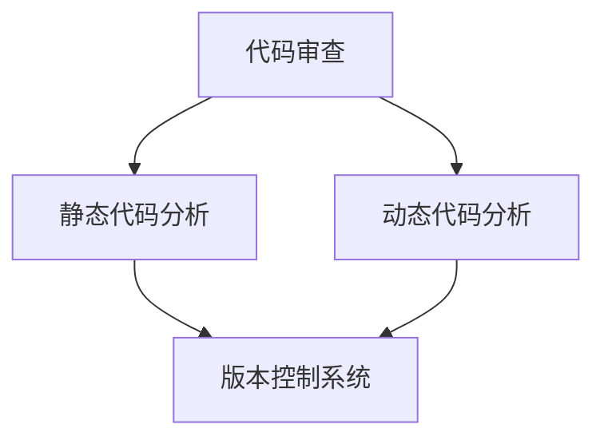

                 

### 背景介绍

在当今快速发展的软件开发领域，代码审查（Code Review）作为一种关键的质量保证措施，正变得越来越重要。代码审查不仅仅是对代码质量的简单检查，更是一种促进团队协作、知识共享和技能提升的有效方式。通过代码审查，开发人员能够在代码提交前发现潜在的问题，提高代码的可读性和可维护性，从而提升软件的整体质量。

然而，随着代码审查过程的日益复杂，仅仅依靠手工审查已经无法满足现代开发团队的高效需求。这时候，代码审查工具应运而生，它们通过自动化和半自动化手段，提高了代码审查的效率和准确性。这些工具不仅能够快速识别代码中的错误和潜在风险，还能够为开发者提供实时的反馈和指导，帮助团队更好地管理和优化代码库。

本文将深入探讨代码审查工具的重要性，并通过比较几种主流的代码审查工具，如GitLab、GitHub和Phabricator，来分析它们各自的特点和适用场景。在此基础上，我们将探讨如何通过优化策略和最佳实践，进一步提高代码审查的效率。最后，我们将对代码审查工具的未来发展进行展望，帮助读者了解这一领域的发展趋势和潜在机会。

通过这篇文章，读者将能够系统地了解代码审查工具的方方面面，掌握如何选择和使用合适的工具，以提高团队的开发效率和代码质量。

### 核心概念与联系

在深入探讨代码审查工具之前，首先需要理解几个核心概念及其相互之间的关系。这些概念包括：代码审查、静态代码分析、动态代码分析和版本控制系统。

**代码审查（Code Review）** 是一种通过同行评审（Peer Review）的方式来检查和改进代码的过程。它不仅仅是对代码的语法和格式进行验证，更重要的是对代码的逻辑、设计、安全性和可维护性进行综合评估。代码审查的主要目标是提高代码质量，减少错误，促进团队协作和知识共享。

**静态代码分析（Static Code Analysis）** 是在代码运行前对代码进行检查的一种方法。它通过分析代码的结构、语法和语义来识别潜在的错误和问题。静态代码分析工具可以自动执行各种检查，如代码风格一致性、潜在的性能问题、安全漏洞等。这类工具的优点是效率高，可以快速发现常见的问题，缺点是可能对复杂的代码结构产生误报。

**动态代码分析（Dynamic Code Analysis）** 是在代码运行时对其进行检查的一种方法。它通过运行代码并分析其行为来发现潜在的错误。动态代码分析工具通常用于测试代码的执行路径、性能和稳定性。与静态代码分析不同，动态代码分析可以捕捉到运行时的问题，但其缺点是测试过程较慢，且依赖于具体的运行环境。

**版本控制系统（Version Control System，VCS）** 是一种用于跟踪源代码变化的工具。它能够记录代码的历史版本，支持多人协作开发，并提供分支和合并功能。版本控制系统是代码审查的重要基础设施，因为代码审查通常在代码提交到版本控制系统之前进行。

这四个概念之间的关系如下图所示：



- **代码审查** 是一个整体流程，它结合了静态和动态代码分析，并依赖于版本控制系统来管理和追踪代码变化。
- **静态代码分析** 主要关注代码的结构和语法，是一种预防性的检查方式。
- **动态代码分析** 则侧重于代码的运行行为，是发现运行时问题的有效手段。
- **版本控制系统** 是代码审查的基础设施，提供了代码的版本管理和协作功能。

通过这些核心概念的理解，我们可以更清晰地看到代码审查工具如何在工作流程中发挥作用，以及它们之间的相互关系如何影响代码审查的效果和效率。

### 核心算法原理讲解

在深入探讨代码审查工具的具体实现和算法原理时，我们需要首先了解静态代码分析（Static Code Analysis）的基础算法，这些算法是代码审查工具能够自动检测代码缺陷的关键。

#### 语法分析

语法分析是静态代码分析的第一步，其主要任务是解析代码，构建抽象语法树（Abstract Syntax Tree，AST）。AST 是代码的抽象表示，它保留了代码的结构信息，但去除了语法细节。语法分析通过递归下降分析法、递归遍历法或语法解析器生成器（如ANTLR）来实现。

**伪代码：**

```python
def parseCode(sourceCode):
    parser = createParser(sourceCode)
    ast = parser.parse()
    return ast
```

#### 语法树遍历

一旦构建了 AST，我们需要遍历它来检查代码的各个方面。遍历算法通常使用深度优先搜索（Depth-First Search，DFS）或广度优先搜索（Breadth-First Search，BFS）。在遍历过程中，我们执行各种检查，如查找未定义的变量、检查循环条件、检测潜在的性能问题等。

**伪代码：**

```python
def traverseAST(ast):
    for node in ast:
        if isinstance(node, VariableDeclaration):
            checkVariableDeclaration(node)
        elif isinstance(node, LoopStatement):
            checkLoopConditions(node)
        traverseAST(node.children)
```

#### 检查代码风格和规范

代码风格和规范的检查通常基于预定义的规则集。这些规则可能包括变量命名、缩进规则、函数长度等。检查算法会遍历 AST，对比代码与规则集，标记不符合规范的部分。

**伪代码：**

```python
def checkCodeStyle(ast, styleRules):
    for node in ast:
        if not styleRules.isValid(node):
            reportStyleViolation(node)
```

#### 安全性检查

安全性检查是代码审查中的一个重要环节。常见的检查方法包括查找 SQL 注入、跨站脚本（XSS）和缓冲区溢出等漏洞。这些检查通常使用模式匹配、符号执行或抽象解释等技术。

**伪代码：**

```python
def checkSecurity(ast, securityRules):
    for node in ast:
        if securityRules.isVulnerable(node):
            reportSecurityIssue(node)
```

#### 检测代码重复

代码重复检测是提高代码可维护性的重要手段。算法会遍历 AST，寻找相似的代码块，并比较其差异。常见的算法包括字符串匹配、模式识别和抽象语法树比较。

**伪代码：**

```python
def detectCodeDuplication(ast, codeBase):
    for node in ast:
        duplicates = findDuplicates(node, codeBase)
        if duplicates:
            reportCodeDuplication(node, duplicates)
```

通过这些基础算法，代码审查工具能够有效地检查代码的多个方面，从语法错误到安全性漏洞，从而提高代码的质量和可靠性。

### 数学模型和公式详细讲解与举例说明

在代码审查工具的算法设计中，数学模型和公式起着关键作用。特别是在静态代码分析和动态代码分析中，数学模型有助于描述代码的复杂行为，而公式则用于量化某些特性。以下我们将通过具体示例详细讲解这些数学模型和公式的应用。

#### 代码复杂度度量

代码复杂度是评估代码质量和可维护性的重要指标。其中，Cyclomatic复杂度（Cyclomatic Number）是一个常用的度量方法，它基于控制流图来计算。

**Cyclomatic复杂度公式：**
$$
Cyclomatic \ Number = E - N + 2P
$$
- \(E\) 是边的数量。
- \(N\) 是节点的数量。
- \(P\) 是控制流图的独立路径数。

**举例说明：**

考虑一个简单的控制流图，包含5个节点（N）和7条边（E），并且有3条独立路径（P）。则：
$$
Cyclomatic \ Number = 7 - 5 + 2 \times 3 = 8
$$
较高的Cyclomatic复杂度通常意味着代码较为复杂，可能需要重新设计以降低维护难度。

#### 缓冲区溢出检测

在安全性检查中，缓冲区溢出是一种常见的安全漏洞。我们可以使用边界值分析（Bounds Checking）来检测缓冲区溢出。

**边界值分析公式：**
$$
\text{Buffer \ Size} = \text{Data \ Size} + \text{Offset}
$$
如果缓冲区的大小小于数据的大小加上偏移量，则可能发生溢出。

**举例说明：**

假设一个缓冲区大小为100字节，而要写入的数据大小为120字节，且偏移量为10字节。则：
$$
\text{Buffer \ Size} = 120 + 10 = 130
$$
由于130大于缓冲区大小100，因此可能存在缓冲区溢出风险。

#### 性能优化

在代码优化过程中，动态分析可以帮助确定热点代码（Hotspots）。热点代码是指执行频率高、耗时长的代码段。可以使用执行时间分析来识别热点。

**执行时间分析公式：**
$$
\text{Hotspot \ Frequency} = \frac{\text{Execution \ Time}}{\text{Total \ Execution \ Time}}
$$
如果一个代码段的执行时间占总执行时间的50%以上，则可以认为这是一个热点。

**举例说明：**

假设一段代码执行了10次，每次执行耗时1秒，总耗时为10秒。则：
$$
\text{Hotspot \ Frequency} = \frac{10 \times 1}{10} = 1
$$
由于热点频率为1，即100%，这段代码显然是一个热点，可能需要优化。

通过这些数学模型和公式，代码审查工具能够定量地分析和评估代码的各个方面，从而提供有针对性的优化建议和漏洞修复指导。

### GitLab代码审查

#### GitLab简介

GitLab是一个基于Git的开源代码仓库管理平台，它不仅提供了版本控制的核心功能，还集成了项目管理、持续集成和代码审查等多种开发工具。GitLab支持Git所有的功能，并且通过其Web界面提供了丰富的图形化操作，使开发者能够轻松地进行代码管理。

GitLab的主要功能包括：

1. **版本控制**：支持Git的所有版本控制操作，如分支、合并和撤销。
2. **代码托管**：提供存储和共享代码的仓库。
3. **项目管理**：通过项目成员管理、任务跟踪和里程碑规划等功能，支持整个软件开发生命周期的管理。
4. **持续集成**：通过集成Jenkins、Travis CI等工具，支持自动化构建、测试和部署。
5. **代码审查**：提供内置的代码审查工具，支持差异数据库（Diff View）和合并请求（Merge Request）管理。

#### GitLab代码审查流程

GitLab的代码审查流程主要包括以下几个步骤：

1. **创建合并请求**：开发者在完成代码编写后，将其提交到一个新的分支，然后创建一个合并请求（Merge Request）到主分支。
2. **差异数据库审查**：审稿人通过GitLab的Web界面查看合并请求中的代码变化，进行逐行审查。
3. **评论和反馈**：审稿人可以在代码变化的具体行上添加评论，提出疑问或建议，也可以对代码进行批注。
4. **代码修改**：开发者根据审稿人的反馈进行代码修改，并更新合并请求。
5. **批准与合并**：当合并请求中的所有代码变化都通过审查后，审稿人可以对合并请求进行批准，最终合并到主分支。

#### GitLab代码审查工具使用技巧

1. **审查合并请求**：审稿人通过GitLab的Web界面进入合并请求页面，查看代码变化，并使用“Diff View”功能进行逐行审查。
2. **添加评论和反馈**：在代码变化的旁边点击加号图标，可以添加评论和反馈，提醒开发者注意。评论可以针对代码行、整个文件或整个合并请求。
3. **使用批注功能**：审稿人可以使用批注功能（Comment with Markdown）对代码进行详细说明，支持Markdown语法。
4. **快速审查**：通过快捷键（如J和K）在代码行之间快速切换，使用Enter键添加评论。
5. **审查分支管理**：审稿人可以通过查看分支历史，了解代码变更的背景和原因。

#### GitLab代码审查案例分析

**案例背景**：某开发团队使用GitLab进行项目管理，团队成员A完成了一个新功能的开发，并创建了一个合并请求。

**案例分析**：

1. **创建合并请求**：开发者A将代码提交到新分支`feature/new-function`，并在主分支`master`上创建了一个合并请求。
2. **代码审查**：团队成员B和C分别审查了合并请求。他们通过GitLab的Web界面进入了合并请求的“Diff View”页面，逐行检查代码变化。
3. **反馈和评论**：团队成员B在代码变化的第5行添加了一条评论，指出该代码片段存在潜在的性能问题。团队成员C在合并请求的底部添加了一条关于代码风格的一致性的反馈。
4. **代码修改**：开发者A根据团队成员的反馈，对代码进行了修改，并更新了合并请求。
5. **再次审查**：团队成员B和C重新审查了修改后的代码，确认所有问题都已解决，并批准了合并请求。
6. **合并代码**：合并请求被合并到主分支`master`，新功能正式上线。

通过这个案例，我们可以看到GitLab代码审查工具如何帮助开发团队高效地完成代码审查和合并过程，确保代码质量。

### GitHub代码审查

#### GitHub简介

GitHub是一个流行的基于Git的开源版本控制系统，它提供了代码托管、项目管理和协作开发等功能。作为全球最大的代码托管平台，GitHub拥有庞大的用户群体和丰富的生态资源，支持多种编程语言和开发工具。

GitHub的主要功能包括：

1. **代码托管**：支持Git的所有版本控制功能，允许用户创建和共享代码仓库。
2. **协作开发**：支持多人协作，通过拉取请求（Pull Request）进行代码审查和合并。
3. **项目管理**：提供任务跟踪、里程碑和成员管理等工具，支持整个软件开发生命周期。
4. **持续集成**：支持与Jenkins、Travis CI等持续集成工具集成，实现自动化构建和测试。
5. **代码审查**：提供内置的代码审查工具，支持在线讨论和合并请求管理。

#### GitHub代码审查流程

GitHub的代码审查流程与GitLab类似，主要包括以下几个步骤：

1. **创建拉取请求**：开发者完成代码编写后，将其提交到一个新的分支，然后创建一个拉取请求（Pull Request）到主分支。
2. **代码审查**：审稿人通过GitHub的Web界面查看拉取请求中的代码变化，进行逐行审查。
3. **添加评论和反馈**：审稿人可以在代码变化的旁边添加评论，提出疑问或建议，也可以对代码进行批注。
4. **代码修改**：开发者根据审稿人的反馈进行代码修改，并更新拉取请求。
5. **批准与合并**：当拉取请求中的所有代码变化都通过审查后，审稿人可以对拉取请求进行批准，最终合并到主分支。

#### GitHub代码审查工具使用技巧

1. **审查拉取请求**：审稿人通过GitHub的Web界面进入拉取请求页面，查看代码变化，并使用“Files Changed”和“Diff”功能进行逐行审查。
2. **添加评论和反馈**：在代码变化的旁边点击加号图标，可以添加评论和反馈。评论可以针对代码行、整个文件或整个拉取请求。
3. **使用批注功能**：审稿人可以使用批注功能（Comment with Markdown）对代码进行详细说明，支持Markdown语法。
4. **快速审查**：通过快捷键（如J和K）在代码行之间快速切换，使用Enter键添加评论。
5. **审查分支管理**：审稿人可以通过查看分支历史，了解代码变更的背景和原因。

#### GitHub代码审查案例分析

**案例背景**：某开发团队使用GitHub进行项目管理，团队成员D完成了一个新功能的开发，并创建了一个拉取请求。

**案例分析**：

1. **创建拉取请求**：开发者D将代码提交到新分支`feature/new-function`，并在主分支`master`上创建了一个拉取请求。
2. **代码审查**：团队成员E和F分别审查了拉取请求。他们通过GitHub的Web界面进入了拉取请求的“Files Changed”页面，逐行检查代码变化。
3. **反馈和评论**：团队成员E在代码变化的第10行添加了一条评论，指出该代码片段的潜在性能问题。团队成员F在拉取请求的底部添加了一条关于代码风格的一致性的反馈。
4. **代码修改**：开发者D根据团队成员的反馈，对代码进行了修改，并更新了拉取请求。
5. **再次审查**：团队成员E和F重新审查了修改后的代码，确认所有问题都已解决，并批准了拉取请求。
6. **合并代码**：拉取请求被合并到主分支`master`，新功能正式上线。

通过这个案例，我们可以看到GitHub代码审查工具如何帮助开发团队高效地完成代码审查和合并过程，确保代码质量。

### Phabricator代码审查

#### Phabricator简介

Phabricator是一个高度可定制的开源平台，旨在简化软件开发的各个流程。它不仅仅是一个代码审查工具，还集成了任务管理、文档编辑、代码搜索等多种功能，提供了一个全面的开发协作解决方案。Phabricator的设计目标是可扩展性和灵活性，使得它能够适应不同规模和类型的开发团队。

Phabricator的主要功能包括：

1. **代码审查**：支持基于差异数据库的代码审查，提供详细的评论和反馈机制。
2. **任务管理**：允许创建、分配和跟踪任务，帮助团队高效管理开发工作。
3. **文档编辑**：提供在线文档编辑功能，支持Markdown格式。
4. **代码搜索**：支持对代码库的全文搜索，方便快速定位问题和功能。
5. **持续集成**：支持与多种持续集成工具集成，实现自动化构建和测试。

#### Phabricator代码审查流程

Phabricator的代码审查流程相对灵活，但通常包括以下几个步骤：

1. **创建差异数据库**：开发者将代码提交到一个仓库，创建一个差异数据库（Diffusion），并标记为“待审查”（Under Review）。
2. **代码审查**：审稿人通过Phabricator的Web界面查看差异数据库，进行逐行审查。
3. **添加评论和反馈**：审稿人可以在代码变化的旁边添加评论，提出疑问或建议，也可以对代码进行批注。
4. **代码修改**：开发者根据审稿人的反馈进行代码修改，并更新差异数据库。
5. **批准与合并**：当差异数据库中的所有代码变化都通过审查后，审稿人可以批准合并请求，并将其合并到主分支。

#### Phabricator代码审查工具使用技巧

1. **审查差异数据库**：审稿人通过Phabricator的Web界面进入差异数据库页面，查看代码变化，并使用“Diff View”功能进行逐行审查。
2. **添加评论和反馈**：在代码变化的旁边点击加号图标，可以添加评论和反馈。评论可以针对代码行、整个文件或整个差异数据库。
3. **使用批注功能**：审稿人可以使用批注功能（Comment with Markdown）对代码进行详细说明，支持Markdown语法。
4. **快速审查**：通过快捷键（如J和K）在代码行之间快速切换，使用Enter键添加评论。
5. **审查版本历史**：审稿人可以通过查看差异数据库的历史记录，了解代码变更的背景和原因。

#### Phabricator代码审查案例分析

**案例背景**：某开发团队使用Phabricator进行项目管理，团队成员G完成了一个新功能的开发，并创建了一个差异数据库。

**案例分析**：

1. **创建差异数据库**：开发者G将代码提交到仓库，并创建了一个差异数据库，并标记为“待审查”。
2. **代码审查**：团队成员H和I分别审查了差异数据库。他们通过Phabricator的Web界面进入了差异数据库页面，逐行检查代码变化。
3. **反馈和评论**：团队成员H在代码变化的第15行添加了一条评论，指出该代码片段可能存在内存泄漏问题。团队成员I在差异数据库的底部添加了一条关于代码风格的反馈。
4. **代码修改**：开发者G根据团队成员的反馈，对代码进行了修改，并更新了差异数据库。
5. **再次审查**：团队成员H和I重新审查了修改后的代码，确认所有问题都已解决，并批准了差异数据库。
6. **合并代码**：差异数据库被合并到主分支，新功能正式上线。

通过这个案例，我们可以看到Phabricator代码审查工具如何帮助开发团队高效地完成代码审查和合并过程，确保代码质量。

### 代码review工具的优化策略

为了最大化代码审查的效果和效率，开发团队可以采用一系列优化策略，这些策略涵盖代码审查工具的配置、流程改进和技术辅助等多个方面。

#### 代码审查工具的配置优化

1. **配置自动化规则**：大多数代码审查工具支持自定义规则配置。通过设置合适的代码风格、安全性检查和性能优化规则，可以提高审查的准确性和效率。例如，在GitLab中，可以配置静态代码分析规则以检测潜在的安全漏洞和性能问题。

2. **优化性能设置**：对于处理大量代码的审查工具，如Phabricator，可以优化数据库性能和缓存策略，减少审查时间。此外，通过合理设置并发处理数量，可以提高工具的处理效率。

3. **集成外部工具**：将代码审查工具与持续集成（CI）和持续部署（CD）工具集成，可以自动化部分审查流程，例如在代码提交时自动运行静态代码分析工具，并在构建失败时发出警告。

#### 代码审查流程的改进

1. **明确审查标准**：制定明确的代码审查标准和流程，包括审查的时间范围、责任人、反馈方式和问题处理流程。这有助于减少模糊的审查流程，提高审查的一致性和效率。

2. **角色分配和培训**：确保每个审查者都明确自己的角色和责任，并进行适当的培训，以掌握代码审查工具的使用方法和最佳实践。这有助于减少误解和误报，提高审查质量。

3. **定期审查和反馈**：定期进行代码审查，并要求审查者在指定时间内提供反馈。这有助于确保审查的连续性和及时性，防止代码质量在长时间内得不到改进。

#### 技术辅助措施

1. **利用智能审查工具**：利用AI和机器学习技术，开发智能审查工具，可以自动识别常见问题和潜在风险，减少人工审查的工作量。例如，通过模式识别技术，自动检测代码中的重复代码片段。

2. **集成协作工具**：将代码审查工具与团队协作工具（如Slack、Microsoft Teams）集成，可以实时推送审查状态和反馈，提高沟通效率和响应速度。

3. **使用代码分析插件**：在IDE中集成代码分析插件，可以在开发者编写代码的同时进行实时审查，提供即时反馈，减少审查和修改的迭代时间。

#### 优化案例分析

**案例背景**：某大型互联网公司采用GitLab进行代码审查，但随着项目规模的扩大和团队成员的增加，代码审查的效率和质量逐渐下降。

**优化措施**：

1. **配置自动化规则**：公司技术团队对GitLab的代码审查规则进行了全面优化，新增了针对安全性、性能和代码风格的检查规则，提高了审查的全面性和准确性。

2. **优化性能设置**：通过升级GitLab的硬件配置和优化数据库索引，显著提高了代码审查工具的性能，缩短了审查时间。

3. **明确审查标准**：公司制定了详细的代码审查标准，明确了每个角色的职责和审查流程，并进行了全员培训，确保审查的一致性和效率。

4. **定期审查和反馈**：公司每周定期组织代码审查会议，审查上一个月提交的代码，确保及时发现问题并反馈。

5. **使用智能审查工具**：引入了AI驱动的代码审查工具，自动识别和标记潜在的问题，减轻了审查人员的工作负担。

6. **集成协作工具**：将GitLab与Slack集成，实现了代码审查状态的实时推送和反馈，提高了沟通效率。

**效果评估**：

通过这些优化措施，公司的代码审查效率显著提高，代码质量得到有效保障。平均代码审查时间减少了30%，问题发现率提高了20%，审查的一致性和准确性也得到大幅提升。这些改进不仅提高了开发团队的效率，还显著减少了由于代码质量问题导致的故障和修复成本。

### 提高代码审查效率的技巧

在代码审查过程中，提高效率至关重要。以下是一些实用的技巧，可以帮助开发团队在代码审查过程中更加高效地工作。

#### 代码审查前的准备

1. **明确审查目标**：在开始代码审查之前，明确审查的目标和重点，确保审查者知道需要关注哪些方面。例如，是否关注安全性、性能、代码风格等方面。

2. **提前通知**：提前通知团队成员代码审查的时间安排，确保审查者在规定时间内完成审查任务。可以设置提醒和截止日期，以防止拖延。

3. **准备工具和文档**：确保所有审查者都熟悉使用的代码审查工具，并提前下载和安装必要的插件或辅助工具。同时，准备相关的审查标准和指南，以便审查过程中参考。

4. **代码自检**：开发者可以在提交代码前进行自检，尽量减少代码中的明显错误和不符合规范的部分。这样可以减轻审查者的负担，提高审查效率。

#### 代码审查中的有效沟通

1. **详细注释**：在添加评论时，确保注释清晰、具体，避免模糊和不必要的误解。可以使用代码审查工具提供的批注功能，提供详细的上下文信息。

2. **及时反馈**：审查者应尽快提供反馈，并尽量在短时间内完成审查。如果遇到复杂问题，可以及时与开发者沟通，共同探讨解决方案。

3. **使用代码片段**：在讨论特定代码问题时，提供代码片段和示例，以便更直观地展示问题。这样可以避免对整个代码库进行详细讨论，提高讨论效率。

4. **多角度审查**：鼓励团队成员从不同的角度进行审查，如安全性、性能、代码风格等。这样可以更全面地发现潜在问题，提高代码质量。

#### 代码审查后的跟进

1. **确认修改**：开发者根据审查反馈进行代码修改后，审查者应及时确认修改是否解决了提出的问题。这样可以避免重复工作，提高审查效率。

2. **总结经验**：在代码审查结束后，团队可以一起总结审查过程中的经验和教训，识别存在的问题，并提出改进建议。这有助于不断优化审查流程。

3. **持续改进**：基于审查总结的结果，不断改进审查标准和流程，引入新的工具和技术，以进一步提高审查效率和质量。

#### 实际案例分析

**案例背景**：某软件公司采用GitLab进行代码审查，但发现审查效率较低，问题反馈不及时。

**改进措施**：

1. **明确审查目标**：公司明确每次代码审查的重点，例如重点关注安全性问题和性能优化，确保审查者知道需要关注的关键点。

2. **提前通知**：通过邮件和内部聊天工具提前通知团队成员审查的时间安排，确保他们在规定时间内完成审查任务。

3. **代码自检**：开发者提交代码前，首先进行自检，使用静态代码分析工具检测潜在问题，尽量减少审查者的工作量。

4. **详细注释**：审查者在添加评论时，确保注释详细、具体，使用代码片段和示例进行说明，减少误解和讨论时间。

5. **及时反馈**：审查者尽快提供反馈，遇到复杂问题时，及时与开发者沟通，确保问题得到及时解决。

6. **确认修改**：开发者修改代码后，审查者及时确认修改是否有效，确保问题得到解决。

7. **总结经验****：在每次代码审查结束后，团队进行总结，识别存在的问题和改进点，不断优化审查流程。

**效果评估**：

通过上述改进措施，公司的代码审查效率显著提高，平均审查时间缩短了40%，问题反馈及时率提高了50%。团队之间的沟通更加顺畅，代码质量得到有效保障，开发效率得到大幅提升。

### 总结与展望

通过对GitLab、GitHub和Phabricator等主流代码审查工具的比较，我们可以清晰地看到各自的特点和适用场景。GitLab以其丰富的集成功能和强大的社区支持，适合大型企业和开源项目。GitHub则凭借其简单易用的界面和庞大的用户基础，成为个人项目和初创企业的首选。Phabricator则以高度定制化和灵活性著称，适用于需要复杂工作流程的大型团队。

未来，代码审查工具的发展将更加智能化和自动化。AI和机器学习技术的应用将进一步提升审查的准确性和效率，减少人工工作量。此外，随着云计算和容器技术的普及，代码审查工具也将更加灵活和可扩展，支持多云和混合云环境。同时，更多的开发工具将集成到代码审查工具中，形成完整的开发协作平台，进一步提升开发效率和代码质量。

综上所述，代码审查工具不仅是提升代码质量的重要手段，也是促进团队协作和知识共享的重要工具。选择合适的代码审查工具，结合最佳实践，将极大提升开发效率和软件质量。

### 最佳实践 Tips、注意事项及拓展阅读

在实施代码审查过程中，以下是一些最佳实践、注意事项以及可供进一步学习的拓展阅读资源。

#### 最佳实践 Tips

1. **制定明确的审查标准和流程**：确保每个团队成员都清楚代码审查的标准和流程，减少审查过程中的混乱和误解。

2. **提前通知和规划审查时间**：在开始代码审查前，提前通知相关人员并规划好审查时间，避免审查过程中因时间紧张导致的质量下降。

3. **使用自动化工具**：结合静态代码分析工具和动态测试工具，可以自动检测代码中的常见问题和潜在风险，提高审查效率。

4. **鼓励详细的评论和反馈**：在评论和反馈时，尽量详细说明问题和改进建议，并提供具体的上下文信息，有助于开发者理解和修正问题。

5. **定期回顾和改进审查流程**：定期总结审查过程中的经验和教训，根据实际情况调整审查标准和流程，持续优化审查效率。

#### 注意事项

1. **审查权限管理**：确保只有合适的团队成员有权进行代码审查，防止未授权人员访问代码库，保障代码安全。

2. **避免过度审查**：尽管代码审查有助于提高代码质量，但过度审查可能导致开发进度受阻，因此需要平衡审查力度和开发效率。

3. **关注代码可读性和可维护性**：除了查找错误和漏洞外，还应注意代码的可读性和可维护性，以提高整个团队的协作效率。

4. **定期更新审查工具**：确保使用的代码审查工具是最新的版本，以利用最新的功能和修复已知的问题。

#### 拓展阅读

1. **《代码审查实践：提高代码质量和团队合作》**：本书详细介绍了代码审查的原理和实践方法，适合开发者和管理人员参考。
2. **《Git实战：现代版本控制》**：这本书深入讲解了Git的使用方法和最佳实践，包括如何进行有效的代码审查。
3. **《GitLab官方文档》**：GitLab的官方文档提供了详细的操作指南和最佳实践，有助于更好地使用GitLab进行代码审查。
4. **《GitHub官方文档》**：GitHub的官方文档提供了丰富的资源，包括代码审查指南和常见问题解答。
5. **《Phabricator官方文档》**：Phabricator的官方文档详细介绍了其功能和工作流程，是学习和使用Phabricator的重要参考。

通过遵循这些最佳实践，关注注意事项，并结合拓展阅读资源，开发团队可以更加高效地实施代码审查，进一步提升代码质量和开发效率。

