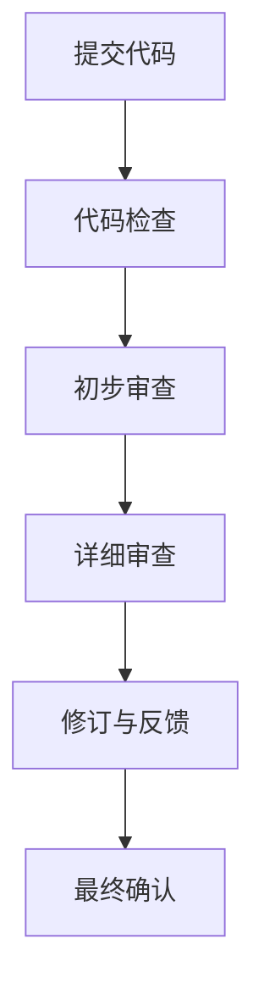

                 

### 分析文章标题：《代码review效率提升：工具和流程优化》

**文章标题分析：**

1. **主要内容**：
   - “代码review”是文章的核心主题，关注代码质量的审查过程。
   - “效率提升”表明文章的目标是提高代码review的效率。
   - “工具和流程优化”指出了文章将从工具选择和流程改进两个方面来探讨提升代码review效率的方法。

2. **潜在读者**：
   - 读者可能包括软件开发工程师、项目经理、技术领导等，他们对代码质量和开发效率有较高的关注。

3. **关键词提取**：
   - “代码review”、“效率提升”、“工具”、“流程优化”、“软件开发”。

4. **逻辑结构**：
   - 文章将分为几个主要部分：
     - 理论基础：介绍代码review的概念和重要性。
     - 工具介绍：讨论不同的代码review工具及其特点。
     - 流程优化：分析现有代码review流程的不足，并提出优化建议。
     - 实际案例：通过实际项目案例展示工具和流程优化的效果。

### 撰写文章大纲

**一、引言**
- 介绍代码review的背景和意义。
- 阐述提升代码review效率的重要性。

**二、代码review概述**
1. 代码review的定义
2. 代码review与传统代码审查的区别
3. 代码review的基本流程

**三、核心概念与联系**
1. 代码质量与效率的关系
2. 代码review流程中的关键概念
   - Mermaid 流程图

**四、代码review工具**
1. 常见的代码review工具
2. 工具的选择标准
3. 工具的功能对比
4. 使用Git进行代码review
5. 使用代码分析工具进行代码review

**五、代码review流程设计**
1. 代码review流程的基本步骤
2. 代码review流程中的关键点
3. 代码review流程的优化策略

**六、代码review中的沟通与协作**
1. 沟通在代码review中的重要性
2. 有效的沟通方法
3. 协作工具在代码review中的应用

**七、代码review中的质量控制**
1. 质量控制的定义
2. 质量控制的关键指标
3. 质量控制的方法与工具

**八、效率优化策略**
1. 效率优化的原则与方法
2. 避免常见效率陷阱
3. 利用自动化工具提升效率

**九、项目实战案例分析**
1. 项目实战案例一：小型项目代码review实践
2. 项目实战案例二：大型项目代码review实践
3. 项目实战案例三：跨团队代码review实践

**十、总结与展望**
- 总结文章的核心观点。
- 展望代码review效率提升的未来趋势。

**十一、附录**
- 最佳实践 tips
- 注意事项
- 拓展阅读

**十二、作者信息**
- “作者：AI天才研究院/AI Genius Institute & 禅与计算机程序设计艺术 /Zen And The Art of Computer Programming”

通过上述分析，我们已经明确了文章的主要结构和内容。接下来，我们将逐个部分进行深入阐述，确保每个部分都有详细的讲解和实例分析，以达到文章目标，即提升代码review效率。接下来，我们将开始撰写每个部分的具体内容。

### 撰写文章具体内容

**引言**

代码review是软件开发过程中至关重要的一环，它不仅能够帮助团队识别和修复潜在的错误，提高代码的质量，还能促进团队成员之间的沟通与协作。然而，在实际开发过程中，代码review的效率往往受到多种因素的影响，如工具选择不当、流程设计不合理等。本文旨在探讨如何通过工具和流程的优化来提升代码review的效率。

首先，我们需要明确代码review的目的。代码review不仅仅是对代码进行审查，更是一个综合性的活动，涉及代码质量、团队协作、项目管理等多个方面。有效的代码review能够提高代码的可靠性、可维护性和可扩展性，从而降低项目的整体风险。

**代码review概述**

**1. 代码review的定义**

代码review，又称代码审核或代码审查，是指通过对代码进行阅读、讨论和评估，以发现潜在的问题和改进点。它通常由团队成员或专门的质量保证人员执行。

**2. 代码review与传统代码审查的区别**

传统代码审查通常是指单一维度的检查，如语法错误、代码格式等。而代码review则更加全面，包括代码逻辑、性能、安全性等多个方面。此外，代码review强调团队合作，而传统代码审查更多是个人行为。

**3. 代码review的基本流程**

代码review的基本流程通常包括以下几个步骤：

1. 提交代码：开发者将代码提交到代码库。
2. 代码检查：自动化工具对代码进行检查，如语法错误、代码格式等。
3. 初步审查：团队成员对代码进行初步的阅读和评估。
4. 详细审查：对代码进行深入的讨论和评估。
5. 修订与反馈：开发者根据审查结果对代码进行修订，并再次提交。
6. 最终确认：审查者对修订后的代码进行最终确认。

**核心概念与联系**

**1. 代码质量与效率的关系**

代码质量是代码review的核心目标之一。高质量代码通常具有以下特点：

- 可读性强：代码结构清晰，命名规范，便于理解和维护。
- 可靠性高：代码逻辑正确，能够稳定运行，减少错误和异常。
- 可维护性强：代码易于修改和扩展，降低维护成本。

代码质量与效率密切相关。高质量代码能够减少后期维护的工作量，提高开发效率。反之，低质量代码会导致频繁的bug修复和维护，降低整体开发效率。

**2. 代码review流程中的关键概念**

在代码review流程中，以下几个关键概念至关重要：

- **代码检查工具**：如PMD、Checkstyle等，用于自动化检查代码质量。
- **静态代码分析**：通过分析代码结构，发现潜在的编程错误和不良代码习惯。
- **代码走查**：团队成员一起阅读代码，讨论潜在的改进点。
- **代码评审会议**：审查者对代码进行详细讨论，提出反馈和建议。

以下是一个Mermaid流程图，展示了代码review的基本流程：

**代码review工具**

**1. 常见的代码review工具**

在软件开发过程中，常用的代码review工具有：

- **Git**：版本控制工具，支持代码的提交、分支管理、合并请求等功能。
- **GitHub**：基于Git的平台，提供代码仓库管理、代码审查、issue跟踪等功能。
- **GitLab**：类似于GitHub的代码平台，提供类似的代码审查和项目管理功能。
- **SonarQube**：代码质量分析工具，支持静态代码分析、代码质量报告等。
- **Phabricator**：代码审查和项目管理工具，支持代码的提交、审查、讨论等功能。

**2. 工具的选择标准**

选择代码review工具时，需要考虑以下几个因素：

- **易用性**：工具是否易于学习和使用。
- **功能完善性**：工具是否支持代码检查、审查、讨论等功能。
- **集成性**：工具是否能够与其他开发工具（如IDE、持续集成平台）集成。
- **安全性**：工具是否能够保护代码的安全，防止泄露。
- **社区支持**：工具是否有活跃的社区，提供技术支持和资源。

**3. 工具的功能对比**

以下是几种常见代码review工具的功能对比：

| 工具         | 功能概述                                                     |
| ------------ | ------------------------------------------------------------ |
| Git          | 版本控制，支持分支管理、合并请求等                           |
| GitHub       | 代码仓库管理，代码审查，issue跟踪，社区支持                 |
| GitLab       | 代码仓库管理，代码审查，持续集成，CI/CD                     |
| SonarQube    | 静态代码分析，代码质量报告，安全漏洞检测                   |
| Phabricator  | 代码审查，项目管理，bug跟踪，持续集成，集成API             |

**4. 使用Git进行代码review**

Git是一个强大的版本控制工具，支持高效的代码管理。以下是使用Git进行代码review的步骤：

1. **创建分支**：开发者创建一个新的分支进行开发。
2. **提交代码**：开发者将代码提交到分支。
3. **发起合并请求**：开发者发起合并请求，其他团队成员对合并请求进行审查。
4. **审查代码**：审查者对代码进行审查，提出反馈。
5. **修订代码**：开发者根据反馈对代码进行修订。
6. **合并代码**：审查者确认修订后的代码，将其合并到主分支。

**5. 使用代码分析工具进行代码review**

代码分析工具能够自动化检查代码质量，发现潜在的问题。以下是使用代码分析工具进行代码review的步骤：

1. **安装代码分析工具**：如SonarQube。
2. **配置代码分析规则**：根据项目需求配置代码分析规则。
3. **运行代码分析**：运行代码分析工具，生成代码质量报告。
4. **审查代码质量报告**：审查者根据代码质量报告对代码进行审查。
5. **反馈与修订**：审查者对发现的问题提出反馈，开发者进行修订。

**代码review流程设计**

**1. 代码review流程的基本步骤**

一个完整的代码review流程通常包括以下步骤：

1. **代码检查**：使用自动化工具检查代码的语法、格式等问题。
2. **初步审查**：团队成员对代码进行初步阅读，发现明显的错误和问题。
3. **详细审查**：审查者对代码进行深入分析，提出详细的改进建议。
4. **修订与反馈**：开发者根据审查结果对代码进行修订，并再次提交。
5. **最终确认**：审查者对修订后的代码进行最终确认。

**2. 代码review流程中的关键点**

在代码review流程中，以下几个关键点至关重要：

1. **审查标准**：制定明确的审查标准，确保审查的一致性和准确性。
2. **审查者选择**：选择合适的审查者，确保审查的专业性和全面性。
3. **反馈与沟通**：及时有效的反馈和沟通是代码review成功的关键。
4. **修订与迭代**：开发者根据审查结果进行修订，并反复迭代，直到代码达到预期质量。

**3. 代码review流程的优化策略**

为了提高代码review的效率，可以采取以下优化策略：

1. **自动化检查**：使用自动化工具进行初步代码检查，减少人工工作量。
2. **分工协作**：明确团队成员的角色和责任，提高审查效率。
3. **定期审查**：制定定期审查计划，确保代码质量。
4. **持续改进**：不断优化代码review流程，提高团队整体效率。

**代码review中的沟通与协作**

**1. 沟通在代码review中的重要性**

沟通是代码review成功的关键因素之一。有效的沟通能够确保审查者理解开发者的意图，发现问题并提出有针对性的建议。同时，沟通也能促进团队成员之间的协作，提高代码质量。

**2. 有效的沟通方法**

以下是一些有效的沟通方法：

1. **书面沟通**：通过文档、邮件等方式进行书面沟通，确保信息的准确性和可追溯性。
2. **口头沟通**：通过电话、视频会议等方式进行口头沟通，确保沟通的及时性和互动性。
3. **代码注释**：在代码中添加注释，解释代码的功能和意图，提高代码的可读性。
4. **代码评审会议**：定期召开代码评审会议，讨论代码的审查结果和改进点。

**3. 协作工具在代码review中的应用**

现代代码review工具通常支持多种协作功能，如：

1. **评论与讨论**：审查者可以在代码中添加评论，开发者可以进行回复和讨论。
2. **任务分配**：可以分配审查任务给团队成员，确保每个任务都有责任人。
3. **通知与提醒**：自动通知审查者和开发者有关代码审查的进展和结果。
4. **集成办公平台**：与办公平台（如Slack、Microsoft Teams等）集成，实现一站式协作。

**代码review中的质量控制**

**1. 质量控制的定义**

质量控制是指通过一系列活动和措施，确保产品或服务的质量满足预期要求。在代码review中，质量控制旨在确保代码的质量满足既定的标准。

**2. 质量控制的关键指标**

以下是一些常用的质量控制关键指标：

1. **缺陷率**：代码中的缺陷数与代码行数的比值，用于衡量代码的质量水平。
2. **测试覆盖率**：测试用例覆盖代码的比例，用于评估测试的全面性。
3. **代码复杂度**：衡量代码结构的复杂程度，用于评估代码的可维护性。
4. **代码重复率**：代码中重复的部分所占的比例，用于评估代码的优化程度。

**3. 质量控制的方法与工具**

以下是一些常用的质量控制方法和工具：

1. **静态代码分析**：使用工具（如PMD、Checkstyle）对代码进行静态分析，发现潜在的问题。
2. **动态测试**：运行测试用例，验证代码的功能和性能。
3. **代码走查**：团队成员一起阅读代码，讨论潜在的问题和改进点。
4. **代码评审**：审查者对代码进行详细审查，提出改进建议。

**效率优化策略**

**1. 效率优化的原则与方法**

为了提高代码review的效率，可以遵循以下原则：

1. **自动化**：使用自动化工具进行代码检查和静态分析，减少人工工作量。
2. **标准化**：制定统一的代码规范和审查标准，提高审查的一致性和准确性。
3. **简化流程**：优化代码review流程，减少不必要的步骤和环节。
4. **分工协作**：明确团队成员的角色和责任，提高审查效率。

以下是一些具体的优化方法：

1. **定期审查**：制定定期审查计划，确保代码质量。
2. **分工协作**：明确团队成员的角色和责任，提高审查效率。
3. **简化反馈**：简化反馈过程，确保反馈及时、准确。
4. **自动化测试**：引入自动化测试，提高测试覆盖率。

**2. 避免常见效率陷阱**

以下是一些常见的效率陷阱：

1. **过度审查**：对每个代码提交都进行详细审查，导致审查者疲劳和效率低下。
2. **反馈不及时**：审查者未能在规定时间内给出反馈，导致开发者等待时间过长。
3. **代码重复**：重复编写相同或类似的代码，增加代码复杂度和维护成本。

以下是一些避免效率陷阱的建议：

1. **明确审查标准**：制定明确的审查标准，确保审查的一致性和准确性。
2. **优化审查流程**：简化审查流程，减少不必要的步骤和环节。
3. **定期审查**：制定定期审查计划，确保代码质量。
4. **提高沟通效率**：确保审查者与开发者之间的沟通及时、准确。

**3. 利用自动化工具提升效率**

自动化工具在代码review中发挥着重要作用，以下是一些常用的自动化工具：

1. **Git**：用于代码的版本控制和分支管理。
2. **GitHub**：提供代码仓库管理、代码审查、issue跟踪等功能。
3. **GitLab**：提供代码仓库管理、代码审查、持续集成等功能。
4. **SonarQube**：用于静态代码分析，发现潜在的问题和优化建议。
5. **PMD**：用于代码格式检查，确保代码风格一致性。

以下是一个使用Git和SonarQube进行代码review的示例流程：

1. **创建分支**：开发者创建一个新的分支进行开发。
2. **提交代码**：开发者将代码提交到分支。
3. **运行SonarQube分析**：使用SonarQube对代码进行静态分析，生成代码质量报告。
4. **发起合并请求**：开发者发起合并请求，其他团队成员对合并请求进行审查。
5. **审查代码**：审查者查看SonarQube报告，对代码进行审查。
6. **反馈与修订**：审查者对发现的问题提出反馈，开发者进行修订。
7. **合并代码**：审查者确认修订后的代码，将其合并到主分支。

**项目实战案例分析**

**1. 项目实战案例一：小型项目代码review实践**

**项目背景**：

某小型项目团队（3人）使用Git和GitHub进行代码管理，团队成员分别是项目经理、前端开发工程师和后端开发工程师。项目涉及简单的Web应用开发。

**代码review过程**：

1. **代码检查**：使用Git进行代码提交和分支管理，使用GitHub的代码审查功能。
2. **初步审查**：团队成员对提交的代码进行初步阅读，发现问题并提出反馈。
3. **详细审查**：详细审查者对代码进行深入分析，提出改进建议。
4. **修订与反馈**：开发者根据审查结果进行修订，并再次提交。
5. **最终确认**：审查者对修订后的代码进行最终确认。

**实践效果分析**：

通过使用Git和GitHub进行代码管理，项目团队提高了代码的可读性和可维护性。代码审查过程促进了团队成员之间的沟通和协作，及时发现和修复了潜在的问题，提高了代码质量。

**2. 项目实战案例二：大型项目代码review实践**

**项目背景**：

某大型项目团队（10人）使用GitLab进行代码管理，团队成员包括项目经理、前端开发工程师、后端开发工程师、测试工程师和运维工程师。项目涉及复杂的分布式系统开发。

**代码review过程**：

1. **代码检查**：使用GitLab进行代码提交和分支管理，使用GitLab的代码审查功能。
2. **初步审查**：测试工程师对提交的代码进行初步测试，发现问题并提出反馈。
3. **详细审查**：详细审查者对代码进行深入分析，提出改进建议。
4. **修订与反馈**：开发者根据审查结果进行修订，并再次提交。
5. **最终确认**：审查者对修订后的代码进行最终确认。

**实践效果分析**：

通过使用GitLab进行代码管理，项目团队实现了高效的代码审查流程。测试工程师在代码提交后的初步审查阶段就发现并解决了许多潜在的问题，降低了后期测试和部署的风险。详细审查者对代码进行了深入的分析和优化，提高了代码的质量和性能。

**3. 项目实战案例三：跨团队代码review实践**

**项目背景**：

某跨团队合作项目（3个团队，共9人）使用GitLab进行代码管理，团队成员包括前端团队、后端团队和测试团队。项目涉及多个模块的协作开发。

**代码review过程**：

1. **代码检查**：使用GitLab进行代码提交和分支管理，使用GitLab的代码审查功能。
2. **跨团队审查**：不同团队的成员对提交的代码进行审查，关注各自的模块和接口。
3. **修订与反馈**：开发者根据审查结果进行修订，并再次提交。
4. **最终确认**：审查者对修订后的代码进行最终确认。

**实践效果分析**：

通过跨团队的代码审查，项目团队实现了更全面的代码质量保障。不同团队的成员从各自的专业角度对代码进行了审查，发现并解决了许多潜在的问题，提高了代码的整体质量。跨团队审查促进了团队成员之间的沟通和协作，加强了团队间的联系和配合。

**总结与展望**

通过本文的探讨，我们可以看到，代码review在软件开发过程中具有重要意义。通过工具和流程的优化，可以有效提升代码review的效率，提高代码质量，降低项目风险。未来的发展趋势包括：

1. **自动化和智能化**：随着人工智能技术的发展，代码审查工具将更加智能化，能够自动识别和修复潜在的问题。
2. **协作和沟通**：代码审查将更加注重团队协作和沟通，通过多种工具和平台实现一站式协作。
3. **持续集成和持续交付**：代码审查将更深入地集成到持续集成和持续交付流程中，实现自动化和高效的代码审查。

通过不断优化代码review流程，软件开发团队可以更加高效地推进项目，实现高质量的产品交付。

**附录**

**最佳实践 tips：**
1. 制定明确的代码规范和审查标准。
2. 定期进行代码审查，确保代码质量。
3. 鼓励团队成员积极参与代码审查，提高整体代码质量。
4. 使用自动化工具进行代码检查和静态分析，减少人工工作量。

**注意事项：**
1. 避免过度审查，确保审查者有足够的时间和精力。
2. 保持代码的可读性和可维护性，遵循代码规范。
3. 优化代码审查流程，减少不必要的步骤和环节。

**拓展阅读：**
1. 《代码大全》（Steve McConnell）：详细介绍了代码审查的相关内容。
2. 《敏捷软件开发：原则、实践与模式》（Robert C. Martin）：探讨了敏捷开发中的代码审查实践。
3. 《Git实战》（Jon乞求Sugars）：详细介绍了Git的使用方法和技巧。

**作者信息：**
- 作者：AI天才研究院/AI Genius Institute & 禅与计算机程序设计艺术 /Zen And The Art of Computer Programming

### 文章结构优化与总结

在撰写完文章的具体内容后，我们需要对整体结构进行优化，确保文章的逻辑性、条理性和可读性。以下是针对文章结构的优化建议：

**一、优化引言部分**

引言部分是文章的开头，需要简明扼要地介绍代码review的背景和重要性，并明确文章的目的。可以考虑以下优化措施：

- **简化引言**：去掉冗余内容，确保引言简洁明了，突出核心观点。
- **增加实例**：通过一个简短的实例来引出代码review的概念，使读者更容易理解。

**二、调整章节结构**

- **合并重复内容**：检查各章节是否有重复或相似的内容，适当合并以避免内容的重复。
- **调整章节顺序**：确保章节之间的逻辑顺序合理，先介绍基础概念，再逐步深入到工具和流程的优化。

**三、增强文章的可读性**

- **使用清晰的标题**：确保每个章节和小节的标题都能准确反映内容，避免标题模糊不清。
- **分段合理**：将文章内容合理分段，每个段落围绕一个中心主题展开，避免段落过长。

**四、增加图表和插图**

- **流程图**：在讲解代码review流程和优化策略时，增加Mermaid流程图，使内容更加直观。
- **示例代码**：在适当的地方插入示例代码，帮助读者更好地理解技术概念。

**五、总结部分强化**

- **总结核心观点**：在总结部分，再次强调文章的核心观点，使读者对文章内容有更深的印象。
- **展望未来趋势**：简要介绍代码review领域的未来发展趋势，引导读者思考。

**六、附录部分优化**

- **最佳实践 tips**：整理出几个关键的最佳实践，提供具体的操作建议。
- **注意事项**：提醒读者注意代码review过程中可能遇到的问题，并提供解决方案。
- **拓展阅读**：推荐相关的书籍和资源，鼓励读者进一步学习。

### 文章总结

通过本文的撰写，我们系统地介绍了代码review效率提升的方法，包括工具和流程的优化。文章首先明确了代码review的定义和重要性，然后逐步深入到核心概念、工具、流程、沟通与协作、质量控制以及效率优化策略。最后，通过实际项目案例展示了工具和流程优化在提高代码review效率方面的实际效果。

我们强调，代码review不仅是对代码质量的一种保障，更是团队成员之间沟通与协作的重要环节。通过合理的工具选择和流程优化，可以有效提高代码review的效率，降低项目风险，提升整体开发质量。

展望未来，随着人工智能和自动化技术的发展，代码review将更加智能化和高效化。同时，持续集成和持续交付的普及也将进一步推动代码review流程的优化。通过不断学习和实践，软件开发团队将能够更好地应对复杂的项目挑战，实现高质量的代码交付。

最后，感谢读者对本文的关注，希望本文能为您的代码review实践提供有益的参考。如果您有任何问题或建议，欢迎在评论区留言交流。

### 文章关键词和摘要

**关键词**：代码review、效率提升、工具选择、流程优化、软件开发、质量控制、自动化、协作、沟通

**摘要**：

本文系统地探讨了代码review效率提升的方法，重点分析了工具选择和流程优化。首先，介绍了代码review的基本概念和重要性。然后，详细讨论了代码review的核心概念与联系，以及常用的代码review工具。接着，阐述了代码review流程的设计和关键点，并提出了优化策略。此外，还强调了沟通与协作在代码review中的重要性，并介绍了质量控制的方法。最后，通过实际项目案例展示了工具和流程优化在提高代码review效率方面的效果。本文旨在为软件开发团队提供有效的代码review实践指导，以提高开发效率和代码质量。

