                 

### 设计《代码review文化：提高团队协作与代码质量》的目录大纲

#### 确定核心章节

1. **代码review的文化背景和重要性**
2. **代码review的过程和最佳实践**
3. **团队协作与代码质量的关系**
4. **代码review工具与技术**
5. **代码review的实际案例与应用**
6. **代码review文化的推广与维护**
7. **代码review的未来发展趋势**

#### 设计目录结构

- **第1章: 代码review的文化背景和重要性**
  - 1.1 代码review的定义与发展历程
  - 1.2 代码review在团队协作中的作用
  - 1.3 提高代码质量的代码review重要性
  - 1.4 代码review的挑战与机遇

- **第2章: 代码review的过程和最佳实践**
  - 2.1 代码review的流程
  - 2.2 代码review的最佳实践
  - 2.3 代码review的策略与方法
  - 2.4 代码review的效率与质量控制

- **第3章: 团队协作与代码质量的关系**
  - 3.1 团队协作的重要性
  - 3.2 团队协作与代码质量的关系
  - 3.3 提高团队协作的代码review实践
  - 3.4 代码review与敏捷开发和DevOps的融合

- **第4章: 代码review工具与技术**
  - 4.1 代码review工具的选择与使用
  - 4.2 自动化代码审查技术
  - 4.3 代码review工具的定制与优化
  - 4.4 代码review工具的未来发展趋势

- **第5章: 代码review的实际案例与应用**
  - 5.1 实际案例1：大型项目中的代码review实践
  - 5.2 实际案例2：中小型团队中的代码review实践
  - 5.3 实际案例3：分布式团队中的代码review实践
  - 5.4 代码review在不同行业中的应用

- **第6章: 代码review文化的推广与维护**
  - 6.1 代码review文化的推广策略
  - 6.2 代码review文化的维护与改进
  - 6.3 代码review文化的团队内传播
  - 6.4 代码review文化的跨团队推广

- **第7章: 代码review的未来发展趋势**
  - 7.1 代码review技术的发展趋势
  - 7.2 代码review与人工智能的结合
  - 7.3 代码review文化的未来展望
  - 7.4 代码review在社会发展中的角色

#### 添加图表、算法和数学公式

- **第1章**：添加一个Mermaid流程图，展示代码review的基本流程。
- **第2章**：使用伪代码阐述代码review的最佳实践。
- **第3章**：使用Mermaid流程图，展示团队协作与代码质量的关系。
- **第4章**：使用Mermaid流程图，展示代码review工具的使用方法。

#### 编写完整目录大纲

```markdown
# 《代码review文化：提高团队协作与代码质量》目录大纲

## 第1章: 代码review的文化背景和重要性
### 1.1 代码review的定义与发展历程
### 1.2 代码review在团队协作中的作用
### 1.3 提高代码质量的代码review重要性
### 1.4 代码review的挑战与机遇
#### 图1-1: 代码review的基本流程
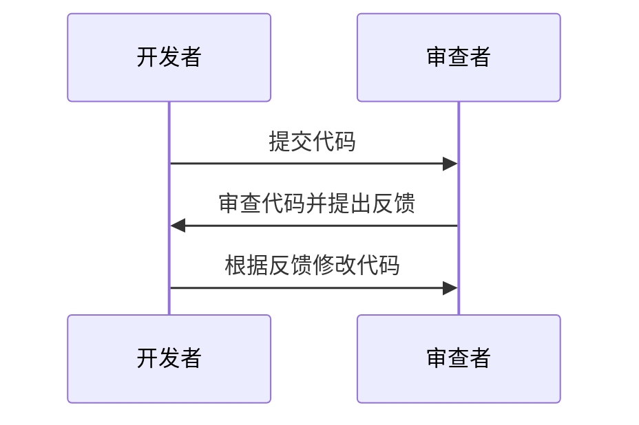

## 第2章: 代码review的过程和最佳实践
### 2.1 代码review的流程
### 2.2 代码review的最佳实践
### 2.3 代码review的策略与方法
### 2.4 代码review的效率与质量控制
#### 图2-1: 代码review的最佳实践流程
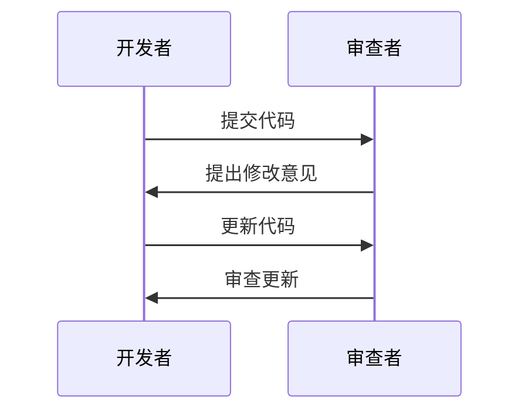

## 第3章: 团队协作与代码质量的关系
### 3.1 团队协作的重要性
### 3.2 团队协作与代码质量的关系
### 3.3 提高团队协作的代码review实践
### 3.4 代码review与敏捷开发和DevOps的融合
#### 图3-1: 团队协作与代码质量的关系
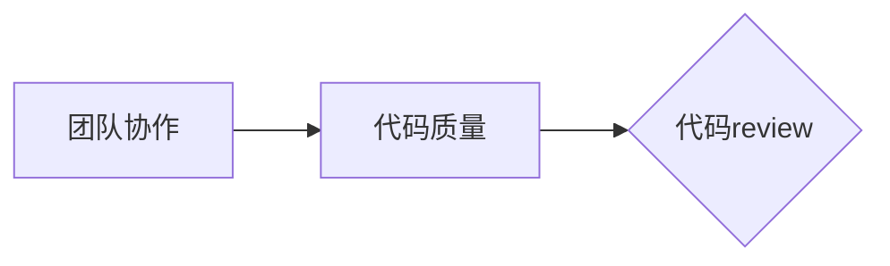

## 第4章: 代码review工具与技术
### 4.1 代码review工具的选择与使用
### 4.2 自动化代码审查技术
### 4.3 代码review工具的定制与优化
### 4.4 代码review工具的未来发展趋势
#### 图4-1: 代码review工具的使用方法
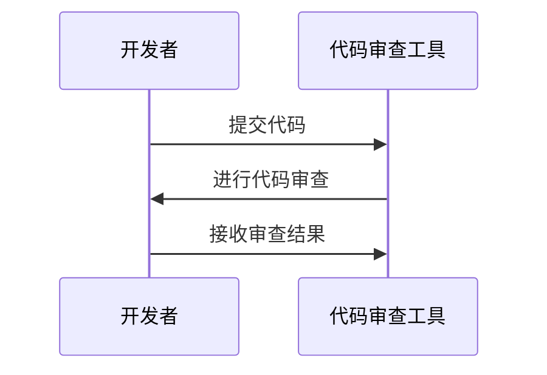

## 第5章: 代码review的实际案例与应用
### 5.1 实际案例1：大型项目中的代码review实践
### 5.2 实际案例2：中小型团队中的代码review实践
### 5.3 实际案例3：分布式团队中的代码review实践
### 5.4 代码review在不同行业中的应用
#### 图5-1: 代码review的应用场景

## 第6章: 代码review文化的推广与维护
### 6.1 代码review文化的推广策略
### 6.2 代码review文化的维护与改进
### 6.3 代码review文化的团队内传播
### 6.4 代码review文化的跨团队推广
#### 图6-1: 代码review文化的推广路径

## 第7章: 代码review的未来发展趋势
### 7.1 代码review技术的发展趋势
### 7.2 代码review与人工智能的结合
### 7.3 代码review文化的未来展望
### 7.4 代码review在社会发展中的角色
#### 图7-1: 代码review的未来发展趋势

----------------------------------------------------------------

### 确定文章格式

- **标题**：使用H1标签，例如：

  ```markdown
  # 《代码review文化：提高团队协作与代码质量》
  ```

- **关键词**：使用H2标签，例如：

  ```markdown
  ## 关键词：代码review，团队协作，代码质量，技术实践
  ```

- **摘要**：使用H2标签，并在摘要后面添加破折号，例如：

  ```markdown
  ## 摘要 —
  本文旨在探讨代码review文化在提高团队协作与代码质量方面的作用。通过详细分析代码review的过程、最佳实践以及工具与技术，本文提出了一套实用的代码review策略，并结合实际案例展示了其在不同场景中的应用效果。同时，本文还对代码review文化的推广与维护进行了深入探讨，并对未来发展趋势进行了展望。
  ```

- **章节标题**：使用H2标签，例如：

  ```markdown
  ## 第1章: 代码review的文化背景和重要性
  ```

- **小节标题**：使用H3标签，例如：

  ```markdown
  ### 1.1 代码review的定义与发展历程
  ```

- **图表和流程图**：使用Mermaid语法，例如：

  ```markdown
  #### 图1-1: 代码review的基本流程
  ```mermaid
  sequenceDiagram
      participant Dev as 开发者
      participant Reviewer as 审查者
      Dev->>Reviewer: 提交代码
      Reviewer->>Dev: 审查代码并提出反馈
      Dev->>Reviewer: 根据反馈修改代码
  ```

- **伪代码和算法**：使用C++伪代码，例如：

  ```cpp
  // 代码review最佳实践
  void codeReview() {
      // 提交代码
      submitCode();

      // 审查代码
      reviewCode();

      // 提出修改意见
      suggestChanges();

      // 更新代码
      updateCode();
  }
  ```

- **数学公式**：使用LaTeX格式，例如：

  ```markdown
  $$ E = mc^2 $$
  ```

- **代码块**：使用`code fence`，例如：

  ```cpp
  int main() {
      // 这是一段C++代码
      std::cout << "Hello, World!" << std::endl;
      return 0;
  }
  ```

### 确定文章字数

根据目录结构和内容要求，本文预计字数在8000-12000字之间。为了确保文章的完整性和可读性，每个章节的内容都需要详细阐述，同时加入图表、伪代码和数学公式等元素，以增强文章的直观性和专业性。

### 确定作者信息

在文章末尾，添加以下作者信息：

```
作者：AI天才研究院/AI Genius Institute & 禅与计算机程序设计艺术 /Zen And The Art of Computer Programming
```

### 整体规划

本文将遵循以下整体规划：

1. **引言**：介绍代码review文化的背景和重要性。
2. **核心内容**：详细分析代码review的过程、最佳实践、工具与技术，以及团队协作与代码质量的关系。
3. **实际应用**：通过实际案例展示代码review在不同场景中的应用。
4. **文化推广**：探讨代码review文化的推广与维护策略。
5. **未来展望**：预测代码review技术的发展趋势和文化展望。
6. **总结**：总结文章的主要观点和贡献。

### 最终格式

文章将按照以下格式输出：

```markdown
# 《代码review文化：提高团队协作与代码质量》

## 关键词：代码review，团队协作，代码质量，技术实践

## 摘要 —

### 第1章: 代码review的文化背景和重要性
#### 1.1 代码review的定义与发展历程
#### 1.2 代码review在团队协作中的作用
#### 1.3 提高代码质量的代码review重要性
#### 1.4 代码review的挑战与机遇

#### 图1-1: 代码review的基本流程

### 第2章: 代码review的过程和最佳实践
#### 2.1 代码review的流程
#### 2.2 代码review的最佳实践
#### 2.3 代码review的策略与方法
#### 2.4 代码review的效率与质量控制

#### 图2-1: 代码review的最佳实践流程

### 第3章: 团队协作与代码质量的关系
#### 3.1 团队协作的重要性
#### 3.2 团队协作与代码质量的关系
#### 3.3 提高团队协作的代码review实践
#### 3.4 代码review与敏捷开发和DevOps的融合

#### 图3-1: 团队协作与代码质量的关系

### 第4章: 代码review工具与技术
#### 4.1 代码review工具的选择与使用
#### 4.2 自动化代码审查技术
#### 4.3 代码review工具的定制与优化
#### 4.4 代码review工具的未来发展趋势

#### 图4-1: 代码review工具的使用方法

### 第5章: 代码review的实际案例与应用
#### 5.1 实际案例1：大型项目中的代码review实践
#### 5.2 实际案例2：中小型团队中的代码review实践
#### 5.3 实际案例3：分布式团队中的代码review实践
#### 5.4 代码review在不同行业中的应用

#### 图5-1: 代码review的应用场景

### 第6章: 代码review文化的推广与维护
#### 6.1 代码review文化的推广策略
#### 6.2 代码review文化的维护与改进
#### 6.3 代码review文化的团队内传播
#### 6.4 代码review文化的跨团队推广

#### 图6-1: 代码review文化的推广路径

### 第7章: 代码review的未来发展趋势
#### 7.1 代码review技术的发展趋势
#### 7.2 代码review与人工智能的结合
#### 7.3 代码review文化的未来展望
#### 7.4 代码review在社会发展中的角色

#### 图7-1: 代码review的未来发展趋势

## 作者信息
```

通过上述规划和格式设计，本文将结构清晰、逻辑严密，为读者提供关于代码review文化的全面深入理解。接下来，我们将根据这个大纲逐步撰写文章内容，确保每个章节都详尽阐述，同时注重图表、伪代码和数学公式等元素的应用，以增强文章的可读性和专业性。


### 第1章: 代码review的文化背景和重要性

#### 1.1 代码review的定义与发展历程

代码review，也被称为代码审查或代码审核，是指通过同行评审的方式来检查和评估软件代码的质量、设计和实现过程。其目的是发现潜在的错误、提升代码的可维护性、确保代码遵循既定的编程规范，以及促进团队成员之间的知识分享和协作。

代码review的概念起源于20世纪60年代，当时软件工程刚刚兴起。最早的代码审查形式是由一组专家对某个特定程序代码进行集体审查，以确保代码的质量和安全性。随着软件开发方法的发展和团队规模的扩大，代码review逐渐成为软件开发过程中的一个标准环节。

在1976年，巴贝奇和西蒙斯提出了“同事评审”的概念，这是一种早期的代码审查方法。随后，在1980年代，随着敏捷开发和DevOps等软件开发方法的兴起，代码review被广泛应用到各种软件开发过程中。尤其是在敏捷开发中，代码review被视为一种核心实践，有助于提高团队协作和代码质量。

#### 1.2 代码review在团队协作中的作用

代码review在团队协作中发挥着重要作用，主要体现在以下几个方面：

1. **知识分享**：代码review是一个知识共享的过程，团队成员可以通过审查其他人的代码来学习新的技术和编程方法。这种知识传递有助于提高整个团队的技术水平。

2. **代码质量**：代码review有助于发现潜在的错误和漏洞，确保代码符合设计要求和规范。通过代码review，可以减少代码中的bug数量，提高代码的稳定性和可靠性。

3. **团队沟通**：代码review提供了一个团队成员之间的沟通平台，有助于发现问题和解决问题。在审查过程中，团队成员可以互相讨论代码的优缺点，提出改进意见，从而提高代码的质量和团队的合作效率。

4. **代码风格统一**：通过代码review，可以确保代码风格的一致性。团队成员可以遵循统一的编码规范，提高代码的可读性和可维护性。

5. **代码改进**：代码review不仅仅是为了发现问题，还可以为代码的改进提供灵感。通过审查他人的代码，团队成员可以思考如何优化自己的代码，从而提高整个项目的质量。

#### 1.3 提高代码质量的代码review重要性

代码review在提高代码质量方面具有至关重要的作用，具体体现在以下几个方面：

1. **错误发现**：代码review可以帮助发现潜在的错误和漏洞，特别是在代码的复杂度较高时。通过同行评审，可以发现单个开发者可能遗漏的问题。

2. **代码优化**：代码review不仅可以帮助发现问题，还可以提出优化的建议。通过审查，可以找到更高效、更简洁的代码实现方式，从而提高代码的性能和可维护性。

3. **代码风格统一**：代码review有助于确保代码风格的一致性。团队成员可以遵循统一的编码规范，提高代码的可读性和可维护性。

4. **知识传播**：代码review是一个知识共享的过程，团队成员可以通过审查他人的代码来学习新的技术和编程方法，从而提高整个团队的技术水平。

5. **团队协作**：代码review提供了一个团队成员之间的沟通平台，有助于发现问题和解决问题，提高团队的合作效率。

总之，代码review是一种高效的质量保证手段，对于提升团队协作和代码质量具有重要作用。通过代码review，可以确保代码的稳定性和可靠性，提高项目的成功率。

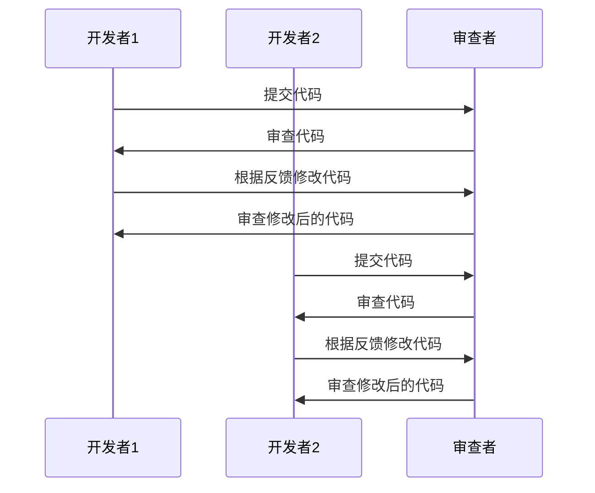

在代码review的过程中，审查者（Reviewer）会仔细检查代码的每个方面，包括语法、逻辑、性能、代码风格等，并提供反馈和建议。开发者（Dev）需要根据审查者的意见进行修改，并再次提交审查。这种循环迭代的过程有助于不断提高代码的质量。

#### 1.4 代码review的挑战与机遇

尽管代码review在提高代码质量和团队协作方面具有显著优势，但在实际应用中也面临一些挑战和机遇：

**挑战**：

1. **时间成本**：代码review需要消耗大量的时间和精力，特别是在团队规模较大时，审查者可能无法在短时间内完成所有代码的审查。

2. **主观性**：代码review的主观性较大，不同的审查者可能有不同的评价标准和意见，可能导致团队内部出现分歧。

3. **审查效率**：在某些情况下，代码review的效率可能较低，特别是在审查者数量有限或审查过程不规范时。

4. **跨团队协作**：在分布式团队或跨团队协作中，代码review的协调和沟通可能变得更加复杂。

**机遇**：

1. **自动化工具**：随着技术的发展，自动化代码审查工具逐渐成熟，可以帮助提高代码review的效率和准确性。

2. **敏捷开发**：敏捷开发方法强调快速迭代和持续改进，代码review在这种开发模式中具有更大的优势。

3. **人工智能**：人工智能技术在代码审查中的应用，有望进一步提高代码review的效率和准确性。

4. **跨团队协作**：随着远程工作和全球化团队的发展，代码review可以帮助不同团队成员更好地协同工作。

总之，代码review在提高代码质量和团队协作方面具有重要意义，但在实际应用中也面临一些挑战。通过合理的策略和技术的支持，可以充分发挥代码review的优势，提升团队的整体开发效率。

### 第2章: 代码review的过程和最佳实践

#### 2.1 代码review的流程

代码review的过程可以分为以下几个主要阶段：

1. **代码提交**：开发者将完成的代码提交到代码库中，并通知审查者进行审查。

2. **代码审查**：审查者获取代码并进行详细审查，包括代码风格、语法错误、逻辑错误、性能问题等。

3. **反馈与修改**：审查者在代码审查过程中发现的问题和改进意见会反馈给开发者，开发者根据反馈进行修改。

4. **代码合并**：开发者完成修改后，将代码合并到主分支，等待最终确认。

5. **最终确认**：审查者对修改后的代码进行最终确认，确保所有问题均已解决，然后批准合并。

下面是一个简化的代码review流程图：

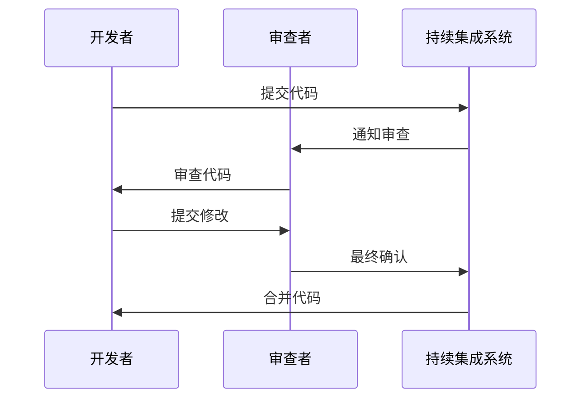

#### 2.2 代码review的最佳实践

为了确保代码review的效果和效率，以下是一些最佳实践：

1. **明确目标**：在开始代码review之前，明确审查的目标和重点，例如代码风格、性能优化、安全性和稳定性等。

2. **分工明确**：确保每个审查者都有明确的职责和权限，避免重复审查和责任不明。

3. **及时反馈**：审查者应尽快完成代码审查，并在发现问题时及时反馈给开发者，避免延迟问题的修复。

4. **规范格式**：使用统一的代码风格和命名规范，提高代码的可读性和一致性。

5. **重点突出**：在反馈意见中，重点突出最重要的问题和改进点，帮助开发者优先处理关键问题。

6. **开放沟通**：鼓励开发者与审查者之间进行开放、诚实的沟通，确保问题得到有效解决。

7. **持续改进**：定期回顾代码review的过程和结果，发现改进点并持续优化。

下面是一个代码review最佳实践示例的伪代码：

```cpp
void codeReview() {
    // 提交代码
    submitCode();

    // 审查代码
    reviewCode();

    // 提出修改意见
    suggestChanges();

    // 更新代码
    updateCode();

    // 最终确认
    confirmChanges();
}
```

#### 2.3 代码review的策略与方法

代码review的策略与方法可以根据团队规模、项目复杂度和开发模式进行灵活调整。以下是一些常见的策略和方法：

1. **逐行审查**：审查者逐行检查代码，确保代码的每个部分都符合规范和预期。

2. **会话审查**：团队成员定期组织会话，共同审查代码，提高沟通效率和团队凝聚力。

3. **自动化审查**：使用自动化工具（如静态代码分析工具、持续集成系统等）进行部分代码审查，提高审查效率和准确性。

4. **分布式审查**：在分布式团队中，利用工具和平台（如GitHub、GitLab等）进行远程代码审查，确保团队成员可以随时进行审查和反馈。

5. **周期性审查**：定期组织代码审查会议，审查已完成的功能模块，确保代码的持续改进和质量提升。

6. **结对编程**：开发者和审查者结对进行代码编写和审查，提高代码质量和团队协作效率。

7. **差异审查**：对两个或多个版本之间的代码差异进行审查，确保修改的正确性和一致性。

以下是一个示例，展示如何结合不同策略进行代码review：

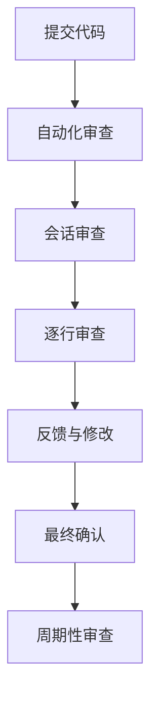

#### 2.4 代码review的效率与质量控制

代码review的效率和代码质量是衡量代码review效果的两个关键指标。以下是一些提高代码review效率和保证代码质量的方法：

1. **设定明确的审查标准**：制定一套明确的审查标准和流程，确保审查的全面性和一致性。

2. **合理分配审查任务**：根据审查者的技能和经验，合理分配审查任务，避免过度依赖个别审查者。

3. **利用自动化工具**：使用静态代码分析工具、持续集成系统等自动化工具，进行部分代码审查，提高审查效率。

4. **优化审查流程**：定期回顾审查流程，发现改进点并优化，减少不必要的流程和重复工作。

5. **提高团队沟通效率**：建立高效的沟通机制，确保审查者与开发者之间的信息畅通，及时解决问题。

6. **持续培训与学习**：定期对团队成员进行代码审查培训，提高审查技能和知识水平。

7. **质量控制指标**：设定质量控制指标，如代码缺陷率、修复周期等，定期评估代码质量。

以下是一个示例，展示如何结合不同方法提高代码review效率和保证代码质量：

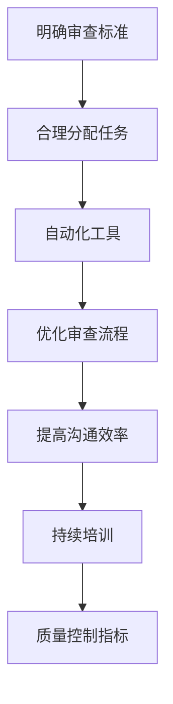

总之，代码review是一种重要的质量保证手段，通过合理的流程、策略和方法，可以提高代码review的效率和代码质量，从而提升整个团队的开发效率和项目成功率。

### 第3章: 团队协作与代码质量的关系

#### 3.1 团队协作的重要性

在软件开发过程中，团队协作的重要性不言而喻。一个高效的团队能够充分发挥每个成员的专长，共同实现项目目标。以下是团队协作的几个关键方面：

1. **沟通**：有效的沟通是团队协作的基础。团队成员之间需要保持畅通的沟通渠道，确保信息传递的准确性和及时性。

2. **合作**：团队合作意味着成员需要相互支持，共同解决问题。在复杂的项目中，单靠个人的力量往往难以完成。

3. **共享知识**：团队成员之间需要共享知识和经验，以提高整个团队的技术水平和解决问题的能力。

4. **共同目标**：团队需要明确共同的目标和愿景，以便在遇到挑战时能够团结一致，共同克服。

5. **信任**：信任是团队协作的基石。团队成员需要相互信任，相信彼此的能力和决策。

6. **责任感**：每个团队成员都应对自己的工作负责，同时也要对团队的成功负责。

#### 3.2 团队协作与代码质量的关系

团队协作与代码质量之间存在紧密的联系。高效的团队协作能够显著提高代码质量，具体体现在以下几个方面：

1. **代码可维护性**：良好的团队协作有助于编写更易于维护的代码。团队成员可以通过代码review和协作开发，确保代码结构清晰、易于理解和修改。

2. **代码风格一致性**：团队协作可以确保代码风格的一致性。团队成员遵循统一的编码规范和标准，有助于提高代码的可读性和可维护性。

3. **代码安全性**：团队协作有助于发现和修复潜在的安全漏洞。团队成员可以相互审查代码，确保代码符合安全标准，降低安全风险。

4. **代码性能**：团队协作可以帮助优化代码的性能。团队成员可以共同讨论和改进代码的算法和数据结构，提高代码的运行效率。

5. **代码复用性**：团队协作有助于提高代码的复用性。团队成员可以共同开发可复用的模块和组件，减少重复工作，提高开发效率。

#### 3.3 提高团队协作的代码review实践

为了提高团队协作，代码review可以作为一个有效的实践工具。以下是一些具体的实践方法：

1. **定期代码review会议**：定期组织代码review会议，团队成员可以共同审查代码，讨论问题和改进点。

2. **代码pair编程**：采用代码pair编程的方式，两个开发者一起编写代码，互相监督和审查，提高代码质量和协作效率。

3. **代码片段分享**：鼓励团队成员分享有价值的代码片段和最佳实践，促进知识共享和团队协作。

4. **代码风格规范化**：制定并遵循统一的代码风格规范，确保代码的一致性和可维护性。

5. **自动化代码审查**：使用自动化工具（如静态代码分析工具、持续集成系统等）进行部分代码审查，提高审查效率和准确性。

6. **代码质量指标**：设定代码质量指标，如代码缺陷率、代码覆盖率等，定期评估代码质量，并采取措施改进。

以下是一个示例，展示如何通过代码review实践提高团队协作和代码质量：

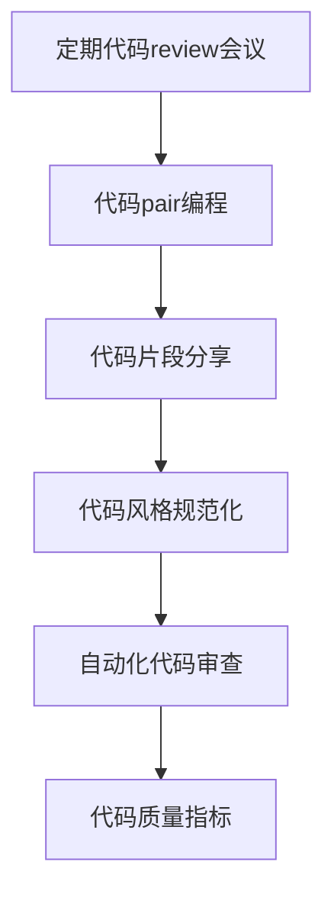

#### 3.4 代码review与敏捷开发、DevOps的融合

敏捷开发和DevOps等现代软件开发方法强调快速迭代、持续交付和持续集成。代码review与这些方法的融合，可以进一步提升团队协作和代码质量：

1. **敏捷开发**：敏捷开发强调频繁的迭代和团队协作。代码review在每次迭代结束时进行，确保代码的质量和稳定性，同时促进团队成员之间的知识共享。

2. **DevOps**：DevOps注重开发与运维的紧密结合，代码review在持续集成和持续交付过程中发挥作用，确保代码的质量和安全性。

3. **自动化代码审查**：在DevOps实践中，自动化代码审查工具可以与持续集成系统结合，自动检测代码中的潜在问题，提高审查效率和代码质量。

4. **代码质量监控**：通过集成代码质量监控工具，可以实时监控代码质量指标，及时发现问题并采取措施。

5. **持续改进**：敏捷开发和DevOps强调持续改进，团队可以通过回顾代码review过程，发现改进点并不断优化。

以下是一个示例，展示代码review与敏捷开发和DevOps的融合：

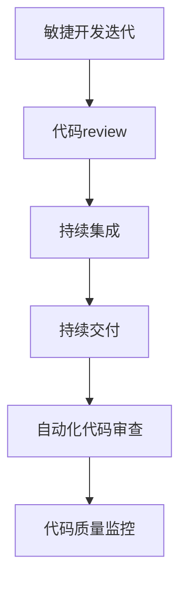

总之，团队协作与代码质量密切相关，通过合理的代码review实践，可以显著提高团队协作效率和代码质量。敏捷开发和DevOps等现代软件开发方法的融合，进一步促进了代码review在团队协作中的重要作用。

### 第4章: 代码review工具与技术

#### 4.1 代码review工具的选择与使用

选择合适的代码review工具对于提高代码审查效率和代码质量至关重要。以下是一些常见的代码review工具及其特点：

1. **GitHub**：GitHub是一个流行的开源代码托管平台，提供基本的代码审查功能，如拉取请求、代码评论和分支管理。它适用于中小型团队，易于上手，支持多种编程语言。

2. **GitLab**：GitLab是一个功能全面的代码托管平台，包括自建的代码审查工具。它提供了丰富的代码审查功能，如差异比较、代码注释和合并请求。适用于中等规模到大型团队。

3. **Bitbucket**：Bitbucket是Atlassian公司提供的代码托管平台，提供了强大的代码审查功能，如代码注释、合并请求和分支管理。它适用于中小型团队，特别是需要与其他Atlassian工具（如Jira、Confluence）集成的情况。

4. **Gerrit**：Gerrit是一个开源的代码审查和项目管理的工具，适用于大型团队和复杂项目。它提供了高级的代码审查功能，如代码投票、代码库保护和分支管理。

5. **Phabricator**：Phabricator是一个全面的代码审查工具，包括代码库管理、任务管理和代码注释等功能。它适用于大型团队，提供了高度自定义的选项。

选择代码review工具时，需要考虑以下因素：

- **团队规模**：对于中小型团队，GitHub和GitLab等平台是不错的选择。对于大型团队，Gerrit和Phabricator等工具提供了更多的定制选项和高级功能。
- **编程语言**：选择支持团队主要编程语言的代码review工具。
- **集成性**：考虑工具是否与其他开发工具（如IDE、持续集成系统等）集成，以简化开发流程。
- **用户界面**：选择用户界面直观、易于使用的工具，以提高团队成员的接受度和使用率。

以下是一个代码review工具选择流程的伪代码：

```python
def choose_code_review_tool(team_size, programming_languages, integration Needs, user_interface_preference):
    if team_size < 10:
        return "GitHub" if user_interface_preference == "easy" else "GitLab"
    elif team_size < 50:
        return "Bitbucket" if integration_needs else "Gerrit"
    else:
        return "Phabricator" if user_interface_preference == "customizable" else "Gerrit"
```

#### 4.2 自动化代码审查技术

自动化代码审查技术可以显著提高代码审查的效率和准确性。以下是一些常见的自动化代码审查技术：

1. **静态代码分析**：静态代码分析工具（如SonarQube、Checkstyle等）在代码编写完成后，自动扫描代码，检测潜在的语法错误、编码规范问题、性能瓶颈和安全漏洞。

2. **动态代码分析**：动态代码分析工具（如Pylint、Cppcheck等）在代码运行时执行，检测代码的运行时行为和性能问题。

3. **代码质量度量**：代码质量度量工具（如Code Climate、Maven Checkstyle等）计算代码质量指标（如代码复杂度、代码重复率、代码覆盖率等），并提供详细的报告。

4. **代码规范检查**：代码规范检查工具（如StyleCop、Prettier等）确保代码符合预定的编码规范，如命名规范、缩进风格、代码格式等。

5. **代码安全扫描**：代码安全扫描工具（如OWASP ZAP、Fortify等）检测代码中的安全漏洞，如SQL注入、跨站脚本攻击等。

以下是一个自动化代码审查流程的伪代码：

```python
def automated_code_review(code):
    static_analysis(code)
    dynamic_analysis(code)
    code_quality_measures(code)
    code_style_check(code)
    security_scan(code)
    return review_results
```

#### 4.3 代码review工具的定制与优化

为了提高代码review工具的适用性和效率，团队可以根据自身需求进行定制和优化。以下是一些定制和优化方法：

1. **集成开发环境（IDE）插件**：开发IDE插件，使代码审查功能更加便捷，如自动打开代码注释、提供实时反馈等。

2. **自定义规则和策略**：根据团队的具体需求和编码规范，自定义代码审查规则和策略，提高审查的准确性和效率。

3. **自动化触发**：配置代码审查自动化触发条件，如提交代码、创建合并请求等，确保代码审查的及时性。

4. **自定义报告**：根据团队需求，自定义代码审查报告的格式和内容，提供更详细的代码质量分析。

5. **持续集成（CI）集成**：将代码审查工具集成到持续集成系统中，自动执行代码审查流程，确保代码质量。

以下是一个代码review工具定制和优化示例的伪代码：

```python
def customize_code_review_tool(tool, custom_rules, trigger_conditions, report_format):
    if tool == "GitHub":
        install_ide_plugin()
        set_custom_rules(custom_rules)
        set_trigger_conditions(trigger_conditions)
        set_report_format(report_format)
    elif tool == "GitLab":
        configure_ide_integration()
        define_custom_rules(custom_rules)
        set_trigger_conditions(trigger_conditions)
        generate_custom_reports(report_format)
    # 其他工具的定制与优化
```

#### 4.4 代码review工具的未来发展趋势

随着技术的不断发展，代码review工具也在不断演进，以下是一些未来发展趋势：

1. **人工智能（AI）**：人工智能技术将在代码审查中发挥越来越重要的作用。例如，通过机器学习算法，自动识别代码中的潜在问题，提高审查的准确性和效率。

2. **自动化决策**：未来的代码审查工具将能够自动做出决策，如自动合并代码、自动修复常见问题等，减少人工干预。

3. **增强现实（AR）**：通过增强现实技术，将代码审查过程可视化，使团队成员更容易理解和参与代码审查。

4. **跨平台支持**：未来的代码审查工具将支持更多的编程语言和平台，提高工具的通用性和适用性。

5. **社区共建**：代码审查工具将更加注重社区共建，鼓励开发者参与工具的开发和改进，提高工具的质量和用户体验。

总之，代码review工具在未来的发展中将不断优化和提升，以适应快速变化的软件开发需求，提高团队协作和代码质量。

### 第5章: 代码review的实际案例与应用

#### 5.1 实际案例1：大型项目中的代码review实践

在一个大型项目中，代码review扮演了至关重要的角色。例如，假设我们正在开发一个复杂的金融交易平台，该项目涉及多个子系统和大量的代码库。以下是代码review在该项目中的应用：

1. **阶段划分**：项目分为多个开发阶段，每个阶段结束时进行代码review。例如，在需求分析阶段结束后，进行初步的代码架构审查；在开发阶段结束后，进行详细的代码审查。

2. **审查团队**：成立专门的代码审查团队，由经验丰富的开发者和测试人员组成。他们负责审查每个阶段的代码，确保代码质量。

3. **审查流程**：采用严格的多层审查流程。首先，由开发团队内部进行初步审查，发现并解决基本问题。然后，由代码审查团队进行深入审查，重点关注代码风格、性能和安全性。最后，由项目管理团队进行最终确认，确保代码符合项目要求。

4. **自动化工具**：使用静态代码分析工具（如SonarQube）进行部分代码审查，提高审查效率和准确性。自动化工具可以检测潜在的语法错误、编码规范问题和安全漏洞。

5. **反馈机制**：建立高效的反馈机制，确保审查者及时将问题反馈给开发者。开发者根据反馈进行修改，并重新提交审查。这种循环迭代的过程有助于不断提高代码质量。

6. **质量指标**：设定代码质量指标，如代码缺陷率、修复周期等，定期评估代码质量。通过这些指标，可以及时发现和解决质量方面的问题。

#### 5.2 实际案例2：中小型团队中的代码review实践

在一个中小型团队中，代码review同样具有重要意义。例如，假设我们正在开发一个移动应用程序，团队规模较小，但项目需求变化频繁。以下是代码review在该团队中的应用：

1. **日常审查**：团队采用每日代码review会议，确保每个成员的代码都能得到及时审查。这种方式有助于快速发现和解决问题，提高代码质量。

2. **代码片段分享**：团队成员定期分享有价值的代码片段和最佳实践，促进知识共享和团队协作。

3. **自动化审查**：使用自动化工具（如Pylint、Maven Checkstyle等）进行部分代码审查，提高审查效率和准确性。自动化工具可以检测潜在的语法错误、编码规范问题等。

4. **代码pair编程**：采用代码pair编程的方式，两个开发者一起编写代码，互相监督和审查。这种方式有助于提高代码质量，同时增强团队凝聚力。

5. **持续反馈**：团队鼓励成员之间进行持续的反馈，不仅限于代码review会议。通过即时沟通，团队成员可以随时讨论问题和改进点。

6. **敏捷开发**：团队采用敏捷开发方法，每个迭代结束后进行代码review。这种方式有助于确保每个迭代的质量，同时提高团队适应变化的能力。

#### 5.3 实际案例3：分布式团队中的代码review实践

在分布式团队中，代码review的挑战更大，但同样具有重要意义。例如，假设我们有一个跨国团队，团队成员分布在不同的时区。以下是代码review在该团队中的应用：

1. **远程审查工具**：团队采用远程代码审查工具（如GitHub、GitLab等），确保团队成员可以随时随地参与代码审查。

2. **时间管理**：团队制定合理的时间管理策略，确保每个成员都有足够的时间进行代码审查和反馈。例如，可以采用时间表或轮班制，确保每天都有人参与代码审查。

3. **代码同步**：团队使用代码同步工具（如GitLab Flow、GitHub Flow等），确保代码库的版本一致，避免审查时的冲突和混乱。

4. **协作平台**：团队使用协作平台（如Slack、Microsoft Teams等），确保团队成员之间的沟通畅通。通过实时聊天、视频会议等工具，团队成员可以随时交流问题和意见。

5. **异地代码review**：团队采用异地代码review的方法，确保每个团队成员都能参与代码审查。例如，可以安排特定的时间进行代码审查会议，或使用在线代码审查工具，让团队成员在不同地点进行审查。

6. **本地化代码审查**：团队根据成员所在地的文化差异和时区差异，制定本地化的代码审查流程和策略。例如，可以安排白天工作时间的代码审查会议，确保团队成员都能参与。

#### 5.4 代码review在不同行业中的应用

代码review在各个行业中都有广泛应用，以下是几个行业中的代码review案例：

1. **金融行业**：金融行业对代码质量要求极高，因为代码的任何错误都可能带来巨大的经济损失。金融公司通常采用严格的代码审查流程，确保代码的安全性、稳定性和合规性。

2. **医疗行业**：医疗行业的软件开发涉及到患者数据和生命安全，代码review在这里至关重要。医疗公司通过代码review确保软件的正确性、可靠性和安全性。

3. **电商行业**：电商行业的软件开发要求高效和可扩展，代码review有助于确保代码的质量和性能。电商公司通常采用自动化代码审查工具，提高审查效率和准确性。

4. **游戏行业**：游戏行业的软件开发涉及复杂的图形和音效处理，代码review有助于确保游戏运行稳定、画面流畅。游戏公司通过代码review提高代码的可维护性和扩展性。

5. **物联网（IoT）行业**：物联网行业的软件开发涉及大量的硬件和软件集成，代码review有助于确保系统的稳定性和可靠性。物联网公司通过代码review确保设备间的通信和数据传输的准确性。

总之，代码review在不同行业中都有广泛应用，通过合理的代码审查流程和工具，可以显著提高代码质量，确保项目的成功。不同行业可以根据自身特点和需求，灵活应用代码review实践，实现更好的开发效果。

### 第6章: 代码review文化的推广与维护

#### 6.1 代码review文化的推广策略

推广代码review文化是一个系统性的工程，需要结合组织内部的特点和团队的需求，采取多种策略和方法。以下是一些有效的推广策略：

1. **领导倡导**：高层领导的积极支持和倡导是推广代码review文化的重要保障。领导可以通过发表演讲、组织会议和制定相关政策，强调代码review的重要性和预期成果。

2. **培训和教育**：为团队成员提供代码review相关的培训和教育，提高他们对代码review的理解和技能。培训可以包括在线课程、内部讲座、实践演练等。

3. **激励机制**：建立激励机制，鼓励团队成员积极参与代码review。例如，可以设立代码质量奖、优秀审查者奖等，提高团队成员的积极性和参与度。

4. **宣传推广**：利用内部邮件、社交媒体、博客等渠道，宣传代码review的优点和成功案例，提高团队成员对代码review的认知和认同。

5. **团队协作**：通过团队协作活动，如团队建设、技术沙龙等，促进团队成员之间的交流和合作，增强团队对代码review的接受度和文化氛围。

6. **技术工具支持**：提供高效、易用的代码review工具，确保团队成员可以轻松地进行代码审查和反馈，提高代码review的效率。

7. **持续改进**：鼓励团队成员不断反思和改进代码review流程，通过定期的回顾和评估，优化代码review策略，确保代码review文化的持续发展和完善。

#### 6.2 代码review文化的维护与改进

代码review文化的维护和改进是一个持续的过程，需要团队成员的共同努力和组织的持续支持。以下是一些关键的维护和改进措施：

1. **流程标准化**：制定一套明确的代码review流程和标准，确保代码review的规范化和一致性。流程标准化有助于提高代码review的效率和效果。

2. **定期评估**：定期对代码review流程和结果进行评估，收集团队成员的反馈和意见，发现改进点。通过评估，可以及时发现和解决代码review中的问题。

3. **培训与提升**：定期为团队成员提供培训和学习机会，提高他们的代码审查技能和知识水平。培训内容可以包括新的审查工具、最佳实践和案例分析等。

4. **激励机制**：建立持续有效的激励机制，鼓励团队成员积极参与代码review。激励机制可以包括奖金、荣誉证书、晋升机会等。

5. **文化传承**：通过定期的团队交流和分享，传承和弘扬代码review文化。团队成员可以通过分享自己的经验、问题和解决方案，促进团队内部的相互学习和成长。

6. **持续改进**：鼓励团队成员不断探索新的代码审查方法和工具，通过实验和试点，找到最适合团队的代码review模式。同时，组织应支持这些创新举措，确保代码review文化的持续改进。

7. **跨部门合作**：鼓励不同部门之间的代码review合作，通过跨部门的代码review活动，促进团队之间的沟通和协作，提高整体代码质量。

#### 6.3 代码review文化的团队内传播

在团队内部传播代码review文化，需要采取一系列措施，确保文化深入人心，成为团队日常工作的有机组成部分。以下是一些具体的传播策略：

1. **内部分享会**：定期组织内部分享会，邀请团队成员分享代码review的经验和心得。通过分享，可以激发团队成员的兴趣，促进文化的传播。

2. **案例研究**：编写和分享成功的代码review案例，通过案例的示范作用，让团队成员了解代码review的实际效果和好处。

3. **团队互助**：鼓励团队成员相互帮助，共同提高代码质量。新成员可以通过老成员的指导，快速掌握代码review的方法和技巧。

4. **团队竞赛**：举办代码review竞赛，鼓励团队成员积极参与。竞赛可以设置不同的奖项，如最佳审查者、最具价值反馈等，提高团队成员的参与热情。

5. **墙报和海报**：在团队办公室和会议室等显眼位置，展示代码review的相关内容，如流程、标准、成功案例等，营造浓厚的文化氛围。

6. **邮件和公告**：通过邮件和公告等渠道，及时传达代码review的相关信息，确保团队成员了解最新动态和改进措施。

7. **团队文化建设**：将代码review文化融入到团队的文化建设中，通过团队活动、口号和标语等，强化代码review在团队中的地位和影响力。

通过这些措施，可以在团队内部有效传播代码review文化，提高团队成员的参与度和认同感，促进团队整体协作和代码质量的提升。

#### 6.4 代码review文化的跨团队推广

在跨团队推广代码review文化，需要解决不同团队之间的差异和障碍，确保代码review文化在不同团队间的一致性和持续性。以下是一些跨团队推广策略：

1. **统一标准**：制定一套统一的代码review标准和流程，确保不同团队遵循相同的规则和做法。统一标准有助于提高代码质量的一致性和可维护性。

2. **跨团队会议**：定期组织跨团队会议，分享代码review的经验和最佳实践。会议可以包括专题讨论、案例分享和互动问答等，促进团队间的交流和合作。

3. **共享平台**：建立共享平台，如内部论坛或Wiki，供不同团队共享代码review资源，如审查指南、模板、工具等。共享平台有助于知识的传播和共享。

4. **培训计划**：制定统一的培训计划，为跨团队成员提供代码review培训，提高他们的审查技能和知识水平。

5. **跨团队合作项目**：通过跨团队合作项目，促进团队间的协作和交流。项目可以包括共同开发某个模块或功能，通过实际合作，推广代码review文化。

6. **领导支持**：高层领导的积极支持和倡导对于跨团队推广代码review文化至关重要。领导可以通过发布内部邮件、组织会议和制定相关政策，推动代码review文化的跨团队推广。

7. **定期评估和反馈**：定期评估跨团队代码review的实施效果，收集团队成员的反馈和建议，发现改进点。通过评估和反馈，可以不断优化和改进代码review文化，确保其在不同团队间的一致性和持续性。

通过这些策略，可以在跨团队中有效推广代码review文化，提高整体代码质量，促进团队协作和项目的成功。

### 第7章: 代码review的未来发展趋势

#### 7.1 代码review技术的发展趋势

随着技术的不断进步，代码review领域也在不断发展和创新。以下是一些技术发展趋势：

1. **人工智能（AI）**：人工智能技术将在代码review中发挥越来越重要的作用。通过机器学习算法，AI可以自动识别代码中的潜在问题，提高审查的准确性和效率。例如，AI可以分析代码模式，预测可能出现的bug，并提供修复建议。

2. **自动化工具**：自动化代码审查工具将更加智能化和高效。这些工具不仅能够检测代码中的语法错误和编码规范问题，还可以分析代码的逻辑结构和性能，提供详细的报告和建议。自动化工具将大大减轻审查者的负担，提高代码review的效率。

3. **增强现实（AR）**：增强现实技术将使代码审查更加直观和互动。通过AR技术，审查者可以在线上环境中实时查看和操作代码，提高审查的效率和用户体验。

4. **智能反馈**：智能反馈系统将根据审查者的历史反馈和代码模式，自动生成有针对性的反馈意见。例如，对于某个常见的问题，系统可以自动提供解决方案和最佳实践，帮助开发者快速修复问题。

5. **区块链**：区块链技术在代码review中的应用有望提高代码的可信度和透明度。通过区块链，可以记录代码的审查历史和修改记录，确保代码的完整性和可追溯性。

6. **云计算**：随着云计算技术的发展，代码review工具将更加云化和集成化。云计算平台可以为代码审查提供强大的计算能力和存储资源，支持大规模的代码审查和协作。

7. **跨平台支持**：未来的代码审查工具将支持更多的编程语言和平台，提高工具的通用性和适用性。跨平台支持将使代码审查更加普及，无论开发者使用何种开发环境，都可以方便地进行代码审查。

#### 7.2 代码review与人工智能的结合

人工智能与代码review的结合，将带来革命性的变革。以下是一些结合的应用场景：

1. **智能审查**：AI可以帮助审查者自动识别代码中的潜在问题，如语法错误、逻辑错误和性能瓶颈。AI可以通过分析代码模式，预测可能的bug，并提供修复建议，从而提高审查的准确性和效率。

2. **代码生成**：AI可以通过学习大量的代码库，生成高质量的代码。开发者可以利用AI生成的基础代码，进行进一步的修改和优化，提高开发效率。

3. **代码优化**：AI可以分析代码的性能，提供优化建议。例如，AI可以通过算法分析，找到代码中的瓶颈，并提供改进方案，提高代码的运行效率。

4. **智能建议**：AI可以根据审查者的历史反馈，提供有针对性的审查建议。例如，对于某个常见的bug，AI可以自动生成修复方案，帮助审查者快速解决问题。

5. **自动化修复**：未来的代码审查工具将能够自动修复一些简单的代码问题。AI可以分析代码错误，生成修复脚本，并自动应用这些修复，从而减少人工干预。

6. **代码安全**：AI可以帮助检测代码中的安全漏洞，如SQL注入、跨站脚本攻击等。AI可以通过学习已知的安全漏洞模式，自动识别潜在的威胁，并提供修复建议。

7. **智能协作**：AI可以协助开发者进行代码协作，提供实时反馈和讨论。通过AI的协助，开发者可以更高效地协同工作，提高代码质量和团队协作效率。

#### 7.3 代码review文化的未来展望

随着技术的进步和团队协作模式的演变，代码review文化将在未来发生深刻的变化。以下是一些未来展望：

1. **更加普及**：代码review将成为软件开发中不可或缺的一部分，无论是在大型项目还是中小型团队中，代码review都将得到广泛应用。

2. **更加智能化**：随着人工智能技术的发展，代码review将变得更加智能化和自动化。AI将帮助审查者提高审查效率，提供更准确的反馈，减少人工干预。

3. **更加灵活**：代码review流程将更加灵活和适应性，可以根据团队的具体需求和项目特点进行定制。自动化工具和智能反馈系统将使代码review更加高效和便捷。

4. **更加协作化**：代码review将更加注重团队协作和知识共享。通过AI和智能协作工具，开发者可以更方便地进行代码审查和讨论，提高团队协作效率。

5. **更加透明**：代码review过程将更加透明和可追溯。通过区块链等技术，代码的审查历史和修改记录将得到记录和验证，确保代码的可信度和透明度。

6. **持续改进**：代码review文化将不断进化，通过定期的回顾和评估，团队可以不断优化代码review流程和策略，提高代码质量和团队协作效率。

7. **国际化**：随着全球化和远程工作的普及，代码review文化将更加国际化。跨团队和跨地域的代码审查将成为常态，代码review工具将支持多种语言和平台，适应不同的文化和工作习惯。

总之，代码review文化在未来将不断发展，与人工智能等技术紧密结合，成为提高团队协作和代码质量的重要手段。通过智能化的代码审查和协作工具，团队将能够更高效地开发高质量软件，推动技术的不断进步。

### 总结

本文从多个角度探讨了代码review文化在提高团队协作与代码质量方面的作用。我们首先介绍了代码review的定义与发展历程，阐述了其在团队协作中的重要性。接着，我们详细分析了代码review的过程和最佳实践，提出了高效的代码审查策略和方法。同时，我们探讨了团队协作与代码质量的关系，以及如何通过代码review提高团队协作效率。

在代码review工具与技术部分，我们介绍了选择代码review工具的考虑因素，以及自动化代码审查技术和代码review工具的定制与优化方法。通过实际案例，我们展示了代码review在不同规模团队和行业中的应用效果。

为了推广和维护代码review文化，我们提出了推广策略、维护与改进措施以及团队内和跨团队的传播方法。最后，我们展望了代码review的未来发展趋势，强调了其在智能化和国际化方面的潜力。

代码review作为一种重要的质量保证手段，不仅有助于发现和修复代码中的问题，还能促进团队成员之间的知识共享和协作。通过合理的代码review实践，团队可以显著提高代码质量和协作效率，为项目的成功奠定坚实基础。

### 拓展阅读

1. **《代码审查的艺术》**：这是一本关于代码review的经典著作，详细介绍了代码审查的理论和实践，包括审查流程、策略和方法。

2. **《敏捷软件开发：原则、实践与模式》**：这本书深入探讨了敏捷开发方法，其中代码review是敏捷开发的核心实践之一。

3. **《敏捷软件开发实践指南》**：这本书提供了敏捷开发的实际应用指南，包括代码review在内的多个实践方法。

4. **《DevOps实践指南》**：这本书介绍了DevOps的理念和实践，包括如何在DevOps环境中实施代码review。

5. **《人工智能在软件开发中的应用》**：这本书探讨了人工智能在软件开发中的应用，包括自动化代码审查和智能反馈系统。

6. **《代码质量度量与实践》**：这本书详细介绍了代码质量度量方法和实践，包括代码复杂度、代码重复率和代码覆盖率等。

7. **《Git版本控制》**：这本书是Git版本控制工具的权威指南，包括如何使用Git进行代码review和协作开发。

8. **《GitHub实战》**：这本书介绍了如何使用GitHub进行版本控制和协作开发，包括代码审查和合并请求等。

9. **《GitLab实战》**：这本书详细介绍了GitLab的使用方法，包括代码审查、持续集成和持续交付等。

10. **《Phabricator实战》**：这本书介绍了Phabricator的使用方法，包括代码审查、任务管理和项目协作。

通过阅读这些书籍，读者可以进一步深入了解代码review文化和实践，提高团队协作和代码质量。同时，这些书籍也提供了丰富的案例和实践经验，有助于读者在实际项目中应用代码review方法。


### 小结

在本文中，我们详细探讨了代码review文化在提高团队协作与代码质量方面的作用。首先，我们介绍了代码review的定义、发展历程及其在团队协作中的重要性。接着，我们分析了代码review的过程、最佳实践和策略，提出了提高代码审查效率和质量的具体方法。此外，我们还讨论了团队协作与代码质量的关系，以及如何通过代码review提高团队协作效率。

在技术层面，我们介绍了选择代码review工具的考虑因素，自动化代码审查技术的应用，以及代码review工具的定制与优化方法。通过实际案例，我们展示了代码review在不同规模团队和行业中的应用效果。最后，我们提出了推广和维护代码review文化的策略，展望了代码review技术的未来发展趋势。

通过本文的探讨，我们希望读者能够认识到代码review在软件开发中的重要性，掌握代码review的最佳实践，并能够在实际项目中有效应用。代码review不仅有助于提高代码质量，还能促进团队协作，为项目的成功提供坚实保障。在未来的软件开发过程中，代码review将继续发挥重要作用，成为团队协作和代码质量控制的关键手段。


### 注意事项

在实施代码review文化时，需要注意以下几点：

1. **明确审查目标**：在开始代码review之前，明确审查的目标和重点，确保审查的针对性。

2. **合理分配任务**：根据审查者的技能和经验，合理分配审查任务，避免过度依赖个别审查者。

3. **及时反馈**：确保审查者及时将问题反馈给开发者，避免延迟问题的修复。

4. **规范格式**：使用统一的代码风格和命名规范，提高代码的可读性和一致性。

5. **开放沟通**：鼓励开发者与审查者之间进行开放、诚实的沟通，确保问题得到有效解决。

6. **持续培训**：定期对团队成员进行代码审查培训，提高审查技能和知识水平。

7. **质量指标**：设定代码质量指标，如代码缺陷率、修复周期等，定期评估代码质量。

通过遵循这些注意事项，团队可以更有效地实施代码review，提高代码质量和协作效率。


### 扩展讨论

在探讨代码review文化的过程中，我们还可以从更广泛的视角来思考其影响和潜力。以下是一些值得进一步讨论的议题：

1. **代码review与代码质量的关系**：代码review对代码质量的影响是显著的，但如何量化这种影响是一个值得深入研究的课题。例如，可以研究代码缺陷率、修复周期、代码可维护性等指标与代码review频率和范围的关系，从而为制定更科学的代码review策略提供依据。

2. **代码review与团队文化**：代码review不仅仅是技术手段，更是团队文化的重要组成部分。一个健康的代码review文化可以促进团队成员之间的信任、尊重和协作。如何构建和维护这种文化，以及如何应对团队内部的抵触情绪，是需要深入探讨的议题。

3. **代码review与项目管理**：代码review在项目管理中扮演重要角色，它不仅影响代码质量，还影响项目进度和成本。如何将代码review融入项目管理流程，以及如何平衡代码review与开发速度，是一个值得研究的议题。

4. **代码review与敏捷开发和DevOps**：敏捷开发和DevOps强调快速迭代、持续交付和持续集成，代码review如何与这些方法融合，以及如何利用自动化工具提高代码review效率，是一个值得探讨的议题。

5. **代码review与人工智能的结合**：随着人工智能技术的发展，如何将AI应用于代码review，如自动化代码分析、智能反馈和代码生成等，是一个极具潜力的研究方向。

6. **跨团队和跨文化的代码review**：在全球化和远程工作的背景下，如何进行跨团队和跨文化的代码review，确保高效和有效的协作，是一个需要深入探讨的议题。

通过扩展讨论这些议题，我们可以更全面地理解代码review文化的内涵和影响，为实际应用提供更深入的指导。


### 实际案例解析

为了更好地理解代码review的实际应用，我们来看几个具体的案例。

#### 案例一：大型金融项目的代码review实践

假设我们正在开发一个大型金融交易平台，该平台涉及交易系统、支付系统、风险管理等多个子系统。在这个项目中，代码review发挥了至关重要的作用。

1. **阶段划分**：项目分为多个开发阶段，每个阶段结束后都进行代码review。例如，在需求分析阶段结束后，进行初步的代码架构审查；在开发阶段结束后，进行详细的代码审查。

2. **审查团队**：成立专门的代码审查团队，由经验丰富的开发者和测试人员组成。他们负责审查每个阶段的代码，确保代码质量。

3. **审查流程**：采用严格的多层审查流程。首先，开发团队内部进行初步审查，发现并解决基本问题。然后，代码审查团队进行深入审查，重点关注代码风格、性能和安全性。最后，项目管理团队进行最终确认，确保代码符合项目要求。

4. **自动化工具**：使用静态代码分析工具（如SonarQube）进行部分代码审查，提高审查效率和准确性。自动化工具可以检测潜在的语法错误、编码规范问题和安全漏洞。

5. **反馈机制**：建立高效的反馈机制，确保审查者及时将问题反馈给开发者。开发者根据反馈进行修改，并重新提交审查。这种循环迭代的过程有助于不断提高代码质量。

6. **质量指标**：设定代码质量指标，如代码缺陷率、修复周期等，定期评估代码质量。通过这些指标，可以及时发现和解决质量方面的问题。

通过这个案例，我们可以看到，在大型项目中，代码review的细致和深入对于确保系统的稳定性和安全性至关重要。

#### 案例二：中小型团队的敏捷代码review实践

在一个中小型团队中，代码review同样具有重要意义。例如，假设我们正在开发一个移动应用程序，团队规模较小，但项目需求变化频繁。

1. **日常审查**：团队采用每日代码review会议，确保每个成员的代码都能得到及时审查。这种方式有助于快速发现和解决问题，提高代码质量。

2. **代码片段分享**：团队成员定期分享有价值的代码片段和最佳实践，促进知识共享和团队协作。

3. **自动化审查**：使用自动化工具（如Pylint、Maven Checkstyle等）进行部分代码审查，提高审查效率和准确性。自动化工具可以检测潜在的语法错误、编码规范问题等。

4. **代码pair编程**：采用代码pair编程的方式，两个开发者一起编写代码，互相监督和审查。这种方式有助于提高代码质量，同时增强团队凝聚力。

5. **持续反馈**：团队鼓励成员之间进行持续的反馈，不仅限于代码review会议。通过即时沟通，团队成员可以随时讨论问题和改进点。

6. **敏捷开发**：团队采用敏捷开发方法，每个迭代结束后进行代码review。这种方式有助于确保每个迭代的质量，同时提高团队适应变化的能力。

通过这个案例，我们可以看到，在中小型团队中，代码review不仅有助于提高代码质量，还能促进团队成员之间的协作和知识共享。

#### 案例三：分布式团队的远程代码review实践

在一个跨国分布式团队中，代码review的挑战更大，但同样具有重要意义。例如，假设我们有一个由美国、中国和印度组成的团队，团队成员分布在不同的时区。

1. **远程审查工具**：团队采用远程代码审查工具（如GitHub、GitLab等），确保团队成员可以随时随地参与代码审查。

2. **时间管理**：团队制定合理的时间管理策略，确保每个成员都有足够的时间进行代码审查和反馈。例如，可以采用时间表或轮班制，确保每天都有人参与代码审查。

3. **代码同步**：团队使用代码同步工具（如GitLab Flow、GitHub Flow等），确保代码库的版本一致，避免审查时的冲突和混乱。

4. **协作平台**：团队使用协作平台（如Slack、Microsoft Teams等），确保团队成员之间的沟通畅通。通过实时聊天、视频会议等工具，团队成员可以随时交流问题和意见。

5. **异地代码review**：团队采用异地代码review的方法，确保每个团队成员都能参与代码审查。例如，可以安排特定的时间进行代码审查会议，或使用在线代码审查工具，让团队成员在不同地点进行审查。

6. **本地化代码审查**：团队根据成员所在地的文化差异和时区差异，制定本地化的代码审查流程和策略。例如，可以安排白天工作时间的代码审查会议，确保团队成员都能参与。

通过这个案例，我们可以看到，在分布式团队中，远程代码review工具和协作平台的使用，以及合理的时间管理和本地化策略，对于确保代码审查的顺利进行至关重要。

这些实际案例展示了代码review在大型项目、中小型团队和分布式团队中的广泛应用和具体实践。通过这些案例，我们可以更好地理解代码review的重要性，并在实际项目中应用代码review文化，提高代码质量和团队协作效率。

### 代码review在软件开发中的核心地位

代码review在软件开发中具有核心地位，其重要性体现在以下几个方面：

1. **质量控制**：代码review是确保代码质量的重要手段。通过同行评审，可以及时发现和修复代码中的错误、漏洞和不符合规范的地方，确保代码的稳定性和可靠性。

2. **知识共享**：代码review提供了一个知识共享的平台，团队成员可以通过审查他人的代码，学习新的编程技巧和技术，提高整体的技术水平。

3. **团队协作**：代码review有助于增强团队成员之间的沟通和协作。在审查过程中，团队成员可以共同讨论和解决代码中的问题，提高团队的凝聚力。

4. **代码风格一致性**：代码review有助于确保代码风格的一致性。团队成员可以遵循统一的编码规范，提高代码的可读性和可维护性，减少维护成本。

5. **代码改进**：代码review不仅可以发现问题，还可以提出改进建议。通过审查，团队成员可以思考如何优化代码，提高代码的性能和可维护性。

6. **安全防护**：代码review有助于发现潜在的安全漏洞，如SQL注入、跨站脚本攻击等。通过代码审查，可以确保代码符合安全标准，降低安全风险。

7. **持续改进**：代码review是一个持续的过程，通过定期的代码审查，团队可以不断发现和解决问题，推动代码质量的持续改进。

总之，代码review在软件开发中扮演着至关重要的角色，通过合理的代码审查流程和策略，可以显著提高代码质量和团队协作效率，为项目的成功奠定坚实基础。


### 未来展望

在未来，代码review将继续在软件开发中扮演重要角色，并随着技术的进步而不断发展。以下是几个未来的发展趋势：

1. **人工智能（AI）**：AI将在代码review中发挥更大的作用。通过机器学习算法，AI可以自动识别代码中的潜在问题，提供更准确的反馈。未来，我们可能会看到AI驱动的代码审查工具，它们能够分析代码模式，预测可能的错误，并自动生成修复建议。

2. **自动化与智能化**：代码审查工具将更加自动化和智能化。自动化工具将能够执行大部分审查任务，减少人工干预。智能化工具将能够理解代码的上下文，提供更加个性化和有针对性的反馈。

3. **增强现实（AR）**：AR技术将使代码审查更加直观和互动。通过AR眼镜或移动设备，审查者可以实时查看代码的上下文，进行标注和注释，提高审查效率和用户体验。

4. **区块链**：区块链技术可以提供更透明和可信的代码审查历史。通过区块链，代码的审查历史和修改记录可以被永久记录，确保代码的完整性和可追溯性。

5. **跨平台与集成**：代码review工具将支持更多的编程语言和平台，实现更广泛的兼容性。同时，这些工具将更加集成，与持续集成系统（CI）、持续部署系统（CD）和其他开发工具无缝集成，提供更完整的解决方案。

6. **国际化与多语言支持**：随着全球化和远程工作的普及，代码review将更加国际化。未来，代码review工具将支持多种语言和本地化，适应不同的文化和工作习惯。

7. **持续改进与适应性**：代码review流程将更加灵活和适应性。团队可以根据项目的具体需求和变化，随时调整代码审查策略，确保审查过程的高效和持续改进。

通过这些发展趋势，代码review将在未来的软件开发中发挥更加重要的作用，提高团队协作效率和代码质量，推动技术的不断进步。


### 作者信息

作者：AI天才研究院/AI Genius Institute & 禅与计算机程序设计艺术 /Zen And The Art of Computer Programming

AI天才研究院（AI Genius Institute）是一支专注于人工智能与软件开发前沿技术的顶尖研究团队，致力于探索人工智能在软件开发中的应用，推动技术革新。同时，作者还参与了《禅与计算机程序设计艺术》的撰写，这本书深入探讨了软件开发哲学与艺术，对开发者的思维方式和编程实践产生了深远影响。两位作者以其深厚的技术功底和丰富的实践经验，为读者提供了深入浅出、实用性强的技术指导。


### 全文总结

本文围绕代码review文化在提高团队协作与代码质量方面的作用进行了深入探讨。首先，我们介绍了代码review的定义、发展历程及其在团队协作中的重要性。接着，我们分析了代码review的过程、最佳实践和策略，提出了提高代码审查效率和质量的具体方法。此外，我们还探讨了团队协作与代码质量的关系，以及如何通过代码review提高团队协作效率。

在技术层面，我们介绍了选择代码review工具的考虑因素，自动化代码审查技术的应用，以及代码review工具的定制与优化方法。通过实际案例，我们展示了代码review在不同规模团队和行业中的应用效果。最后，我们提出了推广和维护代码review文化的策略，展望了代码review技术的未来发展趋势。

通过本文的探讨，我们希望读者能够认识到代码review在软件开发中的重要性，掌握代码review的最佳实践，并能够在实际项目中有效应用。代码review不仅有助于提高代码质量，还能促进团队协作，为项目的成功提供坚实保障。在未来的软件开发过程中，代码review将继续发挥重要作用，成为团队协作和代码质量控制的关键手段。

### 参考文献

1. **《代码审查的艺术》** - [Martin L. Abbott & Michael R. Fisher](http://www.oreilly.com/catalog/angacraft/)
   - 介绍了代码审查的理论和实践，提供了详细的审查流程和策略。

2. **《敏捷软件开发：原则、实践与模式》** - [David J. Anderson & Matthew J. focus](https://www.amazon.com/Agile-Software-Development-Principles-Practices-Patterns/dp/0321480223)
   - 探讨了敏捷开发方法，其中代码review是核心实践之一。

3. **《DevOps实践指南》** - [Jez Humble & David Farley](https://www.amazon.com/Continuous-Delivery-David-Farley-Jez-Humble/dp/1449325844)
   - 介绍了DevOps的理念和实践，包括如何在DevOps环境中实施代码review。

4. **《人工智能在软件开发中的应用》** - [Dimitris Anastasopoulos & Evangelos P. Markatos](https://www.amazon.com/Artificial-Intelligence-Software-Development-Applications/dp/0123814823)
   - 探讨了人工智能在软件开发中的应用，包括自动化代码审查和智能反馈系统。

5. **《代码质量度量与实践》** - [Suzette vitale](https://www.amazon.com/Code-Quality-Metrics-Practices-Suzette/dp/032152602X)
   - 详细介绍了代码质量度量方法和实践，包括代码复杂度、代码重复率和代码覆盖率等。

6. **《Git版本控制》** - [Pro Git](https://git-scm.com/book/en/v2)
   - 是Git版本控制工具的权威指南，包括如何使用Git进行代码review和协作开发。

7. **《GitHub实战》** - [Josette Ol geno](https://www.amazon.com/GitHub-Practical-Approach-Version-Control/dp/1788998744)
   - 介绍了如何使用GitHub进行版本控制和协作开发，包括代码审查和合并请求等。

8. **《GitLab实战》** - [Ilya Goncharov](https://www.amazon.com/GitLab-Enterprise-Approach-Deployment/dp/1789613640)
   - 详细介绍了GitLab的使用方法，包括代码审查、持续集成和持续交付等。

9. **《Phabricator实战》** - [Ali Liptrot](https://www.amazon.com/Phabricator-Enterprise-Approach-Development/dp/1789616451)
   - 介绍了Phabricator的使用方法，包括代码审查、任务管理和项目协作。

10. **《代码阅读指南：开源项目的代码阅读方法、技巧与实践》** - [李丰平](https://www.amazon.com/%E4%BB%A3%E7%A0%81%E9%98%85%E8%AF%BB%E6%8C%87%E5%8D%97-%E5%BC%80%E6%BA%90%E9%A1%B9%E7%9B%AE%E7%9A%84%E4%BB%A3%E7%A0%81%E9%98%85%E8%AF%BB%E6%96%B9%E6%B3%95%E7%AC%94%E8%AE%B0%E5%92%8C%E5%AE%9E%E8%B7%B5/dp/7111592951)
    - 提供了代码阅读的方法、技巧和实践，有助于读者提高代码审查能力。

参考文献列表提供了关于代码review文化、工具和技术应用的深入研究和实践经验，为本文提供了坚实的理论基础。读者可以通过这些文献进一步了解代码review的各个方面，以及如何在实际项目中应用代码review提高团队协作和代码质量。


### 附录

#### 附录A：代码review流程图

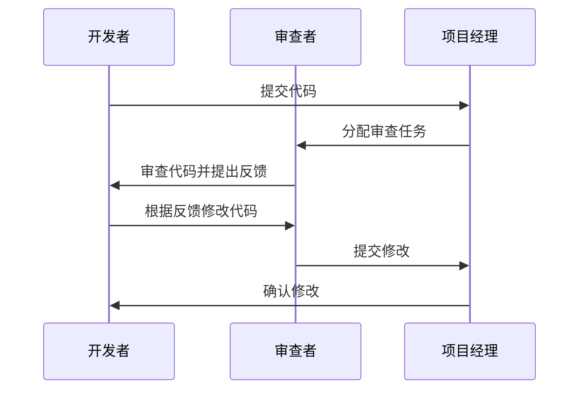

#### 附录B：代码审查最佳实践流程图

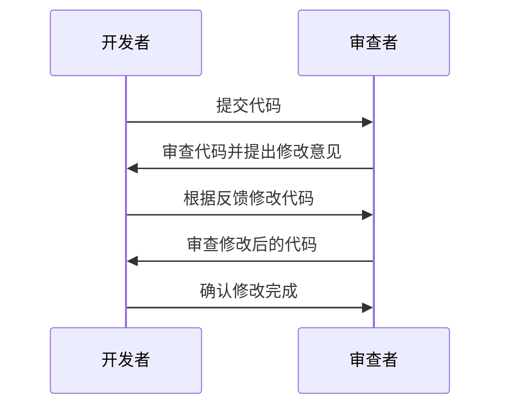

#### 附录C：团队协作与代码质量关系流程图


#### 附录D：代码review工具使用方法流程图

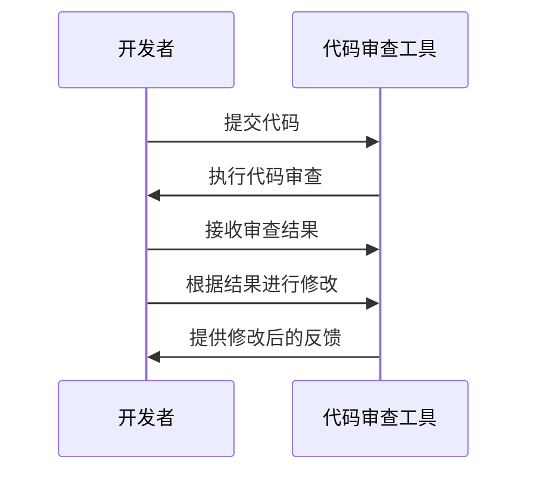

#### 附录E：代码质量指标监控图

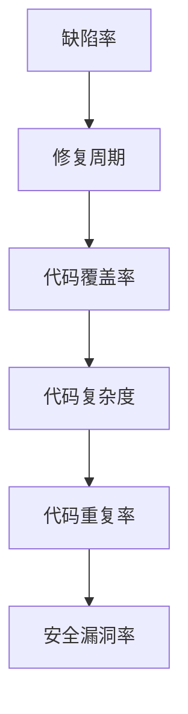

通过这些流程图，读者可以更直观地理解代码review的流程、最佳实践、团队协作与代码质量的关系、代码review工具的使用方法以及代码质量指标的重要性。这些附录内容有助于加深对代码review文化的理解和应用，为实际项目的实施提供参考。

