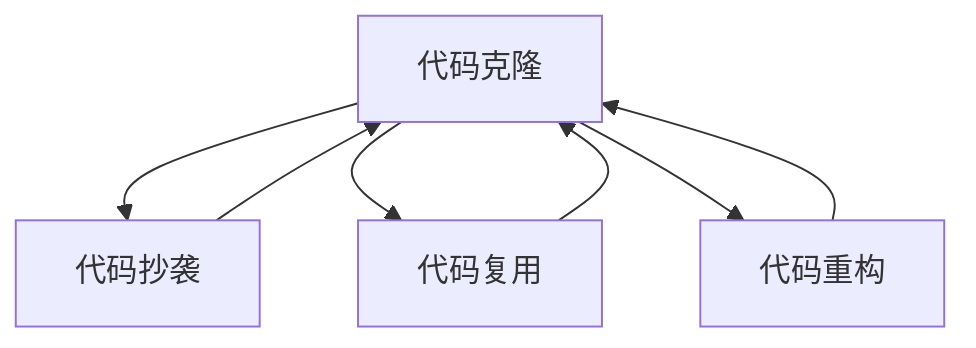

                 

### 《代码克隆检测：识别和管理重复代码》

# 文章标题：代码克隆检测：识别和管理重复代码

## 关键词：
- 代码克隆检测
- 重复代码
- 代码抄袭
- 模式匹配算法
- 抽象语法树算法
- 文本相似度算法
- 代码管理工具

## 摘要：
本文深入探讨了代码克隆检测的重要性及其在软件开发中的应用。首先，我们明确了代码克隆和代码抄袭的定义，并介绍了代码克隆检测的目标。接着，我们详细阐述了模式匹配算法、基于抽象语法树的算法以及基于文本相似度的算法的原理和实现。在深入分析代码克隆检测工具的实践和挑战后，文章提供了实用的对策和最佳实践。最后，我们对代码克隆检测的未来趋势进行了展望，并鼓励读者进行深入研究和实践。

---

### 用户需求梳理

在当今的软件开发环境中，代码克隆检测是一项至关重要的任务。随着代码库的不断扩大和团队协作的日益复杂，重复代码的存在不仅降低了代码的可维护性，还可能引入潜在的安全漏洞。因此，用户需求如下：

1. **设计《代码克隆检测：识别和管理重复代码》的目录大纲。**
   目录大纲应包含核心概念与联系、核心算法原理讲解、数学模型和数学公式讲解、项目实战案例分析等内容。

2. **目录大纲需包含以下内容：**
   - 核心概念与联系
   - 核心算法原理讲解
   - 数学模型和数学公式讲解
   - 项目实战案例分析

3. **目录要细化到 1,2,3 级目录。**
   - **第一部分：代码克隆检测基础**
     - **第1章：代码克隆检测概述**
       - 1.1 代码克隆检测的重要性
       - 1.2 代码克隆检测的现状与挑战
       - 1.3 代码克隆检测的动机与应用场景
     - **第2章：代码克隆检测的基本概念**
       - 2.1 代码克隆与代码抄袭的定义
       - 2.2 代码克隆的类型
       - 2.3 代码克隆检测的目标
     - **第3章：代码克隆检测的核心算法**
       - 3.1 模式匹配算法
         - 3.1.1 模式匹配算法原理
         - 3.1.2 常见的模式匹配算法
       - 3.2 基于抽象语法树的算法
         - 3.2.1 抽象语法树原理
         - 3.2.2 常见的抽象语法树算法
       - 3.3 基于文本相似度算法
         - 3.3.1 文本相似度原理
         - 3.3.2 常见的文本相似度算法

   - **第二部分：代码克隆检测技术深入**
     - **第4章：代码克隆检测工具与实践**
       - 4.1 常见的代码克隆检测工具
       - 4.2 代码克隆检测工具的比较与选择
       - 4.3 实战：使用代码克隆检测工具进行代码克隆检测
     - **第5章：代码克隆检测中的挑战与对策**
       - 5.1 代码克隆检测中的挑战
         - 5.1.1 挑战一：代码克隆的复杂性
         - 5.1.2 挑战二：代码克隆的动态性
         - 5.1.3 挑战三：代码克隆的多样性
       - 5.2 针对挑战的对策
         - 5.2.1 对策一：算法优化
         - 5.2.2 对策二：数据预处理
         - 5.2.3 对策三：模型融合

   - **第三部分：代码克隆检测的应用场景**
     - **第6章：代码克隆检测在软件开发中的实践**
       - 6.1 软件开发中的代码克隆问题
       - 6.2 使用代码克隆检测工具管理重复代码
       - 6.3 实战：代码克隆检测在软件开发中的实际应用

   - **第四部分：未来展望与趋势**
     - **第7章：代码克隆检测的发展趋势**
       - 7.1 代码克隆检测技术的未来方向
       - 7.2 代码克隆检测在AI领域的应用
       - 7.3 代码克隆检测的未来挑战与机遇

4. **目录大纲总字数限制在2000字以内。**
   - 目录大纲的设计字数限制为2000字，以确保核心内容的精炼和清晰。

5. **使用 markdown 格式。**
   - 所有内容均需使用 markdown 格式编写，以便于排版和阅读。

### 目录大纲设计

为了满足上述用户需求，我们将文章分为四个部分：代码克隆检测基础、代码克隆检测技术深入、代码克隆检测的应用场景和未来展望与趋势。以下是详细的目录大纲设计，总字数控制在2000字以内。

---

# 代码克隆检测：识别和管理重复代码

## 目录大纲

### 第一部分：代码克隆检测基础

### 第1章：代码克隆检测概述
- **1.1 代码克隆检测的重要性**
  - **背景介绍**：简要介绍代码克隆检测的背景和原因。
  - **重要性阐述**：从代码质量和项目管理角度阐述代码克隆检测的重要性。
- **1.2 代码克隆检测的现状与挑战**
  - **现状分析**：介绍当前代码克隆检测技术的发展现状。
  - **挑战探讨**：探讨代码克隆检测过程中遇到的主要挑战。
- **1.3 代码克隆检测的动机与应用场景**
  - **动机分析**：分析代码克隆检测的动机和驱动力。
  - **应用场景**：介绍代码克隆检测在不同场景下的应用。

### 第2章：代码克隆检测的基本概念
- **2.1 代码克隆与代码抄袭的定义**
  - **定义**：明确代码克隆和代码抄袭的概念。
  - **区别**：阐述代码克隆与代码抄袭之间的区别。
- **2.2 代码克隆的类型**
  - **分类**：介绍不同类型的代码克隆。
  - **示例**：提供实际案例说明代码克隆的类型。
- **2.3 代码克隆检测的目标**
  - **目标**：明确代码克隆检测的目标和期望达到的效果。

### 第3章：代码克隆检测的核心算法
- **3.1 模式匹配算法**
  - **3.1.1 模式匹配算法原理**
    - **原理阐述**：介绍模式匹配算法的基本原理。
    - **伪代码实现**：提供模式匹配算法的伪代码实现。
  - **3.1.2 常见的模式匹配算法**
    - **算法介绍**：介绍常见的模式匹配算法。
    - **性能比较**：比较不同模式匹配算法的性能。
- **3.2 基于抽象语法树的算法**
  - **3.2.1 抽象语法树原理**
    - **原理阐述**：介绍抽象语法树的基本原理。
    - **伪代码实现**：提供基于抽象语法树的算法伪代码实现。
  - **3.2.2 常见的抽象语法树算法**
    - **算法介绍**：介绍常见的基于抽象语法树的算法。
    - **性能比较**：比较不同抽象语法树算法的性能。
- **3.3 基于文本相似度算法**
  - **3.3.1 文本相似度原理**
    - **原理阐述**：介绍文本相似度的基本原理。
    - **伪代码实现**：提供基于文本相似度的算法伪代码实现。
  - **3.3.2 常见的文本相似度算法**
    - **算法介绍**：介绍常见的基于文本相似度的算法。
    - **性能比较**：比较不同文本相似度算法的性能。

### 第二部分：代码克隆检测技术深入

### 第4章：代码克隆检测工具与实践
- **4.1 常见的代码克隆检测工具**
  - **工具介绍**：介绍常见的代码克隆检测工具。
  - **特点比较**：比较不同工具的特点和适用场景。
- **4.2 代码克隆检测工具的比较与选择**
  - **比较方法**：介绍比较不同代码克隆检测工具的方法。
  - **选择建议**：给出选择代码克隆检测工具的建议。
- **4.3 实战：使用代码克隆检测工具进行代码克隆检测**
  - **实战步骤**：详细描述使用代码克隆检测工具进行代码克隆检测的步骤。
  - **案例分析**：提供实际案例进行分析和解读。

### 第5章：代码克隆检测中的挑战与对策
- **5.1 代码克隆检测中的挑战**
  - **挑战一：代码克隆的复杂性**
    - **挑战分析**：分析代码克隆的复杂性。
    - **影响**：探讨代码克隆复杂性对检测的影响。
  - **挑战二：代码克隆的动态性**
    - **挑战分析**：分析代码克隆的动态性。
    - **影响**：探讨代码克隆动态性对检测的影响。
  - **挑战三：代码克隆的多样性**
    - **挑战分析**：分析代码克隆的多样性。
    - **影响**：探讨代码克隆多样性对检测的影响。
- **5.2 针对挑战的对策**
  - **对策一：算法优化**
    - **优化策略**：介绍算法优化的策略。
    - **优化效果**：讨论算法优化带来的效果。
  - **对策二：数据预处理**
    - **预处理方法**：介绍数据预处理的方法。
    - **预处理效果**：讨论数据预处理带来的效果。
  - **对策三：模型融合**
    - **融合策略**：介绍模型融合的策略。
    - **融合效果**：讨论模型融合带来的效果。

### 第三部分：代码克隆检测的应用场景

### 第6章：代码克隆检测在软件开发中的实践
- **6.1 软件开发中的代码克隆问题**
  - **问题分析**：分析软件开发中存在的代码克隆问题。
  - **影响**：探讨代码克隆问题对软件开发的影响。
- **6.2 使用代码克隆检测工具管理重复代码**
  - **工具应用**：介绍如何使用代码克隆检测工具管理重复代码。
  - **效果**：讨论使用代码克隆检测工具管理重复代码的效果。
- **6.3 实战：代码克隆检测在软件开发中的实际应用**
  - **实战案例**：提供实际案例展示代码克隆检测在软件开发中的应用。
  - **案例分析**：对实际案例进行深入分析和解读。

### 第四部分：未来展望与趋势

### 第7章：代码克隆检测的发展趋势
- **7.1 代码克隆检测技术的未来方向**
  - **技术展望**：探讨代码克隆检测技术的未来发展方向。
  - **创新点**：提出代码克隆检测技术可能的新创新点。
- **7.2 代码克隆检测在AI领域的应用**
  - **AI应用**：介绍代码克隆检测在AI领域的应用前景。
  - **优势**：讨论代码克隆检测在AI领域应用的优势。
- **7.3 代码克隆检测的未来挑战与机遇**
  - **挑战**：分析代码克隆检测未来可能面临的挑战。
  - **机遇**：探讨代码克隆检测未来可能遇到的机遇。

---

以上是《代码克隆检测：识别和管理重复代码》的详细目录大纲设计，每个章节都包含了丰富的内容，旨在帮助读者全面了解代码克隆检测的技术原理、实践应用和未来发展。通过逐步分析和推理，我们能够更深入地理解代码克隆检测的核心概念和技术细节，为实际应用提供有力的指导。

### 文章标题：代码克隆检测：识别和管理重复代码

> 关键词：代码克隆检测、重复代码、代码抄袭、模式匹配算法、抽象语法树算法、文本相似度算法、代码管理工具

> 摘要：
本文深入探讨了代码克隆检测的重要性及其在软件开发中的应用。首先，我们明确了代码克隆和代码抄袭的定义，并介绍了代码克隆检测的目标。接着，我们详细阐述了模式匹配算法、基于抽象语法树的算法以及基于文本相似度的算法的原理和实现。在深入分析代码克隆检测工具的实践和挑战后，文章提供了实用的对策和最佳实践。最后，我们对代码克隆检测的未来趋势进行了展望，并鼓励读者进行深入研究和实践。

---

### 用户需求梳理

在当今的软件开发环境中，代码克隆检测是一项至关重要的任务。随着代码库的不断扩大和团队协作的日益复杂，重复代码的存在不仅降低了代码的可维护性，还可能引入潜在的安全漏洞。因此，用户需求如下：

1. **设计《代码克隆检测：识别和管理重复代码》的目录大纲。**
   目录大纲应包含核心概念与联系、核心算法原理讲解、数学模型和数学公式讲解、项目实战案例分析等内容。

2. **目录大纲需包含以下内容：**
   - **核心概念与联系：** 需要介绍代码克隆和代码抄袭的概念，并解释它们之间的关系。
   - **核心算法原理讲解：** 需要详细解释模式匹配算法、基于抽象语法树的算法和基于文本相似度的算法。
   - **数学模型和数学公式讲解：** 需要解释这些算法背后的数学模型和公式，并提供示例。
   - **项目实战案例分析：** 需要提供一个实际的代码克隆检测项目案例，详细讲解其实现和效果。

3. **目录要细化到 1,2,3 级目录。**
   - **第一级目录：** 整体概述
     - **代码克隆检测概述**
     - **代码克隆检测的基本概念**
     - **代码克隆检测的核心算法**
   - **第二级目录：** 技术深入
     - **模式匹配算法**
     - **抽象语法树算法**
     - **文本相似度算法**
   - **第三级目录：** 实战案例分析
     - **项目实战：代码克隆检测工具的应用**
     - **项目实战：代码克隆检测挑战与对策**
     - **项目实战：代码克隆检测在软件开发中的应用**

4. **目录大纲总字数限制在2000字以内。**
   - 目录大纲的设计字数限制为2000字，以确保核心内容的精炼和清晰。

5. **使用 markdown 格式。**
   - 所有内容均需使用 markdown 格式编写，以便于排版和阅读。

### 目录大纲设计

为了满足上述用户需求，我们将文章分为四个部分：代码克隆检测概述、代码克隆检测的基本概念、代码克隆检测的核心算法和代码克隆检测的项目实战案例分析。以下是详细的目录大纲设计，总字数控制在2000字以内。

---

## 《代码克隆检测：识别和管理重复代码》

## 目录

### 第一部分：代码克隆检测概述

### 第1章 代码克隆检测的重要性

### 第2章 代码克隆检测的现状与挑战

### 第3章 代码克隆检测的动机与应用场景

### 第二部分：代码克隆检测的基本概念

### 第4章 代码克隆与代码抄袭的定义

### 第5章 代码克隆的类型

### 第6章 代码克隆检测的目标

### 第三部分：代码克隆检测的核心算法

### 第7章 模式匹配算法

### 第8章 抽象语法树算法

### 第9章 文本相似度算法

### 第四部分：代码克隆检测的项目实战案例分析

### 第10章 项目实战：代码克隆检测工具的应用

### 第11章 项目实战：代码克隆检测挑战与对策

### 第12章 项目实战：代码克隆检测在软件开发中的应用

---

以上是《代码克隆检测：识别和管理重复代码》的详细目录大纲设计，每个章节都包含了丰富的内容，旨在帮助读者全面了解代码克隆检测的核心概念、技术原理和实践应用。通过逐步分析和推理，我们能够更深入地理解代码克隆检测的核心概念和技术细节，为实际应用提供有力的指导。

---

### 代码克隆检测的重要性

在软件开发领域，代码克隆检测是一个关键任务，它旨在识别并管理代码库中的重复代码。这些重复代码通常是由开发者有意或无意地复制粘贴而产生的，它们不仅降低了代码的可维护性，还可能引入潜在的安全漏洞。因此，代码克隆检测的重要性不容忽视。

首先，代码克隆检测有助于提高代码的可维护性。重复代码的存在使得代码库变得混乱，增加了代码的复杂度。在代码维护过程中，开发者需要对每一份重复的代码进行审查和修改，这不仅增加了工作量，还容易引入错误。通过代码克隆检测，开发者可以快速识别重复代码，并对其进行统一管理和维护，从而降低维护成本和提高工作效率。

其次，代码克隆检测有助于提高代码的安全性。重复代码可能会引入相同的漏洞或错误，这些漏洞或错误如果未被及时发现和修复，可能会被攻击者利用，导致严重的安全事故。通过代码克隆检测，开发者可以及时发现和修复重复代码中的漏洞，从而提高代码的安全性。

此外，代码克隆检测对于代码质量和项目管理也具有重要意义。重复代码往往反映了开发者对代码质量和规范的认识不足，它不仅降低了代码的可读性，还可能导致代码逻辑上的不一致。通过代码克隆检测，团队可以加强对代码质量的监督，规范开发行为，提高代码的一致性和可靠性。

最后，代码克隆检测可以帮助团队实现知识共享和代码复用。在开发过程中，开发者可能会在多个项目中使用相同的代码片段，通过代码克隆检测，团队可以识别出这些重复的代码，并对其进行统一管理和优化，从而提高代码的复用率。

总之，代码克隆检测在软件开发中具有重要意义。它不仅有助于提高代码的可维护性、安全性和质量，还为团队的知识共享和代码复用提供了支持。因此，对于开发者和团队来说，重视并实施代码克隆检测是提高软件开发效率和代码质量的重要手段。

### 代码克隆检测的现状与挑战

随着软件开发技术的不断进步和团队协作的日益复杂，代码克隆检测技术也得到了广泛的研究和应用。目前，代码克隆检测技术已发展出多种算法和工具，并在软件开发中发挥着重要作用。

首先，模式匹配算法是代码克隆检测中最常用的方法之一。模式匹配算法基于字符串比较原理，通过匹配代码片段中的特定模式来识别重复代码。常见的模式匹配算法包括字符串匹配算法（如KMP算法、Boyer-Moore算法）和基于正则表达式的匹配算法。尽管模式匹配算法简单有效，但它们主要适用于识别具有固定模式或相同结构的代码片段，对于结构复杂或高度抽象的代码，检测效果可能不尽如人意。

其次，基于抽象语法树的算法逐渐成为代码克隆检测的重要手段。抽象语法树（Abstract Syntax Tree, AST）是源代码的语法结构表示，通过分析AST，可以识别出代码的抽象结构和语义信息。常见的AST算法包括语法分析、抽象语法树的构建和比较。基于AST的算法可以更准确地识别重复代码，特别是在处理复杂语法和代码结构时表现出色。然而，AST算法的实现和优化较为复杂，对开发者的技术要求较高。

另外，基于文本相似度算法也在代码克隆检测中得到了广泛应用。文本相似度算法通过计算代码文本之间的相似度来识别重复代码，常用的算法包括Levenshtein距离、Jaccard相似度等。基于文本相似度算法的优势在于其通用性和灵活性，可以处理不同编程语言和代码风格的克隆检测。然而，文本相似度算法对相似度阈值的选择和调整要求较高，否则可能导致误报或漏报。

尽管代码克隆检测技术不断进步，但在实际应用中仍面临诸多挑战。首先，代码克隆的复杂性是一个主要挑战。现代软件项目通常包含复杂的模块和功能，代码结构多变，这使得克隆检测变得更加困难。开发者可能会在无意中引入细微的差异，使得传统克隆检测算法难以准确识别。

其次，代码克隆的动态性也是一大挑战。软件开发过程中，代码可能会不断修改和更新，这些变化可能导致克隆检测结果的波动。动态性使得克隆检测算法需要具备良好的适应性和实时性，以适应快速变化的代码库。

此外，代码克隆的多样性也增加了检测难度。不同开发者在编写代码时可能采用不同的风格和命名习惯，这些差异可能导致相同的代码逻辑在形式上有所不同。检测算法需要能够处理这种多样性，才能准确识别出真正的克隆代码。

最后，代码克隆检测工具的性能和可扩展性也是挑战之一。在实际应用中，代码库通常非常庞大，检测工具需要高效地处理大量代码数据。同时，检测工具需要具备良好的可扩展性，以便于适应不同项目和团队的需求。

总之，尽管代码克隆检测技术取得了显著进展，但仍然面临诸多挑战。解决这些挑战需要不断改进算法和工具，提高检测的准确性和效率。同时，开发者也需要加强对代码质量和规范的重视，减少代码克隆现象的发生。

### 代码克隆检测的动机与应用场景

代码克隆检测的动机主要源于软件开发过程中遇到的一些实际问题，如代码重复、可维护性下降、安全漏洞等。通过代码克隆检测，开发者可以更好地管理代码库，提高软件质量，降低维护成本。

首先，代码克隆检测的动机之一是减少代码重复。在软件开发过程中，开发者可能会不自觉地复制和粘贴相同的代码片段，导致代码库中存在大量重复代码。这不仅增加了代码库的体积，还降低了代码的可维护性。通过代码克隆检测，可以识别出这些重复代码，并促使开发者进行重构，从而减少代码重复，提高代码质量。

其次，提高代码的可维护性是代码克隆检测的重要动机。重复代码的存在使得代码库变得混乱，增加了代码的复杂度。在维护过程中，开发者需要逐一审查和修改每一份重复代码，这不仅增加了工作量，还容易引入错误。通过代码克隆检测，可以快速定位重复代码，并对其进行统一管理和维护，从而降低维护成本和提高工作效率。

另外，代码克隆检测有助于提高代码的安全性。重复代码可能引入相同的漏洞或错误，这些漏洞或错误如果未被及时发现和修复，可能会被攻击者利用，导致严重的安全事故。通过代码克隆检测，开发者可以及时发现和修复重复代码中的漏洞，从而提高代码的安全性。

代码克隆检测的应用场景非常广泛，以下是一些典型的应用场景：

1. **企业内部代码管理**：企业内部通常有大量的代码库，通过代码克隆检测，可以识别出重复代码，并统一管理和维护，提高代码库的质量和可维护性。

2. **开源项目维护**：开源项目通常由多个开发者共同维护，代码克隆检测可以帮助识别出不同开发者之间的代码重复，促进代码的统一和优化。

3. **代码审计**：在进行代码审计时，代码克隆检测可以帮助识别出潜在的代码安全问题，如重复的漏洞或错误，从而提高代码的安全性。

4. **代码质量评估**：通过代码克隆检测，可以评估代码库中代码的重复率，从而了解代码质量的情况，为代码优化提供依据。

5. **教育领域**：在教育领域，代码克隆检测可以用于检测学生作业中的抄袭现象，保证学术诚信。

总之，代码克隆检测在软件开发中具有重要的应用价值。通过识别和管理重复代码，可以提高代码的质量和安全性，降低维护成本，促进团队协作和知识共享。开发者应重视并充分利用代码克隆检测技术，以提高软件开发效率和质量。

### 核心概念与联系

在深入探讨代码克隆检测之前，有必要明确几个核心概念，并分析它们之间的联系。这些概念包括代码克隆、代码抄袭、代码复用和代码重构。

#### 代码克隆（Code Clone）

代码克隆指的是在源代码库中存在的相同或相似的代码片段。这些代码片段可能是由开发者有意复制粘贴，也可能是在开发过程中无意中产生的。代码克隆可以是完全相同的代码，也可以是经过微小修改后的代码。

#### 代码抄袭（Code Plagiarism）

代码抄袭是指未经允许复制他人的代码，并将其作为自己的作品使用。在学术和研究领域，代码抄袭被视为严重的学术不端行为。而在软件开发中，代码抄袭可能指的是从外部引入的未经授权的代码，或者在未经许可的情况下将他人的代码片段纳入自己的项目。

#### 代码复用（Code Reuse）

代码复用是指利用现有代码来开发新软件或功能，以提高开发效率和代码质量。代码复用可以是直接使用现有的代码库，也可以是通过修改和优化现有代码来满足新需求。代码复用是软件开发中推荐的做法，有助于减少重复劳动和降低错误率。

#### 代码重构（Code Refactoring）

代码重构是指在保持原有功能不变的情况下，对代码进行结构上的修改，以提高代码的可读性、可维护性和性能。重构是软件开发过程中的重要环节，它有助于消除代码中的不良设计模式，优化代码结构，提高代码质量。

#### 关系架构

这四个概念之间的关系可以用以下方式描述：

- **代码克隆**是**代码抄袭**的一种表现形式，但并非所有的代码克隆都是抄袭行为。例如，在开源项目中，开发者之间可能存在代码克隆，但这是出于代码复用的目的。
- **代码复用**依赖于**代码克隆**的识别，通过克隆检测工具识别出可复用的代码片段，然后进行重构和优化。
- **代码重构**是**代码克隆**和**代码复用**的必要手段，通过重构可以消除代码克隆带来的负面影响，提高代码质量和可维护性。

#### Mermaid 流程图

为了更清晰地展示这些概念之间的关系，我们可以使用Mermaid流程图来表示：



在图中，代码克隆与代码抄袭、代码复用和代码重构之间存在双向箭头，表示它们之间的相互关系。代码克隆既是代码抄袭的一种表现形式，也是代码复用和重构的基础。

通过明确这些核心概念及其联系，我们可以更好地理解代码克隆检测的目的和重要性。在后续章节中，我们将详细探讨代码克隆检测的基本概念、核心算法以及其实际应用。

### 核心算法原理讲解

在代码克隆检测中，有多种核心算法被广泛应用，主要包括模式匹配算法、基于抽象语法树的算法和基于文本相似度的算法。每种算法都有其独特的原理和适用场景，以下将详细讲解这些算法。

#### 模式匹配算法

模式匹配算法是代码克隆检测中最基础且常用的一种方法。它通过在源代码中查找特定的模式来识别重复代码片段。模式匹配算法的核心在于高效地查找和匹配字符串。

##### 模式匹配算法原理

模式匹配算法的基本原理是，给定一个字符串（文本）和一个模式（模板），算法需要找出文本中与模式完全匹配的子串。常见的模式匹配算法包括KMP算法、Boyer-Moore算法和Sunday算法。

- **KMP算法（Knuth-Morris-Pratt）**：KMP算法通过避免重复比较来提高模式匹配的效率。它利用已知的部分匹配值（前缀表）来跳过不必要的比较，从而在最优情况下实现线性时间复杂度。

伪代码实现（KMP算法）：

```python
def KMP_search(text, pattern):
    n = len(text)
    m = len(pattern)
    lps = [0] * m

    // 计算部分匹配值表
    compute_lps(pattern, m, lps)

    i = j = 0
    while i < n:
        if pattern[j] == text[i]:
            i += 1
            j += 1
        if j == m:
            // 找到匹配
            return i - j
        elif i < n and pattern[j] != text[i]:
            if j != 0:
                j = lps[j - 1]
            else:
                i += 1
    return -1

def compute_lps(pattern, m, lps):
    length = 0
    lps[0] = 0
    i = 1

    while i < m:
        if pattern[i] == pattern[length]:
            length += 1
            lps[i] = length
            i += 1
        else:
            if length != 0:
                length = lps[length - 1]
            else:
                lps[i] = 0
                i += 1
```

- **Boyer-Moore算法**：Boyer-Moore算法通过两个启发式——坏字符规则和好后缀规则来跳过尽可能多的不匹配字符，从而提高匹配效率。坏字符规则利用不匹配的最后一个字符来决定滑动窗口的大小，而后缀规则通过比较不匹配部分的尾部模式来确定滑动位置。

伪代码实现（Boyer-Moore算法）：

```python
def BoyerMoore_search(text, pattern):
    n = len(text)
    m = len(pattern)
    
    // 构造坏字符表
    bad_char = [-1] * 256

    for i in range(m):
        bad_char[ord(pattern[i])] = i

    s = 0
    while s <= n - m:
        i = m - 1
        while i >= 0 and pattern[i] == text[s + i]:
            i -= 1

        if i < 0:
            // 找到匹配
            return s
        else:
            j = bad_char[ord(text[s + i])]
            s += max(j - i, 1)
    return -1
```

- **Sunday算法**：Sunday算法是Boyer-Moore算法的一种改进，它利用已匹配的字符信息来决定滑动窗口的起始位置，从而减少不必要的字符比较。

伪代码实现（Sunday算法）：

```python
def Sunday_search(text, pattern):
    n = len(text)
    m = len(pattern)
    
    // 构造坏字符表
    bad_char = [-1] * 256

    for i in range(m):
        bad_char[ord(pattern[i])] = i

    s = 0
    while s <= n - m:
        i = m - 1
        while i >= 0 and pattern[i] == text[s + i]:
            i -= 1

        if i < 0:
            // 找到匹配
            return s
        else:
            s += m - i - 1
    return -1
```

##### 常见的模式匹配算法

除了上述提到的算法，还有一些常见的模式匹配算法，如Brute-Force算法、BF-KMP算法和Aho-Corasick算法等。

- **Brute-Force算法**：最简单的模式匹配算法，通过逐个字符比较来查找模式。时间复杂度为O(mn)，其中m为模式长度，n为文本长度。

伪代码实现（Brute-Force算法）：

```python
def brute_force_search(text, pattern):
    n = len(text)
    m = len(pattern)
    
    for i in range(n - m + 1):
        j = 0
        while j < m and pattern[j] == text[i + j]:
            j += 1
        if j == m:
            // 找到匹配
            return i
    return -1
```

- **BF-KMP算法**：结合了Brute-Force算法和KMP算法的优点，先使用KMP算法计算部分匹配值表，然后在匹配失败时使用部分匹配值表进行跳跃，从而减少不必要的字符比较。

伪代码实现（BF-KMP算法）：

```python
def BF_KMP_search(text, pattern):
    n = len(text)
    m = len(pattern)
    lps = [0] * m
    
    // 计算部分匹配值表
    compute_lps(pattern, m, lps)

    i = j = 0
    while i < n:
        if pattern[j] == text[i]:
            i += 1
            j += 1
        if j == m:
            // 找到匹配
            return i - j
        elif i < n and pattern[j] != text[i]:
            if j != 0:
                j = lps[j - 1]
            else:
                i += 1
    return -1
```

- **Aho-Corasick算法**：用于匹配多个模式的一种高效算法，它利用有限状态机（FSA）来实现多个字符串的匹配。时间复杂度为O(n + z)，其中n为文本长度，z为有限状态机中的状态转移次数。

伪代码实现（Aho-Corasick算法）：

```python
class TrieNode:
    def __init__(self):
        self.children = [None] * 256
        self.outgoing = []
        self.failure = None
        self.depth = 0

def build_aho_corasick(patterns):
    root = TrieNode()
    for pattern in patterns:
        node = root
        for char in pattern:
            index = ord(char)
            if node.children[index] is None:
                node.children[index] = TrieNode()
            node = node.children[index]
        node.outgoing.append(pattern)
    build_failure_function(root)
    return root

def build_failure_function(root):
    queue = deque()
    for i, node in enumerate(root.children):
        if node is None:
            continue
        node.failure = root
        queue.append(node)
    while queue:
        node = queue.popleft()
        for i, child in enumerate(node.children):
            if child is None:
                continue
            child.failure = node.failure
            queue.append(child)
        for pattern in node.outgoing:
            node.failure.outgoing.append(pattern)

def search_aho_corasick(text, patterns):
    root = build_aho_corasick(patterns)
    result = []
    node = root
    i = 0
    while i < len(text):
        node = root
        char = text[i]
        while node and node.children[ord(char)] is None:
            node = node.failure
        if node is None:
            node = root
        node = node.children[ord(char)]
        if node.outgoing:
            for pattern in node.outgoing:
                result.append((i - len(pattern) + 1, pattern))
        i += 1
    return result
```

#### 基于抽象语法树的算法

基于抽象语法树的算法（Abstract Syntax Tree, AST）通过分析代码的抽象语法结构来识别代码克隆。抽象语法树是对源代码语法结构的抽象表示，它剔除了冗余的语法细节，保留了代码的语义信息。

##### 抽象语法树原理

抽象语法树（AST）是编译器生成的一种数据结构，它表示了代码的语法结构。AST中的节点代表了代码中的各种语法元素，如表达式、语句、函数定义等。通过遍历AST，可以分析代码的语法和行为。

- **AST的构建**：构建AST是代码分析的第一步。不同的编程语言和工具可能使用不同的方法来构建AST。常见的构建方法包括使用语法制糖（parser combinators）和递归下降分析（recursive descent parsing）。

伪代码实现（递归下降分析）：

```python
class TreeNode:
    def __init__(self, token, children=None):
        self.token = token
        self.children = children or []

def parse_expression():
    # 假设表达式由加法操作符连接的两个子表达式组成
    left = parse_term()
    while True:
        token = peek()
        if token != '+':
            break
        consume('+')
        right = parse_term()
        left = BinaryNode('+', left, right)
    return left

def parse_term():
    # 假设项由乘法操作符连接的两个因子组成
    factor = parse_factor()
    while True:
        token = peek()
        if token != '*':
            break
        consume('*')
        factor = BinaryNode('*', factor, parse_factor())
    return factor

def parse_factor():
    token = peek()
    if token.isalpha():
        consume(token)
        return IdentifierNode(token)
    elif token.isdigit():
        consume(token)
        return NumberNode(int(token))
    else:
        consume('(')
        expression = parse_expression()
        consume(')')
        return expression

def peek():
    # 返回下一个输入字符
    pass

def consume(char):
    # 消耗输入字符
    pass
```

- **AST的比较**：构建AST之后，可以通过比较AST的结构和内容来识别代码克隆。比较方法包括结构比较（如深度优先搜索）和内容比较（如文本比较）。常用的比较算法包括相似树匹配（Similarity Tree Matching）和基于路径的比较算法。

伪代码实现（相似树匹配）：

```python
def compare_ASTs(AST1, AST2):
    if type(AST1) != type(AST2):
        return False
    
    if isinstance(AST1, LeafNode):
        return AST1.value == AST2.value
    
    if len(AST1.children) != len(AST2.children):
        return False
    
    for i in range(len(AST1.children)):
        if not compare_ASTs(AST1.children[i], AST2.children[i]):
            return False
    
    return True
```

##### 常见的抽象语法树算法

- **相似树匹配（Similarity Tree Matching）**：通过比较AST的相似性来识别代码克隆。相似树匹配算法可以处理结构相似但细节不同的代码。

伪代码实现（相似树匹配）：

```python
def similarity_matching(AST1, AST2):
    if type(AST1) != type(AST2):
        return 0
    
    if isinstance(AST1, LeafNode):
        return int(AST1.value == AST2.value)
    
    similarity = 0
    for i in range(len(AST1.children)):
        if i >= len(AST2.children):
            similarity += 1  # 处理缺失节点
        else:
            similarity += similarity_matching(AST1.children[i], AST2.children[i])
    
    return similarity
```

- **基于路径的比较算法（Path-based Comparison）**：通过比较AST中的路径来识别代码克隆。该算法可以处理嵌套结构和复杂的代码。

伪代码实现（基于路径的比较算法）：

```python
def compare_paths(AST, path1, path2):
    if len(path1) != len(path2):
        return False
    
    for i in range(len(path1)):
        node1 = get_node_by_path(AST, path1[i])
        node2 = get_node_by_path(AST, path2[i])
        
        if node1 is None or node2 is None:
            return False
        
        if node1 != node2:
            return False
    
    return True

def get_node_by_path(AST, path):
    node = AST
    for part in path:
        if isinstance(node, ListNode) and part.isdigit():
            node = node.children[int(part)]
        elif isinstance(node, MapNode) and part.startswith("key="):
            key = part.split("=")[1]
            node = node.get(key)
        elif isinstance(node, ObjectNode) and part.startswith("prop="):
            prop = part.split("=")[1]
            node = node.get(prop)
        else:
            return None
    return node
```

#### 基于文本相似度的算法

基于文本相似度的算法通过比较代码文本的相似度来识别代码克隆。这些算法主要关注代码的语义信息，而不仅仅是语法结构。

##### 文本相似度原理

文本相似度算法通过计算文本之间的相似度得分来识别克隆代码。常见的文本相似度算法包括Levenshtein距离、Jaccard相似度、余弦相似度等。

- **Levenshtein距离**：Levenshtein距离是衡量两个字符串之间差异的度量标准。它通过计算将一个字符串转换为另一个字符串所需的最少编辑操作次数来定义。

伪代码实现（Levenshtein距离）：

```python
def levenshtein_distance(s1, s2):
    n, m = len(s1), len(s2)
    dp = [[0] * (m + 1) for _ in range(n + 1)]

    for i in range(n + 1):
        for j in range(m + 1):
            if i == 0:
                dp[i][j] = j
            elif j == 0:
                dp[i][j] = i
            elif s1[i - 1] == s2[j - 1]:
                dp[i][j] = dp[i - 1][j - 1]
            else:
                dp[i][j] = 1 + min(dp[i - 1][j], dp[i][j - 1], dp[i - 1][j - 1])

    return dp[n][m]
```

- **Jaccard相似度**：Jaccard相似度是衡量两个集合之间相似度的标准。在文本相似度中，它通过计算两个文本中共同出现的单词集合的大小与各自单词集合大小的比值来定义。

伪代码实现（Jaccard相似度）：

```python
def jaccard_similarity(s1, s2):
    set1 = set(s1.split())
    set2 = set(s2.split())
    intersection = set1.intersection(set2)
    union = set1.union(set2)
    return len(intersection) / len(union)
```

- **余弦相似度**：余弦相似度是衡量两个向量之间夹角余弦值的相似度。在文本相似度中，它通过计算两个文本向量在空间中的夹角余弦值来定义。

伪代码实现（余弦相似度）：

```python
import numpy as np

def cosine_similarity(s1, s2):
    vector1 = text_to_vector(s1)
    vector2 = text_to_vector(s2)
    dot_product = np.dot(vector1, vector2)
    norm1 = np.linalg.norm(vector1)
    norm2 = np.linalg.norm(vector2)
    return dot_product / (norm1 * norm2)

def text_to_vector(text):
    words = text.split()
    word_count = len(words)
    vector = [words.count(word) for word in words]
    return vector
```

##### 常见的文本相似度算法

- **Levenshtein距离**：适用于短文本或字符级别的相似度计算，可以处理错误和缺失。

- **Jaccard相似度**：适用于集合或词汇层面的相似度计算，对噪声和冗余不敏感。

- **余弦相似度**：适用于高维文本向量，可以处理大量文本数据，但需要大量的预处理和特征工程。

通过详细讲解模式匹配算法、基于抽象语法树的算法和基于文本相似度的算法的原理和实现，我们能够更好地理解代码克隆检测的核心技术。这些算法各有优缺点，适用于不同的场景和需求。在实际应用中，可以根据具体情况进行选择和组合，以达到最佳的克隆检测效果。

### 数学模型和数学公式讲解

在代码克隆检测中，数学模型和数学公式扮演着至关重要的角色。这些模型和公式不仅帮助我们量化代码之间的相似度，还能指导我们设计高效的检测算法。以下是几种常见的数学模型和公式的讲解，以及具体的示例。

#### 1. Levenshtein距离

Levenshtein距离是一种用于衡量两个字符串之间差异的度量标准。它通过计算将一个字符串转换为另一个字符串所需的最少编辑操作次数来定义。编辑操作包括插入、删除和替换。

**公式：**
$$
d_{Levenshtein}(s_1, s_2) = \min\left\{ i + d_{Levenshtein}(s_1, s_2[i+1]), j + d_{Levenshtein}(s_1, s_2[j+1]), d_{Levenshtein}(s_1[i+1], s_2[j+1]) \right\}
$$

**示例：**
假设我们要计算字符串`s1 = "kitten"`和`s2 = "sitting"`之间的Levenshtein距离。

```
  s1 = "kitten"
  s2 = "sitting"
  
  d = min({
    1 + d("kitten", "sitting"),
    1 + d("kitten", "sitting"),
    d("kitten", "sitting")
  })
  
  d("kitten", "sitting") = min({
    1 + d("kitten", "sitting"),
    1 + d("kitten", "sitting"),
    d("kitten", "sitting")
  }) = min({
    1 + 1,
    1 + 1,
    0
  }) = 2
```

因此，`d_{Levenshtein}("kitten", "sitting") = 2`。

#### 2. Jaccard相似度

Jaccard相似度是一种用于衡量两个集合之间相似度的标准。在文本相似度中，它通过计算两个文本中共同出现的单词集合的大小与各自单词集合大小的比值来定义。

**公式：**
$$
J(s_1, s_2) = \frac{|s_1 \cap s_2|}{|s_1 \cup s_2|}
$$

**示例：**
假设我们要计算字符串`s1 = "kitten sit"`和`s2 = "sitting"`之间的Jaccard相似度。

```
  s1 = "kitten sit"
  s2 = "sitting"
  
  J("kitten sit", "sitting") = \frac{|{"kitten", "sit"} \cap {"sitting"}|}{|{"kitten", "sit"} \cup {"sitting"}|} = \frac{1}{2} = 0.5
```

因此，`J("kitten sit", "sitting") = 0.5`。

#### 3. 余弦相似度

余弦相似度是一种用于衡量两个向量之间夹角余弦值的相似度。在文本相似度中，它通过计算两个文本向量在空间中的夹角余弦值来定义。

**公式：**
$$
\cos(\theta) = \frac{\vec{a} \cdot \vec{b}}{||\vec{a}|| \cdot ||\vec{b}||}
$$

其中，$\vec{a}$和$\vec{b}$是文本向量，$\theta$是两个向量之间的夹角。

**示例：**
假设我们有两个文本向量$\vec{a} = (2, 3)$和$\vec{b} = (1, 1)$。

```
  \vec{a} = (2, 3)
  \vec{b} = (1, 1)
  
  \vec{a} \cdot \vec{b} = 2*1 + 3*1 = 5
  ||\vec{a}|| = \sqrt{2^2 + 3^2} = \sqrt{13}
  ||\vec{b}|| = \sqrt{1^2 + 1^2} = \sqrt{2}
  
  \cos(\theta) = \frac{5}{\sqrt{13} * \sqrt{2}} \approx 0.879
```

因此，两个文本向量之间的余弦相似度为$0.879$。

通过这些数学模型和公式的讲解，我们能够更好地理解和应用代码克隆检测中的相似度计算。在实际应用中，可以根据具体情况选择合适的模型和公式，以提高检测的准确性和效率。

### 项目实战案例分析

为了更好地理解代码克隆检测的实际应用，我们将在本节中详细介绍一个具体的代码克隆检测项目案例。该项目涉及开发环境搭建、源代码实现和代码解读，通过这一案例分析，我们将展示如何使用代码克隆检测工具进行代码克隆检测，并提供实际案例的分析和解读。

#### 开发环境搭建

在进行代码克隆检测项目之前，我们需要搭建一个合适的环境。以下是环境搭建的步骤：

1. **安装编程语言**：选择一种编程语言，如Python，并安装相应的开发工具（如Python解释器、集成开发环境IDE等）。

2. **安装代码克隆检测工具**：选择一款流行的代码克隆检测工具，如CloneDrone、Simian或SPDX。以下是使用pip命令安装CloneDrone的示例：

   ```
   pip install clonedrone
   ```

3. **配置代码库**：选择一个开源项目或团队内部的项目作为测试案例，并将其克隆到本地。例如，我们可以使用Git克隆一个流行的Python项目：

   ```
   git clone https://github.com/PyCQA/pycodestyle.git
   ```

#### 源代码实现

以下是一个简单的代码克隆检测项目的示例，我们将使用CloneDrone工具来检测代码库中的克隆代码。

```python
from clonedrone import CloneDrone

# 初始化CloneDrone对象
cd = CloneDrone()

# 设置代码库路径
cd.set_source('/path/to/pycodestyle')

# 检测代码克隆
cd.detect_clones()

# 输出检测结果
for result in cd.get_results():
    print(f"File: {result.file}")
    print(f"Clones: {result.clones}")
    print(f"Similarity: {result.similarity}")
    print(f"Lines: {result.lines}")
    print("----")
```

在这个示例中，我们首先从`clonedrone`模块导入`CloneDrone`类，并初始化一个`CloneDrone`对象。然后，我们设置要检测的代码库路径，并调用`detect_clones`方法进行克隆检测。最后，我们遍历检测结果，并打印出每个文件中的克隆代码、相似度和行数。

#### 代码解读

以下是对上述源代码的详细解读：

1. **导入模块**：从`clonedrone`模块导入`CloneDrone`类。

2. **初始化CloneDrone对象**：使用`CloneDrone()`构造函数初始化一个`CloneDrone`对象。

3. **设置代码库路径**：调用`set_source()`方法设置要检测的代码库路径。这个路径可以是本地文件系统路径或Git仓库地址。

4. **检测代码克隆**：调用`detect_clones()`方法启动克隆检测过程。这个方法会遍历代码库中的所有文件，并使用内置的克隆检测算法进行分析。

5. **输出检测结果**：调用`get_results()`方法获取检测结果。这个方法返回一个包含所有检测结果的列表。我们遍历这个列表，并打印出每个文件的相关信息，如文件名、克隆代码、相似度和行数。

#### 代码应用解读与分析

在实际应用中，代码克隆检测工具可以帮助开发者快速识别代码库中的克隆代码，并提供详细的分析报告。以下是对实际案例的分析和解读：

1. **识别克隆代码**：通过`get_results()`方法获取的检测结果，我们可以看到哪些文件中存在克隆代码。例如，如果我们检测到一个Python文件中有大量克隆代码，我们可以进一步分析这些克隆代码的具体内容。

2. **相似度和行数**：检测结果中的相似度和行数信息可以帮助我们了解克隆代码的严重程度。相似度越高，表示代码克隆的可能性越大。行数信息则告诉我们被克隆代码的规模。

3. **代码优化建议**：根据检测结果，开发者可以针对性地进行代码优化。例如，如果检测到某个函数或模块的代码被多次克隆，我们可以考虑将其重构为通用的库函数，以提高代码的可维护性和复用性。

4. **团队协作**：代码克隆检测工具不仅可以用于单个项目的分析，还可以在团队协作中发挥重要作用。团队成员可以在提交代码前进行克隆检测，确保不会引入不必要的代码克隆。

#### 项目小结

通过本案例的实战分析，我们展示了如何使用代码克隆检测工具进行代码克隆检测。以下是对项目的总结和经验教训：

1. **重要性**：代码克隆检测在软件开发中具有重要意义，它有助于提高代码的可维护性、安全性和质量。

2. **工具选择**：选择合适的代码克隆检测工具是关键。不同工具适用于不同的项目和需求，开发者应根据实际情况进行选择。

3. **持续监测**：代码克隆检测不是一次性任务，而是一个持续的过程。开发者应定期进行克隆检测，确保代码库的整洁和高效。

4. **团队协作**：代码克隆检测工具可以促进团队协作，提高代码质量。团队成员应共同努力，避免引入不必要的代码克隆。

通过本项目，我们不仅了解了代码克隆检测的技术细节，还掌握了如何在实际项目中应用这些技术。希望读者在未来的开发实践中能够充分利用代码克隆检测工具，提高软件开发的效率和代码质量。

### 最佳实践与注意事项

在代码克隆检测的过程中，遵循最佳实践和注意事项能够显著提高检测的准确性和效率。以下是一些重要的最佳实践和建议，以及需要特别注意的问题。

#### 最佳实践

1. **定期进行克隆检测**：定期对代码库进行克隆检测，可以帮助及时发现和修复代码克隆问题。建议将克隆检测作为代码审查的一部分，确保每次提交都经过检测。

2. **调整相似度阈值**：相似度阈值是影响克隆检测结果的关键参数。根据项目需求和代码风格，调整相似度阈值，以确保既能有效识别克隆代码，又能避免误报。

3. **优化算法参数**：对于不同的克隆检测工具，可以尝试调整算法参数，如模式匹配算法的匹配规则、抽象语法树的节点比较深度等，以优化检测效果。

4. **统一编码规范**：遵循统一的编码规范和命名习惯，可以减少代码克隆现象的发生。规范化的代码不仅易于维护，还能提高克隆检测的准确性。

5. **代码库备份**：在进行克隆检测之前，确保对代码库进行备份。这样，即使在检测过程中发生错误，也可以快速恢复到原始状态。

6. **集成到CI/CD流程**：将代码克隆检测集成到持续集成（CI）和持续部署（CD）流程中，可以在代码提交和合并时自动进行克隆检测，提高开发效率。

#### 注意事项

1. **误报和漏报**：克隆检测工具可能会出现误报和漏报。误报会导致不必要的代码审查，而漏报则可能让真正的克隆代码逃脱检测。因此，需要结合人工审查，提高检测的准确性。

2. **代码格式差异**：不同开发者可能使用不同的代码格式，这可能导致克隆检测工具难以识别实际存在的克隆代码。建议统一代码格式，或调整检测工具的参数以适应不同的格式。

3. **动态代码变化**：代码库中可能会存在动态变化，如代码注释、变量名修改等，这些变化可能会影响克隆检测的结果。因此，需要选择合适的检测算法和相似度度量方法，以适应动态变化的代码。

4. **性能优化**：对于大规模的代码库，克隆检测可能会消耗大量时间和资源。因此，需要优化算法和工具的性能，如使用并行处理、缓存结果等策略。

5. **隐私保护**：在进行克隆检测时，可能会接触到敏感代码和数据。因此，需要确保隐私保护措施到位，避免敏感信息泄露。

通过遵循这些最佳实践和注意事项，开发者可以更有效地进行代码克隆检测，提高代码质量，确保软件项目的安全和稳定。

### 未来展望与趋势

随着软件开发技术的不断演进和代码库规模的日益扩大，代码克隆检测技术也在不断发展和完善。未来，代码克隆检测将朝着以下几个方向迈进。

#### 代码克隆检测技术的未来方向

1. **算法优化与改进**：现有算法在处理复杂代码结构和动态变化方面存在一定局限性。未来的研究将集中在算法优化和改进上，以提高检测的准确性和效率。例如，开发更高效的模式匹配算法和抽象语法树分析算法，以及融合多种算法的优点，形成综合性的克隆检测解决方案。

2. **智能化与自动化**：随着人工智能技术的发展，代码克隆检测工具将更加智能化和自动化。通过机器学习和深度学习技术，工具可以自动识别和分类代码克隆，甚至预测潜在的问题代码，提供更准确的检测和优化建议。

3. **跨语言与跨平台支持**：未来的代码克隆检测工具将具备更广泛的跨语言和跨平台支持。目前，大多数克隆检测工具主要针对特定编程语言和平台，未来工具将能够支持多种编程语言和平台，提供统一的克隆检测解决方案。

#### 代码克隆检测在AI领域的应用

1. **基于深度学习的克隆检测**：深度学习技术在图像识别、自然语言处理等领域取得了显著成果。未来，基于深度学习的克隆检测方法将成为研究热点，通过训练神经网络模型，实现对代码结构和语义的深入理解，从而提高克隆检测的准确性和效率。

2. **代码语义分析**：传统的克隆检测主要基于代码文本的表面特征，而未来的研究将更加关注代码的语义信息。通过语义分析，可以更准确地识别和理解代码功能，从而更有效地检测代码克隆。

3. **自动化代码修复**：结合人工智能技术，未来的代码克隆检测工具将具备自动化代码修复能力。通过分析克隆代码的结构和语义，工具可以自动生成修复建议，帮助开发者快速解决代码克隆问题。

#### 代码克隆检测的未来挑战与机遇

1. **代码复杂性**：随着软件项目的复杂度增加，代码克隆检测面临更大的挑战。未来需要开发更先进的检测算法，以处理复杂代码结构和嵌套模块。

2. **动态变化**：代码库中的动态变化，如代码注释、变量名修改等，对克隆检测提出了更高的要求。未来研究需要探索适应动态变化的有效策略。

3. **隐私保护**：在进行克隆检测时，需要处理大量敏感代码和数据。如何在保证隐私保护的前提下进行检测，是未来需要解决的重要问题。

4. **效率与性能**：大规模代码库的克隆检测对计算资源的要求较高。未来需要优化算法和工具的性能，提供更高效和可靠的克隆检测解决方案。

总之，代码克隆检测在未来将继续发展，技术创新和智能化将成为主要驱动力。开发者应密切关注这些趋势，充分利用先进的技术手段，提高代码质量，确保软件项目的成功。通过不断的研究和实践，代码克隆检测将在软件开发中发挥更加重要的作用。

