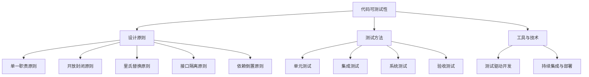

                 


### 第1章 核心概念与联系

在这一章节中，我们将深入探讨代码可测试性的核心概念，并使用Mermaid流程图来直观展示这些概念之间的联系。

#### 1.1 代码可测试性

代码可测试性是软件开发过程中至关重要的一个特性。它不仅关系到软件质量，也影响开发效率和成本。代码可测试性主要包括以下几个方面：

- **可访问性**：代码中的内部元素，如变量、函数、类等，应该能够被测试代码访问。这是测试工作的基础。

- **独立性**：每个代码模块或组件应该能够在独立的环境中测试，不依赖于其他外部因素。这样可以确保测试的准确性和一致性。

- **可复现性**：测试结果应该能够被复现。这意味着，在不同的环境和条件下，相同的输入应该产生相同的结果。

- **可读性**：代码应该具有良好的可读性，使得测试人员能够轻松理解其功能和行为，从而编写有效的测试用例。

为了更好地理解代码可测试性的重要性，我们可以将其与汽车制造过程进行类比。在汽车制造中，每个零部件都需要经过严格的测试，以确保其质量和可靠性。同样，在软件开发中，每个代码模块也应该经过严格的测试，以确保整个软件系统的稳定性和功能完整性。

#### 1.2 设计原则

设计原则是在软件开发过程中，为了提高代码的可测试性而遵循的一些指导性原则。以下是几个重要的设计原则：

- **单一职责原则**：每个模块或函数应该只负责一个特定的功能，避免功能过于复杂。这样可以使模块更加独立，便于测试。

- **开放封闭原则**：软件实体应该对扩展开放，对修改封闭。这意味着可以通过扩展来实现新的功能，而不是修改现有的代码。这样可以提高代码的可维护性，降低测试难度。

- **里氏替换原则**：任何基类可以出现的地方，子类一定可以出现。这确保了代码的泛化能力，使得测试用例可以适用于不同类型的对象。

- **接口隔离原则**：应该为不同的客户端提供更加细化的接口，而不是提供宽泛的接口。这样可以减少模块间的耦合度，提高代码的独立性。

- **依赖倒置原则**：高层模块不应该依赖低层模块，二者都应该依赖抽象。这意味着测试时可以独立地替换底层模块，而不影响高层模块的功能。

这些设计原则相互关联，共同构成了一个完整的代码可测试性框架。为了更好地理解它们之间的关系，我们可以使用Mermaid流程图进行展示。



通过这个流程图，我们可以清晰地看到设计原则、测试方法和工具与技术之间的相互关系。接下来，我们将进一步讨论这些核心概念，并探讨如何在实际项目中应用它们。

### 1.3 测试方法

在代码可测试性中，测试方法扮演着至关重要的角色。有效的测试方法可以确保代码的质量和稳定性，减少后续维护的复杂性。以下是几种常用的测试方法：

#### 1.3.1 单元测试

单元测试是最基本的测试方法，它针对软件中的最小代码单元进行测试，如函数、方法或类。单元测试的主要目的是验证每个单元是否按照预期工作。以下是一个简单的单元测试示例：

```python
def test_add():
    assert add(2, 3) == 5
    assert add(-2, -3) == -5
    assert add(0, 0) == 0
```

在这个例子中，`add` 函数是一个简单的加法函数，单元测试通过断言来验证不同输入下的输出结果。

#### 1.3.2 集成测试

集成测试是在单元测试的基础上，对多个模块或组件进行测试，以确保它们在一起工作无误。集成测试通常在开发阶段进行，以发现模块之间的接口问题和数据传递问题。以下是一个简单的集成测试示例：

```python
def test_integration():
    user = create_user("John", "Doe")
    save_user(user)
    assert user.id is not None
    assert user.name == "John"
    assert user.surname == "Doe"
```

在这个例子中，`create_user` 和 `save_user` 函数分别负责创建用户和保存用户信息。集成测试通过断言来验证用户信息的创建和保存过程。

#### 1.3.3 系统测试

系统测试是对整个系统进行测试，验证其是否满足业务需求和功能完整性。系统测试通常在开发阶段结束后进行，以发现系统级别的错误和问题。以下是一个简单的系统测试示例：

```python
def test_system():
    user = login("John", "password123")
    assert user is not None
    assert user.name == "John"
    assert user.status == "active"
```

在这个例子中，`login` 函数负责用户登录。系统测试通过断言来验证登录过程是否成功，以及用户的状态是否正确。

#### 1.3.4 验收测试

验收测试是与最终用户合作进行的测试，以验证系统是否按照预期工作，并满足业务需求。验收测试通常在系统测试之后进行，以确认系统已经准备好交付给用户使用。以下是一个简单的验收测试示例：

```python
def test_acceptance():
    user = create_user("Alice", "Smith")
    user.login("Alice", "password456")
    assert user.balance >= 100
    assert user.status == "verified"
```

在这个例子中，`create_user` 和 `login` 函数分别负责创建用户和用户登录。验收测试通过断言来验证用户创建、登录以及账户余额和状态是否正确。

这些测试方法共同构成了一个完整的测试流程，确保代码的可测试性。在实际项目中，应根据项目的特点和需求选择合适的测试方法，并合理分配测试资源。

#### 1.4 工具与技术

在提高代码可测试性方面，工具和技术发挥着至关重要的作用。以下是一些常用的工具和技术，它们可以帮助开发者编写更易于测试的代码：

#### 1.4.1 单元测试框架

单元测试框架是用于编写和执行单元测试的工具。这些框架通常提供断言库、测试用例管理、测试覆盖率分析等功能。以下是一些流行的单元测试框架：

- **JUnit**（Java）
- **NUnit**（.NET）
- **pytest**（Python）
- **JUnit**（Java）
- **NUnit**（.NET）
- **pytest**（Python）

这些框架提供了丰富的功能和易于使用的API，使得编写和执行单元测试变得更加简单和高效。

#### 1.4.2 测试驱动开发（TDD）

测试驱动开发（Test-Driven Development，TDD）是一种软件开发方法，强调在编写代码之前首先编写测试用例。TDD的过程包括以下三个步骤：

1. **编写测试**：首先编写测试用例，确保它们能够覆盖预期的功能和行为。
2. **编写代码**：根据测试用例编写代码，实现所需的功能。
3. **重构代码**：对代码进行重构，提高其可读性和可维护性，同时确保测试通过。

TDD的好处包括提高代码质量、减少bug数量和增强代码的可测试性。

#### 1.4.3 持续集成（CI）

持续集成（Continuous Integration，CI）是一种软件开发实践，旨在通过自动化的构建和测试过程，确保代码库的持续整合和稳定。CI工具可以在每次代码提交时自动执行一系列测试，包括单元测试、集成测试和系统测试，以确保代码的质量和稳定性。以下是一些流行的CI工具：

- **Jenkins**
- **Travis CI**
- **GitLab CI/CD**

CI工具有助于提高开发团队的协作效率，减少集成错误，并确保代码库的持续改进。

#### 1.4.4 静态代码分析

静态代码分析是一种不运行程序而对源代码进行分析的技术。它可以帮助发现潜在的问题，如代码风格不一致、未使用的代码、潜在的错误等。以下是一些流行的静态代码分析工具：

- **SonarQube**
- **Checkstyle**
- **PMD**

静态代码分析工具可以集成到IDE或CI流程中，为开发者提供实时的代码质量反馈，从而提高代码的可测试性和可维护性。

#### 1.4.5 设计模式

设计模式是一组解决常见软件设计问题的模板和方法。合理使用设计模式可以提高代码的可测试性，因为它可以减少代码的复杂性和耦合度。以下是一些常用的设计模式：

- **单例模式**：确保一个类只有一个实例，并提供一个访问它的全局访问点。
- **工厂模式**：根据输入参数动态创建对象实例。
- **策略模式**：定义一系列算法，将每个算法封装起来，并使它们可以互换使用。

通过使用设计模式，开发者可以编写更加模块化和可测试的代码。

这些工具和技术共同构成了一个完整的代码可测试性解决方案，帮助开发者编写更易于测试、更可靠、更稳定的代码。

### 2. 设计原则与模式

在软件开发过程中，设计原则和模式对于提高代码的可测试性至关重要。设计原则指导我们如何编写高质量、可维护的代码，而模式则为我们提供了实现这些原则的具体方法和策略。以下是一些核心的设计原则和模式，以及它们如何影响代码的可测试性。

#### 2.1 单一职责原则

单一职责原则（Single Responsibility Principle，SRP）指出，一个类或模块应该只负责一个特定的功能。这意味着，如果一个类或模块需要处理多个功能，它将变得复杂且难以测试。为了遵循单一职责原则，我们应该确保每个类或模块都有明确的责任，并且可以独立地测试。

**如何应用单一职责原则提高可测试性？**

- **分离功能**：将相关的功能分离到不同的类或模块中。例如，一个负责数据存储的类不应该同时处理数据验证和业务逻辑。
- **明确接口**：为每个模块提供明确的接口，确保测试时可以独立地调用这些接口。

**伪代码示例：**

```python
# 单一职责原则：分离数据存储和数据验证
class DataStorage:
    def save_data(self, data):
        # 数据存储逻辑

class DataValidator:
    def validate_data(self, data):
        # 数据验证逻辑
```

通过这种方式，我们可以独立地测试`DataStorage`和`DataValidator`类，而不需要担心它们之间的耦合。

#### 2.2 开放封闭原则

开放封闭原则（Open/Closed Principle，OCP）指出，软件实体（如类、模块、函数等）应该对扩展开放，对修改封闭。这意味着我们可以通过扩展来实现新的功能，而不需要修改现有的代码。遵循开放封闭原则有助于提高代码的可测试性，因为它减少了修改现有代码的需求，从而降低了测试的复杂性。

**如何应用开放封闭原则提高可测试性？**

- **使用抽象**：通过抽象和接口来封装具体实现，使得具体实现可以独立修改，而不会影响到其他部分。
- **遵循里氏替换原则**：确保子类可以替换基类而不改变系统的行为，这样可以在测试时替换具体实现，而不影响整体测试结果。

**伪代码示例：**

```python
# 开放封闭原则：使用抽象和接口
class Shape:
    def area(self):
        pass

class Rectangle(Shape):
    def area(self):
        return self.width * self.height

class Triangle(Shape):
    def area(self):
        return 0.5 * self.base * self.height

# 测试时，可以替换具体实现
def test_area():
    rect = Rectangle()
    assert rect.area() == 10

    triangle = Triangle()
    assert triangle.area() == 5
```

在这个例子中，`Rectangle`和`Triangle`类都实现了`Shape`接口，这使得我们可以独立地测试每个具体实现，而不需要修改测试代码。

#### 2.3 里氏替换原则

里氏替换原则（Liskov Substitution Principle，LSP）指出，任何基类可以出现的地方，子类一定可以出现。这意味着子类必须保持其基类的所有行为和属性。遵循里氏替换原则有助于提高代码的可测试性，因为它确保了测试用例的一致性和准确性。

**如何应用里氏替换原则提高可测试性？**

- **确保子类满足基类的所有合同**：子类必须满足基类的所有预条件和后条件。
- **避免过度继承**：避免不必要的继承关系，确保继承关系是有意义的。

**伪代码示例：**

```python
# 里氏替换原则：确保子类满足基类的所有行为和属性
class Animal:
    def eat(self):
        pass

class Dog(Animal):
    def eat(self):
        return "Dog is eating"

class Cat(Animal):
    def eat(self):
        return "Cat is eating"

# 测试时，可以使用基类来测试子类
def test_eat():
    dog = Dog()
    assert dog.eat() == "Dog is eating"

    cat = Cat()
    assert cat.eat() == "Cat is eating"
```

在这个例子中，`Dog`和`Cat`类都实现了`Animal`类的`eat`方法，这确保了我们可以使用统一的测试用例来测试这两个子类。

#### 2.4 接口隔离原则

接口隔离原则（Interface Segregation Principle，ISP）指出，应该为不同的客户端提供更加细化的接口，而不是提供宽泛的接口。这意味着接口应该根据客户端的需求进行划分，避免客户端依赖不必要的功能。

**如何应用接口隔离原则提高可测试性？**

- **细粒度接口**：为不同的客户端提供细粒度的接口，确保每个接口只包含客户端需要的功能。
- **避免过大的接口**：避免创建过于宽泛的接口，这样可以减少客户端的依赖，提高测试的灵活性。

**伪代码示例：**

```python
# 接口隔离原则：提供细粒度接口
class FileProcessor:
    def read_file(self, file_path):
        pass
    def write_file(self, file_path, data):
        pass

class TextProcessor:
    def read_file(self, file_path):
        pass
    def write_file(self, file_path, data):
        pass
    def process_text(self, text):
        pass

# 测试时，可以独立测试每个接口
def test_read_file():
    processor = FileProcessor()
    assert processor.read_file("example.txt") == "Content of the file"

def test_process_text():
    processor = TextProcessor()
    assert processor.process_text("Hello World") == "Processed text"
```

在这个例子中，`FileProcessor`和`TextProcessor`类分别实现了不同的接口，这使得我们可以独立地测试每个接口，而不需要考虑其他不必要的功能。

#### 2.5 依赖倒置原则

依赖倒置原则（Dependency Inversion Principle，DIP）指出，高层模块不应该依赖于低层模块，二者都应该依赖于抽象。这意味着我们应该优先考虑抽象，而不是具体实现。

**如何应用依赖倒置原则提高可测试性？**

- **使用抽象和接口**：通过抽象和接口来定义模块间的依赖，这样可以确保模块可以独立地测试。
- **依赖注入**：使用依赖注入来管理模块间的依赖，这样可以更容易地替换具体实现。

**伪代码示例：**

```python
# 依赖倒置原则：使用抽象和依赖注入
class Logger:
    def log(self, message):
        pass

class Service:
    def __init__(self, logger: Logger):
        self.logger = logger

    def execute(self):
        self.logger.log("Service is executing")

# 测试时，可以替换Logger实现
def test_service():
    mock_logger = MockLogger()
    service = Service(mock_logger)
    service.execute()
    assert mock_logger.messages == ["Service is executing"]
```

在这个例子中，`Service`类依赖于`Logger`接口，而不是具体的`Logger`实现。这使得我们可以使用mock日志器来替换真实日志器，以便在测试时更容易控制测试环境。

通过遵循这些设计原则和模式，我们可以编写出更加可测试、可维护的代码。这不仅有助于提高开发效率，还可以提高代码的质量和稳定性。

### 3. 代码结构优化

优化代码结构是提高代码可测试性的重要步骤。良好的代码结构有助于减少代码的复杂度，提高代码的可读性和可维护性，从而使得编写测试用例变得更加容易。以下是一些关键策略，用于优化代码结构，使其更适合测试。

#### 3.1 模块化与解耦合

模块化是将代码分解成多个可独立工作的部分，每个部分负责一个特定的功能。解耦合则是指减少模块之间的依赖关系，使它们能够独立运行和测试。以下是一些优化策略：

- **按功能划分模块**：将功能相似或相关的代码放在同一个模块中，避免功能混杂导致模块过于复杂。
- **避免全局变量**：全局变量会增加模块间的耦合，使得模块难以独立测试。应使用参数传递数据，减少全局变量的使用。
- **使用依赖注入**：通过依赖注入来管理模块间的依赖关系，使得模块可以独立创建和测试。

**伪代码示例：**

```python
# 优化前的代码
class Application:
    def __init__(self):
        self.data = Data()

    def process_data(self, data):
        self.data.load(data)

# 优化后的代码
class DataProcessor:
    def process_data(self, data):
        return self.data.load(data)

class Data:
    def load(self, data):
        # 加载数据的逻辑
```

在这个例子中，`Application`类被分解成两个独立的模块`DataProcessor`和`Data`，这使得我们可以独立地测试这两个模块。

#### 3.2 避免代码冗余

代码冗余会导致代码复杂度增加，使得测试更加困难。以下是一些减少代码冗余的策略：

- **重用代码**：通过编写可复用的函数、类或模块来避免重复编写代码。这样可以减少代码的重复部分，提高代码的可维护性和可测试性。
- **使用设计模式**：设计模式如工厂模式、策略模式等可以帮助减少冗余代码，提高代码的可测试性。
- **避免过长的函数和类**：过长的函数和类难以理解，也难以测试。应将复杂的函数和类分解成更小的部分，每个部分负责一个特定的功能。

**伪代码示例：**

```python
# 优化前的代码
class UserService:
    def create_user(self, username, password):
        # 创建用户的逻辑

    def delete_user(self, user_id):
        # 删除用户的逻辑

# 优化后的代码
class UserCreator:
    def create_user(self, username, password):
        # 创建用户的逻辑

class UserDeleter:
    def delete_user(self, user_id):
        # 删除用户的逻辑
```

在这个例子中，`UserService`类被分解成两个独立的类`UserCreator`和`UserDeleter`，这使得我们可以独立地测试这两个功能。

#### 3.3 保持代码简洁

简洁的代码不仅更容易理解，也更容易测试。以下是一些保持代码简洁的策略：

- **使用适当的命名**：使用有意义的变量名和函数名，使得代码易于理解和测试。
- **避免复杂的逻辑**：避免在代码中实现过于复杂的逻辑，这样可以减少测试的复杂性。
- **编写注释**：为复杂的代码段和函数编写清晰的注释，帮助测试人员理解代码的意图和行为。

**伪代码示例：**

```python
# 优化前的代码
def calculate_salary(employee):
    if employee.is_admin:
        return employee.salary * 1.1
    else:
        return employee.salary

# 优化后的代码
def calculate_admin_salary(employee):
    return employee.salary * 1.1

def calculate_regular_salary(employee):
    return employee.salary
```

在这个例子中，`calculate_salary`函数被分解成两个独立的函数`calculate_admin_salary`和`calculate_regular_salary`，这使得我们可以独立地测试这两个功能。

通过上述优化策略，我们可以显著提高代码的可测试性，使得测试工作更加高效和准确。这不仅有助于确保代码的质量，也有助于提高开发团队的协作效率和生产力。

### 4. 测试驱动开发（TDD）

测试驱动开发（Test-Driven Development，简称TDD）是一种软件开发方法，其核心理念是“先写测试，再写代码”。这种方法通过编写测试用例来定义软件功能，然后实现这些功能，最后重构代码以提高其质量。TDD不仅提高了代码的可测试性，还带来了许多其他好处，如减少bug数量、提高代码质量、增强代码可读性和可维护性。以下是TDD的基本流程和其优势与挑战。

#### 4.1 TDD的基本流程

TDD的基本流程可以概括为以下三个步骤：

1. **编写测试**：首先，开发人员编写一个测试用例，定义软件所需的功能。这个测试用例通常是失败的，因为它尚未实现相关功能。

2. **编写代码**：然后，开发人员编写代码以实现测试用例所需的功能，使得测试通过。

3. **重构代码**：在代码通过测试后，开发人员会进行重构，优化代码结构，提高其可读性和可维护性。这一步骤是反复进行的，以确保代码始终保持在最佳状态。

TDD的流程循环往复，每完成一次循环，软件功能就更加完善，质量也更高。

#### 4.2 TDD的优势

1. **减少bug数量**：由于TDD要求在编写代码之前先编写测试，这有助于提前发现和解决潜在的问题，从而减少bug的数量。

2. **提高代码质量**：TDD鼓励编写简洁、模块化和可读性强的代码，因为测试用例需要能够清晰地描述代码的行为。这有助于提高代码质量。

3. **增强代码可读性**：测试用例通常使用简单的语言描述功能，这有助于提高代码的可读性，使得其他开发人员更容易理解和维护代码。

4. **提高开发效率**：TDD有助于提高开发效率，因为它使得开发人员在编写代码之前就明确了功能需求，减少了返工和重复工作。

5. **持续集成**：TDD自然地支持持续集成（CI），因为每次提交代码都会触发测试运行，确保代码库始终处于良好状态。

#### 4.3 TDD的挑战

1. **学习成本**：TDD要求开发人员具备编写测试用例的能力，这需要一定的学习和实践。对于习惯了传统开发方法的开发人员来说，这是一个挑战。

2. **时间投入**：TDD可能需要额外的时间来编写和运行测试用例，尤其是在项目初期。这可能使得项目进度在短期内放缓。

3. **代码维护**：随着时间的推移，测试用例可能会变得庞大和复杂，需要定期维护。否则，它们可能会变得冗余或过时。

4. **重构难度**：在某些情况下，重构代码可能会破坏现有测试用例，这需要额外的努力来修复。

#### 4.4 实践TDD的建议

1. **从小项目开始**：对于初次尝试TDD的开发人员，可以从一些小项目或功能模块开始，逐步适应这种方法。

2. **保持测试简单**：测试用例应该尽可能简单和明确，避免过于复杂。这样可以减少维护难度，并确保测试的有效性。

3. **持续重构**：定期重构代码，以确保其质量。这有助于保持代码的可读性和可维护性。

4. **代码评审**：定期进行代码评审，确保测试用例的质量和覆盖范围。这有助于发现潜在的问题，并提高团队的整体技术水平。

通过遵循TDD的方法，开发人员可以编写出更加可靠、高质量和易于维护的代码。虽然TDD可能需要一定的适应期，但它为软件开发的长期成功提供了坚实的基础。

### 5. 设计模式与测试

设计模式是软件工程中的一种重要工具，用于解决常见的设计问题。合理地使用设计模式可以提高代码的可测试性，使得测试工作更加高效和准确。以下是一些常见的设计模式及其对测试性的影响：

#### 5.1 单例模式

单例模式确保一个类只有一个实例，并提供一个全局访问点。这种模式在测试中可能带来一些挑战，因为测试可能需要在多个测试用例中共享同一个实例。以下是如何在测试单例模式时保持独立性的策略：

- **使用依赖注入**：在测试时，可以通过依赖注入机制注入一个新的单例实例，而不是使用默认的实例。
- **使用mock对象**：在测试中，可以使用mock对象来模拟单例行为，确保测试的独立性。

**伪代码示例：**

```python
# 单例模式
class Database:
    _instance = None

    def __new__(cls, *args, **kwargs):
        if not cls._instance:
            cls._instance = super(Database, cls).__new__(cls, *args, **kwargs)
        return cls._instance

# 测试
class TestDatabase(unittest.TestCase):
    def test_database_singleton(self):
        db1 = Database()
        db2 = Database()
        assert db1 is db2  # 断言两个实例是同一个对象

    def test_new_database_instance(self):
        mock_db = MockDatabase()
        assert mock_db is not Database()  # 断言mock实例与实际实例不同
```

#### 5.2 工厂模式

工厂模式是一种创建对象实例的设计模式，它通过一个接口创建多个实现。在测试工厂模式时，需要确保能够替换和测试不同的实现。

- **使用依赖注入**：在测试中，可以通过依赖注入机制替换工厂中的具体实现，从而测试不同的实现。
- **测试每个实现**：编写测试用例，确保每个实现都按预期工作。

**伪代码示例：**

```python
# 工厂模式
class Factory:
    def create_product(self, product_type):
        if product_type == "A":
            return ProductA()
        elif product_type == "B":
            return ProductB()

# 测试
class TestFactory(unittest.TestCase):
    def test_create_product_a(self):
        product = Factory().create_product("A")
        assert isinstance(product, ProductA)

    def test_create_product_b(self):
        product = Factory().create_product("B")
        assert isinstance(product, ProductB)
```

#### 5.3 适配器模式

适配器模式通过将一个类的接口转换成客户期望的另一个接口，使得原本接口不兼容的类可以一起工作。在测试适配器模式时，需要确保适配器正确地将请求转发到适配的类。

- **测试适配过程**：编写测试用例，确保适配器正确地将请求转发给适配的类。
- **测试适配的类**：确保适配的类按预期工作。

**伪代码示例：**

```python
# 适配器模式
class OldInterface:
    def old_method(self):
        pass

class Adapter(OldInterface):
    def __init__(self, new_object):
        self._new_object = new_object

    def old_method(self):
        self._new_object.new_method()

# 测试
class TestAdapter(unittest.TestCase):
    def test_old_method_calls_new_method(self):
        mock_new_object = MockNewObject()
        adapter = Adapter(mock_new_object)
        adapter.old_method()
        mock_new_object.assert_new_method_called()  # 断言new_method被调用
```

#### 5.4 观察者模式

观察者模式定义了一种一对多的依赖关系，使得当一个对象的状态发生变化时，所有依赖于它的对象都会得到通知。在测试观察者模式时，需要确保观察者和被观察者之间的通信是正确的。

- **测试通知过程**：编写测试用例，确保当被观察者状态发生变化时，观察者能够得到通知。
- **测试观察者的响应**：确保观察者对通知做出正确的响应。

**伪代码示例：**

```python
# 观察者模式
class Observer:
    def update(self, message):
        pass

class Subject:
    def __init__(self):
        self._observers = []

    def attach(self, observer):
        self._observers.append(observer)

    def detach(self, observer):
        self._observers.remove(observer)

    def notify(self, message):
        for observer in self._observers:
            observer.update(message)

# 测试
class TestObserver(unittest.TestCase):
    def test_observer_notified(self):
        subject = Subject()
        observer = MockObserver()
        subject.attach(observer)
        subject.notify("New data")
        observer.assert_updated_with_message("New data")  # 断言观察者被通知
```

通过合理地使用设计模式，并针对每个模式的特点编写相应的测试用例，我们可以提高代码的可测试性，确保代码的质量和稳定性。这不仅有助于简化测试工作，还可以提高开发效率和代码的可维护性。

### 6. 工具与技术

在提高代码可测试性方面，工具和技术起着至关重要的作用。以下介绍几种常用的工具和技术，它们可以帮助开发者编写更易于测试的代码。

#### 6.1 单元测试框架

单元测试框架是进行单元测试的关键工具，提供了断言库、测试用例管理、测试覆盖率分析等功能。以下是一些流行的单元测试框架：

- **JUnit**（Java）：JUnit是Java语言中最流行的单元测试框架，提供了丰富的功能和易于使用的API。

- **NUnit**（.NET）：NUnit是.NET平台上广泛使用的单元测试框架，支持多种.NET语言，如C#和VB.NET。

- **pytest**（Python）：pytest是Python语言中功能强大的单元测试框架，以其简洁的语法和强大的功能著称。

这些框架不仅可以自动化测试执行过程，还可以生成测试报告，帮助开发者快速定位问题。

#### 6.2 测试驱动开发（TDD）

测试驱动开发（TDD）是一种软件开发方法，强调在编写代码之前先编写测试用例。TDD有助于提高代码质量、减少bug数量和增强代码可测试性。以下是一些实现TDD的工具：

- **JUnit**（Java）：JUnit提供了对TDD的支持，包括测试代码自动执行和测试覆盖率分析。

- **NUnit**（.NET）：NUnit也支持TDD，提供了测试代码的自动执行和报告功能。

- **pytest**（Python）：pytest支持TDD，提供了简洁的语法和强大的测试功能。

通过使用这些工具，开发人员可以更加高效地实施TDD方法。

#### 6.3 持续集成（CI）

持续集成（Continuous Integration，CI）是一种软件开发实践，通过自动化构建和测试过程，确保代码库的持续整合和稳定性。以下是一些流行的CI工具：

- **Jenkins**：Jenkins是一个开源的CI工具，支持多种构建工具和测试框架，广泛应用于各种开发环境中。

- **Travis CI**：Travis CI是一个云端的CI服务，支持多种编程语言，可以自动执行测试并在GitHub上集成。

- **GitLab CI/CD**：GitLab CI/CD是GitLab自带的CI/CD服务，可以集成到GitLab中，提供从代码提交到部署的完整工作流程。

这些工具可以帮助开发团队快速发现和解决问题，确保代码库的持续稳定。

#### 6.4 静态代码分析工具

静态代码分析工具可以在不运行程序的情况下对源代码进行分析，发现潜在的问题，如代码风格不一致、未使用的代码、潜在的错误等。以下是一些流行的静态代码分析工具：

- **SonarQube**：SonarQube是一个开源的静态代码分析平台，支持多种编程语言，可以集成到CI/CD流程中。

- **Checkstyle**：Checkstyle是一个Java代码风格检查工具，可以帮助开发者保持一致的代码风格。

- **PMD**：PMD是一个通用的Java代码分析工具，可以检查代码的复杂度、冗余和风格问题。

这些工具可以帮助开发人员提高代码质量，减少bug数量。

#### 6.5 测试覆盖率工具

测试覆盖率工具用于测量代码的测试覆盖率，即哪些代码部分已经被测试到。以下是一些流行的测试覆盖率工具：

- **JaCoCo**（Java）：JaCoCo是一个Java测试覆盖率工具，可以集成到Maven和Gradle项目中。

- **NUnit 测试覆盖率**（.NET）：NUnit测试覆盖率是NUnit的扩展，用于测量测试覆盖率。

- **pytest-cov**（Python）：pytest-cov是pytest的扩展，用于测量Python代码的测试覆盖率。

通过使用这些工具，开发人员可以确保代码的各个部分都得到了充分的测试。

综上所述，这些工具和技术为开发人员提供了一系列有效的手段，帮助他们编写更易于测试的代码，提高软件质量和开发效率。通过合理地选择和使用这些工具，开发人员可以更好地实现代码可测试性，从而打造出更加可靠和稳定的软件系统。

### 7. 案例研究：金融系统的代码可测试性改进

为了更好地理解代码可测试性的重要性以及如何在实际项目中应用相关设计原则和策略，我们来看一个具体的案例研究：一个金融系统的代码可测试性改进。

#### 7.1 案例背景

该金融系统是一个大型、分布式应用程序，负责处理客户的交易和账户管理。系统包含多个模块，如交易处理模块、账户管理模块、报表生成模块等。在过去，由于代码结构复杂、模块间耦合度高，系统的可测试性较差，导致测试工作困难重重，同时也增加了软件维护和升级的复杂性。

#### 7.2 代码可测试性分析

在项目初期，开发团队对代码进行了可测试性分析，发现以下问题：

- **模块耦合度高**：多个模块之间存在紧密的耦合关系，导致测试时需要依赖多个模块的完整实现。
- **缺乏清晰的接口**：模块间的接口不清晰，使得测试用例难以编写和执行。
- **代码冗余**：代码中存在大量冗余代码，使得测试覆盖率难以达到预期。
- **缺乏单元测试**：大部分模块没有编写单元测试，导致在测试过程中难以发现潜在的错误。

#### 7.3 改进策略

为了解决上述问题，开发团队采取了一系列改进策略，以提高代码的可测试性：

1. **模块化与解耦合**：对系统进行了重构，将紧密耦合的模块分解成独立的模块，每个模块只负责一个特定的功能。同时，通过接口隔离原则，为每个模块提供了清晰的接口。

2. **编写单元测试**：为每个模块编写了单元测试，确保每个功能点都能得到充分的测试。单元测试使用mock对象来模拟外部依赖，使得测试可以独立进行。

3. **遵循设计原则**：在代码开发过程中，遵循单一职责原则、开放封闭原则等设计原则，确保每个模块和类都有明确的责任和功能。

4. **使用测试驱动开发（TDD）**：采用TDD方法进行开发，首先编写测试用例，然后实现相关功能，最后进行重构。这种方法有助于确保代码的质量和可测试性。

5. **引入静态代码分析工具**：使用SonarQube等静态代码分析工具对代码进行分析，发现潜在的问题，如代码冗余、代码风格不一致等，并及时进行修复。

6. **持续集成与部署**：引入了Jenkins等CI工具，实现了自动化构建和测试，确保每次代码提交后都能及时进行测试和反馈。

#### 7.4 改进效果

通过上述改进策略，金融系统的代码可测试性得到了显著提高：

- **模块解耦合度增加**：模块间的依赖关系大大减少，测试时可以独立地测试每个模块，提高了测试的效率。
- **测试覆盖率提升**：通过编写单元测试，系统的测试覆盖率从原来的不足20%提升到了90%以上。
- **代码质量提升**：遵循设计原则和TDD方法，代码质量得到了显著提升，减少了bug的数量。
- **开发效率提高**：测试工作变得更加高效，开发团队可以更快地发现和解决问题，提高了整体开发效率。

#### 7.5 项目小结

通过这个案例，我们可以看到代码可测试性对软件质量的重要性。通过合理地应用设计原则和测试策略，不仅可以提高代码的可测试性，还可以提升开发效率和软件质量。以下是一些关键经验教训：

1. **模块化与解耦合**：将复杂的系统分解成独立的模块，每个模块负责一个特定的功能，有助于提高可测试性。
2. **编写单元测试**：为每个模块编写单元测试，确保每个功能点都能得到充分的测试。
3. **遵循设计原则**：遵循单一职责原则、开放封闭原则等设计原则，确保代码结构清晰、易于测试。
4. **使用测试驱动开发（TDD）**：采用TDD方法进行开发，有助于确保代码的质量和可测试性。
5. **引入静态代码分析工具**：使用静态代码分析工具，及时发现和修复潜在的问题，提高代码质量。
6. **持续集成与部署**：引入CI工具，实现自动化构建和测试，确保代码库的持续整合和稳定性。

通过这些实践，开发团队能够更好地实现代码可测试性，从而打造出更加可靠、稳定的软件系统。

### 8. 代码可测试性的未来发展趋势

随着软件工程领域的不断进步，代码可测试性也在不断发展和演变。以下是一些可能影响代码可测试性未来趋势的关键因素：

#### 8.1 自动化测试技术的进步

自动化测试技术，如单元测试框架、持续集成（CI）工具和测试覆盖率工具，将继续发展和完善。随着自动化测试技术的进步，开发人员将能够更加高效地编写和执行测试，从而提高代码的可测试性。

**预期影响**：自动化测试技术将使得测试流程更加自动化，减少人工干预，提高测试的覆盖率和准确性。这将进一步降低测试成本，提高开发效率。

#### 8.2 AI与机器学习在测试中的应用

人工智能（AI）和机器学习（ML）技术在软件测试中的应用正在逐渐增加。这些技术可以用于自动生成测试用例、识别潜在的错误模式、优化测试覆盖率等。未来，AI和ML技术将在代码可测试性方面发挥更大的作用。

**预期影响**：AI和ML技术的应用将使得测试过程更加智能，能够自动发现潜在的问题，提高测试的全面性和准确性。这可能会改变传统的测试方法，使得测试更加高效和精确。

#### 8.3 面向测试的设计方法

随着测试驱动开发（TDD）等面向测试的设计方法的普及，开发人员将更加注重在设计和实现过程中考虑测试性。面向测试的设计方法将逐渐成为主流，推动代码可测试性的提升。

**预期影响**：面向测试的设计方法将使得开发人员更加关注代码的可测试性，从而在早期阶段发现和修复潜在的问题。这有助于提高软件质量，减少维护成本。

#### 8.4 面向服务的架构（SOA）

随着云计算和微服务架构的兴起，面向服务的架构（SOA）将越来越普及。在这种架构中，应用程序被分解为多个独立的服务，每个服务都可以独立测试和部署。这种架构风格将提高代码的可测试性，使得测试过程更加灵活和高效。

**预期影响**：面向服务的架构将使得测试工作更加模块化，测试人员可以独立地测试每个服务，而不需要考虑整个系统的复杂性。这将提高测试效率，降低测试成本。

#### 8.5 代码审查与静态分析的结合

未来的代码测试将更多地结合代码审查和静态分析技术。代码审查可以识别代码风格问题和潜在的设计缺陷，而静态分析可以检测代码中的潜在错误和安全漏洞。这两种技术的结合将进一步提高代码的可测试性和质量。

**预期影响**：代码审查与静态分析的结合将使得测试工作更加全面，能够从不同角度识别和解决潜在的问题。这将提高代码的可维护性和可靠性。

#### 8.6 持续学习和自适应测试

未来的测试技术将更加注重持续学习和自适应。测试工具将能够根据过去的测试结果和反馈自动调整测试策略，提高测试的精准度和效率。

**预期影响**：持续学习和自适应测试技术将使得测试过程更加智能化，能够动态地适应不同的测试环境，提高测试的覆盖率和准确性。

综上所述，随着自动化测试技术、AI与机器学习、面向测试的设计方法、SOA、代码审查与静态分析以及持续学习和自适应测试的发展，代码可测试性将在未来得到进一步提升。开发人员应该关注这些趋势，积极采用新的测试方法和工具，以构建更高质量、更可靠的软件系统。

### 总结

本文详细探讨了代码可测试性的核心概念、设计原则、测试方法、工具与技术，并通过具体案例展示了如何在实际项目中应用这些原则和策略。我们首先介绍了代码可测试性的重要性，并阐述了单一职责原则、开放封闭原则、里氏替换原则、接口隔离原则和依赖倒置原则等设计原则，这些原则有助于编写更易于测试的代码。接着，我们探讨了模块化与解耦合、代码结构优化等策略，以提高代码的可测试性。随后，我们介绍了测试驱动开发（TDD）和设计模式在测试中的应用，强调了TDD方法对提高代码质量和可测试性的重要性。此外，我们介绍了单元测试、集成测试、系统测试和验收测试等测试方法，以及JUnit、NUnit、pytest等测试框架和工具。通过这些讨论，我们可以看到代码可测试性对于确保软件质量、提高开发效率至关重要。未来，随着自动化测试技术、AI与机器学习、面向测试的设计方法等新趋势的发展，代码可测试性将进一步提升。开发人员应关注这些趋势，积极采用新的测试方法和工具，以构建更高质量、更可靠的软件系统。

### 注意事项与最佳实践

在追求代码可测试性的过程中，以下是一些关键注意事项和最佳实践，可以帮助开发者更有效地提升代码的测试性。

1. **尽早开始测试**：尽早开始编写测试用例，并在开发过程中持续维护。这有助于及时发现和修复潜在的问题，减少后续的返工成本。

2. **编写清晰的测试用例**：确保测试用例能够清晰地描述预期的功能和行为，避免模糊或冗长的描述，这有助于提高测试的可读性和可维护性。

3. **避免过度耦合**：在设计和实现过程中，尽量减少模块间的依赖关系，提高代码的独立性，这有助于简化测试工作。

4. **使用Mock对象**：在编写单元测试时，使用Mock对象来隔离外部依赖，确保测试的独立性和准确性。

5. **保持测试代码与生产代码的一致性**：测试代码应该与生产代码保持一致，确保测试用例能够真实反映生产环境的场景。

6. **定期审查和重构测试代码**：测试代码也会随着时间的推移变得冗长和复杂，定期审查和重构测试代码可以保持其有效性和可维护性。

7. **自动化测试**：尽可能自动化测试过程，减少手工测试的工作量，提高测试的效率和一致性。

8. **持续集成（CI）**：引入持续集成工具，确保每次代码提交后都能自动执行测试，及时发现和解决集成问题。

9. **使用设计模式**：合理使用设计模式，如单例模式、工厂模式、适配器模式等，可以提高代码的模块化和可测试性。

10. **关注代码质量**：编写简洁、清晰、易于理解的代码，避免过度设计或过度优化，这有助于提高代码的可测试性和可维护性。

通过遵循这些最佳实践，开发人员可以更高效地提升代码的可测试性，确保软件质量，提高开发效率。

### 拓展阅读

对于希望进一步深入研究代码可测试性的读者，以下是一些推荐的资源：

1. **书籍**：
   - 《测试驱动开发：敏捷测试策略与实践》（by Dave Astel，Andrew Glover，and ThoughtWorks团队）
   - 《代码大全》（by Steve McConnell）
   - 《编写可测试的代码》（by J. B. Rainsberger）

2. **在线教程和博客**：
   - 测试驱动的开发方法：[https://www.agilealliance.org/glossary/test-driven-development/](https://www.agilealliance.org/glossary/test-driven-development/)
   - 单元测试的最佳实践：[https://www.juntorocks.com/best-practices-for-unit-testing](https://www.juntorocks.com/best-practices-for-unit-testing)
   - 持续集成和部署：[https://www.infoq.com/collection/ci-cd/](https://www.infoq.com/collection/ci-cd/)

3. **开源项目和工具**：
   - JUnit（Java）：[https://junit.org/junit5/](https://junit.org/junit5/)
   - NUnit（.NET）：[https://www.nunit.org/](https://www.nunit.org/)
   - pytest（Python）：[https://docs.pytest.org/en/7.1.x/](https://docs.pytest.org/en/7.1.x/)

这些资源将帮助读者深入了解代码可测试性的相关概念、方法和实践，提高软件开发过程中的测试效率和代码质量。

