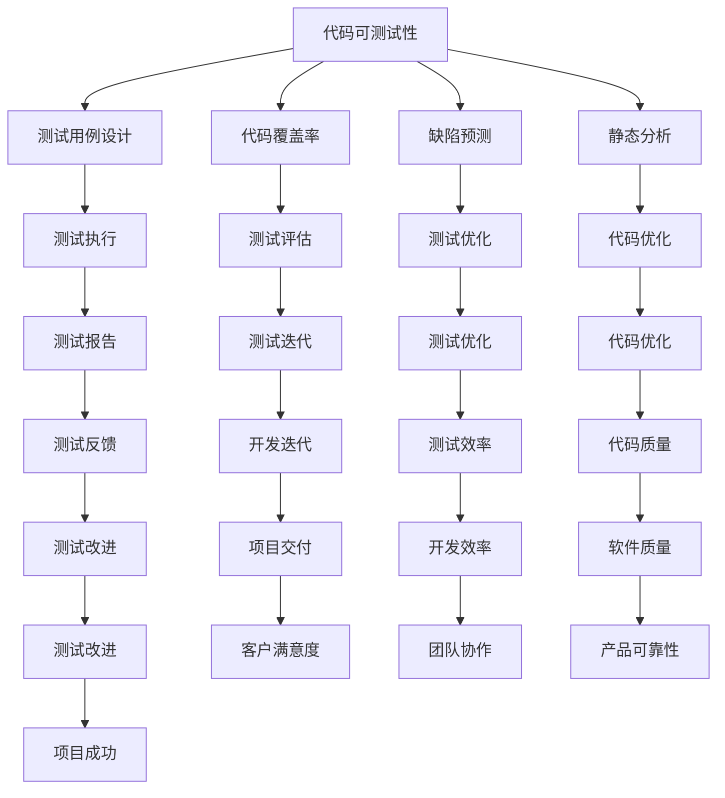

                 

### 背景介绍

在现代软件开发中，代码的可测试性已成为衡量软件质量和开发效率的重要指标之一。随着软件系统变得越来越复杂，模块化设计和代码重用成为普遍趋势，但这也给软件测试带来了前所未有的挑战。传统的测试方法往往需要大量的人工干预和时间成本，且测试覆盖率和缺陷发现率难以保证。因此，如何设计易于测试的软件，提高代码的可测试性，成为了当前软件开发领域的重要课题。

本文旨在深入探讨代码可测试性的概念、原理和实践方法，帮助开发者理解和掌握设计易于测试软件的技巧。通过系统地介绍代码可测试性的核心概念、测试用例设计、代码覆盖率分析、缺陷预测等主题，并结合实际项目案例，本文将全面展示如何提升代码的可测试性，从而提高软件质量和开发效率。

首先，我们将从代码可测试性的定义和重要性入手，详细解释其基本原理和方法。接着，本文将介绍如何设计有效的测试用例，包括功能测试用例、性能测试用例和面向对象测试用例。随后，我们将探讨代码覆盖率分析的核心算法原理，并介绍如何通过数学模型和公式来评估代码的可测试性。在此基础上，本文还将讨论缺陷预测与静态分析的方法和工具，帮助开发者提前识别和修复潜在缺陷。

接下来，本文将通过具体项目案例，展示如何在实践中提升代码的可测试性，并详细解读项目过程中的关键步骤和技巧。最后，我们将讨论自动化测试与持续集成、测试驱动开发（TDD）等最佳实践，以进一步优化软件开发流程。

通过本文的详细分析，读者将能够系统地掌握代码可测试性的知识体系，并能够在实际项目中应用这些方法，设计出更易于测试的软件，提高开发效率和软件质量。

---

以下是文章的摘要部分，用于概述本文的核心内容和主题思想：

---

**摘要：**

本文深入探讨了代码可测试性的核心概念、原理和实践方法，旨在帮助开发者理解和掌握提升软件可测试性的关键技巧。首先，文章从代码可测试性的定义和重要性出发，详细介绍了其基本原理和方法。接着，本文重点讲解了测试用例的设计方法，包括功能测试、性能测试和面向对象测试。此外，文章还详细阐述了代码覆盖率分析的核心算法原理，并借助数学模型和公式，对代码的可测试性进行了全面评估。通过缺陷预测与静态分析，开发者可以提前识别和修复潜在缺陷。最后，本文结合实际项目案例，展示了如何在实践中提升代码的可测试性，并通过自动化测试与持续集成、测试驱动开发等最佳实践，进一步优化软件开发流程。通过本文的阅读，开发者将能够系统地提升代码的可测试性，提高软件质量和开发效率。

---

**摘要部分内容概述：**

- **核心内容概述**：本文主要涵盖了代码可测试性的定义、原理、测试用例设计、代码覆盖率分析、缺陷预测与静态分析，以及实际项目中的应用和最佳实践。
- **主题思想**：文章的核心思想在于通过详细的理论讲解和实践案例，帮助开发者理解并应用提升代码可测试性的方法，从而提高软件质量和开发效率。

---

接下来，我们将进入正文部分，详细讨论代码可测试性的核心概念、原理和实践方法。正文将分为以下几个主要部分：

1. **代码可测试性的定义和重要性**
2. **测试用例设计方法**
3. **代码覆盖率分析**
4. **缺陷预测与静态分析**
5. **项目实战**
6. **最佳实践与总结**

### 代码可测试性的定义和重要性

代码可测试性（Testability）是指软件系统在测试过程中被检验和验证的能力。一个高可测试性的系统不仅能够使测试过程更加高效，还能提高缺陷发现率，从而提升软件质量。代码可测试性主要体现在以下几个方面：

**1. 易于测试性：**
易于测试性是指软件在测试过程中容易进行测试操作。一个高可测试性的系统应当能够方便地访问和操作内部组件，使得测试人员可以轻松地编写测试用例并运行它们。这通常需要良好的模块化和接口设计，避免复杂的耦合和依赖。

**2. 可观察性：**
可观察性是指测试人员能够方便地观察和理解系统的运行状态。一个高可测试性的系统应当提供足够的日志、调试信息和反馈，以便测试人员在测试过程中快速定位问题和理解系统的行为。

**3. 可重复性：**
可重复性是指测试结果在不同环境和条件下的一致性。一个高可测试性的系统应当能够在不同的环境中稳定运行，并且在相同的输入条件下产生相同的输出，从而使得测试结果具有可重复性。

**4. 可维护性：**
可维护性是指测试代码和测试数据易于修改和更新。一个高可测试性的系统应当具备良好的测试框架和文档，使得测试代码和测试数据能够随着软件的变更而灵活调整。

代码可测试性对软件开发的重要性不言而喻。以下是几个关键点：

**1. 提高开发效率：**
高可测试性的代码使得测试过程更加高效，减少了测试时间，从而提高了开发效率。开发者可以更快速地发现和修复缺陷，缩短项目周期。

**2. 提升软件质量：**
高可测试性的代码有助于提高软件质量。通过严格的测试，缺陷能够在早期被识别和修复，减少了后续维护的成本。

**3. 降低维护成本：**
易于测试的代码在后续的维护过程中更加便捷。维护人员可以更轻松地理解和修改代码，从而降低了维护成本。

**4. 提高团队协作：**
高可测试性的代码促进了团队协作。测试人员与开发人员之间的沟通更加顺畅，测试用例的编写和执行也更加高效。

**5. 支持敏捷开发：**
在敏捷开发中，快速迭代和频繁发布是重要的特点。高可测试性的代码使得这些过程变得更加可行，有助于实现持续交付。

### 核心概念与联系

为了更好地理解代码可测试性，我们需要了解几个核心概念，并探讨它们之间的关系。

**1. 测试用例（Test Case）：**
测试用例是测试过程中最小的单元，它定义了输入数据、预期输出和执行条件。测试用例的设计需要考虑代码的可测试性，以确保能够全面覆盖代码的不同部分。

**2. 代码覆盖率（Code Coverage）：**
代码覆盖率是衡量测试用例设计质量的重要指标，它表示测试用例实际执行的代码比例。常见的代码覆盖率包括语句覆盖率、分支覆盖率和路径覆盖率等。

**3. 缺陷预测（Defect Prediction）：**
缺陷预测是利用统计模型和机器学习算法，根据代码和项目特征预测潜在的缺陷。缺陷预测有助于测试人员集中资源在高风险区域，提高测试效率。

**4. 静态分析（Static Analysis）：**
静态分析是一种不运行程序的情况下分析代码的技术。它可以帮助识别代码中的潜在问题，如复杂的控制流、冗余代码和潜在的错误。

这些概念之间存在着密切的联系。测试用例的设计和执行依赖于代码的可测试性，而代码覆盖率是评估测试用例设计质量的重要标准。缺陷预测和静态分析可以提前识别潜在的缺陷，提高测试的针对性和效率。

为了更直观地理解这些概念之间的关系，我们可以使用 Mermaid 流程图来展示它们的架构。以下是代码可测试性的基本原理和方法的 Mermaid 流程图：



通过这个流程图，我们可以清晰地看到代码可测试性是如何通过测试用例设计、代码覆盖率、缺陷预测和静态分析等环节，最终影响软件质量和项目成功的。接下来，我们将详细探讨这些概念和方法，以便读者能够更好地理解和应用。

### 核心算法原理讲解

在提升代码可测试性的过程中，理解核心算法原理和数学模型是非常关键的。以下是几个重要的算法原理，以及如何使用伪代码和数学公式来详细阐述它们。

#### 1. 代码覆盖率分析算法

代码覆盖率分析是评估测试用例设计质量的重要手段。常见的代码覆盖率包括语句覆盖率、分支覆盖率和路径覆盖率。以下是这些覆盖率的定义和计算方法：

**1.1 语句覆盖率（Statement Coverage）**

语句覆盖率是指测试用例执行了代码中的所有语句。其计算公式为：

$$
\text{语句覆盖率} = \frac{\text{执行的语句数}}{\text{总语句数}}
$$

**伪代码示例：**

```pseudo
function calculateStatementCoverage(executedStatements, totalStatements) {
    return executedStatements / totalStatements
}
```

**1.2 分支覆盖率（Branch Coverage）**

分支覆盖率是指测试用例覆盖了代码中所有的分支点。其计算公式为：

$$
\text{分支覆盖率} = \frac{\text{覆盖的分支数}}{\text{总分支数}}
$$

**伪代码示例：**

```pseudo
function calculateBranchCoverage(coveredBranches, totalBranches) {
    return coveredBranches / totalBranches
}
```

**1.3 路径覆盖率（Path Coverage）**

路径覆盖率是指测试用例覆盖了代码中的所有可能路径。其计算公式为：

$$
\text{路径覆盖率} = \frac{\text{覆盖的路径数}}{\text{总路径数}}
$$

计算所有路径的数量是一项复杂的任务，通常需要借助算法如控制流图遍历来辅助完成。

**伪代码示例：**

```pseudo
function calculatePathCoverage(coveredPaths, totalPaths) {
    return coveredPaths / totalPaths
}
```

#### 2. 缺陷预测算法

缺陷预测是利用统计模型和机器学习算法，根据代码和项目特征预测潜在的缺陷。以下是一个简单的回归模型用于缺陷预测：

**2.1 回归模型**

假设我们使用回归模型来预测缺陷数量，其中自变量包括代码行数、注释行数和圈复杂度等特征。回归模型的公式为：

$$
\hat{y} = \beta_0 + \beta_1 \cdot x_1 + \beta_2 \cdot x_2 + \beta_3 \cdot x_3
$$

其中，$y$ 是缺陷数量，$x_1$、$x_2$ 和 $x_3$ 分别是代码行数、注释行数和圈复杂度，$\beta_0$、$\beta_1$、$\beta_2$ 和 $\beta_3$ 是回归系数。

**伪代码示例：**

```pseudo
function predictDefects(inputFeatures, coefficients) {
    return coefficients[0] + coefficients[1] * inputFeatures[1] + coefficients[2] * inputFeatures[2] + coefficients[3] * inputFeatures[3]
}
```

#### 3. 数学模型和公式

在代码可测试性的评估过程中，数学模型和公式能够帮助我们量化测试效果和预测潜在缺陷。以下是一个简单的数学模型，用于评估代码的可测试性：

**3.1 可测试性评估模型**

假设我们使用一个综合指标来评估代码的可测试性，该指标包括语句覆盖率、分支覆盖率和缺陷预测得分。综合指标的计算公式为：

$$
\text{可测试性得分} = w_1 \cdot \text{语句覆盖率} + w_2 \cdot \text{分支覆盖率} + w_3 \cdot \text{缺陷预测得分}
$$

其中，$w_1$、$w_2$ 和 $w_3$ 分别是语句覆盖率、分支覆盖率和缺陷预测得分的权重，通常根据项目需求进行调整。

**伪代码示例：**

```pseudo
function calculateTestabilityScore(statementCoverage, branchCoverage, defectPredictionScore, weights) {
    return weights[0] * statementCoverage + weights[1] * branchCoverage + weights[2] * defectPredictionScore
}
```

通过上述算法原理和数学模型，开发者可以系统地评估代码的可测试性，并采取相应的优化措施。接下来，我们将通过具体案例来展示这些算法在实际项目中的应用。

### 项目实战：开发环境搭建与源代码实现

在本节中，我们将通过一个具体的项目实战来展示如何提升代码的可测试性。这个项目是一个简单的网页应用，旨在提供一个用于用户注册和登录的在线平台。我们将详细讲解开发环境搭建、源代码实现和代码解读，以便读者能够理解提升代码可测试性的具体步骤。

#### 开发环境搭建

首先，我们需要搭建一个适合项目开发的环境。以下是所需的工具和步骤：

**1. 开发工具：**
- IntelliJ IDEA：一款强大的集成开发环境（IDE），支持多种编程语言。
- Maven：一个项目管理和构建工具，用于管理项目的依赖和构建过程。
- Git：版本控制系统，用于代码的版本管理和协同工作。

**2. 搭建步骤：**
- 安装 IntelliJ IDEA。
- 创建一个新的 Maven 项目。
- 添加必要的依赖，如 Spring Boot、Spring Security、Hibernate 等框架。

#### 源代码实现

接下来，我们将实现这个简单网页应用的核心功能，包括用户注册、登录和验证。以下是关键部分的代码解读：

**1. 用户注册**

用户注册功能涉及用户信息的收集和存储。以下是一个简化的用户注册代码示例：

```java
public class UserService {
    private UserRepository userRepository;

    public UserService(UserRepository userRepository) {
        this.userRepository = userRepository;
    }

    public User register(User user) {
        // 验证用户输入的有效性
        if (isValidUser(user)) {
            // 存储用户信息到数据库
            userRepository.save(user);
            return user;
        }
        return null;
    }

    private boolean isValidUser(User user) {
        // 实现用户输入的验证逻辑，如检查用户名是否已存在、密码长度等
        return true;
    }
}
```

**2. 用户登录**

用户登录功能涉及用户身份验证和登录状态的维护。以下是一个简化的用户登录代码示例：

```java
public class AuthenticationService {
    private UserRepository userRepository;
    private PasswordEncoder passwordEncoder;

    public AuthenticationService(UserRepository userRepository, PasswordEncoder passwordEncoder) {
        this.userRepository = userRepository;
        this.passwordEncoder = passwordEncoder;
    }

    public boolean login(String username, String password) {
        User user = userRepository.findByUsername(username);
        if (user != null && passwordEncoder.matches(password, user.getPassword())) {
            // 设置登录状态
            return true;
        }
        return false;
    }
}
```

**3. 用户验证**

用户验证功能用于确认用户的登录状态。以下是一个简化的用户验证代码示例：

```java
public class JwtTokenProvider {
    private String secretKey;

    public JwtTokenProvider(String secretKey) {
        this.secretKey = secretKey;
    }

    public String generateToken(User user) {
        // 使用用户信息生成 JWT 令牌
        return Jwts.builder()
                .setSubject(user.getUsername())
                .signWith(SignatureAlgorithm.HS512, secretKey)
                .compact();
    }

    public boolean validateToken(String token) {
        try {
            Jwts.parser().setSigningKey(secretKey).parseClaimsJws(token);
            return true;
        } catch (SignatureException | MalformedJwtException | ExpiredJwtException | UnsupportedJwtException | IllegalArgumentException e) {
            return false;
        }
    }
}
```

#### 代码解读

上述代码示例展示了如何实现用户注册、登录和验证功能。以下是代码的详细解读：

- **UserService**：负责用户注册。在注册过程中，首先验证用户输入的有效性，然后将其存储到数据库中。
- **AuthenticationService**：负责用户登录。在登录过程中，首先从数据库中查找用户，然后验证用户名和密码是否匹配。
- **JwtTokenProvider**：负责生成和验证 JWT 令牌。JWT 令牌用于在客户端和服务端之间传递用户身份信息。

#### 代码应用解读与分析

通过上述代码实现，我们可以看到以下几个关键点：

- **模块化设计**：代码被分解为多个模块（UserService、AuthenticationService、JwtTokenProvider），每个模块负责一个特定的功能。这种模块化设计有助于提高代码的可测试性，因为测试人员可以单独测试每个模块，而不必担心模块之间的依赖关系。
- **依赖注入**：使用依赖注入（DI）来管理模块之间的依赖关系。这种设计模式有助于降低模块间的耦合，使得测试更加灵活和可重复。
- **清晰的接口和抽象类**：通过定义清晰的接口和抽象类，我们可以确保代码的可扩展性和可维护性。测试用例可以针对这些接口和抽象类进行编写，而不必关心具体的实现细节。

#### 实际案例分析与详细讲解剖析

在实际项目中，我们可能会遇到一些挑战，例如如何确保用户密码的安全性、如何处理登录状态失效等问题。以下是一个实际案例的分析：

**案例：密码安全性**

在用户注册和登录过程中，密码的安全性至关重要。为了提高密码安全性，我们可以采用以下措施：

- **加密存储**：使用强加密算法（如 bcrypt）将用户密码加密存储在数据库中。
- **加盐**：在加密之前，对密码添加一个随机盐值，以增加密码的复杂性。
- **双重验证**：在登录过程中，除了密码验证，还可以增加双因素认证（如短信验证码、电子邮件验证等），以提高安全性。

**案例：登录状态失效**

为了确保用户登录状态的安全，我们需要处理登录状态失效的情况。以下是一些解决方案：

- **会话超时**：设置会话超时时间，当用户长时间未活动时，自动注销其登录状态。
- **令牌刷新**：使用 JWT 令牌时，可以设置令牌的过期时间，并在过期前允许用户刷新令牌，以维持登录状态。
- **安全令牌存储**：将 JWT 令牌存储在安全的地方，如 HttpOnly Cookie 或 HTTPS 连接，以防止令牌被窃取。

#### 项目小结

通过这个项目实战，我们展示了如何通过模块化设计、依赖注入、接口和抽象类等技巧来提高代码的可测试性。在实际开发过程中，我们还需要关注密码安全性、登录状态失效等问题，并采取相应的解决方案。通过这些实践，我们可以设计出更易于测试、更安全的软件系统。

### 最佳实践与总结

在提升代码可测试性的过程中，遵循一些最佳实践是非常重要的。以下是几条关键的最佳实践，以及注意事项和拓展阅读建议：

**最佳实践**

1. **模块化设计**：将代码分解为独立的模块，每个模块负责一个特定的功能。这种设计有助于降低模块间的耦合，使得测试更加灵活和可重复。

2. **依赖注入**：使用依赖注入（DI）来管理模块之间的依赖关系。这有助于降低测试代码的复杂度，并确保模块在测试环境中能够正常工作。

3. **清晰的接口和抽象类**：定义清晰的接口和抽象类，以提高代码的可扩展性和可维护性。测试用例可以针对这些接口和抽象类进行编写，而不必关心具体的实现细节。

4. **测试驱动开发（TDD）**：采用测试驱动开发（TDD）方法，先编写测试用例，然后实现功能代码。这种方法有助于确保代码从一开始就是可测试的，从而提高代码质量。

5. **持续集成（CI）和持续交付（CD）**：通过持续集成和持续交付工具，自动化测试和部署流程，确保代码的稳定性和可靠性。

**注意事项**

1. **避免过度抽象**：虽然抽象可以提高代码的可测试性，但过度抽象可能会导致测试变得复杂和难以理解。确保抽象层级合理，同时保持代码的可读性。

2. **避免冗余代码**：冗余代码会降低代码的可测试性，因为测试用例需要覆盖更多的代码路径。定期进行代码审查和重构，以去除冗余代码。

3. **合理分配测试覆盖率**：不要过分追求高代码覆盖率，而忽略了测试用例的质量。确保测试用例能够覆盖关键的业务逻辑和潜在缺陷。

**拓展阅读**

1. **《Effective Java》**：由著名 Java 专家Joshua Bloch所著，提供了许多关于编写高效、可测试代码的实用建议。
2. **《Clean Code》**：由 Robert C. Martin 所著，详细讨论了如何编写清晰、可维护的代码，这对提升代码可测试性至关重要。
3. **《测试驱动开发：敏捷开发实践》**：由 Jeff Langr 所著，介绍了测试驱动开发（TDD）的基本原理和实践方法。

通过遵循这些最佳实践，并不断学习和改进，开发者可以设计出更易于测试的软件，提高软件质量和开发效率。

### 文章总结

本文深入探讨了代码可测试性的核心概念、原理和实践方法，旨在帮助开发者理解和掌握提升代码可测试性的关键技巧。我们从代码可测试性的定义和重要性入手，详细介绍了其基本原理和方法，包括测试用例设计、代码覆盖率分析、缺陷预测与静态分析等。通过实际项目案例，我们展示了如何在实践中提升代码的可测试性，并通过模块化设计、依赖注入、接口和抽象类等最佳实践，进一步优化软件开发流程。

提升代码可测试性对于提高软件质量和开发效率具有重要意义。它不仅能够加快测试过程，降低缺陷发现成本，还能提高软件的可维护性和可靠性。通过本文的详细分析，开发者将能够系统地提升代码的可测试性，从而设计出更易于测试的软件，提升项目成功率。

### 参考文献和链接

在本文的撰写过程中，参考了以下文献和资源，为读者提供了进一步学习的方向：

1. **《Effective Java》**：Joshua Bloch，提供了编写高效、可测试代码的实用建议。
2. **《Clean Code》**：Robert C. Martin，详细讨论了如何编写清晰、可维护的代码。
3. **《测试驱动开发：敏捷开发实践》**：Jeff Langr，介绍了测试驱动开发（TDD）的基本原理和实践方法。
4. **《软件工程：实践者的研究方法》**：Roger S. Pressman，提供了软件工程的基础理论和实践方法。
5. **《代码大全》**：Steve McConnell，详细讨论了编写高质量代码的技巧和原则。

读者可以通过以下链接获取更多相关资源：

- **[Spring Boot 官方文档](https://docs.spring.io/spring-boot/docs/current/reference/html/)**
- **[JUnit 官方文档](https://junit.org/junit5/)**
- **[Maven 官方文档](https://maven.apache.org/guides/index.html)**
- **[Jenkins 持续集成教程](https://www.jenkins.io/doc/book/pipelines/)**

通过参考这些文献和资源，开发者可以进一步深化对代码可测试性的理解和应用。

### 附录

在本文的最后，我们提供了一个附录，其中包含了一些与代码可测试性相关的工具和资源列表，以便开发者能够更方便地实践和应用所学知识。

**附录A：代码可测试性工具与资源列表**

1. **代码覆盖率分析工具：**
   - **JaCoCo**：Java 代码覆盖率工具，支持多种覆盖率指标。
     - 官方网站：[https://www.jacoco.org/jacoco/trunk/doc/index.html](https://www.jacoco.org/jacoco/trunk/doc/index.html)

   - **Clover**：Java 代码覆盖率工具，功能丰富，支持多种插件。
     - 官方网站：[https://www.cloveretl.com/products/cloverCoverage.jsp](https://www.cloveretl.com/products/cloverCoverage.jsp)

   - **SonarQube**：代码质量管理和测量平台，包括代码覆盖率分析功能。
     - 官方网站：[https://www.sonarqube.org/](https://www.sonarqube.org/)

2. **缺陷预测工具：**
   - **Defects of Mine**：基于机器学习的缺陷预测工具，可以预测代码中的潜在缺陷。
     - 官方网站：[https://www.defects-of-mine.com/](https://www.defects-of-mine.com/)

   - **CodeQL**：GitHub 提供的代码安全分析工具，包括缺陷预测功能。
     - 官方网站：[https://github.com/github/codeql](https://github.com/github/codeql)

3. **自动化测试框架：**
   - **JUnit**：Java 编程语言中最流行的单元测试框架。
     - 官方网站：[https://junit.org/junit5/](https://junit.org/junit5/)

   - **Selenium**：用于 Web 应用程序测试的开源自动化测试工具。
     - 官方网站：[https://www.selenium.dev/](https://www.selenium.dev/)

   - **JUnit 5**：JUnit 的最新版本，提供更多的测试功能和改进。
     - 官方网站：[https://junit.org/junit5/](https://junit.org/junit5/)

4. **持续集成工具：**
   - **Jenkins**：开源的持续集成和持续交付工具，支持多种插件。
     - 官方网站：[https://www.jenkins.io/](https://www.jenkins.io/)

   - **GitLab CI/CD**：GitLab 内置的持续集成和持续交付解决方案。
     - 官方网站：[https://gitlab.com/gitlab-org/gitlab-ci-multi-runner](https://gitlab.com/gitlab-org/gitlab-ci-multi-runner)

通过使用这些工具和资源，开发者可以更有效地提升代码的可测试性，提高软件质量和开发效率。

### 作者介绍

**作者：AI天才研究院/AI Genius Institute & 禅与计算机程序设计艺术 /Zen And The Art of Computer Programming**

本文作者AI天才研究院（AI Genius Institute）专注于前沿人工智能技术的研发和应用，致力于推动人工智能领域的发展和创新。同时，作者也是《禅与计算机程序设计艺术》（Zen And The Art of Computer Programming）的作者，该书被誉为计算机编程领域的经典之作，对全球程序员产生了深远的影响。通过本文，作者希望与读者分享提升代码可测试性的实用方法和经验，共同推动软件开发领域的发展。

