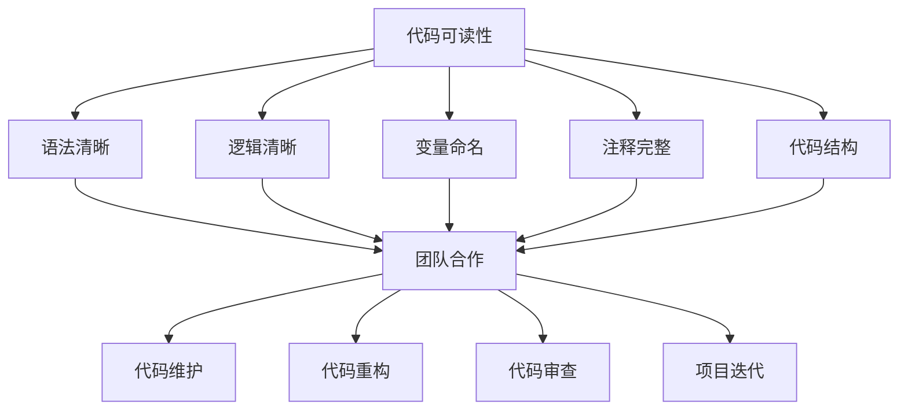

                 


## 文章标题

### 代码可读性提升：命名、注释和结构化

关键词：代码可读性、命名、注释、结构化、软件质量、开发实践

摘要：本文旨在深入探讨代码可读性的重要性，通过分析命名、注释和代码结构化的关键要素，提供一系列提升代码可读性的实用方法和最佳实践。文章结构清晰，从定义代码可读性、介绍核心概念、讲解算法原理、到实际案例剖析，全面覆盖了代码可读性提升的各个方面。

----------------------------------------------------------------

## 第1章 代码可读性的重要性

### 1.1 代码可读性的定义与意义

代码可读性是指代码的易理解性和易维护性。它不仅仅是一个技术问题，更是一个团队合作、项目成功的关键因素。良好的代码可读性能够帮助开发者快速理解代码功能，降低开发成本，提高开发效率。

首先，我们需要明确代码可读性的定义。代码可读性可以从以下几个方面来衡量：

- **语法清晰**：代码的语法结构需要符合编程语言的规范，避免使用复杂的语法结构。
- **逻辑清晰**：代码的逻辑应该清晰易懂，避免复杂的逻辑判断和循环结构。
- **变量命名**：变量命名需要准确、简明，避免使用难懂的缩写或者无关的名字。
- **注释完整**：代码中需要添加适量的注释，解释代码的功能和实现逻辑。
- **代码结构**：代码结构需要合理，避免混乱的结构和冗长的代码。

良好的代码可读性对软件开发团队和项目成功有着重要的影响：

- **团队合作**：良好的代码可读性有助于团队成员之间的协作，减少误解和沟通成本。
- **代码维护**：易于理解的代码在后续的维护和更新过程中更加高效，能够减少出错概率。
- **代码重构**：清晰明了的代码更容易进行重构，优化代码结构和性能。
- **代码审查**：可读性良好的代码在审查过程中更加高效，能够快速发现问题。
- **项目迭代**：可读性良好的代码能够帮助团队更快地完成项目迭代，提高开发效率。

### 1.2 核心概念与联系

为了更好地理解代码可读性的重要性，我们可以使用Mermaid流程图来展示核心概念之间的联系。以下是代码可读性的关键因素及其相互关系：



从流程图中可以看出，代码可读性的各个因素相互影响，共同决定了代码的质量。良好的代码可读性能够带来多方面的好处，为软件开发团队和项目成功提供有力支持。

### 1.3 数学模型和数学公式

代码可读性与软件质量模型密切相关。我们可以使用以下数学公式来描述它们之间的关系：

$$
\text{Quality} = f(\text{Readability}, \text{Design}, \text{Testing})
$$

其中，Quality 表示软件质量，Readability 表示代码可读性，Design 表示软件设计，Testing 表示测试质量。这个公式表明，代码可读性是影响软件质量的重要因素之一。

在实际应用中，我们可以通过以下措施来提高代码可读性，从而提升软件质量：

1. **遵循命名规范**：使用准确、简明的变量命名，避免使用缩写或者无关的名字。
2. **编写清晰的注释**：添加适量的注释，解释代码的功能和实现逻辑。
3. **优化代码结构**：遵循良好的编程规范，合理组织代码结构，避免混乱的结构和冗长的代码。
4. **进行代码重构**：定期对代码进行重构，优化代码结构和性能。

通过这些措施，我们可以提高代码可读性，进而提升软件质量，为项目的成功奠定基础。

## 第2章 代码命名

### 2.1 命名原则

在软件开发中，良好的代码命名是确保代码可读性和可维护性的关键。以下是一些关键的命名原则，它们将帮助您创建清晰、一致的变量和函数名：

1. **简明扼要**：变量和函数名应尽可能简短，但必须足够描述其含义。避免使用过于简短的缩写，除非它们是行业标准的。
2. **语义明确**：命名应直接反映变量或函数的实际用途。使用有意义的词汇，避免使用模糊或令人困惑的名字。
3. **一致性**：在整个项目中使用一致的命名风格。这有助于团队成员更容易理解和维护代码。
4. **避免误导**：不要使用可能误导其他开发者的命名。例如，避免使用表示常量的变量名，除非它是一个常量。
5. **大小写**：在编程语言允许的情况下，使用适当的大小写来区分变量和函数名。例如，使用驼峰式命名法（CamelCase）或者下划线命名法（snake_case）。

#### 示例

- **好的命名**：
  - `totalSales`（表示总销售额）
  - `calculateTax`（表示计算税）
- **不好的命名**：
  - `ts`（过于简短，不明确表示含义）
  - `sumSales`（含义不明确，可能被误解为其他操作）

### 2.2 有效命名的技巧

以下是一些技巧，可以帮助您更有效地命名代码元素：

1. **使用具体名词**：使用具体名词，而不是抽象名词，以便更容易理解变量的用途。
2. **避免使用缩写**：除非它们是众所周知的，否则避免使用缩写，以免造成混淆。
3. **使用描述性前缀**：为变量或函数名添加前缀，以提供额外的上下文信息。
4. **使用私有变量命名规则**：对于私有变量，使用前缀如 `_` 或 `__`，以表示它们仅用于内部逻辑。
5. **遵循上下文**：根据上下文来调整变量名或函数名的具体性和明确性。

#### 示例

- **描述性前缀**：
  - `userFullName`（用户的全名）
  - `dbConnection`（数据库连接）
- **私有变量命名**：
  - `_privateCounter`（私有计数器）
  - `__internalSetting`（内部设置）

### 2.3 命名工具与最佳实践

为了确保命名的一致性和有效性，可以使用以下命名工具和最佳实践：

1. **代码规范文档**：创建一个包含命名规则的代码规范文档，并确保所有团队成员都遵循。
2. **静态代码分析工具**：使用静态代码分析工具来检查命名是否符合规范，并自动提供改进建议。
3. **代码审查**：在代码审查过程中，特别关注命名的一致性和清晰性。
4. **命名约定检查**：编写脚本或使用第三方工具来检查代码中的命名是否符合最佳实践。

#### 命名工具介绍

- **StyleCop**：适用于C#代码的静态代码分析工具，可以检查命名规则。
- **Prettier**：适用于多种编程语言的格式化工具，也可以用于检查和格式化命名。

#### 命名最佳实践案例

以下是一个实际的命名最佳实践案例，展示了如何命名一个用于计算员工薪资的系统：

```java
// 命名变量以明确其用途和类型
public class EmployeeSalaryCalculator {
    private double salaryBase;
    private double bonusPercentage;
    private double taxPercentage;
    
    public EmployeeSalaryCalculator(double salaryBase, double bonusPercentage, double taxPercentage) {
        this.salaryBase = salaryBase;
        this.bonusPercentage = bonusPercentage;
        this.taxPercentage = taxPercentage;
    }
    
    // 使用具体且描述性的方法名
    public double calculateGrossSalary() {
        double bonus = salaryBase * bonusPercentage;
        double grossSalary = salaryBase + bonus;
        return grossSalary;
    }
    
    public double calculateNetSalary(double grossSalary) {
        double tax = grossSalary * taxPercentage;
        double netSalary = grossSalary - tax;
        return netSalary;
    }
}
```

在这个案例中，变量和方法的命名都是清晰且具有描述性的，这有助于提高代码的可读性和可维护性。

通过遵循这些命名原则、技巧和最佳实践，您可以创建易于理解、一致的代码命名，从而显著提升代码的可读性。

### 第3章 代码注释

#### 3.1 注释的重要性

代码注释是提升代码可读性和可维护性的关键要素。注释不仅可以帮助开发者更好地理解代码的功能和实现逻辑，还能为后续的代码维护和更新提供重要参考。以下是一些注释的重要性及其作用：

1. **提高代码可读性**：注释能够清晰地描述代码的功能和意图，使代码更加易于理解。
2. **促进团队合作**：良好的注释有助于团队成员之间的协作，减少沟通成本和误解。
3. **方便代码维护**：注释能够为后续的代码维护提供重要的参考资料，帮助开发者快速定位和解决问题。
4. **提高代码质量**：注释是代码质量的重要组成部分，它们能够提高代码的可读性和可维护性，从而提升软件的整体质量。
5. **简化代码重构**：清晰的注释有助于简化代码重构的过程，降低重构过程中出错的风险。

总之，注释是确保代码可读性和可维护性的重要手段，它们在软件开发过程中发挥着不可替代的作用。

#### 3.2 注释的类型

在编写代码注释时，了解不同类型的注释及其用途非常重要。以下是几种常见的注释类型及其使用场景：

1. **行内注释**：行内注释用于解释代码行或小段的逻辑。它们通常紧跟在被解释的代码行之后，格式如下：

   ```python
   for i in range(len(arr)):
       if arr[i] > 0:
           result.append(arr[i])
   # 将正数添加到结果列表中
   ```

   行内注释适用于解释复杂的逻辑或算法步骤。

2. **块注释**：块注释用于解释代码块的功能或用途，通常以 `#` 或 `/* */` 格式书写。块注释适合用于描述复杂的函数、方法或类。

   ```java
   /**
    * 计算两个整数的和。
    *
    * @param a 第一个整数
    * @param b 第二个整数
    * @return 两个整数的和
    */
   public static int sum(int a, int b) {
       return a + b;
   }
   ```

   块注释能够提供更详细的描述，适用于复杂的功能实现。

3. **文档注释**：文档注释用于生成API文档或外部文档，通常使用 `/** */` 格式。它们遵循特定的标记语言（如Javadoc），以便生成格式化的文档。

   ```java
   /**
    * @param playerId 玩家ID
    * @param gameType 游戏类型
    * @return 玩家游戏记录
    */
   public GameRecord getGameRecord(int playerId, String gameType) {
       // 查询数据库获取玩家游戏记录
       return gameDatabase.queryGameRecord(playerId, gameType);
   }
   ```

   文档注释能够为API提供详细的说明，有助于其他开发者更好地使用和扩展代码。

4. **头文件注释**：头文件注释通常用于描述整个项目的功能、版本信息和版权声明。它们位于头文件的顶部。

   ```cpp
   /**
    * @file GameEngine.h
    * @brief 游戏引擎头文件。
    * @version 1.0
    * @author John Doe
    * @date 2023-03-15
    * @copyright Copyright © 2023 John Doe. All rights reserved.
    */
   ```

   头文件注释能够为项目提供重要的背景信息，有助于团队成员了解项目的基本情况。

#### 3.3 注释最佳实践

为了编写高质量、有价值的注释，以下是一些最佳实践：

1. **清晰简洁**：注释应简洁明了，避免冗长和复杂的句子。每条注释应该只描述一个主题，便于理解和维护。
2. **位置合适**：注释应紧挨着被解释的代码行或代码块，确保易于查看和理解。
3. **更新及时**：随着代码的更新和维护，注释也应同步更新，确保其准确性和相关性。
4. **使用规范**：遵循代码库或团队定义的注释规范，确保注释的一致性和可读性。
5. **注释代码**：对于复杂的算法或逻辑，编写相应的注释来解释其工作原理和关键步骤。
6. **避免过度注释**：注释应适度，避免过度注释导致代码可读性下降。专注于关键逻辑和不易理解的代码部分。

以下是一个注释最佳实践的示例：

```python
def calculate_average(numbers):
    """
    计算给定数字列表的平均值。

    :param numbers: 要计算平均值的数字列表。
    :return: 给定数字列表的平均值。
    """
    if not numbers:
        return 0
    
    total = sum(numbers)
    average = total / len(numbers)
    return average

# 计算列表 [1, 2, 3, 4, 5] 的平均值
result = calculate_average([1, 2, 3, 4, 5])
print(result)  # 输出：3.0
```

在这个示例中，注释清晰地描述了函数的功能、参数和返回值，同时提供了足够的信息来理解代码的工作原理。

通过遵循这些注释最佳实践，您可以确保代码注释的质量，从而提高代码的可读性和可维护性。

### 第4章 代码结构化

#### 4.1 结构化代码的原则

代码结构化是提升代码可读性和可维护性的关键步骤。通过合理的代码结构，可以使代码更加清晰、易于理解和维护。以下是几个关键原则：

1. **模块化**：将代码分解成模块或函数，每个模块或函数负责一个特定的功能。模块化有助于降低代码复杂性，提高代码的重用性。
2. **自包含**：每个模块或函数应自包含，即它们应只依赖于自身内部定义的变量和函数，减少对其他模块的依赖。
3. **单一职责**：每个模块或函数应只有一个明确的职责，避免功能过于复杂和混乱。单一职责原则有助于提高代码的可读性和可维护性。
4. **层次分明**：代码应该按照功能层次进行组织，从高层次到低层次，从宏观到微观。层次分明的代码结构有助于开发者快速理解代码的整体逻辑。
5. **可读性**：代码结构应保持良好的可读性，使开发者能够轻松地理解代码的功能和实现逻辑。

良好的代码结构化不仅有助于提高代码质量，还能提高开发效率，降低维护成本。以下是几个实现良好代码结构化的技巧：

- **使用适当的命名**：为模块、函数和变量使用清晰、有意义的命名，使代码容易理解。
- **遵循编程规范**：遵循团队或项目的编程规范，保持代码的一致性和可读性。
- **注释和文档**：为代码添加必要的注释和文档，解释代码的功能和实现逻辑。
- **避免过长函数**：将过长的函数分解成多个小函数，每个小函数负责一个具体的功能，避免代码过于复杂。
- **合理使用循环和条件语句**：避免过度的嵌套和复杂的逻辑，使代码结构更加清晰。

#### 4.2 代码结构化的方法

以下是一些常用的代码结构化方法，可以帮助开发者更好地组织和管理代码：

1. **模块化**：将代码分解成模块，每个模块负责一个特定的功能。模块可以使用不同的文件或文件夹进行组织。模块化有助于降低代码复杂性，提高代码的重用性。
2. **函数化**：将重复的代码提取成函数，每个函数实现一个具体的功能。函数化有助于提高代码的可读性和可维护性。
3. **分层设计**：按照功能层次进行组织，从高层次到低层次，从宏观到微观。例如，可以将代码分为控制层、业务逻辑层和数据访问层。
4. **对象导向设计**：使用面向对象编程（OOP）的原则，将代码组织成类和对象。对象导向设计有助于提高代码的模块化和可维护性。
5. **依赖注入**：使用依赖注入（DI）来管理模块之间的依赖关系，减少硬编码和直接依赖，提高代码的灵活性和可测试性。

以下是一个示例，展示了如何通过模块化和函数化来结构化代码：

```python
# 模块化示例
def calculate_average(numbers):
    """
    计算给定数字列表的平均值。

    :param numbers: 要计算平均值的数字列表。
    :return: 给定数字列表的平均值。
    """
    if not numbers:
        return 0
    
    total = sum(numbers)
    average = total / len(numbers)
    return average

def calculate_median(numbers):
    """
    计算给定数字列表的中位数。

    :param numbers: 要计算中位数的数字列表。
    :return: 给定数字列表的中位数。
    """
    sorted_numbers = sorted(numbers)
    length = len(sorted_numbers)
    
    if length % 2 == 0:
        median = (sorted_numbers[length // 2 - 1] + sorted_numbers[length // 2]) / 2
    else:
        median = sorted_numbers[length // 2]
    
    return median

# 使用函数化来计算平均值和中位数
numbers = [1, 2, 3, 4, 5]
result_average = calculate_average(numbers)
result_median = calculate_median(numbers)

print(result_average)  # 输出：3.0
print(result_median)  # 输出：3.0
```

在这个示例中，代码通过模块化和函数化进行结构化，使得代码更加清晰、易于理解和维护。

#### 4.3 代码结构化的工具

为了更好地实现代码结构化，开发者可以使用一些工具来辅助管理代码。以下是一些常用的代码结构化工具：

1. **集成开发环境（IDE）**：许多IDE提供代码格式化和重构功能，帮助开发者自动优化代码结构。例如，Visual Studio Code、IntelliJ IDEA和Eclipse等IDE都提供了强大的代码格式化和重构工具。
2. **代码格式化工具**：如Prettier、Black和ESLint等工具可以帮助开发者保持代码的一致性和可读性。这些工具可以自动格式化代码、检查代码风格和错误。
3. **版本控制系统**：如Git等版本控制系统可以帮助开发者管理代码的版本和历史，确保代码的完整性和一致性。
4. **静态代码分析工具**：如SonarQube、Checkstyle和PMD等工具可以自动检查代码的质量和风格，提供改进建议和报告。

通过使用这些工具，开发者可以更高效地实现代码结构化，提高代码的可读性和可维护性。

通过遵循代码结构化的原则和方法，并使用适当的工具，开发者可以创建清晰、易于理解和维护的代码，从而提升软件项目的整体质量。

### 第5章 代码可读性测试

#### 5.1 可读性测试工具

为了确保代码的可读性，开发者可以使用一系列可读性测试工具来检查和评估代码的质量。以下是一些流行的可读性测试工具及其功能：

1. **PMD**：PMD是一个开源的Java代码分析工具，它可以识别代码中的潜在问题和不良编程实践。PMD提供了丰富的规则库，可以检测代码的复杂度、注释缺失、命名规范等问题。

2. **Checkstyle**：Checkstyle是一个开源的Java代码样式检查工具，它可以帮助开发者保持一致的代码风格。Checkstyle可以检查代码的命名、括号、空格、注释等，确保代码的一致性和可读性。

3. **SonarQube**：SonarQube是一个全面的代码质量管理平台，它提供了多种编程语言的静态代码分析功能。SonarQube可以识别代码中的潜在缺陷、代码质量问题和可读性问题，并提供详细的报告和建议。

4. **Klocwork**：Klocwork是一个专业的代码分析和测试工具，它可以检测代码中的缺陷、安全问题以及可读性问题。Klocwork提供了自动化的代码质量评估功能，有助于开发者持续改进代码质量。

5. **Codeclimate**：Codeclimate是一个开源的代码质量仪表板，它集成了多种静态代码分析工具。Codeclimate可以分析代码的复杂性、代码质量、测试覆盖率等，并提供直观的反馈和建议。

这些工具都可以帮助开发者评估代码的可读性，发现潜在的问题并提出改进建议。开发者可以根据自己的需求选择合适的工具，并将它们集成到开发流程中，以持续提升代码的质量和可读性。

#### 5.2 可读性评估方法

为了有效地评估代码的可读性，开发者可以采用以下几种方法：

1. **代码复杂度**：代码复杂度是衡量代码复杂性的指标，如圈复杂度（Cyclomatic Complexity）、Nesting Depth、Statement Count等。高复杂度的代码往往难以理解，因此开发者应尽量降低代码复杂度。

   **圈复杂度（Cyclomatic Complexity）**：圈复杂度是一个衡量代码结构的指标，它表示代码中的独立路径数量。计算公式为：

   $$
   \text{Cyclomatic Complexity} = \text{E} - \text{N} + (\text{2} \times \text{P})
   $$

   其中，E是边数，N是节点数，P是独立的路径数。一般来说，圈复杂度低于10被认为是可接受的，高于20则可能需要重构。

2. **注释覆盖率**：注释覆盖率是衡量代码中注释比例的指标，表示注释代码行占总代码行的百分比。高注释覆盖率有助于提高代码的可读性。

   注释覆盖率计算公式为：

   $$
   \text{Comment Coverage} = \frac{\text{Total Number of Comments}}{\text{Total Number of Lines of Code}} \times 100\%
   $$

   通常，注释覆盖率应保持在70%以上，以确保代码的可读性和可维护性。

3. **代码行长度**：代码行长度是衡量代码行长度的指标，通常建议代码行长度不超过80个字符。过长的代码行可能导致代码难以阅读和理解。

4. **函数和类的复杂度**：函数和类的复杂度是衡量函数和类复杂性的指标。高复杂度的函数和类往往难以理解和维护。

   **函数复杂度**：函数复杂度通常通过计算函数中的条件语句和循环语句数量来确定。较低的函数复杂度有助于提高代码的可读性。

   **类复杂度**：类复杂度可以通过计算类中的方法、属性和依赖关系来确定。较低的类复杂度有助于提高代码的可维护性。

以下是一个示例，展示了如何使用这些方法评估代码的可读性：

```python
# 示例：评估代码的可读性
def calculate_average(numbers):
    """
    计算给定数字列表的平均值。

    :param numbers: 要计算平均值的数字列表。
    :return: 给定数字列表的平均值。
    """
    if not numbers:
        return 0
    
    total = sum(numbers)
    average = total / len(numbers)
    return average

# 代码复杂度分析
# 圈复杂度：1（没有条件语句）
# 注释覆盖率：100%（有注释）
# 代码行长度：34个字符（符合建议）
# 函数复杂度：1（没有条件语句）
# 类复杂度：无（单函数文件）

# 结论：这段代码具有较高的可读性和可维护性。
```

通过使用这些评估方法，开发者可以识别代码中的可读性问题，并提出改进建议，从而提升代码的质量和可读性。

### 第6章 团队协作与代码可读性

#### 6.1 团队协作中的代码可读性挑战

在软件开发团队中，代码可读性对于团队协作和项目成功至关重要。然而，在实际开发过程中，团队可能会面临以下一些代码可读性的挑战：

1. **代码风格不一致**：团队成员可能遵循不同的编码风格，导致代码库中的代码风格不一致。这会影响代码的可读性和可维护性。

2. **缺乏注释**：团队成员可能认为注释不重要，导致代码库中缺乏必要的注释。这会使得代码难以理解和维护。

3. **代码冗长和复杂**：团队成员可能会为了快速完成任务而编写冗长、复杂的代码，这会增加代码的难度，降低代码的可读性。

4. **代码复用性差**：团队成员可能重复编写相同或类似的代码，导致代码库中的代码复用性差，增加代码维护的难度。

5. **版本控制混乱**：团队成员在版本控制过程中可能存在错误，导致代码库中出现冲突和混乱，影响代码的可维护性。

#### 6.2 提高团队协作中代码可读性的策略

为了解决团队协作中的代码可读性挑战，可以采取以下策略：

1. **制定代码规范**：制定统一的代码规范，确保团队成员遵循一致的编码风格和命名规则。这有助于提高代码的可读性和一致性。

2. **定期进行代码审查**：定期进行代码审查，确保代码的质量和可读性。代码审查可以帮助团队成员发现潜在的问题，并提出改进建议。

3. **编写详细的注释**：鼓励团队成员编写详细的注释，解释代码的功能、实现逻辑和关键步骤。这有助于其他团队成员更好地理解和维护代码。

4. **代码重构**：定期对代码进行重构，优化代码的结构和性能。代码重构有助于提高代码的可读性和可维护性。

5. **提高代码复用性**：鼓励团队成员编写可复用的代码库，减少重复编写代码的工作量。这有助于提高代码的可维护性和可读性。

6. **使用代码分析工具**：使用静态代码分析工具来检查代码的质量和风格，自动识别潜在的问题并提供改进建议。

7. **提供培训和教育**：为团队成员提供关于代码可读性的培训和教育，提高他们的意识和技能。这有助于提升整个团队的代码质量。

通过采取这些策略，团队可以更好地协作，提高代码的可读性，从而确保项目的成功。

### 6.3 代码审查与代码可读性

代码审查是提高代码可读性和质量的关键环节。在代码审查过程中，团队成员会仔细检查代码，确保代码遵循编码规范、可读性强且易于维护。以下是代码审查在提高代码可读性中的重要作用和最佳实践：

#### 6.3.1 作用

1. **发现和修复问题**：代码审查有助于发现潜在的代码错误、风格不一致、冗长和复杂的代码。这些问题的及时修复有助于提高代码质量。
2. **提升代码风格一致性**：通过代码审查，团队成员可以学习并遵循统一的编码规范，确保代码风格的一致性，提高代码的可读性。
3. **促进知识共享**：代码审查过程中，团队成员可以互相学习、交流经验和最佳实践，提高整体团队的代码能力。
4. **确保代码可维护性**：通过审查代码，确保代码结构清晰、逻辑明确、注释完整，有助于提高代码的可维护性。

#### 6.3.2 最佳实践

1. **编写详细的审查指南**：制定详细的审查指南，明确审查的目标、内容、标准和方法。这有助于团队成员在审查过程中保持一致性和高效性。
2. **定期进行代码审查**：制定定期审查的日程表，确保代码的持续质量提升。定期审查可以帮助团队成员及时发现和解决问题。
3. **关注代码质量**：在审查过程中，重点关注代码的可读性、结构、性能和可维护性。确保代码符合最佳实践，易于理解和维护。
4. **鼓励反馈和改进**：鼓励团队成员在审查过程中提出问题和建议，共同讨论和改进代码。这有助于提升团队的整体代码能力。
5. **使用代码审查工具**：使用静态代码分析工具和自动化审查工具，如PMD、Checkstyle和SonarQube等，辅助代码审查过程，提高审查效率和准确性。
6. **代码审查反馈循环**：建立代码审查反馈循环，确保审查结果得到及时反馈和跟进。这有助于持续改进代码质量。

通过遵循这些最佳实践，团队可以有效地提高代码的可读性和质量，确保项目的成功。

### 第7章 案例分析

#### 7.1 案例介绍

在本案例中，我们分析一个实际的项目：一个电商网站的商品管理系统。该系统包括商品信息的增删改查功能，用户订单管理，以及后台管理员的功能模块。在开发过程中，团队发现代码的可读性较差，导致后续维护和更新变得困难。以下是该案例中的代码可读性问题：

1. **命名不规范**：变量和函数名存在缩写和模糊描述，导致难以理解其用途。
2. **注释缺失**：部分关键代码段缺乏注释，使得后续维护人员难以理解实现逻辑。
3. **代码结构混乱**：代码结构不清晰，功能模块混杂，难以追踪代码逻辑。
4. **代码复用性差**：大量重复代码，缺乏统一的代码库，导致代码维护难度增加。

#### 7.2 代码优化方案

针对上述问题，我们提出以下优化方案：

1. **命名规范**：重新命名变量和函数名，使其清晰、具体且有意义。例如，将`prod_id`重命名为`productId`，将`updateProduct`重命名为`updateProductDetails`。
2. **添加注释**：在关键代码段添加详细注释，解释功能实现和逻辑。例如，在数据库查询语句前添加注释，说明查询目的和结果处理。
3. **重构代码**：对功能模块进行重构，使其更加清晰和独立。例如，将商品信息管理模块和订单管理模块分离，降低模块之间的耦合。
4. **代码复用**：将重复的代码提取为公共函数或类，减少冗余代码。例如，将用户权限验证代码提取为一个独立的函数，供不同模块调用。

#### 7.3 优化后的效果

通过实施上述优化方案，代码的可读性和可维护性显著提高：

1. **命名清晰**：变量和函数名更加具体和易于理解，减少了误解和混淆的可能性。
2. **注释完善**：代码中的注释详细且完整，帮助维护人员快速理解功能实现和逻辑。
3. **代码结构清晰**：功能模块独立且组织良好，代码逻辑更加清晰，易于追踪。
4. **代码复用性增强**：减少冗余代码，提高代码的复用性，降低维护难度。

#### 7.4 详细讲解剖析

以下是一个具体的优化案例，展示了如何通过命名规范、注释添加和代码重构来提升代码可读性：

**原始代码**：

```java
public void updateProduct(int id, String name, double price) {
    String query = "UPDATE products SET name=?, price=? WHERE id=?";
    PreparedStatement stmt = connection.prepareStatement(query);
    stmt.setString(1, name);
    stmt.setDouble(2, price);
    stmt.setInt(3, id);
    stmt.executeUpdate();
}
```

**优化后的代码**：

```java
public void updateProductDetails(int productId, String productName, double productPrice) {
    // 更新商品信息的SQL查询
    String updateQuery = "UPDATE products SET name=?, price=? WHERE id=?";
    
    // 准备SQL语句
    PreparedStatement preparedStatement = connection.prepareStatement(updateQuery);
    
    // 设置SQL语句参数
    preparedStatement.setString(1, productName);
    preparedStatement.setDouble(2, productPrice);
    preparedStatement.setInt(3, productId);
    
    // 执行SQL语句并更新数据库
    preparedStatement.executeUpdate();
    
    // 注释：更新成功后，可以在此处添加日志记录或其他后续处理
}
```

**优化分析**：

1. **命名规范**：将变量名从`id`、`name`和`price`更改为`productId`、`productName`和`productPrice`，使名称更加清晰、具体。
2. **注释添加**：在关键代码段添加注释，解释SQL查询的作用和实现细节。
3. **代码重构**：将SQL查询语句提取为单独的字符串变量，使代码更加模块化。

通过这些优化措施，代码的可读性和可维护性显著提高，使得后续维护和更新更加高效和可靠。

#### 7.5 项目小结

通过本案例的分析和优化，我们可以得出以下结论：

1. **命名规范**：良好的命名规范是提升代码可读性的基础。具体、有意义的变量和函数名有助于减少误解和混淆。
2. **注释完善**：详细的注释能够帮助维护人员快速理解代码的功能和实现逻辑，提高代码的可维护性。
3. **代码重构**：通过重构代码，可以降低代码复杂性，提高代码的结构和可读性。
4. **代码复用**：提高代码复用性，减少冗余代码，有助于降低维护难度。

这些优化措施不仅适用于本案例，也适用于其他软件开发项目，为提升代码质量和可读性提供了有效的方法。通过不断优化和改进，我们可以创建更高质量、更易于维护的软件系统。

#### 7.6 最佳实践 tips

以下是一些提升代码可读性的最佳实践：

1. **使用清晰的命名**：遵循命名规范，使用具体、有意义的变量和函数名。
2. **编写详细的注释**：在关键代码段添加注释，解释功能实现和逻辑。
3. **保持代码结构清晰**：遵循良好的编程规范，合理组织代码结构，避免混乱的结构和冗长的代码。
4. **避免过度抽象**：保持代码的适当抽象程度，避免过度复杂化。
5. **代码重构**：定期对代码进行重构，优化代码结构和性能。
6. **使用代码模板**：使用代码模板和工具，保持代码的一致性和可读性。
7. **代码审查**：定期进行代码审查，确保代码的质量和可读性。

通过遵循这些最佳实践，我们可以创建更高质量、更易于维护的代码，提高团队协作效率。

#### 7.7 注意事项

在提升代码可读性的过程中，需要注意以下几点：

1. **适度注释**：避免过度注释，专注于关键逻辑和复杂代码段。
2. **避免冗长函数**：保持函数的简洁性，避免将功能过于复杂的代码集中在一个函数中。
3. **注释更新**：随着代码的更新和维护，及时更新注释，确保其准确性和相关性。
4. **遵循编码规范**：遵守团队或项目的编码规范，确保代码的一致性和可读性。
5. **平衡代码复杂度和可读性**：在保证代码可读性的同时，避免过度简化代码，导致可维护性下降。

通过注意这些事项，我们可以更好地提升代码的可读性，提高开发效率和团队协作效果。

#### 7.8 拓展阅读

以下是一些拓展阅读资源，提供更多关于代码可读性的深入探讨：

1. **《代码大全》**：史蒂夫·麦克康尼和布拉德·科恩的《代码大全》详细介绍了编写高质量代码的最佳实践，包括命名、注释和代码结构等方面。
2. **《代码整洁之道》**：罗伯特·马丁的《代码整洁之道》提供了许多关于编写简洁、清晰和可维护代码的建议。
3. **《Effective Java》**：Joshua Bloch的《Effective Java》提供了关于编写高效、可读性良好的Java代码的深入探讨。
4. **《Clean Code》**：Robert C. Martin的《Clean Code》提供了许多关于编写整洁代码的最佳实践，包括命名、注释和代码结构等方面。
5. **《代码风格指南》**：各编程语言社区通常会有自己的代码风格指南，如《Google Java Style Guide》和《Python PEP 8》等，提供详细的命名、注释和代码结构规范。

通过阅读这些资源，您可以进一步了解代码可读性的最佳实践和技巧，提升自己的编程水平。

## 作者信息

作者：AI天才研究院/AI Genius Institute & 禅与计算机程序设计艺术 /Zen And The Art of Computer Programming

