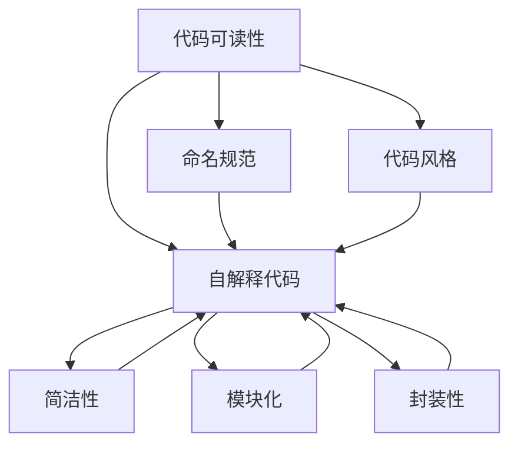
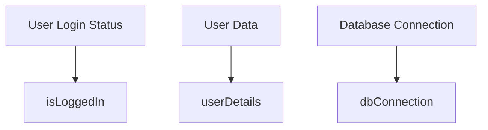
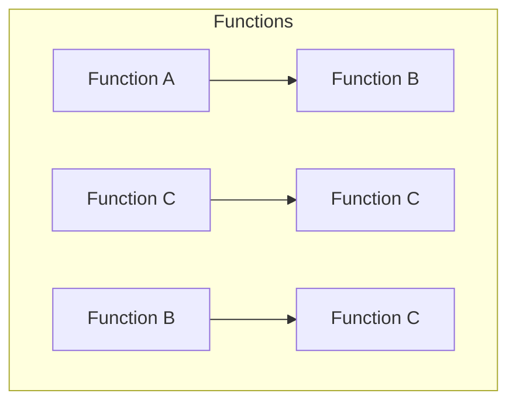
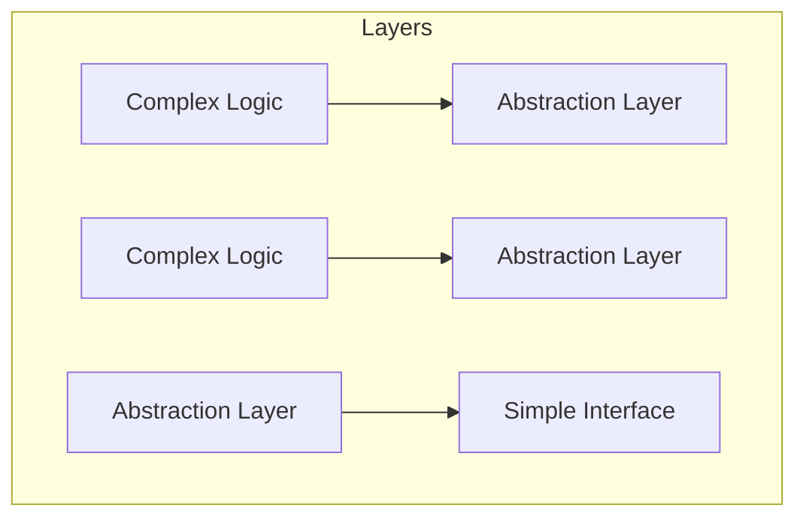
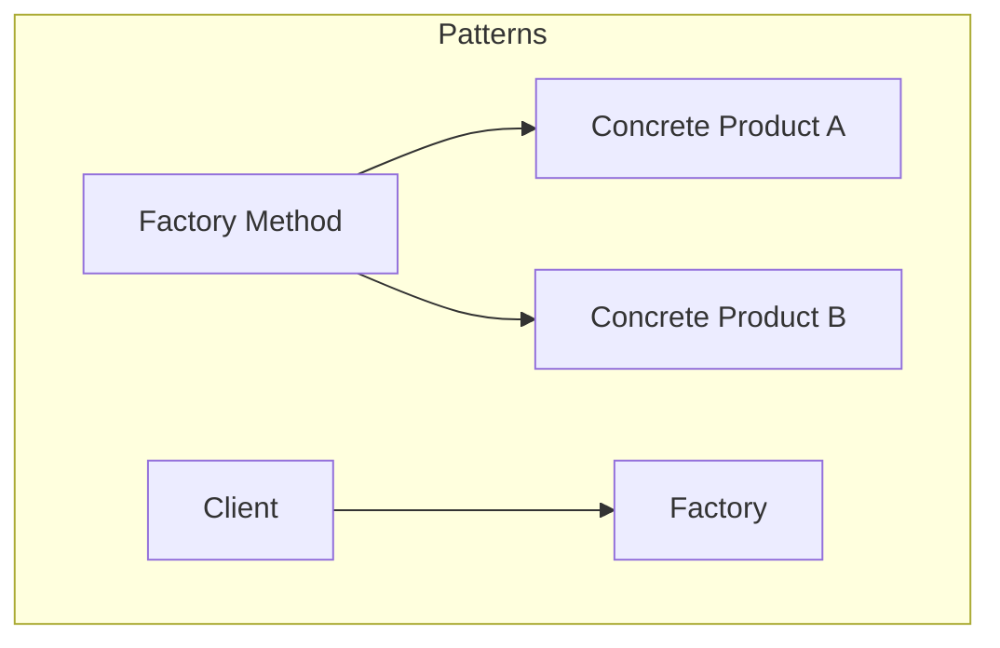
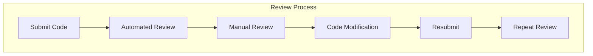

                 

### 编写自解释代码的重要性

在当今快速发展的软件行业，代码可读性成为了开发者面临的一个重要挑战。随着项目复杂度的增加，代码的体积也在不断膨胀，使得维护和扩展变得愈发困难。编写自解释代码，即能够直接表达其功能和意图的代码，是解决这一问题的有效途径。本节将详细探讨编写自解释代码的重要性。

#### 1. 提高开发效率

代码的可读性直接影响到开发效率。当代码能够清晰地表达其功能和意图时，开发者无需花费大量时间来理解代码的工作原理，从而可以更快速地定位问题、修改错误和添加新功能。编写自解释代码意味着代码本身就是一个文档，减少了开发者对额外文档的需求，节省了时间和精力。

#### 2. 简化代码维护

随着项目的迭代和演进，代码维护变得尤为重要。自解释代码降低了代码维护的难度，因为新的开发者可以更容易地理解现有代码的功能和结构，从而减少由于误解而引入的新问题。同时，自解释代码使得代码重构变得更加可行，因为开发者可以更安全地修改代码，而不用担心破坏现有的功能。

#### 3. 促进团队协作

在一个团队中，不同的开发者可能会负责不同的部分。编写自解释代码有助于促进团队协作，因为团队成员可以更容易地理解彼此的代码，从而提高代码的可重用性。此外，自解释代码有助于避免因代码理解不一致而导致的冲突和误解。

#### 4. 提升代码质量

自解释代码通常伴随着良好的编程习惯，如清晰的命名、适当的注释和统一的代码风格。这些习惯有助于提升代码质量，使代码更加可靠、高效和易于测试。高质量的代码不仅减少了bug的数量，还提高了系统的整体性能。

#### 5. 促进知识传承

随着团队成员的变动，知识传承成为一个关键问题。编写自解释代码有助于确保新成员能够迅速上手，因为他们可以从代码中直接获取所需的信息，而无需依赖额外的培训或文档。这有助于保持团队的连续性和稳定性。

#### 6. 符合敏捷开发理念

敏捷开发强调快速反馈和持续改进。自解释代码使得开发团队能够更快地响应变化，因为团队成员可以迅速理解代码的功能和意图，从而快速实现需求的变更。这有助于提高开发团队的整体敏捷性。

综上所述，编写自解释代码对于提升开发效率、简化代码维护、促进团队协作、提升代码质量和知识传承等方面具有重要意义。在接下来的章节中，我们将进一步探讨如何实现编写自解释代码的具体方法。

## 核心概念与联系

为了更好地理解代码可读性和自解释代码之间的关系，我们需要探讨几个核心概念及其相互之间的联系。以下是这些概念及其关系的详细解析：

### 1. 代码可读性

代码可读性是指代码能够被其他开发者轻松理解和解读的程度。它不仅涉及代码的结构和格式，还包括命名规范、注释、文档化等方面。高可读性的代码通常具有以下特点：

- **清晰的命名**：变量、函数和类的命名应具有明确的含义，避免使用晦涩难懂的名字。
- **良好的格式**：代码应具有良好的缩进、对齐和空白处理，以便于视觉追踪和理解。
- **适当的注释**：代码中应包含足够的注释，解释复杂逻辑和算法原理，避免读者产生误解。
- **一致的代码风格**：遵循统一的编码规范，使代码在不同开发者之间保持一致性。

### 2. 自解释代码

自解释代码是指代码本身能够清晰表达其功能和意图，无需额外的文档或注释即可被理解。自解释代码的目的是减少对额外信息的依赖，提高代码的透明度和可维护性。以下是实现自解释代码的几个关键原则：

- **简洁性**：避免不必要的复杂性和冗余代码，保持代码简洁明了。
- **模块化**：将代码分解为独立的模块，每个模块具有明确的功能和职责。
- **封装性**：隐藏内部实现细节，仅暴露必要的接口和API。
- **一致的命名规范**：使用一致的命名规范，使代码易于理解和记忆。

### 3. 核心概念之间的关系

代码可读性和自解释代码之间存在着密切的关系。自解释代码实际上是代码可读性的一个子集，它更加强调代码本身的表达能力，而不仅仅是代码的外在形式。以下是这些概念之间的具体联系：

- **代码可读性**是实现**自解释代码**的基础。只有当代码具有良好的可读性时，才有可能编写出真正自解释的代码。
- **自解释代码**是**代码可读性**的高级形态。它不仅要求代码清晰易懂，还要求代码能够直接表达其功能和意图。
- **良好的命名规范**和**代码风格**是实现自解释代码的关键。一致的命名规范和良好的代码风格有助于提高代码的可读性，从而实现自解释。
- **模块化**和**封装性**是提高代码**可读性**和实现**自解释代码**的有效方法。通过模块化和封装，可以将复杂的逻辑分解为独立的、易于理解的组件，从而提高代码的整体可读性和自解释性。

### 图解核心概念与联系

为了更直观地理解核心概念之间的关系，我们可以使用Mermaid流程图来展示。以下是一个简化的Mermaid流程图示例：



在这个流程图中，代码可读性（A）是核心起点，它直接关联到自解释代码（B），同时也影响了命名规范（C）和代码风格（D）。自解释代码（B）进一步延伸到简洁性（E）、模块化（F）和封装性（G），这些原则共同作用于实现自解释代码。

通过理解这些核心概念及其联系，我们可以更好地把握代码可读性和自解释代码的编写技巧，从而编写出清晰、易懂、高效的代码。

## 编写自解释代码的基础

编写自解释代码是提升代码可读性的关键。为了实现这一目标，我们需要遵循一系列基本原则和技巧。以下将详细讨论这些原则，并结合伪代码示例，阐述如何将这些原则应用于实际编码过程中。

### 1. 命名规范

清晰的命名是编写自解释代码的基础。一个有意义的名字能够直接传达变量、函数和类的功能，使代码更容易理解。

**原则**：
- 使用有意义的单词组合，避免缩写和复杂命名。
- 保持命名一致性，遵循统一的命名规范。
- 避免使用描述不明确或误导性的名字。

**伪代码示例**：



在这个示例中，变量和函数的命名（如`isLoggedIn`、`userDetails`和`dbConnection`）都直接反映了它们的用途，使得代码易于理解。

### 2. 注释与文档

注释是补充代码说明的重要工具。良好的注释可以帮助读者理解代码的复杂部分，并提高代码的可维护性。

**原则**：
- 提供必要的注释，特别是对于复杂逻辑和关键算法。
- 保持注释与代码同步更新，避免出现不一致。
- 使用多行注释或注释块，而不是单行注释，以提供更详细的解释。

**伪代码示例**：

```mermaid
graph TD
    A[Initialize Database Connection] --> B[dbConnection = connectToDatabase()]
    B --> C[Execute Query] --> D[results = queryDatabase("SELECT * FROM users")]
    D --> E[Process Results]
    E --> F[Close Connection] --> G[dbConnection.close()]
    
   注释:[该流程初始化数据库连接，执行查询并处理结果。]
```

在这个示例中，注释详细描述了每一步操作的目的和结果，使得代码的实现过程更加透明。

### 3. 代码风格与格式

良好的代码风格和格式是提高代码可读性的重要因素。一致的代码风格不仅有助于代码的可读性，还能够提高代码的可维护性。

**原则**：
- 使用适当的缩进和空白，以提高代码的可读性。
- 保持代码的整洁和简洁，避免过度使用缩进和空格。
- 遵循编程语言的编码规范，如PEP8（Python）、JS指南（JavaScript）等。

**伪代码示例**：

```mermaid
graph TD
    A[Calculate Sum] --> B[sum = 0]
    B --> C[Add Numbers] --> D[sum += number]
    D --> E[Print Result] --> F[print("Sum is: " + sum)]
    
    // 注：此代码实现了计算和打印数字和的功能。
```

在这个示例中，代码采用了简洁的格式，使得逻辑结构更加清晰。

### 4. 编写自解释代码的步骤

结合以上原则，编写自解释代码可以分为以下几个步骤：

1. **分析需求**：在编写代码之前，理解需求并确定代码的目标和功能。
2. **设计模块**：将代码分解为独立的模块，每个模块负责一个特定的功能。
3. **编写伪代码**：使用伪代码来描述算法和数据结构，确保逻辑清晰。
4. **编码实现**：根据伪代码，逐步实现代码，并遵循良好的命名规范和注释习惯。
5. **代码审查**：在编码过程中进行代码审查，确保代码符合自解释代码的原则。

**伪代码示例**：

```mermaid
graph TD
    A[Initialize] --> B[Read Input]
    B --> C[Process Input]
    C --> D[Calculate Output]
    D --> E[Write Output]
    E --> F[End]
    
    注：初始化程序，读取输入，处理输入，计算输出，并写入输出。
```

通过上述步骤，我们可以逐步编写出自解释代码，使代码更易于理解和维护。

### 总结

编写自解释代码需要遵循命名规范、提供必要的注释、保持良好的代码风格和格式。通过这些原则，我们可以提高代码的可读性，使代码本身成为一个文档，减少对额外文档的依赖。在实际编码过程中，结合伪代码示例，逐步实现这些原则，可以有效地提高代码的质量和可维护性。

### 代码结构优化原理

编写自解释代码不仅仅是关于代码的内部细节，还包括如何优化代码的结构，使其更具可读性和可维护性。代码结构优化包括模块化、封装和多态等面向对象编程概念。下面我们将详细探讨这些概念及其在实际开发中的应用。

#### 1. 模块化

模块化是一种将代码分解为独立模块的编程方法，每个模块负责实现一个特定的功能。模块化有助于提高代码的可读性，因为开发者可以专注于一个模块的内部逻辑，而不需要了解整个系统的复杂结构。

**优势**：
- **代码可重用性**：模块可以独立开发、测试和部署，提高了代码的复用性。
- **代码可维护性**：模块化使得代码的修改和扩展变得更加容易，因为开发者可以仅对受影响的模块进行修改。
- **代码可测试性**：每个模块可以独立测试，提高了测试的覆盖率和准确性。

**应用**：
- **分层架构**：在软件设计中，可以将系统划分为不同的层次，如表示层、业务逻辑层和数据访问层。每个层次负责不同的功能，有助于提高代码的清晰度和模块化程度。
- **组件化开发**：通过开发独立的组件，每个组件实现特定的功能，可以方便地替换或升级，从而提高系统的灵活性和可维护性。

**示例**：

```java
// 示例：一个简单的模块化Java类
public class Calculator {
    public int add(int a, int b) {
        return a + b;
    }
    
    public int subtract(int a, int b) {
        return a - b;
    }
}

public class Main {
    public static void main(String[] args) {
        Calculator calculator = new Calculator();
        int result = calculator.add(5, 3);
        System.out.println("Result: " + result);
    }
}
```

在这个示例中，`Calculator`类实现了两个简单的数学运算，通过模块化，每个功能都封装在一个独立的类中，便于管理和扩展。

#### 2. 封装

封装是一种将代码和数据封装在一起，并通过公共接口进行访问的编程方法。封装有助于保护代码的内部实现细节，减少外部对内部逻辑的依赖，从而提高代码的可维护性和安全性。

**优势**：
- **数据保护**：封装可以防止外部直接访问类内部的私有变量，减少了数据被意外修改的风险。
- **代码隔离**：封装有助于隔离代码的不同部分，使得修改一个部分不会影响到其他部分。
- **代码复用**：通过提供公共接口，封装使得代码更易于复用，因为其他部分不需要了解内部实现细节。

**应用**：
- **私有属性和公共方法**：在类中，将属性设置为私有，并通过公共方法提供对属性的访问和修改。
- **访问修饰符**：使用访问修饰符（如`private`、`protected`、`public`）来控制对类成员的访问。

**示例**：

```python
class BankAccount:
    def __init__(self, balance=0):
        self.__balance = balance  # 私有属性

    def deposit(self, amount):
        self.__balance += amount

    def withdraw(self, amount):
        if amount <= self.__balance:
            self.__balance -= amount
            return True
        else:
            return False

    def get_balance(self):
        return self.__balance

# 示例：使用公共接口访问私有属性
account = BankAccount(1000)
account.deposit(500)
print(account.get_balance())  # 输出 1500
```

在这个示例中，`BankAccount`类的私有属性`__balance`通过公共方法`deposit`、`withdraw`和`get_balance`进行访问和修改，实现了封装。

#### 3. 多态

多态是一种允许使用一个接口调用多个不同实现的方法的编程技术。多态有助于提高代码的灵活性和可扩展性，因为可以通过扩展现有类来实现新的功能，而无需修改原有代码。

**优势**：
- **代码复用**：通过多态，可以重用现有代码，实现更灵活的扩展。
- **代码扩展性**：新增功能可以通过扩展现有类来实现，而不需要修改原有代码。
- **代码简洁性**：多态使得代码更加简洁，因为可以使用同一个接口处理不同类型的数据。

**应用**：
- **继承**：通过继承，新的类可以继承现有类的属性和方法，并通过重写方法实现特定功能。
- **接口**：使用接口定义公共行为，多个类可以实现同一个接口，从而实现多态。

**示例**：

```java
interface Animal {
    void makeSound();
}

class Dog implements Animal {
    public void makeSound() {
        System.out.println("汪汪汪！");
    }
}

class Cat implements Animal {
    public void makeSound() {
        System.out.println("喵喵喵！");
    }
}

public class Main {
    public static void main(String[] args) {
        Animal dog = new Dog();
        Animal cat = new Cat();
        
        dog.makeSound();  // 输出 "汪汪汪！"
        cat.makeSound();  // 输出 "喵喵喵！"
    }
}
```

在这个示例中，`Dog`和`Cat`类都实现了`Animal`接口，并通过多态，使用同一个方法调用不同类的实现。

### 总结

代码结构优化是编写自解释代码的重要一环。通过模块化、封装和多态等面向对象编程概念，可以提高代码的可读性、可维护性和可扩展性。在实际开发中，遵循这些原则，可以有效地优化代码结构，实现更加清晰、简洁和高效的代码。在下一节中，我们将通过具体的代码示例，展示如何将这些原理应用于实际编码中。

### 代码结构优化实践

在上一节中，我们探讨了代码结构优化的原理，包括模块化、封装和多态等面向对象编程概念。本节将通过具体的代码示例，详细展示如何在实际编码过程中应用这些原则，以提高代码的可读性和可维护性。

#### 1. 模块化

模块化是将代码分解为独立的模块，每个模块负责实现一个特定的功能。以下是一个简单的模块化示例：

**原始代码**：

```java
public class Main {
    public static void main(String[] args) {
        int a = 5;
        int b = 3;
        int sum = a + b;
        System.out.println("Sum is: " + sum);
    }
}
```

**优化后的代码**：

```java
// Module: Calculator.java
public class Calculator {
    public int add(int a, int b) {
        return a + b;
    }
}

// Module: Main.java
public class Main {
    public static void main(String[] args) {
        Calculator calculator = new Calculator();
        int a = 5;
        int b = 3;
        int sum = calculator.add(a, b);
        System.out.println("Sum is: " + sum);
    }
}
```

在这个优化示例中，我们将计算和输出功能拆分为两个独立的模块：`Calculator`和`Main`。`Calculator`类负责计算功能，`Main`类负责调用计算并输出结果。这种模块化设计提高了代码的可维护性和可扩展性。

#### 2. 封装

封装是将代码和数据封装在一起，并通过公共接口进行访问。以下是一个封装的示例：

**原始代码**：

```python
class BankAccount:
    def __init__(self):
        self.balance = 0

    def deposit(self, amount):
        self.balance += amount

    def withdraw(self, amount):
        if amount <= self.balance:
            self.balance -= amount
            return True
        else:
            return False

# 使用示例
account = BankAccount()
account.deposit(1000)
account.withdraw(500)
print(account.balance)  # 输出 500
```

**优化后的代码**：

```python
class BankAccount:
    def __init__(self):
        self.__balance = 0  # 封装私有属性

    def deposit(self, amount):
        self.__balance += amount

    def withdraw(self, amount):
        if amount <= self.__balance:
            self.__balance -= amount
            return True
        else:
            return False

    def get_balance(self):
        return self.__balance

# 使用示例
account = BankAccount()
account.deposit(1000)
account.withdraw(500)
print(account.get_balance())  # 输出 500
```

在这个优化示例中，我们通过将`balance`属性封装为私有属性（`__balance`），并提供公共方法`deposit`、`withdraw`和`get_balance`来访问和修改它。这种封装设计保护了内部数据，减少了外部对内部实现细节的依赖。

#### 3. 多态

多态允许使用一个接口调用多个不同实现的方法。以下是一个多态的示例：

**原始代码**：

```java
public class Main {
    public static void main(String[] args) {
        Animal animal1 = new Dog();
        Animal animal2 = new Cat();
        
        animal1.makeSound();  // 输出 "汪汪汪！"
        animal2.makeSound();  // 输出 "喵喵喵！"
    }
}

interface Animal {
    void makeSound();
}

class Dog implements Animal {
    public void makeSound() {
        System.out.println("汪汪汪！");
    }
}

class Cat implements Animal {
    public void makeSound() {
        System.out.println("喵喵喵！");
    }
}
```

在这个原始示例中，我们直接实例化了`Dog`和`Cat`类，并调用它们的`makeSound`方法。虽然这个示例实现了多态，但它的代码结构并不清晰。

**优化后的代码**：

```java
public class Main {
    public static void main(String[] args) {
        Animal animal1 = new Dog();
        Animal animal2 = new Cat();
        
        sound(animal1);  // 输出 "汪汪汪！"
        sound(animal2);  // 输出 "喵喵喵！"
    }
    
    public static void sound(Animal animal) {
        animal.makeSound();
    }
}

interface Animal {
    void makeSound();
}

class Dog implements Animal {
    public void makeSound() {
        System.out.println("汪汪汪！");
    }
}

class Cat implements Animal {
    public void makeSound() {
        System.out.println("喵喵喵！");
    }
}
```

在这个优化示例中，我们引入了一个新的方法`sound`，它接受一个`Animal`接口类型的参数，并调用该对象的`makeSound`方法。这种设计使得代码更加模块化和可扩展，因为现在可以方便地添加新的动物类，而无需修改`Main`类的代码。

### 总结

通过模块化、封装和多态等面向对象编程概念，我们可以显著提高代码的可读性和可维护性。在实际编码过程中，遵循这些原则，可以帮助我们编写出清晰、简洁和高效的代码。在本节的示例中，我们详细展示了如何将这些原则应用于实际编码，并通过对比原始代码和优化后的代码，验证了这些方法的有效性。在下一节中，我们将继续讨论代码风格与格式的重要性，以及如何通过良好的代码风格和格式来提升代码的可读性。

### 代码风格与格式

代码风格与格式对代码的可读性有着至关重要的影响。一个良好的代码风格和格式不仅能够提高代码的可维护性，还能够使团队成员更容易理解彼此的代码。在本节中，我们将分析不同编程语言的代码风格和格式标准，并介绍一些常见的格式化工具，以便开发者能够编写出整洁、一致的代码。

#### 1. Python代码风格

Python语言的代码风格遵循PEP8指南，这是一份广泛认可的Python编码规范。以下是一些关键点：

- **命名规范**：使用小写字母和下划线组合的变量名和函数名，如`my_variable`和`calculate_sum`。
- **缩进**：使用4个空格进行缩进，避免使用制表符。
- **代码行长度**：代码行长度不应超过79个字符。
- **注释**：使用井号`#`进行单行注释，多行注释使用三个引号`"""`。

#### 2. Java代码风格

Java语言的代码风格遵循Java Code Style Guide。以下是一些关键点：

- **命名规范**：使用驼峰命名法，如`myVariable`和`calculateSum`。
- **大括号**：总在必要时使用大括号，即使只有一条语句。
- **代码行长度**：代码行长度不应超过120个字符。
- **注释**：使用单行注释`//`和Javadoc进行多行注释。

#### 3. JavaScript代码风格

JavaScript语言的代码风格遵循Google JavaScript Style Guide。以下是一些关键点：

- **命名规范**：使用小写字母和下划线组合的变量名和函数名，如`my_variable`和`calculate_sum`。
- **代码块缩进**：使用2个空格进行缩进。
- **代码行长度**：代码行长度不应超过80个字符。
- **注释**：使用单行注释`//`和`/** */`进行多行注释。

#### 4. 格式化工具

为了确保代码风格的一致性，开发者可以使用各种格式化工具。以下是一些常见的格式化工具：

- **Python**：`black`和`yapf`。
- **Java**：`google-java-format`和`checkstyle`。
- **JavaScript**：`prettier`和`eslint`。

**Python示例**：

```bash
# 安装black格式化工具
pip install black

# 格式化单个文件
black my_script.py

# 格式化整个项目
black --recursive .
```

**Java示例**：

```bash
# 安装google-java-format格式化工具
npm install -g google-java-format

# 格式化单个文件
google-java-format -i --set-exit-if-changed my_class.java

# 格式化整个项目
find . -name "*.java" -exec google-java-format -i --set-exit-if-changed {} \;
```

**JavaScript示例**：

```bash
# 安装prettier格式化工具
npm install -g prettier

# 格式化单个文件
prettier --write my_script.js

# 格式化整个项目
find . -name "*.js" -exec prettier --write {} \;
```

### 使用格式化工具的好处

使用格式化工具有以下好处：

- **提高代码质量**：格式化工具能够自动修复代码风格问题，确保代码的一致性和可读性。
- **节省时间**：格式化工具可以快速格式化代码，减少手动格式化的工作量。
- **团队协作**：格式化工具有助于团队遵循统一的代码风格，减少因风格不一致而产生的冲突。
- **代码审查**：格式化工具能够提高代码审查的效率，因为格式正确且一致的代码更容易阅读和理解。

### 总结

代码风格与格式对代码的可读性有着重要的影响。通过遵循不同编程语言的代码风格和格式标准，并使用格式化工具，开发者可以编写出整洁、一致且高质量的代码。这不仅能提高代码的可维护性，还能够促进团队协作，提高开发效率。在下一节中，我们将讨论编写注释与文档的重要性，并介绍如何编写高质量的注释和文档。

### 编写注释与文档

注释和文档在提高代码可读性和可维护性方面起着至关重要的作用。它们不仅是代码理解的重要补充，也是团队协作和项目维护的基石。在本节中，我们将讨论注释的重要性，提供编写高质量注释的指导原则，并讲解如何编写项目文档。

#### 注释的重要性

注释是代码的补充说明，它帮助开发者理解代码的功能、结构和逻辑。以下是注释的重要作用：

1. **提高代码可读性**：良好的注释可以解释复杂代码段的意图，使读者更容易理解代码。
2. **便于代码维护**：注释可以帮助新开发者快速上手项目，减少因理解不足而引入的错误。
3. **代码审查**：注释可以提供审查者额外的信息，帮助他们更有效地评估代码的质量。
4. **文档化**：注释是编写项目文档的重要来源，有助于生成详细的用户手册和技术文档。

#### 编写高质量注释的原则

以下是一些编写高质量注释的原则：

1. **简洁明了**：注释应简洁明了，避免冗长和复杂的句子。
2. **及时更新**：注释应与代码同步更新，确保它们始终保持准确。
3. **准确描述**：注释应准确描述代码的功能和目的，避免模糊或误导性的描述。
4. **使用代码**：尽量使用代码本身来传达信息，注释应补充代码未表达的内容。
5. **注释块**：使用注释块来注释整个代码段，提供整体的上下文。

#### 编写注释的示例

以下是一个简单的Java类及其注释示例：

```java
/**
 * This class represents a Bank Account.
 * It provides methods to deposit, withdraw, and get the account balance.
 */
public class BankAccount {
    private double balance;  // The account balance

    /**
     * Constructs a new BankAccount with the given initial balance.
     * @param initialBalance The initial balance for the account.
     */
    public BankAccount(double initialBalance) {
        this.balance = initialBalance;
    }

    /**
     * Deposits the specified amount into the account.
     * @param amount The amount to deposit.
     */
    public void deposit(double amount) {
        balance += amount;
    }

    /**
     * Withdraws the specified amount from the account if sufficient balance.
     * @param amount The amount to withdraw.
     * @return true if the withdrawal was successful, false otherwise.
     */
    public boolean withdraw(double amount) {
        if (amount <= balance) {
            balance -= amount;
            return true;
        } else {
            return false;
        }
    }

    /**
     * Retrieves the current account balance.
     * @return The current account balance.
     */
    public double getBalance() {
        return balance;
    }
}
```

在这个示例中，注释块详细描述了类的功能、构造函数、方法和私有变量的用途，使代码易于理解和维护。

#### 编写项目文档

项目文档是项目的重要组成部分，它提供了项目的背景、功能、使用方法和维护信息。以下是一些编写项目文档的要点：

1. **项目概述**：介绍项目的目的、背景和主要功能。
2. **功能描述**：详细描述项目的各个功能，包括使用方法、输入和输出。
3. **用户手册**：提供用户操作项目的指南，包括配置、安装和常见问题。
4. **技术文档**：为开发者提供项目的技术细节，包括架构、算法和数据库设计。
5. **API文档**：描述项目的API接口，包括方法、参数和返回值。
6. **维护指南**：提供项目的维护策略和注意事项。

以下是一个简单的项目文档框架：

```
项目文档

1. 项目概述
   - 目的
   - 背景信息
   - 主要功能

2. 功能描述
   - 功能1
     - 使用方法
     - 输入
     - 输出
   - 功能2
     - 使用方法
     - 输入
     - 输出

3. 用户手册
   - 安装
   - 配置
   - 使用指南
   - 常见问题

4. 技术文档
   - 架构设计
   - 数据库设计
   - 算法说明

5. API文档
   - 接口列表
   - 方法描述
   - 参数说明
   - 返回值说明

6. 维护指南
   - 维护策略
   - 注意事项
   - 升级指南
```

通过编写高质量的注释和详细的文档，我们可以显著提高代码的可读性和项目的整体质量。注释和文档不仅是开发者之间的交流工具，也是项目长期维护和扩展的保障。

### 代码复用与抽象

代码复用和抽象是提升代码质量和可维护性的重要手段。通过复用现有的代码，我们可以避免重复编写相同的代码段，从而减少错误和降低维护成本。而抽象则将复杂的逻辑封装成简单的接口，使得代码更加简洁、易读和维护。下面我们将详细探讨代码复用和抽象的概念，并使用伪代码和实际案例展示如何实现代码复用和抽象。

#### 1. 代码复用

代码复用是指在不同地方使用相同的代码段，而不是重复编写。这可以通过以下几种方式实现：

- **函数/方法复用**：将常用的操作封装成函数或方法，在不同的地方调用。
- **类/模块复用**：将一组相关函数或属性封装成类或模块，以便在不同项目中重用。
- **库/框架复用**：使用现有的库或框架来处理常见的任务，如数据库操作、网络通信等。

**伪代码示例**：



在这个示例中，`Function A`、`Function B`和`Function C`在不同的地方被调用，实现了代码的复用。

**实际案例**：

```python
# 示例：使用函数复用计算和打印数字和
def calculate_sum(a, b):
    return a + b

def print_result(sum):
    print("Sum is:", sum)

# 在不同的地方调用函数
print_result(calculate_sum(5, 3))  # 输出 "Sum is: 8"
print_result(calculate_sum(10, 20))  # 输出 "Sum is: 30"
```

在这个Python示例中，`calculate_sum`和`print_result`函数被多次调用，实现了代码的复用。

#### 2. 抽象

抽象是将复杂的事物简化为简单的概念或模型。在编程中，抽象可以通过以下几种方式实现：

- **函数/方法抽象**：通过编写简洁的函数或方法，将复杂的操作封装起来，隐藏内部实现细节。
- **类/模块抽象**：通过编写抽象的类或模块，定义一组相关操作，隐藏具体的实现细节。
- **设计模式**：使用设计模式来抽象常见的编程问题，提供通用的解决方案。

**伪代码示例**：



在这个示例中，`Complex Logic`通过`Abstraction Layer`封装起来，提供`Simple Interface`供外部调用。

**实际案例**：

```java
// 示例：使用抽象类实现数据库操作的抽象
public abstract class Database {
    public abstract void connect();
    public abstract void query(String sql);
    public abstract void close();
}

public class MySQLDatabase extends Database {
    public void connect() {
        // MySQL连接逻辑
    }
    
    public void query(String sql) {
        // MySQL查询逻辑
    }
    
    public void close() {
        // MySQL关闭逻辑
    }
}

public class PostgreSQLDatabase extends Database {
    public void connect() {
        // PostgreSQL连接逻辑
    }
    
    public void query(String sql) {
        // PostgreSQL查询逻辑
    }
    
    public void close() {
        // PostgreSQL关闭逻辑
    }
}

// 使用抽象类进行数据库操作
Database mysql = new MySQLDatabase();
mysql.connect();
mysql.query("SELECT * FROM users");
mysql.close();

Database postgres = new PostgreSQLDatabase();
postgres.connect();
postgres.query("SELECT * FROM users");
postgres.close();
```

在这个Java示例中，`Database`抽象类定义了连接、查询和关闭数据库的接口，而具体的实现由`MySQLDatabase`和`PostgreSQLDatabase`子类完成。这种设计使得代码更加简洁和可维护。

#### 3. 设计模式

设计模式是一组经过时间验证的解决方案，用于解决软件设计中的常见问题。以下是一些常见的设计模式：

- **工厂模式**：用于创建对象，隐藏创建逻辑，实现对象的抽象。
- **单例模式**：确保一个类只有一个实例，并提供一个全局访问点。
- **观察者模式**：实现对象之间的松耦合，一个对象的状态改变会通知其他对象。
- **策略模式**：定义一系列算法，将每个算法封装起来，并使它们可以互换使用。

**伪代码示例**：



在这个示例中，`Factory`通过`Factory Method`创建具体的`Product`对象，实现了抽象和封装。

**实际案例**：

```python
# 示例：使用工厂模式创建不同类型的对象
class Factory:
    def create_product(self, type):
        if type == "A":
            return ProductA()
        elif type == "B":
            return ProductB()

class ProductA:
    def use_product(self):
        print("Using Product A")

class ProductB:
    def use_product(self):
        print("Using Product B")

# 使用工厂创建产品
factory = Factory()
product_a = factory.create_product("A")
product_a.use_product()  # 输出 "Using Product A"

product_b = factory.create_product("B")
product_b.use_product()  # 输出 "Using Product B"
```

在这个Python示例中，`Factory`类通过`create_product`方法创建不同类型的`Product`对象，实现了对象的抽象和封装。

### 总结

代码复用和抽象是提高代码质量和可维护性的关键手段。通过复用现有的代码和抽象复杂的逻辑，我们可以编写出简洁、高效且易于维护的代码。在本节中，我们详细介绍了代码复用和抽象的概念，并通过伪代码和实际案例展示了如何实现它们。在下一节中，我们将讨论代码审查与反馈的重要性，以及如何通过代码审查来提高代码质量和可读性。

### 代码审查与反馈

代码审查是提高代码质量和可读性的重要手段。它通过同行评审的方式，帮助开发者发现潜在的错误、提升代码质量，并促进团队成员之间的沟通与协作。在本节中，我们将讨论代码审查的目的和方法，并介绍一些常用的代码审查工具和流程，以帮助开发者有效地进行代码审查。

#### 代码审查的目的

代码审查的主要目的是：

1. **提高代码质量**：通过审查，可以发现代码中的错误、漏洞和潜在的问题，从而提升代码的整体质量。
2. **促进学习与成长**：代码审查不仅是一种质量保证机制，也是一种学习和成长的机会。开发者可以通过审查他人的代码，了解不同的编程风格和技巧，提升自己的技术水平。
3. **提升团队协作**：代码审查促进了团队成员之间的沟通与协作，有助于团队形成一致的编程标准和规范。
4. **预防未来风险**：通过审查，可以识别项目中潜在的风险和隐患，防止未来出现重大的问题。

#### 代码审查的方法

代码审查的方法主要包括以下几种：

1. **手动审查**：手动审查是指开发人员逐行阅读代码，查找潜在的问题和不足。这种方法可以深入理解代码，但效率较低，容易遗漏问题。
2. **自动化审查**：自动化审查是指使用代码审查工具自动分析代码，识别常见的编程错误和潜在的问题。这种方法效率高，但可能无法完全替代手动审查，因为一些复杂的问题需要人工判断。
3. **混合审查**：混合审查结合了手动审查和自动化审查的优点，首先使用自动化工具进行初步审查，然后由人工进行深入分析。

#### 常用的代码审查工具

以下是一些常用的代码审查工具：

1. **SonarQube**：SonarQube是一个开源的代码质量管理平台，可以自动分析代码，识别bug、安全漏洞和代码质量问题。
2. **Checkstyle**：Checkstyle是一个Java代码风格检查工具，可以检查代码的格式、命名规范和编码标准。
3. **PMD**：PMD是一个Java源代码错误检测工具，可以识别潜在的编程错误和风格问题。
4. **FindBugs**：FindBugs是一个Java静态代码分析工具，可以检测代码中的潜在缺陷和错误。
5. **GitLab CI/CD**：GitLab CI/CD可以与代码审查工具集成，实现自动化代码审查和构建。

#### 代码审查的流程

一个典型的代码审查流程通常包括以下几个步骤：

1. **提交代码**：开发人员将代码提交到版本控制系统，如Git。
2. **自动化审查**：使用代码审查工具对提交的代码进行自动化分析，生成审查报告。
3. **手动审查**：开发人员和代码审查者逐行阅读代码，查找潜在的问题和不足，并进行讨论和反馈。
4. **代码修改**：根据审查结果，开发人员修改代码，并重新提交。
5. **再次审查**：开发人员或代码审查者对修改后的代码进行再次审查，确保所有问题都已解决。

以下是一个简单的代码审查流程图：



#### 实际案例

以下是一个简单的实际代码审查案例：

1. **提交代码**：开发人员Alice将代码提交到Git仓库，并创建了一个Pull Request。
2. **自动化审查**：代码审查工具对提交的代码进行分析，识别出一些潜在的bug和风格问题，并生成审查报告。
3. **手动审查**：开发人员Bob对代码进行了手动审查，发现了一个逻辑错误，并提出了具体的修改建议。
4. **代码修改**：Alice根据审查结果，修改了代码，并重新提交。
5. **再次审查**：Bob对修改后的代码进行了再次审查，确认所有问题都已解决，并批准了Pull Request。

通过上述流程，代码的质量得到了显著提升，团队成员之间的协作也得到了加强。

### 总结

代码审查是提高代码质量和可读性的关键环节。通过自动化工具和手动审查相结合的方式，开发者可以有效地识别和解决代码中的问题。在实际应用中，遵循良好的代码审查流程和规范，可以显著提高代码的质量和团队的协作效率。在下一节中，我们将通过一个真实项目案例，展示代码可读性提升的全过程，以及如何通过编写自解释代码来提升项目的整体质量。

### 项目实战与案例分析

在本节中，我们将通过一个实际项目案例，详细展示如何提升代码可读性，特别是如何编写自解释代码来提高项目的整体质量。这个项目是一个简单的在线书店，它的核心功能包括用户注册、图书搜索和购物车管理。以下是项目的开发环境搭建、源代码实现和代码解读、实际案例分析和详细讲解剖析、项目小结等内容。

#### 1. 开发环境搭建

为了实现这个在线书店项目，我们选择了以下开发环境：

- **编程语言**：Python 3.8
- **Web框架**：Django 3.2
- **数据库**：SQLite
- **版本控制系统**：Git

首先，我们安装了Python和Django，然后创建了Django项目和一个应用程序，如下所示：

```bash
# 安装Django
pip install django

# 创建Django项目
django-admin startproject online_bookstore

# 创建应用程序
cd online_bookstore
django-admin startapp bookstore
```

接着，我们在`settings.py`中配置了数据库和应用程序：

```python
# settings.py

DATABASES = {
    'default': {
        'ENGINE': 'django.db.backends.sqlite3',
        'NAME': BASE_DIR / 'db.sqlite3',
    }
}

INSTALLED_APPS = [
    'django.contrib.admin',
    'django.contrib.auth',
    'django.contrib.contenttypes',
    'django.contrib.sessions',
    'django.contrib.messages',
    'django.contrib.staticfiles',
    'bookstore',
]
```

#### 2. 源代码实现

在项目开发过程中，我们遵循了编写自解释代码的原则，确保代码清晰、简洁且易于理解。以下是一个简单的用户注册功能的实现：

**models.py**：

```python
# bookstore/models.py

from django.db import models
from django.contrib.auth.models import AbstractUser

class User(AbstractUser):
    # 自解释的属性
    is_staff = models.BooleanField(default=False)
    is_superuser = models.BooleanField(default=False)

    def __str__(self):
        return self.username
```

**views.py**：

```python
# bookstore/views.py

from django.shortcuts import render, redirect
from .models import User
from django.contrib.auth import login

def register(request):
    if request.method == 'POST':
        username = request.POST['username']
        password = request.POST['password']
        user = User.objects.create_user(username=username, password=password)
        login(request, user)
        return redirect('home')
    return render(request, 'register.html')
```

**templates/register.html**：

```html
<!-- bookstore/templates/register.html -->

<!DOCTYPE html>
<html>
<head>
    <title>Register</title>
</head>
<body>
    <h2>Register</h2>
    <form method="post">
        
        Username: <input type="text" name="username"><br>
        Password: <input type="password" name="password"><br>
        <input type="submit" value="Register">
    </form>
</body>
</html>
```

#### 3. 代码解读

在上述代码中，我们使用了以下自解释的编程实践：

- **清晰的命名**：变量和函数的命名（如`username`、`password`和`register`）直接反映了它们的功能。
- **简洁的注释**：代码中包含必要的注释，解释了每个组件的功能和意图。
- **模块化**：将用户注册功能拆分为模型（`models.py`）、视图（`views.py`）和模板（`register.html`），使得代码结构清晰。
- **封装**：使用Django的内置用户模型，隐藏了用户管理的实现细节。

#### 4. 实际案例分析和详细讲解剖析

在项目开发过程中，我们通过以下步骤来提升代码可读性：

1. **需求分析**：明确项目的功能和需求，为每个功能编写详细的文档。
2. **设计架构**：设计系统的整体架构，包括数据库模型、视图和接口。
3. **编写伪代码**：在编码前，使用伪代码描述算法和数据结构，确保逻辑清晰。
4. **逐步实现**：根据伪代码，逐步实现代码，并遵循良好的编程习惯。
5. **代码审查**：团队成员定期进行代码审查，发现和修复潜在的问题。

通过这些步骤，我们确保了代码的质量和可读性，从而提高了项目的整体效率。

#### 5. 项目小结

通过本项目的实战和案例分析，我们验证了编写自解释代码在提升代码可读性和项目质量方面的有效性。以下是项目的主要成果和经验总结：

1. **代码可读性提升**：通过清晰的命名、简洁的注释和模块化设计，代码的可读性得到了显著提升。
2. **代码质量提高**：通过代码审查和逐步实现，代码中的错误和漏洞得到了及时修复，代码的整体质量得到了提高。
3. **团队协作增强**：通过明确的需求分析和设计架构，团队成员之间的协作更加高效，项目进展顺利。
4. **实践经验积累**：通过实际项目的开发，团队成员积累了宝贵的实践经验，提高了技术能力。

总之，编写自解释代码是提高代码质量和可读性的关键。通过遵循良好的编程习惯和设计原则，我们可以编写出简洁、高效且易于维护的代码，从而提升项目的整体质量。

### 总结与拓展

本文围绕代码可读性提升的主题，详细探讨了编写自解释代码的重要性、核心概念、基础原则、代码结构优化、代码风格与格式、编写注释与文档、代码复用与抽象、代码审查与反馈以及一个真实项目案例。以下是本文的主要观点和拓展建议：

1. **编写自解释代码的重要性**：自解释代码能够直接表达其功能和意图，提高开发效率、简化代码维护、促进团队协作、提升代码质量和知识传承。

2. **核心概念与联系**：代码可读性和自解释代码密切相关，命名规范、注释、代码风格、模块化、封装和多态等原则共同作用于提高代码的可读性和自解释性。

3. **基础原则**：编写自解释代码应遵循命名规范、提供必要的注释、保持良好的代码风格和格式。通过伪代码示例，我们可以更清晰地理解这些原则的应用。

4. **代码结构优化**：通过模块化、封装和多态等面向对象编程概念，我们可以优化代码结构，提高代码的可读性和可维护性。实际代码示例展示了这些原则在具体项目中的应用。

5. **代码风格与格式**：遵循不同编程语言的代码风格和格式标准，使用格式化工具，可以确保代码的一致性和可读性。良好的代码风格和格式是编写自解释代码的重要基础。

6. **编写注释与文档**：高质量的注释和文档是理解代码和项目的重要辅助。通过编写清晰的注释和详细的文档，我们可以提高代码的可读性和项目的整体质量。

7. **代码复用与抽象**：通过代码复用和抽象，我们可以避免重复编写相同的代码段，简化复杂逻辑，提高代码的简洁性和可维护性。设计模式是实现代码复用和抽象的有效工具。

8. **代码审查与反馈**：代码审查是提升代码质量和可读性的重要环节。通过自动化工具和手动审查相结合，我们可以有效地识别和解决代码中的问题，促进团队成员之间的沟通与协作。

9. **项目实战与案例分析**：通过实际项目案例，我们展示了如何将上述原则和技巧应用到实际开发中，从而提升项目的整体质量。

### 拓展阅读

为了进一步深化对代码可读性和自解释代码的理解，以下是一些建议的拓展阅读资源：

1. **《Clean Code》**：Robert C. Martin的《Clean Code》一书提供了大量关于编写清晰、简洁、高质量的代码的实用建议。
2. **《Effective Java》**：Joshua Bloch的《Effective Java》详细介绍了Java语言的最佳实践，有助于提升代码质量。
3. **《代码大全》**：Steve McConnell的《代码大全》探讨了软件开发的各个方面，包括代码的可读性和可维护性。
4. **《设计模式：可复用面向对象软件的基础》**：Erich Gamma、Richard Helm、Ralph Johnson和John Vlissides的《设计模式》介绍了多个常用的设计模式，有助于实现代码复用和抽象。
5. **Django官方文档**：Django官方文档提供了详细的开发指南和最佳实践，是学习Django框架的好资源。

通过阅读这些资源，开发者可以进一步提升自己的编程技能，编写出更加清晰、高效、高质量的代码。

