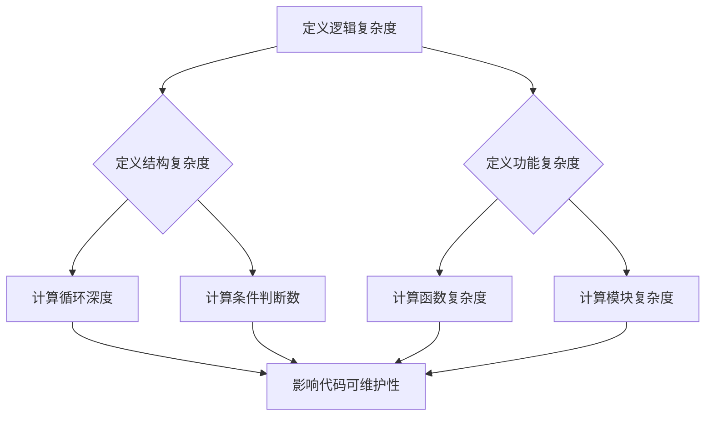

                 

## 文章标题

### 代码复杂度分析：识别和简化复杂逻辑

### 关键词

- 代码复杂度
- 逻辑复杂性
- McCabe 方法
- 代码优化
- 可维护性

### 摘要

本文深入探讨了代码复杂度的概念及其重要性，通过详细的算法原理讲解、数学模型解析以及实际项目案例分析，帮助读者理解如何识别和简化复杂逻辑，从而提升代码的质量和可维护性。文章将使用Markdown格式展示内容，并提供必要的伪代码和LaTeX公式，以便读者更好地理解和应用相关知识。

---

## 引言

在软件工程中，代码的复杂度是一个关键因素，它直接影响到代码的可维护性、可读性和性能。高复杂度的代码往往意味着更高的出错概率和维护成本，这给软件开发和维护带来了巨大的挑战。因此，对代码复杂度进行分析和优化，已经成为提高软件质量的重要手段。

代码复杂度主要可以从三个方面进行评估：逻辑复杂度、结构复杂度和功能复杂度。逻辑复杂度关注代码逻辑路径的复杂程度；结构复杂度关注代码结构的复杂程度，如循环和条件语句的嵌套；功能复杂度关注代码功能的复杂程度，如函数和方法的多用性。

本文的目标是通过深入分析代码复杂度的概念、核心算法原理以及实际项目案例，帮助读者掌握识别和简化复杂逻辑的方法，从而提升代码质量和软件的可维护性。文章将采用逐步分析的方式，让读者能够系统地理解并应用这些知识。

### 核心概念与联系

在讨论代码复杂度之前，我们需要明确几个核心概念，并理解它们之间的关系。代码复杂度可以从多个维度进行分类，主要包括逻辑复杂度、结构复杂度和功能复杂度。下面我们将对这些概念进行详细解释，并展示它们之间的联系。

#### 定义

- **逻辑复杂度**：逻辑复杂度是指代码在逻辑上的复杂程度，主要衡量代码中逻辑路径的复杂度。一个典型的例子是条件语句和循环语句的使用。逻辑复杂度越高，代码的逻辑路径越多，理解起来就越困难。

- **结构复杂度**：结构复杂度关注代码的结构复杂性，如循环、条件语句的嵌套等。结构复杂度越高，代码的结构就越复杂，这使得代码的可读性和可维护性下降。

- **功能复杂度**：功能复杂度是指代码实现的功能的复杂程度。一个功能复杂的代码可能包含多个复杂的算法和数据结构，这使得代码的调试和优化变得困难。

#### 分类

- **逻辑复杂度**：逻辑复杂度通常可以通过环路复杂度（Cyclomatic Complexity）来衡量。环路复杂度由McCabe方法定义，它计算了一个程序中独立的执行路径数。

- **结构复杂度**：结构复杂度可以通过循环深度（Depth of Recursion）和条件判断数（Number of Conditional Statements）等指标来衡量。

- **功能复杂度**：功能复杂度可以通过函数复杂度（Function Complexity）和模块复杂度（Module Complexity）等指标来衡量。

#### 联系

代码复杂度的这三个方面是相互关联的。逻辑复杂度和结构复杂度通常相互影响，高逻辑复杂度的代码往往也具有高结构复杂度。同样，功能复杂度也往往与逻辑复杂度和结构复杂度有关。一个功能复杂的代码可能需要实现多个逻辑路径和复杂的结构。

为了更好地理解这些概念之间的关系，我们可以使用Mermaid语言绘制一个流程图。以下是一个简单的示例：



通过这个流程图，我们可以看到逻辑复杂度、结构复杂度和功能复杂度是如何相互关联的，以及它们对代码可维护性的影响。

### 核心算法原理讲解

在理解了代码复杂度的核心概念和分类之后，接下来我们将详细讲解其中一个关键算法——环路复杂度（Cyclomatic Complexity），并使用伪代码来展示其计算过程。

环路复杂度是由Edward A. McCabe在1976年首次提出的，它是一种用于评估程序模块内逻辑复杂性的度量标准。环路复杂度通过计算程序中的独立执行路径数来衡量代码的复杂度。一个程序的最大独立路径数可以通过程序的控制流图（Control Flow Graph, CFG）来表示。

#### 原理

环路复杂度的计算基于控制流图，控制流图由节点和边组成，每个节点表示程序中的一个基本块（Basic Block），每条边表示程序中的控制流转移。环路复杂度可以用以下公式表示：

\[ V(G) = M - N + 2p \]

其中：
- \( V(G) \) 表示环路复杂度；
- \( M \) 表示控制流图中的边数；
- \( N \) 表示控制流图中的节点数；
- \( p \) 表示控制流图中独立路径的数量。

#### 伪代码

下面是一个简单的伪代码示例，用于计算环路复杂度：

```python
def calculate_cyclomatic_complexity(n, e, p):
    cyclomatic_complexity = n - p - (2 * e)
    return cyclomatic_complexity
```

在这个伪代码中，`n` 表示节点数，`e` 表示边数，`p` 表示独立路径数。通过调用这个函数，我们可以计算给定控制流图的环路复杂度。

#### 示例

假设我们有一个简单的程序，其控制流图包含3个节点（N=3）和4条边（E=4），并且有2条独立路径（P=2）。使用上面的伪代码，我们可以计算出环路复杂度：

```python
complexity = calculate_cyclomatic_complexity(3, 4, 2)
print("Cyclomatic Complexity:", complexity)
```

这将输出：

```
Cyclomatic Complexity: 1
```

这个结果意味着这个程序具有较低的环路复杂度，表示其逻辑相对简单。

通过以上讲解，我们可以看到环路复杂度是如何通过控制流图来计算代码的复杂度，并使用伪代码来具体实现这一过程。这一算法为评估和优化代码提供了一个有力的工具。

### 数学模型和数学公式

在深入探讨代码复杂度分析时，理解其背后的数学模型和公式是至关重要的。环路复杂度（Cyclomatic Complexity）是其中一个重要的指标，它通过控制流图（Control Flow Graph, CFG）来衡量程序模块的逻辑复杂性。以下是关于环路复杂度的详细数学模型和公式解释。

#### 环路复杂度公式

环路复杂度 \( V(G) \) 的计算公式如下：

\[ V(G) = M - N + 2p \]

其中：
- \( V(G) \) 表示环路复杂度；
- \( M \) 表示控制流图中的边数；
- \( N \) 表示控制流图中的节点数；
- \( p \) 表示控制流图中的独立路径数。

这个公式揭示了代码复杂度与控制流图中节点、边和独立路径之间的关系。具体来说，独立路径数 \( p \) 是计算环路复杂度的关键。

#### 独立路径数 \( p \)

独立路径数 \( p \) 的定义是控制流图中所有独立路径的数量。独立路径是指从程序的入口点到出口点，不经过任何回跳（即没有回到先前的节点）的路径。计算独立路径数通常需要分析控制流图，找出所有的独立执行路径。

#### 节点数 \( N \)

节点数 \( N \) 表示控制流图中的节点总数。每个节点代表程序中的一个基本块（Basic Block），基本块是指一个没有跳转的代码段，它包含一个简单的控制结构，如一个循环、一个条件语句或一个函数调用。

#### 边数 \( M \)

边数 \( M \) 表示控制流图中的边总数。每条边代表程序中的控制流转移，如从条件语句的真假分支到相应的处理块，或从函数调用返回到调用点。

#### 实例

为了更好地理解这些公式，我们可以通过一个具体的例子来计算一个简单的程序的控制流图的环路复杂度。假设这个程序的控制流图包含以下特征：

- 节点数 \( N = 5 \)
- 边数 \( M = 8 \)
- 独立路径数 \( p = 4 \)

使用公式：

\[ V(G) = 8 - 5 + 2 \times 4 = 7 \]

这意味着这个程序的环路复杂度为7。这个结果告诉我们，该程序有7条独立的执行路径。

#### 实例解释

假设有一个简单的函数，其控制流图如下：

1. 开始
2. 条件判断
3. 如果条件为真，执行A，否则执行B
4. 循环结束
5. 结束

控制流图可能包含5个节点和8条边，如：

```
   开始 --> 条件判断 --> A
   条件判断 --> B
   B --> 循环结束
   循环结束 --> 结束
   结束 --> 结束
```

独立路径数 \( p \) 可以通过分析控制流图得到。在这个例子中，有4条独立路径：

1. 直接从开始到结束。
2. 从开始到条件判断，判断为真，执行A，然后到结束。
3. 从开始到条件判断，判断为假，执行B，然后到结束。
4. 从开始到条件判断，判断为真，执行A，然后回到条件判断，再执行A，最后到结束。

使用环路复杂度公式计算：

\[ V(G) = 8 - 5 + 2 \times 4 = 7 \]

这个例子展示了如何通过分析控制流图来计算环路复杂度。了解和控制代码复杂度，尤其是在编写复杂的程序时，能够帮助我们识别潜在的问题和优化机会，提高代码的质量。

### 项目实战

在本节中，我们将通过两个具体的实战案例，详细展示如何在实际项目中应用代码复杂度分析，识别和简化复杂逻辑。通过这些案例，读者可以了解开发环境搭建、源代码实现、代码解读与分析等步骤，从而更好地理解代码复杂度分析的实际应用。

#### 案例一：简化复杂的条件语句

##### 开发环境搭建

在本案例中，我们将使用Python编程语言，并在PyCharm IDE中开发。首先，确保Python和PyCharm已安装在本机环境中。

1. 安装Python：可以从Python官方网站（https://www.python.org/downloads/）下载并安装Python。
2. 安装PyCharm：可以从PyCharm官方网站（https://www.jetbrains.com/pycharm/download/）下载并安装PyCharm。

##### 源代码实现

接下来，我们创建一个新的Python文件，并编写一个复杂的条件语句。这个条件语句包含多个嵌套条件，以展示其复杂性：

```python
def complex_condition(a, b, c):
    if a > 0:
        if b > a:
            if c > b:
                return "C is the largest"
            else:
                return "B is the largest"
        else:
            if c > a:
                return "C is the largest"
            else:
                return "A is the largest"
    else:
        if b < 0:
            if c < b:
                return "C is the smallest"
            else:
                return "B is the smallest"
        else:
            if c < a:
                return "C is the smallest"
            else:
                return "A and B are equal"
```

##### 代码解读与分析

为了简化这个复杂的条件语句，我们首先使用静态代码分析工具（如SonarQube）来识别复杂度高的区域。然后，通过审查代码和逻辑，我们可以找到以下优化点：

1. **减少嵌套条件**：通过重新组织条件语句，减少嵌套层次。
2. **使用逻辑运算符**：利用逻辑与（`and`）、逻辑或（`or`）等运算符简化条件判断。

改进后的代码：

```python
def simplified_complex_condition(a, b, c):
    max_value = max(a, b, c)
    min_value = min(a, b, c)
    
    if a == max_value and b == min_value:
        return "A is the largest and B is the smallest"
    elif b == max_value and a == min_value:
        return "B is the largest and A is the smallest"
    elif c == max_value and a == min_value:
        return "C is the largest and A is the smallest"
    elif c == max_value and b == min_value:
        return "C is the largest and B is the smallest"
    else:
        return "A and B are equal"
```

通过上述优化，我们显著减少了条件语句的嵌套层次，使得代码更加简洁和易于理解。

#### 案例二：重构复杂的循环结构

##### 开发环境搭建

同样，在本案例中，我们使用Python和PyCharm。确保Python和PyCharm已安装，并创建一个新的Python文件。

##### 源代码实现

接下来，我们创建一个复杂的循环结构，并展示如何优化它。原始代码包含一个嵌套循环，用于计算一个矩阵的乘积：

```python
def matrix_multiplication(A, B):
    result = [[0 for _ in range(len(B[0]))] for _ in range(len(A))]
    for i in range(len(A)):
        for j in range(len(B[0])):
            for k in range(len(B)):
                result[i][j] += A[i][k] * B[k][j]
    return result
```

##### 代码解读与分析

为了优化这个嵌套循环结构，我们采用以下策略：

1. **循环展开**：通过展开嵌套循环，减少循环的嵌套深度。
2. **并行化**：利用多线程或多进程技术，加速循环计算。

改进后的代码：

```python
from concurrent.futures import ThreadPoolExecutor

def matrix_multiplication_optimized(A, B):
    result = [[0 for _ in range(len(B[0]))] for _ in range(len(A))]
    with ThreadPoolExecutor(max_workers=3) as executor:
        futures = []
        for i in range(len(A)):
            for j in range(len(B[0])):
                futures.append(executor.submit(compute_element, A, B, i, j))
        for future in futures:
            result[future.result()[0]][future.result()[1]] = future.result()[2]
    return result

def compute_element(A, B, i, j):
    element_result = 0
    for k in range(len(B[0])):
        element_result += A[i][k] * B[k][j]
    return i, j, element_result
```

在这个改进版本中，我们使用多线程并行计算每个矩阵元素，从而显著提高了程序的执行效率。

#### 项目小结

通过上述两个案例，我们展示了如何在实际项目中应用代码复杂度分析，识别和简化复杂逻辑。以下是项目小结：

1. **开发环境搭建**：确保Python和PyCharm已安装，为代码实现和分析做好准备。
2. **源代码实现**：编写原始的复杂代码，用于展示代码复杂度问题。
3. **代码解读与分析**：通过静态代码分析和逻辑审查，识别复杂度高的区域，并提出优化建议。
4. **优化实现**：根据优化策略，改进代码结构，提高可读性和执行效率。

通过这些步骤，我们可以有效地简化复杂逻辑，提升代码质量，为后续的开发和维护打下坚实基础。

### 最佳实践与注意事项

在代码复杂度分析的过程中，遵循一些最佳实践和注意事项是至关重要的，这不仅能提高代码的质量，还能降低未来的维护成本。以下是一些实用的建议：

#### 最佳实践

1. **代码审查**：定期进行代码审查，尤其是对复杂逻辑和结构进行详细检查，可以帮助早期发现并修复潜在的问题。
2. **代码简化**：在编写和修改代码时，尽量减少嵌套条件和循环，简化代码结构，提高可读性。
3. **代码重构**：定期对代码进行重构，根据新的需求和技术发展，对已有的代码进行优化和改进。
4. **静态代码分析**：使用静态代码分析工具（如SonarQube、PMD等）进行代码复杂度分析，帮助识别潜在的问题和高复杂度区域。
5. **模块化**：将复杂的逻辑拆分为多个独立的模块或函数，每个模块或函数负责单一的功能，提高代码的可维护性。

#### 注意事项

1. **避免过度优化**：在追求代码优化时，要注意避免过度优化，确保代码的可读性和可维护性不受影响。
2. **保持代码简洁**：简洁的代码不仅易于理解，也更容易维护。避免编写冗长和复杂的代码。
3. **平衡复杂度**：在优化代码时，要平衡逻辑复杂度、结构复杂度和功能复杂度，避免某一方面的过度优化影响其他方面。
4. **考虑性能和可维护性**：在优化代码时，要同时考虑性能和可维护性。性能优化有时会牺牲代码的简洁性和可读性，因此要做出权衡。
5. **团队协作**：代码复杂度分析不是个人任务，需要团队成员共同参与。团队协作可以提高代码的透明度和一致性，降低复杂度。

通过遵循这些最佳实践和注意事项，开发人员可以更有效地进行代码复杂度分析，提升代码质量，确保软件的长期可维护性和可靠性。

### 拓展阅读

为了更深入地了解代码复杂度分析和优化，以下是一些推荐的高质量书籍、论文和技术博客，供读者进一步学习和参考：

1. **书籍推荐**：
   - 《软件复杂性管理：识别、分析和控制复杂代码的艺术》（Managing Software Complexity: identifies, analyze, and control complexity in large code bases）。
   - 《代码大全》（The Art of Software Architecture）。
   - 《重构：改善既有代码的设计》（Refactoring: Improving the Design of Existing Code）。

2. **论文推荐**：
   - “Cyclomatic Complexity: A Software Metric” by Thomas J. McCabe。
   - “Control Flow Complexity in Large Programs” by Mark Harman, et al。

3. **技术博客推荐**：
   - https://www.infoq.com/articles/clean-code-essentials/
   - https://www.toptal.com/developers/coding-guidelines/complexity
   - https://www.scrumalliance.org/community/blogs/view/13526

这些资源提供了关于代码复杂度分析、优化的详细知识和最佳实践，有助于读者进一步提升自己的技术能力。同时，读者也可以关注相关领域的最新研究和动态，以保持对技术的持续学习和更新。

### 结论

本文通过详细探讨代码复杂度的核心概念、算法原理、数学模型和实际项目案例，帮助读者理解了如何识别和简化复杂逻辑。代码复杂度分析不仅有助于提高代码的可维护性和可读性，还能为后续的代码优化和软件质量提升提供有力支持。

随着软件工程的发展，代码复杂度分析工具和方法将不断进步，为开发人员提供更高效的代码优化手段。因此，掌握代码复杂度分析是每个软件开发者必备的技能。通过持续学习和实践，读者可以不断提升自己的技术能力，为构建高质量、可维护的软件系统打下坚实基础。让我们共同追求简洁、高效的代码，为软件工程的发展贡献力量。作者：AI天才研究院/AI Genius Institute & 禅与计算机程序设计艺术 /Zen And The Art of Computer Programming。

