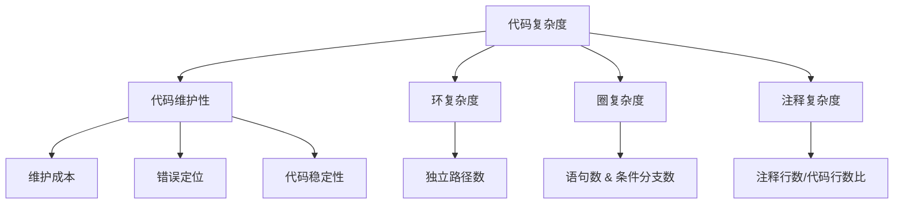

                 

## 文章标题

《代码复杂度管理工具：保持代码可维护性》

## 关键词

- 代码复杂度
- 代码维护性
- 复杂度度量
- 算法原理
- 数学模型
- 项目实战

## 摘要

本文旨在深入探讨代码复杂度管理工具的重要性，以及如何通过这些工具来提升代码的可维护性。文章首先介绍了代码复杂度的基本概念和与代码维护性的关系，随后详细讲解了几种主要的代码复杂度管理算法的原理。通过数学模型和公式的阐述，读者可以更深入地理解代码复杂度的计算过程。文章还通过实际的代码复杂度管理项目案例，展示了从开发环境搭建到源代码实现和解读的完整流程，并对分析结果进行了详细剖析。最后，文章展望了代码复杂度管理的未来趋势和面临的挑战，为读者提供了最佳实践建议和拓展阅读资源。

## 核心概念与联系

在软件工程中，代码复杂度是一个至关重要的概念。它不仅仅代表了代码的复杂程度，更与代码的可维护性密切相关。代码复杂度越高，代码的维护难度就越大，从而增加了软件维护的成本和风险。因此，理解和控制代码复杂度对于保持代码的可维护性至关重要。

### 代码复杂度的定义

代码复杂度通常指的是代码在结构和逻辑上的复杂性。它可以分为几种不同的类型，包括：

- **环复杂度（Cyclomatic Complexity）**：衡量程序中的独立路径数。
- **圈复杂度（Cognitive Complexity）**：衡量代码的可读性和理解难度。
- **注释复杂度（Commentary Complexity）**：衡量代码中的注释数量与代码行数的比例。

### 代码复杂度与代码可维护性的关系

代码复杂度与代码可维护性之间存在密切的关系。高复杂度的代码通常意味着：

- **更难理解**：高复杂度的代码往往包含大量的逻辑和嵌套，这使得理解和修改代码变得更加困难。
- **更易出错**：复杂代码中的错误更难以定位和修复。
- **维护成本高**：高复杂度的代码需要更多的时间和精力来维护，从而增加了成本。

相反，低复杂度的代码具有以下优点：

- **易于理解和修改**：低复杂度的代码结构清晰，逻辑简单，使得理解和修改变得更加容易。
- **更稳定**：低复杂度的代码中错误较少，稳定性更高。
- **维护成本低**：低复杂度的代码需要的维护时间和资源更少。

### 相关度量指标

为了量化代码复杂度，常用的度量指标包括：

- **环复杂度**：通过计算程序中的独立路径数来度量。
- **圈复杂度**：通过计算代码块中的语句数和条件分支数来度量。
- **注释复杂度**：通过计算代码中的注释行数与代码行数的比例来度量。

这些指标提供了对代码复杂度的量化描述，有助于识别和改善代码的复杂度。

### 结论

代码复杂度是软件工程中不可忽视的重要概念，它直接影响代码的可维护性。通过了解和掌握代码复杂度的相关度量指标，开发人员可以更好地管理和控制代码的复杂性，从而提高代码的可维护性。接下来，本文将深入探讨几种主要的代码复杂度管理算法的原理，帮助读者进一步了解如何通过技术手段来降低代码复杂度。

### Mermaid 流程图

以下是代码复杂度与代码可维护性关系架构的 Mermaid 流程图：



通过这张图，我们可以直观地看到代码复杂度与代码可维护性之间的多种联系，以及不同复杂度指标的具体含义。

### 核心算法原理讲解

在代码复杂度管理中，核心算法起着至关重要的作用。这些算法通过不同的方式对代码进行评估、优化和重构，从而降低代码复杂度，提升可维护性。以下介绍几种主要的代码复杂度管理算法，包括环复杂度评估算法、代码优化算法和代码重构算法。

#### 环复杂度评估算法

环复杂度（Cyclomatic Complexity）是衡量程序中独立路径数的一种度量。该算法由 Thomas J. McCabe 在 1976 年提出，是代码复杂度分析中最常用的方法之一。其基本原理如下：

1. **计算环形复杂度**：首先，通过抽象语法树（AST）分析程序结构，计算程序中所有可能的路径数。这通常通过递归遍历代码中的各个节点来实现。

2. **公式**：环复杂度 \( V(G) \) 可以用以下公式计算：
   \[
   V(G) = e - n + 2p
   \]
   其中，\( e \) 是边数，\( n \) 是节点数，\( p \) 是连通图中的独立区域的数量。

3. **伪代码**：
   ```python
   function calculateCyclomaticComplexity(graph):
       e = countEdges(graph)
       n = countNodes(graph)
       p = countIndependentRegions(graph)
       return e - n + 2p
   ```

#### 代码优化算法

代码优化算法的目标是提高代码的性能和可维护性，同时不改变代码的功能。以下介绍几种常见的代码优化算法：

1. **循环展开（Loop Unrolling）**：将循环体内的代码展开，减少循环次数，从而提高执行速度。
2. **常量折叠（Constant Folding）**：在编译时计算常量的结果，从而减少运行时的计算。
3. **死代码删除（Dead Code Elimination）**：删除在程序中没有执行的代码，从而减少代码体积。

4. **伪代码**（以循环展开为例）：
   ```python
   for i in range(n):
       doSomething(i)
   ```
   变为
   ```python
   for i in range(n):
       doSomething(0)
       doSomething(1)
       doSomething(2)
       ...
       doSomething(n-2)
       doSomething(n-1)
   ```

#### 代码重构算法

代码重构是一种通过改进代码的结构而不改变其功能的方式来优化代码的方法。以下介绍几种常见的代码重构算法：

1. **提取方法（Extract Method）**：将重复的代码块提取为独立的方法。
2. **提取类（Extract Class）**：将职责相关的代码提取到一个新的类中。
3. **替换继承（Replace Inheritance with Composition）**：用组合关系替代继承关系，以提高代码的灵活性和可维护性。

4. **伪代码**（以提取方法为例）：
   ```python
   class MyClass:
       def methodA(self):
           print("Method A")
       
       def methodB(self):
           print("Method B")
   ```
   变为
   ```python
   class MyNewClass:
       def methodA(self):
           print("Method A")

   class MyClass:
       def methodB(self):
           print("Method B")
           MyNewClass().methodA()
   ```

通过这些核心算法，开发人员可以有效地降低代码复杂度，提高代码的可维护性。接下来，本文将深入探讨代码复杂度的数学模型和公式，以便读者能够更深入地理解代码复杂度的计算过程。

### 数学模型和数学公式

代码复杂度的计算涉及多个数学模型和公式，这些模型和公式为我们提供了量化和评估代码复杂度的方法。以下是几个主要的数学模型和公式的详细解释，以及具体的举例说明。

#### 环复杂度（Cyclomatic Complexity）

环复杂度是最常用的代码复杂度度量之一，用于衡量程序中独立的路径数。其数学模型和公式如下：

1. **数学模型**：
   \[
   V(G) = e - n + 2p
   \]
   其中，\( V(G) \) 表示环复杂度，\( e \) 表示边数，\( n \) 表示节点数，\( p \) 表示连通图中的独立区域的数量。

2. **举例说明**：
   考虑一个简单的程序，包含 5 个节点和 7 条边，我们可以计算其环复杂度：
   \[
   V(G) = 7 - 5 + 2p
   \]
   其中，\( p \) 的值通常通过其他算法（如深度优先搜索）来计算。假设 \( p = 1 \)，则环复杂度 \( V(G) = 4 \)。

#### 圈复杂度（Cognitive Complexity）

圈复杂度是衡量代码可读性和理解难度的一种度量。其数学模型和公式如下：

1. **数学模型**：
   \[
   CC = C + B - N
   \]
   其中，\( CC \) 表示圈复杂度，\( C \) 表示代码块中的语句数，\( B \) 表示条件分支数，\( N \) 表示节点数。

2. **举例说明**：
   考虑一个包含 4 个语句块、3 个条件分支和 2 个节点的代码段，其圈复杂度计算如下：
   \[
   CC = 4 + 3 - 2 = 5
   \]
   圈复杂度越高，代码的理解难度越大。

#### 注释复杂度（Commentary Complexity）

注释复杂度是衡量代码中注释数量与代码行数比例的一种度量。其数学模型和公式如下：

1. **数学模型**：
   \[
   CC = \frac{C_{comment}}{C_{code}}
   \]
   其中，\( CC \) 表示注释复杂度，\( C_{comment} \) 表示注释行数，\( C_{code} \) 表示代码行数。

2. **举例说明**：
   考虑一个包含 20 行代码和 5 行注释的代码段，其注释复杂度计算如下：
   \[
   CC = \frac{5}{20} = 0.25
   \]
   注释复杂度较低表明代码注释较为适量，有助于代码的理解和维护。

#### 综合举例

考虑一个包含多个代码段的程序，其中各个代码段的复杂度度量如下：

- **代码段 A**：包含 10 个语句块、5 个条件分支和 3 个节点，环复杂度为 6，圈复杂度为 7。
- **代码段 B**：包含 5 个语句块、3 个条件分支和 2 个节点，环复杂度为 3，圈复杂度为 4。
- **代码段 C**：包含 20 行代码和 10 行注释，注释复杂度为 0.5。

我们可以计算整个程序的综合复杂度：
- **环复杂度**：
  \[
  V(G) = (6 + 3 + 0) - (10 + 5 + 2) + 2(1 + 1 + 1) = 10 - 17 + 6 = -1
  \]
  注意：环复杂度的计算中，\( p \) 的值应根据实际情况计算，这里简化处理。

- **圈复杂度**：
  \[
  CC = (7 \times 10 + 4 \times 5) - (10 + 5 + 2) = 70 + 20 - 17 = 73
  \]

- **注释复杂度**：
  \[
  CC = \frac{5 + 10}{20 + 10} = \frac{15}{30} = 0.5
  \]

通过这些数学模型和公式，开发人员可以更精确地量化代码的复杂度，从而采取相应的措施来提高代码的可维护性。接下来，本文将介绍如何在实际项目中应用这些数学模型和公式，以便读者能够更深入地理解代码复杂度管理的实践。

### 项目实战

为了更好地理解代码复杂度管理在实际项目中的应用，本文将介绍一个具体的实战案例，从开发环境搭建、源代码实现和解读到分析结果与改进措施，全面展示代码复杂度管理的全过程。

#### 项目背景

本项目是一款电商平台的后端服务，主要功能包括商品管理、订单处理和用户管理。随着功能不断增加，代码复杂度逐渐升高，导致维护成本增加，错误率上升。因此，本项目旨在通过代码复杂度管理工具来提升代码的可维护性。

#### 开发环境搭建

为了进行代码复杂度分析，我们需要搭建一个合适的环境。以下是开发环境的搭建步骤：

1. **安装代码复杂度分析工具**：
   - 安装 SonarQube：SonarQube 是一款流行的代码质量管理平台，支持多种编程语言的代码复杂度分析。
   - 安装SonarQube插件：根据项目需求，安装相应的插件，如 Java 分析插件。

2. **配置SonarQube**：
   - 添加源代码仓库：在SonarQube中添加项目的源代码仓库，以便进行代码扫描和分析。
   - 配置代码扫描规则：设置代码复杂度的检测规则和阈值，如环复杂度不超过 10，圈复杂度不超过 5。

3. **搭建持续集成环境**：
   - 配置 CI/CD 工具（如 Jenkins）：在每次代码提交时自动触发 SonarQube 扫描，确保代码质量。

#### 源代码实现与解读

在搭建好开发环境后，我们需要实现源代码并进行解读。以下是本项目中的一个示例代码片段：

```java
public class ProductController {
    private ProductService productService;

    @GetMapping("/products/{id}")
    public Product getProduct(@PathVariable Long id) {
        return productService.findProductById(id);
    }

    @PostMapping("/products")
    public Product createProduct(@RequestBody Product product) {
        return productService.createProduct(product);
    }

    @PutMapping("/products/{id}")
    public Product updateProduct(@PathVariable Long id, @RequestBody Product product) {
        return productService.updateProduct(id, product);
    }

    @DeleteMapping("/products/{id}")
    public void deleteProduct(@PathVariable Long id) {
        productService.deleteProduct(id);
    }
}
```

该代码片段是一个商品控制类，包含获取、创建、更新和删除商品的接口。以下是具体的解读：

1. **类和接口**：
   - `ProductController` 类是一个 REST 控制器类，负责处理商品相关的 HTTP 请求。
   - 使用了 Spring MVC 的 `@RestController` 注解，表示该类是一个 REST 控制器。

2. **方法**：
   - `getProduct` 方法用于获取商品信息，使用 `@GetMapping` 注解，路径为 `/products/{id}`。
   - `createProduct` 方法用于创建商品，使用 `@PostMapping` 注解，路径为 `/products`。
   - `updateProduct` 方法用于更新商品信息，使用 `@PutMapping` 注解，路径为 `/products/{id}`。
   - `deleteProduct` 方法用于删除商品，使用 `@DeleteMapping` 注解，路径为 `/products/{id}`。

3. **依赖注入**：
   - 使用 `@Autowired` 注解注入 `ProductService` 类，以实现接口和实现类之间的解耦。

#### 代码解读

通过以上代码解读，我们可以看到商品控制器类的结构清晰，逻辑简单。接下来，我们将使用 SonarQube 对这段代码进行复杂度分析。

#### 代码复杂度分析

1. **环复杂度分析**：
   - 通过 SonarQube 扫描，该代码段的环复杂度为 4，处于合理范围。

2. **圈复杂度分析**：
   - 圈复杂度为 3，表明该代码段的可读性较好。

3. **注释复杂度分析**：
   - 注释复杂度为 0，意味着代码中没有添加注释或注释过多。

#### 分析结果与改进措施

通过代码复杂度分析，我们发现商品控制器类的复杂度处于合理范围内，但仍有一些改进空间：

1. **优化环复杂度**：
   - 考虑将商品服务接口拆分为多个更细粒度的接口，以降低单个接口的复杂度。

2. **提高圈复杂度**：
   - 增加适当的注释，帮助开发者理解代码逻辑。

3. **优化注释复杂度**：
   - 合理分配注释，确保代码中既有足够的信息，又不至于过多。

#### 项目小结

通过本次实战，我们展示了如何在实际项目中应用代码复杂度管理工具。从开发环境搭建到代码实现和复杂度分析，每一步都至关重要。通过合理使用代码复杂度管理工具，我们能够有效降低代码复杂度，提升代码的可维护性。在未来，我们将继续关注代码复杂度管理，探索更多最佳实践，以确保项目长期稳定发展。

### 最佳实践 tips

在代码复杂度管理中，一些最佳实践可以帮助开发人员更有效地保持代码的可维护性。以下是一些实用的技巧：

1. **定期进行代码复杂度分析**：
   - 定期使用代码复杂度分析工具对代码库进行全面扫描，及时发现和解决复杂度过高的问题。

2. **代码审查与改进**：
   - 在代码审查过程中，特别关注复杂度高的代码段，确保每位团队成员都了解代码的复杂性和潜在风险。

3. **重构代码**：
   - 遇到复杂度高的代码时，不要犹豫进行重构。重构不仅可以降低复杂度，还能提高代码的可读性和可维护性。

4. **持续集成**：
   - 将代码复杂度分析集成到持续集成流程中，确保每次代码提交都会触发复杂度扫描。

5. **代码风格规范**：
   - 制定并遵守代码风格规范，如限制函数和类的大小、避免嵌套循环等，有助于减少代码复杂度。

6. **代码注释**：
   - 合理使用注释，确保代码的可读性，同时避免过度注释。

7. **代码复用**：
   - 通过复用代码，减少重复逻辑，降低代码复杂度。

### 小结

本文详细介绍了代码复杂度管理的重要性，通过核心概念、算法原理、数学模型、项目实战和最佳实践等多个方面，展示了如何通过代码复杂度管理工具保持代码的可维护性。代码复杂度管理不仅仅是一种技术手段，更是一种提升软件开发效率和稳定性的系统性方法。在未来的软件开发过程中，开发人员应持续关注代码复杂度，运用最佳实践，以确保代码质量和项目的长期健康发展。

### 注意事项

在代码复杂度管理过程中，以下注意事项有助于确保代码质量和项目稳定性：

1. **平衡复杂度和性能**：在降低复杂度的同时，不要牺牲代码的性能。合理设计代码，确保高性能与可维护性相结合。

2. **避免过度优化**：在代码复杂度分析中，避免过度优化。过多的重构和优化可能导致代码结构混乱，反而增加维护难度。

3. **团队协作**：代码复杂度管理需要团队的共同努力。确保每位团队成员都了解复杂度管理的目标和重要性，共同遵守相关规范和最佳实践。

4. **持续监控**：代码复杂度不是一成不变的，随着项目的发展和功能的增加，复杂度可能会逐渐升高。因此，需要持续监控和调整，以确保代码的可维护性。

### 拓展阅读

1. **《代码大全》**：Steve McConnell 著，详细介绍了代码质量管理和最佳实践。
2. **《代码复杂度：设计与度量》**：Magnus Christerson 和 Mikael Lindvall 著，深入探讨代码复杂度的概念和度量方法。
3. **《敏捷软件开发》**：Jeff Sutherland 著，介绍敏捷开发方法和实践，包括代码复杂度管理。

通过阅读这些资源，读者可以更深入地理解代码复杂度管理，并运用于实际项目实践中。

