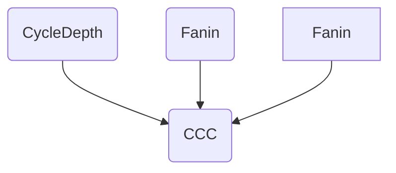

                 

### 引言

在现代软件开发领域，代码复杂度管理成为了确保系统长期可维护性的关键因素。随着软件系统的规模和复杂性不断增长，代码复杂度也在逐步增加，这给系统的维护带来了巨大的挑战。代码复杂度指的是代码中某些特性使得代码难以理解、测试、维护或修改的程度。常见的复杂度度量包括循环深度、扇出、扇入、环路复杂度等。

系统可维护性指的是系统在经历修改、升级或故障恢复后，能够快速恢复正常状态且不影响其他部分的能力。一个可维护的系统不仅能够有效地应对变化，还能够保证其稳定性和可靠性。因此，代码复杂度与系统可维护性之间存在着密切的联系。

**代码复杂度**，指的是代码中的某些特性使得代码难以理解、测试、维护或修改的程度。这些特性可能包括嵌套循环、条件判断、函数调用、类继承等多个方面。代码复杂度越高，代码的可读性和可维护性就越低。

**系统可维护性**，指的是系统在经历修改、升级或故障恢复后，能够快速恢复正常状态且不影响其他部分的能力。一个可维护的系统应该具备以下特点：易于理解、易于测试、易于修改、高内聚低耦合等。

### 管理代码复杂度的必要性

随着软件系统的复杂度不断增加，代码复杂度管理变得尤为重要。首先，复杂度高的代码难以理解。对于新加入的开发人员或项目维护人员来说，阅读和理解复杂代码需要花费大量的时间和精力。这不仅降低了开发效率，还增加了出错的可能性。

其次，复杂度高的代码测试难度大。在复杂代码中，隐藏的缺陷往往难以被发现，导致测试工作变得更加困难。一旦系统出现问题，修复这些问题需要投入大量的人力和时间。

最后，复杂度高的代码维护成本高。在系统运行过程中，需求变化和技术更新是不可避免的。如果代码复杂度高，每次修改都可能导致意想不到的问题，增加维护的难度和成本。

因此，为了确保系统的可维护性，必须对代码复杂度进行有效的管理。这包括制定编码规范、进行代码重构、使用设计模式、编写单元测试、实施持续集成等策略。

### 引言总结

在本文中，我们将深入探讨代码复杂度管理的各个方面，包括其度量方法、对系统的影响、管理策略以及具体应用。通过本文的阅读，读者将了解如何有效地控制代码复杂度，提高系统的可维护性，为软件项目的长期成功奠定基础。

### 代码复杂度度量

在代码复杂度管理中，度量代码复杂度是至关重要的第一步。通过量化的方式来评估代码复杂度，可以帮助开发人员识别出需要优化的部分，从而提升系统的可维护性。常见的代码复杂度度量方法包括循环深度、扇出、扇入和环路复杂度等。

#### 循环深度（Nesting Depth）

循环深度是指代码中嵌套循环的层数。一个简单的循环语句可能只有一层，但多层嵌套的循环会导致代码结构变得复杂。例如：

```python
for i in range(1, 5):
    for j in range(1, i+1):
        print(i, j)
```

在这个例子中，循环深度为2。循环深度越高，代码的可读性和可维护性就越低。因为嵌套循环容易引起混淆，使得逻辑难以追踪。此外，测试和维护这样的代码也变得更加困难。

#### 扇出（Fan-out）

扇出是指一个函数或方法调用的其他函数或方法的数量。高扇出意味着函数或方法调用了很多其他模块，这会导致模块之间的耦合性增加。例如：

```java
public void complexMethod() {
    method1();
    method2();
    method3();
    method4();
    method5();
}
```

在这个例子中，`complexMethod` 的扇出为5。扇出高的方法通常意味着这个方法承担了太多的功能，违反了单一职责原则。这不仅增加了代码的复杂度，还使得方法的可测试性和可维护性降低。

#### 扇入（Fan-in）

扇入是指调用一个函数或方法的其他函数或方法的数量。高扇入通常意味着这个方法被许多其他方法调用，可能导致方法的功能过于复杂，难以维护。例如：

```java
public void method1() {
    // ...
}

public void method2() {
    method1();
    // ...
}

public void method3() {
    method1();
    // ...
}

public void method4() {
    method1();
    // ...
}
```

在这个例子中，`method1` 的扇入为4。高扇入意味着`method1` 的修改需要考虑多个调用方，增加了代码的维护难度。

#### 环路复杂度（Cyclomatic Complexity）

环路复杂度是一个用于评估代码中控制流程复杂性的指标，由软件工程师梅尔曼（Thomas J. McCabe）提出。环路复杂度的计算公式为：

\[ \text{环路复杂度} = \text{E} - \text{N} + (2 \times \text{P}) \]

其中，E是边的数量，N是节点的数量，P是连通图的数量。环路复杂度越高，代码的复杂度就越高，修改和测试的难度也就越大。例如：

```java
public void method() {
    if (condition1) {
        if (condition2) {
            // ...
        } else {
            // ...
        }
    } else {
        // ...
    }
}
```

在这个例子中，我们可以通过画图来计算环路复杂度：

```
      ┌─────> B
      │
      └─────> E
     / \
    A ──>
   /     \
  C────── D
```

在这个流程图中，有5条边（E、B、C、D、A），4个节点（A、B、C、D），1个连通图。因此，环路复杂度为 \(5 - 4 + (2 \times 1) = 3\)。

#### 梅尔曼流程图展示

为了更好地理解代码复杂度度量的关系，我们可以使用梅尔曼流程图（McCabe Process Graph）来可视化代码结构。梅尔曼流程图通过节点和边来表示代码中的条件和分支，使得代码的复杂度一目了然。

例如，下面的Java代码片段：

```java
public void method() {
    if (condition1) {
        if (condition2) {
            // ...
        } else {
            // ...
        }
    } else {
        // ...
    }
}
```

对应的梅尔曼流程图如下：

```
        ┌─────> B
        │
        └─────> E
       / \
      A ──>
     /     \
    C────── D
```

在这个流程图中，每个节点代表代码中的一个基本块，每条边代表代码中的转移。通过这个流程图，我们可以直观地看到代码的结构和复杂度。

### 常见的代码复杂性度量方法总结

通过上述讨论，我们可以总结出以下常见的代码复杂性度量方法：

1. **循环深度（Nesting Depth）**：评估嵌套循环的层数，越高越复杂。
2. **扇出（Fan-out）**：评估函数或方法的调用数量，越高越复杂。
3. **扇入（Fan-in）**：评估调用一个函数或方法的其他函数或方法的数量，越高越复杂。
4. **环路复杂度（Cyclomatic Complexity）**：评估代码中的控制流程复杂性，越高越复杂。

这些度量方法为我们提供了一个量化的视角来评估代码的复杂度，有助于我们识别并优化那些复杂的代码部分。通过这些度量，开发人员可以更好地管理代码复杂度，从而提高系统的可维护性。

### 代码复杂度度量关系图

为了更好地理解代码复杂度各度量方法之间的关系，我们可以使用Mermaid流程图来展示这些度量如何相互作用。以下是代码复杂度度量关系的Mermaid图：



在这个图中，我们可以看到：

- 循环深度（Nesting Depth）直接影响环路复杂度（Cyclomatic Complexity）。
- 扇出（Fan-out）和扇入（Fan-in）虽然不直接计算在环路复杂度中，但它们对代码的整体复杂度有显著影响。
- 环路复杂度（Cyclomatic Complexity）是综合衡量代码复杂度的一个指标。

通过这个Mermaid图，我们可以更清晰地看到各度量方法之间的联系，从而在实际开发过程中更加有效地管理代码复杂度。

### 代码复杂度对理解、测试和维护的影响

代码复杂度对软件开发的各个阶段都有着深远的影响，其中最直接的便是理解、测试和维护。以下将从这些方面详细探讨代码复杂度对软件开发的影响。

#### 对理解的影响

代码复杂度高的代码往往难以理解。复杂度高的代码中，嵌套的循环和条件判断使得逻辑路径变得错综复杂，开发人员需要花费大量的时间和精力来理解代码的意图。例如，一个复杂的循环结构或者条件分支可能会导致逻辑上的混乱，使得阅读代码变得异常困难。

**案例一**：假设有一个具有多层嵌套循环的代码片段，用于计算二维数组的总和：

```python
for i in range(5):
    for j in range(i+1):
        total += array[i][j]
```

在这个例子中，嵌套的循环使得逻辑路径变得复杂，如果一个开发人员初次接触到这段代码，他可能需要花费较长的时间来理解它的含义。这种复杂度增加了代码理解的难度，特别是在团队合作的情况下，新加入的成员需要花费额外的时间来熟悉代码。

#### 对测试的影响

代码复杂度也会显著影响软件的测试工作。复杂度高的代码中，隐藏的缺陷和错误往往难以被发现，导致测试工作变得更加困难。以下是一些具体的案例：

**案例二**：在一个具有高环路复杂度的方法中，控制流的分支和条件判断可能非常复杂，这增加了测试路径的数量。例如：

```java
public void complexMethod() {
    if (condition1) {
        if (condition2) {
            // ...
        } else {
            // ...
        }
    } else {
        // ...
    }
}
```

在这个例子中，如果忽略某些条件分支的测试，那么在后续的使用过程中，这些分支上的潜在缺陷可能会暴露出来，导致系统崩溃或功能异常。因此，测试复杂度高的代码需要编写更多的测试用例，这无疑增加了测试的工作量和难度。

#### 对维护的影响

维护复杂度高的代码也是一项艰巨的任务。代码复杂度高意味着代码的可读性差，修改和扩展变得困难。以下是一些具体的案例：

**案例三**：在一个具有高扇入和高扇出的方法中，修改一个函数可能需要同时修改多个调用方，这不仅增加了修改的难度，还增加了出错的概率。例如：

```java
public void method1() {
    // ...
}

public void method2() {
    method1();
    // ...
}

public void method3() {
    method1();
    // ...
}

public void method4() {
    method1();
    // ...
}
```

在这个例子中，如果需要修改`method1`，那么需要确保`method2`、`method3`、`method4`的调用也正确无误。这种高耦合性使得代码的维护成本大大增加。

**案例四**：在一个具有高环路复杂度的代码片段中，由于逻辑复杂，修改一个简单的功能点可能会引发一系列的副作用。例如：

```java
public void method() {
    if (condition1) {
        if (condition2) {
            // ...
        } else {
            // ...
        }
    } else {
        // ...
    }
}
```

在这个例子中，如果需要增加一个新的功能点，开发人员需要仔细考虑所有的条件分支和逻辑路径，以确保新增的功能不会破坏现有的逻辑。这种复杂性使得代码的维护工作变得异常困难。

#### 总结

代码复杂度对理解、测试和维护都有着深远的影响。高复杂度的代码不仅难以理解，测试难度也显著增加，同时维护成本也大幅上升。因此，为了确保系统的长期可维护性，开发人员需要重视代码复杂度的管理，采取有效的策略来降低代码复杂度，提高系统的可维护性。

### 案例分析：复杂代码对系统维护的负面影响

在软件开发过程中，复杂的代码往往会导致一系列的问题，对系统的维护产生严重的负面影响。以下通过具体案例，分析复杂代码对系统维护的多个方面的影响，并提出相应的解决方案。

#### 案例一：多层嵌套循环

在一个大型项目中，开发人员为了优化程序的性能，使用了多层嵌套循环来处理数据。这种做法虽然在某些情况下可以提高程序的运行效率，但也极大地增加了代码的复杂度。以下是一个嵌套循环的例子：

```python
for i in range(100):
    for j in range(i+1):
        for k in range(j+1):
            if some_condition:
                # 复杂的计算和处理
                pass
```

**问题分析**：这个嵌套循环的深度达到三层，逻辑路径复杂，使得代码难以理解。在后续的维护过程中，一旦需要修改或扩展这部分代码，开发人员需要花费大量时间来梳理逻辑，确保修改不会引入新的错误。

**解决方案**：为了降低复杂度，可以将多层嵌套循环重构为递归函数，这样不仅简化了代码结构，还提高了代码的可读性和可维护性。重构后的代码如下：

```python
def process_data(i, j, k):
    if some_condition:
        # 复杂的计算和处理
        pass

def process_layer(i):
    for j in range(i+1):
        for k in range(j+1):
            process_data(i, j, k)

def main():
    for i in range(100):
        process_layer(i)

main()
```

通过这种重构，嵌套循环的逻辑变得更加清晰，代码的复杂度显著降低。

#### 案例二：高扇出和高扇入

在一个金融项目中，某个关键函数`calculate_balance`被其他多个函数调用，同时它调用了大量其他函数，形成了高扇出和高扇入的情况。以下是一个高扇出的例子：

```java
public void calculate_balance() {
    // ...
    account.update();
    // ...
    transaction.process();
    // ...
    interest.calculate();
    // ...
}

public void update() {
    // ...
}

public void process() {
    // ...
}

public void calculate() {
    // ...
}
```

**问题分析**：这个函数的扇出为3，扇入也为3，表明这个函数承担了过多功能，与其他函数之间存在紧密耦合。在后续维护过程中，修改`calculate_balance`函数需要同时考虑`update`、`process`和`calculate`函数的兼容性，增加了维护难度。

**解决方案**：可以通过分解函数来降低复杂度，将`calculate_balance`分解为多个更小、功能更单一的函数。重构后的代码如下：

```java
public void calculate_balance() {
    account.update();
    transaction.process();
    interest.calculate();
}

public void account_update() {
    // ...
}

public void transaction_process() {
    // ...
}

public void interest_calculate() {
    // ...
}
```

通过这种重构，每个函数都专注于单一功能，降低了函数间的耦合性，提高了代码的可维护性。

#### 案例三：高环路复杂度

在一个电子商务系统中，订单处理逻辑非常复杂，包含多个条件和分支。以下是一个高环路复杂度的例子：

```java
public void process_order(Order order) {
    if (order.is_new()) {
        create_order();
    } else if (order.is_edited()) {
        update_order();
    } else {
        cancel_order();
    }
    
    if (order.is_approved()) {
        send_confirmation();
    } else if (order.is_rejected()) {
        send_rejection();
    }
    
    if (order.is_paid()) {
        // ...
    } else {
        // ...
    }
}
```

**问题分析**：这个方法包含了多个嵌套的条件判断，环路复杂度较高，使得逻辑路径难以追踪。在后续维护过程中，添加或修改某个条件判断可能需要重新审视整个逻辑，增加了维护难度。

**解决方案**：可以通过分解方法来降低复杂度，将复杂的逻辑拆分为多个更小、功能更单一的方法。重构后的代码如下：

```java
public void process_order(Order order) {
    handle_order_status(order);
    handle_order_approval_status(order);
    handle_order_payment_status(order);
}

private void handle_order_status(Order order) {
    if (order.is_new()) {
        create_order();
    } else if (order.is_edited()) {
        update_order();
    } else {
        cancel_order();
    }
}

private void handle_order_approval_status(Order order) {
    if (order.is_approved()) {
        send_confirmation();
    } else if (order.is_rejected()) {
        send_rejection();
    }
}

private void handle_order_payment_status(Order order) {
    if (order.is_paid()) {
        // ...
    } else {
        // ...
    }
}
```

通过这种重构，每个方法都专注于处理特定的逻辑，使得代码结构更加清晰，降低了环路复杂度。

#### 总结

通过以上案例分析，我们可以看到复杂代码对系统维护的负面影响。通过合理的代码重构，可以显著降低代码的复杂度，提高系统的可维护性。在实际开发过程中，开发人员应重视代码复杂度的管理，采取有效措施来降低复杂度，确保系统的长期健康运行。

### 管理代码复杂度的策略

为了有效管理代码复杂度，确保系统的可维护性，开发人员可以采用一系列策略，包括编码规范、重构技术、设计模式、单元测试和持续集成。以下将详细探讨这些策略。

#### 编码规范

编码规范是管理代码复杂度的基石，它为代码编写提供了一个统一的标准。通过遵循编码规范，可以减少代码中的不一致性和错误，提高代码的可读性和可维护性。

**制定编码规范**：首先，开发团队需要共同制定一套编码规范，这包括命名规则、代码格式、注释规范等。例如，命名规则可以规定变量和函数名使用小写字母和下划线，避免使用缩写或拼音首字母。

**实施编码规范**：制定规范后，需要确保所有开发人员都能严格遵守。可以通过代码审查、静态代码分析工具等方式来检查代码是否符合规范。一些常见的编码规范工具包括Checkstyle、PMD和SonarQube等。

**示例**：以下是一个简单的编码规范示例，适用于Python语言：

```
# 命名规范
类名：使用大驼峰命名法，如：Person
变量名：使用小写字母和下划线，如：name、age
函数名：使用小写字母和下划线，如：get_name、set_name

# 格式规范
使用四个空格缩进
每行代码不超过80个字符
注释：使用单行注释，在代码上方添加简要说明

# 注释规范
类注释：在类定义上方添加简要描述
方法注释：在方法定义上方添加描述方法功能和参数信息
变量注释：对重要变量添加注释，说明其用途和限制条件
```

#### 重构技术

重构是指在不改变代码外部行为的前提下，对代码进行内部结构的调整，以改善其可读性和可维护性。常见的重构技术包括提取方法、提取类、合并类、替换继承等。

**提取方法**：将一段重复的代码提取为一个独立的方法，降低函数的复杂度和耦合度。

**提取类**：将功能相关的代码提取为一个类，提高代码的内聚性，降低模块之间的依赖。

**合并类**：如果两个类的功能非常相似，可以将其合并为一个类，减少类的数量和复杂性。

**替换继承**：当继承关系过于复杂时，可以使用组合代替继承，提高代码的灵活性和可扩展性。

**示例**：以下是一个提取方法的示例：

```java
public void processData() {
    if (condition1) {
        // 复杂的处理逻辑1
    }
    
    if (condition2) {
        // 复杂的处理逻辑2
    }
    
    if (condition3) {
        // 复杂的处理逻辑3
    }
}

// 重构后的代码
public void processData() {
    processLogic1();
    processLogic2();
    processLogic3();
}

private void processLogic1() {
    if (condition1) {
        // 复杂的处理逻辑1
    }
}

private void processLogic2() {
    if (condition2) {
        // 复杂的处理逻辑2
    }
}

private void processLogic3() {
    if (condition3) {
        // 复杂的处理逻辑3
    }
}
```

通过这种方法，代码的可读性和可维护性得到了显著提高。

#### 设计模式

设计模式是一套在软件工程中普遍认可的最佳实践，用于解决特定类型的问题。通过使用设计模式，可以降低代码的复杂度，提高系统的可扩展性和可维护性。

**常见的

### 编码规范

编码规范是管理代码复杂度的基石，它为代码编写提供了一个统一的标准。通过遵循编码规范，可以减少代码中的不一致性和错误，提高代码的可读性和可维护性。

**制定编码规范**

首先，开发团队需要共同制定一套编码规范，这包括命名规则、代码格式、注释规范等。例如，命名规则可以规定变量和函数名使用小写字母和下划线，避免使用缩写或拼音首字母。

**实施编码规范**

制定规范后，需要确保所有开发人员都能严格遵守。可以通过代码审查、静态代码分析工具等方式来检查代码是否符合规范。一些常见的编码规范工具包括Checkstyle、PMD和SonarQube等。

**示例**

以下是一个简单的编码规范示例，适用于Python语言：

```markdown
# 命名规范
- 类名：使用大驼峰命名法，如：Person
- 变量名：使用小写字母和下划线，如：name、age
- 函数名：使用小写字母和下划线，如：get_name、set_name

# 格式规范
- 使用四个空格缩进
- 每行代码不超过80个字符
- 注释：使用单行注释，在代码上方添加简要说明

# 注释规范
- 类注释：在类定义上方添加简要描述
- 方法注释：在方法定义上方添加描述方法功能和参数信息
- 变量注释：对重要变量添加注释，说明其用途和限制条件
```

遵循编码规范有助于提高代码的可读性和一致性，降低后续维护的难度。例如，在命名上的一致性可以使代码更容易理解和修改，而在格式和注释上的规范化则有助于自动化工具的分析和审查。

### 重构技术

重构是指在不改变代码外部行为的前提下，对代码进行内部结构的调整，以改善其可读性和可维护性。常见的重构技术包括提取方法、提取类、合并类、替换继承等。

**提取方法**

提取方法是将一段重复的代码提取为一个独立的方法，降低函数的复杂度和耦合度。例如：

```java
public void processData() {
    if (condition1) {
        // 复杂的处理逻辑1
    }
    
    if (condition2) {
        // 复杂的处理逻辑2
    }
    
    if (condition3) {
        // 复杂的处理逻辑3
    }
}

// 重构后的代码
public void processData() {
    processLogic1();
    processLogic2();
    processLogic3();
}

private void processLogic1() {
    if (condition1) {
        // 复杂的处理逻辑1
    }
}

private void processLogic2() {
    if (condition2) {
        // 复杂的处理逻辑2
    }
}

private void processLogic3() {
    if (condition3) {
        // 复杂的处理逻辑3
    }
}
```

通过提取方法，代码结构更加清晰，每个方法都专注于单一功能，提高了代码的可维护性。

**提取类**

提取类是将功能相关的代码提取为一个类，提高代码的内聚性，降低模块之间的依赖。例如：

```java
public void updateDatabase() {
    // 复杂的数据库操作
}

public void sendNotification() {
    // 复杂的通知发送操作
}

// 重构后的代码
public class DatabaseHandler {
    public void update() {
        // 复杂的数据库操作
    }
}

public class NotificationHandler {
    public void send() {
        // 复杂的通知发送操作
    }
}

public void process() {
    DatabaseHandler dbHandler = new DatabaseHandler();
    dbHandler.update();
    
    NotificationHandler notificationHandler = new NotificationHandler();
    notificationHandler.send();
}
```

通过提取类，代码模块化更加明显，每个类都实现了单一职责，降低了系统的复杂度。

**合并类**

如果两个类的功能非常相似，可以将其合并为一个类，减少类的数量和复杂性。例如：

```java
public class Order {
    private String id;
    private String customerName;
    // ...
    
    public void process() {
        // 处理订单逻辑
    }
}

public class Payment {
    private String id;
    private String paymentMethod;
    // ...
    
    public void process() {
        // 处理支付逻辑
    }
}

// 重构后的代码
public class OrderPayment {
    private String id;
    private String customerName;
    private String paymentMethod;
    // ...
    
    public void process() {
        // 处理订单和支付逻辑
    }
}
```

通过合并类，代码更加简洁，同时提高了系统的内聚性。

**替换继承**

当继承关系过于复杂时，可以使用组合代替继承，提高代码的灵活性和可扩展性。例如：

```java
public class Animal {
    public void eat() {
        // 吃东西的逻辑
    }
}

public class Dog extends Animal {
    public void bark() {
        // 叫的逻辑
    }
}

// 重构后的代码
public class Animal {
    public void eat() {
        // 吃东西的逻辑
    }
}

public class Dog {
    private Animal animal = new Animal();
    
    public void bark() {
        // 叫的逻辑
    }
    
    public void eat() {
        animal.eat();
    }
}
```

通过替换继承为组合，代码更加灵活，减少了继承链的复杂性。

### 设计模式

设计模式是一套在软件工程中普遍认可的最佳实践，用于解决特定类型的问题。通过使用设计模式，可以降低代码的复杂度，提高系统的可扩展性和可维护性。

**常见的

### 单元测试

单元测试是软件测试过程中的一个重要环节，它用于验证代码的每个独立单元是否按照预期工作。单元测试不仅能帮助发现代码中的缺陷，还能在代码变更时确保系统功能保持一致，从而提高代码的质量和可维护性。

#### 单元测试的定义与目的

**定义**：单元测试是指对软件中最小的可测试单元（通常是函数或方法）进行验证的测试。它通常由开发人员编写，用于验证代码的预期行为。

**目的**：

1. **发现缺陷**：通过单元测试可以尽早发现代码中的错误和缺陷，帮助开发人员及时修复。
2. **确保质量**：单元测试能确保代码变更后系统功能不受影响，从而提高代码的可靠性。
3. **提高可维护性**：单元测试提供了代码的行为证据，使得代码的后续维护变得更加容易。

#### 单元测试的编写与执行

**编写单元测试**：

1. **编写测试用例**：根据函数的预期行为，设计一系列测试用例。测试用例应涵盖正常的输入和边界条件，以及可能的异常情况。
2. **使用测试框架**：使用测试框架（如JUnit、NUnit、TestNG等）来编写测试代码，这些框架提供了便捷的测试方法、断言和报告功能。

```java
import static org.junit.jupiter.api.Assertions.assertEquals;

public class CalculatorTest {
    @Test
    public void testAdd() {
        Calculator calculator = new Calculator();
        int result = calculator.add(2, 3);
        assertEquals(5, result);
    }

    @Test
    public void testSubtract() {
        Calculator calculator = new Calculator();
        int result = calculator.subtract(5, 3);
        assertEquals(2, result);
    }
}
```

**执行单元测试**：

1. **自动化执行**：通过集成开发环境（IDE）或命令行工具，自动化执行单元测试，快速验证代码的每个单元。
2. **持续集成**：将单元测试集成到持续集成（CI）系统中，确保每次代码提交后都能自动执行测试，及时发现潜在问题。

#### 单元测试对复杂度管理的帮助

**降低维护成本**：通过单元测试，开发人员可以更加自信地修改和扩展代码，因为测试会确保现有功能不受影响。

**提高代码质量**：单元测试能够发现代码中的缺陷，迫使开发人员在编写代码时更加注重细节和质量。

**增强可读性**：良好的单元测试能够为代码提供详尽的文档，使得其他开发人员更容易理解代码的意图和功能。

**减少依赖性**：通过单元测试，可以更好地隔离代码的各个部分，减少模块间的依赖，从而降低系统的复杂度。

### 实际案例

#### 案例一：使用JUnit进行单元测试

在一个电商系统中，有一个负责处理订单的类`OrderProcessor`，它包含了多个处理订单的方法。通过编写单元测试，可以验证每个方法的正确性。

```java
import static org.junit.jupiter.api.Assertions.*;

public class OrderProcessorTest {

    @Test
    public void testProcessOrder() {
        OrderProcessor processor = new OrderProcessor();
        Order order = new Order("123", "User1");
        assertTrue(processor.processOrder(order));
    }

    @Test
    public void testCancelOrder() {
        OrderProcessor processor = new OrderProcessor();
        Order order = new Order("456", "User2");
        assertTrue(processor.cancelOrder(order));
    }
}
```

通过这些测试，可以确保`OrderProcessor`类中的每个方法都能够正确处理订单。

#### 案例二：使用TestNG进行单元测试

在一个银行系统中，有一个用于处理账户操作的类`AccountService`，它包含了多个账户处理方法。通过使用TestNG框架，可以编写更复杂的测试用例。

```java
import org.testng.annotations.Test;
import static org.testng.Assert.assertEquals;

public class AccountServiceTest {

    @Test
    public void testDeposit() {
        AccountService service = new AccountService();
        Account account = new Account("1234", 1000);
        service.deposit(account, 500);
        assertEquals(account.getBalance(), 1500);
    }

    @Test
    public void testWithdraw() {
        AccountService service = new AccountService();
        Account account = new Account("5678", 2000);
        service.withdraw(account, 1000);
        assertEquals(account.getBalance(), 1000);
    }
}
```

这些测试用例确保了`AccountService`类中的存款和取款方法能够正确执行。

### 总结

单元测试是管理代码复杂度的重要手段，它通过自动化测试确保代码的每个单元按照预期工作，降低维护成本，提高代码质量。在实际开发过程中，开发人员应重视单元测试的编写和执行，将其作为代码质量保障的关键环节。

### 持续集成

持续集成（Continuous Integration，简称CI）是一种软件开发实践，通过自动化构建和测试，确保代码库始终处于可部署状态。持续集成的核心目标是尽早发现并解决代码中的问题，提高代码质量，降低复杂度，从而提高系统的可维护性。

#### 持续集成的概念与优势

**概念**：持续集成是一种软件开发流程，开发人员频繁地将代码合并到共享的代码库中，并通过自动化工具进行构建和测试。每次代码提交都会触发一次构建和测试过程，确保代码库中的每个提交都是可集成和可测试的。

**优势**：

1. **快速反馈**：持续集成能够快速发现代码中的问题，通过自动化测试和反馈机制，开发人员可以立即了解到自己的代码是否引入了错误。
2. **降低风险**：通过频繁的集成和测试，可以降低代码集成时的风险，确保每个提交的代码都是稳定和可靠的。
3. **提高质量**：持续集成通过自动化测试和代码审查，确保代码库中的每个提交都是高质量的，从而提高了整个系统的稳定性。
4. **增强团队协作**：持续集成促进了团队之间的协作，每个成员都在一个统一的框架下工作，更容易发现和解决问题。

#### 持续集成的实施流程

**实施流程**：

1. **代码提交**：开发人员将代码提交到共享的代码库中，可以是本地仓库或远程仓库（如Git）。
2. **触发构建**：每次代码提交后，持续集成工具（如Jenkins、Travis CI等）会自动触发构建过程，构建包括编译代码、运行测试等步骤。
3. **自动化测试**：构建过程中，自动化测试工具会运行一系列预定义的测试用例，包括单元测试、集成测试和功能测试等。
4. **结果反馈**：测试完成后，持续集成工具会生成测试报告，并反馈测试结果。如果测试失败，工具会通知开发人员，并提供详细的错误信息。
5. **部署**：如果构建和测试都通过，持续集成工具可以将代码部署到预定的环境，如开发环境、测试环境或生产环境。

#### 持续集成对复杂度管理的贡献

**减少人工干预**：持续集成通过自动化构建和测试，减少了人工干预的需求，降低了人工操作的复杂度和错误率。
**快速发现缺陷**：通过频繁的测试和反馈，持续集成能够快速发现代码中的缺陷，防止问题积累和放大，从而降低系统的复杂度。
**提高代码质量**：持续集成确保了每次提交的代码都是经过严格测试的，从而提高了代码的整体质量，降低了维护难度。
**增强团队协作**：持续集成促进了团队成员之间的沟通和协作，每个成员都在一个统一的框架下工作，更容易发现和解决问题。

### 实际应用案例

#### 案例一：使用Jenkins进行持续集成

在一个大型电商项目中，开发团队采用了Jenkins作为持续集成工具。以下是一个简单的Jenkins配置示例：

```yaml
# Jenkinsfile
pipeline {
    agent any
    stages {
        stage('Build') {
            steps {
                sh 'mvn clean install'
            }
        }
        stage('Test') {
            steps {
                sh 'mvn test'
            }
        }
        stage('Deploy') {
            steps {
                sh 'mvn deploy'
            }
        }
    }
    post {
        failure {
            echo 'Build failed'
        }
        success {
            echo 'Build succeeded'
        }
    }
}
```

在这个配置中，每次代码提交后，Jenkins会自动触发构建、测试和部署流程，确保代码库的每个提交都是稳定和可靠的。

#### 案例二：使用Travis CI进行持续集成

在一个开源项目中，团队选择了Travis CI作为持续集成服务。以下是一个简单的Travis CI配置文件示例：

```yaml
# .travis.yml
language: java
java:
  - openjdk8
before_script:
  - mvn clean install
script:
  - mvn test
deploy:
  provider: script
  script: mvn deploy
  on:
    branch: master
```

在这个配置中，Travis CI会在每次代码提交到`master`分支后，自动执行构建和部署流程，确保项目的持续集成和交付。

### 总结

持续集成通过自动化构建和测试，显著提高了代码的质量和可维护性，减少了系统的复杂度。在实际应用中，开发团队可以根据项目需求选择合适的持续集成工具和策略，从而更好地管理代码复杂度，确保软件系统的长期稳定运行。

### 具体应用案例

为了更好地理解代码复杂度管理在实际项目中的应用，以下将介绍几个实际案例，分析如何通过有效的策略和工具来降低代码复杂度，提高系统的可维护性。

#### 案例一：电商平台订单处理模块的重构与优化

在一个大型电商平台上，订单处理模块由于多年的积累，代码复杂度非常高。这个模块包含了多种订单状态处理、支付流程、退款逻辑等，导致代码难以维护和扩展。为了解决这个问题，开发团队采取了以下策略：

1. **重构代码**：首先，团队对订单处理模块进行了彻底的重构。通过提取方法、合并类和替换继承等技术，将复杂的代码分解为多个更小、更专注于单一功能的模块。例如，将支付、退款和订单状态处理逻辑分别提取到独立的类中。

    ```java
    // 重构前的代码
    public void processOrder(Order order) {
        if (order.isPaid()) {
            // 支付逻辑
        }
        if (order.isRefunded()) {
            // 退款逻辑
        }
        // 订单状态处理逻辑
    }
    
    // 重构后的代码
    public void processOrder(Order order) {
        paymentService.handlePayment(order);
        refundService.handleRefund(order);
        orderStatusService.updateOrderStatus(order);
    }
    ```

2. **单元测试**：开发团队编写了详细的单元测试，确保重构后的代码功能正确。单元测试覆盖了订单处理的各个功能点，包括支付、退款和订单状态处理等。

    ```java
    @Test
    public void testProcessOrder() {
        Order order = new Order("123", true, false);
        // 测试支付逻辑
        paymentService.handlePayment(order);
        assertEquals(order.isPaid(), true);
        
        // 测试退款逻辑
        refundService.handleRefund(order);
        assertEquals(order.isRefunded(), true);
        
        // 测试订单状态处理逻辑
        orderStatusService.updateOrderStatus(order);
        assertEquals(order.getStatus(), OrderStatus.PROCESSED);
    }
    ```

3. **持续集成**：通过持续集成工具（如Jenkins），每次代码提交都会触发构建和测试，确保重构后的代码在集成过程中保持稳定。如果测试失败，开发人员会立即收到通知并进行修复。

通过这些策略，订单处理模块的复杂度显著降低，代码的可读性和可维护性得到了大幅提升。

#### 案例二：银行系统账户操作模块的复杂度管理

在一个银行系统中，账户操作模块包含了多种账户处理方法，如存款、取款、转账等。由于业务规则复杂，代码复杂度较高。为了解决这个问题，开发团队采取了以下策略：

1. **设计模式**：团队使用了设计模式来简化代码结构，提高了模块的可复用性和可扩展性。例如，使用工厂模式来创建不同的账户类型，使用策略模式来处理各种业务规则。

    ```java
    // 工厂模式
    public class AccountFactory {
        public static Account createAccount(String type) {
            if ("savings".equals(type)) {
                return new SavingsAccount();
            } else if ("checking".equals(type)) {
                return new CheckingAccount();
            }
            throw new IllegalArgumentException("Invalid account type");
        }
    }
    
    // 策略模式
    public class WithdrawStrategy {
        public void withdraw(Account account, double amount) {
            // 具体的取款逻辑
        }
    }
    ```

2. **单元测试**：开发团队编写了全面的单元测试，确保每个账户操作方法都按照预期工作。测试用例涵盖了正常的业务流程和边界条件，如最大取款额度等。

    ```java
    @Test
    public void testDeposit() {
        Account account = new SavingsAccount();
        account.deposit(1000);
        assertEquals(account.getBalance(), 1000);
    }
    
    @Test
    public void testWithdraw() {
        Account account = new CheckingAccount();
        account.deposit(500);
        account.withdraw(200);
        assertEquals(account.getBalance(), 300);
    }
    ```

3. **持续集成**：通过持续集成工具，每次代码提交都会自动执行测试，确保账户操作模块的稳定性和正确性。如果测试失败，开发人员会立即进行修复。

通过这些策略，账户操作模块的复杂度得到了有效控制，代码的可维护性和稳定性显著提高。

#### 案例三：医疗管理系统中的日志记录与监控

在一个医疗管理系统中，日志记录和监控功能对于确保系统的可靠性和可维护性至关重要。由于系统规模庞大，日志记录的代码复杂度较高，导致难以进行有效的监控和分析。为了解决这个问题，开发团队采取了以下策略：

1. **重构日志记录模块**：团队对日志记录模块进行了重构，将复杂的日志处理逻辑分解为多个独立的方法，并使用日志框架（如Log4j）来简化日志记录流程。

    ```java
    // 重构前的代码
    public void logEvent(String message) {
        // 复杂的日志处理逻辑
    }
    
    // 重构后的代码
    public void logEvent(String message) {
        logger.info(message);
    }
    ```

2. **使用日志分析工具**：团队引入了日志分析工具（如ELK栈），对日志进行实时监控和分析，及时发现和解决潜在问题。

    ```bash
    # 启动Elasticsearch、Logstash和Kibana
    docker run -d --name elasticsearch elasticsearch:7.10.0
    docker run -d --name logstash --link elasticsearch:elasticsearch logstash:7.10.0
    docker run -d --name kibana --link elasticsearch:elasticsearch kibana:7.10.0
    ```

3. **持续集成**：通过持续集成工具，每次代码提交都会触发日志记录模块的测试和部署，确保日志记录功能的正确性和稳定性。

通过这些策略，医疗管理系统的日志记录和监控功能得到了显著优化，系统的可维护性和可靠性得到了大幅提升。

### 总结

通过以上案例，我们可以看到代码复杂度管理在实际项目中的应用效果。通过重构、设计模式、单元测试和持续集成等策略，可以有效地降低代码复杂度，提高系统的可维护性和稳定性。这些实践不仅有助于解决当前的问题，还为未来的代码维护和扩展奠定了坚实的基础。

### 工具与方法

在代码复杂度管理中，选择合适的工具和方法是至关重要的。以下将介绍一些常用的代码复杂性分析工具，并讨论如何根据项目需求定制化这些工具。

#### 常用的代码复杂性分析工具

1. **SonarQube**：SonarQube是一个全面的代码质量平台，它提供了丰富的代码分析功能，包括代码复杂性度量、编码规范检查、重复代码检测等。通过SonarQube，开发人员可以实时了解代码的质量状况，并采取措施进行优化。

2. **PMD**：PMD（Programming Mistake Detector）是一个静态代码分析工具，专注于识别可能的编程错误和不良编程实践。PMD提供了丰富的规则集，可以检测代码中的复杂度、冗余代码、未使用变量等问题。

3. **FindBugs**：FindBugs是一个用于检测Java代码中潜在缺陷的静态分析工具。它通过分析代码的结构和行为，识别出可能存在的错误和问题，如复杂度、未使用代码、空指针等。

4. **Checkstyle**：Checkstyle是一个基于规则的代码风格检查工具，它可以帮助开发人员保持一致的代码格式和规范。Checkstyle不仅可以检查代码的格式问题，还可以通过规则检查代码复杂度。

#### 定制化方法与工具

尽管上述工具提供了丰富的功能，但在实际项目中，可能需要根据具体需求进行定制化。以下是一些定制化的方法：

1. **定制化规则集**：大多数代码复杂性分析工具都允许用户自定义规则集。开发团队可以根据项目的具体情况，定义特定的规则来检测代码中的复杂度问题。例如，可以设置最大循环深度、最大扇出、最大扇入等阈值，以识别潜在的复杂度问题。

2. **集成开发环境（IDE）插件**：为了提高开发效率，可以将代码复杂性分析工具集成到IDE中。通过IDE插件，开发人员可以在编写代码的同时，实时获取代码复杂度的分析结果。例如，在Eclipse或IntelliJ IDEA中安装SonarQube插件，可以方便地查看代码复杂度报告。

3. **自动化工具集成**：将代码复杂性分析工具集成到自动化构建和测试流程中，可以在每次代码提交时自动执行分析。例如，在Jenkins或Travis CI中配置PMD或FindBugs，确保代码质量在每次提交时都得到检查。

4. **定制化报表**：为了更好地了解代码的复杂度状况，可以定制化报表。通过图表、趋势图等形式展示代码复杂度的变化，使开发团队能够直观地了解项目的复杂度状况。

5. **持续反馈机制**：通过持续集成工具，将代码复杂性分析结果与开发人员的代码提交关联起来，提供实时反馈。例如，在每次代码提交后，发送邮件或即时消息通知开发人员代码复杂度的变化，促使他们及时进行优化。

### 实例演示

以下是一个简单的示例，展示如何使用SonarQube进行代码复杂性分析。

1. **安装SonarQube**：从SonarQube官网下载并安装SonarQube服务器。

2. **配置SonarQube**：在SonarQube服务器中添加新项目，输入项目名称、源代码路径等信息。

3. **执行代码分析**：启动SonarQube服务器，执行代码分析。SonarQube会分析项目中的代码，生成复杂度报告。

4. **查看报告**：在SonarQube的Web界面中查看复杂度报告，包括循环深度、扇出、扇入、环路复杂度等指标。

通过上述步骤，开发人员可以实时了解代码的复杂度状况，并采取相应的优化措施。

### 总结

选择合适的代码复杂性分析工具和方法，可以帮助开发团队更好地管理代码复杂度，提高系统的可维护性和稳定性。通过定制化工具和集成开发环境，开发人员可以更高效地识别和解决复杂度问题，确保代码质量。在实际项目中，应根据具体需求灵活运用这些工具和方法，为代码的长期维护奠定坚实基础。

### 总结与展望

在本文中，我们详细探讨了代码复杂度管理的重要性，以及其在确保系统可维护性方面的关键作用。通过深入分析代码复杂度的度量方法、复杂度对开发阶段的影响、管理代码复杂度的策略，以及具体应用案例，我们展示了如何通过一系列有效的工具和方法来控制代码复杂度，提高系统的可维护性。

**总结核心观点**：

1. **代码复杂度与系统可维护性的紧密联系**：高复杂度的代码会导致理解、测试和维护困难，从而降低系统的可维护性。
2. **代码复杂度的度量方法**：循环深度、扇出、扇入、环路复杂度等是常用的度量方法，通过这些方法可以量化代码的复杂度。
3. **管理策略**：编码规范、重构技术、设计模式、单元测试和持续集成等策略是控制代码复杂度、提高可维护性的有效手段。
4. **工具与方法**：SonarQube、PMD、FindBugs、Checkstyle等工具，以及IDE插件和定制化方法，为代码复杂度管理提供了强大的支持。

**未来趋势与挑战**：

随着软件系统的日益复杂化，代码复杂度管理面临着新的挑战和机遇。以下是未来可能的发展趋势和挑战：

1. **智能化与自动化**：随着人工智能技术的发展，智能化和自动化将成为代码复杂度管理的重要方向。例如，利用机器学习算法自动识别复杂度高的代码模式，提供优化建议。

2. **实时复杂度监控**：实时监控代码复杂度，在开发过程中及时发现并解决复杂度问题，将变得越来越重要。结合持续集成和持续交付（CI/CD）流程，实现自动化复杂度监控和反馈。

3. **领域特定方法**：不同领域的软件系统具有不同的复杂度特点，开发领域特定的复杂度管理方法将更加有效。例如，在金融领域，复杂度管理可能更侧重于风险管理；在医疗领域，则可能更关注数据隐私和安全性。

4. **团队协作与沟通**：代码复杂度管理不仅仅是技术问题，还需要团队协作和有效的沟通。未来的工具和方法应更加注重促进团队间的协作，提高整体代码质量。

**结语**：

代码复杂度管理是确保软件系统长期健康运行的关键因素。通过本文的探讨，我们希望能够为读者提供一套全面、实用的代码复杂度管理策略和方法。在实际开发过程中，开发人员应持续关注代码复杂度，采取有效措施进行优化，确保系统的可维护性和稳定性。未来，随着技术的发展，代码复杂度管理将迎来更多创新和突破，为软件开发带来新的机遇和挑战。作者：AI天才研究院/AI Genius Institute & 禅与计算机程序设计艺术 /Zen And The Art of Computer Programming。

