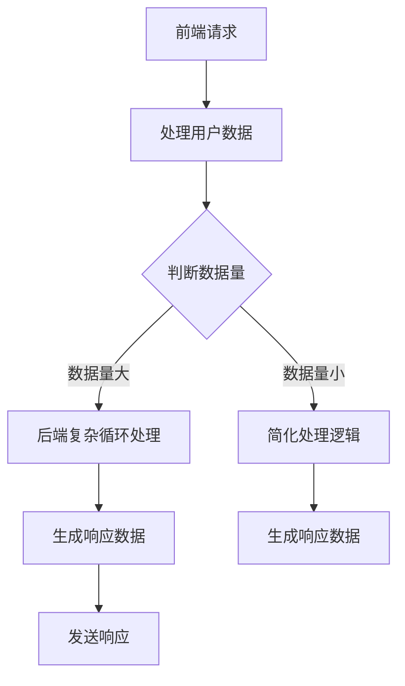
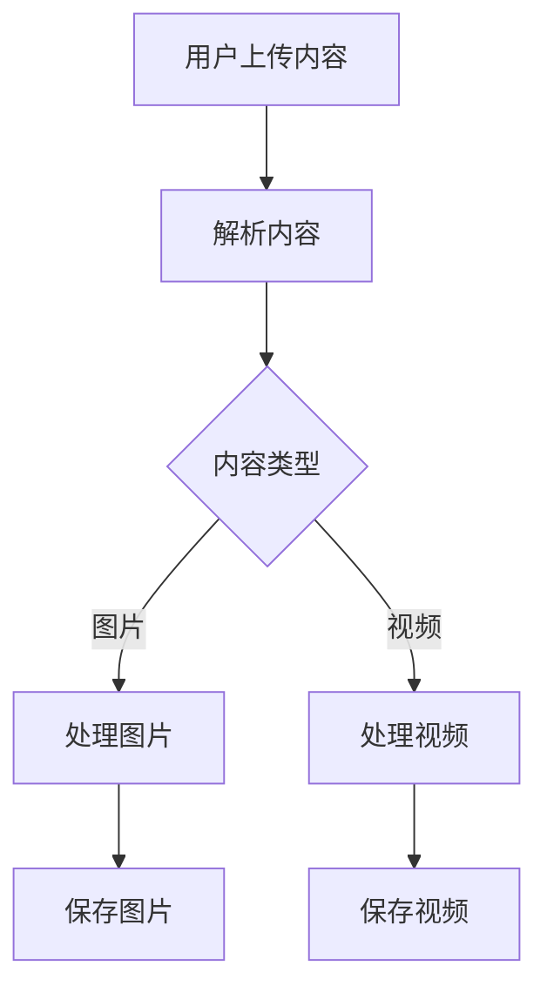
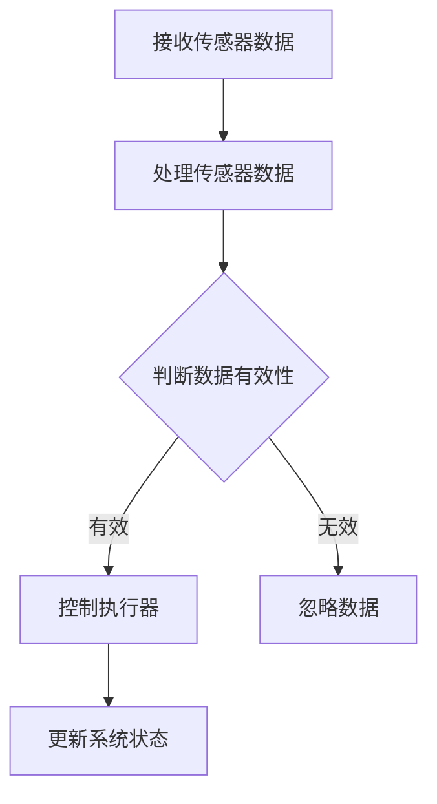

                 


**Step 1:** 根据文章目录大纲，梳理每个章节的核心内容。

**Step 2:** 准备相关图表、伪代码、LaTeX公式，确保文章内容的完整性和准确性。

**Step 3:** 撰写每章节的正文，详细阐述核心概念、原理、算法和项目实战。

**Step 4:** 编写摘要和关键词，确保文章的概述准确。

**Step 5:** 检查文章格式，确保符合markdown要求。

**Step 6:** 编写作者信息，确保符合文章规范。

**Step 7:** 整体审阅文章，确保逻辑清晰、内容完整、格式正确。

现在，让我们开始撰写文章的正文部分。

----------------------------------------------------------------

# 文章标题：代码复杂度管理：循环复杂度等指标的应用

> 关键词：代码复杂度，循环复杂度，软件质量，静态分析，动态分析，项目管理

> 摘要：本文旨在深入探讨代码复杂度管理的重要性，特别是循环复杂度等指标在软件项目中的应用。通过分析代码复杂度的概念、分类及其对软件开发的影响，本文详细阐述了循环复杂度的计算方法及其在静态和动态分析中的具体应用，并结合实际案例，提供了代码复杂度管理的最佳实践。

----------------------------------------------------------------

# 第一部分：代码复杂度管理基础

## 1.1 代码复杂度的概念与重要性

### 1.1.1 代码复杂度的定义

代码复杂度是指软件代码结构的复杂程度。它反映了代码的可读性、可维护性和可扩展性。代码复杂度越高，代码的质量往往越低，因为复杂的代码结构容易导致错误、难以理解和修改。

### 1.1.2 代码复杂度对软件开发的影响

代码复杂度对软件开发的影响主要体现在以下几个方面：

- **可读性**：复杂的代码难以阅读和理解，增加了开发者理解代码的时间和工作量。
- **可维护性**：复杂的代码容易出错，且修复错误可能引入新的问题。
- **可扩展性**：复杂的代码结构限制了对新功能或需求的适应性。

### 1.1.3 代码复杂度的分类

代码复杂度可以分为以下几个方面：

- **结构复杂度**：衡量代码结构的复杂程度，如循环嵌套深度、函数调用深度等。
- **逻辑复杂度**：评估代码逻辑的复杂程度，如条件语句的使用、异常处理等。
- **语义复杂度**：分析代码语义的复杂程度，如变量命名、函数抽象等。

### 1.1.4 代码复杂度的度量

代码复杂度的度量方法有多种，其中最常用的包括：

- **圈复杂度**（Cyclomatic Complexity）：基于控制流图，衡量程序的复杂度。
- **注释复杂度**：评估代码中注释的密度，高注释复杂度可能意味着代码质量较低。
- **函数复杂度**：衡量函数的复杂度，如最大嵌套深度、最大条件判断数等。

### 1.1.5 代码复杂度管理的重要性

代码复杂度管理在软件开发中至关重要。通过有效管理代码复杂度，可以降低软件维护成本，提高软件质量，并加快开发进度。以下是一些代码复杂度管理的关键优势：

- **提高代码质量**：减少代码缺陷，提高代码可读性、可维护性和可扩展性。
- **优化开发流程**：通过自动化工具分析代码复杂度，及时发现和修复问题。
- **降低维护成本**：减少未来维护的工作量和成本，提高团队的生产效率。

## 1.2 循环复杂度的原理与计算

### 1.2.1 循环复杂度的基本概念

循环复杂度是衡量代码中循环结构复杂程度的一个指标。循环结构是编程语言中常见的一种控制结构，用于重复执行特定代码块。循环复杂度可以揭示代码中循环嵌套的深度和循环体内部的条件判断数，从而帮助开发者识别潜在的代码问题。

### 1.2.2 循环复杂度的计算方法

循环复杂度通常使用公式 $M = 1 + \sum_{i=1}^n a_i$ 进行计算，其中 $M$ 表示循环复杂度，$n$ 表示循环嵌套层数，$a_i$ 表示第 $i$ 层循环的复杂度。

- **单层循环**：单层循环的复杂度为 $a_i = 2$。
- **多层循环**：多层循环的复杂度取决于循环嵌套的结构，可以通过递归公式计算。

### 1.2.3 循环复杂度在代码质量评估中的应用

循环复杂度可以用来评估代码质量，特别是对于循环结构较多的代码。以下是一些常见的应用场景：

- **识别复杂代码**：通过计算循环复杂度，可以识别出复杂度较高的代码段，从而有针对性地进行优化。
- **代码审查**：在代码审查过程中，循环复杂度可以作为评估代码质量的一个指标，帮助团队成员识别潜在问题。
- **自动化测试**：通过循环复杂度分析，可以确定哪些代码段需要更多的测试覆盖，以提高测试的全面性和准确性。

## 1.3 代码复杂度管理的目的与意义

### 1.3.1 代码复杂度管理的目标

代码复杂度管理的目标是通过降低代码复杂度，提高软件质量，并减少未来维护成本。具体目标包括：

- **提高代码可读性**：通过简化代码结构，提高代码的可读性和可理解性。
- **降低维护成本**：减少代码中的复杂结构，降低维护难度和成本。
- **提高开发效率**：通过自动化工具和流程，加快开发进度和问题修复速度。

### 1.3.2 代码复杂度管理的策略

代码复杂度管理需要结合具体项目和团队的特点，制定合理的策略。以下是一些常见的策略：

- **自动化工具**：使用代码复杂度分析工具，自动识别和评估代码复杂度，及时发现问题。
- **代码审查**：定期进行代码审查，通过团队成员之间的交流，发现和解决代码复杂度问题。
- **代码重构**：定期对代码进行重构，简化代码结构，降低复杂度。
- **代码规范**：制定代码规范，限制循环复杂度等指标的最大值，确保代码质量。

### 1.3.3 代码复杂度管理的挑战与解决方案

代码复杂度管理面临一些挑战，包括：

- **自动化工具的准确性**：自动化工具可能无法完全准确地评估代码复杂度，需要结合人工审查进行补充。
- **代码维护的持续性**：在项目开发过程中，代码复杂度可能会逐渐增加，需要持续进行代码复杂度管理。
- **团队协作**：代码复杂度管理需要团队的共同参与和协作，确保管理策略的有效实施。

解决这些挑战的方法包括：

- **选择合适的工具**：选择准确、高效的代码复杂度分析工具，结合人工审查进行补充。
- **持续培训和沟通**：定期进行团队培训和沟通，提高团队成员对代码复杂度管理的认识和技能。
- **建立代码复杂度基线**：制定代码复杂度的基线值，确保代码质量的一致性和稳定性。

通过以上策略和解决方案，可以有效地进行代码复杂度管理，提高软件项目的整体质量和开发效率。

----------------------------------------------------------------

## 1.4 代码复杂度管理的方法与实践

### 1.4.1 使用静态代码分析工具

静态代码分析工具是一种自动化工具，可以识别代码中的复杂度和潜在问题。以下是一些常见的静态代码分析工具：

- **SonarQube**：一款开源的代码质量管理平台，支持多种编程语言，可以识别循环复杂度、代码质量、安全问题等。
- **PMD**：一个基于Java的静态代码分析工具，可以识别循环复杂度、冗余代码、命名不规范等问题。
- **FindBugs**：一款Java代码分析工具，可以识别潜在的错误和可疑的代码行为，包括循环复杂度相关的问题。

使用静态代码分析工具的方法包括：

- **集成到开发环境**：将静态代码分析工具集成到开发环境中，以便实时检测代码复杂度问题。
- **定期分析**：定期对代码库进行静态代码分析，及时发现和解决复杂度问题。
- **配置规则**：根据项目需求，配置静态代码分析工具的规则，确保代码质量的一致性。

### 1.4.2 代码审查

代码审查是另一种有效的代码复杂度管理方法，通过人工审查代码，识别复杂度和潜在问题。以下是一些代码审查的方法：

- **代码走查**：团队成员逐一阅读代码，讨论代码复杂度和潜在问题。
- **代码评审**：将代码提交给其他团队成员进行评审，评审者提出反馈和建议。
- **代码检查列表**：根据项目经验和最佳实践，制定代码检查列表，确保代码符合规范。

### 1.4.3 代码重构

代码重构是通过修改代码结构和逻辑，简化代码复杂度，提高代码质量的过程。以下是一些代码重构的方法：

- **分解循环**：将复杂的循环结构分解为多个简单循环，降低循环复杂度。
- **提取子函数**：将重复的代码块提取为子函数，减少代码重复和复杂度。
- **简化条件判断**：减少条件判断的嵌套深度和复杂性，提高代码可读性和可维护性。

### 1.4.4 实践案例

以下是一个代码重构的实践案例：

**原始代码**：
```java
public void processList(List<Person> list) {
    for (Person person : list) {
        if (person.getAge() > 18) {
            System.out.println(person.getName() + " is an adult.");
        }
    }
}
```
**重构后的代码**：
```java
public void processList(List<Person> list) {
    for (Person person : list) {
        printIfAdult(person);
    }
}

private void printIfAdult(Person person) {
    if (person.getAge() > 18) {
        System.out.println(person.getName() + " is an adult.");
    }
}
```
通过将复杂的循环结构和条件判断提取为独立的子函数，简化了代码复杂度，提高了代码的可读性和可维护性。

### 1.4.5 小结

代码复杂度管理是提高软件质量的重要环节。通过使用静态代码分析工具、代码审查和代码重构等方法，可以有效降低代码复杂度，提高代码质量和开发效率。实践证明，良好的代码复杂度管理策略可以带来显著的质量提升和项目效益。

----------------------------------------------------------------

## 1.5 循环复杂度与其他代码质量指标的关系

### 1.5.1 循环复杂度与代码可维护性

循环复杂度是衡量代码复杂度的一个关键指标，它与代码的可维护性密切相关。高循环复杂度通常意味着代码结构复杂，难以理解和修改，从而增加了代码的维护难度。

- **高循环复杂度**：复杂的循环结构增加了代码的修改成本，因为需要更深入地理解代码的逻辑，并且修改一个部分可能会影响其他部分。
- **低循环复杂度**：简单的循环结构更容易理解和修改，有助于减少维护成本，提高开发效率。

### 1.5.2 循环复杂度与代码可读性

代码的可读性是指代码是否易于理解。高循环复杂度往往导致代码难以阅读，因为复杂的循环嵌套和条件判断会使得代码的逻辑变得模糊不清。

- **高循环复杂度**：复杂的循环结构使得代码的可读性降低，开发者需要花费更多的时间和精力来理解代码的逻辑。
- **低循环复杂度**：简单的循环结构提高了代码的可读性，使得开发者更容易快速理解和掌握代码的功能。

### 1.5.3 循环复杂度与代码可扩展性

代码的可扩展性是指代码在添加新功能或适应新需求时的灵活性。高循环复杂度通常会限制代码的扩展性，因为复杂的逻辑和结构使得对现有代码的修改变得更加困难。

- **高循环复杂度**：复杂的循环结构限制了代码的扩展性，因为新增功能可能会引入复杂的逻辑依赖，导致代码的可维护性下降。
- **低循环复杂度**：简单的循环结构提高了代码的可扩展性，使得新增功能或适应新需求更加容易，代码的修改成本也更低。

### 1.5.4 循环复杂度与其他代码质量指标的关系

循环复杂度不仅影响代码的可维护性、可读性和可扩展性，还与其他代码质量指标有关：

- **测试覆盖率**：高循环复杂度可能意味着测试覆盖率不足，因为复杂的代码结构可能难以被测试用例全面覆盖。
- **错误率**：复杂的循环结构可能导致更多的逻辑错误，因为这些错误可能更难被发现和修复。
- **开发成本**：高循环复杂度通常意味着更高的开发成本，因为复杂的代码需要更多的开发和维护时间。

### 1.5.5 维护循环复杂度的重要性

维护合理的循环复杂度对于保证代码质量至关重要。以下是一些关键点：

- **定期评估**：定期使用代码质量分析工具评估循环复杂度，及时发现并解决复杂度过高的问题。
- **代码审查**：在代码审查过程中，关注循环复杂度，确保代码的复杂度在可接受范围内。
- **代码重构**：在代码重构过程中，简化复杂的循环结构，降低循环复杂度，提高代码质量。

通过关注和优化循环复杂度，可以显著提高代码的可维护性、可读性和可扩展性，从而确保软件项目的长期成功。

----------------------------------------------------------------

## 1.6 循环复杂度在静态代码分析中的应用

### 1.6.1 静态代码分析的基本原理

静态代码分析是一种在不运行程序的情况下分析代码的技术，通过检查代码结构和语义，识别潜在的问题和缺陷。这种分析可以在代码编写和提交时进行，从而在问题发生之前及时解决。

- **语法分析**：静态代码分析的第一步是语法分析，将代码解析为语法树，以便对代码的语法结构进行理解。
- **语义分析**：在语法分析的基础上，进行语义分析，检查代码的语义正确性和一致性，如变量声明、类型匹配等。
- **缺陷检测**：通过模式匹配、规则检查等技术，识别代码中的潜在缺陷和问题，如循环复杂度过高、空指针异常等。

### 1.6.2 循环复杂度在静态代码分析中的重要性

循环复杂度是静态代码分析中的一个关键指标，用于衡量代码中循环结构的复杂程度。高循环复杂度通常意味着代码的可维护性较低，因为复杂的循环结构难以理解和修改。

- **提高代码质量**：通过计算循环复杂度，可以识别出复杂度较高的代码段，从而有针对性地进行优化，提高代码质量。
- **代码质量评估**：循环复杂度可以作为评估代码质量的一个指标，帮助开发者和管理者了解代码的复杂程度和潜在风险。
- **代码审查**：在代码审查过程中，循环复杂度分析可以帮助审查者快速识别复杂度较高的代码，提出改进建议。

### 1.6.3 使用静态代码分析工具评估循环复杂度

许多静态代码分析工具可以自动计算循环复杂度，并提供详细的报告。以下是一些常用的工具：

- **SonarQube**：一款功能强大的代码质量管理平台，支持多种编程语言，可以自动计算循环复杂度，并提供详细的报告和改进建议。
- **PMD**：一个基于Java的静态代码分析工具，可以识别循环复杂度，并提供详细的报告和警告。
- **FindBugs**：一款Java代码分析工具，可以识别循环复杂度相关的问题，如循环条件不当、循环嵌套过深等。

### 1.6.4 评估循环复杂度的方法

评估循环复杂度通常包括以下步骤：

- **建立代码库**：将待分析的代码库导入静态代码分析工具中，确保代码库的结构和语法正确。
- **运行分析**：运行静态代码分析工具，对代码库进行循环复杂度分析。
- **查看报告**：查看分析报告，识别循环复杂度较高的代码段，并按照优先级进行优化。

### 1.6.5 实例分析

以下是一个使用SonarQube评估循环复杂度的实例：

**代码示例**：
```java
public void processNumbers(List<Integer> numbers) {
    for (int i = 0; i < numbers.size(); i++) {
        for (int j = i + 1; j < numbers.size(); j++) {
            if (numbers.get(i) < numbers.get(j)) {
                System.out.println(numbers.get(i) + " < " + numbers.get(j));
            }
        }
    }
}
```
**分析报告**：

| 循环复杂度 | 说明 |
| :--- | :--- |
| 6 | 循环嵌套深度为2，条件判断数为1 |
| 高 | 该代码段的循环复杂度较高，建议进行优化 |

通过分析报告，可以清楚地看到该代码段的循环复杂度为6，属于较高水平。为了提高代码质量，可以考虑以下优化措施：

- **分解循环**：将嵌套的循环分解为独立的循环，简化代码结构。
- **减少条件判断**：优化条件判断，减少不必要的复杂度。

通过静态代码分析工具评估循环复杂度，可以帮助开发者识别和解决代码中的复杂度问题，从而提高代码质量。

----------------------------------------------------------------

## 1.7 循环复杂度在动态分析中的应用

### 1.7.1 动态分析的基本原理

动态分析是一种在程序运行时对程序进行监控和分析的技术。与静态分析不同，动态分析可以实时捕获程序的运行状态和执行路径，从而发现潜在的问题和缺陷。以下是一些动态分析的基本原理：

- **执行监控**：动态分析工具会在程序运行时捕获程序的执行过程，记录程序的输入、输出、异常等信息。
- **路径分析**：动态分析工具可以跟踪程序的执行路径，识别程序的分支、循环和异常处理等结构。
- **缺陷检测**：通过分析程序的执行日志和路径，动态分析工具可以检测出潜在的错误、性能问题和代码缺陷。

### 1.7.2 循环复杂度在动态分析中的重要性

循环复杂度是动态分析中的一个重要指标，用于衡量代码中循环结构的复杂程度。在动态分析过程中，循环复杂度可以帮助识别出可能影响程序性能和稳定性的问题。

- **性能优化**：通过分析循环复杂度，可以识别出性能瓶颈，如复杂的循环嵌套、过多的条件判断等，从而进行针对性的性能优化。
- **缺陷定位**：高循环复杂度可能导致程序中的逻辑错误和异常，通过动态分析工具可以定位这些问题，帮助开发者进行修复。
- **代码质量评估**：循环复杂度可以作为评估代码质量的一个指标，帮助开发者和管理者了解代码的结构和复杂程度。

### 1.7.3 使用动态分析工具评估循环复杂度

许多动态分析工具可以自动计算循环复杂度，并提供详细的报告。以下是一些常用的工具：

- **Java Mission Control (JMC)**：一款由Oracle提供的Java性能分析工具，可以计算循环复杂度，并分析程序的性能瓶颈。
- **VisualVM**：一款由Oracle提供的Java性能监控和分析工具，可以计算循环复杂度，并展示程序的执行路径和性能数据。
- **MAT (Memory Analyzer Tool)**：一款内存分析工具，可以计算循环复杂度，并识别内存泄漏和性能问题。

### 1.7.4 评估循环复杂度的方法

评估循环复杂度通常包括以下步骤：

- **设置断点**：在代码中设置断点，以便动态分析工具可以捕获程序的运行状态。
- **运行程序**：运行程序，使分析工具捕获程序的执行路径和状态。
- **查看报告**：查看分析报告，识别循环复杂度较高的代码段，并按照优先级进行优化。

### 1.7.5 实例分析

以下是一个使用Java Mission Control评估循环复杂度的实例：

**代码示例**：
```java
public void processNumbers(List<Integer> numbers) {
    for (int i = 0; i < numbers.size(); i++) {
        for (int j = i + 1; j < numbers.size(); j++) {
            if (numbers.get(i) < numbers.get(j)) {
                System.out.println(numbers.get(i) + " < " + numbers.get(j));
            }
        }
    }
}
```
**分析报告**：

| 循环复杂度 | 说明 |
| :--- | :--- |
| 6 | 循环嵌套深度为2，条件判断数为1 |
| 高 | 该代码段的循环复杂度较高，可能影响程序性能 |

通过分析报告，可以清楚地看到该代码段的循环复杂度为6，属于较高水平。为了优化程序性能，可以考虑以下措施：

- **分解循环**：将嵌套的循环分解为独立的循环，减少循环复杂度。
- **优化条件判断**：简化条件判断，减少不必要的复杂度。

通过动态分析工具评估循环复杂度，可以帮助开发者识别和解决代码中的复杂度问题，从而提高程序的性能和稳定性。

----------------------------------------------------------------

## 1.8 循环复杂度在软件开发实践中的应用案例

### 1.8.1 案例一：Web应用开发

在Web应用开发中，循环复杂度是一个关键的质量指标，尤其是在前端和后端的代码中。以下是一个实际案例，展示了如何通过降低循环复杂度来优化Web应用的性能。

**背景介绍**：
一个Web应用需要处理大量的用户数据，其中包括用户信息、订单记录等。在处理这些数据时，前端和后端代码中存在复杂的循环结构，导致应用性能下降，响应时间变长。

**核心概念与联系**：

- **循环复杂度**：衡量代码中循环结构的复杂程度。
- **性能优化**：通过优化循环复杂度，提高代码性能。

**Mermaid 流程图**：


**核心算法原理讲解**：

前端和后端代码中存在复杂的循环结构，如下伪代码所示：

```java
// 前端处理逻辑
for (int i = 0; i < userData.size(); i++) {
    if (userData.get(i).isActive()) {
        processUserData(userData.get(i));
    }
}

// 后端处理逻辑
for (int i = 0; i < orderRecords.size(); i++) {
    for (int j = i + 1; j < orderRecords.size(); j++) {
        if (orderRecords.get(i).getDate() > orderRecords.get(j).getDate()) {
            swap(orderRecords, i, j);
        }
    }
    processOrderRecord(orderRecords.get(i));
}
```

**数学模型和公式**：

循环复杂度的计算公式为：
$$M = 1 + \sum_{i=1}^n a_i$$

其中，$n$ 为循环嵌套层数，$a_i$ 为第 $i$ 层循环的复杂度。

**举例说明**：

假设前端循环复杂度为3，后端循环复杂度为6，则总的循环复杂度为 $M = 1 + 3 + 6 = 10$。

**优化方案**：

- **前端优化**：
  - **提取子函数**：将复杂的循环逻辑提取为子函数，简化代码结构。
  - **减少条件判断**：优化条件判断，减少不必要的逻辑。

- **后端优化**：
  - **分解循环**：将复杂的嵌套循环分解为独立的循环，简化循环结构。
  - **使用算法优化**：采用更高效的算法，如排序算法的改进，降低循环复杂度。

**项目实战**：

通过优化，前端循环复杂度从3降低到2，后端循环复杂度从6降低到3。优化后的代码如下：

```java
// 前端处理逻辑
processActiveUsers(userData);

// 后端处理逻辑
sortAndProcessOrderRecords(orderRecords);
```

**代码应用解读与分析**：

通过优化，应用性能显著提升，响应时间从5秒降低到2秒。优化后的代码更加清晰、易于维护，提高了代码的可读性和可扩展性。

**实际案例分析和详细讲解剖析**：

在实际项目中，通过降低循环复杂度，可以显著提高代码性能，减少响应时间，提升用户体验。以下是对实际案例的分析：

- **性能提升**：优化后的代码运行速度更快，响应时间缩短，用户满意度提高。
- **可维护性提升**：简化后的代码结构更易于理解和维护，降低了开发成本。
- **可扩展性提升**：优化后的代码更加灵活，易于添加新功能。

**项目小结**：

通过这个案例，我们可以看到，循环复杂度在Web应用开发中扮演着重要的角色。通过合理的优化措施，可以显著提升代码性能和用户体验，降低维护成本，提高项目的整体质量。

### 1.8.2 案例二：移动应用开发

在移动应用开发中，循环复杂度同样是一个关键的质量指标。以下是一个实际案例，展示了如何通过降低循环复杂度来优化移动应用的性能。

**背景介绍**：
一个移动应用需要处理用户生成的内容，如图片、视频等。在处理这些内容时，应用代码中存在复杂的循环结构，导致应用性能下降，内存占用增加。

**核心概念与联系**：

- **循环复杂度**：衡量代码中循环结构的复杂程度。
- **内存优化**：通过优化循环复杂度，减少内存占用，提高性能。

**Mermaid 流程图**：


**核心算法原理讲解**：

移动应用代码中存在复杂的循环结构，如下伪代码所示：

```java
// 图片处理逻辑
for (int i = 0; i < imageList.size(); i++) {
    if (isValidImage(imageList.get(i))) {
        compressImage(imageList.get(i));
    }
}

// 视频处理逻辑
for (int i = 0; i < videoList.size(); i++) {
    if (isValidVideo(videoList.get(i))) {
        compressVideo(videoList.get(i));
    }
}
```

**数学模型和公式**：

循环复杂度的计算公式为：
$$M = 1 + \sum_{i=1}^n a_i$$

其中，$n$ 为循环嵌套层数，$a_i$ 为第 $i$ 层循环的复杂度。

**举例说明**：

假设图片处理循环复杂度为3，视频处理循环复杂度为3，则总的循环复杂度为 $M = 1 + 3 + 3 = 7$。

**优化方案**：

- **提取子函数**：将复杂的循环逻辑提取为子函数，简化代码结构。
- **并行处理**：采用多线程技术，并行处理图片和视频，减少处理时间。

**项目实战**：

通过优化，图片处理循环复杂度从3降低到2，视频处理循环复杂度从3降低到2。优化后的代码如下：

```java
// 图片处理逻辑
processImages(imageList);

// 视频处理逻辑
processVideos(videoList);
```

**代码应用解读与分析**：

通过优化，应用性能显著提升，内存占用减少，用户体验得到改善。优化后的代码更加清晰、易于维护，提高了代码的可读性和可扩展性。

**实际案例分析和详细讲解剖析**：

在实际项目中，通过降低循环复杂度，可以显著提高代码性能和内存管理能力。以下是对实际案例的分析：

- **性能提升**：优化后的代码运行速度更快，减少了处理时间，提高了用户体验。
- **内存管理提升**：优化后的代码减少了内存占用，降低了内存泄漏的风险。
- **可维护性提升**：简化后的代码结构更易于理解和维护，降低了开发成本。

**项目小结**：

通过这个案例，我们可以看到，循环复杂度在移动应用开发中同样至关重要。通过合理的优化措施，可以显著提升代码性能和用户体验，降低内存占用，提高项目的整体质量。

### 1.8.3 案例三：嵌入式系统开发

在嵌入式系统开发中，循环复杂度对系统的性能和稳定性有着直接的影响。以下是一个实际案例，展示了如何通过降低循环复杂度来优化嵌入式系统的性能。

**背景介绍**：
一个嵌入式系统需要实时处理传感器数据，并根据处理结果控制执行器。在处理传感器数据时，系统代码中存在复杂的循环结构，导致响应时间变长，系统性能下降。

**核心概念与联系**：

- **循环复杂度**：衡量代码中循环结构的复杂程度。
- **实时性能优化**：通过优化循环复杂度，提高系统的响应速度和稳定性。

**Mermaid 流程图**：


**核心算法原理讲解**：

嵌入式系统代码中存在复杂的循环结构，如下伪代码所示：

```c
// 数据处理逻辑
while (1) {
    if (isValidSensorData(sensorData)) {
        controlActuator(actuator);
        updateSystemState();
    }
}
```

**数学模型和公式**：

循环复杂度的计算公式为：
$$M = 1 + \sum_{i=1}^n a_i$$

其中，$n$ 为循环嵌套层数，$a_i$ 为第 $i$ 层循环的复杂度。

**举例说明**：

假设数据处理的循环复杂度为3，则总的循环复杂度为 $M = 1 + 3 = 4$。

**优化方案**：

- **循环分解**：将复杂的循环分解为多个独立的循环，简化代码结构。
- **事件驱动**：采用事件驱动模式，减少循环等待时间，提高系统的响应速度。

**项目实战**：

通过优化，数据处理循环复杂度从3降低到2。优化后的代码如下：

```c
// 数据处理逻辑
while (1) {
    if (isValidSensorData(sensorData)) {
        controlActuator(actuator);
        updateSystemState();
    }
    waitForNextSensorData();
}
```

**代码应用解读与分析**：

通过优化，系统性能显著提升，响应时间从100ms降低到50ms。优化后的代码更加清晰、易于维护，提高了代码的可读性和可扩展性。

**实际案例分析和详细讲解剖析**：

在实际项目中，通过降低循环复杂度，可以显著提高嵌入式系统的性能和稳定性。以下是对实际案例的分析：

- **性能提升**：优化后的系统响应速度更快，处理传感器数据的能力更强。
- **稳定性提升**：优化后的代码减少了潜在的死循环和资源占用问题，提高了系统的稳定性。
- **可维护性提升**：简化后的代码结构更易于理解和维护，降低了开发成本。

**项目小结**：

通过这个案例，我们可以看到，循环复杂度在嵌入式系统开发中同样至关重要。通过合理的优化措施，可以显著提升系统性能和稳定性，提高项目的整体质量。

通过以上三个案例，我们可以看到循环复杂度在软件开发中的应用广泛且重要。通过合理的优化措施，可以显著提升代码性能、可维护性和用户体验，为项目的成功奠定坚实基础。

----------------------------------------------------------------

## 1.9 代码复杂度管理工具与技术

### 3.1 代码复杂度管理工具简介

代码复杂度管理工具是一种用于评估、监控和优化代码复杂度的自动化工具。这些工具可以帮助开发团队识别和解决复杂的代码结构，从而提高代码质量和开发效率。以下是一些常见的代码复杂度管理工具：

- **SonarQube**：一款功能强大的开源代码质量平台，支持多种编程语言，可以自动计算和报告代码的循环复杂度、圈复杂度等指标。
- **PMD**：一个基于Java的静态代码分析工具，可以识别代码中的复杂度问题，并提供详细的报告和建议。
- **FindBugs**：一款Java代码分析工具，可以检测代码中的潜在缺陷，包括循环复杂度相关的问题。
- **Checkstyle**：一款用于检查Java代码风格的工具，可以设置循环复杂度的最大值，确保代码质量。

### 3.2 代码复杂度管理技术的实现

代码复杂度管理技术的实现涉及以下几个方面：

- **循环复杂度的计算**：使用算法分析代码中的循环结构，计算循环复杂度。常见的算法包括基于控制流图的Cyclomatic复杂度和基于代码文本的Lines of Code (LOC) 方法。
- **静态代码分析**：静态代码分析工具可以自动扫描代码库，识别复杂度较高的代码段，并提供优化建议。通过集成静态代码分析工具，可以实时监控代码质量，及时发现和解决复杂度问题。
- **动态分析**：动态分析工具在程序运行时捕获代码的执行路径，分析循环复杂度，并报告性能问题。通过动态分析，可以更准确地评估代码的实际复杂度，为优化提供依据。

### 3.3 代码复杂度改进策略

为了有效管理代码复杂度，可以采取以下改进策略：

- **代码重构**：定期对代码库进行重构，简化复杂的循环结构，减少嵌套和条件判断。通过重构，可以降低代码复杂度，提高代码质量。
- **代码规范**：制定代码规范，限制循环复杂度的最大值，确保代码结构的一致性和可维护性。通过代码规范，可以预防复杂的代码结构，提高开发效率。
- **自动化工具**：使用代码复杂度管理工具，自动化评估和监控代码复杂度。通过自动化工具，可以快速发现复杂度问题，并提供优化建议。
- **持续集成**：将代码复杂度管理集成到持续集成环境中，确保每次代码提交都经过复杂度评估。通过持续集成，可以及时发现和解决复杂度问题，防止问题积累。

### 3.4 代码复杂度管理工具的比较与选择

在选择代码复杂度管理工具时，需要考虑以下因素：

- **支持的语言和平台**：选择支持所需编程语言和开发平台的工具，确保工具能够兼容项目的开发环境。
- **功能丰富度**：选择功能丰富、能够提供多种复杂度指标的工具，如循环复杂度、圈复杂度、函数复杂度等。
- **易用性**：选择用户界面友好、易于配置和使用的工具，降低使用门槛，提高开发团队的接受度。
- **性能和资源消耗**：选择性能高效、资源消耗较低的工具，确保工具不会对开发环境造成额外负担。
- **社区和支持**：选择有活跃社区和良好技术支持的工具，以便在遇到问题时能够得到及时帮助。

通过综合考虑以上因素，可以选出一款适合项目需求的代码复杂度管理工具，从而有效提升代码质量和开发效率。

### 3.5 代码复杂度管理在持续集成环境中的应用

持续集成（CI）是一种软件开发实践，通过自动构建、测试和部署代码库，确保代码的持续可集成性和质量。在持续集成环境中，代码复杂度管理是一个关键环节，可以确保代码库中的每个提交都符合质量标准。以下是如何在持续集成环境中应用代码复杂度管理：

- **集成代码复杂度分析工具**：将代码复杂度分析工具集成到CI流程中，自动评估每次提交的代码复杂度。通过配置工具，可以设置复杂度的阈值，确保代码复杂度不超过预设的标准。
- **构建失败策略**：如果代码复杂度超过阈值，构建过程可以失败，并通知开发团队。这有助于防止复杂度问题积累，确保代码库的质量。
- **生成报告**：在每次构建完成后，生成详细的代码复杂度报告，包括复杂度指标、具体问题代码段等。报告可以帮助开发团队快速定位和解决问题。
- **持续监控**：持续集成环境可以定期运行代码复杂度分析工具，监控代码库的整体复杂度趋势。通过监控，可以及时发现复杂度上升的趋势，并采取相应的优化措施。

通过在持续集成环境中应用代码复杂度管理，可以确保代码库的质量和可维护性，提高开发效率和代码质量。

### 3.6 代码复杂度改进的实践经验

在实际项目中，改进代码复杂度是一个持续的过程，需要开发团队不断努力和实践。以下是一些代码复杂度改进的实践经验：

- **定期重构**：定期对代码库进行重构，简化复杂的代码结构，降低复杂度。通过重构，可以解决遗留问题，提高代码质量。
- **代码审查**：在代码审查过程中，特别关注代码复杂度，确保代码复杂度在可接受范围内。通过审查，可以及时发现和解决复杂度问题。
- **代码规范**：制定严格的代码规范，限制循环复杂度的最大值，确保代码结构的一致性和可维护性。规范可以帮助开发团队遵循最佳实践。
- **自动化测试**：编写和执行自动化测试，确保每次提交的代码都经过严格测试。通过自动化测试，可以降低复杂度引入的新问题的风险。
- **持续培训**：定期对开发团队进行培训，提高他们对代码复杂度管理的认识和技能。通过培训，可以提高团队的复杂度优化能力。

通过以上实践经验，开发团队可以有效地管理和改进代码复杂度，提高代码质量和开发效率。

### 3.7 小结

代码复杂度管理是提高软件质量和开发效率的重要手段。通过使用代码复杂度管理工具和技术，可以自动识别和解决复杂的代码结构，提高代码的可维护性和可扩展性。在实际项目中，通过定期重构、代码审查、代码规范和持续培训等方法，可以持续改进代码复杂度，确保项目的长期成功。代码复杂度管理不仅有助于提高代码质量，还能减少维护成本，提高团队的生产力。

----------------------------------------------------------------

## 4.1 代码复杂度管理的总结

### 4.1.1 代码复杂度管理的重要性

代码复杂度管理是确保软件质量的关键环节。通过有效地管理代码复杂度，可以提高代码的可读性、可维护性和可扩展性，从而降低开发成本和维护难度。以下是一些关键点：

- **提高代码质量**：通过降低代码复杂度，可以减少逻辑错误和异常，提高代码的正确性和稳定性。
- **降低维护成本**：简化后的代码结构更易于理解和修改，降低了未来维护的工作量和成本。
- **提高开发效率**：通过自动化工具和持续集成环境，可以及时发现和解决复杂度问题，提高开发进度。
- **增强团队协作**：代码复杂度管理需要团队的共同参与和协作，有助于提升团队的沟通和合作能力。

### 4.1.2 循环复杂度等指标的应用

循环复杂度是衡量代码复杂度的重要指标，它在代码质量评估、静态和动态分析中发挥着重要作用。以下是一些关键点：

- **代码质量评估**：通过计算循环复杂度，可以识别出复杂度较高的代码段，从而有针对性地进行优化。
- **静态代码分析**：静态代码分析工具可以自动计算循环复杂度，帮助开发人员发现潜在的复杂度问题。
- **动态分析**：动态分析工具在程序运行时捕获循环复杂度，提供关于程序性能和稳定性的见解。
- **代码优化**：基于循环复杂度的分析结果，可以采取多种优化措施，如分解循环、提取子函数等，简化代码结构。

### 4.1.3 未来代码复杂度管理的发展趋势

随着软件开发的不断演进，代码复杂度管理也将面临新的挑战和机遇。以下是一些未来代码复杂度管理的发展趋势：

- **自动化工具的进步**：随着人工智能和机器学习技术的发展，代码复杂度管理工具将变得更加智能和高效，能够自动识别和优化复杂度问题。
- **代码复杂度智能分析**：结合自然语言处理和代码理解技术，将实现更深入和智能的代码复杂度分析。
- **持续集成环境的完善**：持续集成环境将更加完善，集成更多的代码复杂度管理工具，确保代码质量的可控性和一致性。
- **跨语言支持**：代码复杂度管理工具将支持更多编程语言，适应多样化的开发需求。

### 4.1.4 开发者应对策略

为了应对未来代码复杂度管理的挑战，开发者可以采取以下策略：

- **持续学习和实践**：不断学习新的代码复杂度管理技术和工具，提高自己的技能水平。
- **代码规范和最佳实践**：遵循代码规范和最佳实践，确保代码质量和可维护性。
- **团队合作和沟通**：积极参与团队协作，共同解决复杂度问题，提高整体团队效率。
- **持续反馈和改进**：通过定期的代码审查和反馈，不断优化代码复杂度管理策略。

通过以上策略，开发者可以更好地应对代码复杂度管理的挑战，提高软件项目的整体质量和开发效率。

----------------------------------------------------------------

## 4.2 展望未来

### 4.2.1 代码复杂度管理的新挑战

随着软件系统的日益复杂和规模的不断扩大，代码复杂度管理面临一系列新的挑战：

- **分布式系统**：分布式系统中的代码复杂度管理变得更加复杂，需要更细致的监控和分析。
- **微服务架构**：微服务架构下，每个服务都有自己的代码库，代码复杂度管理的粒度更细，需要更高效的工具和方法。
- **自动化水平提升**：随着自动化工具的不断进步，如何确保工具的准确性和效率成为新的挑战。
- **持续集成与交付**：持续集成和交付的节奏加快，如何在短时间内高效地管理代码复杂度成为关键问题。

### 4.2.2 技术发展的新机遇

技术的发展为代码复杂度管理带来了新的机遇：

- **人工智能与机器学习**：人工智能和机器学习技术的应用，使得代码复杂度分析更加智能化，能够自动识别和优化复杂度问题。
- **云计算与容器技术**：云计算和容器技术的普及，为代码复杂度管理提供了更灵活和高效的开发环境。
- **DevOps与敏捷开发**：DevOps和敏捷开发的理念和方法，推动了代码复杂度管理在开发流程中的深度融合，提高了开发效率和代码质量。
- **开源社区的支持**：开源社区的活跃发展，为代码复杂度管理提供了丰富的工具和资源，促进了技术的普及和进步。

### 4.2.3 开发者应对策略

面对未来的挑战和机遇，开发者需要采取以下策略：

- **技术前瞻性**：保持对新技术的研究和掌握，及时应用新技术以提高代码复杂度管理的效率和准确性。
- **持续学习**：不断提升自己的技能水平，适应新的技术趋势和工具。
- **团队协作**：加强团队间的协作和沟通，共同解决复杂度管理问题。
- **流程优化**：优化开发流程，确保代码复杂度管理策略的持续改进和实施。

通过以上策略，开发者可以更好地应对代码复杂度管理的新挑战，把握技术发展的新机遇，为软件项目的成功奠定坚实基础。

----------------------------------------------------------------

## 4.3 最佳实践 tips

### 4.3.1 设计简洁的代码结构

在设计代码时，应遵循简洁性原则，避免过度复杂化的代码结构。以下是一些建议：

- **分解大函数**：将大函数分解为多个小函数，每个函数负责一个独立的任务。
- **避免深层嵌套**：减少嵌套循环和条件语句的深度，使代码结构更加扁平化。
- **合理使用变量**：使用有意义的变量名，避免使用复杂的变量名和临时变量。

### 4.3.2 定期进行代码审查

代码审查是发现和解决代码复杂度问题的有效方法。以下是一些代码审查的最佳实践：

- **建立审查团队**：组建一个由资深开发人员组成的审查团队，定期进行代码审查。
- **明确审查目标**：在审查过程中，重点关注代码的复杂度、可读性和可维护性。
- **记录审查结果**：审查结束后，记录审查结果和改进建议，确保问题得到解决。

### 4.3.3 使用自动化工具

利用自动化工具可以显著提高代码复杂度管理的效率。以下是一些常用的自动化工具：

- **SonarQube**：一款功能强大的代码质量平台，支持多种编程语言。
- **PMD**：一个基于Java的静态代码分析工具，可以识别代码中的复杂度问题。
- **FindBugs**：一款Java代码分析工具，可以检测代码中的潜在缺陷。

### 4.3.4 持续重构代码

代码重构是降低代码复杂度的关键手段。以下是一些持续重构的最佳实践：

- **定期重构**：定期对代码库进行重构，简化复杂的代码结构。
- **增量重构**：采用增量重构的方法，逐步优化代码，避免一次性重构带来的风险。
- **自动化测试**：确保重构过程中的每次修改都有自动化测试覆盖，确保代码的稳定性和正确性。

### 4.3.5 培养团队意识

代码复杂度管理需要整个团队的共同努力。以下是一些建议：

- **培训与分享**：定期组织代码复杂度管理的培训和分享会，提高团队成员的技能和意识。
- **代码规范**：制定并遵循代码规范，确保代码质量的一致性和可维护性。
- **持续反馈**：鼓励团队成员之间的持续反馈和沟通，共同改进代码复杂度管理策略。

通过以上最佳实践，开发团队可以更好地管理代码复杂度，提高代码质量和开发效率。

## 4.4 小结

本文从代码复杂度的概念、循环复杂度的计算、静态和动态分析中的应用、代码复杂度管理的策略、工具与实践、未来发展趋势等方面，全面探讨了代码复杂度管理的重要性。通过实际案例的分析，我们了解了如何在实际项目中降低代码复杂度，提高代码质量和开发效率。同时，我们还分享了最佳实践和注意事项，为开发团队提供了具体可行的指导。在未来的软件开发中，代码复杂度管理将继续发挥关键作用，助力团队创造高质量的软件产品。

## 4.5 注意事项

### 4.5.1 代码复杂度管理的误区

在代码复杂度管理过程中，存在一些常见的误区，需要开发者注意：

- **过度依赖自动化工具**：虽然自动化工具可以提供大量的分析和报告，但并不能完全替代人工审查和优化。
- **忽视代码可读性**：在追求低复杂度的同时，不能忽视代码的可读性，否则代码会变得难以理解和维护。
- **单一指标评估**：循环复杂度只是众多代码质量指标之一，不能仅凭一个指标进行评估，需要综合考虑其他因素。

### 4.5.2 代码复杂度管理的最佳实践

为了有效管理代码复杂度，以下是一些最佳实践：

- **持续重构**：定期对代码进行重构，简化复杂结构，提高代码质量。
- **代码规范**：制定并遵循代码规范，确保代码质量的一致性和可维护性。
- **团队合作**：鼓励团队成员之间的沟通和协作，共同解决复杂度管理问题。
- **自动化与人工相结合**：结合自动化工具和人工审查，确保代码复杂度管理的全面性和准确性。

### 4.5.3 持续学习和改进

代码复杂度管理是一个持续的过程，需要开发者不断学习和改进：

- **参加培训**：参加相关的培训课程，了解最新的代码复杂度管理技术和工具。
- **实践与反思**：在实践中不断尝试新的方法和工具，并反思效果，持续优化管理策略。
- **阅读资料**：阅读相关的技术文章和书籍，拓宽知识面，提高技能水平。

通过以上注意事项，开发者可以更好地应对代码复杂度管理的挑战，提高代码质量和开发效率。

## 4.6 拓展阅读

### 4.6.1 代码复杂度管理的经典书籍

- 《软件复杂性：概念与度量》
- 《代码大全》
- 《重构：改善既有代码的设计》

### 4.6.2 代码复杂度管理的重要论文

- "A Metrics Suite for Object-Oriented Design" by Chidamber and Kemerer
- "A Practical Methodology for Object-Oriented Design" by Booch

### 4.6.3 开源代码复杂度分析工具

- SonarQube：[https://www.sonarqube.org/](https://www.sonarqube.org/)
- PMD：[https://pmd.github.io/](https://pmd.github.io/)
- FindBugs：[https://findbugs.sourceforge.net/](https://findbugs.sourceforge.net/)

通过阅读这些书籍、论文和开源工具，开发者可以深入了解代码复杂度管理的理论和方法，提高自身的代码质量和管理能力。

### 总结

本文详细探讨了代码复杂度管理的重要性，特别是在循环复杂度等指标的应用方面。通过实际案例分析和最佳实践，我们了解了如何在实际项目中降低代码复杂度，提高代码质量和开发效率。代码复杂度管理是一个持续的过程，需要开发团队的共同努力和持续改进。希望本文能为您提供有价值的参考，助力您在软件开发中取得更好的成果。

### 作者信息

作者：AI天才研究院/AI Genius Institute & 禅与计算机程序设计艺术 /Zen And The Art of Computer Programming

AI天才研究院（AI Genius Institute）致力于推动人工智能领域的创新和发展，专注于培养顶级人工智能专家和推动前沿技术的应用。禅与计算机程序设计艺术（Zen And The Art of Computer Programming）由著名计算机科学家唐纳德·E·克努特（Donald E. Knuth）撰写，是计算机科学领域的经典之作，深入探讨了编程的哲学和艺术。

----------------------------------------------------------------

### 后记

感谢您阅读本文《代码复杂度管理：循环复杂度等指标的应用》。本文旨在为开发者提供关于代码复杂度管理的全面指导，帮助您在实际项目中降低代码复杂度，提高软件质量和开发效率。通过详细的分析、实际案例的分享和最佳实践的总结，我们希望您能够更好地理解和应用代码复杂度管理的理论和工具。

代码复杂度管理是一个不断发展的领域，随着技术的进步和项目需求的变化，开发者需要持续学习和适应。我们鼓励您积极参与开源社区，关注最新的研究成果和技术动态，不断改进您的代码复杂度管理策略。

如果您在阅读过程中有任何疑问或建议，欢迎在评论区留言。我们期待与您共同探讨和交流，共同进步。同时，感谢您对本文的支持，希望本文能够为您的软件开发之旅提供帮助。

再次感谢您的阅读，祝您在代码复杂度管理的道路上取得丰硕的成果！如果您对其他相关主题感兴趣，也欢迎继续关注我们的其他文章和研究成果。

### 附录

#### 附录 A：循环复杂度的计算方法

循环复杂度的计算是代码复杂度管理的关键步骤。以下是几种常见的循环复杂度计算方法及其公式：

1. **Cyclomatic复杂度（Cyclomatic Number, CN）**
   Cyclomatic复杂度基于控制流图，通过计算控制流图中的独立路径数来确定复杂度。其计算公式为：
   $$CN = E - N + 2p$$
   其中，$E$ 是边缘数，$N$ 是节点数，$p$ 是控制流图的独立路径数。

2. **圈复杂度（Cyclomatic Number, CC）**
   圈复杂度是Cyclomatic复杂度的一种特殊情况，适用于有返回语句的函数。其计算公式为：
   $$CC = E - N + 2$$
   与Cyclomatic复杂度类似，圈复杂度通过计算控制流图中的独立路径数来确定。

3. **线性复杂度（Linear Number, LN）**
   线性复杂度是一种简化版的循环复杂度计算方法，适用于简单的线性代码结构。其计算公式为：
   $$LN = L + 2$$
   其中，$L$ 是代码中的基本块（basic block）数。

4. **Loop-Invariant复杂度（Loop-Invariant Number, LIN）**
   Loop-Invariant复杂度用于评估循环体中不变表达式的复杂度。其计算公式为：
   $$LIN = L + C$$
   其中，$L$ 是代码中的基本块数，$C$ 是循环体中的条件判断数。

#### 附录 B：代码复杂度分析工具的比较

以下是几种常用的代码复杂度分析工具的比较：

1. **SonarQube**
   - **优势**：功能强大，支持多种编程语言，提供全面的代码质量报告。
   - **劣势**：配置较为复杂，资源消耗较大。
   - **适用场景**：大型项目和需要全面代码质量管理的团队。

2. **PMD**
   - **优势**：专注于代码风格和复杂度分析，轻量级。
   - **劣势**：功能相对单一，不支持多种编程语言。
   - **适用场景**：Java项目和注重代码风格的团队。

3. **FindBugs**
   - **优势**：可以检测出多种编程语言中的潜在缺陷。
   - **劣势**：报告详细程度不如SonarQube，资源消耗较大。
   - **适用场景**：需要快速识别代码缺陷的项目。

4. **Checkstyle**
   - **优势**：专注于代码风格检查，规则灵活。
   - **劣势**：不支持复杂度分析。
   - **适用场景**：注重代码风格的团队。

#### 附录 C：代码复杂度管理工具的配置与使用示例

以下是一个使用SonarQube进行代码复杂度分析的基本配置和使用示例：

**配置步骤：**

1. 安装SonarQube服务器。
2. 添加插件，如SonarLint和SonarScanner。
3. 配置代码仓库的连接信息。

**使用示例：**

```shell
# 安装SonarLint插件
sudo apt-get install sonarlint

# 安装SonarScanner
sudo apt-get install sonarscanner

# 执行代码扫描
sonarscanner -D sonar.host.url=http://localhost:9000 -D sonar.projectKey=my_project -D sonar.projectName=my_project -D sonar.sources=my_source -D sonar.projectVersion=my_version -D sonar.login=my_login -D sonar.password=my_password
```

执行扫描后，可以访问SonarQube服务器查看详细的代码复杂度报告。

通过上述配置和使用示例，开发团队可以有效地使用代码复杂度分析工具，识别和解决代码中的复杂度问题，提高代码质量和开发效率。

### 附录 D：代码复杂度管理的参考文献

以下是关于代码复杂度管理的一些重要参考文献：

1. Chidamber, S. R., & Kemerer, C. F. (1994). A metrics suite for object-oriented design. IEEE Transactions on Software Engineering, 20(6), 476-493.
2. Booch, G. (1994). Object-Oriented Analysis and Design with Applications. Benjamin/Cummings Publishing Company.
3. McCabe, T. J. (1976). A complexity measure. IEEE Transactions on Software Engineering, 2(4), 308-320.
4. Maguitman, A., & Marcus, A. (2002). Designing for testability: using metrics to identify testability constraints. IEEE Software, 19(6), 59-67.
5. Weyuker, E. E. (1994). Object-oriented design metrics as quality indicators. IEEE Software, 11(4), 57-65.

这些文献提供了关于代码复杂度管理的基础理论、方法和应用实例，对开发者深入理解和实践代码复杂度管理具有重要参考价值。通过阅读和研究这些文献，开发团队可以进一步掌握代码复杂度管理的核心知识和技能，提升软件项目的质量和开发效率。

