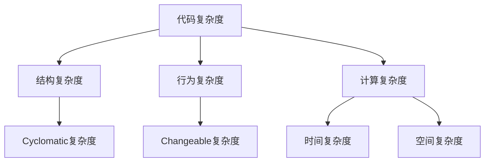

                 

# 代码复杂度管理：维护长期可持续的代码库

## 关键词

代码复杂度，代码维护，可持续代码库，度量方法，降低策略，工具使用，案例分析

## 摘要

本文旨在探讨代码复杂度的概念、度量方法以及管理策略，以帮助开发者维护长期可持续的代码库。通过详细分析代码复杂度的定义、评估方法、降低策略，本文旨在提供一套系统的代码复杂度管理方法。同时，本文还将介绍一些实用的工具和案例分析，以期为开发者提供实践指导和启示。

## 第一部分：代码复杂度基础

### 1.1 代码复杂度定义与类型

#### 1.1.1 复杂度的基本概念

代码复杂度是指代码中难以理解、难以修改和维护的特性。它反映了代码结构的复杂程度，对代码的可维护性有着直接的影响。代码复杂度越高，代码的可维护性越低，修改和扩展代码的风险越大。

#### 1.1.2 常见代码复杂度类型

- **结构复杂度**：指代码的结构复杂程度，如函数、类的复杂度，通常使用如Cyclomatic复杂度（CC）来度量。
- **行为复杂度**：指代码的行为复杂程度，如函数、类的行为复杂度，通常使用如Changeable复杂度（CBO）来度量。
- **计算复杂度**：指算法的计算复杂度，如时间复杂度和空间复杂度，通常用于评估算法的性能。

### 1.2 代码复杂度的度量方法

#### 1.2.1 CC（Cyclomatic复杂度）

Cyclomatic复杂度（CC）是一种用于度量代码复杂度的方法，它通过计算代码中的决策点数来衡量代码的复杂度。具体计算方法如下：

1. 找到程序中的所有决策点（如if、while等）。
2. 计算决策点的数量，记为`E`。
3. 计算边数（包括入口边和出口边），记为`N`。
4. 计算独立路径数，记为`P`：`P = E - N + 2`。
5. Cyclomatic复杂度：`CC = P`。

#### 1.2.2 LCOM（类间关联复杂度）

LCOM（类间关联复杂度）是用于度量类之间关联复杂度的一种方法。它通过计算类之间的关联程度来衡量类的复杂度。具体计算方法如下：

1. 找到类之间的所有关联（如继承、实现接口等）。
2. 计算每个类与其他类之间的关联数。
3. 对于每个类，计算其与其他类的最小关联数。
4. LCOM值：对于每个类，取其最小关联数，这些最小关联数的最大值即为LCOM值。

### 1.3 代码复杂度的关系架构

代码复杂度的概念和类型可以通过以下Mermaid流程图来表示：



## 第二部分：代码复杂度评估与降低

### 2.1 代码复杂度评估

#### 2.1.1 评估工具与流程

在评估代码复杂度时，常用的工具有SonarQube、PMD、FindBugs等。这些工具可以帮助开发者自动评估代码的复杂度，并提供详细的报告。

1. **安装和配置评估工具**：根据开发环境选择合适的评估工具，并安装和配置。
2. **运行评估工具**：使用评估工具对代码库进行评估。
3. **分析评估报告**：阅读评估报告，识别高复杂度的代码。

#### 2.1.2 评估报告生成与解读

评估报告通常包括以下内容：

1. **复杂度指标**：如Cyclomatic复杂度、Changeable复杂度等。
2. **代码块列表**：列出复杂度较高的代码块。
3. **建议**：提供降低复杂度的建议，如重构代码、改进编码规范等。

### 2.2 降低代码复杂度的策略

#### 2.2.1 设计模式

设计模式是一套被反复使用、经过分类的、代码设计经验的总结。通过使用设计模式，可以降低代码的复杂度，提高代码的可维护性和可扩展性。

1. **创建型模式**：如工厂模式、单例模式等，用于创建对象。
2. **结构型模式**：如适配器模式、装饰者模式等，用于组合和封装对象。
3. **行为型模式**：如策略模式、观察者模式等，用于处理对象之间的交互。

#### 2.2.2 编码规范

编码规范是确保代码质量和一致性的重要手段。通过遵循编码规范，可以降低代码的复杂度，提高代码的可读性和可维护性。

1. **命名规范**：使用有意义且一致的命名方式。
2. **代码格式**：保持代码的格式一致性，如缩进、空格等。
3. **注释规范**：添加必要的注释，说明代码的功能和目的。

#### 2.2.3 代码重构

代码重构是通过改进代码的结构和逻辑，降低代码复杂度，提高代码质量的过程。常见的代码重构方法包括：

1. **提取方法**：将重复的代码提取为独立的方法。
2. **替换条件**：使用设计模式替换复杂的条件语句。
3. **合并重复代码**：将重复的代码合并为单个代码块。

### 2.3 代码复杂度降低策略的伪代码

以下是一个简单的代码重构示例，用于降低方法复杂度：

```python
# 原始方法
def calculate_bonus(salary, performance):
    if performance == "excellent":
        return salary * 1.2
    elif performance == "good":
        return salary * 1.1
    else:
        return salary

# 重构方法
def calculate_bonus(salary, performance):
    base_bonus = {"excellent": 1.2, "good": 1.1, "poor": 1.0}
    return salary * base_bonus[performance]
```

## 第三部分：可持续的代码库维护

### 3.1 长期维护的代码库特点

#### 3.1.1 代码可读性

代码可读性是长期维护代码库的重要特点。可读性好的代码易于理解和修改，有助于降低维护成本。

1. **使用清晰简洁的变量名和函数名**。
2. **合理使用空格和缩进**。
3. **注释清晰准确，说明代码的功能和目的**。

#### 3.1.2 代码可维护性

代码可维护性是指代码能够被轻松修改和扩展，以适应需求变化。提高代码可维护性的方法包括：

1. **遵循编码规范**。
2. **使用设计模式**。
3. **编写单元测试**。

### 3.2 维护长期可持续代码库的最佳实践

#### 3.2.1 版本控制

版本控制是维护代码库的重要工具。通过版本控制，可以方便地管理代码的变更历史，回滚错误版本，以及合并多个分支。

1. **使用Git等版本控制工具**。
2. **遵循分支管理策略**，如Git Flow。
3. **定期进行代码审查**。

#### 3.2.2 测试驱动开发

测试驱动开发（TDD）是一种开发方法，它要求在编写功能代码之前先编写测试代码。通过TDD，可以确保代码的质量和可维护性。

1. **编写单元测试**，覆盖代码的所有功能。
2. **持续集成**，确保代码在每次提交后都经过测试。
3. **编写集成测试**，确保代码模块之间的交互正常。

#### 3.2.3 代码审查

代码审查是一种团队合作方法，通过审查其他开发者的代码，可以及时发现潜在的问题，并提高代码质量。

1. **定期进行代码审查**。
2. **使用代码审查工具**，如GitLab、Phabricator等。
3. **遵循代码审查流程**，确保审查的效率和质量。

## 第四部分：代码复杂度管理工具

### 4.1 代码复杂度管理工具简介

在代码复杂度管理中，使用工具可以大大提高效率。以下是一些常用的代码复杂度管理工具：

1. **SonarQube**：一个开源的质量管理平台，提供代码扫描、复杂度评估等功能。
2. **PMD**：一个开源的代码分析工具，提供复杂度评估、编码规范检查等功能。
3. **FindBugs**：一个开源的静态代码分析工具，用于检测代码中的潜在问题。

### 4.2 工具应用实例

以下是一个使用SonarQube进行代码复杂度评估的实例：

1. **安装和配置SonarQube**：在服务器上安装SonarQube，并配置Java环境。
2. **上传代码**：将代码库上传到SonarQube服务器。
3. **运行扫描**：启动扫描任务，等待结果。
4. **分析报告**：查看复杂度报告，识别高复杂度的代码块。

```shell
sonar-scanner -Dsonar.projectKey=my_project -Dsonar.sources=src
```

## 第五部分：案例分析

### 5.1 成功的代码复杂度管理案例

#### 5.1.1 案例一：公司A的代码复杂度管理实践

公司A通过使用SonarQube和PMD等工具，定期进行代码复杂度评估和编码规范检查。他们还遵循TDD开发方法，确保代码质量。这些措施使得公司A的代码库具有较高的可读性和可维护性，有效降低了维护成本。

### 5.1.2 案例二：开源项目B的代码库维护策略

开源项目B采用Git Flow分支管理策略，并定期进行代码审查。他们还使用FindBugs进行静态代码分析，及时发现潜在问题。这些措施使得项目B的代码库具有较高的质量和稳定性，吸引了大量的贡献者。

### 5.2 失败的案例分析与启示

#### 5.2.1 案例三：公司C的代码复杂度管理失误

公司C未能定期进行代码复杂度评估和编码规范检查，导致代码库中的复杂度不断积累。最终，公司C不得不花费大量时间进行代码重构，以恢复代码库的可维护性。

#### 5.2.2 案例四：开源项目D的维护困境

开源项目D缺乏有效的代码审查和测试，导致代码质量下降，复杂度增加。项目维护者不得不花费大量时间处理bug和修复代码，影响了项目的稳定性和发展。

## 附录

### 附录 A：代码复杂度管理资源

#### A.1 书籍推荐

- 《代码大全》（《Clean Code: A Handbook of Agile Software Craftsmanship》）
- 《代码大全2》（《Clean Architecture: A Craftsman's Guide to Software Structure and Design》）

#### A.2 在线资源与工具

- SonarQube：[https://www.sonarqube.org/](https://www.sonarqube.org/)
- PMD：[https://pmd.sourceforge.io/](https://pmd.sourceforge.io/)
- FindBugs：[https://findbugs.sourceforge.net/](https://findbugs.sourceforge.net/)
- Git Flow：[https://git-scm.com/book/en/v2/Git-Branching-Workflow](https://git-scm.com/book/en/v2/Git-Branching-Workflow)

### 作者信息

作者：AI天才研究院/AI Genius Institute & 禅与计算机程序设计艺术 /Zen And The Art of Computer Programming

