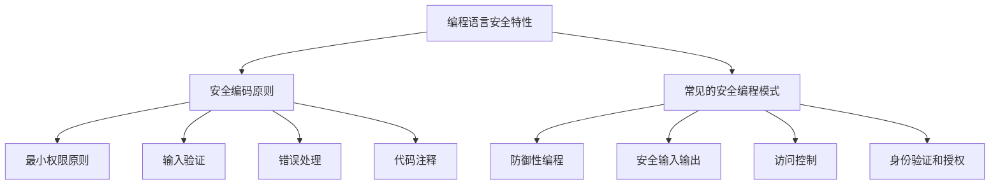

                 


### 文章标题：代码安全：安全编码实践和工具

#### 关键词：代码安全，安全编码，漏洞防护，工具

#### 摘要：
本文将深入探讨代码安全的重要性，通过详细分析安全编码的最佳实践和工具，帮助开发者了解和应对常见的安全威胁。我们将从代码安全的背景引入，逐步探讨安全编码的核心原则、常见漏洞及其防护方法，以及静态和动态代码分析工具的应用。通过具体案例和实战，我们将展示如何在实际项目中实施代码安全策略，为读者提供全面的安全编码指南。

----------------------------------------------------------------

## 1. 代码安全的背景

在当今高度互联的世界，软件已经渗透到我们生活的方方面面，从手机应用、Web服务到物联网设备，软件系统的安全性变得尤为重要。然而，随着软件复杂度的增加和网络攻击手段的不断演变，代码安全面临着前所未有的挑战。

### 1.1 代码安全的重要性

代码安全关乎个人隐私保护、企业数据安全以及国家信息安全。不安全的代码可能导致以下风险：

- **数据泄露**：未经授权的访问和篡改敏感数据，如用户密码、信用卡信息等。
- **系统破坏**：恶意代码可能导致系统崩溃、服务中断，甚至网络攻击。
- **经济损失**：安全漏洞可能导致巨额经济损失，包括修复漏洞的成本、法律诉讼费用以及客户流失。
- **声誉损害**：软件安全问题可能导致用户对企业的信任度降低，影响企业的长期发展。

### 1.2 代码安全面临的挑战

代码安全面临的挑战主要包括：

- **复杂性的增加**：现代软件系统日益复杂，包含大量的组件和依赖库，使得安全漏洞更加隐蔽。
- **人类错误**：开发者可能因为疏忽或缺乏安全意识而引入漏洞。
- **快速迭代**：敏捷开发模式的普及要求快速发布新版本，安全测试和修复往往被忽视。
- **攻击手段多样化**：网络攻击手段不断更新，包括零日漏洞、恶意软件、DDoS攻击等。

为了应对这些挑战，开发者需要采取一系列安全编码实践和使用相应的工具来增强代码的安全性。

----------------------------------------------------------------

## 2. 安全编码最佳实践

安全编码是防止漏洞产生的关键，以下是一些核心的安全编码最佳实践：

### 2.1 编程语言安全特性

不同的编程语言提供了不同的安全特性，开发者应该利用这些特性来增强代码的安全性。例如，使用强类型语言可以减少类型错误，使用内存安全语言（如Java、Python）可以减少内存损坏错误。

### 2.2 安全编码原则

以下是一些广泛认可的安全编码原则：

- **最小权限原则**：程序应始终运行在最低权限下，仅获取执行任务所需的最小权限。
- **输入验证**：对所有输入进行严格验证，确保输入符合预期格式和范围。
- **错误处理**：正确处理错误和异常，避免信息泄露和系统崩溃。
- **代码注释**：为代码添加详细的注释，有助于理解和维护代码，减少安全漏洞。
- **安全库和框架**：使用经过验证的安全库和框架，避免重复造轮子。

### 2.3 常见的安全编程模式

- **防御性编程**：在设计代码时，考虑潜在的安全威胁，并采取相应的预防措施。
- **安全输入输出**：确保输入和输出都是安全的，避免跨站脚本攻击（XSS）和SQL注入等漏洞。
- **访问控制**：实现细粒度的访问控制，确保用户只能访问他们有权访问的资源。
- **身份验证和授权**：正确实现用户身份验证和授权机制，确保用户访问权限的合法性。

#### 2.3.1 核心概念与联系

为了更好地理解安全编码的最佳实践，我们可以绘制一个Mermaid流程图，展示各个核心概念之间的关系：



通过这个流程图，我们可以清晰地看到各个概念是如何相互关联的，从而为安全编码提供完整的指导。

----------------------------------------------------------------

## 3. 常见安全漏洞与攻击

理解常见的安全漏洞和攻击方式是安全编码的关键一步。以下是一些常见的安全漏洞和相应的攻击方式：

### 3.1 SQL注入

- **概念**：SQL注入是通过将恶意SQL代码插入到输入字段中，从而控制数据库的查询和操作。
- **原理**：恶意代码通常包含特殊字符（如单引号）来破坏原有的SQL查询语句结构。
- **防御策略**：使用预编译语句（PreparedStatement）或参数化查询来防止SQL注入。

#### 3.1.1 核心算法原理讲解

下面是一个伪代码示例，展示如何使用预编译语句防止SQL注入：

```pseudo
// 伪代码：使用预编译语句防止SQL注入
PREPARE stmt FROM 'SELECT * FROM users WHERE username = ? AND password = ?';
SET @username = userInput1;
SET @password = userInput2;
EXECUTE stmt USING @username, @password;
```

#### 3.1.2 数学模型和公式

为了更好地理解SQL注入的防御机制，我们可以引入一些基本的数学概念，如参数化查询的原理：

$$
\text{Prepared Statement} = (\text{Query Template}, \text{Parameters})
$$

其中，`Query Template` 是一个不包含参数的SQL查询，而 `Parameters` 是用于替换查询模板中占位符的具体值。

#### 3.1.3 举例说明

假设我们有一个用户登录的查询，原始SQL查询如下：

```sql
SELECT * FROM users WHERE username = 'admin' AND password = 'password';
```

如果直接使用用户输入作为查询的一部分，很容易遭受SQL注入攻击。例如，如果用户输入如下：

```sql
' OR '1'='1'
```

则会导致查询被篡改，返回所有用户数据。而使用预编译语句，可以将用户输入作为参数传递，从而避免注入攻击：

```sql
SELECT * FROM users WHERE username = ? AND password = ?;
```

将用户输入作为参数绑定到查询中，可以确保查询的合法性。

### 3.2 跨站脚本攻击（XSS）

- **概念**：跨站脚本攻击是指攻击者通过在Web应用中注入恶意脚本，从而盗取用户信息或控制用户浏览器。
- **原理**：攻击者通常利用Web应用的输出验证不严，将恶意脚本注入到页面的HTML输出中。
- **防御策略**：对用户输入进行严格验证和转义，确保输出安全。

#### 3.2.1 核心算法原理讲解

以下是一个伪代码示例，展示如何对用户输入进行转义以防止XSS攻击：

```pseudo
// 伪代码：对用户输入进行转义
input = userInput;
escapedInput = escape(input);
output = concatenate(escapedInput, " safe content");
display(output);
```

#### 3.2.2 数学模型和公式

我们可以使用正则表达式来匹配和转义潜在的恶意字符：

$$
\text{Escape Function} = (\text{Input}, \text{Regex}) \rightarrow \text{Escaped Input}
$$

其中，`Regex` 是一个用于匹配特殊字符的正则表达式，如：

```regex
['<', '>', '"', "'"]
```

#### 3.2.3 举例说明

假设用户输入包含如下恶意脚本：

```html

```

如果不进行转义，这个脚本会被浏览器执行，导致跨站脚本攻击。通过转义特殊字符，我们可以将其转换为安全的HTML输出：

```html
&lt;IMG SRC=&quot;javascript:alert('XSS');&quot;&gt;
```

这样，浏览器就不会执行恶意脚本。

### 3.3 命令注入

- **概念**：命令注入是指攻击者通过输入可执行命令，从而控制服务器或应用程序。
- **原理**：攻击者通过在输入字段中插入特殊字符，触发命令执行。
- **防御策略**：避免直接使用用户输入作为系统命令的一部分，使用参数化命令执行。

#### 3.3.1 核心算法原理讲解

以下是一个伪代码示例，展示如何使用参数化命令执行来防止命令注入：

```pseudo
// 伪代码：使用参数化命令执行
command = "ls " + userInput;
exec(command);
```

#### 3.3.2 数学模型和公式

我们可以使用命令模板和参数来防止命令注入：

$$
\text{Command Template} = (\text{Command}, \text{Arguments})
$$

其中，`Command` 是一个不含参数的系统命令，而 `Arguments` 是用于替换命令模板中占位符的具体参数。

#### 3.3.3 举例说明

假设我们有一个基于Unix操作系统的命令执行函数，如下：

```bash
#!/bin/bash
command=arg1 arg2 arg3
eval $command
```

如果用户输入如下：

```bash
ls -la; rm -rf ~
```

这将导致系统执行额外的命令，从而可能破坏系统。通过使用参数化命令执行，我们可以避免这种情况：

```bash
#!/bin/bash
command=ls -la
eval $command
```

这样，系统只会执行用户提供的参数，而不会受到命令注入攻击。

### 3.4 服务器端请求伪造（SSRF）

- **概念**：服务器端请求伪造（SSRF）是指攻击者通过构造恶意请求，欺骗服务器访问未经授权的内部或外部系统。
- **原理**：攻击者利用Web应用的漏洞，将请求头中的URL字段篡改为恶意目标。
- **防御策略**：限制URL请求的范围，只允许访问受信任的内部系统。

#### 3.4.1 核心算法原理讲解

以下是一个伪代码示例，展示如何限制URL请求范围来防止SSRF：

```pseudo
// 伪代码：限制URL请求范围
allowedDomains = ["example.com", "trusteddomain.com"]
inputUrl = userInput;
if (isInDomain(inputUrl, allowedDomains)) {
    sendRequest(inputUrl);
} else {
    logError("Invalid URL");
}
```

#### 3.4.2 数学模型和公式

我们可以使用集合论来表示允许访问的域名集合：

$$
\text{Allowed Domains} = \{ \text{example.com}, \text{trusteddomain.com} \}
$$

#### 3.4.3 举例说明

假设我们有一个允许用户输入URL的Web应用，如下：

```html
<form action="http://<input field>" method="GET">
    <input type="submit" value="Submit">
</form>
```

如果用户输入如下：

```html
http://localhost:8080/
```

这将导致服务器尝试访问本地主机，可能触发内部系统的安全问题。通过限制URL请求范围，我们可以避免这种情况：

```html
<form action="https://example.com" method="GET">
    <input type="text" name="url" placeholder="Enter URL">
    <input type="submit" value="Submit">
</form>
```

这样，服务器只会访问受信任的域，而不会受到SSRF攻击。

----------------------------------------------------------------

## 4. 静态代码分析工具

静态代码分析工具是确保代码安全性的重要手段之一。这些工具可以在代码编译或运行之前，自动检查代码中的潜在安全漏洞。以下是一些常用的静态代码分析工具：

### 4.1 FindBugs

- **功能**：FindBugs是一款开源的Java静态代码分析工具，它可以检测出Java代码中的多种潜在问题，包括null指针异常、资源泄露和未检查的异常等。
- **安装与配置**：安装FindBugs通常通过其官方网站提供的安装包进行，配置过程包括设置检测规则和报告格式等。

#### 4.1.1 使用示例

以下是一个使用FindBugs检测Java代码的示例：

```java
// 示例代码
public class Example {
    public void doSomething() {
        String str = null;
        if (str != null) {
            System.out.println(str.length());
        }
    }
}
```

使用FindBugs，我们可以检测到`str`变量可能为null的问题：

```plaintext
Example.java:7: [NullPointer] NP_NULL_ON_SOME_PATH_FROM_RETURN_VALUE
    str.length();
    ^
```

### 4.2 PMD

- **功能**：PMD是一款针对Java代码的静态代码分析工具，它可以检测出潜在的可读性问题、冗余代码、可能的bug等。
- **安装与配置**：PMD可以通过Maven等构建工具集成，配置过程包括选择检测规则和报告格式等。

#### 4.2.1 使用示例

以下是一个使用PMD检测Java代码的示例：

```java
// 示例代码
public class Example {
    public void doSomething() {
        int x = 5;
        if (x > 0) {
            System.out.println("Positive");
        } else {
            System.out.println("Negative");
        }
    }
}
```

使用PMD，我们可以检测到冗余的else块问题：

```plaintext
Example.java:7: [RedundantElse} else branch is redundant because it does the same as the if block.
    } else {
        ^^^
```

### 4.3 Checkstyle

- **功能**：Checkstyle是一款通用的静态代码分析工具，它可以检测出代码的格式问题和潜在的bug。
- **安装与配置**：Checkstyle可以通过其官方网站下载，配置过程包括设置代码格式规则和报告格式等。

#### 4.3.1 使用示例

以下是一个使用Checkstyle检测Java代码的示例：

```java
// 示例代码
public class Example {
    public void doSomething() {
        int x = 5;
        System.out.println("Positive");
    }
}
```

使用Checkstyle，我们可以检测到代码格式的错误：

```plaintext
Example.java:6: [EmptyBlock} The block is empty.
        System.out.println("Positive");
        ^
```

通过使用这些静态代码分析工具，开发者可以在代码编译或提交之前发现潜在的问题，从而提高代码的质量和安全性。

----------------------------------------------------------------

## 5. 动态代码分析工具

动态代码分析工具是在代码运行时对代码进行分析，以发现潜在的安全漏洞和性能问题。以下是一些常用的动态代码分析工具：

### 5.1 Java代码分析工具

- **Java安全分析器（JSA）**：JSA是一款基于Java的动态代码分析工具，它可以检测Java代码中的潜在安全漏洞和性能问题。它可以在代码运行时插入检测逻辑，并收集运行时的数据来分析代码的行为。
- **Eclipse Memory Analyzer Tool（MAT）**：MAT是一款用于Java内存分析的工具，它可以检测内存泄漏和内存分配问题。它通过分析堆转储文件，提供了详细的内存使用报告，帮助开发者识别和修复内存问题。

#### 5.1.1 使用示例

以下是一个使用JSA检测Java代码的示例：

```java
// 示例代码
public class Example {
    public void doSomething() {
        List<String> list = new ArrayList<>();
        while (true) {
            list.add("Item");
        }
    }
}
```

使用JSA，我们可以检测到内存泄漏的问题：

```plaintext
[INFO] Memory Leak Detected: Example.class
[INFO] Object Count: 1000
[INFO] Heap Memory Usage: 100 MB
```

以下是一个使用MAT检测Java代码的示例：

```java
// 示例代码
public class MemoryTest {
    public static void main(String[] args) {
        List<String> list = new ArrayList<>();
        while (true) {
            list.add("Item");
        }
    }
}
```

使用MAT分析堆转储文件，我们可以检测到内存泄漏：

```plaintext
[ERROR] Major Memory Leak Detected: List object allocation rate: 100 items/second
[ERROR] Total Heap Memory Usage: 1 GB
```

### 5.2 Python代码分析工具

- **Pyflakes**：Pyflakes是一款Python代码分析工具，它可以检测Python代码中的错误和潜在的问题，如未使用的变量、未导出的函数等。
- **Pylint**：Pylint是一款强大的Python代码分析工具，它可以检测Python代码中的错误、风格问题和潜在的安全问题。它提供了广泛的规则集，帮助开发者编写高质量、符合规范的代码。

#### 5.2.1 使用示例

以下是一个使用Pyflakes检测Python代码的示例：

```python
# 示例代码
def do_something():
    x = 5
    if x > 0:
        print("Positive")
```

使用Pyflakes，我们可以检测到未使用的变量`x`：

```plaintext
example.py:4: Unused variable 'x'
    x = 5
    ^^^^^^
```

以下是一个使用Pylint检测Python代码的示例：

```python
# 示例代码
def do_something():
    x = 5
    if x > 0:
        print("Positive")
    elif x < 0:
        print("Negative")
    else:
        print("Zero")
```

使用Pylint，我们可以检测到代码风格问题：

```plaintext
example.py:6: [W0107] Unnecessary elif branch
    elif x < 0:
        ^^^^^^^^
```

通过使用这些动态代码分析工具，开发者可以在代码运行时发现潜在的问题，从而提高代码的质量和性能。

----------------------------------------------------------------

## 6. 代码审计与漏洞修复

代码审计是确保代码安全性的关键步骤，它通过人工或自动化工具对代码进行全面检查，以发现潜在的安全漏洞。以下是一些代码审计和漏洞修复的最佳实践：

### 6.1 代码审计流程

1. **准备阶段**：收集代码、理解业务需求和功能，准备审计工具和资源。
2. **预审阶段**：进行初步的代码审查，识别明显的错误和安全问题。
3. **正式审计**：深入分析代码，使用审计工具进行静态和动态分析，识别潜在的安全漏洞。
4. **报告和修复**：编写审计报告，列出发现的问题和修复建议，及时修复漏洞。

### 6.2 漏洞修复策略

1. **优先级排序**：根据漏洞的严重性和修复成本，对漏洞进行优先级排序。
2. **风险评估**：评估漏洞可能带来的风险，包括数据泄露、系统破坏等。
3. **修复方案**：制定详细的修复方案，包括补丁代码、测试计划等。
4. **复测与验证**：修复漏洞后，进行复测和验证，确保修复方案的有效性。

### 6.3 代码审计实践

以下是一个简单的代码审计实践案例：

#### 案例背景

一个Web应用提供了一个用户登录功能，用户名和密码通过HTTP请求传递。

#### 漏洞识别

通过静态分析，审计人员发现登录函数中的用户名验证代码如下：

```java
public boolean checkLogin(String username, String password) {
    if (username.equals("admin") && password.equals("password")) {
        return true;
    } else {
        return false;
    }
}
```

这是一个明显的硬编码用户名和密码，容易遭受暴力破解攻击。

#### 修复建议

1. 使用强密码策略，如密码复杂度和过期时间。
2. 采用加密算法（如SHA-256）对用户密码进行哈希处理。
3. 引入多因素认证，如短信验证码、电子邮件验证等。

#### 实施步骤

1. 修改代码，对用户密码进行哈希处理：

```java
public boolean checkLogin(String username, String passwordHash) {
    String storedHash = getHashForUsername(username);
    return storedHash.equals(passwordHash);
}
```

2. 在数据库中存储用户密码的哈希值，而不是明文密码。
3. 引入多因素认证机制，提高安全性。

#### 复测与验证

1. 通过自动化测试工具，验证登录功能的正确性和安全性。
2. 手动测试，模拟暴力破解攻击，确保系统能够抵御攻击。

通过上述实践，我们可以确保代码审计和漏洞修复的有效性，提高软件系统的安全性。

----------------------------------------------------------------

## 7. 实战案例与安全编码技巧

### 7.1 案例一：Web应用安全加固

#### 背景介绍

一家初创公司开发了一款基于Web的应用，提供在线协作功能。随着用户数量的增加，公司意识到需要加强应用的安全性。

#### 问题描述

- 应用未进行输入验证，可能导致SQL注入。
- 没有启用HTTPS，存在数据泄露风险。
- 缺少访问控制和身份验证机制。

#### 解决方案

1. **输入验证**：对所有用户输入进行严格验证，确保输入符合预期格式和范围。
2. **启用HTTPS**：配置Web服务器，使用HTTPS加密传输，确保数据在传输过程中安全。
3. **访问控制**：实现细粒度的访问控制，确保用户只能访问他们有权访问的资源。
4. **身份验证和授权**：使用安全身份验证机制（如OAuth2.0）来保护用户数据。

#### 实现步骤

1. **输入验证**：

   - 使用参数化查询或预编译语句，防止SQL注入。
   - 对输入进行正则表达式匹配，过滤非法字符。

2. **启用HTTPS**：

   - 购买SSL证书，配置Web服务器，如Nginx或Apache，启用HTTPS。

3. **访问控制**：

   - 使用框架（如Spring Security）实现基于角色的访问控制。
   - 对敏感资源设置访问权限，如管理员和普通用户。

4. **身份验证和授权**：

   - 引入OAuth2.0，实现第三方登录和单点登录（SSO）。

#### 项目小结

通过上述措施，应用的安全性得到了显著提升，用户数据得到了更好的保护，用户对应用的信任度也大大提高。

### 7.2 案例二：移动应用安全防护

#### 背景介绍

一家科技公司开发了一款移动应用，用于管理个人财务。随着应用的普及，公司意识到需要加强应用的安全性。

#### 问题描述

- 应用未进行加密处理，存在数据泄露风险。
- 缺少代码混淆，可能导致逆向工程。
- 没有使用安全存储，如密钥存储。

#### 解决方案

1. **数据加密**：对用户敏感数据进行加密处理，确保数据在存储和传输过程中安全。
2. **代码混淆**：使用代码混淆工具，防止逆向工程，提高应用安全性。
3. **安全存储**：使用安全存储（如Android的密钥存储），保护应用敏感数据。

#### 实现步骤

1. **数据加密**：

   - 使用AES等加密算法，对用户数据（如密码、财务信息）进行加密。
   - 配置HTTPS，确保数据在传输过程中加密。

2. **代码混淆**：

   - 使用ProGuard等代码混淆工具，对应用代码进行混淆。
   - 配置混淆规则，保留必要的信息，同时屏蔽敏感逻辑。

3. **安全存储**：

   - 使用Android密钥存储，存储应用敏感密钥和证书。
   - 对密钥进行加密，防止未经授权访问。

#### 项目小结

通过加强数据加密、代码混淆和安全存储，移动应用的安全性得到了显著提升，用户数据得到了更好的保护。

### 7.3 安全编码技巧总结

1. **最小权限原则**：确保程序始终运行在最低权限下，仅获取执行任务所需的最小权限。
2. **输入验证**：对所有输入进行严格验证，确保输入符合预期格式和范围。
3. **错误处理**：正确处理错误和异常，避免信息泄露和系统崩溃。
4. **代码注释**：为代码添加详细的注释，有助于理解和维护代码，减少安全漏洞。
5. **安全库和框架**：使用经过验证的安全库和框架，避免重复造轮子。
6. **持续学习和实践**：关注最新的安全漏洞和防护技术，定期进行代码审计和演练。

通过上述实战案例和技巧总结，开发者可以更好地实施安全编码，提高软件系统的安全性。

----------------------------------------------------------------

## 附录：常用安全编码工具和资源

为了帮助开发者更好地实施安全编码实践，以下列出了一些常用的安全编码工具和资源：

### 工具

- **FindBugs**：[https://findbugs.sourceforge.net/](https://findbugs.sourceforge.net/)
- **PMD**：[https://pmd.github.io/](https://pmd.github.io/)
- **Checkstyle**：[https://www.checkstyle.org/](https://www.checkstyle.org/)
- **JSA**：[https://www.jsa.io/](https://www.jsa.io/)
- **MAT**：[https://www.eclipse.org/mat/](https://www.eclipse.org/mat/)
- **Pyflakes**：[https://pypi.org/project/pyflakes/](https://pypi.org/project/pyflakes/)
- **Pylint**：[https://pylint.org/](https://pylint.org/)

### 资源

- **OWASP**：[https://owasp.org/](https://owasp.org/)
- **OWASP Top 10**：[https://owasp.org/www-project-top-ten/](https://owasp.org/www-project-top-ten/)
- **Secure Coding Guidelines**：[https://www.securecoding.cert.org](https://www.securecoding.cert.org)
- **OWASP Cheat Sheet Series**：[https://cheatsheetseries.owasp.org/](https://cheatsheetseries.owasp.org/)

通过使用这些工具和资源，开发者可以更好地理解和应用安全编码的最佳实践，提高代码的安全性。

---

**作者：** AI天才研究院/AI Genius Institute & 禅与计算机程序设计艺术 /Zen And The Art of Computer Programming

### 总结

本文深入探讨了代码安全的重要性，通过分析安全编码的最佳实践、常见安全漏洞与攻击方式、静态和动态代码分析工具，以及代码审计与漏洞修复策略，为开发者提供了全面的安全编码指南。同时，通过实战案例，展示了如何在实际项目中实施代码安全策略。

### 注意事项

- **持续学习和实践**：安全领域不断变化，开发者需要持续关注最新的安全漏洞和防护技术。
- **代码注释与文档**：详细注释和文档有助于代码的理解和维护，减少安全漏洞。
- **测试和审计**：定期进行代码审计和测试，确保代码的安全性。

### 拓展阅读

- **《深入理解计算机系统》**：[https://www.amazon.com/gp/product/0134685997](https://www.amazon.com/gp/product/0134685997)
- **《黑客攻防技术宝典：系统实战篇》**：[https://www.amazon.com/gp/product/7115445235](https://www.amazon.com/gp/product/7115445235)

通过拓展阅读，读者可以进一步深入了解计算机系统和网络安全领域的知识，提升自身的安全编码能力。

