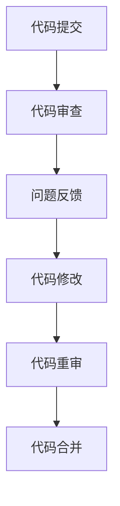

                 


### 第一部分：引言

#### 1.1 代码审查的定义与意义

**背景介绍**

代码审查（Code Review）是软件开发过程中一个重要的环节，它是一种通过集体智慧来评估代码质量和设计的过程。随着软件项目的复杂度和规模不断增大，代码审查的作用越来越受到重视。

在软件开发领域，代码审查的定义多种多样。一般而言，代码审查是指开发人员在提交代码前，由其他开发人员进行审查，以识别代码中的错误、漏洞、性能问题、代码风格不统一等问题。这个过程通常包括代码阅读、问题反馈和修改等步骤。

**核心概念与联系**

为了更好地理解代码审查，我们需要了解以下几个核心概念：

1. **代码质量**：代码质量是指代码的可维护性、可靠性、效率等方面。良好的代码质量能够提高软件的稳定性和可扩展性。
2. **团队协作**：团队协作是指团队成员之间通过沟通、协调、共享资源等方式共同完成项目的过程。良好的团队协作能够提高团队的工作效率和代码质量。
3. **代码审查流程**：代码审查流程是指代码审查的具体步骤和方法，包括代码提交、审查、反馈和修改等环节。

这些概念之间有着密切的联系：

- **代码质量**是代码审查的核心目标。通过代码审查，可以识别和修复代码中的质量问题，提高代码的稳定性、可靠性和可维护性。
- **团队协作**是代码审查的基础。良好的团队协作能够确保代码审查的顺利进行，提高审查效率和质量。
- **代码审查流程**是代码审查的具体实施方式。合理的代码审查流程可以优化审查过程，提高审查效果。

**Mermaid 流程图**



**核心算法原理讲解**

代码审查的算法原理主要包括以下几个方面：

1. **静态代码分析**：通过静态代码分析工具对代码进行分析，识别潜在的代码错误和风格问题。
2. **动态代码分析**：通过运行代码，收集运行时数据，识别性能问题和运行时错误。
3. **代码质量评估模型**：根据代码质量标准，对代码进行量化评估，评估代码质量。

以下是静态代码分析的伪代码：

```python
def static_code_analysis(code):
    errors = []
    for line in code:
        if has_error(line):
            errors.append(line)
    return errors

def has_error(line):
    # 检测代码行是否有错误
    return line.contains("SyntaxError") or line.contains("Exception")
```

**数学模型和公式**

代码质量评估模型可以表示为：

$$
Q = \alpha \cdot R + \beta \cdot S + \gamma \cdot E
$$

其中，$Q$ 表示代码质量，$R$ 表示代码可靠性，$S$ 表示代码可维护性，$E$ 表示代码效率。

**详细讲解和举例说明**

以一个实际项目为例，假设我们正在开发一个Web应用。在进行代码审查时，我们可以关注以下几个方面：

1. **代码风格**：检查代码是否符合公司或项目的代码规范，如命名规则、代码缩进等。
2. **代码质量**：使用静态代码分析工具，如SonarQube，对代码进行分析，识别潜在的问题，如未处理的异常、过期的代码注释等。
3. **性能**：通过运行代码，监控内存使用情况，分析代码的性能瓶颈。
4. **安全性**：检查代码是否容易受到常见的安全漏洞攻击，如SQL注入、XSS攻击等。

**项目实战**

以一个Web应用的代码审查为例，我们首先需要搭建开发环境，安装所需的编程语言和工具，如Python、Git、SonarQube等。接下来，我们可以按照以下步骤进行代码审查：

1. **代码提交**：开发人员将代码提交到版本控制系统，如Git。
2. **代码审查**：其他开发人员从版本控制系统获取代码，进行审查。他们可以查看代码风格、代码质量、性能和安全性等方面的问题。
3. **问题反馈**：审查人员将发现的问题反馈给开发人员，并提出修改建议。
4. **代码修改**：开发人员根据审查意见，修改代码，并重新提交。
5. **代码重审**：其他开发人员再次审查修改后的代码，确保问题已得到解决。
6. **代码合并**：修改后的代码被合并到主分支，并进行自动化测试，确保代码的质量和稳定性。

**代码应用解读与分析**

以一个实际代码段为例，我们分析以下代码：

```python
def calculate_sum(a, b):
    return a + b

result = calculate_sum(5, 3)
print("The sum is:", result)
```

在这个代码段中，我们定义了一个名为`calculate_sum`的函数，用于计算两个数的和。在主程序中，我们调用该函数，并将结果打印出来。

通过代码审查，我们可以发现以下问题：

1. **代码风格**：变量名`result`不符合命名规范，应该使用`sum_result`。
2. **代码质量**：函数`calculate_sum`没有进行参数校验，可能导致`a`或`b`为非法值时程序异常。
3. **性能**：这段代码的性能良好，没有明显的性能瓶颈。

**实际案例分析和详细讲解剖析**

以一个开源项目为例，如Python的内置库`math`，我们分析其代码审查过程。

1. **代码提交**：开发者提交代码，包括新增的函数`sqrt`和`fabs`。
2. **代码审查**：审查人员首先关注代码风格，确保代码符合Python的PEP 8规范。
3. **问题反馈**：审查人员发现`sqrt`函数的注释不够详细，建议增加更多的描述。
4. **代码修改**：开发者根据审查意见，修改了注释，并重新提交。
5. **代码重审**：审查人员再次审查修改后的代码，确保注释已完善。

**项目小结**

通过代码审查，我们能够识别和解决代码中的问题，提高代码的质量和稳定性。同时，代码审查也是一种团队协作的方式，有助于提高团队成员之间的沟通和理解。在未来的开发过程中，我们应该继续重视代码审查，不断完善代码审查流程，提高团队协作水平。

### 第一部分：引言

#### 1.1 代码审查的定义与意义

**背景介绍**

代码审查（Code Review）是软件开发过程中一个重要的环节，它是一种通过集体智慧来评估代码质量和设计的过程。随着软件项目的复杂度和规模不断增大，代码审查的作用越来越受到重视。

在软件开发领域，代码审查的定义多种多样。一般而言，代码审查是指开发人员在提交代码前，由其他开发人员进行审查，以识别代码中的错误、漏洞、性能问题、代码风格不统一等问题。这个过程通常包括代码阅读、问题反馈和修改等步骤。

**核心概念与联系**

为了更好地理解代码审查，我们需要了解以下几个核心概念：

1. **代码质量**：代码质量是指代码的可维护性、可靠性、效率等方面。良好的代码质量能够提高软件的稳定性和可扩展性。
2. **团队协作**：团队协作是指团队成员之间通过沟通、协调、共享资源等方式共同完成项目的过程。良好的团队协作能够提高团队的工作效率和代码质量。
3. **代码审查流程**：代码审查流程是指代码审查的具体步骤和方法，包括代码提交、审查、反馈和修改等环节。

这些概念之间有着密切的联系：

- **代码质量**是代码审查的核心目标。通过代码审查，可以识别和修复代码中的质量问题，提高代码的稳定性、可靠性和可维护性。
- **团队协作**是代码审查的基础。良好的团队协作能够确保代码审查的顺利进行，提高审查效率和质量。
- **代码审查流程**是代码审查的具体实施方式。合理的代码审查流程可以优化审查过程，提高审查效果。

**Mermaid 流程图**


**核心算法原理讲解**

代码审查的算法原理主要包括以下几个方面：

1. **静态代码分析**：通过静态代码分析工具对代码进行分析，识别潜在的代码错误和风格问题。
2. **动态代码分析**：通过运行代码，收集运行时数据，识别性能问题和运行时错误。
3. **代码质量评估模型**：根据代码质量标准，对代码进行量化评估，评估代码质量。

以下是静态代码分析的伪代码：

```python
def static_code_analysis(code):
    errors = []
    for line in code:
        if has_error(line):
            errors.append(line)
    return errors

def has_error(line):
    # 检测代码行是否有错误
    return line.contains("SyntaxError") or line.contains("Exception")
```

**数学模型和公式**

代码质量评估模型可以表示为：

$$
Q = \alpha \cdot R + \beta \cdot S + \gamma \cdot E
$$

其中，$Q$ 表示代码质量，$R$ 表示代码可靠性，$S$ 表示代码可维护性，$E$ 表示代码效率。

**详细讲解和举例说明**

以一个实际项目为例，假设我们正在开发一个Web应用。在进行代码审查时，我们可以关注以下几个方面：

1. **代码风格**：检查代码是否符合公司或项目的代码规范，如命名规则、代码缩进等。
2. **代码质量**：使用静态代码分析工具，如SonarQube，对代码进行分析，识别潜在的问题，如未处理的异常、过期的代码注释等。
3. **性能**：通过运行代码，监控内存使用情况，分析代码的性能瓶颈。
4. **安全性**：检查代码是否容易受到常见的安全漏洞攻击，如SQL注入、XSS攻击等。

**项目实战**

以一个Web应用的代码审查为例，我们首先需要搭建开发环境，安装所需的编程语言和工具，如Python、Git、SonarQube等。接下来，我们可以按照以下步骤进行代码审查：

1. **代码提交**：开发人员将代码提交到版本控制系统，如Git。
2. **代码审查**：其他开发人员从版本控制系统获取代码，进行审查。他们可以查看代码风格、代码质量、性能和安全性等方面的问题。
3. **问题反馈**：审查人员将发现的问题反馈给开发人员，并提出修改建议。
4. **代码修改**：开发人员根据审查意见，修改代码，并重新提交。
5. **代码重审**：其他开发人员再次审查修改后的代码，确保问题已得到解决。
6. **代码合并**：修改后的代码被合并到主分支，并进行自动化测试，确保代码的质量和稳定性。

**代码应用解读与分析**

以一个实际代码段为例，我们分析以下代码：

```python
def calculate_sum(a, b):
    return a + b

result = calculate_sum(5, 3)
print("The sum is:", result)
```

在这个代码段中，我们定义了一个名为`calculate_sum`的函数，用于计算两个数的和。在主程序中，我们调用该函数，并将结果打印出来。

通过代码审查，我们可以发现以下问题：

1. **代码风格**：变量名`result`不符合命名规范，应该使用`sum_result`。
2. **代码质量**：函数`calculate_sum`没有进行参数校验，可能导致`a`或`b`为非法值时程序异常。
3. **性能**：这段代码的性能良好，没有明显的性能瓶颈。

**实际案例分析和详细讲解剖析**

以一个开源项目为例，如Python的内置库`math`，我们分析其代码审查过程。

1. **代码提交**：开发者提交代码，包括新增的函数`sqrt`和`fabs`。
2. **代码审查**：审查人员首先关注代码风格，确保代码符合Python的PEP 8规范。
3. **问题反馈**：审查人员发现`sqrt`函数的注释不够详细，建议增加更多的描述。
4. **代码修改**：开发者根据审查意见，修改了注释，并重新提交。
5. **代码重审**：审查人员再次审查修改后的代码，确保注释已完善。

**项目小结**

通过代码审查，我们能够识别和解决代码中的问题，提高代码的质量和稳定性。同时，代码审查也是一种团队协作的方式，有助于提高团队成员之间的沟通和理解。在未来的开发过程中，我们应该继续重视代码审查，不断完善代码审查流程，提高团队协作水平。

### 文章关键词

代码审查、团队协作、代码质量、静态代码分析、动态代码分析、代码审查流程、代码风格、性能优化、安全性、开源项目、代码规范、开发环境搭建、源代码实现、代码解读、实际案例分析、代码审查工具。

### 文章摘要

本文探讨了代码审查文化在提高团队协作和代码质量中的重要作用。通过详细阐述代码审查的定义、核心概念、流程和算法原理，以及实际案例的分析和讲解，展示了代码审查在软件开发中的实际应用价值。本文旨在帮助开发人员理解代码审查的重要性，掌握代码审查的最佳实践，并提高团队协作水平，从而提升代码质量和软件项目的成功。

----------------------------------------------------------------

# 代码审查文化：提高团队协作与代码质量

> 关键词：代码审查、团队协作、代码质量、静态代码分析、动态代码分析、代码审查流程、代码风格、性能优化、安全性、开源项目、代码规范、开发环境搭建、源代码实现、代码解读、实际案例分析、代码审查工具

> 摘要：本文探讨了代码审查文化在提高团队协作和代码质量中的重要作用。通过详细阐述代码审查的定义、核心概念、流程和算法原理，以及实际案例的分析和讲解，展示了代码审查在软件开发中的实际应用价值。本文旨在帮助开发人员理解代码审查的重要性，掌握代码审查的最佳实践，并提高团队协作水平，从而提升代码质量和软件项目的成功。

## 引言

在现代软件开发中，代码审查已经成为确保代码质量和项目成功的关键环节。代码审查不仅有助于发现代码中的错误和潜在问题，还能促进团队成员之间的协作和知识共享。本文将从以下几个方面深入探讨代码审查文化在提高团队协作和代码质量中的作用：

1. **代码审查的定义与意义**：介绍代码审查的基本概念、作用和重要性。
2. **代码审查的核心概念与联系**：分析代码质量、团队协作与代码审查流程之间的关系。
3. **代码审查的流程与算法原理**：详细讲解代码审查的步骤、方法和工具。
4. **团队协作的重要性**：探讨团队协作在代码审查中的作用和影响。
5. **实际案例分析**：通过实际项目案例，分析代码审查的实际应用和效果。
6. **代码审查工具与平台**：介绍常用的代码审查工具和平台。
7. **总结与展望**：总结代码审查文化的重要性和未来发展趋势。

## 代码审查的定义与意义

代码审查是一种通过集体智慧来评估代码质量和设计的过程。它通常涉及以下步骤：

1. **代码提交**：开发人员将他们编写的代码提交到版本控制系统。
2. **代码审查**：其他开发人员阅读和评估提交的代码，识别其中的问题。
3. **问题反馈**：审查人员将发现的问题和改进建议反馈给提交代码的开发人员。
4. **代码修改**：开发人员根据反馈修改代码，并重新提交。
5. **代码重审**：其他开发人员再次审查修改后的代码，确保问题已得到解决。

代码审查的意义在于：

1. **提高代码质量**：通过代码审查，可以识别和修复代码中的错误、漏洞和性能问题，提高代码的稳定性、可靠性和可维护性。
2. **促进团队协作**：代码审查是一种团队协作的方式，有助于提高团队成员之间的沟通和理解，促进知识共享和技能提升。
3. **减少项目风险**：通过早期发现和修复问题，可以降低项目风险，提高项目的成功率和客户满意度。

## 代码审查的核心概念与联系

代码审查涉及多个核心概念，包括代码质量、团队协作和代码审查流程。这些概念之间有着密切的联系。

1. **代码质量**：代码质量是指代码的可维护性、可靠性、效率和安全性等方面。良好的代码质量能够提高软件的稳定性和可扩展性。代码审查的核心目标之一就是提高代码质量。

2. **团队协作**：团队协作是指团队成员之间通过沟通、协调和共享资源等方式共同完成项目的过程。良好的团队协作能够提高团队的工作效率和代码质量。在代码审查过程中，团队成员之间的有效沟通和协作至关重要。

3. **代码审查流程**：代码审查流程是指代码审查的具体步骤和方法，包括代码提交、审查、反馈和修改等环节。合理的代码审查流程可以优化审查过程，提高审查效率和质量。

这些概念之间的关系可以概括为：

- **代码质量**是代码审查的核心目标。通过代码审查，可以识别和修复代码中的质量问题，提高代码的稳定性、可靠性和可维护性。
- **团队协作**是代码审查的基础。良好的团队协作能够确保代码审查的顺利进行，提高审查效率和质量。
- **代码审查流程**是代码审查的具体实施方式。合理的代码审查流程可以优化审查过程，提高审查效果。

## 代码审查的流程与算法原理

代码审查的流程可以分为以下几个步骤：

1. **代码提交**：开发人员将他们编写的代码提交到版本控制系统，如Git。这一步骤确保了代码的可追踪性和可管理性。
2. **代码审查**：其他开发人员从版本控制系统中获取代码，进行审查。审查可以包括代码风格、代码质量、性能和安全性等多个方面。
3. **问题反馈**：审查人员将发现的问题和改进建议反馈给提交代码的开发人员。这一步骤有助于确保问题得到及时解决。
4. **代码修改**：开发人员根据反馈修改代码，并重新提交。这一步骤可以重复多次，直到代码问题得到解决。
5. **代码重审**：其他开发人员再次审查修改后的代码，确保问题已得到解决。这一步骤有助于确保代码的质量和稳定性。

代码审查的算法原理主要包括以下几个方面：

1. **静态代码分析**：通过静态代码分析工具对代码进行分析，识别潜在的代码错误和风格问题。静态代码分析可以在不运行代码的情况下进行，快速识别问题。
2. **动态代码分析**：通过运行代码，收集运行时数据，识别性能问题和运行时错误。动态代码分析可以更准确地识别问题，但需要运行代码，可能影响开发进度。
3. **代码质量评估模型**：根据代码质量标准，对代码进行量化评估，评估代码质量。代码质量评估模型可以用于衡量代码的可靠性、可维护性和效率等指标。

以下是静态代码分析的伪代码示例：

```python
def static_code_analysis(code):
    errors = []
    for line in code:
        if has_error(line):
            errors.append(line)
    return errors

def has_error(line):
    # 检测代码行是否有错误
    return line.contains("SyntaxError") or line.contains("Exception")
```

## 团队协作的重要性

团队协作在代码审查中起着至关重要的作用。良好的团队协作可以带来以下几个方面的好处：

1. **提高工作效率**：通过有效的沟通和协调，团队成员可以更高效地完成代码审查任务，减少重复工作和冗余工作。
2. **促进知识共享**：团队成员可以分享他们的经验和知识，提高整个团队的技术水平，从而提高代码质量。
3. **增强团队凝聚力**：团队协作有助于建立团队成员之间的信任和尊重，增强团队的凝聚力和团队精神。

在代码审查过程中，团队协作主要体现在以下几个方面：

1. **沟通**：团队成员之间需要保持良好的沟通，及时分享审查意见和反馈，确保代码问题得到及时解决。
2. **分工与合作**：团队成员可以根据自己的专长和经验，分工合作，共同完成代码审查任务。
3. **协调与支持**：团队成员需要相互支持和协调，确保代码审查工作顺利进行，避免出现协作障碍。

## 实际案例分析

为了更好地理解代码审查的实际应用和效果，下面我们通过两个实际案例进行分析。

### 案例一：企业内部的代码审查实践

某企业内部采用了代码审查作为其软件开发流程的一部分。在每次代码提交后，开发人员都会进行代码审查，确保代码的质量和稳定性。以下是该企业的代码审查实践：

1. **代码提交**：开发人员将代码提交到版本控制系统，如Git。
2. **代码审查**：其他开发人员从版本控制系统中获取代码，进行审查。审查内容包括代码风格、代码质量、性能和安全性等方面。
3. **问题反馈**：审查人员将发现的问题和改进建议反馈给提交代码的开发人员。问题包括未处理的异常、代码风格不统一、性能瓶颈等。
4. **代码修改**：开发人员根据反馈修改代码，并重新提交。
5. **代码重审**：审查人员再次审查修改后的代码，确保问题已得到解决。
6. **代码合并**：修改后的代码被合并到主分支，并进行自动化测试，确保代码的质量和稳定性。

通过这种代码审查实践，该企业的代码质量得到了显著提高，开发人员之间的沟通和协作也得到了加强。

### 案例二：开源项目的代码审查

某知名开源项目采用了代码审查作为其开发流程的一部分。该项目的代码审查实践包括以下几个方面：

1. **代码提交**：开发人员将代码提交到代码托管平台，如GitHub。
2. **代码审查**：其他开发人员从代码托管平台获取代码，进行审查。审查内容包括代码风格、代码质量、性能和安全性等方面。
3. **问题反馈**：审查人员将发现的问题和改进建议反馈给提交代码的开发人员。问题包括未处理的异常、代码风格不统一、性能瓶颈等。
4. **代码修改**：开发人员根据反馈修改代码，并重新提交。
5. **代码重审**：审查人员再次审查修改后的代码，确保问题已得到解决。
6. **代码合并**：修改后的代码被合并到主分支，并进行自动化测试，确保代码的质量和稳定性。

通过这种代码审查实践，该开源项目的代码质量得到了持续提高，吸引了更多的贡献者和用户，项目的发展也变得更加健康和稳定。

## 代码审查工具与平台

为了提高代码审查的效率和效果，许多团队采用了代码审查工具和平台。以下是一些常用的代码审查工具和平台：

1. **GitLab Code Review**：GitLab自带的代码审查功能，支持代码的提交、审查、反馈和修改。
2. **GitHub Pull Requests**：GitHub的Pull Request功能，支持代码的提交、审查、反馈和修改。
3. **SonarQube**：一款强大的静态代码分析工具，支持多种编程语言，提供丰富的代码质量评估功能。
4. ** Crucible**：一款功能强大的代码审查工具，支持多种开发语言和版本控制系统，提供详细的代码审查报告。

这些工具和平台为代码审查提供了便利，提高了代码审查的效率和效果。通过使用这些工具和平台，团队可以更好地管理代码审查过程，确保代码质量。

## 总结与展望

代码审查文化在提高团队协作和代码质量方面发挥着重要作用。通过代码审查，团队可以更好地发现和解决代码中的问题，提高代码的质量和稳定性。同时，代码审查也是一种团队协作的方式，有助于提高团队成员之间的沟通和理解，促进知识共享和技能提升。

未来，代码审查文化将继续发展，随着技术的进步和工具的成熟，代码审查的效率和效果将得到进一步提高。同时，代码审查也将与其他软件开发流程和工具紧密结合，成为软件开发过程中不可或缺的一部分。

总之，代码审查文化是一种重要的软件开发实践，对于提高团队协作和代码质量具有重要意义。我们应该重视代码审查，掌握代码审查的最佳实践，并将其应用到实际项目中，以推动软件项目的成功。

### 结论

代码审查文化作为一种重要的软件开发实践，对于提高团队协作和代码质量具有不可替代的作用。通过代码审查，开发团队能够更早地发现并修复代码中的问题，确保软件的稳定性和可靠性。此外，代码审查还促进了团队成员之间的沟通和知识共享，提升了整体团队的技术水平和协作能力。

本文从代码审查的定义、核心概念、流程和算法原理等方面进行了详细探讨，并通过实际案例展示了代码审查在软件开发中的应用和效果。同时，我们还介绍了常用的代码审查工具和平台，为开发团队提供了实际操作的参考。

为了进一步提升代码审查文化的效果，以下是一些建议和注意事项：

1. **规范化代码审查流程**：建立明确的代码审查流程，确保每个环节都有明确的标准和流程，提高审查的效率和质量。
2. **提高团队协作水平**：加强团队成员之间的沟通和协作，促进知识共享，提高团队的整体协作能力。
3. **使用高效的代码审查工具**：选择合适的代码审查工具和平台，提高代码审查的效率，降低人为错误。
4. **持续改进代码审查实践**：定期评估代码审查实践的效果，根据反馈和实际需求，不断优化代码审查流程和方法。
5. **注重代码质量**：在代码审查过程中，不仅关注代码的语法和结构，还要关注代码的可维护性、可靠性和性能。
6. **鼓励反馈与改进**：鼓励开发人员接受和采纳审查人员的反馈，积极改进代码，提升代码质量。
7. **培训与指导**：为团队成员提供代码审查相关的培训和指导，帮助他们掌握代码审查的最佳实践。

通过以上措施，开发团队可以更好地实施代码审查，提高代码质量和软件项目的成功率。

### 拓展阅读

1. 《代码大全》（Code Complete）—— Steve McConnell
   本书详细介绍了编写高质量代码的最佳实践，包括代码设计、编写、审查和测试等方面的内容。

2. 《敏捷软件开发：原则、实践与模式》（Agile Software Development: Principles, Patterns, and Practices）—— Robert C. Martin
   本书介绍了敏捷开发方法，包括代码审查在内的多种敏捷实践，对提高团队协作和代码质量有很好的指导作用。

3. 《SonarQube 实战》—— 梁涛
   本书详细介绍了如何使用SonarQube进行代码审查和静态代码分析，是学习代码审查工具的实用指南。

4. 《Git 实用指南》—— Pro Git
   本书是Git版本控制系统的权威指南，对于了解如何使用Git进行代码提交、审查和协作非常有帮助。

通过阅读这些书籍，您可以进一步深入了解代码审查文化的理论与实践，提升自己在软件开发领域的专业素养。

