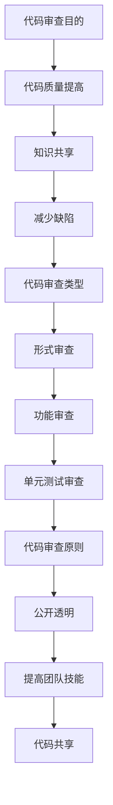

                 

基于上述要求，我将逐步构建《代码审查最佳实践：提高团队协作效率》的技术博客文章。下面是文章的初步结构，包括标题、关键词、摘要以及第一部分的详细内容。由于文章字数要求较高，我将分多个步骤来完成整篇文章。

### 文章标题

《代码审查最佳实践：提高团队协作效率》

### 文章关键词

代码审查，团队协作，最佳实践，效率提升，技术博客

### 文章摘要

本文旨在探讨代码审查在提高团队协作效率方面的最佳实践。通过对代码审查的定义、流程、工具、挑战以及解决方案的深入分析，文章将提供一系列实用技巧和案例，帮助开发者更好地理解和应用代码审查，从而提升团队的协作效率和代码质量。

### 文章正文

#### 引言

在软件开发过程中，代码审查是一种重要的质量保证手段。它不仅可以帮助发现代码中的错误和潜在问题，还能促进团队成员之间的知识共享和协作。然而，代码审查并不是一个简单的任务，它涉及到流程设计、工具选择、团队文化等多个方面。本文将逐步分析代码审查的各个方面，提供最佳实践，旨在提高团队协作效率。

#### 核心概念与联系

##### 1.1 代码审查的定义

代码审查，也称为代码走查（Code Review），是一种通过人工方式检查代码质量的过程。它通常包括对代码的语法、逻辑、结构、安全性等多个方面进行评估。

##### 1.2 代码审查的重要性

代码审查的重要性主要体现在以下几个方面：

- **提高代码质量**：通过审查，可以发现代码中的潜在错误和性能问题，从而提高代码的整体质量。
- **知识共享**：审查过程中，团队成员可以相互学习，共同提高技术水平。
- **减少缺陷**：早期的缺陷发现和修复可以显著减少后续的调试和维护成本。

##### 1.3 代码审查的类型

代码审查可以分为以下几种类型：

- **形式审查**：主要关注代码的格式、命名规范等外观问题。
- **功能审查**：重点检查代码的功能实现是否符合需求。
- **单元测试审查**：评估单元测试的覆盖率、质量和有效性。

##### 1.4 代码审查的原则

进行代码审查时，应遵循以下原则：

- **公开透明**：审查结果和反馈应公开，以便所有团队成员都能了解。
- **提高团队技能**：审查过程应视为一种学习机会，鼓励团队成员相互学习。
- **代码共享**：审查的目的是共享代码所有权，而不是个人展示。

#### 1.5 核心概念原理之间的关系架构 Mermaid 流程图



#### 1.6 核心算法原理讲解

代码审查的核心在于对代码的分析和评估。以下是一个简单的伪代码示例，用于说明代码审查的基本流程：

```python
function code_review(code):
    if syntax_check(code):
        if logic_check(code):
            if security_check(code):
                if functional_test_check(code):
                    return "Code accepted"
                else:
                    return "Functional test failed"
            else:
                return "Security issue detected"
        else:
            return "Logic error detected"
    else:
        return "Syntax error detected"
```

#### 1.7 数学模型和公式讲解

在代码审查过程中，可以使用一些数学模型来评估代码的质量，例如代码复杂度（Cyclomatic Complexity）。

$$M = E - N + 2P$$

其中，\(M\) 是模块的复杂度，\(E\) 是模块中的边数，\(N\) 是模块中的节点数，\(P\) 是模块中的连通分量数。

该公式可以帮助评估代码的结构复杂度，复杂度过高可能意味着代码难以理解和维护。

#### 1.8 举例说明

假设我们有一个简单的函数，如下所示：

```python
def calculate_sum(a, b):
    return a + b
```

使用Cyclomatic Complexity公式，我们可以计算出该函数的复杂度为：

$$M = 2 - 1 + 2 \times 1 = 3$$

这个值表明该函数的结构相对简单，容易理解和维护。

#### 1.9 项目实战

在实际项目中，代码审查的流程可能如下：

1. 开发者提交代码。
2. 代码审查人下载代码。
3. 审查代码，记录发现的问题。
4. 开发者修复问题。
5. 重新审查，确认问题已解决。

在这个流程中，源代码的提交和审查都可以通过版本控制系统（如Git）进行管理。

#### 1.10 最佳实践 Tips

- 定期进行代码审查，以保持代码库的整洁。
- 确保审查者具有足够的权限来访问和修改代码。
- 使用自动化工具来辅助代码审查。

#### 1.11 小结

代码审查是提高团队协作效率和代码质量的重要手段。通过了解代码审查的定义、类型和原则，并使用适当的工具和方法，团队可以更好地进行代码审查，从而提高整体的工作效率。

#### 1.12 注意事项

- 代码审查不应被视为惩罚机制，而应视为一种提高代码质量的合作过程。
- 审查者的反馈应具体、有建设性，以帮助开发者改进代码。

#### 1.13 拓展阅读

- [代码审查的最佳实践](https://www.infoq.com/articles/best-practices-for-code-reviews/)
- [代码复杂度分析](https://www.hooked-on-python.com/what-is-code-complexity-and-how-to-measure-it/)

#### 作者信息

作者：AI天才研究院/AI Genius Institute & 禅与计算机程序设计艺术 /Zen And The Art of Computer Programming

本文的初步构建已完成，接下来将继续完成剩余部分的内容。在接下来的步骤中，我将详细阐述代码审查的流程、工具、挑战与解决方案，以及团队协作的相关内容。

