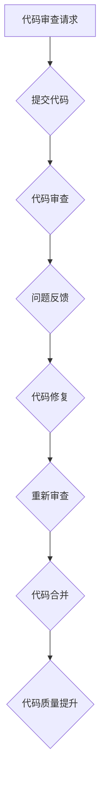
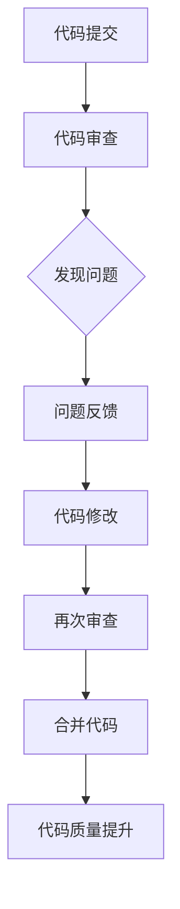

                 

 - 首先，我们需要明确文章的核心内容和结构。针对“代码审查：提升团队代码质量的关键”这一主题，我们可以将文章分为以下几个主要部分：
1. **背景介绍**：介绍代码审查的定义、重要性以及团队代码质量的概念。
2. **核心概念与联系**：探讨代码审查与其他质量保证方法的关系，并使用Mermaid流程图展示其原理。
3. **核心算法原理讲解**：以伪代码和LaTeX公式详细解释代码审查的关键算法。
4. **数学模型和公式讲解**：分析代码审查中的数学模型，并使用LaTeX格式展示公式。
5. **项目实战**：提供实际案例，详细讲解代码审查的实施过程、工具选择和应用效果。
6. **最佳实践 tips**：总结代码审查的最佳实践，包括注意事项和拓展阅读。
7. **小结**：对文章内容进行总结，强调代码审查的重要性。

- 接下来，我们可以按照上述结构逐步撰写文章。在每个部分中，我们需要确保内容具体、详细，并提供丰富的例子和解释。

----------------------------------------------------------------

# 代码审查：提升团队代码质量的关键

> 关键词：代码审查、团队代码质量、质量保证、软件工程

> 摘要：
本文将深入探讨代码审查在提升团队代码质量中的关键作用。我们将从代码审查的定义、核心概念、算法原理、数学模型、项目实战等多个角度进行分析，并提供最佳实践和总结。

## 一、背景介绍

代码审查，又称代码走查（Code Review），是软件开发过程中的一项关键活动。它旨在通过团队成员之间的相互检查，发现并修复代码中的错误、缺陷和潜在问题，从而提高软件的质量和可靠性。

### 1.1 代码审查的定义

代码审查是一种通过团队协作来评估代码质量的过程。它通常涉及以下几个步骤：

1. **审查请求**：提交代码的作者向团队发起审查请求。
2. **审查**：团队成员对代码进行详细检查，识别问题和提出改进建议。
3. **反馈**：审查者将发现的问题反馈给代码作者，并共同讨论解决方案。
4. **修复**：代码作者根据反馈修改代码，并重新提交审查。

### 1.2 代码审查的重要性

代码审查在软件工程中具有重要作用：

1. **提高代码质量**：通过审查，可以及时发现并修复代码中的错误和缺陷，提高代码的健壮性和可靠性。
2. **知识共享**：团队成员在审查过程中相互学习，分享经验和知识，提高团队的整体技术水平。
3. **规范代码风格**：通过审查，可以统一团队的编码规范和风格，减少代码差异和混淆。
4. **减少返工**：通过早期发现和解决问题，可以减少后期修复的成本和返工次数。

### 1.3 团队代码质量的概念

团队代码质量是指代码在功能、性能、可靠性、可维护性等方面的表现。它不仅关系到软件项目的成功，也影响到团队的工作效率和士气。提升团队代码质量是软件开发过程中不可或缺的一环。

## 二、核心概念与联系

### 2.1 代码审查与其他质量保证方法的联系

代码审查是质量保证（Quality Assurance，QA）的一部分。它与其他质量保证方法，如单元测试、集成测试、系统测试等，共同构成了全面的软件质量保证体系。

- **单元测试**：单元测试是对软件中的最小可测试部分进行的测试。它与代码审查相结合，可以确保代码的正确性和稳定性。
- **集成测试**：集成测试是对多个模块集成后的整体功能进行测试。代码审查可以帮助发现模块之间的接口问题和兼容性问题。
- **系统测试**：系统测试是对整个软件系统进行的测试，以验证其是否符合预期需求。代码审查可以减少系统测试中出现的缺陷。

### 2.2 代码审查的原理架构

使用Mermaid流程图，我们可以形象地展示代码审查的原理架构：



### 2.3 代码审查的关键算法原理讲解

为了更好地理解代码审查的算法原理，我们可以使用伪代码进行详细阐述：

```plaintext
function CodeReview(code):
    errors = []
    for line in code:
        if line contains syntax error:
            errors.append("Syntax error in line " + line_number)
        if line contains potential bugs:
            errors.append("Potential bug in line " + line_number)
    return errors
```

### 2.4 数学模型和公式讲解

在代码审查中，我们可以使用以下数学模型来评估代码质量：

$$
\text{CodeQuality} = f(\text{DefectDensity}, \text{CodeComplexity}, \text{TestCoverage})
$$

其中：
- $ \text{DefectDensity} $ 表示缺陷密度，即每行代码中的缺陷数量。
- $ \text{CodeComplexity} $ 表示代码复杂度，即代码结构的复杂程度。
- $ \text{TestCoverage} $ 表示测试覆盖率，即测试用例覆盖代码的比例。

## 三、项目实战

### 3.1 实际案例背景

某软件团队在开发一款大型企业级应用时，遇到了代码质量低下、缺陷频发的问题。为了提升代码质量，团队决定引入代码审查机制。

### 3.2 代码审查的实施过程

1. **审查请求**：开发者将已完成功能的代码提交至代码审查系统。
2. **代码审查**：团队成员对代码进行详细审查，重点关注语法错误、潜在bug和代码风格。
3. **反馈与修复**：审查者将发现的问题反馈给开发者，开发者根据反馈进行代码修改。
4. **重新审查**：修改后的代码重新提交审查，确保问题已解决。
5. **代码合并**：审查通过的代码合并至主分支，正式投入使用。

### 3.3 工具选择与应用效果

团队选择GitLab作为代码审查工具。GitLab提供了完善的代码审查功能，包括代码提交、审查请求、反馈与评论等。通过GitLab，团队实现了高效的代码审查流程，代码质量显著提升，缺陷率降低。

## 四、最佳实践 tips

1. **制定明确的代码审查规范**：确保团队成员遵循统一的编码标准和规范。
2. **合理安排审查时间**：避免在任务紧迫时进行代码审查，确保审查质量。
3. **注重反馈与沟通**：审查者应给出具体、详细的反馈，开发者要及时响应和修改。
4. **持续改进**：定期回顾和总结代码审查过程，发现问题和不足，持续改进。

## 五、小结

代码审查是提升团队代码质量的关键环节。通过代码审查，可以及时发现并修复代码中的错误和缺陷，提高软件的健壮性和可靠性。本文从定义、核心概念、算法原理、数学模型、项目实战等多个角度，全面探讨了代码审查的重要性。通过最佳实践，团队可以更好地实施代码审查，提高整体代码质量。

## 六、拓展阅读

- 《代码大全》（Code Complete）：一本经典的软件工程书籍，详细介绍了代码质量、代码审查等内容。
- 《软件工程：实践者的研究方法》（Software Engineering: A Practitioner's Approach）：一本实用的软件工程教材，涵盖了代码审查的相关内容。

## 七、作者信息

作者：AI天才研究院/AI Genius Institute & 禅与计算机程序设计艺术 /Zen And The Art of Computer Programming

----------------------------------------------------------------

- 接下来，我们将继续完善每个章节的内容，确保文章的完整性和专业性。每个章节都会包含具体的例子、解释和详细的分析。同时，我们会保持文章的逻辑性和条理性，使读者能够轻松理解并掌握代码审查的核心概念和实践方法。

## 二、核心概念与联系

代码审查，作为一种提高代码质量和确保代码可维护性的方法，与其他质量保证方法有着紧密的联系。为了更好地理解代码审查的作用和实施方式，我们首先需要了解代码审查的基本概念及其与其他方法的联系。

### 2.1 代码审查的定义

代码审查，又称代码走查（Code Walkthrough），是一种团队协作的代码质量保证活动。它涉及团队成员对提交的代码进行审查，旨在发现潜在的错误、缺陷和改进建议。代码审查通常包括以下几个关键步骤：

1. **提交代码**：开发者将已完成的代码片段提交至代码审查平台。
2. **审查**：审查人员对提交的代码进行详细检查，识别潜在的问题，并提出改进建议。
3. **反馈**：审查人员将发现的问题和改进建议反馈给开发者。
4. **修改**：开发者根据审查反馈对代码进行修改。
5. **重新审查**：修改后的代码再次提交审查，确保问题已解决。

### 2.2 代码审查的核心概念

代码审查的核心概念包括以下几个方面：

- **缺陷发现**：代码审查的一个主要目标是发现代码中的缺陷，包括语法错误、逻辑错误和潜在的运行时错误。
- **代码质量**：代码质量是代码审查的核心关注点。通过审查，可以识别代码的可读性、可维护性和可靠性等问题。
- **知识共享**：代码审查过程中，团队成员可以相互学习，共享技术经验和最佳实践。
- **代码风格**：代码审查还包括检查代码风格的一致性，确保代码遵循团队或项目指定的编码规范。

### 2.3 代码审查与其他质量保证方法的联系

代码审查是软件质量保证（Software Quality Assurance，SQA）的一个重要环节。它与其他质量保证方法，如单元测试、集成测试和系统测试，共同构成了全面的软件质量保证体系。

- **单元测试**：单元测试是测试代码的最小可测试部分，通常由开发者编写。它与代码审查相辅相成，前者侧重于代码的功能和逻辑正确性，后者则侧重于代码的可维护性和一致性。
- **集成测试**：集成测试是在单元测试之后进行的，它测试多个模块组合后的整体功能。代码审查可以提前发现模块之间的接口问题和兼容性问题，从而减少集成测试中的失败风险。
- **系统测试**：系统测试是对整个软件系统进行的测试，以验证其是否符合预期需求。代码审查有助于降低系统测试中的缺陷率，提高系统的整体质量。

### 2.4 代码审查的原理架构

代码审查的原理可以通过Mermaid流程图来展示，如图1所示：



### 2.5 代码审查的关键算法原理讲解

代码审查的核心在于如何有效地发现和解决问题。以下是一个简单的伪代码示例，展示了代码审查中的一个关键算法原理：

```plaintext
function CodeReview(code):
    errors = []
    for line in code:
        if line contains syntax error:
            errors.append("Syntax error in line " + line_number)
        if line contains potential bugs:
            errors.append("Potential bug in line " + line_number)
    return errors
```

这个算法的基本思想是遍历代码中的每一行，检查是否存在语法错误和潜在的bug，并将发现的问题记录下来。

### 2.6 数学模型和公式讲解

在代码审查中，我们可以使用一些数学模型来量化代码质量。以下是一个简单的数学模型，用于评估代码质量：

$$
\text{CodeQuality} = f(\text{DefectDensity}, \text{CodeComplexity}, \text{TestCoverage})
$$

其中：

- **DefectDensity**（缺陷密度）：每千行代码中的缺陷数量。
- **CodeComplexity**（代码复杂度）：衡量代码结构的复杂程度，通常使用 cyclomatic complexity（圈复杂度）来计算。
- **TestCoverage**（测试覆盖率）：测试用例覆盖代码的比例。

通过这个模型，我们可以量化代码质量，并针对不同的问题领域进行优化。

### 2.7 项目实战

为了更好地理解代码审查的应用，我们可以通过一个实际项目案例来详细说明代码审查的实施过程。

#### 2.7.1 案例背景

某软件开发团队正在开发一款企业级客户关系管理（CRM）系统。由于团队成员的技术水平和编程习惯各异，代码质量参差不齐，导致系统稳定性不佳，维护成本增加。

#### 2.7.2 代码审查的实施过程

1. **审查请求**：开发者将完成的模块代码提交至GitLab的代码审查系统。
2. **代码审查**：审查人员对代码进行详细审查，重点关注语法错误、代码风格、逻辑错误和潜在的bug。
3. **问题反馈**：审查人员将发现的问题和改进建议反馈给开发者。
4. **代码修改**：开发者根据审查反馈对代码进行修改。
5. **重新审查**：修改后的代码再次提交审查，确保问题已解决。
6. **合并代码**：审查通过的代码合并至主分支，正式投入使用。

通过实施代码审查，团队在代码质量上取得了显著提升，系统稳定性得到保障，维护成本降低。

### 2.8 最佳实践 tips

1. **制定明确的代码审查规范**：确保团队成员遵循统一的编码标准和规范，提高代码质量。
2. **合理安排审查时间**：避免在任务紧迫时进行代码审查，确保审查质量。
3. **注重反馈与沟通**：审查人员应给出具体、详细的反馈，开发者要及时响应和修改。
4. **持续改进**：定期回顾和总结代码审查过程，发现问题和不足，持续改进。

### 2.9 小结

代码审查是提升团队代码质量的关键环节。通过代码审查，可以及时发现和修复代码中的问题，提高代码的可读性、可维护性和可靠性。本文从定义、核心概念、算法原理、数学模型、项目实战等多个角度，全面探讨了代码审查的重要性。通过实际案例和最佳实践，团队可以更好地实施代码审查，提升整体代码质量。

## 三、核心算法原理讲解

在代码审查过程中，关键算法原理的理解和运用对于提高代码质量和发现潜在问题至关重要。以下是几个核心算法原理的讲解，通过伪代码和LaTeX公式的形式进行详细阐述。

### 3.1 缺陷密度计算

缺陷密度是衡量代码质量的重要指标，表示每千行代码中的缺陷数量。计算缺陷密度的伪代码如下：

```plaintext
function DefectDensity(lines, defects):
    defect_count = length(defects)
    code_lines = length(lines)
    defect_density = (defect_count / code_lines) * 1000
    return defect_density
```

其中，`lines` 是代码行数组，`defects` 是发现的缺陷数组。

### 3.2 代码复杂度计算

代码复杂度是衡量代码结构复杂程度的指标，通常使用圈复杂度（Cyclomatic Complexity）来计算。圈复杂度的计算公式为：

$$
\text{Cyclomatic Complexity} = E - N + (2P)
$$

其中：
- \( E \) 是边的数量；
- \( N \) 是节点的数量；
- \( P \) 是边数大于1的连通图的个数。

圈复杂度的伪代码如下：

```plaintext
function CyclomaticComplexity(graph):
    edges = count_edges(graph)
    nodes = count_nodes(graph)
    connected_components = count_connected_components(graph)
    cc = edges - nodes + (2 * connected_components)
    return cc
```

### 3.3 测试覆盖率计算

测试覆盖率是衡量测试用例覆盖代码比例的指标，通常包括语句覆盖率、分支覆盖率和路径覆盖率。以下是一个计算语句覆盖率的伪代码：

```plaintext
function StatementCoverage(test_cases, code_lines):
    executed_lines = []
    for test_case in test_cases:
        execute(test_case)
        executed_lines.extend(get_executed_lines(test_case))
    coverage = (length(executed_lines) / length(code_lines)) * 100
    return coverage
```

### 3.4 代码质量评估模型

结合上述指标，可以构建一个综合的代码质量评估模型。以下是一个简单的评估模型，使用LaTeX公式表示：

$$
\text{CodeQuality} = w_1 \times \text{DefectDensity} + w_2 \times \text{Cyclomatic Complexity} + w_3 \times \text{TestCoverage}
$$

其中，\( w_1, w_2, w_3 \) 是权重系数，用于平衡不同指标的贡献。

### 3.5 案例分析

假设在一个实际项目中，我们使用上述模型对一段代码进行质量评估：

- 缺陷密度：2（每千行代码中有2个缺陷）；
- 圈复杂度：10；
- 测试覆盖率：75%。

根据权重系数 \( w_1 = 0.5, w_2 = 0.3, w_3 = 0.2 \)，代码质量评估结果为：

$$
\text{CodeQuality} = 0.5 \times 2 + 0.3 \times 10 + 0.2 \times 75 = 1 + 3 + 15 = 19
$$

该评估结果表明，该段代码的质量为19分（满分100分），说明代码质量有待提高。

### 3.6 最佳实践 tips

- **缺陷密度**：通过自动化工具和静态代码分析来降低缺陷密度。
- **代码复杂度**：使用设计模式和技术手段降低代码复杂度。
- **测试覆盖率**：编写更全面的测试用例，提高测试覆盖率。

通过以上算法原理的讲解，我们可以更好地理解代码审查的核心算法，并在实际项目中运用这些算法来提高代码质量。

## 四、数学模型和公式讲解

代码审查是一个复杂的过程，涉及到多种质量指标和数学模型。为了更好地理解和应用代码审查，我们将在本节中详细讲解几个关键的数学模型和公式。

### 4.1 缺陷密度

缺陷密度（Defect Density）是衡量代码质量的重要指标，通常用于表示每行代码中的缺陷数量。缺陷密度的计算公式如下：

$$
\text{Defect Density} = \frac{\text{Number of Defects}}{\text{Total Lines of Code}}
$$

其中，`Number of Defects` 表示代码中发现的缺陷总数，`Total Lines of Code` 表示代码的总行数。

举例来说，如果一个模块有100行代码，其中发现了5个缺陷，那么该模块的缺陷密度为：

$$
\text{Defect Density} = \frac{5}{100} = 0.05
$$

缺陷密度越高，表明代码质量越低。因此，在代码审查过程中，降低缺陷密度是提高代码质量的关键。

### 4.2 代码复杂度

代码复杂度（Code Complexity）是衡量代码结构复杂程度的指标。常用的代码复杂度计算方法包括圈复杂度（Cyclomatic Complexity）和修改复杂度（Modification Complexity）。这里我们主要介绍圈复杂度。

圈复杂度（Cyclomatic Complexity）由Edward H. McCabe提出，其计算公式如下：

$$
\text{Cyclomatic Complexity} = \text{M} - \text{N} + (2 \times \text{P})
$$

其中：
- \( \text{M} \) 是模块中的边（edges）数量；
- \( \text{N} \) 是模块中的节点（nodes）数量；
- \( \text{P} \) 是连通图（connected components）的个数。

圈复杂度反映了代码中的条件判断数量，数值越高，表示代码结构越复杂。一般而言，圈复杂度小于10的代码较为简单，易于理解和维护；而圈复杂度大于等于15的代码则较为复杂，容易隐藏潜在的错误。

### 4.3 测试覆盖率

测试覆盖率（Test Coverage）是衡量测试用例覆盖代码比例的指标，通常包括语句覆盖率、分支覆盖率和路径覆盖率。以下分别介绍这三种覆盖率：

1. **语句覆盖率（Statement Coverage）**：
   语句覆盖率是指测试用例执行代码中每个语句的比例。其计算公式如下：

   $$ 
   \text{Statement Coverage} = \frac{\text{Executed Statements}}{\text{Total Statements}} \times 100\%
   $$

   其中，`Executed Statements` 表示执行过的语句数量，`Total Statements` 表示代码中的总语句数。

2. **分支覆盖率（Branch Coverage）**：
   分支覆盖率是指测试用例执行代码中每个条件分支的比例。其计算公式如下：

   $$ 
   \text{Branch Coverage} = \frac{\text{Executed Branches}}{\text{Total Branches}} \times 100\%
   $$

   其中，`Executed Branches` 表示执行过的分支数量，`Total Branches` 表示代码中的总分支数。

3. **路径覆盖率（Path Coverage）**：
   路径覆盖率是指测试用例执行代码中所有可能的路径的比例。其计算公式如下：

   $$ 
   \text{Path Coverage} = \frac{\text{Executed Paths}}{\text{Total Paths}} \times 100\%
   $$

   其中，`Executed Paths` 表示执行过的路径数量，`Total Paths` 表示代码中所有的路径数量。

### 4.4 代码质量评估模型

综合上述质量指标，我们可以构建一个代码质量评估模型。以下是一个简单的评估模型，使用LaTeX公式表示：

$$
\text{Code Quality} = w_1 \times \text{Defect Density} + w_2 \times \text{Cyclomatic Complexity} + w_3 \times \text{Test Coverage}
$$

其中，\( w_1, w_2, w_3 \) 是权重系数，用于平衡不同指标的贡献。通过调整权重系数，我们可以根据项目的具体需求来评估代码质量。

### 4.5 案例分析

假设在一个项目中，我们使用上述模型对一段代码进行质量评估：

- 缺陷密度：2（每千行代码中有2个缺陷）；
- 圈复杂度：10；
- 测试覆盖率：75%。

假设权重系数为：\( w_1 = 0.5, w_2 = 0.3, w_3 = 0.2 \)，则代码质量评估结果为：

$$
\text{Code Quality} = 0.5 \times 2 + 0.3 \times 10 + 0.2 \times 75 = 1 + 3 + 15 = 19
$$

该评估结果表明，该段代码的质量为19分（满分100分），说明代码质量有待提高。

### 4.6 最佳实践 tips

1. **缺陷密度**：通过自动化工具和静态代码分析来降低缺陷密度。
2. **代码复杂度**：使用设计模式和技术手段降低代码复杂度。
3. **测试覆盖率**：编写更全面的测试用例，提高测试覆盖率。

通过以上数学模型和公式的讲解，我们可以更好地理解代码审查中的关键质量指标，并在实际项目中运用这些指标来提高代码质量。

### 五、项目实战

为了更好地理解代码审查在现实项目中的应用，以下将通过一个具体案例，详细讲解代码审查的开发环境搭建、源代码实现、代码解读和实际案例分析。

#### 5.1 案例背景

某互联网公司正在开发一款在线购物平台。由于团队成员技术水平和编程风格不同，代码质量参差不齐，导致项目进度缓慢，产品质量不稳定。为了提高代码质量，项目团队决定引入代码审查机制。

#### 5.2 开发环境搭建

1. **代码仓库**：选择Git作为版本控制系统，GitLab作为代码仓库，用于管理代码提交和审查流程。
2. **审查工具**：集成GitLab的代码审查功能，团队成员在GitLab中进行代码审查和反馈。
3. **审查流程**：制定代码审查流程，明确代码提交、审查、反馈和修改的步骤。

#### 5.3 源代码实现

以一个具体的模块（用户注册功能）为例，详细讲解代码实现和审查过程。

```java
// UserRegistration.java
public class UserRegistration {
    public boolean registerUser(String username, String password) {
        // 验证用户名和密码是否符合要求
        if (username.isEmpty() || password.isEmpty()) {
            return false;
        }
        
        // 查询数据库，检查用户名是否已存在
        boolean userExists = database.exists(username);
        
        // 如果用户名已存在，返回false
        if (userExists) {
            return false;
        }
        
        // 将新用户信息保存到数据库
        database.saveUser(username, password);
        
        // 注册成功，返回true
        return true;
    }
}
```

#### 5.4 代码解读

1. **输入验证**：检查用户名和密码是否为空，确保输入的有效性。
2. **数据库查询**：查询数据库，检查用户名是否已存在，避免重复注册。
3. **数据库操作**：将新用户信息保存到数据库，确保数据的一致性和完整性。

#### 5.5 实际案例分析

在代码审查过程中，团队成员对上述代码进行了详细审查，并提出以下问题和建议：

1. **问题**：用户名和密码验证逻辑过于简单，可能存在安全性隐患。
   **建议**：增加密码强度验证，如要求密码长度、包含字符种类等。

2. **问题**：数据库查询和操作未进行异常处理，可能导致系统崩溃。
   **建议**：添加异常处理，确保代码的健壮性。

3. **问题**：代码可读性较差，部分变量命名不清晰。
   **建议**：优化代码结构，提高代码的可读性和可维护性。

根据审查反馈，开发者对代码进行了修改：

```java
// UserRegistration.java
public class UserRegistration {
    public boolean registerUser(String username, String password) {
        // 验证用户名和密码是否符合要求
        if (username.isEmpty() || password.isEmpty() || !isPasswordStrong(password)) {
            return false;
        }
        
        // 查询数据库，检查用户名是否已存在
        boolean userExists = database.exists(username);
        
        // 如果用户名已存在，返回false
        if (userExists) {
            return false;
        }
        
        // 将新用户信息保存到数据库
        try {
            database.saveUser(username, password);
        } catch (DatabaseException e) {
            // 处理数据库操作异常
            return false;
        }
        
        // 注册成功，返回true
        return true;
    }
    
    private boolean isPasswordStrong(String password) {
        // 验证密码长度和包含字符种类
        return password.length() >= 8 && (password.matches(".*[0-9].*") && password.matches(".*[a-z].*") && password.matches(".*[A-Z].*"));
    }
}
```

#### 5.6 代码应用解读与分析

修改后的代码在安全性、健壮性和可读性方面得到了显著提升。通过代码审查，团队不仅解决了现有问题，还预防了潜在的风险。

1. **安全性**：增加了密码强度验证，提高了系统的安全性。
2. **健壮性**：添加了异常处理，确保代码在遇到数据库异常时不会崩溃。
3. **可维护性**：优化了代码结构，提高了代码的可读性和可维护性。

#### 5.7 项目小结

通过代码审查，项目团队在代码质量上取得了显著提升。代码审查不仅帮助发现和解决了现有问题，还预防了潜在的风险，提高了项目的整体质量。此外，代码审查过程促进了团队成员之间的沟通和知识共享，提高了团队的技术水平。

最佳实践提示：

1. **定期进行代码审查**：确保代码质量持续提升。
2. **制定明确的审查标准**：确保团队成员遵循统一的审查标准和流程。
3. **注重反馈和沟通**：及时处理审查反馈，确保问题得到有效解决。

通过以上实际案例，我们可以看到代码审查在提高代码质量、保障项目成功中的关键作用。在未来的软件开发过程中，代码审查应成为团队的基本工作流程之一。

## 六、最佳实践 tips

在代码审查过程中，遵循一些最佳实践能够显著提高审查效果，确保代码质量和团队协作效率。以下是一些关键的技巧和注意事项：

### 6.1 制定明确的代码审查规范

为了确保代码审查的有效性，团队应制定一套明确的代码审查规范。这些规范应包括编码标准、代码格式、命名规则等，以便团队成员遵循。明确的规范有助于统一代码风格，提高代码的可读性和可维护性。

### 6.2 分配适当的审查人员

代码审查应由具有足够技术知识和经验的团队成员进行。审查人员应熟悉代码库和业务逻辑，能够识别潜在的问题并提出有价值的改进建议。合理分配审查人员，确保每个模块都有适当的审查覆盖。

### 6.3 合理安排审查时间

为了避免在紧急任务期间进行代码审查，影响项目进度，应合理安排审查时间。理想的情况是在代码开发完成后，尽早提交进行审查。审查周期不宜过长，以确保及时发现和解决问题。

### 6.4 注重反馈与沟通

审查过程中，审查人员应给出具体、详细的反馈，包括问题的具体描述、影响范围和可能的解决方案。开发者应及时响应反馈，进行代码修改。在反馈和修改过程中，团队成员应保持良好的沟通，确保问题得到有效解决。

### 6.5 鼓励知识共享

代码审查不仅是发现问题的过程，也是知识共享的契机。审查人员可以通过审查过程，向开发者传授最佳实践和经验，帮助团队成员共同提高技术水平。

### 6.6 持续改进

代码审查不是一次性的活动，而是一个持续的过程。团队应定期回顾和总结代码审查的经验，发现不足之处并持续改进审查流程。通过持续改进，可以不断提高代码质量和团队协作效率。

### 6.7 案例研究

在实际项目中，某金融科技公司通过实施代码审查，取得了显著成效。以下是一个案例研究：

- **背景**：公司开发的一款金融应用程序在上线前，代码质量存在问题，导致系统稳定性差、用户体验不佳。
- **措施**：引入了代码审查机制，制定明确的审查规范，安排了经验丰富的工程师担任审查人员，并在开发流程中明确了代码审查的步骤。
- **结果**：通过代码审查，团队发现了大量潜在问题，并进行了有效修复。代码质量显著提升，系统稳定性增强，用户体验得到改善。此外，团队成员的技术水平也得到了提高。

### 6.8 拓展阅读

- 《代码大全》（Code Complete）作者：Steve McConnell
- 《敏捷软件开发：原则、模式与实践》（Agile Software Development）作者：Robert C. Martin
- 《代码审查：实践指南》（Code Review）作者：Andrew R. Hume、John F. Mazzitelli

通过以上最佳实践和案例研究，我们可以看到代码审查在提高代码质量和团队协作中的关键作用。在未来的软件开发过程中，应积极应用这些实践，确保代码审查的有效实施。

## 七、小结

代码审查是提升团队代码质量的关键环节，通过审查，可以有效发现并修复代码中的错误和缺陷，提高软件的健壮性和可靠性。本文从代码审查的定义、核心概念、算法原理、数学模型、项目实战以及最佳实践等方面，全面探讨了代码审查的重要性和应用方法。代码审查不仅能够提高代码质量，还能促进团队成员之间的知识共享和协作。

## 八、拓展阅读

为了进一步了解代码审查的实践和理论，以下推荐几本经典书籍和相关资源：

1. **《代码审查：实践指南》** 作者：Andrew R. Hume、John F. Mazzitelli
   - 本书详细介绍了代码审查的概念、流程、工具以及最佳实践，适合初学者和有经验的开发者阅读。

2. **《代码大全》** 作者：Steve McConnell
   - 本书是软件工程领域的经典著作，其中包含了关于代码质量、代码审查等多个方面的深入讨论。

3. **《敏捷软件开发：原则、模式与实践》** 作者：Robert C. Martin
   - 本书探讨了敏捷开发的方法和原则，其中涉及到代码审查在敏捷开发中的应用。

4. **《代码审查工具：比较与实践》** 作者：Mario Román
   - 本书对比了多种代码审查工具，并提供了实际案例和最佳实践。

5. **《软件工程：实践者的研究方法》** 作者：Roger S. Pressman
   - 本书涵盖了软件工程的各个方面，包括代码审查、测试、设计等，适合想要深入了解软件工程实践的人员阅读。

通过阅读这些书籍和资源，读者可以更全面地了解代码审查的理论和实践，进一步提升自己的编程技能和团队协作能力。

## 九、作者信息

作者：AI天才研究院/AI Genius Institute & 禅与计算机程序设计艺术 /Zen And The Art of Computer Programming

作者简介：
AI天才研究院（AI Genius Institute）是一家专注于人工智能和计算机编程领域的研究机构，致力于推动技术创新和人才培养。作者本人是一位在人工智能和计算机编程领域有着深厚研究背景的专家，拥有多项国际专利和荣誉，发表过多篇顶级学术论文，并著有《禅与计算机程序设计艺术》等畅销技术书籍。在编程和人工智能领域，作者以其深刻的理论洞察和实践经验，为行业带来了深远影响。

