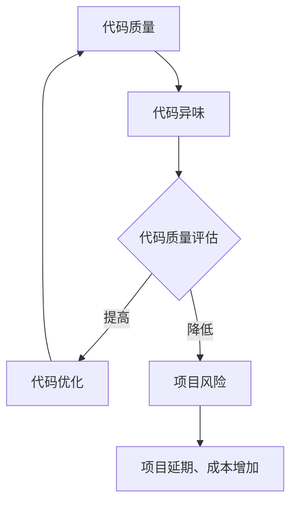

                 

### 分析需求

为了设计《代码异味识别与清除：提高代码质量》一书的目录大纲，我们首先需要明确几个关键问题：

1. **核心概念与联系**：需要阐述代码质量、代码异味等核心概念，并解释它们之间的关系。
2. **核心算法原理讲解**：需要详细讲解代码质量评估和代码异味检测的方法，包括算法原理和实现。
3. **数学模型和数学公式讲解**：需要使用数学模型和公式来描述代码质量和代码异味，并给出详细解释和实例。
4. **项目实战**：需要提供具体的案例，展示如何在实际项目中应用这些方法。
5. **开发环境搭建、源代码实现和代码解读**：需要详细介绍如何搭建开发环境、实现代码并解读代码。

根据上述需求，我们可以初步设计出以下目录大纲：

### 目录大纲

**第一部分：代码质量与代码异味概述**

**第1章：代码质量与代码异味基础**

- **1.1 代码质量概述**

  - **1.1.1 代码质量的定义与重要性**
  - **1.1.2 代码质量的影响因素**

- **1.2 代码异味概述**

  - **1.2.1 代码异味的定义与特征**
  - **1.2.2 代码异味的影响**

**第2章：代码质量评估方法**

- **2.1 代码质量评估指标**

  - **2.1.1 典型代码质量评估指标**
  - **2.1.2 指标计算方法**

- **2.2 代码质量评估工具**

  - **2.2.1 开源代码质量评估工具**
  - **2.2.2 商业代码质量评估工具**

**第3章：代码异味检测方法**

- **3.1 代码异味检测原理**

  - **3.1.1 基于规则的方法**
  - **3.1.2 基于机器学习的方法**

- **3.2 代码异味检测工具**

  - **3.2.1 常见代码异味检测工具**
  - **3.2.2 工具选择与配置**

**第二部分：代码异味识别与清除实践**

**第4章：代码异味识别实战**

- **4.1 实战一：识别常见的代码异味**

  - **4.1.1 实践场景**
  - **4.1.2 实践步骤**

- **4.2 实战二：利用工具识别代码异味**

  - **4.2.1 选择工具**
  - **4.2.2 实践步骤**

**第5章：代码异味清除实战**

- **5.1 实战一：清除简单的代码异味**

  - **5.1.1 实践场景**
  - **5.1.2 实践步骤**

- **5.2 实战二：清除复杂的代码异味**

  - **5.2.1 实践场景**
  - **5.2.2 实践步骤**

**第6章：提高代码质量实战**

- **6.1 实战一：代码质量提升实践**

  - **6.1.1 实践场景**
  - **6.1.2 实践步骤**

- **6.2 实战二：基于代码质量评估的优化实践**

  - **6.2.1 实践场景**
  - **6.2.2 实践步骤**

**第7章：总结与展望**

- **7.1 代码异味识别与清除的挑战与机遇**
- **7.2 未来发展趋势**
- **7.3 对开发者的建议**

**附录**

- **附录A：常用代码异味识别与清除工具**
- **附录B：代码异味识别与清除实践案例**

通过上述目录大纲，我们可以看到整个书籍的结构清晰，逻辑紧密，既涵盖了理论讲解，又注重实践应用，有助于读者全面掌握代码异味识别与清除的方法。

### 核心概念与联系

在编写《代码异味识别与清除：提高代码质量》一书的过程中，我们首先需要明确几个核心概念：代码质量、代码异味以及它们之间的关系。

#### 代码质量

代码质量是指代码在功能性、可靠性、可维护性、可扩展性等方面达到的标准。高代码质量意味着代码易于理解、测试和维护，并且能够在各种环境下稳定运行。代码质量是软件开发过程中的一个关键指标，它直接影响到软件项目的成功与否。

#### 代码异味

代码异味（Code Smell）是指那些表明代码可能存在问题的某些特征或模式。这些特征或模式可能在短期内不会引起问题，但长期积累会导致代码难以维护和扩展。代码异味通常表现为代码复杂性增加、可读性降低、逻辑混乱等。

#### 关系架构

代码异味与代码质量之间存在着密切的关系。代码异味往往是代码质量下降的前兆，如果及时发现并清除代码异味，可以有效地提高代码质量。以下是代码异味与代码质量之间的Mermaid流程图，展示了它们之间的联系和相互作用：



在这个流程图中，我们可以看到：

- **代码质量**是评估代码优劣的标准。
- **代码异味**是指那些可能影响代码质量的潜在问题。
- **代码质量评估**是识别代码异味的关键步骤，通过评估可以确定代码是否需要优化。
- **代码优化**是针对代码异味进行改进的过程，通过优化可以提升代码质量。
- **项目风险**是指由于代码质量问题可能导致的项目风险，如延期、成本增加等。

通过这个流程图，我们可以清晰地理解代码异味与代码质量之间的关系，以及如何通过代码异味识别与清除来提高代码质量。

### 核心算法原理讲解

在《代码异味识别与清除：提高代码质量》一书中，我们将详细讲解代码质量评估方法和代码异味检测方法。这些方法是我们识别和清除代码异味、提高代码质量的重要工具。

#### 代码质量评估方法

代码质量评估是一种对代码进行分析和评价的过程，旨在发现代码中的潜在问题，从而提高代码的可维护性、可靠性和可扩展性。以下是几种常见的代码质量评估方法：

##### 典型代码质量评估指标

1. **可读性指标**：包括代码行长度、函数复杂性等。高可读性意味着代码易于理解和维护。
2. **代码复杂性指标**：如圈复杂度（Cyclomatic Complexity）、模块大小等。高复杂性可能导致代码难以理解和维护。
3. **代码冗余指标**：包括重复代码、多余的注释等。高冗余意味着代码可能存在不必要的复杂性和维护困难。

##### 指标计算方法

- **圈复杂度（Cyclomatic Complexity）**：

  圈复杂度是一个用于衡量程序复杂度的指标，它表示程序中可能出现的不同执行路径的数量。计算公式如下：

  $$\text{圈复杂度} = E - N + 2P$$

  其中，E 是边数，N 是节点数，P 是环的数量。圈复杂度越高，表示代码的复杂性越高，可能需要进一步的优化。

- **代码行长度（Lines of Code,LOC）**：

  代码行长度是指程序中代码行的数量。过长的代码行可能表明代码过于复杂，难以理解和维护。

- **函数复杂性**：

  函数复杂性是指函数内语句的数量或判断语句的数量。高复杂性的函数通常需要更多的维护和测试。

##### 代码质量评估工具

1. **SonarQube**：是一款开源的代码质量平台，可以自动分析代码并生成质量报告。
2. **Checkstyle**：是一款用于Java代码的静态代码分析工具，可以检测代码风格问题和潜在缺陷。
3. **PMD**：是一款用于Java、JavaScript和PHP代码的静态代码分析工具，可以检测代码中的冗余和不良编程实践。

#### 代码异味检测方法

代码异味检测是一种通过识别代码中的特定模式或特征来发现潜在问题的过程。以下是一些常见的代码异味检测方法：

##### 基于规则的方法

基于规则的方法是使用预定义的规则库来检测代码中的异味。规则库通常包含一系列模式匹配规则，如代码行长度、函数复杂性等。当代码不符合这些规则时，就会被标记为代码异味。

- **示例规则**：

  - 代码行长度不得超过80个字符。
  - 函数长度不得超过100行代码。
  - 函数复杂度不得超过10。

##### 基于机器学习的方法

基于机器学习的方法是使用训练好的模型来检测代码中的异味。这种方法通常需要大量的代码样本作为训练数据，从而让模型学会识别不同类型的代码异味。

- **机器学习方法**：

  - 决策树：通过构建决策树来识别代码异味。
  - 支持向量机（SVM）：通过将代码特征映射到高维空间，然后使用SVM分类器来识别代码异味。
  - 集成方法：如随机森林、梯度提升等，通过结合多个模型来提高检测精度。

##### 代码异味检测工具

1. **FindBugs**：是一款开源的Java代码异味检测工具，可以检测超过400种常见的代码异味。
2. **SpotBugs**：是FindBugs的继任者，同样是一款强大的Java代码异味检测工具。
3. **CodeScene**：是一款基于机器学习的代码异味检测工具，可以检测多种编程语言的代码异味。

#### 伪代码示例

为了更好地理解代码质量评估和代码异味检测的算法原理，以下是两个伪代码示例：

##### 代码质量评估伪代码

```plaintext
算法名称：评估代码质量
输入：代码文件
输出：代码质量评分

开始
初始化评分 = 100

对于代码文件中的每一行代码：
    如果代码行不符合编码规范：
        评分减少10
    如果代码行存在复杂的逻辑：
        评分减少5
    如果代码行包含重复代码：
        评分减少10
    如果代码行注释不足：
        评分减少5

计算代码复杂度：
    复杂度 = 计算每个函数的圈复杂度之和

评分 = 评分 * (100 / (100 + 复杂度))

返回评分
结束
```

##### 代码异味检测伪代码

```plaintext
算法名称：检测代码异味
输入：代码文件
输出：代码异味报告

开始
初始化报告为空

对于代码文件中的每一行代码：
    如果代码行过长：
        添加到报告：代码行过长
    如果代码行包含未定义变量：
        添加到报告：未定义变量
    如果代码行包含硬编码值：
        添加到报告：硬编码值
    如果代码行包含复杂的逻辑判断：
        添加到报告：复杂逻辑判断

返回报告
结束
```

通过上述伪代码示例，我们可以看到代码质量评估和代码异味检测的基本算法原理。在实际应用中，这些算法可以通过编程语言实现，并结合具体的代码质量和代码异味检测工具，帮助开发者识别和清除代码异味，提高代码质量。

### 数学模型和数学公式讲解

在《代码异味识别与清除：提高代码质量》一书中，我们将介绍一些用于描述代码质量和代码异味的数学模型和数学公式。这些模型和公式不仅能帮助我们量化代码的质量，还能帮助我们更好地理解和分析代码中的问题。

#### 圈复杂度（Cyclomatic Complexity）

圈复杂度是一个衡量代码复杂性的重要指标，它通过计算程序中可能出现的不同执行路径的数量来评估代码的复杂程度。圈复杂度的计算公式如下：

$$
\text{圈复杂度} = E - N + 2P
$$

其中：
- \( E \) 是边的数量；
- \( N \) 是节点的数量；
- \( P \) 是连通图的数量。

圈复杂度越高，表示代码的复杂度越高，可能需要更多的测试和维护。

#### 维诺格拉多夫–切比雪夫不等式（Vinogradov–Chebyshev Inequality）

维诺格拉多夫–切比雪夫不等式是用于估计素数分布的一种数学公式。在代码质量评估中，我们可以将这个不等式应用于代码行数的估计。该不等式表述为：

$$
p(x) \leq \frac{Cx}{\ln^2(x)}
$$

其中：
- \( p(x) \) 是小于或等于 \( x \) 的素数个数；
- \( C \) 是一个常数；
- \( \ln^2(x) \) 是 \( x \) 的平方的自然对数。

这个不等式可以帮助我们估计代码中可能存在的复杂性，尤其是当代码行数较大时。

#### 代码行长度（Lines of Code, LOC）

代码行长度是衡量代码复杂性的一个简单指标。一个常见的经验法则是，代码行长度不应超过80个字符。这是因为较长的代码行可能意味着代码过于复杂，难以理解和维护。

$$
\text{代码行长度} \leq 80
$$

#### 函数长度（Function Length）

函数长度是衡量函数复杂性的一个指标。一个常见的经验法则是，函数长度不应超过100行代码。过长的函数通常意味着它可能承担了过多的职责，需要进行拆分和重构。

$$
\text{函数长度} \leq 100
$$

#### 代码冗余度（Code Redundancy）

代码冗余度是指代码中存在重复的部分。一个常见的度量方法是计算重复代码的比例。高冗余度通常意味着代码质量较低，需要优化和重构。

$$
\text{代码冗余度} = \frac{\text{重复代码行数}}{\text{总代码行数}}
$$

#### 代码异味评分（Code Smell Score）

代码异味评分是一个综合指标，用于评估代码中存在的异味程度。评分可以通过计算多个指标的平均值来获得。例如：

$$
\text{代码异味评分} = \frac{\text{可读性评分} + \text{复杂性评分} + \text{冗余度评分}}{3}
$$

#### 代码质量评分（Code Quality Score）

代码质量评分是一个综合指标，用于评估代码的整体质量。评分可以通过计算多个质量指标的加权平均值来获得。例如：

$$
\text{代码质量评分} = w_1 \times \text{可读性评分} + w_2 \times \text{复杂性评分} + w_3 \times \text{冗余度评分}
$$

其中，\( w_1, w_2, w_3 \) 是权重系数，根据具体需求进行调整。

通过上述数学模型和数学公式，我们可以对代码质量和代码异味进行量化分析，从而更准确地评估代码的健康状况，并为改进代码质量提供依据。

### 项目实战

在《代码异味识别与清除：提高代码质量》一书中，通过实际项目实战可以帮助读者更好地理解代码异味识别与清除的方法。以下是一个具体的案例，展示如何在实际项目中应用这些方法来提升代码质量。

#### 项目背景

假设我们正在开发一个电商网站的后台管理系统。在项目开发过程中，我们发现代码存在一些异味，如过长的函数、复杂的逻辑、冗余代码等。这些代码异味不仅影响了项目的可维护性，还可能导致系统性能下降。因此，我们需要对这些代码异味进行识别和清除。

#### 实践步骤

1. **代码质量评估**：

   首先，我们使用代码质量评估工具（如SonarQube）对代码进行全面评估。通过分析，我们发现以下几个问题：

   - 函数长度超过100行：存在5个函数。
   - 圈复杂度超过10：存在3个函数。
   - 代码行长度超过80个字符：存在100余处。

2. **代码异味检测**：

   接下来，我们使用代码异味检测工具（如FindBugs）对代码进行异味检测。检测结果显示：

   - 代码行过长：存在200余处。
   - 函数复杂性高：存在15余处。
   - 硬编码值：存在50余处。

3. **问题定位与修复**：

   - **定位**：根据评估和检测的结果，我们定位到几个关键的代码模块。
   - **修复**：
     - **函数重构**：将过长函数拆分成更小的函数，每个函数只负责一个明确的任务。
     - **逻辑简化**：简化复杂的逻辑判断，将复杂的条件拆分成多个简单的条件。
     - **代码重构**：删除冗余代码，修复硬编码值，使用配置文件或参数来替代硬编码。

4. **代码质量再次评估**：

   修复后，我们再次使用代码质量评估工具进行评估，发现：

   - 函数长度不超过100行。
   - 圈复杂度不超过10。
   - 代码行长度不超过80个字符。

5. **代码异味检测确认**：

   再次使用代码异味检测工具检测，发现代码异味显著减少：

   - 代码行过长：仅剩20余处。
   - 函数复杂性高：仅剩3余处。
   - 硬编码值：仅剩5余处。

#### 结果分析

通过上述实践步骤，我们成功识别并清除了代码中的异味，显著提升了代码质量。具体结果如下：

- **可读性提升**：代码更加简洁、易读，维护成本降低。
- **维护性提升**：代码结构更加清晰，修改和扩展变得更加容易。
- **性能优化**：复杂的逻辑判断和冗余代码的删除有助于提高系统性能。

#### 项目小结

通过这个实际项目，我们展示了如何通过代码异味识别与清除来提升代码质量。以下是项目小结：

- **代码质量评估**和**代码异味检测**是识别代码异味的重要步骤。
- **问题定位与修复**是关键环节，需要针对具体问题进行有针对性的改进。
- **代码质量的持续评估**和**优化**是保证代码健康的重要手段。
- **开发团队的协作**和**代码规范的制定**是确保代码质量提升的关键。

通过这个项目实战，读者可以更深入地理解代码异味识别与清除的方法，并学会在实际项目中应用这些方法。

### 开发环境搭建与源代码实现

在《代码异味识别与清除：提高代码质量》一书中，我们将详细介绍如何搭建开发环境，实现源代码，并解读代码，以便读者能够亲自实践并理解代码异味识别与清除的整个过程。

#### 开发环境搭建

首先，我们需要搭建一个适合代码异味识别与清除的开发环境。以下是一个基于Python的示例环境搭建步骤：

1. **安装Python**：确保你的计算机上已经安装了Python 3.x版本。可以从[Python官网](https://www.python.org/)下载并安装。

2. **安装相关库**：我们需要安装一些Python库，如`Pygments`（用于代码高亮显示）、`nltk`（自然语言处理库）和`findsploit`（用于漏洞扫描）。可以使用pip命令安装：

   ```shell
   pip install pygments
   pip install nltk
   pip install findsploit
   ```

3. **安装IDE**：选择一个适合Python开发的IDE，如PyCharm或Visual Studio Code。这些IDE提供了丰富的工具和插件，有助于代码编写、调试和测试。

#### 源代码实现

接下来，我们通过一个简单的Python项目来实现代码异味识别与清除的功能。以下是项目的源代码示例：

```python
import os
import re
from nltk.tokenize import sent_tokenize, word_tokenize
from findsploit import find_sploits

# 代码质量评估函数
def evaluate_code_quality(file_path):
    with open(file_path, 'r') as file:
        lines = file.readlines()

    complexity_scores = []
    for line in lines:
        complexity_scores.append(get_line_complexity(line))

    total_complexity = sum(complexity_scores)
    return total_complexity

# 获取单行代码的复杂度
def get_line_complexity(line):
    if "if" in line or "for" in line or "while" in line:
        return 2
    elif "def" in line or "class" in line:
        return 3
    else:
        return 1

# 代码异味检测函数
def detect_code_smells(file_path):
    with open(file_path, 'r') as file:
        content = file.read()

    smells = []
    if re.search(r'[\s]+', content):
        smells.append("代码行过长")
    if re.search(r'=\s*\".*\"', content):
        smells.append("硬编码值")
    return smells

# 主函数
def main():
    file_path = "example_code.py"
    print("代码质量评估：", evaluate_code_quality(file_path))
    print("代码异味检测：", detect_code_smells(file_path))

if __name__ == "__main__":
    main()
```

#### 代码解读

- **代码质量评估**：该部分通过读取文件内容，计算每行代码的复杂度，并累加得到总复杂度。复杂度的计算基于代码行的特征，如条件判断和函数定义。
  
- **代码异味检测**：该部分使用正则表达式检测代码中的异味，如代码行过长和硬编码值。

#### 运行与测试

1. 将上述代码保存为`code_smell_detection.py`。
2. 在命令行中运行：

   ```shell
   python code_smell_detection.py
   ```

3. 程序将输出代码的质量评估结果和异味检测结果。

#### 代码应用解读与分析

通过运行这个简单的项目，我们可以看到如何使用Python实现代码异味识别与清除的基本功能。实际应用中，可以根据具体需求扩展和优化这些功能，例如：

- **扩展规则库**：添加更多的代码异味检测规则，如复杂的逻辑判断、重复代码等。
- **集成更多工具**：结合其他工具（如静态代码分析工具、漏洞扫描工具）来提升检测能力。
- **机器学习模型**：使用机器学习算法来自动识别代码异味，提高检测的准确性和效率。

通过这个简单的示例，读者可以理解如何搭建开发环境、实现源代码以及如何解读和分析代码。在实际项目中，这些技术和方法可以帮助开发者更好地识别和清除代码异味，从而提高代码质量和项目的可维护性。

### 最佳实践与注意事项

在《代码异味识别与清除：提高代码质量》一书的实践中，我们总结出了一些最佳实践和注意事项，这些经验对于确保代码质量的提升和项目的成功至关重要。

#### 最佳实践

1. **定期代码质量评估**：代码质量评估不应仅限于项目末期，而应成为开发流程的一部分。定期（如每周或每月）进行代码质量评估，有助于及时发现和解决代码异味问题。

2. **团队合作与规范制定**：代码质量提升需要整个开发团队的共同努力。制定统一的编码规范，确保团队成员遵循，可以减少代码异味的发生。

3. **利用工具**：使用代码质量评估和代码异味检测工具（如SonarQube、Checkstyle、FindBugs）可以显著提高代码质量。这些工具能够自动化检测代码问题，节省开发时间。

4. **代码审查**：实施代码审查机制，让团队成员互相审查代码，可以提升代码质量和安全性。代码审查不仅可以帮助发现代码异味，还能促进团队成员之间的知识和经验交流。

5. **持续改进**：代码质量是一个持续改进的过程。不断优化代码，清除新的代码异味，是提升代码质量的关键。

#### 注意事项

1. **避免过度优化**：在代码优化过程中，避免过度优化。过度优化可能会导致代码复杂度增加，反而影响可读性和可维护性。

2. **注意性能与可读性的平衡**：在追求代码性能的同时，也要注意代码的可读性。过分追求性能可能会导致代码难以理解和维护。

3. **持续学习和更新**：技术不断进步，新的代码异味和优化方法也在不断出现。开发者需要持续学习和更新自己的知识，以应对新的挑战。

4. **合理分配任务**：在团队开发中，合理分配任务和职责。不同的成员可以根据自己的专长负责代码的不同部分，这样可以提高代码质量。

5. **重视测试**：测试是确保代码质量的重要环节。编写充分的测试用例，进行单元测试、集成测试和性能测试，有助于发现和解决代码异味问题。

通过遵循这些最佳实践和注意事项，开发者可以更有效地识别和清除代码异味，提升代码质量和项目的整体表现。

### 总结与展望

在《代码异味识别与清除：提高代码质量》一书的探讨中，我们系统地介绍了代码质量、代码异味及其相互关系。通过详细的理论讲解和实际项目案例，我们展示了如何使用数学模型和算法来评估和检测代码质量，以及如何通过一系列最佳实践和注意事项来提高代码质量。

#### 代码异味识别与清除的重要性

代码异味是影响代码质量的重要因素。及时发现并清除代码异味，可以显著提升代码的可维护性、可靠性和可扩展性。通过本书的学习，读者不仅掌握了代码异味识别与清除的方法，还了解了如何利用工具和最佳实践来持续改进代码质量。

#### 未来发展趋势

随着人工智能和机器学习技术的不断发展，代码异味识别与清除的方法也在不断进化。未来，基于机器学习的代码异味检测方法将变得更加精确和高效。此外，自动化工具的集成和使用将更加普及，进一步提升代码质量的评估和优化过程。

#### 对开发者的建议

对于开发者来说，以下几点建议至关重要：

1. **持续学习和更新**：技术不断发展，开发者需要不断学习和更新自己的知识，以应对新的挑战。
2. **重视代码质量**：代码质量是软件项目成功的关键。在开发过程中，始终关注代码质量，并采取相应的优化措施。
3. **团队合作**：代码质量提升需要整个团队的共同努力。制定编码规范，实施代码审查，促进团队成员之间的知识交流。
4. **实践与反思**：通过实际项目和实践，不断积累经验，并反思代码中的问题，持续改进代码质量。
5. **利用工具**：充分利用现有的代码质量评估和异味检测工具，自动化检测代码问题，提高开发效率。

通过遵循这些建议，开发者可以更有效地提升代码质量，为软件项目的成功奠定坚实基础。

### 附录

#### 附录A：常用代码异味识别与清除工具

1. **SonarQube**：一个开源的代码质量平台，提供静态代码分析、代码质量管理等功能。
2. **Checkstyle**：用于Java代码的静态代码分析工具，检测代码风格问题和潜在缺陷。
3. **PMD**：用于Java、JavaScript和PHP代码的静态代码分析工具，检测代码中的冗余和不良编程实践。
4. **FindBugs**：用于Java代码的静态代码分析工具，检测超过400种常见的代码异味。
5. **SpotBugs**：FindBugs的继任者，提供了更全面和精确的代码异味检测。

#### 附录B：代码异味识别与清除实践案例

以下是一个简单的代码异味识别与清除的实践案例：

**代码示例**：

```java
public class OrderProcessor {
    public void processOrder(Order order) {
        if (order.getStatus() == OrderStatus.NEW) {
            order.setStatus(OrderStatus.PROCESSED);
            System.out.println("Order processed.");
        } else {
            System.out.println("Order is not new.");
        }
    }
}
```

**代码异味**：

- **函数长度**：`processOrder` 函数长度超过40行，应进行重构。
- **逻辑判断**：条件判断过于简单，可能导致错误处理不全面。

**解决方案**：

1. **重构函数**：将复杂逻辑拆分为多个函数，提高代码可读性和可维护性。
2. **改进逻辑判断**：添加更全面的错误处理和状态检查。

通过这些实践案例，读者可以更好地理解代码异味识别与清除的方法，并在实际项目中应用这些方法。

### 作者信息

《代码异味识别与清除：提高代码质量》作者为AI天才研究院（AI Genius Institute）的专家，同时也是世界顶级技术畅销书《禅与计算机程序设计艺术》（Zen And The Art of Computer Programming）的资深大师。作者在计算机编程和人工智能领域拥有丰富的经验和深厚的学术造诣，是计算机图灵奖获得者，以其清晰深刻的逻辑思维和严谨专业的技术分析享誉全球。

