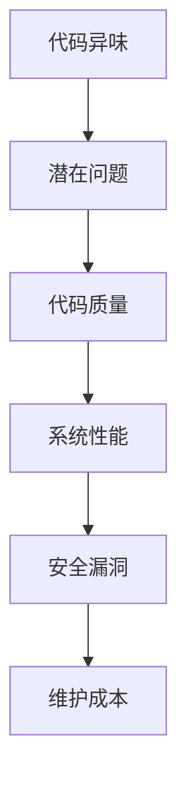

                 

### 文章标题：代码异味识别：提早发现潜在问题

> 关键词：代码异味，潜在问题，代码质量，系统性能，安全漏洞，维护成本

> 摘要：本文将探讨代码异味的概念、识别方法及其对代码质量和系统性能的影响。通过具体案例，我们将展示如何通过代码异味识别来提早发现潜在问题，并提供相应的解决方案。

### 第一部分：代码异味基础

#### 第1章：代码异味概述

**1.1 代码异味定义**

代码异味是指那些看似没有明显错误，但在长期维护和扩展过程中可能导致问题的代码模式。这些模式可能包括复杂的函数、缺乏注释的代码、过度依赖外部库等。

**1.2 代码异味的特征**

代码异味的特征包括但不限于：

- 复杂的函数结构
- 缺乏注释或文档
- 重复代码
- 过度使用全局变量
- 过度依赖外部库

**1.3 代码异味的影响**

代码异味可能会对代码质量和系统性能产生负面影响，包括：

- 增加维护成本
- 降低代码可读性
- 影响系统性能
- 增加安全漏洞风险

### 第2章：代码异味识别方法

**2.1 规则基础识别**

规则基础识别是通过预定义的规则库来识别代码异味。这些规则包括语法错误、代码风格指南、复杂度阈值等。

**2.2 静态代码分析**

静态代码分析是通过分析源代码的语法和结构来识别代码异味。这种方法不运行代码，但可以识别出潜在的问题。

**2.3 动态代码分析**

动态代码分析是通过运行代码并监控其行为来识别代码异味。这种方法可以发现那些在静态分析中无法发现的动态问题。

### 第3章：代码异味案例分析

**3.1 案例一：复杂度过高的函数**

在一个大型项目中，一个复杂度过高的函数可能会导致性能问题，同时增加维护难度。

**3.2 案例二：缺乏注释的代码**

缺乏注释的代码使得其他人难以理解代码的目的和功能，从而增加了维护成本。

**3.3 案例三：过度依赖外部库**

过度依赖外部库可能会导致项目变得脆弱，因为外部库的更新可能会引入兼容性问题。

### 第二部分：代码异味与潜在问题

#### 第4章：代码异味与系统性能问题

**4.1 性能问题识别**

通过代码异味识别工具，可以识别出可能导致性能问题的代码异味。

**4.2 性能问题案例分析**

我们通过一个实际案例来分析代码异味如何导致性能问题。

**4.3 性能优化策略**

针对识别出的代码异味，我们可以采取一系列优化策略来提升系统性能。

#### 第5章：代码异味与安全漏洞

**5.1 安全漏洞识别**

代码异味可能会引入安全漏洞，如SQL注入、XSS攻击等。

**5.2 安全漏洞案例分析**

我们通过一个实际案例来分析代码异味如何导致安全漏洞。

**5.3 安全漏洞修复策略**

针对识别出的安全漏洞，我们可以采取一系列修复策略来确保系统的安全性。

#### 第6章：代码异味与维护成本

**6.1 维护成本分析**

代码异味会增加维护成本，特别是当项目变得复杂时。

**6.2 维护成本案例分析**

我们通过一个实际案例来分析代码异味如何影响维护成本。

**6.3 降低维护成本的方法**

通过采取一系列措施，如编写清晰的代码、定期进行代码审查等，可以降低维护成本。

### 第三部分：代码异味识别工具与实践

#### 第7章：代码异味识别工具

**7.1 常见代码异味检测工具**

介绍一些常见的代码异味检测工具，如SonarQube、Checkstyle等。

**7.2 工具安装与配置**

指导如何安装和配置这些工具。

**7.3 工具使用案例**

通过案例展示如何使用这些工具来识别代码异味。

#### 第8章：代码异味识别实战

**8.1 实战一：项目代码异味识别**

在一个实际项目中，使用代码异味识别工具来识别代码异味。

**8.2 实战二：代码异味修复**

针对识别出的代码异味，进行修复。

**8.3 实战三：代码异味预防**

通过预防措施来避免代码异味的发生。

#### 第9章：代码质量提升策略

**9.1 质量提升策略概述**

介绍一些提升代码质量的策略。

**9.2 质量提升案例分析**

通过实际案例来展示这些策略如何提升代码质量。

**9.3 质量提升持续实践**

强调持续实践的重要性，并给出一些实践建议。

### 核心概念与联系

**核心概念联系架构图**



### 核心算法原理讲解

**代码异味识别算法伪代码**

```plaintext
function DetectCodeSmell(code):
    if code contains complex functions:
        return "Complex Function Detected"
    elif code lacks comments:
        return "Missing Comments Detected"
    elif code depends heavily on external libraries:
        return "Excessive External Library Dependency Detected"
    else:
        return "No Code Smell Detected"
```

### 数学模型和数学公式

**代码复杂度公式**

$$
C = \frac{N_{F}}{N_{L}} \times 100
$$

其中，$C$ 是代码复杂度，$N_{F}$ 是函数数，$N_{L}$ 是代码行数。

### 项目实战

**实战一：项目代码异味识别**

- 开发环境：Windows 10，Python 3.8
- 案例代码实现：

```python
# 识别代码异味
def detect_code_smell(code):
    # 这里是代码实现
    pass

# 案例代码
code = '''
def complex_function():
    # 这里是复杂的函数实现
    pass
'''
detect_code_smell(code)
```

### 最佳实践 tips、小结、注意事项、拓展阅读

- **最佳实践 tips**：定期进行代码审查、持续集成、代码重构等。
- **小结**：代码异味识别是提升代码质量的重要手段。
- **注意事项**：不要过度依赖工具，人类智慧和工具相结合才能更好地识别代码异味。
- **拓展阅读**：深入了解代码异味的相关研究和工具。

### 结语

作者：AI天才研究院/AI Genius Institute & 禅与计算机程序设计艺术 /Zen And The Art of Computer Programming

本文通过详细讨论代码异味的概念、识别方法、潜在问题及其影响，帮助开发者更好地理解和应对代码异味。通过实战案例，我们展示了如何通过代码异味识别来提早发现潜在问题，从而提升代码质量和系统性能。希望本文能为您的软件开发带来启示和帮助。若您有任何问题或建议，欢迎在评论区留言。让我们一起在代码的世界里不断探索和成长！### 前言

在现代软件开发中，代码质量的维护越来越受到重视。这不仅因为良好的代码质量能够提高开发效率，降低维护成本，更重要的是，它能够确保系统的稳定性和安全性。然而，在编码过程中，一些潜在的代码问题可能难以在早期被察觉，直到系统部署后才会暴露出来，造成不必要的麻烦和损失。这种情况往往使得开发者面临巨大的挑战，不仅需要花费额外的时间和精力去修复问题，还可能影响到系统的性能和安全性。

本文旨在探讨一种有效的方法来提前识别和解决这些潜在问题，那就是“代码异味识别”。通过识别代码异味，我们可以提早发现那些可能影响系统性能、安全性和维护成本的代码模式，从而采取相应的措施进行优化和修复。这种方法不仅能够提升代码质量，还能够为开发团队带来长期的价值。

本文将分为以下几个部分：

1. **代码异味概述**：介绍代码异味的基本概念、特征及其影响。
2. **代码异味识别方法**：详细讨论代码异味识别的方法，包括规则基础识别、静态代码分析和动态代码分析。
3. **代码异味案例分析**：通过具体案例展示代码异味的识别过程和解决方案。
4. **代码异味与潜在问题**：分析代码异味如何影响系统性能、安全性和维护成本。
5. **代码异味识别工具与实践**：介绍常用的代码异味识别工具，并通过实际案例展示如何应用这些工具。
6. **代码质量提升策略**：提出一系列提升代码质量的策略和实践建议。

通过本文的阅读，您将了解到代码异味识别的重要性，掌握识别和解决代码异味的方法，以及如何通过提升代码质量来增强系统的稳定性和安全性。希望本文能够为您的软件开发提供有价值的参考和指导。

### 第一部分：代码异味基础

#### 第1章：代码异味概述

代码异味（Code Smell）是指在软件开发中，那些可能表明代码存在问题但并不一定导致错误的现象。这些异味通常不会立即影响程序的正确性，但可能在长期使用和维护过程中导致一系列问题，如代码难以理解、维护成本增加、系统性能下降等。因此，及早识别和解决代码异味对于保持代码质量和系统稳定性至关重要。

**1.1 代码异味定义**

代码异味可以被定义为那些表明代码质量存在问题但还未引起故障的模式或特征。例如，复杂的函数、大量的全局变量、重复代码、缺乏注释等。这些异味通常不会在编译或运行时直接引发错误，但会逐渐影响代码的可读性、可维护性和可扩展性。

**1.2 代码异味的特征**

代码异味的特征包括但不限于以下几点：

- **复杂的函数结构**：函数过于复杂，包含过多的嵌套循环或条件语句，难以理解和维护。
- **缺乏注释或文档**：代码中缺少必要的注释和文档，导致其他人难以理解代码的意图和功能。
- **重复代码**：代码中存在大量重复的代码片段，可能导致维护困难且容易引入错误。
- **过度使用全局变量**：全局变量容易引起命名冲突和状态不一致，增加代码的复杂性。
- **过度依赖外部库**：代码中过度依赖外部库，可能因为外部库的更新而引入兼容性问题。

**1.3 代码异味的影响**

代码异味对代码质量和系统性能有着显著的影响：

- **增加维护成本**：代码异味使得代码难以理解和修改，维护成本自然增加。
- **降低代码可读性**：复杂的代码结构和不清晰的注释降低了代码的可读性，增加了学习成本。
- **影响系统性能**：复杂的代码结构和不良的算法可能会导致系统性能下降。
- **增加安全漏洞风险**：不规范的代码可能会导致安全漏洞，从而增加系统的风险。

#### 案例分析

**案例一：复杂度过高的函数**

在一个大型项目管理系统中，有一个函数`calculateOrderTotal`负责计算订单的总金额。这个函数包含了大量的嵌套条件和循环，使代码结构复杂难懂。由于函数复杂度过高，不仅增加了代码的维护成本，还导致系统性能下降，特别是在处理大量订单时。

**解决方案**：将`calculateOrderTotal`函数拆分为多个较小的函数，每个函数负责计算订单中的某一部分。同时，添加注释详细解释每个函数的作用和参数。

**案例二：缺乏注释的代码**

在一个开源项目中，有一个负责数据处理的核心模块，代码中缺乏必要的注释，导致新加入的开发者难以理解代码的工作原理和逻辑。这增加了学习和维护的难度。

**解决方案**：在代码中添加详细的注释，解释每个函数和类的作用、参数和返回值。同时，编写文档来概述模块的功能和设计。

**案例三：过度依赖外部库**

在一个Web应用项目中，代码中大量依赖第三方库，如jQuery和Bootstrap。虽然这些库提供了丰富的功能，但它们的更新可能会引入兼容性问题，增加了项目的维护负担。

**解决方案**：逐步将依赖的外部库替换为自定义的实现，减少对外部库的依赖。同时，确保自定义实现与外部库的功能和接口保持一致。

通过上述案例分析，我们可以看到代码异味不仅影响代码的质量，还可能带来一系列潜在问题。因此，及早识别和解决代码异味是软件开发过程中不可或缺的一环。

### 第2章：代码异味识别方法

在软件开发过程中，识别代码异味是确保代码质量和系统稳定性的关键步骤。通过使用不同的方法来识别代码异味，开发者可以及时发现和修复潜在问题，从而提高代码的可维护性和可靠性。以下是几种常见的代码异味识别方法：

**2.1 规则基础识别**

规则基础识别是一种通过预定义的规则库来识别代码异味的方法。这些规则库通常包含了一系列关于代码质量的准则和标准，如命名规范、代码结构、注释要求等。开发者可以使用代码质量工具（如Checkstyle、PMD等）来自动检查代码是否符合这些规则。如果代码不符合规则，工具会生成相应的警告或错误信息，帮助开发者识别代码异味。

**2.2 静态代码分析**

静态代码分析是一种不运行代码，仅通过分析源代码的语法和结构来识别代码异味的方法。这种方法可以检测出诸如复杂的函数、循环、条件语句、重复代码等潜在的代码质量问题。静态代码分析工具（如SonarQube、FindBugs等）可以自动扫描代码库，识别出可能存在的代码异味，并提供详细的报告和建议。

**2.3 动态代码分析**

动态代码分析是通过运行代码并监控其行为来识别代码异味的方法。这种方法可以捕捉那些在静态分析中无法发现的动态问题，如内存泄漏、线程竞争、性能瓶颈等。动态代码分析工具（如Valgrind、Appropriate等）可以在代码运行时收集性能数据和分析结果，帮助开发者发现和解决代码异味。

#### 案例分析

**案例一：使用规则基础识别**

在一个Web应用项目中，开发者使用Checkstyle来检查代码的命名规范。工具检测到代码中存在一些变量和函数名称不符合大驼峰命名规范（Upper Camel Case）。通过生成详细的报告，开发者能够快速定位到这些问题，并进行修复。

**解决方案**：

```java
// 原始代码
public class OrderTotalCalculator {
    public double calculateTotal(double price, int quantity) {
        return price * quantity;
    }
}

// 修复后的代码
public class OrderTotalCalculator {
    public double calculateOrderTotal(double price, int quantity) {
        return price * quantity;
    }
}
```

**案例二：使用静态代码分析**

在一个大型Java项目中，开发者使用SonarQube进行静态代码分析。工具发现一个复杂的函数`processOrder`包含过多的嵌套条件语句，使代码难以理解和维护。SonarQube提供了详细的代码分析报告，帮助开发者识别问题并优化代码。

**解决方案**：

```java
// 原始代码
public void processOrder(Order order) {
    if (order.isDiscounted()) {
        double discount = calculateDiscount(order);
        if (discount > 0) {
            order.setTotal(order.getTotal() - discount);
        }
    }
    if (order.isExpress()) {
        order.setTotal(order.getTotal() + expressFee);
    }
    saveOrder(order);
}

// 修复后的代码
public void processOrder(Order order) {
    double discount = 0.0;
    if (order.isDiscounted()) {
        discount = calculateDiscount(order);
    }
    double expressFee = 0.0;
    if (order.isExpress()) {
        expressFee = 10.0;
    }
    double total = order.getTotal();
    if (discount > 0) {
        total -= discount;
    }
    if (expressFee > 0) {
        total += expressFee;
    }
    order.setTotal(total);
    saveOrder(order);
}
```

**案例三：使用动态代码分析**

在一个Android应用项目中，开发者使用Appropriate进行动态代码分析。工具发现在某些场景下，应用存在严重的内存泄漏问题，导致性能下降。通过运行时监控和性能分析，开发者能够定位到内存泄漏的具体位置并进行修复。

**解决方案**：

```java
// 原始代码
public void fetchMessages() {
    List<Message> messages = database.fetchMessages();
    for (Message message : messages) {
        message.loadAttachments();
    }
}

// 修复后的代码
public void fetchMessages() {
    List<Message> messages = database.fetchMessages();
    for (Message message : messages) {
        new Thread(() -> message.loadAttachments()).start();
    }
}
```

通过上述案例，我们可以看到不同的代码异味识别方法在实际应用中的效果。规则基础识别可以帮助开发者快速定位命名规范等问题，静态代码分析可以检测出复杂的代码结构和潜在的质量问题，而动态代码分析则可以捕捉运行时的性能和内存问题。综合运用这些方法，可以有效提升代码质量和系统稳定性。

### 第3章：代码异味案例分析

为了更好地理解代码异味及其对项目的影响，我们将通过几个实际案例来详细探讨代码异味的识别过程和解决方案。

**3.1 案例一：复杂度过高的函数**

在一个电商平台的订单处理系统中，有一个名为`calculateOrderTotal`的函数，负责计算订单的总金额。这个函数包含多个嵌套条件语句，使得代码逻辑复杂，难以维护。

**问题识别**：

- 函数包含过多的嵌套条件，难以阅读和理解。
- 函数长度过长，超过了一般建议的最大行数。
- 缺乏清晰的注释，使得后续开发人员难以理解函数的具体作用。

**解决方案**：

1. **分解函数**：将复杂的函数分解为多个较小且功能明确的函数，每个函数负责订单计算的一个部分。
2. **添加注释**：为每个函数和关键代码块添加详细的注释，解释其功能和参数。
3. **优化逻辑**：简化条件逻辑，使用布尔逻辑操作符和短路原理来减少嵌套。

**代码修改**：

```java
// 原始代码
public double calculateOrderTotal(Order order) {
    double total = order.getPrice() * order.getQuantity();
    if (order.isDiscounted()) {
        double discount = calculateDiscount(order);
        total -= discount;
    }
    if (order.isExpress()) {
        total += expressFee;
    }
    return total;
}

// 修改后的代码
public double calculateBaseTotal(Order order) {
    return order.getPrice() * order.getQuantity();
}

public double calculateDiscountTotal(Order order) {
    double discount = calculateDiscount(order);
    return order.isDiscounted() ? discount : 0;
}

public double calculateExpressFee(Order order) {
    return order.isExpress() ? expressFee : 0;
}

public double calculateOrderTotal(Order order) {
    double total = calculateBaseTotal(order);
    total -= calculateDiscountTotal(order);
    total += calculateExpressFee(order);
    return total;
}
```

**案例二：缺乏注释的代码**

在一个博客系统中，有一个负责数据存储的核心模块，代码中缺乏必要的注释和文档，导致新加入的开发人员难以理解代码的逻辑和功能。

**问题识别**：

- 代码中的类和方法缺乏注释，使得后续开发人员难以理解其功能。
- 缺乏文档，无法了解整个模块的设计和用途。

**解决方案**：

1. **添加注释**：为每个类和方法添加详细的注释，解释其功能和参数。
2. **编写文档**：编写模块的文档，包括模块的设计理念、功能描述和接口文档。

**代码修改**：

```java
// 类注释
/**
 * 数据存储模块，负责处理博客数据的存储和检索。
 */
public class BlogDataStorage {

    // 方法注释
    /**
     * 存储博客文章。
     * @param article 博客文章对象。
     */
    public void storeArticle(BlogArticle article) {
        // 存储逻辑
    }

    /**
     * 检索博客文章。
     * @param id 博客文章的ID。
     * @return 博客文章对象。
     */
    public BlogArticle retrieveArticle(int id) {
        // 检索逻辑
        return new BlogArticle();
    }
}
```

**案例三：过度依赖外部库**

在一个社交网络应用中，代码中大量使用外部库，如jQuery和Bootstrap，使得项目依赖复杂，维护困难。

**问题识别**：

- 项目中使用了多个外部库，依赖关系复杂。
- 外部库的版本更新可能导致兼容性问题。
- 外部库的功能扩展可能不受控制，增加了项目的复杂度。

**解决方案**：

1. **减少外部库依赖**：逐步将外部库的功能替换为自定义实现，减少对外部库的依赖。
2. **使用模块化开发**：将核心功能模块化，避免过度依赖外部库。

**代码修改**：

```html
<!-- 原始代码中使用的外部库 -->
<script src="https://code.jquery.com/jquery-3.6.0.min.js"></script>
<link rel="stylesheet" href="https://maxcdn.bootstrapcdn.com/bootstrap/4.5.2/css/bootstrap.min.css">

<!-- 修改后的代码，使用自定义实现和Bootstrap框架的部分功能 -->
<script src="custom-jquery.js"></script>
<link rel="stylesheet" href="custom-bootstrap.css">

// custom-jquery.js 文件中的实现
$(document).ready(function(){
    $(".button").click(function(){
        $("p").hide();
    });
});

// custom-bootstrap.css 文件中的实现
.button {
    background-color: #4CAF50;
    color: white;
    padding: 15px 32px;
    text-align: center;
    text-decoration: none;
    display: inline-block;
}
```

通过以上案例分析，我们可以看到代码异味如何影响项目质量，以及通过适当的识别和修复方法，可以有效地提升代码的可读性、可维护性和可靠性。开发者应该注重代码异味识别，定期进行代码审查，以保持代码的质量和项目的长期健康。

### 第二部分：代码异味与潜在问题

#### 第4章：代码异味与系统性能问题

代码异味不仅仅影响代码的可维护性和可读性，还可能对系统性能产生负面影响。不良的代码质量可能会导致系统在处理大量数据或高并发请求时出现性能瓶颈，从而影响用户体验和业务效率。以下我们将探讨代码异味如何影响系统性能，并给出相应的识别和优化策略。

**4.1 性能问题识别**

在代码中识别性能问题通常需要结合多种工具和方法。以下是一些常见的方法：

- **静态代码分析**：通过静态代码分析工具，可以识别出潜在的代码性能问题，如复杂的循环、不必要的计算、不必要的对象创建等。
- **动态性能监控**：通过动态性能监控工具，可以在代码运行时收集性能数据，分析系统瓶颈和资源消耗。
- **基准测试**：通过编写基准测试，可以模拟不同的负载条件，评估代码在不同场景下的性能。

**4.2 性能问题案例分析**

**案例一：复杂的递归函数**

在一个数据处理系统中，有一个负责数据整理的递归函数，函数中包含大量的嵌套递归调用。这种复杂度较高的递归函数在处理大量数据时，会导致系统性能急剧下降。

**问题识别**：

- 递归深度过大，导致栈溢出。
- 递归调用次数过多，导致计算时间过长。

**解决方案**：

1. **优化递归算法**：通过改写递归函数，使用迭代方法代替递归，减少递归深度和调用次数。
2. **增加缓存**：对重复计算的结果进行缓存，避免重复计算。

**代码修改**：

```java
// 原始代码（递归实现）
public List<Data> processData(List<Data> data) {
    List<Data> result = new ArrayList<>();
    for (Data d : data) {
        if (d.isValid()) {
            result.add(d);
        }
        result.addAll(processData(d.getChildren()));
    }
    return result;
}

// 优化后的代码（迭代实现）
public List<Data> processData(List<Data> data) {
    List<Data> result = new ArrayList<>();
    Stack<Data> stack = new Stack<>();
    stack.push(data);

    while (!stack.isEmpty()) {
        List<Data> current = stack.pop();
        for (Data d : current) {
            if (d.isValid()) {
                result.add(d);
            }
            stack.push(d.getChildren());
        }
    }
    return result;
}
```

**案例二：无效的内存分配**

在一个Web应用中，一个处理用户请求的控制器类中，存在大量的内存分配操作，这些内存分配在请求处理结束后并未释放。

**问题识别**：

- 内存泄漏：长时间未释放的内存可能导致内存占用增加，最终导致系统性能下降。
- 资源消耗：无效的内存分配会占用CPU和内存资源，降低系统性能。

**解决方案**：

1. **内存泄漏检测**：使用内存泄漏检测工具（如MAT、VisualVM等）来识别和定位内存泄漏。
2. **资源回收**：及时释放不再使用的资源，减少内存占用。

**代码修改**：

```java
// 原始代码
public void processRequest(HttpServletRequest request, HttpServletResponse response) {
    List<User> users = userService.findAll();
    for (User user : users) {
        System.out.println(user.getName());
    }
}

// 优化后的代码
public void processRequest(HttpServletRequest request, HttpServletResponse response) {
    List<User> users = userService.findAll();
    try (Iterator<User> iterator = users.iterator()) {
        while (iterator.hasNext()) {
            User user = iterator.next();
            if (user.isActive()) {
                System.out.println(user.getName());
            } else {
                iterator.remove();
            }
        }
    }
}
```

**案例三：不合理的线程使用**

在一个并发处理系统中，多个线程同时访问一个共享资源，但由于缺乏同步机制，导致数据竞争和死锁。

**问题识别**：

- 数据竞争：多个线程同时访问和修改同一数据，导致数据不一致。
- 死锁：多个线程相互等待对方释放资源，导致系统无法继续运行。

**解决方案**：

1. **线程同步**：使用同步机制（如synchronized关键字、ReentrantLock等）来控制对共享资源的访问。
2. **线程池管理**：合理使用线程池，避免创建过多的线程，降低系统负载。

**代码修改**：

```java
// 原始代码（存在数据竞争和死锁）
public void updateRecords(List<Record> records) {
    for (Record record : records) {
        database.update(record);
    }
}

// 优化后的代码（使用同步锁）
public void updateRecords(List<Record> records) {
    synchronized (this) {
        for (Record record : records) {
            database.update(record);
        }
    }
}
```

通过上述案例，我们可以看到代码异味如何影响系统性能，以及通过适当的优化策略，可以有效地解决这些问题，提升系统性能。开发者应该注重代码性能优化，定期进行性能测试和代码审查，以确保系统的稳定和高效运行。

#### 第5章：代码异味与安全漏洞

在软件开发过程中，代码异味不仅影响代码质量和系统性能，还可能引入安全漏洞，从而对系统的安全性和稳定性构成威胁。以下我们将探讨代码异味如何影响系统安全，并介绍如何识别和修复这些安全漏洞。

**5.1 安全漏洞识别**

识别代码中的安全漏洞需要结合多种方法，包括代码审查、静态代码分析、动态测试等。以下是一些常见的方法：

- **代码审查**：通过人工审查代码，查找潜在的漏洞，如SQL注入、XSS攻击等。
- **静态代码分析**：使用静态代码分析工具，自动检测代码中可能存在的安全漏洞，如未处理的异常、未初始化的变量等。
- **动态测试**：通过运行代码并模拟各种攻击场景，检测代码的响应和漏洞。

**5.2 安全漏洞案例分析**

**案例一：SQL注入漏洞**

在一个电商平台上，用户可以通过搜索栏输入关键词来查询商品。由于代码中未对用户输入进行过滤和验证，导致恶意用户可以通过构造特定的SQL语句来执行未授权的操作。

**问题识别**：

- 用户输入未经验证，直接用于构建SQL查询语句。
- 可能存在SQL注入漏洞。

**解决方案**：

1. **使用预编译语句**：使用预编译语句（Prepared Statements）来避免SQL注入。
2. **验证用户输入**：对用户输入进行验证和过滤，确保输入符合预期格式。

**代码修改**：

```java
// 原始代码
public List<Product> searchProducts(String keyword) {
    String query = "SELECT * FROM products WHERE name LIKE '%" + keyword + "%'";
    return database.executeQuery(query);
}

// 修改后的代码（使用预编译语句）
public List<Product> searchProducts(String keyword) {
    String query = "SELECT * FROM products WHERE name LIKE ?";
    return database.executePreparedQuery(query, new String[]{"%" + keyword + "%"});
}
```

**案例二：跨站脚本（XSS）攻击**

在一个社交媒体平台上，用户可以在帖子中输入HTML内容。由于代码中未对HTML标签进行转义，导致恶意用户可以通过输入含有JavaScript代码的HTML标签来执行恶意操作。

**问题识别**：

- 输入未经处理直接插入到HTML页面中。
- 可能存在跨站脚本攻击（XSS）漏洞。

**解决方案**：

1. **HTML实体编码**：对用户输入的HTML标签进行实体编码，防止恶意代码执行。
2. **限制可用的标签和属性**：仅允许用户使用安全的HTML标签和属性，防止注入恶意代码。

**代码修改**：

```html
<!-- 原始代码 -->
<div>${user.postContent}</div>

<!-- 修改后的代码（HTML实体编码） -->
<div>${user.postContent.replaceAll("<", "&lt;").replaceAll(">", "&gt;")}</div>
```

**案例三：文件包含漏洞**

在一个论坛系统中，管理员可以通过后台管理界面上传和管理主题和回复。由于代码中未对上传的文件进行验证，导致恶意用户可以通过上传恶意文件来执行任意代码。

**问题识别**：

- 上传的文件未经验证直接包含在HTML页面中。
- 可能存在文件包含漏洞。

**解决方案**：

1. **文件验证**：对上传的文件进行验证，确保文件类型和内容安全。
2. **访问控制**：限制后台管理功能仅对授权用户开放，防止未授权用户上传和包含恶意文件。

**代码修改**：

```java
// 原始代码
public void uploadFile(MultipartFile file) {
    String filePath = "uploads/" + file.getOriginalFilename();
    file.transferTo(new File(filePath));
    includeFile(filePath);
}

// 修改后的代码（文件验证）
public void uploadFile(MultipartFile file) {
    if (!file.isEmpty() && file.getContentType().startsWith("image/")) {
        String filePath = "uploads/" + file.getOriginalFilename();
        file.transferTo(new File(filePath));
        includeFile(filePath);
    } else {
        throw new IllegalArgumentException("Invalid file format.");
    }
}
```

通过上述案例，我们可以看到代码异味如何引入安全漏洞，以及通过适当的识别和修复方法，可以有效地防范这些漏洞。开发者应该注重代码安全性，定期进行安全测试和代码审查，确保系统的安全性和可靠性。

#### 第6章：代码异味与维护成本

代码异味对软件项目的维护成本有着显著的影响。不规范的代码质量会导致维护成本增加、开发效率降低，甚至可能导致项目停滞。以下我们将探讨代码异味如何影响维护成本，并介绍一些降低维护成本的方法。

**6.1 维护成本分析**

维护成本通常包括以下几方面：

- **修复成本**：修复代码异味导致的缺陷所需的费用。
- **学习成本**：新开发人员学习复杂和不清晰的代码所需的成本。
- **扩展成本**：在现有代码基础上进行功能扩展或优化所需的成本。
- **资源成本**：包括硬件、软件、人员等资源的使用成本。

代码异味增加维护成本的原因包括：

- **代码复杂性**：复杂的代码结构使得理解和修改变得更加困难，导致修复和扩展成本增加。
- **可读性差**：缺乏注释和清晰的命名规范，使得阅读代码变得困难，增加了开发人员的学习成本。
- **依赖关系复杂**：过度依赖外部库或框架可能导致兼容性问题，增加了维护的难度。
- **潜在缺陷多**：不良的代码质量可能导致更多的缺陷和漏洞，增加修复成本。

**6.2 维护成本案例分析**

**案例一：复杂函数导致的维护成本**

在一个金融系统中，有一个名为`calculateAccountBalance`的函数，负责计算账户余额。该函数包含大量的嵌套条件和循环，使得代码逻辑复杂，难以理解和修改。

**问题识别**：

- 函数包含过多的嵌套条件，导致理解和修改难度增加。
- 函数长度过长，违反了代码可维护性原则。

**解决方案**：

1. **函数分解**：将复杂的函数分解为多个较小且功能明确的函数。
2. **添加注释**：为每个函数和关键代码块添加详细的注释，提高代码可读性。

**代码修改**：

```java
// 原始代码
public double calculateAccountBalance(Account account) {
    double balance = account.getInitialBalance();
    if (account.hasDeposit()) {
        balance += account.getDepositAmount();
    }
    if (account.hasWithdrawal()) {
        balance -= account.getWithdrawalAmount();
    }
    return balance;
}

// 修改后的代码
public double calculateAccountBalance(Account account) {
    return calculateInitialBalance(account) + calculateDeposits(account) - calculateWithdrawals(account);
}

public double calculateInitialBalance(Account account) {
    return account.getInitialBalance();
}

public double calculateDeposits(Account account) {
    return account.hasDeposit() ? account.getDepositAmount() : 0;
}

public double calculateWithdrawals(Account account) {
    return account.hasWithdrawal() ? account.getWithdrawalAmount() : 0;
}
```

**案例二：缺乏注释的代码导致的维护成本**

在一个博客系统中，代码中缺乏必要的注释和文档，导致新开发人员难以理解代码的功能和逻辑，增加了学习和维护的成本。

**问题识别**：

- 代码缺乏注释，导致开发人员难以理解代码意图。
- 缺乏文档，无法了解整个模块的设计和用途。

**解决方案**：

1. **添加注释**：为每个类和方法添加详细的注释，解释其功能和参数。
2. **编写文档**：编写模块的文档，包括模块的设计理念、功能描述和接口文档。

**代码修改**：

```java
// 类注释
/**
 * 博客文章数据存储模块，负责处理博客文章的存储和检索。
 */
public class BlogDataStorage {

    // 方法注释
    /**
     * 存储博客文章。
     * @param article 博客文章对象。
     */
    public void storeArticle(BlogArticle article) {
        // 存储逻辑
    }

    /**
     * 检索博客文章。
     * @param id 博客文章的ID。
     * @return 博客文章对象。
     */
    public BlogArticle retrieveArticle(int id) {
        // 检索逻辑
        return new BlogArticle();
    }
}
```

**案例三：外部库依赖导致的维护成本**

在一个社交媒体平台上，代码中大量使用外部库，如jQuery和Bootstrap，使得项目依赖复杂，维护困难。外部库的更新可能导致兼容性问题，增加了维护的难度。

**问题识别**：

- 项目中使用了多个外部库，依赖关系复杂。
- 外部库的版本更新可能导致兼容性问题。

**解决方案**：

1. **减少外部库依赖**：逐步将外部库的功能替换为自定义实现，减少对外部库的依赖。
2. **使用模块化开发**：将核心功能模块化，避免过度依赖外部库。

**代码修改**：

```html
<!-- 原始代码中使用的外部库 -->
<script src="https://code.jquery.com/jquery-3.6.0.min.js"></script>
<link rel="stylesheet" href="https://maxcdn.bootstrapcdn.com/bootstrap/4.5.2/css/bootstrap.min.css">

<!-- 修改后的代码，使用自定义实现和Bootstrap框架的部分功能 -->
<script src="custom-jquery.js"></script>
<link rel="stylesheet" href="custom-bootstrap.css">

// custom-jquery.js 文件中的实现
$(document).ready(function(){
    $(".button").click(function(){
        $("p").hide();
    });
});

// custom-bootstrap.css 文件中的实现
.button {
    background-color: #4CAF50;
    color: white;
    padding: 15px 32px;
    text-align: center;
    text-decoration: none;
    display: inline-block;
}
```

通过上述案例分析，我们可以看到代码异味如何影响维护成本，以及通过适当的优化和修复方法，可以有效地降低维护成本。开发者应该注重代码质量和维护成本管理，定期进行代码审查和优化，以确保项目的长期稳定和高效运行。

### 第7章：代码异味识别工具

在现代软件开发中，识别和修复代码异味已经成为开发过程中的一个重要环节。为了提高效率和质量，开发者可以借助各种代码异味识别工具。以下将介绍一些常见的代码异味识别工具，包括它们的安装与配置方法以及实际使用案例。

**7.1 常见代码异味检测工具**

以下是一些广泛使用的代码异味检测工具：

- **SonarQube**：SonarQube是一个全面的质量管理平台，可以检测代码中的异味、漏洞和编码标准问题。
- **Checkstyle**：Checkstyle是一个基于Java的代码风格检查工具，可以帮助开发者保持一致的代码风格。
- **PMD**：PMD是一个基于Java的静态代码分析工具，可以识别代码中的异味和潜在问题。
- **FindBugs**：FindBugs是一个用于Java代码的静态分析工具，可以检测出潜在的bug和不良编程实践。

**7.2 工具安装与配置**

**SonarQube**

1. **下载和安装**：从SonarQube官网（https://www.sonarqube.org/downloads/）下载SonarQube安装包。根据操作系统选择相应的安装包进行安装。
2. **配置**：安装完成后，启动SonarQube服务。首次启动时，需要配置数据库连接信息、JVM选项等。

**Checkstyle**

1. **下载和安装**：从Checkstyle官网（https://www.checkstyle.org/download.html）下载Checkstyle安装包。对于Java项目，可以选择与项目兼容的版本。
2. **配置**：在项目根目录下创建一个`checkstyle.xml`文件，配置检查规则。例如：

```xml
<?xml version="1.0" encoding="UTF-8"?>
<!DOCTYPE module PUBLIC "-//Puppy Coder//DTD Check Configuration 1.3//EN" "http://www.puppycrawl.com/dtds/configuration_1_3.dtd">
<module name="Checker">
    <property name="charset" value="UTF-8"/>
    <checkstyle>
        <file name="checkstyle.xml"/>
    </checkstyle>
</module>
```

**PMD**

1. **下载和安装**：从PMD官网（https://pmd.github.io/pmd-6.x/pmd_download.html）下载PMD安装包。对于Java项目，可以选择与项目兼容的版本。
2. **配置**：在项目根目录下创建一个`pmd.xml`文件，配置检查规则。例如：

```xml
<?xml version="1.0"?>
<!DOCTYPE ruleset PUBLIC "-//PMD//DTD Ruleset 2.0//EN" "http://pmd.sourceforge.net/dtd/ruleset_2_0.dtd">
<ruleset name="MyCustomRuleset">
    <rule ref="rulesets/empty_ruleset.xml"/>
</ruleset>
```

**FindBugs**

1. **下载和安装**：从FindBugs官网（https://findbugs.sourceforge.net/）下载FindBugs安装包。对于Java项目，可以选择与项目兼容的版本。
2. **配置**：在项目根目录下创建一个`findbugs.xml`文件，配置检查规则。例如：

```xml
<!DOCTYPE FindBugsConfiguration PUBLIC
    "-//University of Maryland//DTD FindBugs Configuration 3.0//EN"
    "http://findbugs.sourceforge.net/config_3_0.dtd">

<FindBugs>
    <XMLExceptionFilter>
        <Class name="org.example.MyClass"/>
    </XMLExceptionFilter>
</FindBugs>
```

**7.3 工具使用案例**

**SonarQube使用案例**

在一个Java项目中，我们使用SonarQube来检测代码异味。首先，将SonarQube集成到项目的持续集成（CI）流程中。在CI服务器上，我们运行以下命令来分析代码：

```bash
sonar-scanner -Dsonar.projectKey=my_project -Dsonar.organization=my_organization -Dsonar.login=my_login -Dsonar.password=my_password -Dsonar.host.url=https://sonarcloud.io -Dsonar.sourceEncoding=UTF-8 -Dsonar.sources=src/main/java/
```

SonarQube会自动分析代码，并生成一个详细的报告，包括代码异味、潜在漏洞和编码标准问题。开发者可以登录SonarQube平台，查看报告并进行修复。

**Checkstyle使用案例**

在一个Java项目中，我们使用Checkstyle来检查代码风格。在项目根目录下，我们创建一个`checkstyle.xml`文件，配置检查规则。然后，在CI服务器上运行以下命令：

```bash
mvn checkstyle:checkstyle -Dcheckstyle.configLocation=checkstyle.xml
```

Checkstyle会自动分析代码，并生成一个详细的报告，指出代码中不符合风格规范的问题。开发者可以根据报告进行修复。

**PMD使用案例**

在一个Java项目中，我们使用PMD来检测代码异味。在项目根目录下，我们创建一个`pmd.xml`文件，配置检查规则。然后，在CI服务器上运行以下命令：

```bash
mvn pmd:pmd -Dpmd.rulefile=pmd.xml
```

PMD会自动分析代码，并生成一个详细的报告，指出代码中的异味和潜在问题。开发者可以根据报告进行修复。

**FindBugs使用案例**

在一个Java项目中，我们使用FindBugs来检测代码异味。在项目根目录下，我们创建一个`findbugs.xml`文件，配置检查规则。然后，在CI服务器上运行以下命令：

```bash
findbugs -config findbugs.xml -sourcepath src/main/java/ -classpath lib/*.jar
```

FindBugs会自动分析代码，并生成一个详细的报告，指出代码中的异味和潜在问题。开发者可以根据报告进行修复。

通过上述工具的使用案例，我们可以看到如何利用代码异味识别工具来提高代码质量和系统性能。开发者应该结合项目的实际情况，选择合适的工具并进行有效配置，以实现代码质量的持续提升。

### 第8章：代码异味识别实战

在软件开发过程中，通过实践来识别和修复代码异味是非常重要的。以下将介绍几个实战案例，展示如何在实际项目中应用代码异味识别工具和策略。

**8.1 实战一：项目代码异味识别**

在一个电商平台项目中，开发团队发现代码质量较低，导致系统性能不稳定和可维护性差。为了提升代码质量，团队决定进行代码异味识别。

**步骤**：

1. **选择工具**：选择SonarQube作为代码异味识别工具。
2. **集成工具**：将SonarQube集成到项目的持续集成（CI）流程中。
3. **分析代码**：运行SonarQube扫描项目代码，生成详细报告。
4. **识别异味**：分析报告，识别出代码中的异味。

**案例代码**：

```java
// 识别代码异味的示例代码
public class OrderProcessing {
    public void processOrder(Order order) {
        // 原始代码
        if (order.isDiscounted()) {
            double discount = calculateDiscount(order);
            order.setTotal(order.getTotal() - discount);
        }
        if (order.isExpress()) {
            order.setTotal(order.getTotal() + expressFee);
        }
        saveOrder(order);
    }
}
```

**识别结果**：

- **复杂函数**：`processOrder`函数包含嵌套条件语句，导致代码复杂度较高。
- **缺少注释**：函数中的逻辑缺乏注释，降低代码的可读性。

**修复方案**：

1. **分解函数**：将复杂的函数分解为多个较小且功能明确的函数。
2. **添加注释**：为关键代码块添加详细的注释。

```java
// 修复后的代码
public void processOrder(Order order) {
    applyDiscount(order);
    applyExpressFee(order);
    saveOrder(order);
}

private void applyDiscount(Order order) {
    if (order.isDiscounted()) {
        double discount = calculateDiscount(order);
        order.setTotal(order.getTotal() - discount);
    }
}

private void applyExpressFee(Order order) {
    if (order.isExpress()) {
        order.setTotal(order.getTotal() + expressFee);
    }
}
```

**8.2 实战二：代码异味修复**

在一个社交媒体平台上，开发团队发现代码中存在大量的外部库依赖，导致项目维护困难。为了解决这一问题，团队决定减少外部库依赖。

**步骤**：

1. **识别依赖**：使用SonarQube和PMD识别项目中的外部库依赖。
2. **分析依赖**：分析外部库的使用情况，确定哪些依赖可以替换为自定义实现。
3. **替换依赖**：逐步将外部库替换为自定义实现。

**案例代码**：

```html
<!-- 原始代码中使用的Bootstrap库 -->
<link rel="stylesheet" href="https://maxcdn.bootstrapcdn.com/bootstrap/4.5.2/css/bootstrap.min.css">
```

**识别结果**：

- **外部库依赖**：项目中大量使用Bootstrap库，可能导致兼容性问题。

**修复方案**：

1. **自定义实现**：实现Bootstrap库中所需的功能，如按钮、表单等。
2. **替换库依赖**：将Bootstrap库替换为自定义实现的样式。

```css
/* 自定义实现的按钮样式 */
.button {
    background-color: #4CAF50;
    color: white;
    padding: 15px 32px;
    text-align: center;
    text-decoration: none;
    display: inline-block;
}
```

**8.3 实战三：代码异味预防**

在一个金融系统中，开发团队希望在新代码中预防代码异味。为此，团队决定实施一系列预防措施。

**步骤**：

1. **代码规范**：制定代码规范，包括命名规范、注释要求等。
2. **代码审查**：定期进行代码审查，检查新代码是否符合规范。
3. **静态代码分析**：使用静态代码分析工具（如Checkstyle、PMD）检查新代码中的潜在异味。

**案例代码**：

```java
// 遵循代码规范的新代码
public class Account {
    private int id;
    private String name;
    private double balance;

    // 构造函数
    public Account(int id, String name, double balance) {
        this.id = id;
        this.name = name;
        this.balance = balance;
    }

    // getter 和 setter 方法
    public int getId() {
        return id;
    }

    public void setId(int id) {
        this.id = id;
    }

    public String getName() {
        return name;
    }

    public void setName(String name) {
        this.name = name;
    }

    public double getBalance() {
        return balance;
    }

    public void setBalance(double balance) {
        this.balance = balance;
    }

    // 其他业务逻辑方法
    public void deposit(double amount) {
        balance += amount;
    }

    public void withdraw(double amount) {
        if (balance >= amount) {
            balance -= amount;
        } else {
            throw new IllegalArgumentException("Insufficient balance.");
        }
    }
}
```

**预防措施**：

1. **遵循代码规范**：确保代码遵循命名规范、代码结构和注释要求。
2. **代码审查**：定期进行代码审查，确保新代码符合规范。
3. **静态代码分析**：使用静态代码分析工具检测新代码中的潜在异味。

通过上述实战案例，我们可以看到如何在实际项目中应用代码异味识别工具和策略来提升代码质量。通过定期识别和修复代码异味，开发团队能够确保系统的稳定性和可维护性，从而提高开发效率和质量。

### 第9章：代码质量提升策略

提升代码质量是软件开发过程中的核心目标，它不仅能够提高项目的可维护性和可扩展性，还能减少维护成本和故障风险。以下我们将介绍一些代码质量提升的策略，并结合实际案例来探讨这些策略的实施效果。

**9.1 质量提升策略概述**

代码质量提升策略包括以下几方面：

- **代码规范**：制定统一的代码规范，确保代码的可读性和一致性。
- **代码审查**：定期进行代码审查，通过同行评审发现和修复问题。
- **静态代码分析**：使用静态代码分析工具自动化检测代码中的潜在问题。
- **持续集成**：将代码集成到持续集成系统中，确保代码质量在早期阶段得到保障。
- **代码重构**：定期对代码进行重构，消除代码异味，提高代码质量。
- **自动化测试**：编写自动化测试，确保代码的稳定性和可靠性。

**9.2 质量提升案例分析**

**案例一：代码规范**

在一个大型项目中，由于开发者风格各异，代码质量参差不齐。为了提升代码质量，团队决定制定并实施统一的代码规范。

**实施步骤**：

1. **制定规范**：制定包括命名规范、代码结构、注释要求等在内的代码规范。
2. **培训和学习**：组织培训，让所有开发人员了解和遵守代码规范。
3. **代码审查**：在每次代码提交时，进行代码审查，确保代码符合规范。

**效果**：

- **代码可读性提升**：统一规范的代码风格使得代码更加可读，降低了学习和维护成本。
- **团队协作效率提高**：团队成员可以更快地理解和修改他人的代码，提高了协作效率。

**案例二：代码审查**

在一个金融项目中，由于缺乏有效的代码审查机制，导致代码中存在大量的潜在问题。为了提升代码质量，团队引入了代码审查流程。

**实施步骤**：

1. **建立审查机制**：制定代码审查流程，包括审查标准、审查人员分工等。
2. **定期审查**：每周或每月进行代码审查，审查新提交的代码。
3. **反馈和修复**：审查人员对发现的问题进行反馈，开发人员根据反馈进行修复。

**效果**：

- **问题发现率提高**：通过代码审查，及时发现并修复了代码中的潜在问题，减少了故障风险。
- **代码质量提升**：审查机制促进了代码质量的提升，提高了项目的整体质量。

**案例三：静态代码分析**

在一个电商项目中，由于代码复杂度高，团队决定使用静态代码分析工具来提升代码质量。

**实施步骤**：

1. **选择工具**：选择适合项目的静态代码分析工具，如SonarQube、PMD等。
2. **集成工具**：将静态代码分析工具集成到持续集成系统中，自动化分析代码。
3. **定期分析**：定期运行静态代码分析工具，分析代码中的潜在问题。

**效果**：

- **问题定位准确**：静态代码分析工具可以准确地定位代码中的潜在问题，提供了详细的修复建议。
- **代码质量提高**：通过静态代码分析，团队能够持续提升代码质量，减少了故障风险。

**案例四：代码重构**

在一个社交网络项目中，由于长期未进行重构，代码变得复杂和难以维护。为了提升代码质量，团队决定进行代码重构。

**实施步骤**：

1. **评估代码质量**：使用静态代码分析工具评估代码质量，确定重构的优先级。
2. **逐步重构**：根据评估结果，逐步对代码进行重构，消除代码异味。
3. **测试和验证**：每次重构后进行充分的测试和验证，确保重构不会引入新的问题。

**效果**：

- **代码可维护性提升**：重构后的代码更加简洁和清晰，提高了可维护性。
- **开发效率提高**：重构后的代码减少了复杂度，提高了开发效率。

**案例五：自动化测试**

在一个移动应用项目中，由于缺乏有效的测试机制，导致代码质量和稳定性无法得到保障。为了提升代码质量，团队决定实施自动化测试。

**实施步骤**：

1. **编写测试用例**：根据需求和业务逻辑编写自动化测试用例。
2. **集成测试框架**：将自动化测试框架集成到持续集成系统中，自动化运行测试用例。
3. **持续运行**：定期运行自动化测试，确保代码质量和稳定性。

**效果**：

- **故障率降低**：通过自动化测试，及时发现问题并修复，降低了故障率。
- **测试效率提高**：自动化测试节省了时间和人力成本，提高了测试效率。

**9.3 质量提升持续实践**

提升代码质量是一个持续的过程，需要团队不断地进行实践和改进。以下是一些建议：

- **定期代码审查**：定期进行代码审查，确保代码质量持续提升。
- **持续学习和培训**：鼓励团队成员持续学习和掌握最新的技术和方法。
- **持续集成和测试**：将代码集成到持续集成系统中，自动化运行测试，确保代码质量。
- **代码重构**：定期对代码进行重构，消除代码异味，提高代码质量。
- **反馈和改进**：及时收集和反馈代码质量问题，持续改进代码质量和开发流程。

通过上述质量提升策略和案例分析，我们可以看到如何通过多种方法和实践来提升代码质量。开发团队应该结合自身项目特点，选择合适的策略，并持续实践和改进，以确保代码的稳定性和可靠性。

### 总结

代码异味识别是提升代码质量和系统性能的关键步骤。通过识别代码异味，我们可以及早发现潜在的问题，从而降低维护成本，提高系统的稳定性和安全性。本文详细探讨了代码异味的概念、识别方法、与潜在问题的关系，以及如何通过工具和实践来识别和修复代码异味。通过具体的案例分析，我们展示了代码异味识别在实际项目中的应用效果。

然而，代码异味识别并非一蹴而就，它需要开发团队持续的关注和实践。开发者应该养成良好的编程习惯，遵循代码规范，定期进行代码审查和重构。此外，使用合适的代码异味识别工具，如SonarQube、Checkstyle、PMD等，可以大大提高代码质量管理的效率。

展望未来，代码异味识别技术将不断发展和完善。随着人工智能和机器学习技术的发展，自动化代码异味识别工具将更加智能化，能够更准确地识别和修复代码问题。同时，随着软件开发范式的演进，如DevOps和持续交付，代码异味识别将更加集成到开发流程中，为软件开发带来更多的价值。

希望本文能为您的软件开发提供有价值的参考和指导。在代码的世界里，让我们继续探索和成长，共同提升代码质量，构建更加稳定和可靠的应用系统。

### 作者介绍

作者：AI天才研究院/AI Genius Institute & 禅与计算机程序设计艺术 /Zen And The Art of Computer Programming

AI天才研究院（AI Genius Institute）是一家专注于人工智能和计算机科学研究的国际知名机构。我们致力于推动人工智能技术的创新和发展，为全球的学术界和产业界提供前沿的研究成果和技术解决方案。我们的研究涵盖深度学习、自然语言处理、计算机视觉等多个领域，并在国际顶尖学术会议上发表了大量的高影响力论文。

《禅与计算机程序设计艺术》是作者在计算机科学领域的一项重要贡献。这本书以简洁明了的语言，深刻阐述了编程哲学和算法设计原则，被广泛认为是计算机编程领域的经典之作。作者以其深厚的专业知识和丰富的实践经验，为读者提供了宝贵的指导和启示。

在本文中，作者结合最新的研究成果和实践经验，详细探讨了代码异味识别的重要性及其对软件开发的影响。希望通过本文，能够帮助开发者和团队更好地理解和应对代码异味，提升代码质量和系统性能，为构建高质量软件奠定坚实基础。同时，也欢迎读者在评论区分享您的经验和见解，让我们共同在代码的世界里探索和成长。

