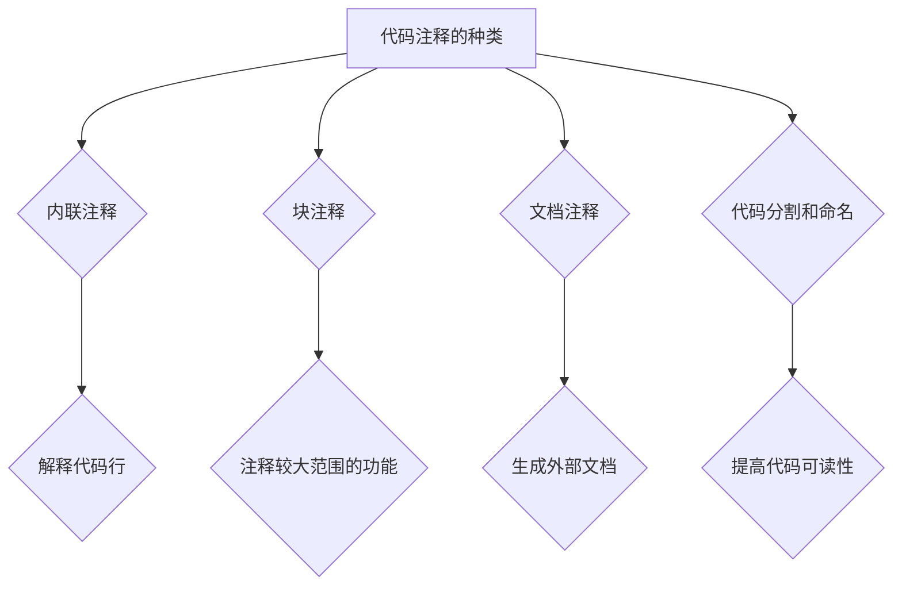

                 

### 文章标题：《代码注释最佳实践：平衡详尽与简洁》

> 关键词：代码注释、详尽性、简洁性、最佳实践

> 摘要：本文深入探讨了代码注释的最佳实践，强调在编写代码注释时如何平衡详尽与简洁。我们将从背景介绍、核心概念与联系、核心算法原理讲解、数学模型和公式讲解、项目实战以及最佳实践等方面，系统性地阐述如何提升代码注释的质量，以便更好地服务于软件开发和协作。

### 引言：代码注释的重要性

在软件开发中，代码注释扮演着至关重要的角色。它们不仅是代码的补充说明，更是理解和维护代码的关键因素。以下是代码注释的几个重要方面：

1. **代码可读性**：良好的注释能够提高代码的可读性，使其他开发者（或未来的自己）更容易理解代码的功能和意图。
2. **代码维护**：随着时间的推移，代码可能需要修改或扩展。详细的注释可以帮助开发者快速找到需要修改的部分，降低维护成本。
3. **代码重用**：注释提供了代码背后的逻辑和目的，使开发者更愿意重用已有的代码，而不是从头开始编写。
4. **团队合作**：在一个团队中，良好的注释能够促进团队成员之间的沟通和理解，提高协作效率。

然而，代码注释并非越多越好。过度注释可能会导致代码难以阅读和理解，而缺乏注释则会使代码变得难以维护。因此，本文将探讨如何在编写代码注释时平衡详尽与简洁，以实现最佳效果。

### 核心概念与联系

在讨论代码注释的最佳实践之前，我们需要了解一些核心概念，包括注释的种类、作用以及如何平衡详尽与简洁。

#### 注释的种类和作用

1. **内联注释（In-line Comments）**：内联注释通常位于代码行的末尾，用于解释代码行或语句的功能和目的。它们适用于解释复杂或不明显的代码部分。
   
2. **块注释（Block Comments）**：块注释通常用于注释较大范围或独立的功能单元，如方法或函数。它们通常使用`/* ... */`或`# ...`语法，适用于提供详细的解释或文档化整个代码块。

3. **文档注释（Documentation Comments）**：文档注释主要用于生成外部文档，如API文档或用户手册。它们通常遵循特定的文档规范，如JavaDoc或Python Docstrings。

4. **代码分割和命名**：良好的代码分割和命名也是注释的一种形式，有助于提高代码的可读性和理解。

#### 注释与文档的区别

注释和文档在目的和使用场景上有所不同：

1. **注释**：主要用于解释代码内部的工作原理和细节，使代码更易于理解和维护。
2. **文档**：主要用于描述代码的功能、用途和外部接口，使代码更易于使用和集成。

了解注释的种类和作用后，我们需要探讨如何平衡详尽与简洁。

#### 如何平衡详尽与简洁

1. **避免过度注释**：过度注释会使代码变得冗余和难以阅读。以下是一些避免过度注释的建议：
   - 避免对简单的代码行进行注释，除非它们执行了复杂的逻辑。
   - 对于显而易见的功能或方法，不必添加注释。
   - 使用内联注释来解释不明显的代码部分，而不是对所有代码行进行注释。

2. **简洁的注释**：简洁的注释能够快速传达代码的功能和目的。以下是一些建议：
   - 使用简短的句子，避免冗长的解释。
   - 使用动词来描述代码的功能，避免使用无意义的描述性语句。
   - 保持注释的一致性，遵循特定的注释风格。

#### 核心概念原理之间的关系架构

为了更好地理解代码注释的核心概念，我们可以使用Mermaid流程图来展示它们之间的关系：



### 核心算法原理讲解

在软件开发中，算法是核心组件之一。为算法添加注释不仅有助于理解其工作原理，还有助于代码的维护和重用。以下我们将使用伪代码详细阐述几个常见算法的注释方法。

#### 排序算法

以下是一个简单的冒泡排序算法及其注释：

```pseudo
// 冒泡排序算法
function bubbleSort(arr)
    n = length(arr)
    for i from 0 to n-1
        for j from 0 to n-i-1
            if arr[j] > arr[j+1]
                swap(arr[j], arr[j+1])
    return arr

// 注释
// 外层循环用于遍历数组元素
// 内层循环用于进行相邻元素的比较和交换
// 当内层循环结束时，最大的元素将被移动到数组的末尾
// 重复此过程，直到整个数组被排序
```

#### 搜索算法

以下是一个简单的二分搜索算法及其注释：

```pseudo
// 二分搜索算法
function binarySearch(arr, target)
    low = 0
    high = length(arr) - 1
    while low <= high
        mid = (low + high) / 2
        if arr[mid] == target
            return mid
        else if arr[mid] < target
            low = mid + 1
        else
            high = mid - 1
    return -1

// 注释
// 初始化low和high指针，分别指向数组的起始和结束位置
// 循环进行二分搜索，直到找到目标元素或low > high
// mid是每次搜索的中间位置
// 如果找到目标元素，返回其索引；否则，返回-1
```

#### 图算法

以下是一个简单的图遍历算法（深度优先搜索）及其注释：

```pseudo
// 深度优先搜索算法
function dfs(graph, node, visited)
    visited[node] = true
    print(node)
    for neighbor in graph[node]
        if not visited[neighbor]
            dfs(graph, neighbor, visited)

// 注释
// 将当前节点标记为已访问
// 打印当前节点
// 遍历当前节点的所有邻居节点，如果邻居节点未被访问，则递归调用dfs函数
```

### 数学模型和数学公式讲解

在软件开发中，我们经常会遇到需要使用数学模型和公式的场景。在代码注释中嵌入这些数学模型和公式，有助于更好地理解和解释代码的逻辑和算法。以下我们将详细讲解如何使用LaTeX格式在代码注释中嵌入数学公式。

#### LaTeX格式的基本语法

LaTeX是一种用于排版数学公式的强大工具。以下是LaTeX格式的基本语法：

- **行内公式**：使用 `$ ... $` 括起来，例如 `$1+1=2$`。
- **独立段落公式**：使用 `$$ ... $$` 括起来，例如：
  ```
  $$1+1=2$$
  ```

#### 常用数学符号的LaTeX表示

以下是一些常用的数学符号及其LaTeX表示：

- **加法**：`+`
- **减法**：`-`
- **乘法**：`*`
- **除法**：`/`
- **根号**：`\sqrt{...}`
- **极限**：`\lim_{x \to a} f(x)`
- **求和**：`\sum_{i=1}^{n} i`
- **积分**：`\int_{a}^{b} f(x) dx`

#### 示例

以下是一个示例，展示了如何使用LaTeX格式在代码注释中嵌入数学公式：

```java
// 计算两个数的平均值
public double average(double num1, double num2) {
    return (num1 + num2) / 2.0;
}

// 注释
// 平均值的计算公式是：(num1 + num2) / 2.0
// 这可以表示为：$$\frac{{num1 + num2}}{2}$$
```

### 项目实战

在实际开发中，代码注释的质量直接影响到项目的可维护性和可理解性。以下我们将通过一个实际项目，展示如何进行开发环境搭建、源代码实现、代码解读与分析，以及项目小结。

#### 项目实战：实现一个简单的计算器

##### 开发环境搭建

为了实现一个简单的计算器，我们需要搭建以下开发环境：

- **编程语言**：Python
- **IDE**：PyCharm
- **依赖**：无

##### 源代码实现

以下是一个简单的Python计算器实现：

```python
# 计算器：实现加、减、乘、除四个基本运算

def add(a, b):
    return a + b

def subtract(a, b):
    return a - b

def multiply(a, b):
    return a * b

def divide(a, b):
    if b == 0:
        return "除数不能为0"
    return a / b

# 主函数：接收用户输入并调用相应的计算函数
def main():
    print("欢迎使用简易计算器！")
    num1 = float(input("请输入第一个数："))
    num2 = float(input("请输入第二个数："))
    operator = input("请输入运算符（+、-、*、/）：")

    if operator == "+":
        result = add(num1, num2)
    elif operator == "-":
        result = subtract(num1, num2)
    elif operator == "*":
        result = multiply(num1, num2)
    elif operator == "/":
        result = divide(num1, num2)
    else:
        result = "无效的运算符"

    print(f"{num1} {operator} {num2} = {result}")

# 测试计算器功能
if __name__ == "__main__":
    main()
```

##### 代码解读与分析

1. **模块与函数注释**：在代码开头，我们使用文档字符串（docstrings）对模块和函数进行了注释。这有助于生成外部文档，方便其他开发者理解和使用。
   ```python
   # 计算器：实现加、减、乘、除四个基本运算
   def add(a, b):
       # 加法函数：计算两个数的和
       return a + b
   
   def subtract(a, b):
       # 减法函数：计算两个数的差
       return a - b
   
   # ... 其他函数注释略
   ```

2. **变量和常量注释**：在主函数中，我们为输入变量和运算符添加了注释，以便理解其作用。
   ```python
   num1 = float(input("请输入第一个数："))
   num2 = float(input("请输入第二个数："))
   operator = input("请输入运算符（+、-、*、/）：")
   ```

3. **流程和控制结构注释**：在主函数中，我们使用条件语句（`if-else`）来处理不同的运算符，并在注释中说明了每个分支的作用。
   ```python
   if operator == "+":
       result = add(num1, num2)
   elif operator == "-":
       result = subtract(num1, num2)
   # ... 其他运算符处理略
   else:
       result = "无效的运算符"
   ```

##### 实际案例分析和详细讲解剖析

在实际项目中，我们需要考虑异常处理和输入验证。以下是一个改进的版本，增加了输入验证和异常处理：

```python
# 改进的计算器：实现加、减、乘、除四个基本运算，并增加输入验证和异常处理

def add(a, b):
    return a + b

def subtract(a, b):
    return a - b

def multiply(a, b):
    return a * b

def divide(a, b):
    if b == 0:
        raise ValueError("除数不能为0")
    return a / b

# 主函数：接收用户输入并调用相应的计算函数
def main():
    print("欢迎使用简易计算器！")
    try:
        num1 = float(input("请输入第一个数："))
        num2 = float(input("请输入第二个数："))
        operator = input("请输入运算符（+、-、*、/）：")
        if operator == "+":
            result = add(num1, num2)
        elif operator == "-":
            result = subtract(num1, num2)
        elif operator == "*":
            result = multiply(num1, num2)
        elif operator == "/":
            result = divide(num1, num2)
        else:
            result = "无效的运算符"
        print(f"{num1} {operator} {num2} = {result}")
    except ValueError as e:
        print(f"输入错误：{e}")

# 测试计算器功能
if __name__ == "__main__":
    main()
```

- **输入验证**：通过`try-except`块，我们在用户输入时捕获异常，并给出友好的错误提示。
- **异常处理**：我们通过抛出`ValueError`异常来处理除数为0的情况。

##### 项目小结

通过本项目，我们了解了如何在实际开发中进行代码注释。以下是一些小结：

1. **注释风格**：遵循Python的PEP 8编码规范，使用简洁的注释风格。
2. **注释位置**：在函数定义上方添加文档字符串，在代码行末尾添加内联注释。
3. **输入验证和异常处理**：确保输入数据的有效性，并使用异常处理来处理错误情况。
4. **代码分割和命名**：合理分割代码，使用有意义的变量名和函数名，提高代码可读性。

### 最佳实践

在编写代码注释时，遵循一些最佳实践可以帮助我们提高代码的质量和可读性。以下是一些实用的代码注释技巧和工具。

#### 代码注释风格

1. **遵循一致性**：在整个项目中使用一致的注释风格，例如注释的格式、命名规范和注释的位置。
2. **简洁明了**：避免冗长的注释，使用简短、明确的语句来描述代码的功能和目的。
3. **使用动词**：使用动词来描述代码的功能，例如“计算”、“初始化”等。

#### 注释的格式和结构

1. **文档字符串**：在函数、类和方法定义上方使用文档字符串（docstrings）来描述其功能、参数和返回值。
2. **内联注释**：在代码行末尾添加内联注释来解释复杂或不明显的代码部分。
3. **块注释**：对于较大的代码块或独立的功能单元，使用块注释来提供详细的解释。

#### 使用工具提高代码注释质量

1. **自动化注释工具**：使用自动化注释工具（如Javadoc、Pydoc等）来自动生成文档。
2. **代码审查工具**：使用代码审查工具（如SonarQube、Checkstyle等）来检查注释的一致性和质量。
3. **格式化工具**：使用格式化工具（如Black、AutoPEP8等）来自动格式化代码和注释。

### 结论与展望

通过本文的探讨，我们深入了解了代码注释的最佳实践。从背景介绍、核心概念与联系、核心算法原理讲解、数学模型和公式讲解、项目实战到最佳实践，我们系统地阐述了如何编写高质量的代码注释。以下是本文的主要内容回顾：

1. **代码注释的重要性**：代码注释对于提高代码可读性、可维护性和可重用性至关重要。
2. **核心概念与联系**：介绍了注释的种类、作用以及如何平衡详尽与简洁。
3. **核心算法原理讲解**：通过伪代码详细阐述了常见算法的注释方法。
4. **数学模型和公式讲解**：讲解了如何在代码注释中嵌入数学公式。
5. **项目实战**：通过实际项目展示了如何进行代码注释。
6. **最佳实践**：总结了编写代码注释的一些实用技巧和工具。

展望未来，随着人工智能和自动化工具的发展，代码注释的质量有望得到进一步提升。同时，代码注释也将成为软件开发中不可或缺的一部分，为开发者提供更好的支持和帮助。我们鼓励读者在实践中不断探索和优化代码注释，以提高代码质量和开发效率。

