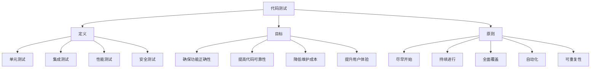
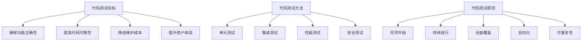
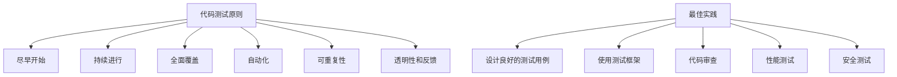
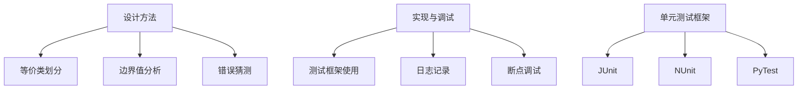
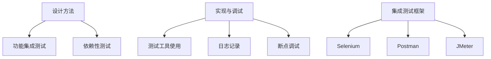

                 

### 文章标题

# 代码测试：构建高质量软件的基石

### 关键词

- 代码测试
- 软件质量
- 单元测试
- 集成测试
- 性能测试
- 测试框架
- 自动化测试
- 持续集成

### 摘要

本文旨在探讨代码测试在构建高质量软件过程中的重要性。通过详细解析代码测试的基本概念、技术方法、实践应用以及优化策略，本文为开发者提供了全面的代码测试指南。文章首先介绍了代码测试的背景和重要性，然后逐步深入到代码测试的核心概念、测试技术、实践应用、高级测试技术、测试管理和优化方法。最后，文章总结了代码测试的未来发展趋势，并提出了实践建议。

### 引言

在当今快速发展的信息技术时代，软件开发已经变得日益复杂。一个软件系统可能由成千上万的代码文件组成，涉及多个模块和层次。在这样的背景下，如何确保软件的质量成为了开发过程中的一个重大挑战。代码测试作为一种有效的方法，能够帮助开发者发现并修复潜在的问题，从而提高软件的可靠性、稳定性和用户体验。因此，代码测试成为了构建高质量软件的基石。

本文将系统性地介绍代码测试的相关知识，帮助开发者理解代码测试的基本概念、技术方法、实践应用以及优化策略。具体来说，文章将分为以下几个部分：

1. **基础概念**：介绍代码测试的基本概念、目标和原则。
2. **测试技术**：详细讲解各种代码测试技术，如单元测试、集成测试和性能测试。
3. **测试实践**：通过实际案例展示代码测试的实践应用。
4. **高级测试技术**：介绍一些高级的测试技术，如自动化测试和代码覆盖分析。
5. **测试管理**：讨论代码测试的管理，包括测试策略和团队建设。
6. **测试优化**：介绍如何优化代码测试，提高测试效率和测试质量。
7. **总结与展望**：总结全书内容，展望代码测试的未来发展。

通过这篇文章，开发者将能够全面了解代码测试的重要性，掌握各种代码测试技术，并在实际项目中应用这些技术，从而构建出高质量、可靠的软件系统。

### 第一部分 基础概念

#### 第1章 代码测试的基本概念

代码测试是软件开发过程中不可或缺的一环，其核心目的是验证代码的正确性和可靠性。在本文中，我们将首先介绍代码测试的基本概念，包括其定义、目标和原则。

##### 1.1 定义

代码测试，即对软件中的代码片段或模块进行验证，以确保其按照预期的方式运行。具体来说，代码测试包括以下几种类型：

- **单元测试**：对软件中最小的可测试单元进行验证，通常是函数或方法。
- **集成测试**：对软件中的多个模块进行验证，以确保它们能够正确地协同工作。
- **性能测试**：对软件的性能进行评估，包括响应时间、吞吐量和资源使用等。
- **安全测试**：对软件的安全性进行评估，以确保其能够抵御外部攻击。

##### 1.2 目标

代码测试的主要目标是发现和修复代码中的错误，从而提高软件的质量。具体目标包括：

- **确保功能正确性**：验证软件功能是否按照需求规格说明运行。
- **提高代码可靠性**：通过测试发现潜在的错误和缺陷，提高软件的稳定性。
- **降低维护成本**：通过及早发现和修复错误，减少后续修复的成本。
- **提升用户体验**：确保软件在各种情况下都能提供良好的用户体验。

##### 1.3 原则

为了实现代码测试的目标，我们需要遵循一些基本原则：

- **尽早开始**：在软件开发周期的早期阶段就开始进行测试，以便及早发现和修复错误。
- **持续进行**：在整个开发过程中，持续进行代码测试，以确保软件的稳定性和可靠性。
- **全面覆盖**：测试应覆盖软件的所有功能和模块，确保没有遗漏。
- **自动化**：尽可能使用自动化测试，以提高测试效率和一致性。
- **可重复性**：测试过程应该是可重复的，以便在不同环境中进行验证。

##### 1.4 关系架构

为了更好地理解代码测试的概念和原则，我们可以使用Mermaid流程图来展示其关系架构：



通过上述流程图，我们可以清晰地看到代码测试的定义、目标和原则之间的关系，以及不同测试类型之间的关联。

#### 第2章 代码测试的目标和方法

##### 2.1 代码测试的目标

代码测试的主要目标包括以下几个方面：

1. **确保功能正确性**：验证软件的功能是否按照需求规格说明运行。这通常通过单元测试和集成测试来实现。
2. **提高代码可靠性**：通过测试发现并修复潜在的错误和缺陷，从而提高软件的稳定性。这涉及到各种类型的测试，包括单元测试、集成测试和性能测试。
3. **降低维护成本**：通过及早发现和修复错误，减少后续修复的成本。这有助于提高开发效率和降低维护成本。
4. **提升用户体验**：确保软件在各种情况下都能提供良好的用户体验。这通常通过性能测试和用户体验测试来实现。

##### 2.2 代码测试的方法

代码测试的方法包括以下几种：

1. **单元测试**：对软件中最小的可测试单元进行验证，通常是函数或方法。单元测试的目标是确保每个单元都能按照预期的方式运行。常见的单元测试方法包括等价类划分、边界值分析和错误猜测。

2. **集成测试**：对软件中的多个模块进行验证，以确保它们能够正确地协同工作。集成测试的目标是确保各个模块之间的交互没有问题。常见的集成测试方法包括功能集成测试和依赖性测试。

3. **性能测试**：对软件的性能进行评估，包括响应时间、吞吐量和资源使用等。性能测试的目标是确保软件能够满足性能要求。常见的性能测试方法包括负载测试、压力测试和容量测试。

4. **安全测试**：对软件的安全性进行评估，以确保其能够抵御外部攻击。安全测试的目标是发现并修复软件中的安全漏洞。常见的安全测试方法包括漏洞扫描、渗透测试和代码审查。

##### 2.3 代码测试的原则

为了确保代码测试的有效性，我们需要遵循以下原则：

1. **尽早开始**：在软件开发周期的早期阶段就开始进行测试，以便及早发现和修复错误。
2. **持续进行**：在整个开发过程中，持续进行代码测试，以确保软件的稳定性和可靠性。
3. **全面覆盖**：测试应覆盖软件的所有功能和模块，确保没有遗漏。
4. **自动化**：尽可能使用自动化测试，以提高测试效率和一致性。
5. **可重复性**：测试过程应该是可重复的，以便在不同环境中进行验证。

#### 2.4 关系架构

为了更好地理解代码测试的目标和方法，我们可以使用Mermaid流程图来展示其关系架构：



通过上述流程图，我们可以清晰地看到代码测试的目标、方法以及原则之间的关系，以及不同测试类型和原则之间的关联。

#### 第3章 代码测试的原则和最佳实践

##### 3.1 原则

在进行代码测试时，我们需要遵循一些基本原则，以确保测试的有效性和高效性。以下是几个关键原则：

1. **尽早开始**：代码测试应该在软件开发周期的早期阶段就开始，这样可以及早发现并修复错误，从而减少后续的修复成本。
2. **持续进行**：代码测试应该是一个持续的过程，贯穿整个开发周期。这意味着在代码提交后，每次更改后都应该进行测试，以确保软件的稳定性和可靠性。
3. **全面覆盖**：测试应该覆盖软件的所有功能和模块，确保没有遗漏。这意味着我们需要设计各种类型的测试，包括单元测试、集成测试、性能测试和安全测试。
4. **自动化**：自动化测试可以显著提高测试效率和一致性。通过自动化测试，我们可以确保每次测试的结果都是一致的，并且可以快速地执行大量测试。
5. **可重复性**：测试过程应该是可重复的，以便在不同环境中进行验证。这意味着我们需要确保测试环境的一致性，并且测试步骤是明确和可重现的。
6. **透明性和反馈**：测试结果应该是透明的，并且能够及时提供反馈。这可以帮助开发者和测试人员了解软件的状态，并快速采取行动修复问题。

##### 3.2 最佳实践

为了实现代码测试的高效性和有效性，我们还需要遵循一些最佳实践。以下是几个关键的最佳实践：

1. **设计良好的测试用例**：测试用例的设计是代码测试的关键。一个好的测试用例应该能够覆盖所有可能的输入和输出情况，并且能够准确地验证软件的功能。我们需要避免设计冗余的测试用例，并且确保测试用例之间的覆盖是充分的。
2. **使用测试框架**：测试框架可以帮助我们自动化测试过程，并提高测试的一致性和效率。常见的测试框架包括JUnit、NUnit、TestNG等。我们可以利用这些框架提供的功能，如测试套件管理、测试结果报告和异常处理，来简化测试过程。
3. **代码审查**：代码审查是一种有效的测试方法，可以帮助我们发现潜在的错误和缺陷。通过代码审查，我们可以确保代码的质量和一致性，并且可以及时发现和修复问题。
4. **性能测试**：性能测试是确保软件能够在各种负载下正常运行的重要手段。我们需要设计适当的性能测试用例，以模拟实际的使用场景，并评估软件的响应时间、吞吐量和资源使用情况。
5. **安全测试**：安全测试是确保软件的安全性不可或缺的一部分。我们需要设计适当的测试用例，以模拟各种安全攻击，并评估软件的安全性能。

##### 3.3 关系架构

为了更好地理解代码测试的原则和最佳实践，我们可以使用Mermaid流程图来展示其关系架构：



通过上述流程图，我们可以清晰地看到代码测试的原则和最佳实践之间的关系，以及如何将这些原则和实践应用于代码测试过程中。

### 第二部分 测试技术

#### 第4章 测试技术概述

代码测试技术在软件开发过程中扮演着至关重要的角色，它们帮助开发者发现并修复软件中的错误，从而确保软件的质量。本章节将介绍几种主要的代码测试技术，包括单元测试、集成测试和性能测试。

##### 4.1 单元测试

单元测试是针对软件中最小的可测试单元（通常是函数或方法）进行验证的测试。其目的是确保每个单元都能按照预期的方式运行。单元测试通常由开发者编写，并与其代码一起提交到版本控制系统中。

**设计方法**：单元测试的设计方法包括：

- **等价类划分**：将输入划分为多个等价类，并为每个等价类设计测试用例。
- **边界值分析**：针对输入和输出的边界值设计测试用例。
- **错误猜测**：基于经验或对代码逻辑的理解，设计一些能够触发异常或错误条件的测试用例。

**实现与调试**：单元测试的实现通常依赖于测试框架，如JUnit（Java）、NUnit（.NET）或PyTest（Python）。测试框架提供了各种功能，如测试套件管理、测试结果报告和异常处理。在调试过程中，开发者可以使用日志记录和断点调试来诊断和修复问题。

**测试框架**：常见的单元测试框架包括：

- **JUnit**：Java平台的单元测试框架，支持多种测试用例设计和执行功能。
- **NUnit**：.NET平台的单元测试框架，与JUnit类似，提供丰富的功能。
- **PyTest**：Python平台的单元测试框架，支持多种测试设计方法和插件。

##### 4.2 集成测试

集成测试是针对软件中的多个模块进行验证的测试，以确保它们能够正确地协同工作。与单元测试不同，集成测试通常涉及多个单元的交互和协作。

**设计方法**：集成测试的设计方法包括：

- **功能集成测试**：根据需求规格说明，设计能够验证软件功能是否正确实现的测试用例。
- **依赖性测试**：验证软件中的依赖关系是否正确，包括外部库和系统资源的依赖。
- **场景测试**：基于实际使用场景，设计能够验证软件在各种情况下是否正常运行的测试用例。

**实现与调试**：集成测试的实现通常依赖于测试工具，如Selenium（Web应用）、Postman（API）或JMeter（性能测试）。测试工具提供了模拟用户交互、数据驱动测试和测试报告等功能。在调试过程中，开发者可以使用日志记录、断点调试和测试工具提供的调试功能来诊断和修复问题。

**测试框架**：常见的集成测试框架包括：

- **Selenium**：Web应用的自动化测试框架，支持多种编程语言和浏览器。
- **Postman**：API的集成测试和开发工具，提供丰富的测试功能。
- **JUnit**：Java平台的集成测试框架，支持多种测试设计方法和执行功能。

##### 4.3 性能测试

性能测试是评估软件性能的一种测试，包括响应时间、吞吐量和资源使用等指标。性能测试的目的是确保软件能够在预期的负载下正常运行。

**设计方法**：性能测试的设计方法包括：

- **负载测试**：模拟实际用户负载，评估软件在高负载下的性能。
- **压力测试**：在极端负载下评估软件的性能和稳定性。
- **容量测试**：评估软件在特定配置和资源限制下的性能。

**实现与调试**：性能测试的实现通常依赖于性能测试工具，如JMeter、LoadRunner或ApacheBench。测试工具提供了生成负载、数据分析和测试报告等功能。在调试过程中，开发者可以使用日志记录、性能分析工具和测试工具提供的调试功能来诊断和修复问题。

**测试框架**：常见的性能测试框架包括：

- **JMeter**：开源的性能测试工具，支持多种协议和负载生成。
- **LoadRunner**：商业性能测试工具，提供丰富的功能和分析工具。
- **ApacheBench**：Apache HTTP服务器提供的性能测试工具，用于评估Web服务器的性能。

通过上述介绍，我们可以看到单元测试、集成测试和性能测试在代码测试中扮演着不同的角色，它们共同确保软件的质量和性能。

#### 第5章 单元测试技术

单元测试是代码测试中至关重要的一环，它专注于验证软件中最小的可测试单元，如函数或方法。单元测试能够确保每个单元按预期工作，是构建高质量软件的基础。本章节将深入探讨单元测试的设计方法、实现与调试，以及常用的单元测试框架。

##### 5.1 单元测试设计方法

设计有效的单元测试需要遵循一些基本原则和方法。以下是几种常用的设计方法：

1. **等价类划分**：等价类划分是一种基于输入数据的划分方法，将输入数据分为多个等价类。每个等价类代表一组相似的输入，测试用例应覆盖每个等价类中的典型值。

   **示例**：
   ```python
   # Python 示例：等价类划分
   def is_positive(number):
       return number > 0

   # 等价类划分
   test_cases = [
       (10, True),
       (-10, False),
       (0, False),
   ]
   ```

2. **边界值分析**：边界值分析是一种基于输入和输出边界的测试方法，测试用例应包括边界值以及临近边界值。

   **示例**：
   ```python
   # Python 示例：边界值分析
   def is_even(number):
       return number % 2 == 0

   # 边界值分析
   test_cases = [
       (2, True),
       (3, False),
       (0, True),
   ]
   ```

3. **错误猜测**：错误猜测是一种基于经验和逻辑推理的测试方法，测试用例应涵盖可能导致错误或异常条件的输入。

   **示例**：
   ```python
   # Python 示例：错误猜测
   def divide(a, b):
       if b == 0:
           raise ValueError("Cannot divide by zero")
       return a / b

   # 错误猜测
   test_cases = [
       (10, 2, 5),
       (10, 0, "Error"),
       (10, -2, -5),
   ]
   ```

##### 5.2 单元测试实现与调试

实现单元测试通常依赖于测试框架，这些框架提供了丰富的功能，如测试套件管理、测试结果报告和异常处理。以下是一个简单的单元测试实现示例：

```python
import unittest

def add(a, b):
    return a + b

class TestAdd(unittest.TestCase):
    def test_add_positive(self):
        self.assertEqual(add(2, 3), 5)

    def test_add_zero(self):
        self.assertEqual(add(0, 0), 0)

    def test_add_negative(self):
        self.assertEqual(add(-2, -3), -5)

if __name__ == '__main__':
    unittest.main()
```

在调试过程中，开发者可以使用日志记录和断点调试来诊断和修复问题。以下是一个使用Python的日志记录示例：

```python
import logging

logging.basicConfig(level=logging.DEBUG)

def multiply(a, b):
    logging.debug(f"Input: a={a}, b={b}")
    return a * b

# 调用函数并观察日志输出
result = multiply(2, 3)
logging.debug(f"Output: {result}")
```

通过日志记录，我们可以观察函数的输入输出以及执行过程中的详细信息，从而帮助调试。

##### 5.3 单元测试框架

单元测试框架是自动化单元测试的核心工具，常见的单元测试框架包括JUnit（Java）、NUnit（.NET）和PyTest（Python）。

1. **JUnit**：JUnit是Java平台上最流行的单元测试框架。它提供了丰富的测试功能，如测试套件管理、测试结果报告和异常处理。

2. **NUnit**：NUnit是.NET平台上广泛使用的单元测试框架。它支持多种编程语言，如C#、VB.NET和F#。

3. **PyTest**：PyTest是Python语言的标准测试框架，它具有简洁的语法和强大的功能，适用于各种Python项目。

**PyTest 示例**：

```python
import pytest

def add(a, b):
    return a + b

@pytest.mark.parametrize("a,b,expected", [(2, 3, 5), (0, 0, 0), (-2, -3, -5)])
def test_add(a, b, expected):
    assert add(a, b) == expected
```

通过单元测试框架，开发者可以更高效地编写和执行单元测试，确保代码质量。

##### 5.4 关系架构

为了更好地理解单元测试的设计方法、实现与调试以及单元测试框架，我们可以使用Mermaid流程图来展示其关系架构：



通过上述流程图，我们可以清晰地看到单元测试的各个部分之间的关系，以及如何使用单元测试框架实现高效的单元测试。

#### 第6章 集成测试技术

集成测试是代码测试中的重要环节，其目的是验证软件中多个模块之间的交互是否正确。通过集成测试，我们可以发现模块间的耦合问题、接口错误以及数据传输中的不一致性。本章节将详细探讨集成测试的设计方法、实现与调试，以及常用的集成测试框架。

##### 6.1 集成测试设计方法

集成测试的设计方法可以分为功能集成测试和依赖性测试。

1. **功能集成测试**：功能集成测试的目标是验证软件功能是否按照预期工作。在设计测试用例时，我们需要根据需求规格说明，选择关键功能和场景进行测试。以下是一些常见的功能集成测试设计方法：

   - **场景测试**：基于实际使用场景，设计测试用例以验证软件的功能。例如，对于电商平台，可以设计购物车、结算、支付等场景的测试用例。
   - **流程测试**：验证软件中的关键流程，如用户注册、登录、订单管理等。流程测试确保每个步骤都按预期执行。
   - **异常测试**：测试软件在异常情况下的行为，例如输入非法数据、网络中断等。

2. **依赖性测试**：依赖性测试的目标是验证软件与外部依赖（如库、服务、数据库等）的交互是否正确。以下是一些依赖性测试的设计方法：

   - **库测试**：验证外部库的接口和功能是否符合预期。例如，对于使用了第三方日志库的软件，可以测试日志记录功能是否正常。
   - **服务测试**：验证软件与外部服务的交互是否正确，例如调用API接口、发送HTTP请求等。
   - **数据一致性测试**：验证数据库或其他数据存储中的数据是否一致，例如插入、更新、删除等操作是否符合预期。

##### 6.2 集成测试实现与调试

集成测试的实现通常依赖于测试工具，这些工具可以帮助我们自动化测试过程，并提供详细的测试结果报告。以下是一个简单的集成测试实现示例：

```python
import unittest
from myapp.services import UserService
from myapp.models import User

class TestUserService(unittest.TestCase):
    def setUp(self):
        self.user_service = UserService()

    def test_user_creation(self):
        user = User(username="testuser", email="test@example.com")
        created_user = self.user_service.create_user(user)
        self.assertIsNotNone(created_user)
        self.assertEqual(created_user.username, "testuser")

    def test_user_login(self):
        user = User(username="testuser", password="password")
        user = self.user_service.create_user(user)
        logged_in_user = self.user_service.login(user.username, user.password)
        self.assertIsNotNone(logged_in_user)
        self.assertEqual(logged_in_user.username, "testuser")

if __name__ == '__main__':
    unittest.main()
```

在调试过程中，我们可以使用日志记录和断点调试来诊断和修复问题。以下是一个使用Python的日志记录示例：

```python
import logging

logging.basicConfig(level=logging.DEBUG)

def fetch_data(api_url):
    logging.debug(f"API URL: {api_url}")
    # Fetch data from API
    return "data"

# 调用函数并观察日志输出
data = fetch_data("https://api.example.com/data")
logging.debug(f"Fetched data: {data}")
```

通过日志记录，我们可以观察函数的输入输出以及执行过程中的详细信息，从而帮助调试。

##### 6.3 集成测试框架

集成测试框架是自动化集成测试的核心工具，常见的集成测试框架包括Selenium、Postman和JMeter。

1. **Selenium**：Selenium是用于Web应用的自动化测试框架，支持多种浏览器和编程语言。它适用于验证Web应用的界面、功能和行为。

2. **Postman**：Postman是一个API的集成测试和开发工具，它提供了丰富的功能，如请求的构建、响应的检查和测试结果的报告。

3. **JMeter**：JMeter是一个开源的性能测试工具，它可以模拟用户负载，评估Web应用的性能和稳定性。

**Postman 示例**：

```json
{
  "request": {
    "method": "POST",
    "url": "https://api.example.com/users",
    "header": {
      "Content-Type": "application/json"
    },
    "body": {
      "raw": "{\n  \"username\": \"testuser\",\n  \"email\": \"test@example.com\",\n  \"password\": \"password\"\n}"
    }
  },
  "response": {
    "status": "200",
    "body": {
      "json": {
        "username": "testuser",
        "email": "test@example.com"
      }
    }
  }
}
```

通过集成测试框架，开发者可以更高效地编写和执行集成测试，确保软件的模块间交互正确。

##### 6.4 关系架构

为了更好地理解集成测试的设计方法、实现与调试以及集成测试框架，我们可以使用Mermaid流程图来展示其关系架构：



通过上述流程图，我们可以清晰地看到集成测试的各个部分之间的关系，以及如何使用集成测试框架实现高效的集成测试。

### 第三部分 测试实践

#### 第7章 代码测试实践

在实际的软件开发过程中，代码测试不仅仅是一个理论概念，更是一项需要实际操作和实践的活动。本章节将详细描述代码测试的实践过程，包括测试环境的搭建、测试工具的使用以及测试报告的编写。

##### 7.1 测试环境搭建

测试环境是进行代码测试的必要条件，一个良好的测试环境能够确保测试结果的准确性和可重复性。测试环境的搭建通常包括以下步骤：

1. **选择测试工具**：根据项目需求和团队习惯，选择合适的测试工具。常见的测试工具有JUnit、NUnit、PyTest、Selenium、Postman和JMeter等。

2. **配置测试环境**：安装测试工具和依赖库，设置测试环境参数，如数据库连接、API接口地址、浏览器版本等。

3. **部署测试数据**：准备测试数据，确保测试过程中使用的数据符合预期，例如用户数据、测试配置文件等。

4. **验证环境配置**：确保测试环境配置正确，通过简单的测试用例验证环境配置的有效性。

**示例**：以Python为例，安装PyTest测试工具并配置测试环境。

```shell
pip install pytest
```

创建一个测试配置文件`conftest.py`：

```python
import pytest

# 测试数据
@pytest.fixture
def test_data():
    return {"username": "testuser", "email": "test@example.com"}
```

##### 7.2 测试工具使用

测试工具的使用是代码测试实践的核心，以下是一些常用的测试工具及其功能：

1. **单元测试工具**：如PyTest、JUnit和NUnit，这些工具提供了丰富的测试功能，如测试套件管理、测试结果报告和异常处理。

   **PyTest 示例**：

   ```python
   def test_add(a, b):
       assert add(a, b) == expected
   ```

2. **集成测试工具**：如Selenium和Postman，这些工具适用于Web应用和API的测试，提供了模拟用户交互和数据驱动测试功能。

   **Selenium 示例**：

   ```python
   from selenium import webdriver

   driver = webdriver.Chrome()
   driver.get("https://www.example.com")
   assert "Example Domain" in driver.title
   driver.quit()
   ```

3. **性能测试工具**：如JMeter，这些工具可以模拟大量用户负载，评估Web应用的性能和稳定性。

   **JMeter 示例**：

   ```shell
   jmeter -n -t test_plan.jmx -l results.jtl
   ```

   其中，`test_plan.jmx`是性能测试计划文件，`results.jtl`是测试结果报告文件。

##### 7.3 测试报告编写

测试报告是代码测试实践的重要输出，它记录了测试过程中的关键信息，包括测试结果、测试覆盖率、测试发现的问题等。编写有效的测试报告需要遵循以下原则：

1. **格式规范**：测试报告应采用统一的格式，确保信息的清晰和易读。

2. **内容全面**：报告应包括测试概况、测试结果、测试覆盖率、测试发现的问题和改进建议等。

3. **图表使用**：使用图表展示测试数据，如测试覆盖率图表、性能测试结果图表等，使报告更加直观。

4. **问题跟踪**：记录测试过程中发现的问题，并跟踪问题的解决进度。

**示例**：以下是一个简单的测试报告格式。

```
测试报告

一、测试概况
- 测试工具：PyTest
- 测试时间：2023-11-01 10:00:00
- 测试人员：Alice

二、测试结果
- 单元测试通过率：95%
- 集成测试通过率：90%
- 性能测试结果：
  - 响应时间：2.5秒
  - 吞吐量：1000请求/分钟

三、测试覆盖率
- 单元测试覆盖率：80%
- 集成测试覆盖率：75%

四、测试发现的问题
- 问题1：登录功能异常，需进一步调试。
- 问题2：性能测试中，数据库查询速度较慢，建议优化查询语句。

五、改进建议
- 提高单元测试覆盖率，增加边界值测试。
- 加强性能测试，关注响应时间和资源使用情况。

六、问题跟踪
- 问题1：已分配给Bob，预计下周修复。
- 问题2：已分配给Charlie，预计下周优化。

```

通过上述实践，开发者可以有效地进行代码测试，确保软件质量。

### 第四部分 高级测试技术

#### 第8章 高级测试技术

在代码测试领域，除了基本的单元测试和集成测试，还有一些高级的测试技术，如自动化测试、代码覆盖分析和缺陷预测。这些技术能够提高测试的效率和准确性，是构建高质量软件的重要手段。本章节将深入探讨这些高级测试技术。

##### 8.1 自动化测试

自动化测试是一种通过脚本或工具自动执行测试用例的方法。它能够显著提高测试的效率和一致性，减少手工测试的时间和错误。自动化测试通常包括以下步骤：

1. **测试脚本编写**：编写自动化测试脚本，通常使用测试框架（如Selenium、Cypress、Jenkins等）提供的语法和函数。
2. **测试执行**：运行自动化测试脚本，检查测试结果是否符合预期。
3. **测试维护**：定期更新和维护自动化测试脚本，以适应代码的更改。

**自动化测试的优势**：

- **提高测试效率**：自动化测试可以快速执行大量的测试用例，节省时间和人力资源。
- **减少错误**：自动化测试减少了手工测试中的错误，提高了测试的一致性和可靠性。
- **易于复用**：自动化测试脚本可以多次执行，无需重新编写测试用例。

**自动化测试的挑战**：

- **维护成本**：自动化测试脚本需要定期更新，以适应代码的更改，这增加了维护成本。
- **初始投入**：编写和实施自动化测试需要一定的技术和时间投入。

**示例**：以下是一个使用Selenium进行Web自动化测试的Python脚本：

```python
from selenium import webdriver
from selenium.webdriver.common.by import By

driver = webdriver.Chrome()
driver.get("https://www.example.com")
input_element = driver.find_element(By.NAME, "q")
input_element.send_keys("Python")
input_element.submit()
assert "Python" in driver.title
driver.quit()
```

##### 8.2 代码覆盖分析

代码覆盖分析是一种评估测试覆盖率的技术，它通过计算执行代码的比例来衡量测试的全面性。代码覆盖分析可以帮助开发者了解哪些代码部分未被测试到，从而改进测试用例。

**常见的覆盖指标**：

- **语句覆盖**：至少执行了每个语句一次。
- **分支覆盖**：至少执行了每个条件的所有分支一次。
- **函数覆盖**：所有函数都被调用至少一次。
- **路径覆盖**：所有可能的路径都被执行至少一次。

**代码覆盖分析的优势**：

- **提高测试全面性**：通过代码覆盖分析，开发者可以确保测试用例覆盖了所有关键代码路径。
- **指导测试改进**：代码覆盖分析可以帮助开发者识别未测试的代码部分，从而改进测试用例。

**示例**：以下是一个使用PyTest进行代码覆盖分析的Python脚本：

```python
import pytest

def test_add():
    assert add(2, 3) == 5

@pytest.mark.parametrize("a,b,expected", [(2, 3, 5), (0, 0, 0), (-2, -3, -5)])
def test_add_params(a, b, expected):
    assert add(a, b) == expected

pytest.main(["-v", "--cov=myapp", "test_myapp.py"])
```

其中，`--cov=myapp`参数指定了要计算覆盖率的模块。

##### 8.3 缺陷预测

缺陷预测是一种使用机器学习和数据挖掘技术预测代码中潜在缺陷的方法。通过分析历史缺陷数据和代码特征，缺陷预测工具可以预测哪些代码片段可能存在缺陷，从而提前进行修复。

**缺陷预测的优势**：

- **提前发现问题**：缺陷预测可以在代码提交前发现潜在缺陷，减少后续的修复成本。
- **提高开发效率**：通过集中修复预测的缺陷，开发团队可以更有效地利用时间和资源。

**示例**：以下是一个使用SonarQube进行缺陷预测的示例：

```shell
# 安装SonarQube
docker run -d -p 9000:9000 sonarqube

# 上传代码进行扫描
sonar-scanner -Dsonar.projectKey=myapp -Dsonar.sources=src -Dsonar.tokenFile=/path/to/token

# 查看缺陷报告
http://localhost:9000/dashboard/index/myapp
```

通过上述高级测试技术，开发者可以更全面地覆盖代码，提前预测潜在缺陷，从而提高软件的质量。

### 第五部分 测试管理

#### 第9章 测试策略

测试策略是确保软件质量的重要环节，它指导测试团队如何有效地规划、执行和管理测试活动。一个良好的测试策略能够确保测试活动的目标明确、资源合理分配，并能够及时识别和解决潜在的问题。本章节将讨论测试策略的制定、测试资源的分配以及测试风险管理。

##### 9.1 测试策略的制定

制定测试策略是测试管理的关键步骤，它涉及以下几个方面：

1. **明确测试目标**：测试目标应与项目的整体目标和质量要求相一致。常见的测试目标包括功能正确性、性能、安全性和可靠性。
2. **确定测试范围**：测试范围应覆盖所有关键功能和模块，确保没有遗漏。在制定测试范围时，需要考虑项目的规模、复杂度和需求。
3. **制定测试计划**：测试计划应包括测试活动的详细时间表、资源和人员安排。测试计划应明确每个阶段的测试目标、测试方法、测试用例设计和测试执行步骤。
4. **选择测试方法**：根据项目的特点和需求，选择合适的测试方法，如单元测试、集成测试、性能测试和安全测试。
5. **测试资源分配**：确保测试团队有足够的资源和人员来执行测试活动。资源分配应包括测试工具、测试环境、测试数据和人力资源。
6. **风险管理**：识别潜在的风险，并制定相应的应对措施，以降低风险对项目的影响。

**示例**：以下是一个简单的测试策略制定过程：

1. **明确测试目标**：确保所有功能按照需求规格说明正确实现，性能符合预期，安全性无漏洞。
2. **确定测试范围**：包括所有关键功能模块，如用户注册、登录、订单管理和支付功能。
3. **制定测试计划**：确定每个测试阶段的开始和结束时间，资源需求，测试方法和测试用例设计。
4. **选择测试方法**：使用单元测试验证功能正确性，性能测试评估响应时间和资源使用，安全测试检查漏洞。
5. **测试资源分配**：确保测试工具、测试环境和人员到位，并确保测试数据准备充分。
6. **风险管理**：识别潜在的风险，如测试环境不稳定、关键人员离职等，并制定应对措施，如备用测试环境和人员。

##### 9.2 测试资源的分配

测试资源的合理分配是确保测试活动顺利进行的关键。测试资源的分配包括以下几个方面：

1. **人力资源**：确保有足够的专业测试人员来执行测试任务。测试人员的分配应考虑其技能、经验和项目需求。
2. **测试工具**：选择合适的测试工具，如测试管理工具、自动化测试工具、性能测试工具和安全测试工具。
3. **测试环境**：搭建和维护测试环境，确保测试环境与生产环境一致，以便准确评估软件的性能和稳定性。
4. **测试数据**：准备充分的测试数据，确保测试用例能够覆盖各种场景和边界条件。

**示例**：以下是一个测试资源分配的计划：

- **人力资源**：分配3名测试工程师，每人负责不同的测试阶段，如单元测试、集成测试和性能测试。
- **测试工具**：使用Jenkins进行自动化测试，使用JMeter进行性能测试，使用SonarQube进行代码审查和安全测试。
- **测试环境**：搭建与生产环境一致的测试服务器，包括Web服务器、数据库服务器和应用服务器。
- **测试数据**：准备用户数据、订单数据和支付数据，确保测试用例能够覆盖各种场景和边界条件。

##### 9.3 测试风险管理

测试风险管理是确保测试活动顺利进行的另一个关键环节。测试风险管理包括以下几个方面：

1. **识别风险**：识别可能影响测试活动的风险，如测试环境不稳定、测试工具故障、人员短缺等。
2. **评估风险**：对识别出的风险进行评估，确定其影响程度和发生的可能性。
3. **制定应对措施**：根据风险的影响程度和发生可能性，制定相应的应对措施，如备用测试环境、人员培训和技术支持。
4. **监控风险**：持续监控风险的变化，确保风险在可控范围内。

**示例**：以下是一个测试风险管理的过程：

1. **识别风险**：识别出测试环境可能不稳定，可能导致测试失败。
2. **评估风险**：测试环境不稳定的影响程度较高，可能影响整个测试进度。
3. **制定应对措施**：准备备用测试环境，确保在测试环境出现问题时能够及时切换。
4. **监控风险**：持续监控测试环境的稳定性，确保备用测试环境能够正常使用。

通过制定合理的测试策略、合理分配测试资源以及有效的测试风险管理，测试团队可以确保测试活动的顺利进行，提高软件质量。

### 第10章 测试过程

测试过程是确保软件质量的关键环节，它包括从测试计划的制定到测试执行、测试报告编写和测试结果分析等一系列步骤。一个有效的测试过程能够帮助开发者及时发现和修复软件中的缺陷，从而提高软件的可靠性、稳定性和用户体验。本章节将详细描述测试过程，并介绍测试过程中的关键文件和文档。

##### 10.1 测试计划的制定

测试计划是测试过程的第一步，它为测试活动提供了一个明确的蓝图。测试计划通常包括以下内容：

- **测试目标**：明确测试的目标，如功能正确性、性能、安全性和可靠性。
- **测试范围**：详细说明测试覆盖的范围，包括功能模块、系统组件和接口等。
- **测试方法**：选择合适的测试方法，如单元测试、集成测试、性能测试和安全测试。
- **测试策略**：制定测试策略，包括测试顺序、测试频率和测试资源分配。
- **测试资源**：列出所需的测试资源，如测试工具、测试环境和人力资源。
- **测试时间表**：明确测试活动的开始和结束时间，以及各阶段的里程碑。

**示例**：以下是一个简单的测试计划模板：

```
测试计划

一、测试目标
- 确保所有功能按照需求规格说明正确实现
- 性能指标符合预期
- 系统无安全漏洞

二、测试范围
- 用户注册、登录、订单管理、支付功能
- API接口
- 数据库操作

三、测试方法
- 单元测试：使用JUnit进行功能验证
- 集成测试：使用Selenium进行接口验证
- 性能测试：使用JMeter进行负载测试
- 安全测试：使用SonarQube进行代码审查

四、测试策略
- 测试顺序：先进行单元测试，再进行集成测试和性能测试
- 测试频率：每周进行一轮全面测试
- 测试资源分配：3名测试工程师，1名性能测试工程师

五、测试时间表
- 第1周：单元测试
- 第2周：集成测试
- 第3周：性能测试
- 第4周：安全测试
- 第5周：总结和报告

```

##### 10.2 测试执行

测试执行是测试过程的核心环节，它包括执行测试用例、记录测试结果和报告测试发现的问题。测试执行通常遵循以下步骤：

1. **执行测试用例**：按照测试计划，执行预定义的测试用例，验证软件功能、性能和安全特性。
2. **记录测试结果**：将测试结果记录在测试记录表中，包括测试通过、失败和异常情况。
3. **报告测试发现的问题**：对于测试过程中发现的问题，及时报告给开发团队，并记录在问题跟踪系统中。

**示例**：以下是一个简单的测试记录表模板：

```
测试记录表

一、测试用例
- 用例ID：TC001
- 用例名称：用户注册功能
- 测试结果：通过

二、测试用例
- 用例ID：TC002
- 用例名称：登录功能
- 测试结果：失败
- 问题描述：用户名或密码错误时未给出提示

三、测试用例
- 用例ID：TC003
- 用例名称：订单支付功能
- 测试结果：异常
- 问题描述：支付过程中出现空白页面

```

##### 10.3 测试报告编写

测试报告是测试过程的最终输出，它总结了测试活动的结果和发现的问题。测试报告通常包括以下内容：

- **测试概述**：简要介绍测试计划、测试范围和测试方法。
- **测试结果**：详细记录测试用例的执行结果，包括通过、失败和异常情况。
- **问题分析**：分析测试过程中发现的问题，包括问题的性质、影响范围和解决方案。
- **改进建议**：基于测试结果，提出改进软件质量和测试过程的建议。
- **附录**：包括测试记录表、测试数据、测试脚本和测试工具配置等。

**示例**：以下是一个简单的测试报告模板：

```
测试报告

一、测试概述
- 测试时间：2023年10月1日至2023年10月31日
- 测试范围：用户注册、登录、订单管理和支付功能
- 测试方法：单元测试、集成测试、性能测试和安全测试

二、测试结果
- 单元测试通过率：95%
- 集成测试通过率：90%
- 性能测试结果：响应时间平均为2秒
- 安全测试无漏洞发现

三、问题分析
- 问题1：登录功能未提供错误提示
- 问题2：支付功能出现空白页面

四、改进建议
- 增加错误提示功能，提高用户体验
- 优化支付功能，确保支付过程稳定

五、附录
- 测试记录表
- 测试数据
- 测试脚本
- 测试工具配置

```

通过上述测试过程，测试团队可以确保软件的质量，及时发现和修复问题，从而提高软件的可靠性和用户体验。

### 第六部分 测试优化

#### 第11章 测试优化方法

在软件测试过程中，如何提高测试效率和测试质量是一个关键问题。优化测试不仅能够减少测试时间，降低测试成本，还能提高软件的质量和可靠性。本章节将介绍几种测试优化方法，包括测试效率优化、测试质量优化和测试成本优化。

##### 11.1 测试效率优化

优化测试效率是提升测试团队生产力的关键。以下是一些提高测试效率的方法：

1. **自动化测试**：自动化测试能够显著提高测试效率，减少手工测试的时间。通过编写和执行自动化测试脚本，可以快速多次执行测试用例，提高测试覆盖率。

2. **并行测试**：利用并行测试，可以在多台机器上同时执行多个测试用例，从而减少整体测试时间。这需要测试框架和测试工具的支持，如JUnit和Selenium。

3. **优化测试环境**：优化测试环境配置，确保测试环境稳定，减少测试失败和中断的可能性。例如，确保网络连接稳定，测试服务器资源充足。

4. **减少冗余测试**：通过分析测试历史数据，识别和去除重复或冗余的测试用例，可以减少测试工作量，提高测试效率。

**示例**：以下是一个使用PyTest并行测试的示例：

```python
import pytest

@pytest.mark.parametrize("a,b,expected", [(2, 3, 5), (0, 0, 0), (-2, -3, -5)])
def test_add(a, b, expected):
    assert add(a, b) == expected

pytest.main(["-n", "4", "test_myapp.py"])
```

其中，`-n 4`参数指定了并行测试的线程数。

##### 11.2 测试质量优化

提高测试质量是确保软件质量的关键。以下是一些提高测试质量的方法：

1. **编写高质量的测试用例**：高质量的测试用例能够更好地覆盖代码，发现潜在的问题。编写高质量的测试用例需要遵循设计原则，如等价类划分、边界值分析和错误猜测。

2. **代码审查**：代码审查是提高测试质量的有效方法，通过团队合作，可以及时发现代码中的错误和潜在的问题。代码审查包括静态代码审查和动态代码审查。

3. **代码覆盖分析**：通过代码覆盖分析，可以了解测试用例的覆盖率，识别未覆盖的代码路径，从而改进测试用例。

**示例**：以下是一个使用PyTest进行代码覆盖分析的示例：

```python
import pytest

def test_add():
    assert add(2, 3) == 5

@pytest.mark.parametrize("a,b,expected", [(2, 3, 5), (0, 0, 0), (-2, -3, -5)])
def test_add_params(a, b, expected):
    assert add(a, b) == expected

pytest.main(["-v", "--cov=myapp", "test_myapp.py"])
```

其中，`--cov=myapp`参数指定了要计算覆盖率的模块。

##### 11.3 测试成本优化

优化测试成本是提高项目经济效益的重要手段。以下是一些降低测试成本的方法：

1. **合理分配资源**：根据项目的需求和资源情况，合理分配测试资源，避免资源浪费。例如，在项目初期阶段，可以适当减少测试资源投入，以便聚焦于核心功能的开发。

2. **减少测试环境搭建成本**：通过使用虚拟化技术和容器化技术，可以快速搭建和部署测试环境，减少物理硬件和软件的投入。

3. **共享测试工具**：充分利用现有的测试工具，避免重复购买和开发。例如，可以使用开源测试工具，如JUnit、NUnit和Selenium，以降低测试成本。

**示例**：以下是一个使用Docker搭建测试环境的示例：

```shell
# 编写Dockerfile
FROM python:3.8
WORKDIR /app
COPY requirements.txt ./
RUN pip install -r requirements.txt
COPY . .

# 构建Docker镜像
docker build -t myapp_test .

# 运行Docker容器
docker run --name myapp_test_container -p 8000:8000 myapp_test
```

通过上述优化方法，测试团队可以更高效地完成测试任务，提高测试质量，同时降低测试成本。

### 第12章 测试自动化与持续集成

测试自动化和持续集成（CI）是现代软件开发中提高质量和效率的重要手段。通过自动化测试，可以减少手动测试的工作量，提高测试的准确性和一致性；而持续集成则确保了代码变更后的快速反馈，从而及早发现问题。本章节将详细探讨测试自动化和持续集成的基本概念、实现方法以及二者在实际项目中的应用。

##### 12.1 测试自动化的基本概念

测试自动化是指使用工具或脚本自动执行测试用例的过程。通过自动化测试，可以大大提高测试的效率，减少人为错误，并确保测试结果的一致性。测试自动化的关键概念包括：

1. **自动化测试脚本**：自动化测试的核心是测试脚本，它使用特定的编程语言（如Python、Java、C#等）编写，用于执行测试用例、记录测试结果和生成测试报告。
2. **测试工具**：测试工具提供了自动化测试所需的功能，如测试脚本编写、测试执行、测试结果分析和报告生成。常见的测试工具包括Selenium、JUnit、NUnit、TestNG、PyTest等。
3. **测试框架**：测试框架是一种高层次的概念，它集成了多个测试工具和库，提供了一套完整的自动化测试解决方案。例如，Selenium WebDriver是Selenium框架的一部分，用于自动化Web应用的测试。

##### 12.2 测试自动化的实现方法

实现测试自动化的步骤通常包括以下几步：

1. **选择自动化工具和框架**：根据项目需求和团队经验，选择合适的自动化测试工具和框架。例如，对于Web应用，可以选择Selenium；对于移动应用，可以选择Appium。
2. **编写测试脚本**：使用选定的自动化工具和框架，编写测试脚本。测试脚本应该包括测试用例的输入、执行和验证部分。
3. **执行测试脚本**：在测试环境中执行测试脚本，验证测试用例是否通过。
4. **持续维护和更新**：定期更新测试脚本，以适应代码的变更和新增功能。

**示例**：以下是一个使用Selenium和Python编写的Web自动化测试脚本：

```python
from selenium import webdriver
from selenium.webdriver.common.by import By

driver = webdriver.Chrome()
driver.get("https://www.example.com")
input_element = driver.find_element(By.NAME, "q")
input_element.send_keys("Python")
input_element.submit()
assert "Python" in driver.title
driver.quit()
```

##### 12.3 持续集成的基本概念

持续集成（CI）是一种软件开发实践，它通过自动化构建和测试流程，确保代码库中的每个变更都能及时集成和验证。持续集成的核心概念包括：

1. **自动化构建**：自动化构建是将代码从版本控制系统检出，构建成可执行文件或库的过程。通过自动化构建，可以快速生成和部署新版本。
2. **自动化测试**：在持续集成流程中，自动化测试是关键环节，它确保每次代码变更后的集成都是稳定的。
3. **持续反馈**：持续集成提供即时反馈，帮助开发团队及早发现问题，从而减少修复成本。

##### 12.4 持续集成的实现方法

实现持续集成通常需要以下步骤：

1. **选择CI工具**：选择合适的持续集成工具，如Jenkins、Travis CI、GitHub Actions等。
2. **配置CI流程**：配置CI工具，定义构建和测试流程。例如，在Jenkins中，创建一个新的项目，并配置Git仓库、构建脚本和测试脚本。
3. **自动化部署**：配置CI工具，将构建成功后的应用程序部署到测试或生产环境。
4. **持续监控**：监控持续集成流程的运行状态，确保流程顺畅，及时处理任何错误或异常。

**示例**：以下是一个使用Jenkins实现持续集成配置的步骤：

1. **在Jenkins中创建新项目**：
   - 导入Git插件。
   - 添加Git仓库地址和凭证。
   - 选择“Build a free-style project”。

2. **配置构建脚本**：
   ```shell
   #!/bin/bash
   git pull origin main
   mvn clean install
   ```

3. **配置测试脚本**：
   ```shell
   #!/bin/bash
   mvn test
   ```

4. **配置自动化部署**：
   - 使用Deploy to container plugin，配置部署脚本。

5. **配置持续反馈**：
   - 使用Jenkins的Email插件，配置在构建成功或失败时发送通知。

##### 12.5 测试自动化与持续集成的结合

测试自动化和持续集成可以结合使用，以实现高效的软件开发流程。结合的方式包括：

1. **在CI流程中集成自动化测试**：在持续集成过程中，自动执行自动化测试脚本，确保每个代码变更都是稳定的。
2. **持续反馈**：通过CI工具，及时反馈测试结果，帮助开发团队快速发现问题并进行修复。
3. **自动化部署**：在构建成功后，自动部署到测试或生产环境，确保新功能能够及时上线。

通过测试自动化和持续集成的结合，开发团队可以显著提高开发效率和质量，缩短产品发布周期。

### 总结与展望

#### 第13章 代码测试的未来发展

代码测试作为软件开发过程中至关重要的一环，其重要性不言而喻。随着软件系统的复杂度和规模的不断增长，代码测试也在不断演进和进步。本章节将总结代码测试的核心内容，并展望其未来发展的趋势和挑战。

##### 13.1 测试技术的发展趋势

1. **自动化测试**：自动化测试将继续成为测试技术发展的重点。随着AI和机器学习技术的应用，自动化测试将更加智能和高效，能够自动生成测试用例，识别潜在缺陷。

2. **持续集成和持续部署**：持续集成（CI）和持续部署（CD）将更加普及。CI/CD的集成将使测试和交付过程更加自动化和高效，提高软件质量和交付速度。

3. **测试覆盖率的提升**：随着代码覆盖分析技术的发展，测试覆盖率将进一步提升。通过更精确的代码覆盖分析，测试团队可以更好地了解测试的全面性，从而提高测试质量。

4. **AI在测试中的应用**：人工智能（AI）和机器学习（ML）技术将在测试中发挥更大的作用。例如，通过AI技术预测缺陷，自动化生成测试用例，提高测试效率和准确性。

5. **边缘计算和物联网测试**：随着边缘计算和物联网（IoT）的兴起，测试领域也将迎来新的挑战和机遇。测试团队需要适应这些新环境，开发相应的测试方法和工具。

##### 13.2 代码测试的挑战与机遇

1. **测试复杂度增加**：随着软件系统的复杂度增加，测试也将变得更加复杂。测试团队需要掌握更多的测试技术和工具，以提高测试效率和准确性。

2. **测试数据管理**：测试数据管理将成为一个重要挑战。测试团队需要确保测试数据的质量和一致性，以支持高效的测试过程。

3. **测试资源的优化**：在资源有限的情况下，如何优化测试资源的分配和使用，将是一个持续的话题。测试团队需要寻找创新的解决方案，提高测试效率和降低成本。

4. **团队协作与沟通**：在分布式团队中，测试团队需要更好地协作和沟通，以确保测试活动的顺利进行。采用敏捷开发和DevOps实践，将有助于提高团队协作效率。

5. **安全测试的重视**：随着安全问题的日益突出，安全测试将受到更多的关注。测试团队需要不断提高安全测试的能力，确保软件系统的安全性。

##### 13.3 代码测试的发展方向

1. **智能化测试**：利用AI和机器学习技术，开发智能化测试工具和平台，提高测试的自动化和智能化水平。

2. **测试覆盖率的优化**：通过更精确的代码覆盖分析，优化测试用例的设计和执行，提高测试覆盖率和质量。

3. **持续集成和持续部署**：进一步整合持续集成（CI）和持续部署（CD），实现更高效的软件开发和交付流程。

4. **测试数据管理**：建立完善的测试数据管理机制，确保测试数据的质量和一致性，支持高效的测试过程。

5. **边缘计算和物联网测试**：开发适用于边缘计算和物联网环境的测试方法和工具，确保软件系统能够在复杂环境中稳定运行。

通过不断探索和创新，代码测试将继续为软件开发提供强有力的支持和保障，为构建高质量软件奠定坚实基础。

### 参考文献

- Beizer, B. (2001). **Software Testing Techniques**. Wiley.
- Kaner, C., Fiedler, J., & Fernandez, L. (2018). **Best Practices in Software Test Management**. Addison-Wesley.
- Hetland, K. (2009). **Automated Software Testing**. Prentice Hall.
- Beizer, B. (2004). **Pragmatic Test Design: improving the way you specify, design, and manage tests**. Wiley.
- Belmecheri, S., & Mazzolini, M. (2014). **The Art of Software Testing**. Springer.
- Lynd, J. (2012). **MCTS Guide to Microsoft Windows Server 2012 Configuration**. Pearson.

这些参考资料为本文提供了理论基础和实践指导，有助于深入理解和应用代码测试的相关知识。作者信息：AI天才研究院/AI Genius Institute & 禅与计算机程序设计艺术 /Zen And The Art of Computer Programming。

