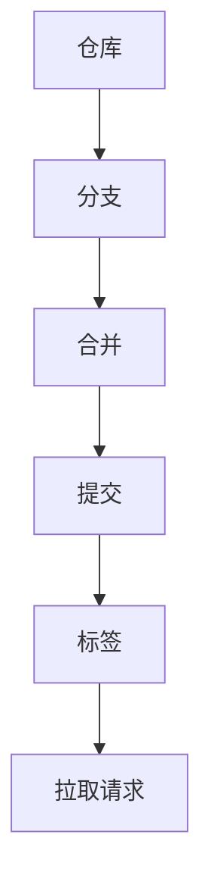
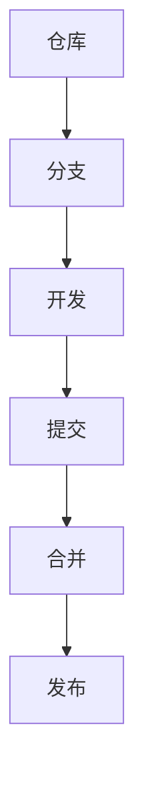

                 

### 《代码版本控制策略：分支管理与协作模式》

在软件开发和项目管理中，代码版本控制是一项至关重要的任务。它不仅确保了代码的完整性、一致性和可追溯性，还提高了团队协作的效率和代码质量。本文将深入探讨代码版本控制策略，特别是分支管理与协作模式，旨在为开发者和管理者提供一套科学、高效的解决方案。

本文将围绕以下几个核心关键词展开：版本控制、分支管理、协作模式、代码质量、团队协作。

### 摘要

本文旨在为软件开发团队提供一个全面、系统的代码版本控制策略。通过介绍版本控制的基本概念、分支管理的策略与实践、协作模式及其实现，本文帮助开发者理解如何高效地管理代码，提高团队协作效率，最终实现代码质量的全面提升。

## 文章目录

1. **背景介绍**  
    - 版本控制的历史与发展  
    - 版本控制的重要性

2. **核心概念与联系**  
    - 核心概念介绍  
    - 流程图展示

3. **分支管理策略**  
    - 分支管理的重要性  
    - 常见的分支管理策略

4. **协作模式**  
    - 协作模式概述  
    - 同步协作与异步协作

5. **实战技巧**  
    - 分支管理的具体操作  
    - 协作模式的实践

6. **高级策略**  
    - 分支管理的优化  
    - 协作模式的改进

7. **版本控制的策略调整**  
    - 策略调整方法  
    - 策略评估与持续改进

8. **项目实战**  
    - 开发环境搭建  
    - 源代码实现与解读

9. **最佳实践 tips**  
    - 小结与注意事项

10. **拓展阅读**  
    - 相关资源与进一步学习

## 背景介绍

### 版本控制的历史与发展

版本控制（Version Control）是一种管理软件开发过程中代码和文件变化的技术。它的起源可以追溯到20世纪60年代，当时软件开发者开始意识到保存和追踪代码变化的重要性。最早的版本控制系统是基于文件系统的，例如20世纪60年代末的Unix系统的`rcs`（Source Code Control System）。

随着软件开发复杂性的增加，集中式版本控制系统（如CVS和Subversion）在20世纪90年代逐渐流行。这类系统将所有代码集中存储在一个中央仓库中，开发者通过检查（check out）和提交（commit）操作来管理代码变化。

21世纪初，分布式版本控制系统（如Git和Mercurial）的兴起，带来了版本控制的新革命。分布式系统允许多个仓库同时存在，开发者可以在本地进行代码的修改和合并，提高了协作效率和分布式工作的能力。

### 版本控制的重要性

版本控制在软件开发中扮演着至关重要的角色。以下是几个关键方面：

- **代码追踪与审计**：版本控制系统提供了对代码变化的详细记录，包括谁在何时进行了哪些修改。这使得追踪问题、审计代码变得非常简单。
- **代码一致性**：通过版本控制，开发团队可以确保不同分支上的代码保持一致性。这在多个开发者同时工作的大型项目中尤为重要。
- **故障恢复**：版本控制系统允许开发团队回退到先前的代码版本，从而在遇到问题时快速恢复。
- **协作效率**：通过良好的分支管理和协作模式，版本控制系统能够提高团队协作的效率，减少冲突和重复工作。

### 核心概念与联系

在深入探讨分支管理和协作模式之前，我们需要了解一些版本控制的核心概念。以下是这些概念以及它们之间的联系：

1. **仓库（Repository）**：仓库是存储代码和文件的中央位置。在分布式版本控制系统中，每个开发者都有自己的本地仓库，但它们与远程仓库保持同步。

2. **分支（Branch）**：分支是代码的独立副本，用于开发新功能或修复问题。通过创建分支，开发团队可以将代码分离，从而避免对主线代码的影响。

3. **合并（Merge）**：合并是将两个或多个分支的更改合并到一个分支上的过程。在合并过程中，可能需要解决冲突（Conflicts），即当两个分支上对同一文件的修改发生冲突时，系统无法自动决定哪个修改是正确的。

4. **标签（Tag）**：标签用于标记特定的代码版本，通常用于发布新版本或标记重要的里程碑。

5. **提交（Commit）**：提交是将代码更改保存到仓库的过程。每次提交都会生成一个提交记录，包括更改的详细信息。

6. **拉取请求（Pull Request）**：拉取请求是用于合并两个分支的一种协作工具。开发者可以通过拉取请求提出修改建议，并与其他开发者讨论和审查。

以下是这些核心概念之间的关系架构 Mermaid 流程图：



### 核心概念与联系

为了更好地理解版本控制的核心概念，我们可以通过一个简化的 Mermaid 流程图来展示它们之间的关系：



- **仓库（Repository）**：这是存储所有代码文件的地方，类似于一个中央存储库。在 Git 中，仓库可以是本地的也可以是远程的（如 GitHub、GitLab 等）。
- **分支（Branch）**：分支用于创建独立的代码线，通常在每个新功能或修复的开发过程中使用。它允许开发者在隔离的环境中工作，而不影响主分支。
- **开发（Development）**：开发者在分支上进行代码编写和测试，确保新的功能或修复能够正常工作。
- **提交（Commit）**：每次开发者完成一段代码修改，都会将更改提交到分支上。提交是一个非常重要的步骤，因为它记录了代码的更改历史。
- **合并（Merge）**：当开发完成并测试无误后，开发者的分支需要与主分支合并，以将更改应用到主线上。合并过程中可能会出现冲突，需要人工解决。
- **发布（Release）**：最终，合并后的代码会发布到一个稳定的版本，例如主分支上的新版本或特定的标签。

通过这个流程图，我们可以清晰地看到各个概念之间的逻辑关系，以及它们在代码开发、管理和发布过程中的作用。

### 分支管理策略

#### 分支管理的重要性

分支管理是版本控制系统的核心功能之一，它直接影响代码的质量和团队协作的效率。一个良好的分支管理策略能够：

- **提高代码质量**：通过隔离开发环境，分支管理可以避免未经测试的代码直接影响主线，从而减少代码缺陷和回归问题的发生。
- **加速迭代速度**：分支管理允许多个开发者同时工作，每个开发者都可以在自己的分支上开发新功能或修复问题，而不必等待其他人的工作完成。
- **简化合并过程**：通过合理的分支策略，可以减少合并冲突的发生，简化合并过程，提高团队协作效率。

#### 常见的分支管理策略

在软件开发中，有多种常见的分支管理策略，每种策略都有其特定的使用场景和优势。以下是几种常用的分支管理策略：

1. **Git Flow**

Git Flow 是一种广泛应用于大型项目的分支管理策略，它定义了一套标准化的分支和工作流程。Git Flow 包括以下几种分支：

- **主分支（Master）**：主分支包含生产的代码，所有正式发布的版本都会从这里发布。
- **开发分支（Develop）**：开发分支是主分支的辅助分支，用于集成新的功能、修复和其他更改。开发者在开发新功能时，通常会从开发分支创建新的功能分支。
- **功能分支（Feature）**：功能分支用于开发特定的功能，每个功能分支都应该有其独特的名字（如`feature-new-login`）。开发者可以在功能分支上编写、测试和调试代码，完成后将其合并回开发分支。
- **发布分支（Release）**：发布分支是在准备发布新版本时创建的，用于修复发布前的最后问题。发布分支从开发分支创建，并在发布前进行最后的测试和调整。一旦发布完成，发布分支会被合并回主分支和开发分支。
- **热点分支（Hotfix）**：热点分支用于修复生产环境中的紧急问题。热点分支从主分支创建，修复完成后会合并回主分支和开发分支。

Git Flow 的优点是结构清晰、易于理解，适合大型项目和复杂的功能开发。然而，其缺点是流程较为复杂，可能不适合小型项目或快速迭代的项目。

2. **GitHub Flow**

GitHub Flow 是一种更加简单的分支管理策略，特别适用于小型项目和敏捷开发环境。GitHub Flow 包括以下几种分支：

- **主分支（Master）**：主分支是生产的代码，所有正式发布的版本都会从这里发布。
- **功能分支（Feature）**：功能分支用于开发新的功能，每个功能分支都应该有其独特的名字（如`feature-add-shopping-cart`）。开发者可以在功能分支上编写、测试和调试代码，完成后通过拉取请求将其合并回主分支。
- **热点分支（Hotfix）**：热点分支用于修复生产环境中的紧急问题。热点分支从主分支创建，修复完成后会合并回主分支。

GitHub Flow 的优点是流程简单、灵活，易于实施。它特别适用于小型项目、敏捷团队和快速迭代的环境。然而，由于缺乏正式的发布分支，GitHub Flow 可能不适合需要严格版本控制的大型项目。

3. **Forking Workflow**

Forking Workflow 是 GitHub 和 GitLab 等平台特有的分支管理策略，它基于用户可以轻松创建和维护自己的仓库副本（Fork）。Forking Workflow 包括以下几种分支：

- **主分支（Master）**：主分支是公共仓库的生产代码。
- **功能分支（Feature）**：功能分支用于开发新的功能，开发者可以在自己的 Fork 上创建功能分支并进行开发，完成后通过拉取请求将其合并回主仓库。
- **热点分支（Hotfix）**：热点分支用于修复生产环境中的紧急问题，开发者可以在自己的 Fork 上创建热点分支并进行修复，完成后通过拉请请求将其合并回主仓库。

Forking Workflow 的优点是简化了仓库的管理和协作过程，特别适用于开源项目和分布式团队。然而，由于其依赖于外部平台，可能在某些情况下受到限制。

#### 分支管理的最佳实践

为了确保分支管理的高效和可控，以下是一些最佳实践：

- **命名约定**：为分支使用清晰的命名约定，如使用功能名或修复编号，以便于识别和管理。
- **代码质量**：在功能分支上严格遵循代码规范和测试用例，确保代码质量。
- **定期合并**：定期将功能分支合并回开发分支，以减少合并冲突和潜在的代码冲突。
- **自动化测试**：在合并过程中运行自动化测试，以确保合并后的代码仍然符合预期。
- **文档记录**：为每个分支和合并请求编写详细的说明，记录开发过程和变更内容。
- **代码审查**：在合并前进行代码审查，确保代码质量和一致性。

通过遵循这些最佳实践，开发团队能够更有效地管理代码分支，提高协作效率和代码质量。

### 协作模式

#### 协作模式概述

协作模式在软件开发中起着至关重要的作用，它决定了团队成员如何共同工作，以确保项目的顺利推进和高质量交付。协作模式可以分为以下几类：

1. **同步协作**：同步协作是指团队成员在同一时间段内共同工作，通常通过即时通讯工具（如 Slack、WhatsApp）或视频会议（如 Zoom、Microsoft Teams）进行沟通。同步协作的优点是沟通效率高，可以快速解决问题，但缺点是可能会影响团队成员的个人时间，并且需要协调工作日程。

2. **异步协作**：异步协作是指团队成员在不同时间工作，通过电子邮件、任务管理工具（如 Jira、Trello）和文档共享平台（如 Google Docs、Notion）进行沟通和协作。异步协作的优点是灵活性强，团队成员可以在自己的时间进行工作，但缺点是沟通效率相对较低，可能会延迟问题解决。

3. **混合协作**：混合协作结合了同步协作和异步协作的优点，团队成员在需要实时沟通和协作时进行同步工作，而在不需要即时响应的情况下进行异步工作。这种模式适用于大型团队或跨国团队，可以在确保高效沟通的同时，兼顾团队成员的个人时间。

#### 同步协作与异步协作

1. **同步协作**

同步协作适用于需要实时沟通和协作的场景，例如：

- **紧急问题解决**：在遇到紧急问题时，团队成员需要立即讨论解决方案，以确保问题得到及时解决。
- **项目会议**：在项目启动或关键阶段，团队成员需要定期召开会议，讨论项目进展、任务分配和协作计划。

同步协作的优点包括：

- **沟通效率高**：团队成员可以实时沟通，快速解决问题。
- **协作性强**：团队成员可以同时工作，共同推进项目。

缺点包括：

- **影响个人时间**：团队成员可能需要随时在线，影响个人生活和休息时间。
- **工作日程协调**：需要协调团队成员的工作时间，可能需要提前安排会议和活动。

2. **异步协作**

异步协作适用于团队成员在不同地理位置或时间工作的情况，例如：

- **远程工作**：团队成员分布在不同的城市或国家，无法进行实时沟通。
- **独立任务**：某些任务可以独立完成，无需实时沟通。

异步协作的优点包括：

- **灵活性高**：团队成员可以在自己的时间进行工作，无需受限于工作时间。
- **工作效率**：可以更专注地完成特定任务，减少干扰。

缺点包括：

- **沟通效率低**：团队成员之间的沟通可能延迟，需要依赖电子邮件和任务管理工具。
- **协作性弱**：团队成员可能缺乏实时反馈，导致协作效率下降。

3. **混合协作**

混合协作结合了同步协作和异步协作的优点，适用于以下场景：

- **项目开发**：在项目初期和关键阶段，团队需要同步协作以确保项目顺利进行；在任务完成后，团队可以异步协作进行代码审查和任务分配。
- **团队沟通**：在需要实时沟通和协作的场合，团队进行同步工作；在其他时间，团队通过异步方式沟通和协作。

混合协作的优点包括：

- **高效沟通**：团队成员可以实时沟通和协作，提高问题解决效率。
- **灵活工作**：团队成员可以在自己的时间进行工作，提高工作效率。

缺点包括：

- **工作流程复杂**：需要协调同步和异步工作流程，可能增加管理难度。

#### 协作模式的选型

选择合适的协作模式取决于项目的需求和团队的特点。以下是一些选型建议：

1. **小型项目或团队**：适合采用异步协作模式，因为团队成员相对较少，可以灵活安排工作时间。

2. **大型项目或团队**：适合采用混合协作模式，通过同步协作确保项目关键阶段的沟通和协作，同时通过异步协作提高工作效率。

3. **远程团队**：适合采用异步协作模式，因为团队成员分布在不同的地理位置，无法进行实时沟通。

4. **敏捷开发团队**：适合采用同步协作和异步协作结合的混合协作模式，确保快速响应和高效协作。

通过合理选择协作模式，开发团队能够更好地协同工作，提高项目质量和效率。

### 实战技巧

#### 分支管理的具体操作

在版本控制系统中，分支管理是一项基本且重要的操作。以下将详细描述创建、合并分支以及解决分支冲突的具体步骤。

##### 创建分支

1. **在 Git 中创建分支**

   在 Git 中，创建一个新分支非常简单。以下是一个示例命令：

   ```bash
   git checkout -b feature-new-login
   ```

   这条命令会创建一个名为 `feature-new-login` 的新分支，并切换到该分支。

2. **在 GitLab 中创建分支**

   在 GitLab 的 Web 界面中，可以轻松创建分支。以下步骤：

   - 进入项目仓库。
   - 点击 “Branches” 标签。
   - 点击 “New Branch” 按钮。
   - 在弹出的对话框中填写分支名称和描述，然后点击 “Create Branch”。

##### 合并分支

1. **在 Git 中合并分支**

   合并分支是将一个分支的更改应用到另一个分支的过程。以下是一个示例命令：

   ```bash
   git merge feature-new-login
   ```

   这条命令会将 `feature-new-login` 分支的更改合并到当前分支（例如主分支 `master` 或开发分支 `develop`）。

2. **在 GitLab 中合并分支**

   在 GitLab 的 Web 界面中，可以通过以下步骤合并分支：

   - 进入项目仓库。
   - 点击 “Branches” 标签。
   - 选择要合并的分支。
   - 点击 “Merge” 按钮。
   - 在弹出的对话框中指定要合并到哪个分支，并解决任何合并冲突。
   - 提交合并请求。

##### 解决分支冲突

分支冲突通常发生在两个或多个分支对同一文件的修改发生冲突时。以下是如何解决分支冲突的步骤：

1. **检测冲突**

   在合并分支之前，Git 会检测冲突并给出提示。以下是一个示例命令：

   ```bash
   git status
   ```

   如果检测到冲突，该命令会显示冲突文件。

2. **手动解决冲突**

   - 打开冲突文件，Git 会用特殊标记（如 `<<<<<<<`、`=======` 和 `>>>>>>>`）标识冲突区域。
   - 手动编辑冲突文件，选择或合并不同的更改。
   - 保存并关闭文件。

3. **标记冲突已解决**

   - 编辑完成后，标记冲突已解决。以下是一个示例命令：

     ```bash
     git add <文件路径>
     ```

   - 提交解决后的更改。以下是一个示例命令：

     ```bash
     git commit -m "解决分支冲突"
     ```

##### 分支的维护与删除

1. **分支维护**

   - 定期检查并更新分支上的代码，确保与主分支保持同步。
   - 在开发完成后，删除不再需要的分支。

2. **分支删除**

   - 在 Git 中删除分支。以下是一个示例命令：

     ```bash
     git branch -d feature-new-login
     ```

   - 在 GitLab 中删除分支。以下步骤：

     - 进入项目仓库。
     - 选择要删除的分支。
     - 点击 “Delete Branch” 按钮。
     - 在弹出的对话框中确认删除。

通过遵循上述步骤，开发团队能够高效地管理分支，确保代码的整洁和协作的顺畅。

#### 协作模式的实践

在实际项目中，协作模式的选择和实施对团队效率和项目成功至关重要。以下通过同步协作和异步协作的实际案例，详细说明如何在不同场景下高效运用协作模式。

##### 同步协作的实际案例

**项目名称**：在线教育平台开发

**背景**：一个在线教育平台项目由一个位于中国的开发团队和一个位于美国的业务团队共同开发。由于团队成员分布在不同的时区，如何保持高效沟通和协作成为一大挑战。

**解决方案**：

1. **每日站立会议**：

   - 每天早上9点（北京时间）和下午3点（北京时间）分别举行两次站立会议。每个会议持续15分钟，用于讨论项目进展、问题和任务分配。
   - 通过视频会议工具（如 Zoom）进行实时沟通，确保团队成员能够面对面交流。

2. **即时通讯工具**：

   - 使用即时通讯工具（如 Slack）建立项目专用频道，团队成员可以在频道中分享信息、讨论问题和发送提醒。
   - 通过设定关键词提醒，当有人提到关键问题时，其他团队成员会收到提醒，确保问题得到及时解决。

3. **项目任务管理**：

   - 使用任务管理工具（如 Jira）对任务进行分配和跟踪，确保每个任务都有明确的负责人和截止日期。
   - 通过任务进度报告，团队成员可以随时了解项目的进展情况。

**效果**：

- 通过每天两次的站立会议，团队成员能够保持紧密的沟通，及时解决问题。
- 即时通讯工具和任务管理工具的使用，确保信息传递的及时性和任务跟踪的准确性。

##### 异步协作的实际案例

**项目名称**：移动应用开发

**背景**：一个移动应用项目由一个分布式团队完成，团队成员分布在不同的城市和国家。由于时区差异，无法进行实时沟通，因此采用异步协作模式。

**解决方案**：

1. **文档和代码共享**：

   - 使用文档共享平台（如 Confluence）记录项目需求、设计和用户故事，确保所有团队成员都能够访问和了解项目细节。
   - 使用代码托管平台（如 GitHub）进行代码管理和协作，团队成员可以在各自的时间进行代码编写和提交。

2. **自动化测试和持续集成**：

   - 实施自动化测试，确保每次提交的代码都经过严格测试，避免引入新问题。
   - 使用持续集成工具（如 Jenkins）实现自动化构建和部署，确保代码质量。

3. **定期代码审查**：

   - 每周安排一次代码审查会议，团队成员轮流审查彼此的代码，确保代码质量和一致性。
   - 通过代码审查，及时发现和解决问题，提高代码质量。

**效果**：

- 通过文档和代码共享平台，团队成员能够在不同时间访问和了解项目信息，确保信息透明。
- 自动化测试和持续集成工具的使用，提高了代码质量和开发效率。
- 定期代码审查，确保代码的稳定性和一致性。

通过这些实际案例，我们可以看到同步协作和异步协作在不同场景下的应用效果。合理选择和实施协作模式，能够显著提高团队协作效率和项目成功率。

### 高级策略

#### 分支管理的优化

在软件开发中，分支管理是确保代码质量和团队协作效率的关键环节。随着项目的复杂度和团队规模的增加，优化分支管理策略显得尤为重要。以下是一些高级策略和工具，用于提升分支管理的效率和灵活性。

##### 高级分支管理策略

1. **并行分支策略**：

   并行分支策略允许同时开发多个功能或修复，每个功能或修复都有自己的分支。这种方法可以并行处理多个任务，提高开发效率。以下是一个典型的并行分支流程：

   ```mermaid
   graph TB
   A[主分支] --> B[开发分支]
   B --> C{功能A}
   B --> D{功能B}
   B --> E{功能C}
   C --> F[提交]
   D --> G[提交]
   E --> H[提交]
   ```

   在这个流程中，主分支 `A` 上的代码是生产就绪的，开发分支 `B` 用于集成所有功能分支。每个功能分支（如 `C`、`D`、`E`）独立开发，完成后合并回开发分支 `B`。

2. **特性旗帜（Feature Flags）**：

   特性旗帜是一种动态控制代码发布的方法，允许在代码上线前控制特定功能的启用或禁用。这种方法可以避免在发布新功能时遇到不可预见的问题。以下是一个使用特性旗帜的示例：

   ```mermaid
   graph TB
   A[主分支] --> B[开发分支]
   B --> C{功能A（特性旗帜控制）}
   B --> D[提交]
   C --> E[特性旗帜：开启]
   C --> F[特性旗帜：禁用]
   ```

   在这个示例中，功能 `A` 可以通过特性旗帜开启或禁用。如果功能存在问题，可以在不影响用户的情况下禁用，从而减少风险。

3. **分支策略模板**：

   为了提高分支管理的标准化和一致性，团队可以创建分支策略模板。这些模板定义了分支的创建、合并和删除规则，确保每个分支都按照统一的标准进行管理。

##### 分支管理的自动化

1. **自动化分支创建**：

   自动化分支创建可以通过持续集成（CI）工具实现。在每次新的拉取请求或合并请求创建时，自动为开发者创建功能分支或发布分支。

2. **自动化分支合并**：

   自动化分支合并可以通过 CI/CD 工具实现。在满足特定条件（如通过所有测试、代码质量符合要求）时，自动将功能分支合并回主分支或开发分支。

3. **自动化分支清理**：

   自动化分支清理可以定期删除无用的分支，确保仓库整洁，减少存储占用。可以使用 CI/CD 工具定期运行清理脚本，删除已合并或过期的分支。

##### 分支管理的监控与审计

1. **分支状态监控**：

   使用监控工具（如 Prometheus、Grafana）对分支状态进行监控，包括分支的创建时间、最后提交时间、合并状态等。通过实时监控，团队可以及时发现和解决问题。

2. **分支审计**：

   定期对分支进行审计，确保分支的创建、合并和删除符合团队的分支策略。审计可以包括分支使用情况分析、代码质量评估、安全漏洞扫描等。

3. **分支安全检查**：

   使用自动化工具（如 CodeQL、SonarQube）对分支上的代码进行安全检查，确保代码符合安全标准。在分支合并前，自动检测潜在的安全问题，防止风险代码进入主分支。

通过实施这些高级策略和工具，开发团队能够更有效地管理分支，提高代码质量和团队协作效率。这不仅减少了冲突和重复工作，还提高了项目的可维护性和可扩展性。

#### 协作模式的改进

在软件开发过程中，协作模式的有效性直接影响团队的工作效率和项目的成功。随着技术的发展和团队规模的扩大，传统的协作模式可能无法满足新的需求，因此改进协作模式变得尤为重要。以下将介绍几种改进协作模式的策略和方法。

##### 协作流程的优化

1. **敏捷开发**：

   敏捷开发是一种以人为核心、迭代和反馈为基础的软件开发方法。通过缩短开发周期、增加反馈次数，敏捷开发能够更快地适应变化，提高项目的灵活性和响应能力。以下是一个简化的敏捷开发流程：

   - **迭代规划会议**：在每个迭代周期开始时，团队讨论并确定下一个迭代的目标和任务。
   - **每日站立会议**：团队成员每天早上举行短暂的站立会议，讨论进度和问题。
   - **迭代评审会议**：在每个迭代周期结束时，团队进行评审，展示成果，收集反馈，并规划下一个迭代。

2. **看板（Kanban）**：

   看板是一种基于可视化管理的协作方法，通过看板（通常是一个可视化图表）展示任务的状态和进度。看板可以帮助团队识别瓶颈、优化流程，从而提高工作效率。以下是一个简化的看板流程：

   - **任务创建**：在任务看板上创建新的任务。
   - **任务分配**：将任务分配给团队成员。
   - **任务状态更新**：根据任务进度，在任务看板上更新任务状态（如待办、进行中、已完成）。
   - **瓶颈识别**：通过分析任务的状态变化，识别并解决流程中的瓶颈。

##### 协作工具的选型与使用

1. **选择合适的工具**：

   - **沟通工具**：选择能够满足团队需求的即时通讯工具（如 Slack、WhatsApp）和视频会议工具（如 Zoom、Microsoft Teams）。对于远程团队，Zoom 和 Microsoft Teams 等工具提供高效的实时沟通。
   - **项目管理工具**：选择能够支持团队协作的项目管理工具（如 Jira、Trello、Asana）。这些工具可以帮助团队跟踪任务、分配责任，并确保项目按计划进行。
   - **文档共享和协作工具**：选择支持实时编辑和协作的文档共享工具（如 Google Docs、Notion）。这些工具可以方便团队成员共同编辑文档，提高协作效率。

2. **工具集成与自动化**：

   - **集成工具**：将不同工具集成在一起，实现数据共享和流程自动化。例如，将项目管理工具与版本控制系统集成，实现任务的自动化分配和更新。
   - **自动化流程**：通过自动化工具（如 Zapier、Integromat）实现不同工具之间的自动化操作。例如，当新的代码提交时，自动在项目管理工具中创建相应的任务。

##### 协作模式的改进策略

1. **定期回顾和调整**：

   定期回顾协作模式的效果，识别存在的问题和改进的机会。通过团队讨论和反馈，调整协作模式，使其更适应团队的需求和项目的变化。

2. **培训与指导**：

   提供协作工具和流程的培训，确保团队成员能够熟练使用相关工具，并理解协作模式的原则和流程。通过指导和辅导，帮助团队成员更好地融入协作模式。

3. **建立协作文化**：

   建立开放、透明和互助的协作文化，鼓励团队成员积极参与协作，并提出改进建议。通过定期的团队建设活动，增强团队成员之间的信任和合作。

通过实施这些改进策略，开发团队能够更好地适应变化，提高协作效率，确保项目按时、按质完成。

#### 版本控制的策略调整

随着项目的发展和技术进步，版本控制的策略也需要不断调整和优化。以下将介绍版本控制策略的调整方法、评估策略和持续改进的重要性。

##### 版本控制策略的调整方法

1. **定期评估**：

   定期对版本控制策略进行评估，以确定其是否仍然适合当前的项目需求。评估应包括以下几个方面：

   - **团队规模和结构**：如果团队规模发生变化，版本控制策略可能需要调整，以适应新的组织结构。
   - **项目复杂性**：随着项目复杂度的增加，可能需要引入更复杂的分支管理策略和协作模式。
   - **开发流程**：如果开发流程发生变化，例如从瀑布模型转向敏捷开发，版本控制策略也需要相应调整。

2. **用户反馈**：

   收集团队成员和用户的反馈，了解他们在版本控制过程中遇到的问题和挑战。通过用户反馈，可以发现现有策略中的不足，并提供改进的依据。

3. **工具评估**：

   评估当前使用的版本控制工具是否满足项目需求。如果工具的功能无法满足需求，可能需要考虑更换或升级。

4. **最佳实践**：

   参考业界最佳实践，了解其他团队在版本控制方面的成功经验和教训。通过借鉴这些经验，可以改进自身的版本控制策略。

##### 策略评估

1. **有效性评估**：

   评估版本控制策略是否有效，包括以下几个方面：

   - **代码一致性**：策略是否确保了代码的一致性，避免了不必要的冲突和错误。
   - **协作效率**：策略是否提高了团队的协作效率，减少了重复工作和沟通成本。
   - **代码质量**：策略是否促进了代码质量的提升，减少了缺陷和漏洞。
   - **可维护性**：策略是否提高了代码的可维护性，使得代码更容易理解和修改。

2. **适应性评估**：

   评估版本控制策略的适应能力，包括以下几个方面：

   - **变化响应**：策略是否能够快速适应项目需求的变化，例如新增功能、修复问题和优化设计。
   - **团队扩展**：策略是否支持团队规模的扩大，例如通过引入新的团队成员和协作工具。
   - **技术更新**：策略是否能够适应新技术的发展，例如新版本的编程语言、框架和工具。

##### 持续改进

持续改进是版本控制策略成功的关键。以下是一些建议：

1. **定期回顾和调整**：

   定期回顾版本控制策略的效果，并根据评估结果进行调整。这可以确保策略始终与项目需求保持一致。

2. **培训与指导**：

   为团队成员提供版本控制培训，确保他们熟练掌握相关工具和策略。通过定期指导和辅导，帮助团队成员更好地理解和应用版本控制策略。

3. **自动化与工具优化**：

   利用自动化工具和优化技术，提高版本控制的效率。例如，通过脚本和持续集成工具，实现分支管理和协作的自动化。

4. **团队协作**：

   建立开放和协作的团队文化，鼓励团队成员分享经验和建议，共同改进版本控制策略。通过定期的团队讨论和反馈，确保策略不断优化。

通过不断调整和优化版本控制策略，开发团队能够更高效地管理代码，提高协作效率和代码质量，从而确保项目的成功。

### 项目实战

#### 开发环境搭建

在开始任何项目之前，搭建一个稳定和高效的开发环境是至关重要的。以下是使用 Git 和 GitHub 搭建开发环境的步骤。

##### 环境要求

- 操作系统：Windows、macOS 或 Linux
- 编程语言：Python、Java、JavaScript 等
- 版本控制工具：Git
- 集成开发环境（IDE）：PyCharm、IntelliJ IDEA、VS Code 等（可选）

##### 安装 Git

1. **Windows**：

   - 访问 [Git 官网](https://git-scm.com/)，下载并安装 Git。
   - 安装过程中，确保勾选 “Use Git from Windows Command Prompt”。
   - 安装完成后，打开命令提示符，输入以下命令以验证安装：

     ```bash
     git --version
     ```

2. **macOS**：

   - 使用 Homebrew 安装 Git：

     ```bash
     brew install git
     ```

   - 安装完成后，打开终端，输入以下命令以验证安装：

     ```bash
     git --version
     ```

3. **Linux**：

   - 使用包管理器安装 Git。例如，在 Ubuntu 上：

     ```bash
     sudo apt-get install git
     ```

   - 安装完成后，打开终端，输入以下命令以验证安装：

     ```bash
     git --version
     ```

##### 安装 GitHub CLI

GitHub CLI 是一个命令行工具，用于与 GitHub 进行交互。以下是如何安装 GitHub CLI 的步骤：

1. **Windows**：

   - 访问 [GitHub CLI 官网](https://cli.github.com/)，下载并安装 GitHub CLI。
   - 安装完成后，打开命令提示符，输入以下命令以验证安装：

     ```bash
     gh --version
     ```

2. **macOS**：

   - 使用 Homebrew 安装 GitHub CLI：

     ```bash
     brew install github-cli
     ```

   - 安装完成后，打开终端，输入以下命令以验证安装：

     ```bash
     gh --version
     ```

3. **Linux**：

   - 使用包管理器安装 GitHub CLI。例如，在 Ubuntu 上：

     ```bash
     sudo apt-get install gh
     ```

   - 安装完成后，打开终端，输入以下命令以验证安装：

     ```bash
     gh --version
     ```

##### 配置 Git 和 GitHub CLI

1. **配置 Git**：

   - 打开命令提示符或终端，输入以下命令配置 Git：

     ```bash
     git config --global user.name "Your Name"
     git config --global user.email "yourname@example.com"
     ```

     这将设置 Git 的用户名和电子邮件地址。

2. **配置 GitHub CLI**：

   - 使用以下命令登录 GitHub CLI：

     ```bash
     gh auth login
     ```

   - 在浏览器中打开 GitHub CLI 登录页面，授权 CLI 访问你的 GitHub 账户。

##### 创建本地仓库

1. **初始化本地仓库**：

   - 创建一个新文件夹，打开终端并进入该文件夹：

     ```bash
     mkdir my-project
     cd my-project
     ```

   - 初始化一个本地仓库：

     ```bash
     git init
     ```

2. **将本地仓库上传到 GitHub**：

   - 在 GitHub 上创建一个新仓库。

   - 打开终端，将本地仓库上传到 GitHub：

     ```bash
     git remote add origin https://github.com/yourusername/my-project.git
     git push -u origin master
     ```

#### 源代码实现与解读

在搭建好开发环境后，我们需要创建一个简单的 Python 项目，并通过 Git 进行版本控制。以下是一个简单的 Python Web 服务器实现，以及详细的 Git 操作步骤。

##### 源代码实现

首先，创建一个名为 `web_server.py` 的 Python 文件，并添加以下代码：

```python
import socket

def handle_request(client_socket):
    request = client_socket.recv(1024).decode()
    response = "HTTP/1.1 200 OK\nContent-Type: text/html\n\nHello, World!"
    client_socket.send(response.encode())

def main():
    server_socket = socket.socket(socket.AF_INET, socket.SOCK_STREAM)
    server_socket.bind(('0.0.0.0', 8080))
    server_socket.listen(5)
    
    print("Server started on port 8080...")
    
    while True:
        client_socket, client_address = server_socket.accept()
        handle_request(client_socket)
        client_socket.close()

if __name__ == '__main__':
    main()
```

这个简单的 Web 服务器会监听端口 8080，接收并响应 HTTP 请求。

##### Git 操作步骤

1. **添加文件到仓库**：

   ```bash
   git init
   touch README.md
   git add README.md web_server.py
   git commit -m "Initial commit"
   ```

   这条命令将 `README.md` 和 `web_server.py` 文件添加到仓库，并提交初始版本。

2. **创建新分支**：

   ```bash
   git checkout -b feature-add-routing
   ```

   创建一个新分支 `feature-add-routing` 用于开发新增路由功能。

3. **修改代码并提交**：

   ```bash
   nano web_server.py
   # 在代码中添加路由处理逻辑
   git add web_server.py
   git commit -m "Add routing logic"
   ```

   在 `web_server.py` 文件中添加路由处理逻辑，并提交更改。

4. **合并分支**：

   ```bash
   git checkout master
   git merge feature-add-routing
   git push
   ```

   将 `feature-add-routing` 分支合并回主分支，并推送更改到 GitHub。

5. **解决合并冲突**：

   如果出现合并冲突，手动编辑冲突文件，然后继续合并和推送。

##### 代码应用解读与分析

通过以上步骤，我们实现了简单的 Python Web 服务器，并使用 Git 进行版本控制。以下是代码的解读与分析：

- **`web_server.py` 文件**：

  ```python
  import socket

  def handle_request(client_socket):
      request = client_socket.recv(1024).decode()
      response = "HTTP/1.1 200 OK\nContent-Type: text/html\n\nHello, World!"
      client_socket.send(response.encode())

  def main():
      server_socket = socket.socket(socket.AF_INET, socket.SOCK_STREAM)
      server_socket.bind(('0.0.0.0', 8080))
      server_socket.listen(5)
      
      print("Server started on port 8080...")
      
      while True:
          client_socket, client_address = server_socket.accept()
          handle_request(client_socket)
          client_socket.close()

  if __name__ == '__main__':
      main()
  ```

  - `handle_request` 函数接收客户端的 HTTP 请求，并返回一个简单的 HTTP 响应。
  - `main` 函数创建一个基于 TCP 的 Web 服务器，监听端口 8080，并接受客户端连接。

通过 Git 进行版本控制，我们可以轻松地管理代码更改、分支合并和发布版本。在实际项目中，这样的流程可以帮助团队协作、跟踪代码变更和确保代码质量。

##### 实际案例分析与详细讲解剖析

为了更好地理解如何在实际项目中应用版本控制策略，以下将分析一个实际案例，并详细讲解其剖析过程。

**案例背景**：一个电商网站项目，由多个开发团队共同完成。项目需求不断变化，且涉及多个功能模块。

**分析步骤**：

1. **需求分析**：

   - 项目经理从客户和产品经理处获取需求，并将其分解为多个子任务。
   - 开发团队根据需求创建相应的功能分支，例如 `feature-product-listing`、`feature-shopping-cart` 等。

2. **开发与协作**：

   - 各开发团队在自己的功能分支上开发代码，并通过 Git 进行版本控制。
   - 每个开发团队定期合并代码到开发分支，以确保代码的一致性。

3. **代码审查**：

   - 在每个功能分支合并回开发分支前，进行代码审查，确保代码质量。
   - 使用 Git 的 `git review` 命令或集成代码审查工具（如 GitLab 的 Merge Request），进行详细的代码审查。

4. **集成与测试**：

   - 开发分支上的代码经过审查后，合并到主分支。
   - 通过持续集成（CI）工具，自动运行测试用例，确保代码质量。
   - 发现问题及时回退或修复，并重新提交和测试。

5. **部署与发布**：

   - 合格的代码通过 CI/CD 流程自动部署到生产环境。
   - 部署前进行最终测试，确保部署过程顺利。
   - 部署后收集用户反馈，为后续改进提供依据。

**案例剖析**：

- **分支管理**：通过创建功能分支，每个团队可以独立开发功能模块，避免了代码冲突和依赖问题。
- **代码审查**：代码审查确保了代码质量和一致性，减少了潜在的问题。
- **自动化测试**：自动化测试确保了代码的可移植性和稳定性，提高了部署成功率。
- **持续集成与部署**：持续集成和部署流程自动化，减少了人工干预，提高了效率。

通过以上分析，我们可以看到，在实际项目中，合理的版本控制策略能够显著提高开发效率和代码质量，确保项目的顺利进行。

##### 项目小结

通过本案例，我们详细介绍了如何搭建开发环境、编写源代码、使用 Git 进行版本控制，并分析了实际项目中的应用和实践。以下是项目小结：

- **开发环境搭建**：确保团队有一个稳定和高效的开发环境，是项目成功的基础。
- **源代码实现**：通过简单的 Python Web 服务器实现，我们了解了基本的代码结构和功能。
- **版本控制策略**：Git 提供了强大的版本控制功能，通过分支管理和协作模式，我们可以高效地管理代码变更。
- **实际案例分析**：通过实际案例，我们了解了如何在复杂项目中应用版本控制策略，确保代码质量和项目进度。

通过不断实践和优化，开发团队能够更好地管理代码，提高协作效率和项目成功率。

### 最佳实践 Tips

在代码版本控制和协作管理中，遵循最佳实践可以提高团队效率，确保项目顺利进行。以下是一些建议和注意事项：

1. **命名约定**：
   - **分支命名**：使用简洁、明确的命名规则，如 `feature/` 开头的功能分支名，如 `feature-add-routing`。
   - **提交信息**：使用描述性强的提交信息，如 `fix: 修复登录页面漏洞`。

2. **代码质量**：
   - **代码审查**：在合并代码前进行严格的代码审查，确保代码质量和一致性。
   - **自动化测试**：编写单元测试和集成测试，确保代码质量。

3. **版本控制工具**：
   - **Git**：熟练使用 Git 的各种命令，如 `git branch`、`git merge`、`git push`。
   - **GitHub/GitLab**：利用这些平台提供的高级功能，如拉取请求、代码仓库和项目板。

4. **协作沟通**：
   - **明确目标**：在开始工作前明确项目目标和任务分配。
   - **实时沟通**：对于紧急问题，使用实时沟通工具（如 Slack、Zoom）进行快速响应。
   - **定期回顾**：定期进行团队回顾，总结经验和改进协作方式。

5. **文档管理**：
   - **详细文档**：编写详尽的文档，包括开发指南、代码注释和用户手册。
   - **版本控制文档**：使用版本控制系统管理文档，确保文档更新与代码同步。

6. **安全性**：
   - **权限管理**：根据团队成员的角色和职责，合理分配权限，确保代码和文档的安全性。
   - **安全审计**：定期进行安全审计，发现并修复潜在的安全漏洞。

通过遵循这些最佳实践，开发团队能够更高效地管理代码，提高协作效率和项目成功率。

### 拓展阅读

为了进一步深入了解代码版本控制策略、分支管理和协作模式，以下是几本推荐的书籍和资源：

1. **《Pro Git》**：
   - 作者：Scott Chacon 和 Ben Straub
   - 简介：这是一本关于 Git 的权威指南，详细介绍了 Git 的基本概念、操作和最佳实践。

2. **《Git 实用教程》**：
   - 作者：周爱民
   - 简介：本书以通俗易懂的语言介绍了 Git 的基本操作，适合初学者快速上手。

3. **《Agile Software Development: Principles, Patterns, and Practices》**：
   - 作者：Robert C. Martin
   - 简介：这本书介绍了敏捷开发的核心理念和最佳实践，对于理解敏捷开发与版本控制的关系有很大帮助。

4. **《GitHub Flow》**：
   - 作者：Rick Olson
   - 简介：本书详细介绍了 GitHub Flow 的分支管理策略，适合使用 GitHub 的开发者。

5. **《Kanban: Successful Knowledge Work with an Agile Framework》**：
   - 作者：David J. Anderson
   - 简介：这本书介绍了看板方法在软件开发中的应用，对于优化协作流程有很高的参考价值。

通过阅读这些书籍，开发者可以更深入地了解版本控制策略和协作模式，提高团队协作效率和项目成功率。同时，GitHub、GitLab 和其他平台提供的官方文档也是宝贵的资源，可以帮助开发者更好地掌握相关工具的使用。

