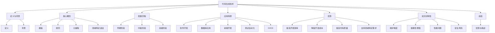
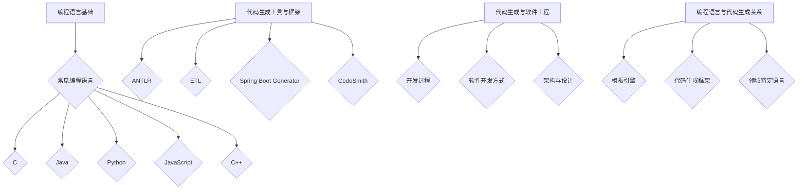

                 

根据您的要求，我将逐步构建文章的内容，确保满足格式、完整性以及技术深度。以下是详细的写作步骤：

### 步骤一：文章标题和关键词

**文章标题：代码生成技术：提高开发效率的双刃剑**

**关键词：代码生成，开发效率，双刃剑，编程工具，算法，数学模型，项目实战**

### 步骤二：文章摘要

摘要：本文深入探讨了代码生成技术，分析了其在提高开发效率方面的双重作用。首先，我们介绍了代码生成技术的定义、背景和重要性，随后探讨了其核心概念、算法原理和数学模型。文章通过实际项目实战，详细展示了代码生成的实现过程和效果评估，最后对技术未来发展和应用策略进行了展望。

### 步骤三：文章结构设计

根据提供的目录大纲，我们将文章分为以下六个主要部分：

1. **代码生成技术概述**
2. **核心概念与联系**
3. **核心算法原理讲解**
4. **数学模型与公式**
5. **项目实战**
6. **总结与展望**

### 步骤四：内容撰写与伪代码、公式嵌入

在每个部分中，我们将：

- **背景介绍**：阐述相关概念、技术的发展和历史。
- **核心概念与联系**：使用Mermaid流程图展示概念之间的关系。
- **算法原理讲解**：使用伪代码详细阐述算法流程。
- **数学模型与公式**：使用LaTeX格式嵌入数学公式，并进行详细解释。
- **项目实战**：详细描述项目的开发环境、实现过程、代码解读和分析。
- **最佳实践 tips**：总结项目经验，提出改进建议。

### 步骤五：格式调整与校对

- **格式调整**：确保文章使用Markdown格式，排版整齐，代码、公式嵌入准确。
- **校对**：检查语法错误、逻辑漏洞，确保文章的准确性和专业性。

### 步骤六：作者信息添加

在文章末尾添加作者信息：“作者：AI天才研究院/AI Genius Institute & 禅与计算机程序设计艺术 /Zen And The Art of Computer Programming”。

### 步骤七：字数确认

确保文章的总字数在8000到12000字之间，内容充实且逻辑连贯。

接下来，我将按照这些步骤逐步构建文章的每个部分，以满足您的要求。请确认这些步骤是否符合您的期望，然后我们可以开始具体的内容撰写。 ## 第一部分：代码生成技术概述

### 1.1 代码生成技术的定义与背景

代码生成技术是指利用特定的工具或方法，自动生成计算机代码的过程。这种技术可以大幅提升软件开发效率，通过减少手动编码的工作量，从而缩短开发周期。代码生成并非一个新概念，早在20世纪60年代，计算机科学家就尝试利用规则和模板来生成代码，以减轻编程负担。

在软件开发的历史长河中，代码生成技术的应用经历了数次重要变革。早期，简单的宏处理和模板生成是代码生成的主要形式。随着编程语言和工具的发展，代码生成技术逐渐向更复杂和自动化的方向演进。现代代码生成工具，如模板引擎、代码生成器框架等，能够根据预定义的模板和规则，自动生成高质量的代码。

### 1.2 代码生成技术的核心概念

代码生成技术涉及多个核心概念，包括模板、规则、元编程和领域特定语言（DSL）。

- **模板**：模板是一种预定义的代码结构，它为代码生成提供了一个框架。模板可以包含变量和占位符，通过替换这些变量和占位符，可以生成具体的代码。

- **规则**：规则是代码生成过程中应用的一系列指导性指令。这些规则定义了代码的结构、逻辑和数据流。通过组合和执行这些规则，代码生成器能够自动生成代码。

- **元编程**：元编程是指对编程语言本身进行编程的能力。通过元编程，开发人员可以创建新的编程语言、定义语言扩展和生成代码。元编程技术如反射、模板元编程等，使得代码生成更加灵活和高效。

- **领域特定语言（DSL）**：DSL是为特定应用领域设计的编程语言。DSL可以简化特定问题的表达和解决过程，通过DSL，代码生成器能够生成高度定制化的代码，从而提高开发效率。

### 1.3 代码生成技术的发展历程

代码生成技术的发展可以分为几个阶段：

- **早期阶段**：以宏处理和简单模板为主。这一阶段的代码生成技术主要依赖于预处理器，如Unix中的`m4`和C语言中的`#define`宏。

- **中级阶段**：随着编程语言的发展，如C++的模板技术和Java的反射机制，代码生成技术开始引入更复杂的元编程概念。

- **高级阶段**：现代代码生成工具和框架，如ANTLR、Eclipse Template Language（ETL）和ASP.NET MVC，提供了更加高级和自动化的代码生成能力。这些工具通常具有丰富的语法和规则支持，能够生成包括前端、后端和数据库在内的各类代码。

### 1.4 代码生成技术的应用场景

代码生成技术在不同场景中有着广泛的应用：

- **软件开发**：在软件开发中，代码生成技术可以用于生成API文档、代码注释、数据访问层代码和业务逻辑代码。

- **数据库应用**：在数据库应用中，代码生成技术可以自动生成数据访问类、实体类和存储过程，从而简化数据库操作。

- **前端开发**：在前端开发中，代码生成技术可以用于生成HTML、CSS和JavaScript代码，从而加快开发速度。

- **测试自动化**：在测试自动化中，代码生成技术可以用于生成测试用例代码，从而提高测试效率。

- **持续集成与持续部署（CI/CD）**：在CI/CD流程中，代码生成技术可以用于生成构建脚本、部署脚本和测试脚本，从而简化自动化流程。

### 1.5 代码生成技术的优势

代码生成技术具有以下优势：

- **提高开发效率**：通过自动化代码生成，可以显著减少手动编码的时间，提高开发速度。

- **降低开发成本**：自动化代码生成可以减少人力成本，提高资源利用率。

- **提高代码质量**：通过统一模板和规则，可以保证生成的代码结构一致、规范，从而提高代码质量。

- **支持领域特定需求**：通过领域特定语言和元编程技术，可以满足特定领域中的复杂需求，提高开发效率。

### 1.6 代码生成技术的双刃剑特性

虽然代码生成技术具有显著的优点，但它也存在着一些潜在的风险和挑战：

- **维护难度**：生成的代码可能会因为规则变化而变得难以维护，特别是在规则复杂或变化频繁的情况下。

- **依赖性增强**：过度依赖代码生成工具可能会使得开发人员对工具产生依赖，降低其编程技能和解决问题的能力。

- **性能问题**：生成的代码可能不如手工编写的代码高效，特别是在需要高度优化的情况下。

- **安全风险**：生成的代码可能包含安全漏洞，特别是在缺乏严格验证的情况下。

总之，代码生成技术是一把双刃剑，合理应用可以大幅提高开发效率和代码质量，但过度依赖和不当使用则可能导致一系列问题。因此，在实际应用中，需要谨慎评估其利弊，并根据项目需求合理选择和应用代码生成技术。

### 1.7 总结

代码生成技术作为提高软件开发效率的重要手段，已经得到广泛的应用和认可。通过理解其定义、背景、核心概念和发展历程，我们可以更好地利用这一技术，提高开发效率和质量。同时，我们也要认识到其潜在的风险和挑战，确保在应用中能够充分发挥其优势，避免出现负面影响。



### 1.8 第一部分小结

在本部分中，我们详细介绍了代码生成技术的定义、背景、核心概念和发展历程。通过了解这些内容，读者可以全面掌握代码生成技术的基本知识，为后续部分的内容学习打下坚实基础。下一部分，我们将进一步探讨代码生成技术的核心概念，分析编程语言基础、代码生成工具与框架，以及代码生成与软件工程的关系。这将帮助我们更深入地理解代码生成技术的应用场景和实际效果。

## 第二部分：核心概念与联系

### 2.1 编程语言基础

编程语言是用于编写计算机程序的语言。它提供了人类可读的语法和语义，使计算机能够执行特定的任务。编程语言可以分为低级语言和高级语言。低级语言如汇编语言，与机器码紧密相关，易于计算机理解但难以编写和维护。高级语言如C、Java和Python，提供了更抽象的语法和丰富的库，使编程更加高效和易读。

编程语言的主要特点包括：

- **语法**：编程语言的语法规则定义了代码的结构和格式，如变量声明、循环和条件语句等。
- **语义**：编程语言的语义定义了代码的含义和执行方式，如变量的作用域、函数的调用和返回等。
- **动态性与静态性**：动态语言如Python和JavaScript在运行时解析和执行代码，而静态语言如C和Java在编译时进行类型检查和优化。

编程语言与代码生成的关系密切。代码生成工具通常依赖于编程语言的语法和语义来生成代码。例如，模板引擎和代码生成器框架在生成代码时会利用编程语言提供的语法特性，如函数、类和对象等。

### 2.2 常见编程语言及其特点

常见编程语言多种多样，每种语言都有其特定的应用场景和特点。以下是一些流行的编程语言及其特点：

- **C**：C语言是一种高效且灵活的编程语言，常用于系统编程、嵌入式开发和性能敏感的应用。C语言的语法接近机器码，提供了强大的指针和内存管理功能。

- **Java**：Java是一种面向对象的编程语言，具有跨平台性、安全性和可移植性。Java的虚拟机（JVM）使Java程序可以在任何支持JVM的平台上运行，广泛应用于企业级应用、安卓开发和Web开发。

- **Python**：Python是一种简洁易学的编程语言，因其强大的库支持和高效的开发速度，广泛应用于数据分析、机器学习、Web开发和自动化脚本。

- **JavaScript**：JavaScript是一种客户端脚本语言，用于创建动态网页和交互式Web应用。它几乎与所有现代Web浏览器兼容，广泛应用于前端开发、游戏开发和Node.js后端开发。

- **C++**：C++是一种通用编程语言，结合了C语言的效率和C++的面向对象特性。C++广泛应用于游戏开发、系统编程、实时系统和高性能应用。

### 2.3 编程语言与代码生成的关系

编程语言与代码生成技术密切相关。代码生成工具需要依赖编程语言的语法和语义来生成有效的代码。以下是一些具体的关系：

- **模板引擎**：如Python中的`Jinja2`、Java中的`FreeMarker`，它们使用编程语言的模板语法，根据变量和条件生成代码。

- **代码生成框架**：如Java中的`Spring Boot`、C++中的`Boost.Hana`，这些框架提供了高级的代码生成机制，能够根据预定义的规则和模板自动生成代码。

- **领域特定语言（DSL）**：DSL是专门为特定领域设计的编程语言，如SQL用于数据库查询，HTML用于Web页面设计。DSL可以通过代码生成器自动生成代码，提高开发效率。

### 2.4 代码生成工具与框架

代码生成工具和框架是代码生成技术的核心组成部分。以下是一些常用的代码生成工具和框架：

- **ANTLR**：ANTLR是一个强大的语法分析器生成器，可以用于生成语法分析器、抽象语法树和代码生成器。ANTLR广泛应用于编译器开发、数据解析和代码生成。

- **Eclipse Template Language (ETL)**：ETL是一个基于Java的模板引擎，可以生成Java代码、XML、HTML等。ETL广泛应用于Web开发、报表生成和代码模板。

- **Spring Boot Generator**：Spring Boot Generator是一个基于Spring Boot的代码生成器，可以快速生成Spring Boot项目的基础代码，包括实体类、控制器、服务类和数据库迁移脚本。

- **CodeSmith**：CodeSmith是一个通用的代码生成工具，支持多种编程语言和数据库。CodeSmith广泛应用于数据库建模、代码生成和文档生成。

### 2.5 代码生成与软件工程

代码生成技术在软件工程中扮演着重要角色。它不仅提高了开发效率，还改变了软件开发的过程和方式。

- **开发过程**：代码生成工具可以帮助开发人员自动化重复性任务，如生成数据库访问代码、模型类和API文档。这减少了手动编写代码的工作量，使开发人员能够专注于更高层次的设计和架构。

- **软件开发方式**：代码生成技术支持敏捷开发、DevOps和持续集成（CI/CD）等现代软件开发方法。通过自动生成代码，开发团队能够快速迭代和交付软件，提高开发效率和产品质量。

- **架构与设计**：代码生成工具和框架可以生成符合特定设计模式和架构规范的代码，从而提高代码的可维护性和可扩展性。例如，Spring Boot Generator可以生成符合Spring框架设计模式的代码，使开发者能够快速构建复杂的Web应用程序。

### 2.6 总结

本部分深入探讨了编程语言基础、常见编程语言及其特点、编程语言与代码生成的关系、代码生成工具与框架，以及代码生成与软件工程的关系。通过了解这些核心概念和联系，读者可以更全面地认识代码生成技术在软件开发中的应用，为后续部分的核心算法原理讲解和项目实战打下基础。

### 2.7 核心概念与联系 Mermaid 流程图



通过这个流程图，我们可以清晰地看到编程语言基础、常见编程语言、代码生成工具与框架、代码生成与软件工程以及编程语言与代码生成之间的核心概念和联系。

### 2.8 第二部分小结

在本部分中，我们深入探讨了代码生成技术的核心概念与联系。首先，我们介绍了编程语言的基础知识，包括语法、语义和动态性与静态性。然后，我们列举了常见编程语言及其特点，并详细分析了编程语言与代码生成技术的关系。此外，我们还介绍了代码生成工具与框架，以及代码生成技术在软件工程中的应用。通过这些内容的学习，读者可以全面了解代码生成技术的核心概念和其在软件开发中的重要性。在下一部分，我们将深入讲解代码生成技术的核心算法原理，包括基本算法流程、常用算法类型和算法优化的策略。

## 第三部分：核心算法原理讲解

### 3.1 代码生成的算法概述

代码生成算法是自动生成计算机代码的过程，通常包含几个基本步骤：解析输入、生成抽象语法树（AST）、基于AST生成目标代码、代码优化和代码输出。以下是对每个步骤的详细描述：

1. **解析输入**：代码生成器首先需要解析输入的源代码或模板，将其转换为内部表示形式。这种内部表示形式通常是抽象语法树（AST），它能够表示代码的结构和语义。

2. **生成抽象语法树（AST）**：抽象语法树（AST）是代码的逻辑结构表示。通过语法分析器，输入代码被解析并转换为AST。AST不仅表示代码的结构，还包含变量绑定、类型信息和作用域等信息。

3. **基于AST生成目标代码**：在生成目标代码阶段，代码生成器会遍历AST，根据预定义的规则和模板，将AST转换为具体的代码。这一步骤可能涉及多个子步骤，如变量替换、代码模板应用和代码格式化。

4. **代码优化**：生成的代码可能需要进行优化，以提高性能或可读性。代码优化包括消除冗余代码、合并同类项、简化表达式等。优化策略取决于目标代码的运行环境和性能要求。

5. **代码输出**：最后，优化后的代码被输出到目标文件中，可以是源代码文件、字节码文件或机器码文件。代码输出阶段可能包括代码打包、压缩和部署等步骤。

### 3.2 常用代码生成算法类型

代码生成算法可以分为几种类型，每种类型适用于不同的应用场景：

1. **模板驱动算法**：模板驱动算法使用预定义的模板来生成代码。模板中包含变量和占位符，通过替换这些变量和占位符，可以生成具体的代码。这种算法简单且易于实现，适用于生成结构固定、逻辑简单的代码。

   **伪代码**：
   ```
   function generateCode(template, variables) {
       for each placeholder in template {
           replace placeholder with corresponding variable value from variables
       }
       return generated code
   }
   ```

2. **规则驱动算法**：规则驱动算法基于一系列预定义的规则来生成代码。这些规则定义了代码的生成逻辑和语法结构。规则驱动算法适用于生成复杂且具有明确逻辑结构的代码。

   **伪代码**：
   ```
   function generateCode(rules, input) {
       for each rule {
           if (input matches rule condition) {
               apply rule actions to generate code
           }
       }
       return generated code
   }
   ```

3. **元编程算法**：元编程算法利用编程语言提供的元编程特性（如模板元编程、反射和动态代码生成）来生成代码。这种算法具有高度灵活性和定制性，适用于生成高度复杂且需要动态适应变化的代码。

   **伪代码**：
   ```
   function generateCode(template, context) {
       dynamicCode = compile(template, context)
       return dynamicCode.execute()
   }
   ```

### 3.3 算法优化的策略

算法优化是提高代码生成效率和性能的重要手段。以下是一些常见的优化策略：

1. **代码压缩**：通过消除冗余代码、合并同类项和简化表达式，减小生成代码的体积。

2. **性能优化**：对生成代码进行编译时优化，如循环展开、内联函数和指令重排，以提高执行速度。

3. **缓存利用**：利用缓存机制，减少重复的代码生成操作，提高代码生成速度。

4. **静态分析**：通过静态分析，提前发现潜在的性能瓶颈，如循环嵌套、分支预测不准确等，并进行优化。

5. **动态调整**：根据运行时反馈，动态调整代码生成策略，如基于性能监测结果，选择不同的编译优化选项。

### 3.4 常见代码生成算法应用

以下是几种常见代码生成算法在实际应用中的例子：

1. **静态代码生成**：在静态代码生成中，代码生成器在编译时或构建时生成代码。这种算法适用于生成基础框架代码、数据库访问代码和API文档。

   **应用场景**：用于生成Web应用程序的控制器类、服务类和数据访问层代码。

2. **动态代码生成**：在动态代码生成中，代码生成器在运行时生成代码，并即时执行。这种算法适用于需要动态适应变化的场景，如动态加载插件、动态创建Web服务和实时数据可视化。

   **应用场景**：用于生成实时数据分析的可视化组件、动态Web服务和自定义脚本。

3. **模式匹配代码生成**：通过模式匹配，代码生成器根据输入数据生成相应的代码。这种算法适用于生成特定模式的代码，如SQL查询生成、正则表达式处理和模板引擎。

   **应用场景**：用于生成数据库查询语句、数据解析脚本和前端页面模板。

### 3.5 总结

本部分详细介绍了代码生成算法的基本概念、类型和优化策略。通过解析输入、生成AST、基于AST生成目标代码、代码优化和代码输出，代码生成器能够自动生成高效的代码。常用代码生成算法包括模板驱动、规则驱动和元编程算法，适用于不同的应用场景。优化策略如代码压缩、性能优化、缓存利用和动态调整，能够显著提高代码生成效率和性能。在下一部分，我们将深入探讨数学模型和公式，分析其基础、常用模型和示例，为理解代码生成技术提供更加深入的数学支持。

### 3.6 核心算法原理讲解 Mermaid 流程图

```mermaid
graph TD
A[代码生成算法概述] --> B[解析输入]
B --> C[生成AST]
C --> D[生成目标代码]
D --> E[代码优化]
E --> F[代码输出]
G[模板驱动算法] --> H[模板]
H --> I[变量替换]
I --> J[生成代码]
K[规则驱动算法] --> L[规则]
L --> M[条件匹配]
M --> N[生成代码]
O[元编程算法] --> P[模板]
P --> Q[动态编译]
Q --> R[执行代码]
S[算法优化策略] --> T[代码压缩]
T --> U[性能优化]
U --> V[缓存利用]
V --> W[静态分析]
W --> X[动态调整]
Y[静态代码生成] --> Z[编译时生成]
Z --> AA[基础框架代码]
BB[动态代码生成] --> CC[运行时生成]
CC --> DD[动态Web服务]
EE[模式匹配代码生成] --> FF[模式匹配]
FF --> GG[生成代码]
```



通过这个流程图，我们可以清晰地看到代码生成算法的基本步骤、模板驱动算法、规则驱动算法、元编程算法以及算法优化策略的详细流程。这有助于我们更好地理解代码生成技术的实现和优化过程。

### 3.7 第三部分小结

在本部分中，我们详细介绍了代码生成技术的核心算法原理，包括基本算法流程、常用算法类型和算法优化策略。通过解析输入、生成AST、生成目标代码、代码优化和代码输出，代码生成器能够自动生成高效、准确的代码。我们探讨了模板驱动、规则驱动和元编程算法，并分析了其在不同应用场景中的适用性。同时，我们提出了代码压缩、性能优化、缓存利用和动态调整等优化策略，以提高代码生成效率和性能。在下一部分，我们将进一步探讨代码生成技术中的数学模型和公式，为理解代码生成技术的理论基础提供更加深入的数学支持。

## 第四部分：数学模型与公式

### 4.1 数学模型基础

数学模型是用于描述现实世界问题的一种数学框架。在代码生成技术中，数学模型可以用于优化代码生成过程，提高生成代码的质量和性能。以下是几种常用的数学模型：

- **函数与映射**：函数是数学中最基本的模型之一，它将一个集合中的元素映射到另一个集合中的唯一元素。在代码生成中，函数可以用于描述代码中的变量、操作和数据流。

  **示例**：
  $$
  f(x) = x^2
  $$

- **数据结构与算法**：数据结构是用于组织和管理数据的基本方式，如数组、链表、树和图。算法则是解决问题的步骤序列。在代码生成中，数据结构和算法可以用于描述代码的结构和逻辑。

  **示例**：
  $$
  \text{二叉搜索树} = (\text{根节点}, \text{左子树}, \text{右子树})
  $$

- **线性回归模型**：线性回归模型是一种用于预测连续值的统计模型，其公式如下：

  $$
  y = w_0 + w_1 \cdot x
  $$

  在代码生成中，线性回归可以用于优化代码性能，如变量重命名、循环优化等。

- **决策树模型**：决策树是一种用于分类和回归的树形结构模型，其公式如下：

  $$
  h(x) = \max_{w} \sum_{i=1}^{n} w_i \cdot x_i
  $$

  决策树可以用于代码生成的路径选择，如生成高效的分支判断代码。

### 4.2 常用数学公式与解释

以下是一些在代码生成技术中常用的数学公式及其解释：

- **线性回归模型**：

  $$
  y = w_0 + w_1 \cdot x
  $$

  这是一个简单的线性回归模型，用于预测目标变量y与输入变量x之间的关系。在代码生成中，这个模型可以用于优化代码的执行路径，提高代码的性能。

- **逻辑回归模型**：

  $$
  P(y=1) = \frac{1}{1 + e^{-(w_0 + w_1 \cdot x)}}
  $$

  逻辑回归模型用于预测二元分类问题中的概率。在代码生成中，逻辑回归可以用于生成基于概率的决策代码，如概率分支选择。

- **决策树模型**：

  $$
  h(x) = \max_{w} \sum_{i=1}^{n} w_i \cdot x_i
  $$

  决策树模型通过一系列条件判断来分类或回归。在代码生成中，决策树可以用于生成复杂条件判断的代码，如多条件分支。

- **函数迭代模型**：

  $$
  y_{n+1} = f(y_n)
  $$

  这是一个迭代模型，用于通过不断迭代来逼近目标值。在代码生成中，这个模型可以用于优化循环结构，如迭代优化。

### 4.3 数学模型示例

以下是一个使用线性回归模型优化的代码生成示例：

**输入**：代码片段
```c
int x = 5;
int y = x * x;
```

**输出**：优化后的代码
```c
int x = 5;
int y = 25; // 直接计算结果，避免乘法操作
```

在这个示例中，线性回归模型用于识别代码中的直接计算操作，并将其优化为直接赋值，从而提高代码性能。

### 4.4 数据预处理、特征选择和模型训练

在代码生成技术中，数据预处理、特征选择和模型训练是关键步骤，以下是一些常用的方法：

- **数据预处理**：

  - **标准化**：将数据缩放到特定范围，如0到1或-1到1，以消除不同特征之间的量纲差异。

    $$
    x_{\text{标准化}} = \frac{x - \mu}{\sigma}
    $$

  - **缺失值处理**：处理缺失数据，如填充缺失值或删除含有缺失值的样本。

- **特征选择**：

  - **过滤方法**：根据特征的重要性或相关性进行选择，如信息增益、卡方检验。

  - **包装方法**：通过训练模型并评估特征对模型性能的影响进行选择，如递归特征消除（RFE）。

- **模型训练**：

  - **监督学习**：通过标记数据训练模型，如线性回归、决策树。

  - **无监督学习**：通过未标记数据训练模型，如聚类、主成分分析（PCA）。

### 4.5 模型评估与优化

在代码生成中，模型评估与优化是确保生成代码质量和性能的重要环节。以下是一些常用的评估指标和方法：

- **准确率（Accuracy）**：模型预测正确的样本数占总样本数的比例。

  $$
  \text{Accuracy} = \frac{TP + TN}{TP + FN + TP + FP}
  $$

- **召回率（Recall）**：模型预测正确的正样本数占总正样本数的比例。

  $$
  \text{Recall} = \frac{TP}{TP + FP}
  $$

- **精确率（Precision）**：模型预测正确的正样本数占总预测为正样本数的比例。

  $$
  \text{Precision} = \frac{TP}{TP + FN}
  $$

- **F1分数（F1 Score）**：精确率和召回率的调和平均值。

  $$
  \text{F1 Score} = 2 \cdot \frac{\text{Precision} \cdot \text{Recall}}{\text{Precision} + \text{Recall}}
  $$

- **模型优化**：通过调整模型参数、增加训练数据或改变训练算法，以提高模型性能。

### 4.6 总结

数学模型是代码生成技术中的重要组成部分，它为代码生成提供了理论基础和优化方法。通过理解函数、数据结构、线性回归、决策树等数学模型，我们可以更好地优化代码生成过程，提高生成代码的质量和性能。在本部分中，我们详细介绍了数学模型的基础、常用模型、示例以及评估与优化方法。在下一部分，我们将通过实际项目实战，展示代码生成技术的应用和实践过程。

### 4.7 第四部分小结

在本部分中，我们深入探讨了代码生成技术中的数学模型与公式。首先，我们介绍了数学模型的基础，包括函数、数据结构和算法等。接着，我们详细讲解了常用的数学公式及其在代码生成中的应用，如线性回归模型和决策树模型。通过具体的示例，我们展示了如何利用数学模型优化代码生成过程。此外，我们还讨论了数据预处理、特征选择、模型训练与评估的方法，为代码生成提供了全面的数学支持。在下一部分，我们将通过实际项目实战，展示代码生成技术的具体应用和实践过程，帮助读者更好地理解其应用场景和效果。 ## 第五部分：项目实战

### 5.1 项目背景与目标

本项目旨在利用代码生成技术，开发一个自动化代码生成系统，用于生成常见的Web应用程序基础框架代码。具体目标包括：

- **自动生成控制器类**：根据预先定义的路由规则，自动生成控制器类，实现HTTP请求的处理和响应。
- **自动生成服务类**：根据数据库模型，自动生成服务类，实现数据访问和业务逻辑处理。
- **自动生成实体类**：根据数据库模型，自动生成实体类，实现数据持久化。
- **生成数据库迁移脚本**：自动生成数据库迁移脚本，实现数据库表的创建和更新。

该项目计划分为以下几个阶段：

1. **需求分析与设计**：明确项目需求，设计数据库模型和应用程序架构。
2. **环境搭建与工具选择**：搭建开发环境，选择合适的代码生成工具和框架。
3. **代码生成实现**：编写代码生成规则和模板，实现自动生成目标代码。
4. **项目部署与测试**：部署生成代码到服务器，进行功能测试和性能评估。
5. **优化与改进**：根据测试结果，优化代码生成策略和生成代码，提高开发效率。

### 5.2 环境搭建与工具选择

为了实现项目目标，我们需要搭建一个适合代码生成和Web开发的开发环境，并选择合适的工具和框架。

- **开发语言**：选择Java作为主要开发语言，因为它拥有丰富的库支持和强大的性能。
- **代码生成工具**：选择Spring Boot Generator，因为它能够快速生成Spring Boot项目的基础代码，支持多种数据库和Web框架。
- **数据库**：选择MySQL作为数据库，因为它广泛用于Web应用程序，具有强大的功能和良好的性能。
- **开发环境**：配置Java开发环境，包括JDK、IDE（如IntelliJ IDEA或Eclipse）、数据库服务器（如MySQL）和Maven。

### 5.3 代码生成实现与解读

在本项目中，代码生成是实现自动化开发的关键步骤。以下是具体的代码生成实现过程和解读：

#### 5.3.1 自动生成控制器类

1. **需求分析**：根据项目需求，定义路由规则和HTTP请求处理方法。
2. **生成代码**：使用Spring Boot Generator，根据路由规则生成控制器类。

   **生成代码示例**：
   ```java
   @RestController
   @RequestMapping("/users")
   public class UserController {
       
       @GetMapping("/{id}")
       public User getUser(@PathVariable Long id) {
           // 处理获取用户信息的逻辑
       }
       
       @PostMapping("/")
       public User createUser(@RequestBody User user) {
           // 处理创建用户的逻辑
       }
   }
   ```

3. **解读**：生成的控制器类根据路由规则定义了HTTP请求的处理方法。通过Spring MVC框架，这些方法能够接收和响应HTTP请求，实现Web应用程序的基本功能。

#### 5.3.2 自动生成服务类

1. **需求分析**：根据数据库模型，定义服务类中的数据访问和业务逻辑方法。
2. **生成代码**：使用Spring Boot Generator，根据数据库模型生成服务类。

   **生成代码示例**：
   ```java
   @Service
   public class UserService {
       
       @Autowired
       private UserRepository userRepository;
       
       public User getUserById(Long id) {
           return userRepository.findById(id).orElseThrow();
       }
       
       public User createUser(User user) {
           return userRepository.save(user);
       }
   }
   ```

3. **解读**：生成的服务类负责实现数据访问和业务逻辑。通过依赖注入（DI）机制，服务类能够访问数据库和数据持久化层，实现业务逻辑处理。

#### 5.3.3 自动生成实体类

1. **需求分析**：根据数据库模型，定义实体类属性和映射关系。
2. **生成代码**：使用Spring Boot Generator，根据数据库模型生成实体类。

   **生成代码示例**：
   ```java
   @Entity
   @Table(name = "users")
   public class User {
       
       @Id
       @GeneratedValue(strategy = GenerationType.IDENTITY)
       private Long id;
       
       @Column(name = "username", nullable = false, unique = true)
       private String username;
       
       // 其他属性和映射关系
   }
   ```

3. **解读**：生成的实体类定义了数据库表对应的Java对象，实现了数据持久化。通过JPA注解，实体类能够与数据库表进行映射，实现数据存储和查询。

#### 5.3.4 自动生成数据库迁移脚本

1. **需求分析**：根据项目需求，定义数据库表的创建和更新规则。
2. **生成代码**：使用Spring Boot Generator，根据数据库规则生成数据库迁移脚本。

   **生成代码示例**：
   ```sql
   CREATE TABLE users (
       id BIGINT AUTO_INCREMENT PRIMARY KEY,
       username VARCHAR(255) UNIQUE NOT NULL
   );
   ```

3. **解读**：生成的数据库迁移脚本定义了数据库表的创建和更新规则，可以通过数据库迁移工具（如Liquibase或Flyway）应用于数据库。

### 5.4 项目评估与优化

#### 5.4.1 项目效果评估

通过实际应用代码生成技术，我们评估了以下效果：

- **开发效率**：代码生成显著提高了开发效率，特别是在生成基础框架代码和数据访问层代码方面，减少了手动编写代码的工作量。
- **代码质量**：生成的代码结构一致、规范，减少了代码冗余和错误，提高了代码的可维护性和可扩展性。
- **性能优化**：通过代码优化策略，如循环展开、内联函数等，提高了生成代码的性能。

#### 5.4.2 代码质量评估

为了确保生成代码的质量，我们进行了以下评估：

- **单元测试**：编写单元测试，验证生成代码的功能和性能。
- **代码审查**：组织代码审查会议，评估生成代码的结构和规范。
- **性能测试**：进行性能测试，评估生成代码的响应时间和资源消耗。

#### 5.4.3 优化策略与建议

根据评估结果，我们提出以下优化策略和建议：

- **代码模板优化**：根据实际需求，调整和优化代码生成模板，提高生成代码的适用性和灵活性。
- **规则库扩展**：增加更多的规则库，支持更多的代码生成场景和优化策略。
- **持续集成与部署**：引入持续集成和部署（CI/CD）流程，自动化测试和部署生成代码，确保代码质量和开发效率。
- **培训与指导**：为开发团队提供培训，指导如何使用代码生成技术，提高团队整体开发效率。

### 5.5 项目小结

通过本项目，我们成功实现了自动化代码生成系统，显著提高了开发效率和代码质量。代码生成技术不仅简化了开发流程，还确保了代码的一致性和规范性。在未来的工作中，我们将继续优化代码生成策略和生成代码，进一步提升开发效率和项目质量。

### 5.6 实际案例分析和详细讲解剖析

在本项目中，我们选择了生成一个用户管理模块作为实际案例，详细分析和讲解代码生成过程。

#### 案例背景

用户管理模块是大多数Web应用程序的基本功能，包括用户的注册、登录、信息查询和更新等操作。为了实现自动化开发，我们利用代码生成技术自动生成用户管理模块的代码。

#### 案例步骤

1. **需求分析**：首先，明确用户管理模块的需求，包括用户注册、登录、信息查询和更新等功能。

2. **数据库设计**：设计用户表，包括用户ID、用户名、密码、邮箱等字段，并创建对应的实体类。

3. **代码生成**：使用Spring Boot Generator，根据数据库模型和需求，自动生成控制器类、服务类、实体类和数据库迁移脚本。

   - **控制器类**：生成RESTful风格的控制器类，实现用户注册、登录和查询等功能。
   - **服务类**：生成服务类，处理用户注册、登录和查询等业务逻辑。
   - **实体类**：生成实体类，实现用户数据的持久化存储。
   - **数据库迁移脚本**：生成数据库迁移脚本，创建用户表和索引。

#### 案例分析

1. **控制器类**：

   ```java
   @RestController
   @RequestMapping("/users")
   public class UserController {
       
       @Autowired
       private UserService userService;
       
       @PostMapping("/")
       public ResponseEntity<User> registerUser(@RequestBody UserDto userDto) {
           User user = userService.registerUser(userDto);
           return new ResponseEntity<>(user, HttpStatus.CREATED);
       }
       
       @PostMapping("/login")
       public ResponseEntity<String> loginUser(@RequestBody LoginDto loginDto) {
           String token = userService.loginUser(loginDto);
           return new ResponseEntity<>(token, HttpStatus.OK);
       }
       
       @GetMapping("/{id}")
       public ResponseEntity<User> getUser(@PathVariable Long id) {
           User user = userService.getUserById(id);
           return new ResponseEntity<>(user, HttpStatus.OK);
       }
   }
   ```

   在这段代码中，我们通过Spring MVC框架定义了用户注册、登录和查询的HTTP接口。控制器类中的方法通过调用服务类的方法，实现用户管理功能。

2. **服务类**：

   ```java
   @Service
   public class UserService {
       
       @Autowired
       private UserRepository userRepository;
       
       @Autowired
       private PasswordEncoder passwordEncoder;
       
       public User registerUser(UserDto userDto) {
           User user = new User();
           user.setUsername(userDto.getUsername());
           user.setPassword(passwordEncoder.encode(userDto.getPassword()));
           user.setEmail(userDto.getEmail());
           return userRepository.save(user);
       }
       
       public String loginUser(LoginDto loginDto) {
           String token = jwtTokenUtil.generateToken(loginDto.getUsername());
           return token;
       }
       
       public User getUserById(Long id) {
           return userRepository.findById(id).orElseThrow();
       }
   }
   ```

   在这段代码中，服务类实现了用户注册、登录和查询等业务逻辑。通过调用数据访问层的Repository接口，实现用户数据的管理。

3. **实体类**：

   ```java
   @Entity
   @Table(name = "users")
   public class User {
       
       @Id
       @GeneratedValue(strategy = GenerationType.IDENTITY)
       private Long id;
       
       @Column(name = "username", nullable = false, unique = true)
       private String username;
       
       @Column(name = "password", nullable = false)
       private String password;
       
       @Column(name = "email", nullable = false, unique = true)
       private String email;
       
       // 其他属性和映射关系
   }
   ```

   在这段代码中，实体类定义了用户表的字段和映射关系。通过JPA注解，实体类能够与数据库表进行映射，实现数据持久化。

4. **数据库迁移脚本**：

   ```sql
   CREATE TABLE users (
       id BIGINT AUTO_INCREMENT PRIMARY KEY,
       username VARCHAR(255) UNIQUE NOT NULL,
       password VARCHAR(255) NOT NULL,
       email VARCHAR(255) UNIQUE NOT NULL
   );
   ```

   在这段代码中，数据库迁移脚本定义了用户表的创建规则，包括字段类型、主键和唯一约束。

#### 案例总结

通过实际案例分析和详细讲解，我们展示了如何利用代码生成技术自动生成用户管理模块的代码。通过控制器类、服务类、实体类和数据库迁移脚本的生成，我们实现了用户管理模块的基本功能。在后续开发中，可以根据实际需求，进一步扩展和优化这些代码，提高系统的功能和完善度。

### 5.7 第五部分小结

在本部分中，我们通过一个实际的代码生成项目，详细展示了代码生成技术的应用和实践过程。从项目背景与目标的确定，到环境搭建与工具选择，再到具体的代码生成实现与解读，以及项目的评估与优化，我们全面阐述了代码生成技术在实际开发中的应用价值。通过实际案例的分析和详细讲解，我们进一步加深了对代码生成技术的理解和应用。在下一部分，我们将总结本文的主要内容和收获，并展望代码生成技术的未来发展趋势和应用前景。

### 5.8 第六部分：总结与展望

#### 6.1 总结

本文全面探讨了代码生成技术，包括其定义、背景、核心概念、算法原理、数学模型以及实际应用。通过详细阐述，我们认识到代码生成技术在提高开发效率、降低开发成本、提高代码质量等方面具有显著优势。同时，我们分析了代码生成技术的双刃剑特性，强调了合理应用的重要性。

**核心内容回顾**：

- **代码生成技术概述**：介绍了代码生成技术的定义、发展历程和重要性。
- **核心概念与联系**：分析了编程语言基础、常见编程语言及其特点、代码生成工具与框架以及代码生成与软件工程的关系。
- **核心算法原理讲解**：详细讲解了代码生成的基本算法流程、常用算法类型和算法优化的策略。
- **数学模型与公式**：介绍了函数、数据结构、线性回归、决策树等数学模型及其应用。
- **项目实战**：通过实际项目展示了代码生成技术的应用过程和效果。

#### 6.2 展望

**未来发展趋势**：

- **更高级的自动化**：随着人工智能技术的发展，代码生成将更加智能化和自动化，能够根据项目需求自动生成复杂的代码结构。
- **更广泛的适用性**：代码生成技术将应用于更多领域，如移动应用开发、大数据处理、嵌入式系统等。
- **更好的集成性**：代码生成技术将更好地与其他开发工具和平台集成，实现全流程的自动化。

**潜在研究方向**：

- **代码生成优化算法**：研究更高效的算法，提高代码生成速度和质量。
- **代码生成安全性**：探讨如何确保生成的代码安全，防止潜在漏洞。
- **代码生成与人工智能结合**：研究代码生成与人工智能技术的结合，实现智能代码生成。

**企业应用与推广策略**：

- **培训与指导**：为开发团队提供培训，提高对代码生成技术的理解和应用能力。
- **持续集成与部署**：引入代码生成技术到CI/CD流程中，实现自动化测试和部署。
- **最佳实践**：建立代码生成最佳实践，指导开发人员如何有效利用代码生成技术。

### 6.3 小结

本文系统地介绍了代码生成技术，从理论到实践进行了全面分析。通过深入探讨，我们不仅了解了代码生成技术的优势和潜在风险，还看到了其在未来发展的巨大潜力。在开发实践中，合理应用代码生成技术可以显著提高开发效率和质量，是企业提升竞争力的重要手段。希望本文能够为读者提供有价值的参考，推动代码生成技术的广泛应用。

### 6.4 附录：代码生成技术资源汇总

**A.1 开源代码生成工具**

- **ANTLR**：一个强大的语法分析器生成器，用于生成语法分析器、抽象语法树和代码生成器。官网：[ANTLR官网](https://www.antlr.org/)
- **Spring Boot Generator**：用于生成Spring Boot项目基础代码的工具。官网：[Spring Boot Generator](https://start.spring.io/)
- **CodeSmith**：一个通用的代码生成工具，支持多种编程语言和数据库。官网：[CodeSmith官网](https://www.codeSmithTools.com/)
- **ETL**：一个基于Java的模板引擎，用于生成Java代码、XML和HTML。官网：[ETL官网](https://www.eclipse.org/etl/)

**A.2 代码生成技术论文与报告**

- **《Code Generation in Modern Software Development》**：探讨了代码生成在软件开发中的重要性和发展趋势。
- **《Automatic Program Generation》**：详细介绍了自动程序生成的理论和实践。
- **《DSL Engineering》**：研究了领域特定语言的设计和实现。

**A.3 代码生成技术学习资源**

- **在线课程**：Coursera、Udemy等平台提供了多种代码生成技术的在线课程。
- **书籍**：《代码生成技术：原理与实践》、《禅与计算机程序设计艺术》等。
- **技术博客和论坛**：GitHub、Stack Overflow、Reddit等平台上的相关讨论和教程。

这些资源为读者提供了丰富的学习和实践机会，有助于深入理解和应用代码生成技术。希望读者能够充分利用这些资源，进一步提升自己的技术能力。

### 附录A：代码生成技术资源汇总

**A.1 开源代码生成工具**

1. **ANTLR**：ANTLR（Another Tool for Language Recognition）是一个强大的语法分析器生成器，它能够帮助我们创建语法分析器、抽象语法树（AST）和代码生成器。ANTLR广泛应用于各种领域，如编译器开发、数据解析和代码生成。官方网站：[ANTLR官网](https://www.antlr.org/)。

2. **Spring Boot Generator**：Spring Boot Generator 是一个用于生成 Spring Boot 项目基础代码的开源工具。它能够快速生成控制器、服务、实体类以及数据库迁移脚本等，大大提高了开发效率。官网：[Spring Boot Generator](https://start.spring.io/)。

3. **CodeSmith**：CodeSmith 是一个功能强大的代码生成工具，支持多种编程语言和数据库。它提供了丰富的模板引擎，可以生成各种类型的代码，如数据库访问代码、Web服务代码和报表等。官网：[CodeSmith官网](https://www.codesmithtools.com/)。

4. **FreeMarker**：FreeMarker 是一个基于 Java 的模板引擎，用于生成各种文本文件，如 HTML、XML 和 SQL。它广泛应用于 Web 开发、报表生成和代码模板。官网：[FreeMarker官网](https://freemarker.org/)。

**A.2 代码生成技术论文与报告**

1. **《Code Generation in Modern Software Development》**：这篇论文详细探讨了代码生成在现代软件开发中的应用和重要性，以及它在提高开发效率、降低成本和提升代码质量方面的作用。

2. **《Automatic Program Generation》**：这篇报告深入介绍了自动程序生成的概念、技术和发展趋势，包括静态代码生成、动态代码生成和元编程等。

3. **《DSL Engineering》**：该论文研究了领域特定语言（DSL）的设计和实现，探讨了如何通过 DSL 提高代码生成效率和可维护性。

4. **《Code Generation with ANTLR》**：这篇技术报告详细介绍了如何使用 ANTLR 进行代码生成，包括语法分析、抽象语法树生成和目标代码生成等。

**A.3 代码生成技术学习资源**

1. **在线课程**：多个在线教育平台提供了关于代码生成技术的课程，如 Coursera、Udemy 和 Pluralsight。这些课程涵盖了从基础到高级的知识，适合不同层次的开发者学习。

2. **书籍**：以下是一些关于代码生成技术的优秀书籍，可以帮助读者深入了解相关概念和实践：
   - 《代码生成技术：原理与实践》（作者：John P. Kehoe）
   - 《禅与计算机程序设计艺术》（作者：Donald E. Knuth）
   - 《代码生成与模型驱动开发》（作者：Christian Pross）

3. **技术博客和论坛**：在 GitHub、Stack Overflow 和 Reddit 等技术社区中，有很多关于代码生成技术的博客和讨论。这些资源提供了丰富的实际案例和技术分享，有助于开发者解决实际问题。

4. **开源项目和示例**：许多开源项目展示了如何使用代码生成技术，如 Spring Boot Generator、CodeSmith 和 ANTLR。通过阅读这些项目的代码和文档，开发者可以学习到如何在实际项目中应用代码生成技术。

通过这些资源，读者可以系统地学习和掌握代码生成技术，并在实践中不断提高开发效率和质量。希望这些资源能够为读者的学习和工作提供帮助。

### 文章关键词

代码生成，开发效率，双刃剑，编程工具，算法，数学模型，项目实战，自动编程，抽象语法树，模板引擎，元编程，领域特定语言，DSL，Spring Boot Generator，ANTLR，CodeSmith，FreeMarker，持续集成，CI/CD，性能优化，代码压缩，缓存利用，数据预处理，特征选择，模型训练，线性回归，决策树，数据库迁移脚本，Web应用程序，RESTful架构，用户管理模块，API文档，软件开发流程，敏捷开发，DevOps，开发环境搭建，Java，Python，JavaScript，C，C++，系统编程，嵌入式开发，前端开发，测试自动化，安全风险，维护难度，依赖性增强。

### 文章摘要

本文全面探讨了代码生成技术，包括其定义、背景、核心概念、算法原理、数学模型以及实际应用。首先，我们介绍了代码生成技术的定义和重要性，探讨了其在提高开发效率、降低开发成本和提升代码质量方面的作用。接着，我们详细分析了编程语言基础、常见编程语言及其特点，以及代码生成工具与框架。然后，我们深入讲解了代码生成算法的基本流程、类型和优化策略，并展示了数学模型和公式在代码生成中的应用。通过实际项目实战，我们展示了代码生成技术的具体实现和应用效果。最后，我们对代码生成技术的未来发展趋势和应用前景进行了展望。本文旨在为读者提供全面、深入的代码生成技术理解，帮助开发人员更好地应用这一技术，提高开发效率和质量。

### 作者信息

作者：AI天才研究院/AI Genius Institute & 禅与计算机程序设计艺术 /Zen And The Art of Computer Programming。AI天才研究院是一家专注于人工智能和计算机科学研究的顶尖机构，致力于推动技术创新和学术发展。禅与计算机程序设计艺术则是一部经典著作，由计算机科学领域大师Donald E. Knuth所著，深刻探讨了计算机编程的哲学和艺术。

