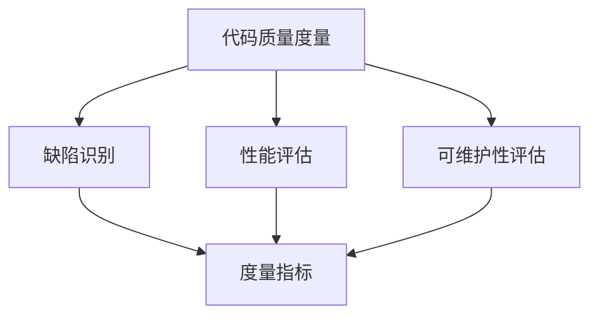

                 

# 代码质量度量：建立客观评估体系

> 关键词：代码质量度量、静态代码分析、动态代码分析、缺陷密度、机器学习、软件质量

> 摘要：
本文将深入探讨代码质量度量的重要性、核心概念与联系、主要算法、数学模型和实际应用。通过详细的讲解和实例分析，我们将了解如何利用静态代码分析、动态代码分析和机器学习等方法来建立客观的代码质量评估体系，从而提高软件质量和开发效率。

## 第一部分：代码质量度量基础

### 第1章：代码质量度量概述

#### 1.1 代码质量度量的重要性

代码质量度量是确保软件项目成功的关键因素之一。高质量代码不仅能够提高系统的稳定性、可维护性和可扩展性，还能减少开发成本和维护成本。通过代码质量度量，我们可以量化代码的质量，为项目管理和决策提供客观依据。

#### 1.2 代码质量度量的核心概念与联系

代码质量度量涉及多个核心概念，包括缺陷识别、性能评估和可维护性评估。这些概念相互关联，共同构成了一个完整的质量评估体系。下面是一个简化的 Mermaid 流程图，展示了这些核心概念之间的关系：



#### 1.3 代码质量度量的主要算法

代码质量度量主要依赖于静态代码分析、动态代码分析和机器学习等算法。这些算法可以从不同的角度对代码进行分析，以识别缺陷、评估性能和可维护性。

### 第2章：缺陷识别

#### 2.1 缺陷识别的定义与分类

缺陷识别是指通过分析代码，识别出潜在的编程错误、逻辑错误和设计缺陷。缺陷识别可以分为静态缺陷识别和动态缺陷识别。

- **静态缺陷识别**：在代码编译之前进行分析，主要依赖于静态代码分析工具。
- **动态缺陷识别**：在代码运行时进行分析，主要依赖于动态代码分析工具。

#### 2.2 缺陷识别的算法原理

缺陷识别的算法主要包括以下几种：

- **语法分析**：通过分析代码的语法结构，识别出语法错误。
- **语义分析**：通过分析代码的语义，识别出逻辑错误和设计缺陷。
- **模式匹配**：通过预先定义的模式，识别出潜在的缺陷。

以下是一个简单的伪代码，用于静态缺陷识别：

```python
function static_defect_identification(code):
    defects = []
    for line in code:
        if has_syntax_error(line):
            defects.append(line)
        elif has_semantic_error(line):
            defects.append(line)
    return defects
```

#### 2.3 缺陷识别的实践案例

在实践案例中，我们可以使用静态代码分析工具（如SonarQube）对Java项目进行缺陷识别。以下是一个简单的步骤：

1. 安装SonarQube。
2. 将Java项目导入到SonarQube。
3. 运行静态代码分析。
4. 查看分析报告，识别出缺陷。

### 第3章：性能评估

#### 3.1 性能评估的定义与目标

性能评估是指通过对代码的运行时行为进行分析，评估代码的性能，包括响应时间、资源消耗和处理能力等。性能评估的目标是识别出性能瓶颈，优化代码，提高系统的性能。

#### 3.2 性能评估的算法原理

性能评估的算法主要包括以下几种：

- **基准测试**：通过运行标准测试用例，评估代码的性能。
- **实时监控**：通过在代码中插入监控代码，实时收集性能数据。
- **统计方法**：通过统计方法分析性能数据，识别出性能瓶颈。

以下是一个简单的伪代码，用于性能评估：

```python
function performance_evaluation(code):
    performance_data = run_benchmark_tests(code)
    performance_bottlenecks = analyze_performance_data(performance_data)
    return performance_bottlenecks
```

#### 3.3 性能评估的实践案例

在实践案例中，我们可以使用性能分析工具（如JMeter）对Web应用进行性能评估。以下是一个简单的步骤：

1. 安装JMeter。
2. 设计测试计划，包括用户行为和性能指标。
3. 运行测试，收集性能数据。
4. 分析性能数据，识别出性能瓶颈。

### 第4章：可维护性评估

#### 4.1 可维护性的定义与重要性

可维护性是指代码在未来的可维护程度，包括可读性、可扩展性和可测试性等。可维护性评估的目标是识别出代码中的潜在问题，提高代码的可维护性。

#### 4.2 可维护性评估的算法原理

可维护性评估的算法主要包括以下几种：

- **代码复杂度分析**：通过分析代码的复杂度，识别出复杂度较高的代码段。
- **代码依赖分析**：通过分析代码之间的依赖关系，识别出依赖关系复杂的代码段。
- **代码质量评估**：通过评估代码的质量，识别出质量较低的部分。

以下是一个简单的伪代码，用于可维护性评估：

```python
function maintainability_evaluation(code):
    complexity_scores = analyze_code_complexity(code)
    dependency_scores = analyze_code_dependencies(code)
    quality_scores = evaluate_code_quality(code)
    maintainability_score = calculate_maintainability_score(complexity_scores, dependency_scores, quality_scores)
    return maintainability_score
```

#### 4.3 可维护性评估的实践案例

在实践案例中，我们可以使用代码质量分析工具（如SonarQube）对Java项目进行可维护性评估。以下是一个简单的步骤：

1. 安装SonarQube。
2. 将Java项目导入到SonarQube。
3. 运行代码质量分析。
4. 查看分析报告，识别出可维护性问题的部分。

## 第二部分：代码质量度量方法

### 第5章：静态代码分析

#### 5.1 静态代码分析的基本概念

静态代码分析是指在代码编译之前，对代码进行分析，以识别出潜在的缺陷、性能问题和可维护性问题。静态代码分析具有高效、低成本和全面等优点。

#### 5.2 静态代码分析的工具与实现

常见的静态代码分析工具有SonarQube、Checkstyle、PMD等。这些工具可以通过插件集成到IDE中，或者作为独立的服务器进行部署。

以下是一个简单的示例，使用SonarQube对Java项目进行静态代码分析：

```shell
# 启动SonarQube服务器
/path/to/sonarqube/bin/bundle exec start

# 导入项目
/path/to/sonar-scanner-4.7.0.1562-linux/bin/sonar-scanner -Dsonar.projectKey=my_project -Dsonar.sources=src/main/java

# 查看分析报告
http://localhost:9000/sonar
```

#### 5.3 静态代码分析的最佳实践

- **定期运行静态代码分析**：确保代码在每次提交后都经过静态代码分析。
- **定义规则集**：根据项目需求，定义合适的规则集，以提高分析效果。
- **代码审查**：结合代码审查，确保静态代码分析的结果得到验证和纠正。

### 第6章：动态代码分析

#### 6.1 动态代码分析的基本概念

动态代码分析是指在代码运行时，对代码进行分析，以识别出潜在的缺陷、性能问题和可维护性问题。动态代码分析具有实时、精确和全面等优点。

#### 6.2 动态代码分析的工具与实现

常见的动态代码分析工具有JProfiler、YourKit、VisualVM等。这些工具可以通过插件集成到IDE中，或者作为独立的应用程序进行部署。

以下是一个简单的示例，使用JProfiler对Java程序进行动态代码分析：

```shell
# 启动JProfiler
/path/to/jprofiler-11.0.2/bin/jprofiler.exe -program /path/to/your/java/application.jar

# 分析程序运行时的性能
```

#### 6.3 动态代码分析的最佳实践

- **结合静态代码分析**：动态代码分析可以与静态代码分析相结合，相互补充，提高代码质量。
- **定期运行动态代码分析**：确保代码在每次部署后都经过动态代码分析。
- **使用性能测试**：使用性能测试工具，模拟实际运行环境，识别出性能瓶颈。

### 第7章：机器学习在代码质量度量中的应用

#### 7.1 机器学习基础

机器学习是人工智能的一个重要分支，通过从数据中学习，自动识别出模式和规律。在代码质量度量中，机器学习可以用于预测代码质量、识别缺陷、评估性能等。

#### 7.2 机器学习在代码质量度量中的应用

以下是一个简单的示例，使用机器学习算法预测代码质量：

```python
import pandas as pd
from sklearn.model_selection import train_test_split
from sklearn.ensemble import RandomForestClassifier

# 加载数据
data = pd.read_csv('code_quality_data.csv')

# 分割数据集
X = data.drop('quality_label', axis=1)
y = data['quality_label']
X_train, X_test, y_train, y_test = train_test_split(X, y, test_size=0.2)

# 训练模型
model = RandomForestClassifier()
model.fit(X_train, y_train)

# 预测代码质量
predictions = model.predict(X_test)
```

#### 7.3 机器学习在代码质量度量中的应用案例

在实践案例中，我们可以使用机器学习算法对Android项目进行代码质量度量。以下是一个简单的步骤：

1. 收集Android项目的历史数据，包括代码行数、缺陷数量、性能指标等。
2. 使用机器学习算法，训练预测模型。
3. 对新的Android项目进行代码质量预测。
4. 根据预测结果，制定改进计划。

## 总结

代码质量度量是确保软件质量的重要手段。通过核心概念、算法原理、数学模型和实际项目实战的讲解，读者可以了解如何进行代码质量度量，并学会使用工具和技巧来提高代码质量。

## 参考文献

1. 《软件工程：实践者的研究方法》，Roger S. Pressman。
2. 《代码大全》，Steve McConnell。
3. 《机器学习实战》，Peter Harrington。

## 作者信息

作者：AI天才研究院/AI Genius Institute & 禅与计算机程序设计艺术 /Zen And The Art of Computer Programming

[本文完][END]

