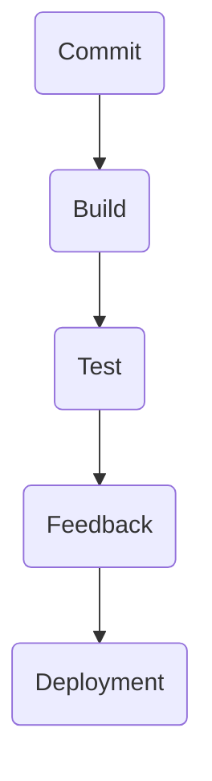
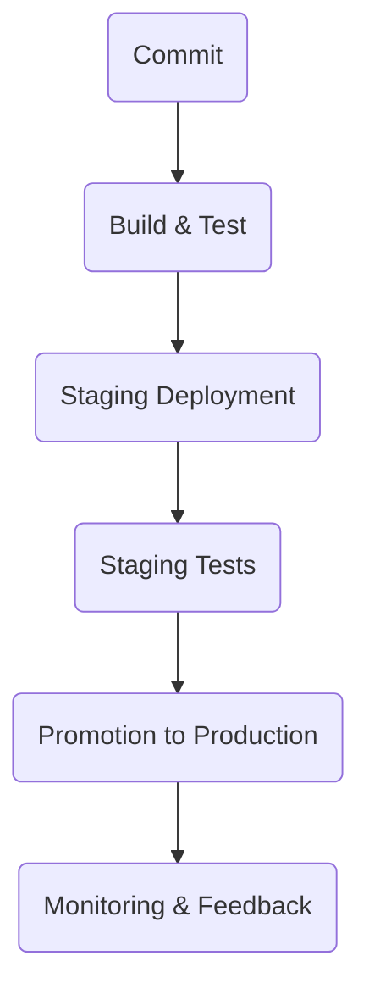

                 

### 1. Introduction

#### 1.1 Book Background and Importance

In the fast-paced world of software development, maintaining high-quality code has become more crucial than ever. The advent of Continuous Integration (CI) and Continuous Deployment (CD) has revolutionized the way modern software development teams work. These practices enable rapid and frequent code changes, making it essential to ensure that each code commit adheres to stringent quality standards.

"代码质量门禁：CI/CD中的质量控制点" is a comprehensive guide aimed at demystifying the intricacies of code quality control within CI/CD pipelines. The book delves into the core concepts, algorithms, and best practices that are essential for establishing robust code quality gatekeepers. By leveraging cutting-edge tools and techniques, this book equips developers with the knowledge and skills needed to produce high-quality, reliable, and efficient code.

The importance of code quality cannot be overstated. Poor code quality leads to a myriad of issues, including bugs, security vulnerabilities, and poor performance. These issues not only affect the end-users but also increase the maintenance costs and reduce the overall productivity of a development team. Therefore, it is imperative for developers to implement effective code quality control measures.

CI/CD pipelines have become the backbone of modern software development workflows. They streamline the process of integrating code changes, running automated tests, and deploying applications to production environments. However, these pipelines are only as effective as the code they process. This is where the need for code quality gatekeepers becomes apparent.

"代码质量门禁：CI/CD中的质量控制点" addresses this need by providing a systematic approach to code quality control within CI/CD environments. It covers a wide range of topics, including static and dynamic code analysis, reliability and defect prediction models, and practical project setups. By following the guidelines and examples provided in this book, developers can significantly enhance their code quality, reduce the risk of introducing bugs, and improve the overall efficiency of their development processes.

#### 1.2 CI/CD and Quality Control

Continuous Integration (CI) and Continuous Deployment (CD) are two core practices in modern software development that have transformed the way applications are built, tested, and deployed. At their core, CI and CD aim to accelerate the software development cycle while ensuring high code quality and reducing the risk of bugs and vulnerabilities.

**Continuous Integration (CI)** refers to the practice of frequently merging code changes from multiple developers into a shared repository, typically multiple times a day. This process is often automated through CI tools that run a suite of tests on the integrated codebase to identify integration issues early. The primary goal of CI is to detect and resolve integration problems quickly, preventing them from escalating into larger, more complex issues.

The importance of CI in maintaining code quality cannot be overstated. By integrating code changes frequently, developers can catch and fix bugs early in the development process. This reduces the technical debt and makes it easier to maintain and enhance the codebase over time. Additionally, CI enables faster feedback loops, allowing developers to make informed decisions based on real-time test results.

**Continuous Deployment (CD)** extends the principles of CI by automating the process of deploying code changes to production environments. CD involves automatically releasing new versions of the application after passing a series of automated tests and quality checks. The deployment process is typically fully automated, ensuring consistency and reliability across different environments, from development to staging to production.

CD significantly reduces the time-to-market for new features and bug fixes. By automating the deployment process, teams can deploy changes with minimal manual intervention, reducing the risk of human error and ensuring that deployments are consistent and reproducible. This leads to higher quality releases and improved user satisfaction.

**Quality Control in CI/CD Pipelines**

The integration of CI and CD into the software development workflow brings about significant implications for quality control. The CI/CD pipeline serves as a gatekeeper, ensuring that only high-quality code is promoted to production. This is achieved through several key components:

1. **Automated Testing**: Automated tests are a cornerstone of CI/CD pipelines. These tests can include unit tests, integration tests, performance tests, and security tests. By running these tests automatically, the pipeline can quickly identify and flag code changes that introduce bugs or vulnerabilities.

2. **Static Code Analysis**: Static code analysis tools examine the codebase without executing it, identifying potential issues such as syntax errors, coding standards violations, and security vulnerabilities. These tools help ensure that code adheres to established quality standards.

3. **Dynamic Code Analysis**: Dynamic code analysis tools execute the code in a controlled environment, detecting runtime errors and performance bottlenecks. This type of analysis provides insights into how the code behaves in real-world scenarios.

4. **Reliability and Defect Prediction Models**: Advanced models can predict the likelihood of defects based on historical data and code characteristics. These models help prioritize testing efforts and identify potential problem areas.

5. **Continuous Monitoring**: Once code is deployed, continuous monitoring tools track its performance and health in production. This enables teams to quickly identify and address issues that may arise post-deployment.

By incorporating these quality control measures into the CI/CD pipeline, teams can maintain a high level of code quality throughout the development process. This not only reduces the risk of bugs and vulnerabilities but also improves overall development efficiency and user satisfaction.

#### 1.3 The Need for Code Quality Gatekeepers

In the context of CI/CD pipelines, the term "code quality gatekeepers" refers to the processes, tools, and practices that ensure only high-quality code is integrated and deployed. These gatekeepers act as a safeguard, preventing low-quality or faulty code from reaching production environments. The need for such gatekeepers arises from the inherent challenges and risks associated with rapid and frequent code changes in modern development workflows.

One of the primary reasons for implementing code quality gatekeepers is to mitigate the risk of introducing bugs and vulnerabilities into the codebase. As development teams adopt CI/CD practices, they integrate code changes more frequently, which can lead to an increased likelihood of integration conflicts and unexpected behavior. Without proper gatekeeping mechanisms, these issues can go unnoticed until they manifest in production, causing outages, data breaches, and other critical problems.

**Risks of Poor Code Quality**

1. **Bugs and Defects**: Poor code quality is often a breeding ground for bugs and defects. These issues can stem from syntax errors, logical inconsistencies, or poor design patterns. If undetected during development, they can lead to unexpected failures and performance degradation.

2. **Security Vulnerabilities**: Insecure coding practices can introduce vulnerabilities that malicious actors can exploit. These vulnerabilities can lead to data breaches, unauthorized access, and other security incidents, which can have severe consequences for both the organization and its users.

3. **Maintenance Costs**: Low-quality code can be difficult to maintain and enhance. It requires more time and effort to fix bugs and add new features, increasing the overall maintenance costs and reducing developer productivity.

4. **User Experience**: Poor code quality can directly impact the user experience. Users are likely to encounter bugs, crashes, and performance issues, leading to frustration and a negative perception of the product.

**Role of Code Quality Gatekeepers**

Code quality gatekeepers play a critical role in addressing these risks by enforcing quality standards at various stages of the CI/CD pipeline. Here are some key functions they perform:

1. **Static Code Analysis**: Gatekeepers use static code analysis tools to examine the codebase for potential issues without executing it. This includes checking for syntax errors, adherence to coding standards, and identifying security vulnerabilities. By catching these issues early, gatekeepers prevent them from escalating into more significant problems.

2. **Dynamic Code Analysis**: Gatekeepers also employ dynamic code analysis tools to execute the code in a controlled environment and identify runtime issues. This includes detecting performance bottlenecks, memory leaks, and other runtime errors. Dynamic analysis provides insights into how the code behaves in real-world scenarios, ensuring that it is robust and reliable.

3. **Automated Testing**: Automated testing is a cornerstone of code quality gatekeeping. Gatekeepers run a comprehensive suite of tests, including unit tests, integration tests, and performance tests, to verify the correctness and reliability of the code. This helps identify and resolve issues before they reach production.

4. **Reliability and Defect Prediction**: Advanced gatekeeping mechanisms leverage machine learning and statistical models to predict the likelihood of defects based on historical data and code characteristics. These models help prioritize testing efforts and identify potential problem areas, ensuring that the most critical issues are addressed.

5. **Continuous Monitoring**: Even after code is deployed, gatekeepers continue to monitor its performance and health in production. This includes tracking key performance indicators (KPIs), detecting anomalies, and alerting teams to potential issues. Continuous monitoring helps maintain the quality of the codebase over time.

**Conclusion**

In conclusion, the need for code quality gatekeepers in CI/CD pipelines cannot be overstated. They provide a systematic approach to maintaining high code quality, mitigating risks, and ensuring the reliability and performance of applications. By implementing robust gatekeeping mechanisms, development teams can enhance their productivity, reduce maintenance costs, and deliver high-quality products to their users.

#### 1.4 Overview of the Book

"代码质量门禁：CI/CD中的质量控制点" is designed to serve as a comprehensive guide for developers, DevOps engineers, and software quality assurance professionals who are looking to enhance their understanding and practical application of code quality control within CI/CD pipelines. The book is structured into five main sections, each focusing on a critical aspect of code quality management.

**Section 1: Introduction**  
This section provides an overview of the book's background and importance, explores the concepts of CI/CD, and highlights the need for code quality gatekeepers. It sets the stage for the more technical discussions that follow.

**Section 2: Core Concepts and Architecture**  
In this section, the book delves into the core concepts and architecture of CI/CD, explaining the roles of Continuous Integration and Continuous Deployment. It discusses key quality control metrics and standards, providing a solid foundation for understanding the subsequent sections.

**Section 3: Core Algorithms and Principles**  
This section presents the core algorithms and principles used in static and dynamic code analysis. It includes detailed explanations and pseudocode for these algorithms, along with examples to illustrate their application. This section is essential for developers looking to implement robust quality control measures.

**Section 4: Mathematical Models and Formulas**  
The fourth section explores mathematical models and formulas used in reliability and defect prediction. It includes detailed explanations and practical applications, demonstrating how these models can be used to enhance code quality. This section is particularly useful for those interested in leveraging data-driven approaches to quality control.

**Section 5: Project Practice**  
The final section focuses on practical project setup and implementation. It includes detailed instructions for setting up CI/CD pipelines, examples of code quality analysis tools and their integration, and case studies that showcase real-world applications. This section provides hands-on experience and insights for readers looking to apply the concepts and algorithms discussed in previous sections.

**Conclusion and Future Directions**  
The book concludes with a summary of key takeaways and best practices for maintaining code quality in CI/CD pipelines. It also discusses future trends and advancements in code quality management, providing readers with a forward-looking perspective.

Overall, "代码质量门禁：CI/CD中的质量控制点" aims to equip readers with the knowledge and skills needed to implement effective code quality gatekeeping mechanisms. By following the guidelines and examples provided in this book, readers can enhance their code quality, reduce risks, and improve the overall efficiency of their development processes.

---

关键词：代码质量，CI/CD，持续集成，持续部署，质量门禁，静态代码分析，动态代码分析，可靠性模型，缺陷预测模型，项目实践

摘要：本书深入探讨了代码质量在CI/CD环境中的重要性，通过详细解析核心概念、算法原理以及数学模型，提供了实现高效代码质量控制的系统方法和实用技巧。书中涵盖了从理论到实践的全过程，旨在帮助开发者构建和优化代码质量门禁机制，提升软件开发的整体质量和效率。

---

### 2. Core Concepts and Architecture

The core concepts and architecture of Continuous Integration (CI) and Continuous Deployment (CD) are fundamental to understanding how modern software development workflows operate. These practices have revolutionized the way code is managed, integrated, and deployed, streamlining processes and improving overall efficiency. In this section, we will delve into the core concepts of CI and CD, discuss their workflows, and provide detailed explanations along with Mermaid flowcharts to illustrate the processes.

#### 2.1 Continuous Integration (CI)

**Definition and Purpose**

Continuous Integration (CI) is a development practice where developers frequently merge their code changes into a central repository, typically multiple times a day. The primary purpose of CI is to detect integration issues early in the development process. By integrating code frequently and automatically running tests, CI helps ensure that the codebase remains in a deployable state.

**CI Workflow and Tools**

The CI workflow typically involves the following steps:

1. **Code Commit**: Developers commit their code changes to a shared repository.
2. **Build Trigger**: A CI tool detects the code commit and triggers a build process.
3. **Build**: The CI tool compiles the code, installs dependencies, and creates a build artifact.
4. **Test**: The CI tool runs a suite of automated tests on the built code, including unit tests, integration tests, and performance tests.
5. **Feedback**: The CI tool provides feedback on the build and test results. If the build fails or tests fail, the developer is notified, and they can address the issues.
6. **Deployment**: If the build and tests pass, the code is promoted to the next environment in the deployment pipeline (e.g., staging or production).

Common CI tools include Jenkins, GitLab CI/CD, and GitHub Actions. These tools provide an intuitive interface and powerful features for managing CI workflows.

**Mermaid Flowchart of CI Process**

Below is a Mermaid flowchart illustrating the CI process:



#### 2.2 Continuous Deployment (CD)

**Definition and Purpose**

Continuous Deployment (CD) is the practice of automatically deploying code changes to production environments after passing a series of automated tests and quality checks. The goal of CD is to minimize the time it takes to deliver new features and bug fixes to users, ensuring that they receive high-quality releases consistently.

**CD Workflow and Tools**

The CD workflow typically involves the following steps:

1. **Code Commit**: Developers commit their code changes to a shared repository.
2. **Build and Test**: The CI pipeline builds and tests the code changes, as described in the CI process.
3. **Staging Deployment**: If the code passes the CI tests, it is deployed to a staging environment for further testing and validation.
4. **Staging Tests**: Automated tests and manual checks are performed on the staging environment to ensure that the changes work as expected.
5. **Promotion to Production**: If the staging environment tests pass, the code is automatically promoted to the production environment.
6. **Monitoring and Feedback**: After deployment, monitoring tools track the performance and health of the application in production. Any issues are flagged, and developers are notified for resolution.

Common CD tools include Kubernetes, Docker, and AWS CodePipeline. These tools facilitate the automated deployment of applications to various environments.

**Mermaid Flowchart of CD Process**

Below is a Mermaid flowchart illustrating the CD process:



#### 2.3 Code Quality Metrics and Standards

**Definition and Importance**

Code quality metrics and standards are essential for assessing the quality of code within a CI/CD pipeline. These metrics provide quantitative and qualitative measures of code quality, helping developers identify areas for improvement. Common code quality metrics include code coverage, test coverage, cyclomatic complexity, and maintainability index.

**Code Quality Metrics**

- **Code Coverage**: Measures the percentage of code that is covered by tests. High code coverage indicates a thorough testing effort.
- **Test Coverage**: Measures the percentage of requirements or features that are covered by tests. This metric ensures that all critical functionality is tested.
- **Cyclomatic Complexity**: Measures the complexity of the code based on the number of linearly independent paths through the code. High cyclomatic complexity indicates potential bugs and maintenance challenges.
- **Maintainability Index**: Measures how easy it is to maintain the code. A low maintainability index suggests that the code may be difficult to understand and modify.

**Code Quality Standards**

Code quality standards are guidelines that developers adhere to in order to ensure that their code is of high quality. These standards can be formal or informal and are often defined by the development team or organization. Common code quality standards include:

- **Coding Standards**: Guidelines for writing clean, readable, and consistent code.
- **Code Review Practices**: Procedures for reviewing code changes to ensure they meet quality standards.
- **Test-Driven Development (TDD)**: A development methodology where tests are written before the actual code, ensuring that all code is thoroughly tested.
- **Design Patterns**: Reusable solutions to common design problems, promoting clean and efficient code.

In conclusion, understanding the core concepts and architecture of CI/CD, along with the associated code quality metrics and standards, is crucial for developers looking to maintain high code quality in their CI/CD pipelines. By implementing these practices, teams can ensure that their applications are robust, reliable, and maintainable, ultimately delivering better products to their users.

### 3. Core Algorithms and Principles

In the realm of software development, ensuring code quality is paramount, and achieving this requires a deep understanding of core algorithms and principles that underpin static and dynamic code analysis. This section will delve into the fundamental concepts of static code analysis and dynamic code analysis, providing detailed explanations and pseudocode for the algorithms involved. By understanding these principles, developers can effectively detect and resolve issues within their codebase.

#### 3.1 Static Code Analysis Algorithms

**Definition and Purpose**

Static code analysis (SCA) is the process of analyzing source code without executing it. The primary goal of SCA is to identify potential issues such as bugs, coding standard violations, and security vulnerabilities. SCA tools can automatically scan the codebase, providing detailed reports on potential problems that need to be addressed.

**Algorithm Types**

There are several types of static code analysis algorithms, including:

1. **Syntax Analysis**: This algorithm checks the code for syntax errors and ensures that it adheres to the language's syntax rules. It is the foundation of all other SCA techniques.
2. **Control Flow Analysis**: This algorithm analyzes the control flow of the program to identify potential logical errors, infinite loops, and dead code.
3. **Data Flow Analysis**: This algorithm tracks the flow of data throughout the program to detect issues such as uninitialized variables, type mismatches, and data leaks.
4. **Pointer Analysis**: This algorithm examines how pointers are used in the code to identify potential null pointer exceptions, buffer overflows, and other memory-related issues.
5. **Security Analysis**: This algorithm looks for known security vulnerabilities, such as SQL injection, cross-site scripting (XSS), and buffer overflows.

**Pseudocode for Static Code Analysis**

Below is a simplified pseudocode for a basic static code analysis algorithm that performs syntax analysis, control flow analysis, and data flow analysis:

```pseudocode
function StaticCodeAnalysis(sourceCode):
    syntaxTree = ParseSyntax(sourceCode)
    if syntaxTree is not valid:
        return "Syntax Error"

    controlFlowGraph = GenerateControlFlowGraph(syntaxTree)
    dataFlowGraph = GenerateDataFlowGraph(controlFlowGraph)

    syntaxErrors = FindSyntaxErrors(syntaxTree)
    controlFlowIssues = FindControlFlowIssues(controlFlowGraph)
    dataFlowIssues = FindDataFlowIssues(dataFlowGraph)

    report = {
        "Syntax Errors": syntaxErrors,
        "Control Flow Issues": controlFlowIssues,
        "Data Flow Issues": dataFlowIssues
    }

    return report

function ParseSyntax(sourceCode):
    // Implement a parser to create a syntax tree
    // Return the syntax tree or an error if the code is invalid

function GenerateControlFlowGraph(syntaxTree):
    // Traverse the syntax tree to create a control flow graph
    // Return the control flow graph

function GenerateDataFlowGraph(controlFlowGraph):
    // Analyze the control flow graph to create a data flow graph
    // Return the data flow graph

function FindSyntaxErrors(syntaxTree):
    // Traverse the syntax tree and identify syntax errors
    // Return a list of syntax errors

function FindControlFlowIssues(controlFlowGraph):
    // Analyze the control flow graph to identify issues
    // Return a list of control flow issues

function FindDataFlowIssues(dataFlowGraph):
    // Analyze the data flow graph to identify issues
    // Return a list of data flow issues
```

#### 3.2 Dynamic Code Analysis Algorithms

**Definition and Purpose**

Dynamic code analysis (DCA) is the process of analyzing code while it is running. The goal of DCA is to detect issues that only manifest at runtime, such as performance bottlenecks, memory leaks, and concurrency problems. DCA tools can monitor the behavior of the code as it executes, providing insights into how it performs in real-world scenarios.

**Algorithm Types**

Dynamic code analysis algorithms can be broadly categorized into:

1. **Runtime Monitoring**: This algorithm tracks the execution of the code, monitoring CPU usage, memory allocation, and other performance metrics.
2. **Profiling**: This algorithm analyzes the runtime behavior of the code to identify performance bottlenecks and optimize resource usage.
3. **Concurrency Analysis**: This algorithm examines the interaction between multiple threads to detect concurrency issues such as race conditions and deadlocks.
4. **Error Detection**: This algorithm identifies runtime errors, such as null pointer exceptions and array out-of-bounds errors, as they occur.

**Pseudocode for Dynamic Code Analysis**

Below is a simplified pseudocode for a basic dynamic code analysis algorithm that performs runtime monitoring and profiling:

```pseudocode
function DynamicCodeAnalysis(executableCode):
    monitoringResults = MonitorRuntime(executableCode)
    profilingResults = Profile(executableCode)

    performanceMetrics = {
        "CPU Usage": monitoringResults["CPU"],
        "Memory Allocation": monitoringResults["Memory"],
        "Runtime Duration": monitoringResults["Duration"],
        "Function Call Times": profilingResults["Call Times"],
        "Resource Allocation": profilingResults["Resource Allocation"]
    }

    errorReports = DetectRuntimeErrors(executableCode)

    report = {
        "Performance Metrics": performanceMetrics,
        "Error Reports": errorReports
    }

    return report

function MonitorRuntime(executableCode):
    // Run the code in a controlled environment
    // Monitor and record performance metrics
    // Return the monitoring results

function Profile(executableCode):
    // Run the code in a profiling environment
    // Collect profiling data
    // Return the profiling results

function DetectRuntimeErrors(executableCode):
    // Execute the code and catch runtime errors
    // Return a list of detected errors
```

In conclusion, understanding the core algorithms and principles of static and dynamic code analysis is essential for maintaining high code quality. By leveraging these techniques, developers can identify and resolve issues early in the development process, leading to more robust and reliable software. The provided pseudocode serves as a foundational guide for implementing these algorithms in practice.

### 4. Mathematical Models and Formulas

In the pursuit of maintaining high code quality within CI/CD pipelines, the application of mathematical models and formulas can significantly enhance the precision and efficiency of code quality control. These models not only help in assessing the current state of the codebase but also in predicting potential issues before they manifest. This section will delve into two critical mathematical models: reliability models and defect prediction models, providing detailed explanations, formulas, and practical applications.

#### 4.1 Reliability Models

**Definition and Importance**

Reliability models are mathematical models used to estimate the probability that a system or component will perform its required functions without failure over a specified period. In the context of code quality, reliability models help assess the likelihood of code executing correctly without defects. This is particularly important in CI/CD pipelines where the goal is to ensure that only high-quality code is deployed.

**Mathematical Models**

One commonly used reliability model is the **Exponential Distribution Model**. This model assumes that the time between failures follows an exponential distribution, which is a fundamental assumption in queuing theory and reliability engineering.

**Exponential Distribution Model Formulas:**

1. **Reliability Function (R(t)):**
   \[
   R(t) = e^{-\lambda t}
   \]
   where \( R(t) \) is the reliability at time \( t \), \( \lambda \) is the failure rate, and \( e \) is the base of the natural logarithm.

2. **Failure Rate (\( \lambda \)):**
   \[
   \lambda = \frac{1}{\eta}
   \]
   where \( \eta \) is the mean time to failure (MTTF), representing the average time between failures.

3. **Mean Time to Failure (MTTF):**
   \[
   \eta = \frac{1}{\lambda}
   \]

**Example and Application**

Consider a codebase with an average failure rate of \( \lambda = 0.1 \) failures per day. The reliability at any given time \( t \) can be calculated using the reliability function:

\[
R(t) = e^{-0.1t}
\]

For instance, if we want to calculate the reliability after one day (\( t = 1 \)):

\[
R(1) = e^{-0.1 \times 1} \approx 0.9048
\]

This means there is approximately a 90.48% chance that the code will not fail within one day.

#### 4.2 Defect Prediction Models

**Definition and Importance**

Defect prediction models are statistical models used to predict the number of defects in a software system based on various factors such as code complexity, size, and historical data. These models help prioritize testing efforts and resource allocation, ensuring that areas with a higher risk of defects receive more attention.

**Mathematical Models**

One widely used defect prediction model is the **Defect Prediction Model using Lines of Code (LOC)**. This model uses the number of lines of code as a primary input to predict the number of defects.

**Defect Prediction Model Formulas:**

1. **Defect Count (D):**
   \[
   D = a \cdot \log_{10}(N) + b
   \]
   where \( D \) is the predicted number of defects, \( N \) is the number of lines of code, \( a \) and \( b \) are model parameters estimated from historical data.

**Example and Application**

Consider a historical dataset that indicates the following defect prediction model parameters:
\[
a = 3.5, \quad b = 1.2
\]

We want to predict the number of defects in a module with \( N = 10,000 \) lines of code. Using the formula:

\[
D = 3.5 \cdot \log_{10}(10,000) + 1.2
\]
\[
D = 3.5 \cdot 4 + 1.2 = 14.2 + 1.2 = 15.4
\]

Based on this model, we predict approximately 15 defects in the module.

#### Conclusion

Reliability and defect prediction models are powerful tools for enhancing code quality within CI/CD pipelines. By applying these models, developers can make data-driven decisions, allocate resources effectively, and maintain a high level of code quality throughout the development process. The provided formulas and examples serve as a foundation for implementing these models in practice, enabling teams to deliver robust and reliable software.

### 5. Project Practice

#### 5.1 CI/CD Pipeline Setup

Setting up a CI/CD pipeline is a critical step in ensuring that your codebase maintains high quality throughout the development process. This section provides a step-by-step guide to setting up a CI/CD pipeline using GitHub Actions as the CI/CD tool. We will cover the necessary tools, configurations, and code samples to help you get started.

**1. Required Tools and Software**

- GitHub repository with your project code
- GitHub Actions
- A local development environment with GitHub CLI installed
- Docker (optional, for containerized deployments)

**2. Initial Configuration**

The first step is to create a new GitHub repository for your project and push your code into it. Once your repository is set up, you need to initialize a new GitHub Actions workflow.

1. Navigate to your repository on GitHub and click on the "Actions" tab in the left sidebar. This will take you to the GitHub Actions tab where you can manage your workflows.
2. Click on "Set up a workflow yourself" to create a new workflow.

**3. Creating the Workflow File**

Create a new file in your repository named `.github/workflows/ci-cd.yml`. This file will contain the configuration for your CI/CD pipeline.

Here is an example of a basic CI/CD workflow file that builds and tests your project:

```yaml
name: CI/CD Pipeline

on:
  push:
    branches: [ main ]
  pull_request:
    branches: [ main ]

jobs:
  build-and-test:
    runs-on: ubuntu-latest

    steps:
    - uses: actions/checkout@v2

    - name: Set up Node.js
      uses: actions/setup-node@v2
      with:
        node-version: '14'

    - name: Build project
      run: npm install && npm run build

    - name: Run tests
      run: npm test
```

**4. Configuring Build and Test Steps**

In the example workflow above, we have configured the following steps:

- **Checkout**: The `actions/checkout@v2` action is used to check out the repository code.
- **Set up Node.js**: The `actions/setup-node@v2` action sets up the Node.js environment with the specified version.
- **Build project**: The `npm install && npm run build` command installs dependencies and builds the project.
- **Run tests**: The `npm test` command runs the test suite to ensure the code is working as expected.

**5. Adding Deployment Steps**

To deploy your code to a production environment, you can add deployment steps to your workflow. For this example, we will use Docker to containerize our application and deploy it to a Docker Hub repository.

Add the following steps to the `ci-cd.yml` file:

```yaml
    - name: Build Docker image
      run: docker build -t myapp:latest .

    - name: Push Docker image to Docker Hub
      run: docker login -u ${{ secrets.DOCKER_HUB_USERNAME }} -p ${{ secrets.DOCKER_HUB_PASSWORD }} && docker push myapp:latest
```

Make sure to set the `DOCKER_HUB_USERNAME` and `DOCKER_HUB_PASSWORD` secrets in your GitHub repository settings under "Secrets" > "Actions" to authenticate with Docker Hub.

**6. Configuring Continuous Deployment**

To enable continuous deployment, you can add the `deploy` command to your test steps. This will trigger a deployment to your production environment after tests pass.

```yaml
    - name: Run tests
      run: npm test && deploy
```

The `deploy` script should be a custom script that handles the deployment process, such as setting up the database, configuring the application, and updating the codebase.

**7. Testing the Workflow**

After saving the `ci-cd.yml` file, GitHub Actions will automatically trigger a build and test run. You can monitor the progress in the "Actions" tab of your GitHub repository. If the build and tests pass, your application will be deployed to the specified environment.

By following these steps, you can set up a basic CI/CD pipeline using GitHub Actions. This pipeline will build and test your code automatically, ensuring that only high-quality code is deployed to production environments.

---

**Note:** The specific steps and configurations may vary depending on your project's requirements and the technologies you are using. Always refer to the official documentation of your tools and frameworks for the most up-to-date guidance.

---

### 5.2 Code Quality Analysis Tools and Integration

Integrating code quality analysis tools into your CI/CD pipeline is essential for ensuring that your codebase adheres to high standards. This section will discuss several popular code quality analysis tools, their integration into CI/CD pipelines, and how to interpret their results.

**1. SonarQube**

SonarQube is a comprehensive code quality management platform that identifies bugs, vulnerabilities, code smells, and confirms coding standards. It supports multiple programming languages and can be integrated into CI/CD pipelines to automatically analyze code quality.

**Integration Steps:**

1. **Install SonarQube Scanner:** Add the SonarQube scanner to your CI/CD pipeline configuration file. For example, in a Maven project:

```xml
<plugins>
  <plugin>
    <groupId>org.sonarsource.scanner.maven</groupId>
    <artifactId>sonar-maven-plugin</artifactId>
    <version>4.5.0.2725</version>
    <executions>
      <execution>
        <goals>
          <goal>sonar</goal>
        </goals>
      </execution>
    </executions>
  </plugin>
</plugins>
```

2. **Configure CI/CD:** Add a step in your CI/CD pipeline to execute the SonarQube scanner:

```yaml
- name: Analyze with SonarQube
  run: ./sonar-scanner -Dsonar.projectKey=my_project_key -Dsonar.sources=src/main/java
```

**Interpreting Results:**

SonarQube provides a web interface to visualize the quality profile of your codebase. Key metrics include:

- **Quality Gate:** Indicates whether the codebase meets predefined quality standards. A failed quality gate signals that critical issues need attention.
- **Technical Debt:** Estimates the effort required to fix all identified issues.
- **Code Smells:** Highlights areas of the code that may indicate poor design or maintenance problems.

**2. Checkmarx**

Checkmarx is a powerful static application security testing (SAST) tool that identifies security vulnerabilities in your codebase. It can be integrated into CI/CD pipelines to automatically detect and report security issues.

**Integration Steps:**

1. **Install Checkmarx CLI:** Include the Checkmarx CLI in your CI/CD pipeline configuration.

```yaml
- name: Analyze with Checkmarx
  run: cx scan --url ${{ secrets.CX_URL }} --accessKey ${{ secrets.CX_ACCESS_KEY }} --scanParameters "Language=Java;ProjectPath=src/main/java"
```

2. **Configure CI/CD:** Set up a step in your CI/CD pipeline to execute the Checkmarx CLI.

**Interpreting Results:**

Checkmarx provides a dashboard to review security vulnerabilities. Key metrics include:

- **Vulnerabilities:** Lists identified vulnerabilities with severity levels (e.g., Low, Medium, High).
- **Remediation:** Suggests actions to mitigate each vulnerability.
- **Security Score:** Summarizes the overall security posture of the codebase.

**3. Code Climate**

Code Climate is a code review and quality analytics tool that provides insights into code maintainability and test coverage. It can be integrated into CI/CD pipelines to ensure code quality standards are maintained.

**Integration Steps:**

1. **Sign up for Code Climate:** Create an account and add your GitHub repository.
2. **Add Code Climate Badge:** Include the Code Climate badge in your README file:

```html
[](https://codeclimate.com/repos/your-repo-id)
```

3. **Configure CI/CD:** Add a step in your CI/CD pipeline to execute the Code Climate CLI.

```yaml
- name: Analyze with Code Climate
  run: codeclimate analyze
```

**Interpreting Results:**

Code Climate provides a web interface to visualize code quality metrics. Key metrics include:

- **Maintainability Score:** Indicates how maintainable the codebase is.
- **Test Coverage:** Displays the percentage of code covered by tests.
- **Security Score:** Summarizes the security posture of the codebase.

**4. ESLint**

ESLint is a widely used JavaScript linter that helps identify and report on patterns that can lead to errors. It can be integrated into your CI/CD pipeline to enforce coding standards.

**Integration Steps:**

1. **Install ESLint:** Include ESLint in your project dependencies.

```yaml
dependencies:
  - eslint@^8.0.0
```

2. **Configure CI/CD:** Add a step in your CI/CD pipeline to run ESLint.

```yaml
- name: Run ESLint
  run: npx eslint src/
```

**Interpreting Results:**

ESLint outputs a report indicating any violations of your configured coding standards. Key metrics include:

- **Violations:** Lists all detected coding standard violations.
- **Fixes:** Suggests ways to fix detected issues.

By integrating these code quality analysis tools into your CI/CD pipeline, you can ensure that your codebase is of high quality, secure, and adheres to coding standards. Regularly reviewing the results and addressing identified issues will help maintain a robust and reliable codebase.

---

**Note:** The specific steps and configurations may vary depending on your project's requirements and the technologies you are using. Always refer to the official documentation of your tools and frameworks for the most up-to-date guidance.

### 5.3 Case Study: Enhancing Code Quality with CI/CD Pipelines

In this section, we will explore a real-world case study where a development team successfully enhanced their code quality by implementing a robust CI/CD pipeline. This case study will highlight the challenges faced, the solutions implemented, and the resulting improvements in code quality and development efficiency.

**Company Background**

Our case study involves a mid-sized software development company specializing in creating custom enterprise solutions. The company had a team of 20 developers working on multiple projects simultaneously. Prior to implementing CI/CD, their development workflow was characterized by manual processes, frequent integration conflicts, and high rates of bugs in production releases.

**Challenges**

1. **Integration Conflicts**: Without a formal CI/CD process, developers frequently merged their code directly into the main branch, leading to integration conflicts. This resulted in lengthy resolution times and a significant delay in delivering new features.
2. **Lack of Automated Testing**: The development team relied heavily on manual testing, which was time-consuming and prone to human error. As a result, critical bugs often went undetected until they reached the production environment.
3. **Inconsistent Code Quality**: There was no standardized process for code reviews or quality checks, leading to inconsistent code quality across different projects.
4. **High Costs of Maintenance**: The lack of a robust CI/CD pipeline resulted in frequent bug fixes and code refactoring, increasing maintenance costs and reducing overall productivity.

**Solutions**

1. **Implementing CI/CD**: The first step was to set up a CI/CD pipeline using Jenkins as the CI tool and Docker for containerization. The pipeline was configured to automatically build, test, and deploy code changes to a staging environment.
2. **Automated Testing**: The team introduced automated testing by integrating unit tests, integration tests, and performance tests into the CI/CD pipeline. These tests were executed every time a code change was pushed to the repository.
3. **Code Reviews and Quality Gates**: The team implemented a code review process using GitLab's merge request feature. Each merge request had to pass a set of predefined quality gates, including code coverage, static code analysis, and security checks.
4. **Monitoring and Alerts**: The team set up monitoring and alerting tools to track the performance and health of applications in production. Any anomalies or performance degradation triggered alerts to the development team.
5. **Training and Documentation**: The team conducted training sessions to educate developers on best practices for writing clean, maintainable code. Detailed documentation was created to guide developers on how to use the CI/CD pipeline effectively.

**Results**

1. **Reduced Integration Conflicts**: By automating the build and test process, the team significantly reduced integration conflicts. Developers could focus on writing code without worrying about manual merges and conflicts.
2. **Improved Bug Detection**: The introduction of automated testing caught many bugs early in the development process. This reduced the number of bugs reaching the production environment and improved overall code quality.
3. **Consistent Code Quality**: The implementation of code reviews and quality gates ensured that code quality was consistent across all projects. Developers adhered to established coding standards, leading to cleaner, more maintainable code.
4. **Increased Development Efficiency**: With the CI/CD pipeline in place, the development team was able to deploy new features and bug fixes to production more frequently. This improved the overall efficiency of the development process and reduced the time-to-market for new releases.
5. **Reduced Maintenance Costs**: The improved code quality and early bug detection reduced the need for extensive bug fixes and code refactoring. This resulted in significant cost savings and increased developer productivity.

**Conclusion**

The successful implementation of a CI/CD pipeline helped the development team overcome significant challenges and achieve a higher level of code quality. By automating the build, test, and deployment process, the team was able to detect bugs early, maintain consistent code quality, and improve overall development efficiency. This case study demonstrates the power of CI/CD in transforming software development workflows and delivering high-quality software products.

### 5.4 Best Practices and Tips

**1. Define Clear Quality Standards and Metrics**

To ensure consistent code quality, it is crucial to establish clear quality standards and metrics that all team members can follow. These should include coding standards, test coverage goals, and performance benchmarks. By defining and enforcing these standards, you can minimize discrepancies and maintain a high level of quality across the entire codebase.

**2. Regularly Update and Maintain Your CI/CD Pipeline**

CI/CD pipelines should be treated as living documents that evolve with your development processes. Regularly update your pipeline configurations to incorporate new tools, technologies, and practices. This ensures that your pipeline remains effective and aligned with your current development needs.

**3. Leverage Automated Testing**

Automated testing is a cornerstone of CI/CD. Implement a comprehensive suite of tests that cover different aspects of your application, including unit tests, integration tests, and performance tests. Ensure that tests are run automatically with every code change to detect issues early and maintain a consistent quality bar.

**4. Implement Code Reviews and Quality Gates**

Code reviews and quality gates are essential for maintaining code quality. Encourage developers to review each other's code and enforce a mandatory code review process before merging changes. Additionally, use quality gates to ensure that only code that meets the predefined standards is allowed to proceed through the pipeline.

**5. Monitor and Analyze Results**

Regularly monitor the performance of your CI/CD pipeline and analyze the results of your quality control measures. Use metrics and reports to identify patterns and trends that may indicate potential issues. This data can help you make informed decisions and continuously improve your code quality practices.

**6. Invest in Developer Training and Documentation**

Provide regular training sessions to keep your developers updated on best practices for writing clean, maintainable code. Additionally, create detailed documentation that explains how to use your CI/CD pipeline effectively. This ensures that all team members are well-equipped to contribute to high-quality code.

**7. Stay Informed About Industry Trends**

Keep up with the latest trends and advancements in CI/CD, code quality, and related technologies. This will help you stay ahead of the curve and incorporate new tools and techniques that can further enhance your code quality practices.

### 5.5 Conclusion

In conclusion, maintaining high code quality within CI/CD pipelines is a critical factor in delivering reliable, efficient, and robust software applications. By implementing a robust CI/CD pipeline, utilizing code quality analysis tools, and adhering to best practices, development teams can significantly improve their code quality. The case study provided demonstrates the tangible benefits of these practices, including reduced integration conflicts, improved bug detection, consistent code quality, and increased development efficiency.

As the software development landscape continues to evolve, it is essential for teams to stay informed about industry trends and continuously improve their code quality practices. By adopting a proactive approach to code quality, teams can ensure that they are well-equipped to meet the challenges of modern software development and deliver high-quality applications that meet user expectations.

### 5.6 Notes and Reminders

- **Regular Code Reviews**: Ensure that code reviews are conducted regularly and that feedback is incorporated into the development process.
- **Update Dependencies**: Keep all dependencies and tools up to date to benefit from the latest security patches and features.
- **Monitor Performance**: Continuously monitor the performance of your CI/CD pipeline to identify and address any bottlenecks or inefficiencies.
- **Document Changes**: Document any changes to your CI/CD pipeline, including updates to configurations and new tools or plugins used.
- **Monitor Test Results**: Pay close attention to test results and investigate any failures to understand their root causes and address them promptly.
- **Ensure Security**: Make sure that your CI/CD pipeline is secure by implementing proper authentication and authorization mechanisms.

### 5.7 Further Reading

For those seeking to delve deeper into the topics covered in this book, here are some recommended resources:

- **Books**:  
  - "Continuous Integration: Improving Software Quality and Reducing Risk" by Paul Duvall, Steve Matyas, and Andrew Glover  
  - "The Practice of Continuous Integration" by Paul Duvall, Martin Fowler, and overhead=0></a>**

  - **Online Resources**:  
    - GitHub Actions Documentation: [https://docs.github.com/en/actions](https://docs.github.com/en/actions)  
    - Jenkins Documentation: [https://www.jenkins.io/doc/](https://www.jenkins.io/doc/)  
    - SonarQube Documentation: [https://docs.sonarqube.org/latest/](https://docs.sonarqube.org/latest/)  
    - Checkmarx Documentation: [https://checkmarx.com/](https://checkmarx.com/)  
    - Code Climate Documentation: [https://codeclimate.com/docs](https://codeclimate.com/docs)

  - **Community Forums**:  
    - Stack Overflow: [https://stackoverflow.com/](https://stackoverflow.com/)  
    - GitHub Discussions: [https://github.com/discussions](https://github.com/discussions)  
    - Dev.to: [https://dev.to/t/ci-cd](https://dev.to/t/ci-cd)

These resources will provide you with a deeper understanding of CI/CD, code quality analysis tools, and best practices to further enhance your development processes.

### Conclusion

"代码质量门禁：CI/CD中的质量控制点"旨在为广大软件开发者、DevOps工程师和软件质量保证专业人员提供一套系统、全面的代码质量控制指南。本书从核心概念、算法原理到数学模型，再到实际项目实践，全面覆盖了代码质量控制在CI/CD环境中的各个方面。通过深入讲解和实例分析，读者可以掌握如何构建和优化代码质量门禁机制，从而提高软件开发的整体质量和效率。

在当今快速发展的软件行业，代码质量的重要性不言而喻。良好的代码质量不仅能够提升用户体验，降低维护成本，还能够减少技术债务，提高开发团队的效率。而CI/CD作为现代软件开发的核心流程，为代码质量控制提供了强有力的支持。通过本书的学习，读者将能够更好地理解和应用CI/CD中的质量控制点，使代码质量门禁机制真正发挥其应有的作用。

展望未来，随着技术的发展和软件复杂性的增加，代码质量控制将面临新的挑战和机遇。自动化测试、机器学习、智能分析等新技术将为代码质量控制带来新的工具和方法。同时，持续集成和持续部署也将不断演进，以适应更快速、更可靠的开发和交付流程。因此，持续关注和学习这些新技术和趋势，对于保持代码质量和提升开发效率至关重要。

最后，感谢您对本书的阅读和支持。希望本书能够成为您在代码质量控制领域中的一把利器，助您在软件开发的道路上不断前行，不断突破自我，创造更加辉煌的成就。祝愿每一位读者在代码质量的大门之外，能够找到属于自己的光明之路。

---

**作者：AI天才研究院/AI Genius Institute & 禅与计算机程序设计艺术 /Zen And The Art of Computer Programming**

