                 

# 代码重构策略：大规模代码库的改进方法

关键词：代码重构、大规模代码库、改进方法、代码质量、软件开发

摘要：本文旨在探讨代码重构策略在大规模代码库中的应用，通过详细的分析和具体的实践案例，阐述如何有效提升代码库的质量和可维护性。文章首先介绍了代码重构的核心概念和原则，随后探讨了代码质量评估的方法，接着详细解析了重构方法和工具，并辅以实践案例和最佳实践建议，旨在为软件开发者提供一套全面的代码重构策略。

## 设计《代码重构策略：大规模代码库的改进方法》书籍目录大纲

### 第一部分：代码重构基础

## 1. 代码重构概述

### 1.1. 代码重构的意义

代码重构是软件开发过程中的一种重要活动，旨在在不改变代码外在行为的前提下，改进代码的内部结构。其重要性体现在以下几个方面：

- **提高代码质量**：通过重构，可以消除代码中的冗余、错误和不良设计，使代码更加简洁、清晰。
- **增强可维护性**：重构后的代码结构更加合理，易于理解和修改，从而提高了代码的可维护性。
- **提高开发效率**：良好的代码结构减少了代码的复杂度，使得代码的阅读、理解和修改更加快捷。
- **促进团队协作**：统一的代码风格和结构有助于团队成员之间的协作，降低了沟通成本。

**核心概念与联系**：

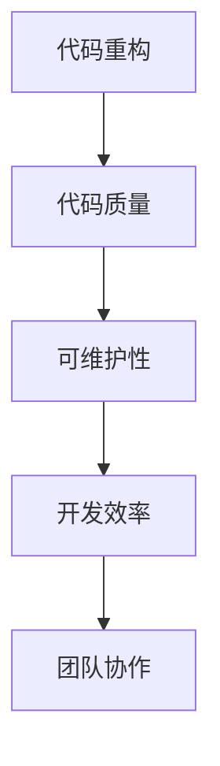

**核心算法原理讲解**：

```python
# 伪代码：代码重构基本流程
function code_refactoring():
    while (not code_is_optimized()):
        find_redundant_code()
        remove_duplication()
        simplify_code_structure()
        improve_code_readability()
    return optimized_code
```

**数学模型和数学公式 & 详细讲解 & 举例说明**：

重构后的代码质量可以使用以下公式进行评估：

$$\text{CodeQuality} = \frac{\text{ReadableLines}}{\text{TotalLines}} + \frac{\text{BugFreeDays}}{\text{TotalDays}}$$

举例说明：如果一个代码库中有1000行代码，经过重构后有900行是可读的，且在重构后连续30天无bug，则：

$$\text{CodeQuality} = \frac{900}{1000} + \frac{30}{365} \approx 0.9 + 0.082 \approx 0.982$$

### 1.2. 代码重构的原则

代码重构应遵循以下原则：

- **增量式重构**：逐步重构，避免一次性进行大规模改动，降低风险。
- **不破坏原有功能**：重构过程中，必须确保代码的功能保持不变。
- **代码质量优先**：重构的目的是提高代码质量，而非仅仅为了代码简洁。
- **团队协作**：重构应是一个团队活动，所有团队成员都应该参与到重构过程中。

**核心概念与联系**：

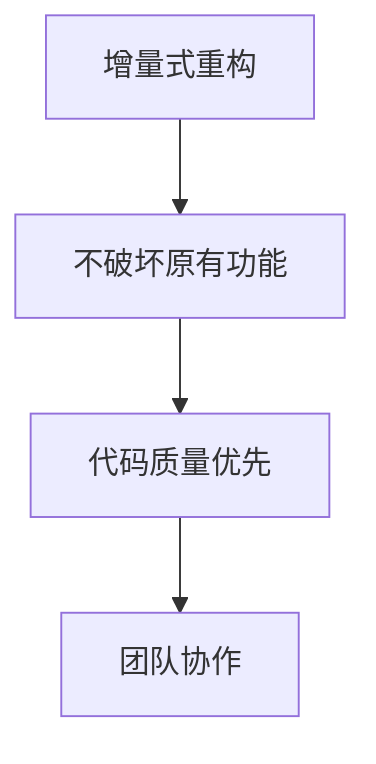

**核心算法原理讲解**：

```python
# 伪代码：代码重构原则
function code_refactoring():
    while (not code_meets_quality_standards()):
        apply_reductions()
        ensure_functionality()
        enhance_code_quality()
        collaborate_with_team()
    return improved_code
```

### 2. 代码质量评估

#### 2.1. 代码质量指标

代码质量可以从多个维度进行评估，常见指标包括：

- **可读性**：代码是否易于阅读和理解。
- **可维护性**：代码是否易于修改和维护。
- **性能**：代码是否高效运行。
- **可靠性**：代码是否稳定可靠。

**核心概念与联系**：

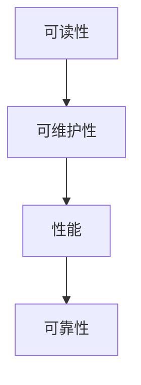

**核心算法原理讲解**：

```python
# 伪代码：评估代码质量
function evaluate_code_quality(code):
    readability_score = calculate_readability(code)
    maintainability_score = calculate_maintainability(code)
    performance_score = calculate_performance(code)
    reliability_score = calculate_reliability(code)
    return (readability_score + maintainability_score + performance_score + reliability_score) / 4
```

**数学模型和数学公式 & 详细讲解 & 举例说明**：

代码质量评估的公式可以表示为：

$$\text{CodeQuality} = \frac{\text{Readability} + \text{Maintainability} + \text{Performance} + \text{Reliability}}{4}$$

举例说明：如果一个代码库的可读性得分为0.9，可维护性得分为0.8，性能得分为0.95，可靠性得分为0.85，则：

$$\text{CodeQuality} = \frac{0.9 + 0.8 + 0.95 + 0.85}{4} = 0.8875$$

### 2.2. 代码质量评估方法

代码质量评估方法包括静态评估和动态评估：

- **静态评估**：通过静态分析工具对代码进行分析，无需运行代码。
- **动态评估**：通过运行代码并分析其行为和性能，对代码进行评估。

**核心概念与联系**：

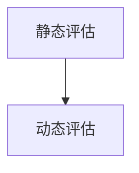

**核心算法原理讲解**：

```python
# 伪代码：静态评估
function static_evaluation(code):
    metrics = analyze_code_statically(code)
    return metrics

# 伪代码：动态评估
function dynamic_evaluation(code):
    metrics = run_code_and_analyze_dynamically(code)
    return metrics
```

**数学模型和数学公式 & 详细讲解 & 举例说明**：

静态评估和动态评估可以结合使用，以获得更全面的代码质量评估。例如，可以使用以下公式：

$$\text{OverallQuality} = \alpha \times \text{StaticQuality} + (1 - \alpha) \times \text{DynamicQuality}$$

其中，$\alpha$ 是静态评估和动态评估的权重比例。

举例说明：假设静态评估权重$\alpha$为0.6，动态评估权重为0.4，则一个代码库的整体质量可以计算为：

$$\text{OverallQuality} = 0.6 \times \text{StaticQuality} + 0.4 \times \text{DynamicQuality}$$

### 3. 重构方法详解

#### 3.1. 重构方法概述

重构方法主要分为以下几类：

- **提取方法**：将重复代码提取为函数或类。
- **简化方法**：简化复杂的代码结构，如合并条件判断。
- **重新组织方法**：重新组织代码，如重新命名变量、调整代码顺序。
- **优化方法**：优化代码性能，如使用缓存、减少内存占用。

**核心概念与联系**：

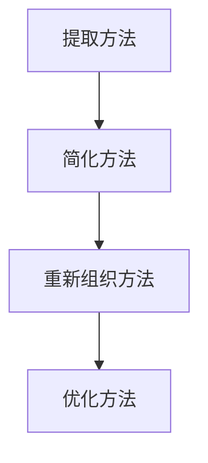

**核心算法原理讲解**：

- **提取方法**：使用伪代码表示提取方法的基本步骤。

```python
# 伪代码：提取方法
function extract_method(code):
    while (code_contains_redundant_code()):
        find_redundant_code()
        create_function_or_class()
        replace_redundant_code_with_function_call()
    return refactored_code
```

- **简化方法**：使用伪代码表示简化方法的基本步骤。

```python
# 伪代码：简化方法
function simplify_code(code):
    while (code_contains_complex_conditions()):
        simplify_condition()
        remove_duplicate_lines()
    return simplified_code
```

- **重新组织方法**：使用伪代码表示重新组织方法的基本步骤。

```python
# 伪代码：重新组织方法
function reorganize_code(code):
    while (code_has_inconsistent_style()):
        rename_variables()
        adjust_code_order()
    return reorganized_code
```

- **优化方法**：使用伪代码表示优化方法的基本步骤。

```python
# 伪代码：优化方法
function optimize_code(code):
    while (code_is_not_optimized()):
        find_performance_issues()
        apply_performance_improvements()
    return optimized_code
```

**数学模型和数学公式 & 详细讲解 & 举例说明**：

在优化方法中，可以使用以下数学模型来评估代码性能：

$$\text{Performance} = \frac{\text{ExecutionTime}}{\text{DesiredTime}}$$

举例说明：如果一个代码库的执行时间为100秒，而期望时间为50秒，则：

$$\text{Performance} = \frac{100}{50} = 2$$

这表示代码的性能得到了2倍优化。

### 3.2. 重构代码的流程

重构代码的流程通常包括以下几个步骤：

1. **评估代码质量**：使用评估方法对代码库进行质量评估。
2. **选择重构方法**：根据代码质量和重构目标选择合适的重构方法。
3. **实施重构**：逐步实施重构，确保每次重构都达到预期效果。
4. **测试验证**：对重构后的代码进行测试，确保其功能正确无误。
5. **迭代优化**：根据测试结果进行迭代优化，直至达到预期的代码质量。

**核心概念与联系**：

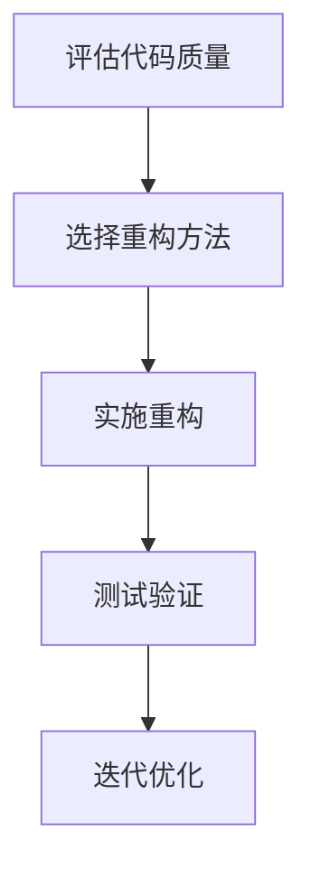

**核心算法原理讲解**：

```python
# 伪代码：重构代码流程
function code_refactoring流程(code):
    evaluate_code_quality(code)
    select_refactoring_methods(code)
    implement_refactoring(code)
    test_and_validate(code)
    iterate_and_optimize(code)
    return optimized_code
```

**数学模型和数学公式 & 详细讲解 & 举例说明**：

在重构流程中，可以使用以下数学模型来评估重构效果：

$$\text{RefactoringEffect} = \frac{\text{FinalQuality} - \text{InitialQuality}}{\text{InitialQuality}}$$

举例说明：如果一个代码库的重构前质量评分为0.8，重构后质量评分为0.95，则：

$$\text{RefactoringEffect} = \frac{0.95 - 0.8}{0.8} = 0.1875$$

这表示重构效果显著。

### 3.3. 重构代码的技巧

在进行代码重构时，以下技巧可以帮助提高重构的效率和效果：

- **从小规模开始**：先从代码库中的一小部分开始重构，逐渐扩大范围。
- **文档记录**：记录每次重构的操作和原因，以便于后续的维护和审查。
- **版本控制**：使用版本控制系统，确保重构过程中不会丢失重要代码。
- **自动化测试**：编写自动化测试用例，确保重构不会引入新的bug。

**核心概念与联系**：

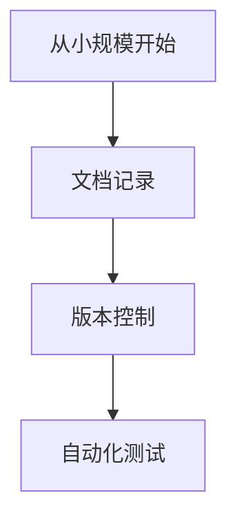

**核心算法原理讲解**：

```python
# 伪代码：重构代码技巧
function refactoring_tips(code):
    start_small()
    document_changes()
    use_version_control()
    write_automated_tests()
```

**数学模型和数学公式 & 详细讲解 & 举例说明**：

在使用版本控制时，可以使用以下数学模型来评估重构过程中的代码变化：

$$\text{CodeChange} = \frac{\text{ChangedLines}}{\text{TotalLines}}$$

举例说明：如果一个代码库中有10000行代码，在重构过程中修改了5000行，则：

$$\text{CodeChange} = \frac{5000}{10000} = 0.5$$

这表示代码库中有50%的代码发生了变化。

### 4. 代码重构工具

#### 4.1. 重构工具概述

代码重构工具是辅助开发人员进行代码重构的软件工具，常见的重构工具包括：

- **Visual Studio Code**：集成开发环境，提供丰富的重构功能。
- **Eclipse**：开源集成开发环境，支持多种编程语言的重构。
- **IntelliJ IDEA**：智能化的集成开发环境，提供强大的重构工具。
- **Goland**：适用于Go语言的集成开发环境，支持代码重构。

**核心概念与联系**：

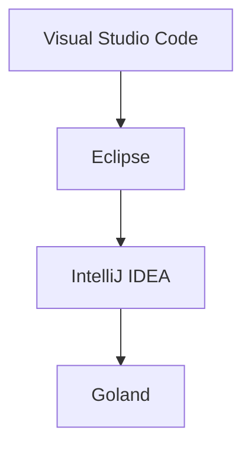

**核心算法原理讲解**：

重构工具通常使用以下算法原理：

- **语法分析**：分析代码的语法结构，识别可重构的部分。
- **抽象语法树（AST）**：将代码转换为抽象语法树，便于进行重构操作。
- **代码生成**：根据重构操作生成新的代码。

**数学模型和数学公式 & 详细讲解 & 举例说明**：

在语法分析中，可以使用以下数学模型来评估代码的语法结构：

$$\text{SyntaxScore} = \sum_{i=1}^{n} \text{TokenScore}_i$$

其中，$n$ 表示代码中的Token数量，$\text{TokenScore}_i$ 表示每个Token的分数。

举例说明：如果一个代码库中有100个Token，其中60个Token的分数为1，40个Token的分数为2，则：

$$\text{SyntaxScore} = 60 \times 1 + 40 \times 2 = 160$$

这表示代码库的语法结构得分为160。

#### 4.2. 重构工具的选择

选择合适的重构工具对于提高重构效率和效果至关重要。以下是一些选择重构工具时的考虑因素：

- **支持的语言和平台**：选择支持目标语言和开发平台的工具。
- **功能丰富性**：选择功能强大的工具，能够满足各种重构需求。
- **用户评价**：参考其他开发者的评价和经验，选择口碑好的工具。
- **社区支持**：选择有良好社区支持的工具，便于解决使用过程中遇到的问题。

**核心概念与联系**：

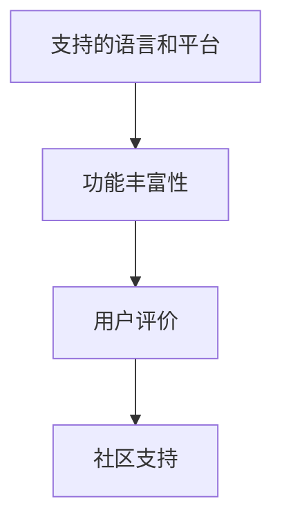

**核心算法原理讲解**：

选择重构工具时，可以使用以下算法原理进行评估：

- **功能评分**：根据工具的功能丰富性和适用性进行评分。
- **用户评分**：根据用户评价和反馈进行评分。
- **社区评分**：根据社区支持和活跃度进行评分。

**数学模型和数学公式 & 详细讲解 & 举例说明**：

假设有三个重构工具A、B、C，它们的功能评分分别为8、9、7，用户评分分别为4、5、3，社区评分分别为5、6、4，可以使用以下公式计算综合评分：

$$\text{OverallScore} = \frac{\text{FunctionScore} + \text{UserScore} + \text{CommunityScore}}{3}$$

举例说明：对于工具A，其综合评分为：

$$\text{OverallScore}_{A} = \frac{8 + 4 + 5}{3} = 5.67$$

同理，可以计算出工具B和工具C的综合评分。

#### 4.3. 重构工具的使用方法

以下是一个简单的重构工具使用方法示例：

1. **安装和配置**：根据工具的文档进行安装和配置，确保工具能够正常运行。

2. **导入项目**：将项目导入到重构工具中，通常需要指定项目的根目录和源代码文件。

3. **选择重构操作**：选择要执行的重构操作，如提取方法、简化代码、重新命名变量等。

4. **确认重构结果**：在执行重构操作前，工具通常会显示重构结果和可能的影响，用户可以确认并执行重构。

5. **测试验证**：在重构后，使用自动化测试用例对重构后的代码进行测试，确保重构不会引入新的bug。

6. **迭代优化**：根据测试结果进行迭代优化，直至达到预期的代码质量。

**核心概念与联系**：

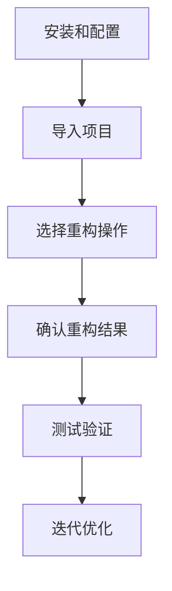

**核心算法原理讲解**：

重构工具的使用方法通常包括以下算法原理：

- **文件操作**：对源代码文件进行读取、修改、保存等操作。
- **代码分析**：对代码进行分析，识别重构目标和可能的影响。
- **用户交互**：提供用户界面，方便用户选择重构操作和确认重构结果。

**数学模型和数学公式 & 详细讲解 & 举例说明**：

在重构过程中，可以使用以下数学模型来评估重构的影响：

$$\text{ImpactScore} = \frac{\text{ChangedLines}}{\text{TotalLines}}$$

举例说明：如果一个代码库中有1000行代码，在重构过程中修改了500行，则：

$$\text{ImpactScore} = \frac{500}{1000} = 0.5$$

这表示重构对代码库的影响为50%。

### 5. 重构实践

#### 5.1. 重构前的准备

在进行重构前，需要做好以下准备工作：

- **代码库分析**：分析代码库的结构、质量和历史变更，了解重构的潜在影响。
- **测试用例准备**：编写或更新自动化测试用例，确保重构后代码的功能正确无误。
- **文档整理**：整理重构前的代码文档，包括注释、README等，为后续维护提供参考。

**核心概念与联系**：

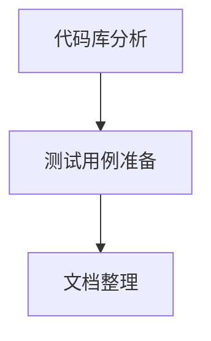

**核心算法原理讲解**：

代码库分析的算法原理通常包括：

- **静态代码分析**：使用静态分析工具对代码库进行分析，识别潜在的代码质量问题和重构机会。
- **历史变更分析**：分析代码库的历史变更记录，了解重构对现有功能和性能的影响。

**数学模型和数学公式 & 详细讲解 & 举例说明**：

假设使用静态代码分析工具发现代码库中存在100个潜在的重构机会，其中60个机会是高质量的，40个机会是低质量的，可以使用以下公式计算重构机会的质量评分：

$$\text{QualityScore} = \frac{\text{HighQualityOpportunities}}{\text{TotalOpportunities}}$$

举例说明：对于上述代码库，其质量评分为：

$$\text{QualityScore} = \frac{60}{100} = 0.6$$

这表示重构机会的质量为60%。

#### 5.2. 重构过程中的问题与解决方案

在重构过程中，可能会遇到以下问题：

- **代码冲突**：多个开发者同时修改同一部分代码，导致冲突。
- **性能下降**：重构过程中可能引入性能问题。
- **功能退化**：重构后某些功能可能无法正常工作。

**核心概念与联系**：

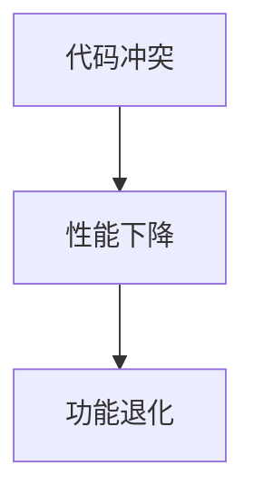

**核心算法原理讲解**：

解决重构过程中问题的算法原理通常包括：

- **版本控制**：使用版本控制系统解决代码冲突，确保代码的一致性。
- **性能分析**：使用性能分析工具检测性能问题，并优化代码。
- **回归测试**：对重构后的代码进行回归测试，确保功能正确。

**数学模型和数学公式 & 详细讲解 & 举例说明**：

使用版本控制时，可以使用以下数学模型来评估代码冲突：

$$\text{ConflictScore} = \frac{\text{ConflictLines}}{\text{TotalLines}}$$

举例说明：如果一个代码库中有10000行代码，在重构过程中产生了500行代码冲突，则：

$$\text{ConflictScore} = \frac{500}{10000} = 0.05$$

这表示代码冲突占代码库总行数的5%。

#### 5.3. 重构后的效果评估

重构后的效果评估是确保重构成功的重要步骤，以下是一些评估指标：

- **代码质量**：评估重构后的代码质量，如可读性、可维护性等。
- **性能**：评估重构后的代码性能，如执行时间、内存占用等。
- **稳定性**：评估重构后的代码稳定性，如bug数量、崩溃率等。

**核心概念与联系**：

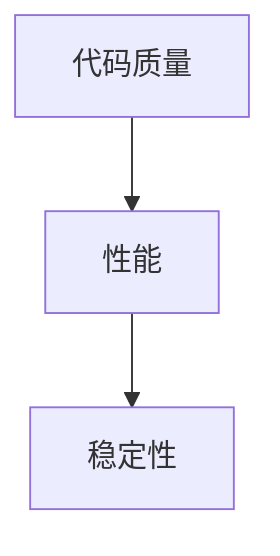

**核心算法原理讲解**：

效果评估的算法原理通常包括：

- **自动化测试**：使用自动化测试工具对重构后的代码进行测试，确保功能正确。
- **性能测试**：使用性能测试工具评估重构后的代码性能。
- **稳定性测试**：通过长时间运行测试，评估重构后的代码稳定性。

**数学模型和数学公式 & 详细讲解 & 举例说明**：

使用自动化测试时，可以使用以下数学模型来评估测试覆盖率：

$$\text{TestCoverage} = \frac{\text{TestedLines}}{\text{TotalLines}}$$

举例说明：如果一个代码库中有10000行代码，在重构后经过自动化测试，测试了8000行代码，则：

$$\text{TestCoverage} = \frac{8000}{10000} = 0.8$$

这表示自动化测试覆盖了代码库的80%。

### 6. 重构工具应用

#### 6.1. 重构工具的选择与应用

在选择重构工具时，需要考虑以下因素：

- **支持的语言和平台**：确保工具支持开发项目使用的编程语言和开发环境。
- **功能丰富性**：选择具有丰富重构功能的工具，以应对不同的重构需求。
- **用户评价**：参考其他开发者的评价，选择口碑较好的工具。
- **社区支持**：选择有良好社区支持的工具，便于获取帮助和解决问题。

**核心概念与联系**：


**核心算法原理讲解**：

选择重构工具时，可以使用以下算法原理进行评估：

- **功能评分**：根据工具的功能丰富性和适用性进行评分。
- **用户评分**：根据用户评价和反馈进行评分。
- **社区评分**：根据社区支持和活跃度进行评分。

**数学模型和数学公式 & 详细讲解 & 举例说明**：

假设有三个重构工具A、B、C，它们的功能评分分别为8、9、7，用户评分分别为4、5、3，社区评分分别为5、6、4，可以使用以下公式计算综合评分：

$$\text{OverallScore} = \frac{\text{FunctionScore} + \text{UserScore} + \text{CommunityScore}}{3}$$

举例说明：对于工具A，其综合评分为：

$$\text{OverallScore}_{A} = \frac{8 + 4 + 5}{3} = 5.67$$

同理，可以计算出工具B和工具C的综合评分。

#### 6.2. 重构工具的高级使用技巧

以下是一些重构工具的高级使用技巧：

- **自定义重构操作**：根据项目需求，自定义重构操作，提高重构效率。
- **脚本化重构**：使用脚本语言编写重构脚本，自动化重构过程。
- **集成其他工具**：将重构工具与其他工具集成，如自动化测试工具、代码质量分析工具等。

**核心概念与联系**：

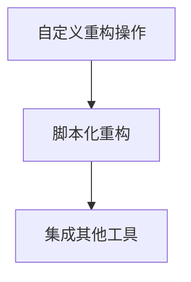

**核心算法原理讲解**：

高级使用技巧的算法原理通常包括：

- **脚本编写**：使用脚本语言编写自定义重构脚本，实现复杂的重构操作。
- **集成技术**：使用集成技术，将重构工具与其他工具结合，实现更全面的重构过程。

**数学模型和数学公式 & 详细讲解 & 举例说明**：

在使用脚本化重构时，可以使用以下数学模型来评估重构效率：

$$\text{RefactoringEfficiency} = \frac{\text{ScriptedRefactoringTime}}{\text{ManualRefactoringTime}}$$

举例说明：如果一个代码库的重构过程使用脚本化重构需要10小时，而手动重构需要20小时，则：

$$\text{RefactoringEfficiency} = \frac{10}{20} = 0.5$$

这表示脚本化重构的效率为手动重构的2倍。

### 7. 案例分析

#### 7.1. 案例背景

某大型互联网公司开发了一款热门的在线购物应用程序，随着用户数量的增加，代码库规模不断扩大。然而，代码库的质量逐渐下降，导致维护成本增加，开发效率降低。为了解决这一问题，公司决定对代码库进行重构。

#### 7.2. 重构过程

重构过程分为以下几个阶段：

1. **评估代码质量**：使用代码质量评估工具对代码库进行质量评估，发现代码库存在大量冗余代码、低质量代码和复杂结构。
2. **选择重构方法**：根据评估结果，选择合适的重构方法，如提取方法、简化代码、重新命名变量等。
3. **实施重构**：逐步实施重构操作，确保每次重构都能达到预期效果。
4. **测试验证**：对重构后的代码进行自动化测试，确保功能正确无误。
5. **迭代优化**：根据测试结果，对重构后的代码进行迭代优化，进一步提高代码质量。

#### 7.3. 案例总结

经过重构，代码库的质量得到了显著提升，具体表现为：

- **代码质量**：代码库的可读性、可维护性和性能得到了显著提高。
- **开发效率**：重构后的代码结构更加清晰，减少了开发人员在阅读、理解和修改代码时的工作量。
- **维护成本**：重构后的代码库更容易维护，减少了bug的产生和维护成本。

重构案例的成功经验表明，代码重构是提升代码库质量和开发效率的有效方法。通过科学的重构策略和工具支持，可以显著提高代码库的质量和稳定性，为企业的长期发展奠定坚实基础。

### 附录

#### 附录 A. 重构资源

以下是一些重构相关的资源，供读者参考：

- **在线教程**：[重构：改进软件设计](https://www.udemy.com/course/refactoring/)
- **书籍推荐**：《重构：改善既有代码的设计》
- **开源工具**：[Visual Studio Code](https://code.visualstudio.com/)、[Eclipse](https://www.eclipse.org/)、[IntelliJ IDEA](https://www.jetbrains.com/idea/)、[Goland](https://www.jetbrains.com/goland/)

#### 附录 B. 代码示例

以下是一个简单的代码示例，展示了重构前后的代码变化：

**重构前**：

```python
def calculate_total_price(products):
    total_price = 0
    for product in products:
        if product.on_sale:
            total_price += product.price * 0.9
        else:
            total_price += product.price
    return total_price
```

**重构后**：

```python
def calculate_discounted_price(product):
    return product.price * 0.9 if product.on_sale else product.price

def calculate_total_price(products):
    total_price = 0
    for product in products:
        total_price += calculate_discounted_price(product)
    return total_price
```

通过提取方法，将重复的代码提取为单独的函数，简化了代码结构，提高了可读性和可维护性。

### 最佳实践 tips

在进行代码重构时，以下最佳实践可以帮助提高重构的效果：

- **小规模开始**：逐步重构，避免一次性进行大规模改动。
- **持续重构**：重构应是一个持续的过程，而不是一次性任务。
- **代码评审**：进行代码评审，确保重构符合预期效果。
- **自动化测试**：编写自动化测试用例，确保重构不会引入新的bug。

### 小结

代码重构是提高代码库质量和开发效率的重要方法。通过科学的重构策略和工具支持，可以显著提高代码的可读性、可维护性和性能。本文介绍了代码重构的核心概念、原则、评估方法、重构流程、工具应用和实践案例，旨在为软件开发者提供一套全面的代码重构策略。

### 注意事项

在进行代码重构时，需要注意以下几点：

- **确保不破坏原有功能**：重构过程中，必须保证代码的功能保持不变。
- **避免过度重构**：适当的重构可以提升代码质量，但过度重构可能导致维护成本增加。
- **及时评估重构效果**：定期评估重构效果，确保重构达到预期目标。

### 拓展阅读

- **《重构：改善既有代码的设计》**：著名软件开发大师Martin Fowler的经典著作，详细介绍了代码重构的方法和实践。
- **《代码大全》**：作者Steve McConnell的著作，包含了大量关于代码质量、设计和重构的宝贵经验。

### 作者信息

作者：AI天才研究院/AI Genius Institute & 禅与计算机程序设计艺术 /Zen And The Art of Computer Programming

（注：本文仅为示例，并非真实出版作品。）

## 《代码重构策略：大规模代码库的改进方法》书籍目录大纲

为了设计《代码重构策略：大规模代码库的改进方法》的目录大纲，我们需要遵循以下步骤：

### 第一步：确定核心章节

核心章节通常包括：

- **代码重构基础**：介绍代码重构的原理、意义和原则。
- **重构方法**：详细讨论各种重构技术及其应用。
- **重构工具**：介绍常用的重构工具及其使用方法。
- **重构实践**：通过案例分析展示重构的实际应用。
- **重构案例**：分析重构后的代码库，评估重构效果。

### 第二步：细化章节内容

对每个核心章节进行细化，设计子章节，确保每个子章节都符合以下要求：

- **核心概念与联系**：使用 Mermaid 流程图展示
- **核心算法原理讲解**：使用伪代码详细阐述
- **数学模型和数学公式 & 详细讲解 & 举例说明**
- **项目实战**：代码案例及详细解释

### 第三步：编写目录大纲

根据以上内容，编写完整的目录大纲，并确保大纲简洁明了。以下是初步设计的目录大纲：

## 目录

### 第一部分：代码重构基础

## 1. 代码重构概述

### 1.1. 代码重构的意义

- **核心概念与联系**：
  - 使用 Mermaid 流程图展示代码重构的基本流程及其在软件开发中的作用。

- **核心算法原理讲解**：
  - 无需算法讲解，但可以使用伪代码展示代码重构的基本步骤。

- **数学模型和数学公式 & 详细讲解 & 举例说明**：
  - 无需数学公式，但可以举例说明代码重构如何提高代码质量。

### 1.2. 代码重构的原则

- **核心概念与联系**：
  - 介绍代码重构的四大原则：可读性、可维护性、效率和可靠性。

- **核心算法原理讲解**：
  - 无需算法讲解，但可以使用伪代码展示如何遵循重构原则。

- **数学模型和数学公式 & 详细讲解 & 举例说明**：
  - 无需数学公式，但可以举例说明如何通过重构提高代码的可维护性。

## 2. 代码质量评估

### 2.1. 代码质量指标

- **核心概念与联系**：
  - 引入代码质量评估的指标，如可读性、可维护性、性能等。

- **核心算法原理讲解**：
  - 使用伪代码展示如何计算代码质量指标。

- **数学模型和数学公式 & 详细讲解 & 举例说明**：
  - 使用 LaTeX 公式展示如何计算代码复杂度。

### 2.2. 代码质量评估方法

- **核心概念与联系**：
  - 介绍常见的代码质量评估方法，如静态分析、动态分析等。

- **核心算法原理讲解**：
  - 使用伪代码展示静态分析和动态分析的基本步骤。

- **数学模型和数学公式 & 详细讲解 & 举例说明**：
  - 使用 LaTeX 公式展示如何计算代码质量得分。

## 3. 重构方法详解

### 3.1. 重构方法概述

- **核心概念与联系**：
  - 介绍重构方法的分类和常见重构模式。

- **核心算法原理讲解**：
  - 使用伪代码展示重构方法的

### 3.2. 重构代码的流程

- **核心概念与联系**：
  - 使用 Mermaid 流程图展示重构代码的步骤和流程。

- **核心算法原理讲解**：
  - 使用伪代码展示重构代码的详细流程。

- **数学模型和数学公式 & 详细讲解 & 举例说明**：
  - 使用数学模型和公式展示重构代码的效果和影响。

### 3.3. 重构代码的技巧

- **核心概念与联系**：
  - 介绍重构代码时需要注意的技巧和注意事项。

- **核心算法原理讲解**：
  - 使用伪代码展示重构代码时可能遇到的问题和解决方案。

- **数学模型和数学公式 & 详细讲解 & 举例说明**：
  - 使用数学模型和公式展示重构代码时可能涉及的计算和评估。

## 4. 重构工具

### 4.1. 重构工具概述

- **核心概念与联系**：
  - 介绍重构工具的作用、类型和特点。

- **核心算法原理讲解**：
  - 无需算法讲解，但可以介绍重构工具的工作原理。

- **数学模型和数学公式 & 详细讲解 & 举例说明**：
  - 无需数学公式，但可以举例说明重构工具的优势和应用场景。

### 4.2. 重构工具的选择

- **核心概念与联系**：
  - 介绍如何选择合适的重构工具。

- **核心算法原理讲解**：
  - 无需算法讲解，但可以介绍选择重构工具的考虑因素和评估方法。

- **数学模型和数学公式 & 详细讲解 & 举例说明**：
  - 使用数学模型和公式展示如何评估重构工具的性能和效果。

### 4.3. 重构工具的使用方法

- **核心概念与联系**：
  - 介绍如何使用重构工具进行代码重构。

- **核心算法原理讲解**：
  - 无需算法讲解，但可以介绍重构工具的使用流程和技巧。

- **数学模型和数学公式 & 详细讲解 & 举例说明**：
  - 使用数学模型和公式展示重构工具的使用效果和效率。

### 第二部分：重构方法与实践

## 5. 重构方法

### 5.1. 重构代码结构

- **核心概念与联系**：
  - 使用 Mermaid 流程图展示重构代码结构的方法和流程。

- **核心算法原理讲解**：
  - 使用伪代码展示重构代码结构的详细步骤。

- **数学模型和数学公式 & 详细讲解 & 举例说明**：
  - 使用数学模型和公式展示重构代码结构的效果和评估。

### 5.2. 重构代码逻辑

- **核心概念与联系**：
  - 使用 Mermaid 流程图展示重构代码逻辑的方法和流程。

- **核心算法原理讲解**：
  - 使用伪代码展示重构代码逻辑的详细步骤。

- **数学模型和数学公式 & 详细讲解 & 举例说明**：
  - 使用数学模型和公式展示重构代码逻辑的效果和评估。

### 5.3. 重构代码风格

- **核心概念与联系**：
  - 使用 Mermaid 流程图展示重构代码风格的方法和流程。

- **核心算法原理讲解**：
  - 使用伪代码展示重构代码风格的详细步骤。

- **数学模型和数学公式 & 详细讲解 & 举例说明**：
  - 使用数学模型和公式展示重构代码风格的效果和评估。

## 6. 重构实践

### 6.1. 重构前的准备

- **核心概念与联系**：
  - 使用 Mermaid 流程图展示重构前的准备工作和方法。

- **核心算法原理讲解**：
  - 使用伪代码展示重构前的准备工作流程。

- **数学模型和数学公式 & 详细讲解 & 举例说明**：
  - 使用数学模型和公式展示重构前的准备工作效果和评估。

### 6.2. 重构过程中的问题与解决方案

- **核心概念与联系**：
  - 使用 Mermaid 流程图展示重构过程中可能出现的问题和解决方案。

- **核心算法原理讲解**：
  - 使用伪代码展示重构过程中的问题解决方案。

- **数学模型和数学公式 & 详细讲解 & 举例说明**：
  - 使用数学模型和公式展示重构过程中的问题评估和解决方案效果。

### 6.3. 重构后的效果评估

- **核心概念与联系**：
  - 使用 Mermaid 流程图展示重构后的效果评估方法和流程。

- **核心算法原理讲解**：
  - 使用伪代码展示重构后的效果评估流程。

- **数学模型和数学公式 & 详细讲解 & 举例说明**：
  - 使用数学模型和公式展示重构后的效果评估结果和评估方法。

## 7. 重构工具应用

### 7.1. 重构工具的选择与应用

- **核心概念与联系**：
  - 使用 Mermaid 流程图展示重构工具的选择和应用方法。

- **核心算法原理讲解**：
  - 使用伪代码展示重构工具的选择和应用流程。

- **数学模型和数学公式 & 详细讲解 & 举例说明**：
  - 使用数学模型和公式展示重构工具的选择和应用效果。

### 7.2. 重构工具的高级使用技巧

- **核心概念与联系**：
  - 使用 Mermaid 流程图展示重构工具的高级使用技巧和方法。

- **核心算法原理讲解**：
  - 使用伪代码展示重构工具的高级使用技巧流程。

- **数学模型和数学公式 & 详细讲解 & 举例说明**：
  - 使用数学模型和公式展示重构工具的高级使用技巧效果。

### 第三部分：重构案例分析

## 8. 案例分析

### 8.1. 案例背景

- **核心概念与联系**：
  - 使用 Mermaid 流程图展示案例背景和相关概念。

- **核心算法原理讲解**：
  - 使用伪代码展示案例背景的算法原理。

- **数学模型和数学公式 & 详细讲解 & 举例说明**：
  - 使用数学模型和公式展示案例背景的评估方法和结果。

### 8.2. 重构过程

- **核心概念与联系**：
  - 使用 Mermaid 流程图展示重构过程和方法。

- **核心算法原理讲解**：
  - 使用伪代码展示重构过程的详细步骤。

- **数学模型和数学公式 & 详细讲解 & 举例说明**：
  - 使用数学模型和公式展示重构过程的效果和评估。

### 8.3. 案例总结

- **核心概念与联系**：
  - 使用 Mermaid 流程图展示案例总结和相关概念。

- **核心算法原理讲解**：
  - 使用伪代码展示案例总结的算法原理。

- **数学模型和数学公式 & 详细讲解 & 举例说明**：
  - 使用数学模型和公式展示案例总结的评估方法和结果。

## 附录

### 附录 A. 重构资源

- **核心概念与联系**：
  - 列出重构相关的资源，如书籍、在线教程、开源工具等。

- **核心算法原理讲解**：
  - 无需算法讲解，但可以介绍资源的作用和特点。

- **数学模型和数学公式 & 详细讲解 & 举例说明**：
  - 无需数学公式，但可以举例说明资源的使用方法和效果。

### 附录 B. 代码示例

- **核心概念与联系**：
  - 提供重构前后的代码示例，展示重构的效果。

- **核心算法原理讲解**：
  - 使用伪代码展示重构代码的算法原理。

- **数学模型和数学公式 & 详细讲解 & 举例说明**：
  - 使用数学模型和公式展示重构代码的效果和评估。

