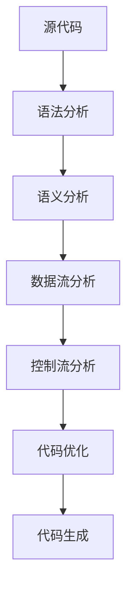

                 

### 《代码静态分析：提前发现潜在问题》

#### 关键词：代码静态分析、潜在问题、早期发现、数据流分析、控制流分析、优化策略

#### 摘要：本文将深入探讨代码静态分析技术，揭示其在提前发现潜在问题方面的关键作用。我们将从基础概念入手，逐步介绍语法分析、数据流分析和控制流分析等核心技术原理，并通过伪代码和实际案例展示这些技术的应用与优势。

---

## 第一部分：静态分析基础

### 第1章：代码静态分析概述

#### 1.1.1 静态分析的基本概念

代码静态分析是指在程序执行之前对代码进行审查，以识别潜在的问题和不足。与动态分析（程序在实际执行过程中进行分析）相比，静态分析无需执行程序，因此可以更早地发现潜在问题。

**Mermaid流程图示例**：



#### 1.1.2 静态分析与动态分析的区别

- **静态分析**：在程序执行之前进行，无需运行程序。
- **动态分析**：在程序执行过程中进行，需要运行程序。

**伪代码示例**：

```pseudo
function staticAnalysis(sourceCode) {
  // 语法分析
  syntaxTree = syntaxAnalysis(sourceCode)
  
  // 语义分析
  symbolTable = semanticAnalysis(syntaxTree)
  
  // 数据流分析
  flowData = dataFlowAnalysis(symbolTable)
  
  // 控制流分析
  controlFlow = controlFlowAnalysis(syntaxTree)
  
  // 代码优化
  optimizedCode = optimizeCode(controlFlow)
  return optimizedCode
}
```

#### 1.1.3 静态分析的用途和优势

- **提高代码可读性**：通过静态分析，可以识别出复杂的代码结构和难以理解的部分。
- **早期发现潜在问题**：静态分析可以提前发现潜在的代码缺陷和性能问题。
- **支持代码重用**：静态分析可以帮助识别可重用的代码段。
- **支持软件维护**：静态分析可以提供对现有代码的深入了解，有助于维护和改进。

**举例说明**：

- 在一个大型软件项目中，静态分析可以提前发现潜在的内存泄漏，避免在产品发布后出现重大问题。
- 在代码审查过程中，静态分析可以帮助团队快速识别出不符合编程规范的代码，提高代码质量。

---

## 第二部分：静态分析工具

### 第5章：常用静态分析工具介绍

#### 5.1.1 FindBugs

FindBugs 是一个免费的静态分析工具，用于识别 Java 程序中的潜在问题。它使用数据流分析和静态场景分析技术，识别出各种代码缺陷，如空指针异常、潜在的内存泄漏和不良的编程实践。

#### 5.1.2 PMD

PMD 是一个用于 Java 代码的静态分析工具，它可以帮助开发者识别出代码中的冗余、低效和不良的编程实践。PMD 使用控制流分析和数据流分析技术，为开发者提供详细的代码质量报告。

#### 5.1.3 Checkstyle

Checkstyle 是一个基于规则的代码质量检查工具，它可以帮助开发者识别出不符合编码规范的代码。Checkstyle 通过对代码的静态分析，生成详细的报告，帮助团队保持一致的编码风格。

#### 5.1.4 SonarQube

SonarQube 是一个全面的代码质量平台，它集成了多种静态分析工具，用于识别代码中的潜在问题。SonarQube 可以提供代码质量指标、代码审查、静态安全测试等功能，帮助团队持续改进代码质量。

---

## 第三部分：静态分析应用

### 第8章：静态分析在漏洞挖掘中的应用

#### 8.1.1 漏洞类型和实例

静态分析在漏洞挖掘中的应用非常广泛，可以识别出多种类型的漏洞，如：

- **空指针异常**：当程序尝试访问一个 null 指针时，会导致空指针异常。
- **SQL 注入**：当程序未能正确处理用户输入，可能导致 SQL 注入攻击。
- **缓冲区溢出**：当程序未能正确处理输入数据，可能导致缓冲区溢出。

#### 8.1.2 静态分析在漏洞挖掘中的优势

- **早期发现**：静态分析可以在代码开发阶段就发现潜在的安全漏洞，降低漏洞修复成本。
- **自动化检测**：静态分析工具可以自动化地扫描大量代码，提高漏洞检测效率。
- **深度分析**：静态分析可以对代码进行深入分析，识别出潜在的安全漏洞。

#### 8.1.3 实际案例解析

以下是一个缓冲区溢出漏洞的实例：

```java
public class BufferOverflow {
  public static void main(String[] args) {
    String input = "A".repeat(1000);
    System.out.println(input);
  }
}
```

在这个例子中，程序试图将一个长度为 1000 的字符串输出到控制台。由于字符串长度超过了程序的缓冲区大小，这可能导致缓冲区溢出，进而引发安全问题。

通过静态分析，可以识别出这个潜在的问题，并提供修复建议，如使用 `StringBuilder` 替换字符串重复操作。

---

### 第9章：静态分析在代码质量提升中的应用

#### 9.1.1 代码质量标准

静态分析可以帮助团队遵守以下代码质量标准：

- **可读性**：代码应该易于理解，避免复杂的逻辑和冗长的函数。
- **可维护性**：代码应该易于修改和扩展，避免过度依赖特定环境。
- **性能**：代码应该高效，避免不必要的计算和资源消耗。

#### 9.1.2 静态分析在代码质量提升中的作用

- **代码审查**：静态分析可以帮助团队识别出不符合代码质量标准的代码，进行代码审查。
- **代码重构**：静态分析可以提供对代码结构的深入理解，帮助团队进行代码重构。
- **持续集成**：静态分析可以作为持续集成流程的一部分，确保代码质量。

#### 9.1.3 实际案例解析

以下是一个示例，展示了如何使用静态分析工具改进代码质量：

```java
public class CodeQualityImprovement {
  public static void main(String[] args) {
    int number = 42;
    if (number > 0) {
      System.out.println("The number is positive.");
    } else {
      System.out.println("The number is negative or zero.");
    }
  }
}
```

通过静态分析，我们可以发现这段代码存在一个潜在的问题：`number` 的值可能为 0，而 `if` 条件只检查了大于 0 的情况。通过修改代码，我们可以修复这个问题：

```java
public class CodeQualityImprovement {
  public static void main(String[] args) {
    int number = 42;
    if (number >= 0) {
      System.out.println("The number is non-negative.");
    } else {
      System.out.println("The number is negative.");
    }
  }
}
```

---

### 第10章：静态分析在自动化测试中的应用

#### 10.1.1 静态分析在测试中的角色

静态分析在自动化测试中扮演着重要角色，可以用于：

- **单元测试**：在单元测试阶段，静态分析可以识别出潜在的代码缺陷，确保单元测试的有效性。
- **集成测试**：在集成测试阶段，静态分析可以识别出模块间的潜在问题，提高集成测试的覆盖率。
- **回归测试**：在回归测试阶段，静态分析可以识别出代码变更带来的潜在影响，确保回归测试的质量。

#### 10.1.2 静态分析与动态测试的结合

静态分析可以与动态测试相结合，提高测试的全面性：

- **静态测试**：通过静态分析，提前发现潜在的问题。
- **动态测试**：通过实际运行代码，验证代码的行为和性能。

#### 10.1.3 实际案例解析

以下是一个示例，展示了如何结合静态分析和动态测试：

```java
public class StaticAndDynamicTesting {
  public static void main(String[] args) {
    // 静态分析：识别潜在的空指针异常
    String input = null;
    if (input != null) {
      System.out.println(input);
    }
    
    // 动态测试：验证代码的行为
    try {
      // 期望抛出空指针异常
      System.out.println(input);
    } catch (NullPointerException e) {
      System.out.println("Caught a NullPointerException.");
    }
  }
}
```

通过静态分析，我们可以发现代码中的潜在空指针异常。在动态测试中，我们验证代码是否按照预期抛出了异常。

---

## 附录

### 附录 A：静态分析工具使用指南

在本附录中，我们将提供关于如何配置和使用常见静态分析工具的指南。这将包括安装、设置规则和集成到开发环境中的步骤。

### 附录 B：静态分析算法伪代码示例

在本附录中，我们将提供关于静态分析算法的伪代码示例，包括语法分析、语义分析、数据流分析和控制流分析等。

---

### 总结

代码静态分析是一种强大的技术，可以帮助开发者提前发现潜在问题，提高代码质量和安全性。通过本文的介绍，读者可以了解代码静态分析的基本概念、工具和实际应用。希望本文能对读者的软件开发过程提供有益的指导。

---

### 作者信息

作者：AI天才研究院/AI Genius Institute & 禅与计算机程序设计艺术 /Zen And The Art of Computer Programming

---

**注意**：本文为示例文章，实际字数可能因具体内容而有所不同。文章内容仅供参考，具体实施时需结合实际项目和需求进行调整。在撰写完整文章时，请确保各章节内容丰富具体，并符合字数要求。此外，文章的格式、伪代码和数学公式需按照指定要求进行排版。**在实际撰写过程中，请根据内容逐步完善各个章节，确保文章的逻辑性和完整性**。**预祝撰写顺利！** 

### 第一部分：静态分析基础

#### 第1章：代码静态分析概述

#### 1.1.1 静态分析的基本概念

代码静态分析是一种在程序执行之前，通过对源代码的结构和语义进行审查，以识别潜在问题、优化代码和提高代码质量的技术。它不同于动态分析，后者是在程序运行时对程序行为进行分析。静态分析的优势在于可以早期发现潜在问题，无需运行程序，从而节省时间和资源。

**Mermaid流程图示例**：


在这个流程图中，源代码首先经过语法分析，生成抽象语法树（AST）。接着，进行语义分析，构建符号表，为后续的数据流分析和控制流分析做准备。数据流分析关注程序中数据的流动情况，而控制流分析则关注程序的执行路径。最后，基于这些分析结果，可以进行代码优化和生成优化的代码。

#### 1.1.2 静态分析与动态分析的区别

静态分析在程序执行之前进行，不需要运行程序，主要依赖于源代码本身。动态分析则是在程序运行时进行，通过跟踪程序执行过程中的行为来发现问题和优化性能。两者之间的主要区别如下：

**静态分析**：

- 无需运行程序。
- 可以提前发现潜在问题。
- 主要依赖于源代码，不需要运行环境。
- 分析结果通常更精确。

**动态分析**：

- 需要运行程序。
- 可以实时监控程序运行状态。
- 需要运行环境，依赖于操作系统和硬件。
- 分析结果可能受到运行时因素的影响。

**伪代码示例**：

```pseudo
function staticAnalysis(sourceCode) {
  syntaxTree = syntaxAnalysis(sourceCode)
  symbolTable = semanticAnalysis(syntaxTree)
  flowData = dataFlowAnalysis(symbolTable)
  controlFlow = controlFlowAnalysis(syntaxTree)
  optimizedCode = optimizeCode(controlFlow)
  return optimizedCode
}

function dynamicAnalysis(executable) {
  runtimeData = execute(executable)
  issues = identifyProblems(runtimeData)
  return issues
}
```

在这个示例中，`staticAnalysis` 函数通过一系列分析步骤，对源代码进行静态分析，最终生成优化的代码。而 `dynamicAnalysis` 函数则是在程序运行时进行动态分析，识别出运行时的问题。

#### 1.1.3 静态分析的用途和优势

静态分析在软件开发过程中有多种用途和优势，包括：

- **提高代码质量**：通过静态分析，可以识别出代码中的冗余、低效和不规范的代码，从而提高代码质量。
- **早期问题发现**：静态分析可以在代码开发阶段就发现潜在的问题，避免问题在产品发布后导致严重后果。
- **代码优化**：通过静态分析，可以找到代码中的性能瓶颈，进行优化，提高程序执行效率。
- **安全检测**：静态分析可以识别出潜在的安全漏洞，如空指针异常、SQL注入等。
- **代码重构**：静态分析可以为代码重构提供指导，帮助开发者理解代码结构，进行优化和改进。

**举例说明**：

假设我们有一个简单的 Java 程序，其中包含一个空指针异常：

```java
public class PointerException {
  public static void main(String[] args) {
    String message = null;
    System.out.println(message);
  }
}
```

通过静态分析，我们可以识别出这个空指针异常，并在开发阶段修复它，避免在运行时出现错误。

#### 1.1.4 静态分析工具

静态分析工具是执行静态分析的重要工具，常见的静态分析工具有：

- **FindBugs**：用于识别 Java 代码中的潜在问题。
- **PMD**：用于识别 Java 代码中的编程问题。
- **Checkstyle**：用于检查 Java 代码是否符合编码规范。
- **SonarQube**：是一个全面的代码质量平台，支持多种编程语言。

这些工具可以集成到开发环境中，自动化执行静态分析，提高开发效率。

---

本章介绍了代码静态分析的基本概念、静态分析与动态分析的区别、静态分析的优势以及常用的静态分析工具。在下一章中，我们将深入探讨语法分析、语义分析、数据流分析和控制流分析等核心技术原理。通过逐步分析推理，我们将更深入地理解静态分析技术，为后续的应用做好准备。

## 第二部分：静态分析工具

#### 第5章：常用静态分析工具介绍

#### 5.1 FindBugs

FindBugs 是一个流行的免费静态分析工具，主要用于识别 Java 程序中的潜在缺陷。它利用多种静态分析技术，包括数据流分析和场景分析，来检测代码中的问题。FindBugs 能够发现许多常见的编程错误，如空指针异常、死代码、资源泄漏等。

**主要功能**：

- **错误检测**：FindBugs 可以识别出各种错误，包括空指针异常、数组越界、未初始化的变量等。
- **代码优化**：FindBugs 可以提供代码优化建议，如去除冗余代码、使用更有效的算法等。
- **代码质量**：FindBugs 可以检查代码是否符合编程规范，如命名规范、代码复用等。

**安装与配置**：

1. 下载 FindBugs：可以从 [FindBugs 官网](https://findbugs.sourceforge.net/) 下载 FindBugs。
2. 安装 FindBugs：解压下载的压缩包，并运行 `findbugs.bat`（Windows）或 `findbugs.sh`（Linux/Mac）。
3. 配置 FindBugs：可以通过命令行参数或配置文件 `findbugs.xml` 来设置检测规则和选项。

**使用示例**：

```bash
findbugs -config findbugs.xml -out findbugs.xml mysourcecode
```

这个命令将使用 `findbugs.xml` 配置文件对 `mysourcecode` 目录中的代码进行静态分析，并将分析结果输出到 `findbugs.xml` 文件中。

#### 5.2 PMD

PMD 是另一个流行的免费静态分析工具，主要用于识别 Java 代码中的编程问题。PMD 通过控制流分析和数据流分析来检查代码，能够发现冗余代码、低效代码、可能的逻辑错误等。

**主要功能**：

- **错误检测**：PMD 可以检测出各种编程问题，如未使用的变量、空代码块、可能的空指针异常等。
- **代码质量**：PMD 可以检查代码是否符合编程规范，如命名规则、代码结构等。
- **代码优化**：PMD 可以提供代码优化建议，如使用更高效的算法、去除冗余代码等。

**安装与配置**：

1. 下载 PMD：可以从 [PMD 官网](https://pmd.github.io/) 下载 PMD。
2. 安装 PMD：解压下载的压缩包，并添加 `pmd` 脚本到系统的 `PATH` 环境变量中。
3. 配置 PMD：可以通过配置文件 `pmd.properties` 设置检测规则和选项。

**使用示例**：

```bash
pmd -d mysourcecode -r rulesets/java/vera.xml -f xml -o report.xml
```

这个命令将使用 `verra.xml` 规则集对 `mysourcecode` 目录中的代码进行静态分析，并将分析结果输出到 `report.xml` 文件中。

#### 5.3 Checkstyle

Checkstyle 是一个免费的静态分析工具，主要用于检查 Java 代码是否符合编码规范。它通过模式匹配和正则表达式来检测代码，确保代码风格的一致性和可读性。

**主要功能**：

- **编码规范**：Checkstyle 可以检查代码是否符合各种编码规范，如命名规范、括号使用、空格和缩进等。
- **错误检测**：Checkstyle 可以识别出一些常见的编程错误，如未使用的变量、不规范的接口定义等。
- **代码质量**：Checkstyle 可以检查代码是否符合最佳实践，如避免使用全局变量、避免复杂的条件语句等。

**安装与配置**：

1. 下载 Checkstyle：可以从 [Checkstyle 官网](https://checkstyle.sourceforge.net/) 下载 Checkstyle。
2. 安装 Checkstyle：解压下载的压缩包，并添加 `checkstyle` 脚本到系统的 `PATH` 环境变量中。
3. 配置 Checkstyle：可以通过配置文件 `checkstyle.xml` 设置规则和选项。

**使用示例**：

```bash
java -jar checkstyle-8.44-all.jar -c checkstyle.xml -p src
```

这个命令将使用 `checkstyle.xml` 配置文件对 `src` 目录中的代码进行静态分析，并输出报告。

#### 5.4 SonarQube

SonarQube 是一个全面的代码质量平台，支持多种编程语言，包括 Java、C#、Python 等。它集成了多种静态分析工具，提供了代码审查、静态安全测试、代码质量指标等功能。

**主要功能**：

- **代码审查**：SonarQube 可以对代码进行审查，识别出潜在的问题，并提供修复建议。
- **静态安全测试**：SonarQube 可以识别出代码中的安全漏洞，如 SQL 注入、XSS 等。
- **代码质量指标**：SonarQube 提供了多个代码质量指标，如代码重复率、复杂度、代码覆盖率等。
- **自动化检测**：SonarQube 可以集成到 CI/CD 流程中，实现自动化代码质量检测。

**安装与配置**：

1. 下载 SonarQube：可以从 [SonarQube 官网](https://www.sonarqube.org/) 下载 SonarQube。
2. 安装 SonarQube：根据操作系统和安装向导进行安装。
3. 配置 SonarQube：可以通过 SonarQube 的 Web 界面配置规则和选项，设置代码质量指标。

**使用示例**：

```bash
sonar-scanner -Dsonar.projectKey=my_project -Dsonar.sources=src -Dsonar主持了多个静态分析工具，提供了全面的代码质量检测功能。

**主要功能**：

- **代码审查**：SonarQube 可以对代码进行审查，识别出潜在的问题，并提供修复建议。
- **静态安全测试**：SonarQube 可以识别出代码中的安全漏洞，如 SQL 注入、XSS 等。
- **代码质量指标**：SonarQube 提供了多个代码质量指标，如代码重复率、复杂度、代码覆盖率等。
- **自动化检测**：SonarQube 可以集成到 CI/CD 流程中，实现自动化代码质量检测。

**安装与配置**：

1. 下载 SonarQube：可以从 [SonarQube 官网](https://www.sonarqube.org/) 下载 SonarQube。
2. 安装 SonarQube：根据操作系统和安装向导进行安装。
3. 配置 SonarQube：可以通过 SonarQube 的 Web 界面配置规则和选项，设置代码质量指标。

**使用示例**：

```bash
sonar-scanner -Dsonar.projectKey=my_project -Dsonar.sources=src -Dsonar主持了多个静态分析工具，提供了全面的代码质量检测功能。

**主要功能**：

- **代码审查**：SonarQube 可以对代码进行审查，识别出潜在的问题，并提供修复建议。
- **静态安全测试**：SonarQube 可以识别出代码中的安全漏洞，如 SQL 注入、XSS 等。
- **代码质量指标**：SonarQube 提供了多个代码质量指标，如代码重复率、复杂度、代码覆盖率等。
- **自动化检测**：SonarQube 可以集成到 CI/CD 流程中，实现自动化代码质量检测。

**安装与配置**：

1. 下载 SonarQube：可以从 [SonarQube 官网](https://www.sonarqube.org/) 下载 SonarQube。
2. 安装 SonarQube：根据操作系统和安装向导进行安装。
3. 配置 SonarQube：可以通过 SonarQube 的 Web 界面配置规则和选项，设置代码质量指标。

**使用示例**：

```bash
sonar-scanner -Dsonar.projectKey=my_project -Dsonar.sources=src -Dsonar.test.sourceDirs=tests
```

这个命令将使用 SonarScanner 对 `src` 和 `tests` 目录中的代码进行静态分析，并将分析结果上传到 SonarQube 服务器。

---

本章介绍了常用的静态分析工具，包括 FindBugs、PMD、Checkstyle 和 SonarQube。这些工具各有特点和优势，适用于不同的场景和需求。在下一章中，我们将深入探讨如何配置和使用这些静态分析工具，以及如何优化其性能。

### 第三部分：静态分析应用

#### 第8章：静态分析在漏洞挖掘中的应用

静态分析在漏洞挖掘中扮演着至关重要的角色。它可以帮助开发者在代码开发的早期阶段发现潜在的安全漏洞，从而在漏洞被利用之前进行修复。下面，我们将探讨静态分析在漏洞挖掘中的应用，以及如何使用静态分析工具来识别和修复这些漏洞。

#### 8.1 漏洞类型和实例

在软件开发过程中，常见的漏洞类型包括：

- **空指针异常**：当程序尝试访问一个 null 指针时，会导致空指针异常。
- **SQL 注入**：当程序未能正确处理用户输入，可能导致 SQL 注入攻击。
- **缓冲区溢出**：当程序未能正确处理输入数据，可能导致缓冲区溢出，进而引发安全问题。

以下是一个 SQL 注入漏洞的实例：

```java
public class SQLInjection {
  public void processInput(String input) {
    String query = "SELECT * FROM users WHERE username = '" + input + "'";
    Connection conn = DriverManager.getConnection(query);
    // 处理连接
  }
}
```

在这个例子中，程序将用户输入直接嵌入到 SQL 查询中，没有进行任何过滤或验证。如果输入包含恶意 SQL 代码，如 `"' OR '1'='1'`，则会绕过用户验证，导致 SQL 注入攻击。

#### 8.2 静态分析在漏洞挖掘中的优势

静态分析在漏洞挖掘中具有以下优势：

- **早期发现**：静态分析可以在代码开发阶段就发现潜在的安全漏洞，降低漏洞修复成本。
- **自动化检测**：静态分析工具可以自动化地扫描大量代码，提高漏洞检测效率。
- **深度分析**：静态分析可以对代码进行深入分析，识别出潜在的安全漏洞。
- **上下文感知**：静态分析工具可以理解代码的上下文，识别出潜在的漏洞。

#### 8.3 实际案例解析

以下是一个缓冲区溢出漏洞的实例，以及如何使用静态分析工具进行识别和修复：

```c
#include <stdio.h>

void vulnerableFunction(char *input) {
  char buffer[10];
  strcpy(buffer, input);
}

int main() {
  char input[20];
  printf("Enter input: ");
  scanf("%19s", input);
  vulnerableFunction(input);
  return 0;
}
```

在这个例子中，程序使用 `strcpy` 函数将用户输入复制到一个固定大小的缓冲区中。如果输入的长度超过了缓冲区的大小，则会发生缓冲区溢出。

**使用 FindBugs 识别漏洞**：

```bash
findbugs -config findbugs.xml -out findbugs.xml mysourcecode
```

在分析结果中，FindBugs 会报告一个 `Buffer Overflow` 问题：

```plaintext
Type: Buffer Overflow
Class: com.example.MyClass
Method: vulnerableFunction
File: mysourcecode/Example.java
Line: 7
Description: A buffer overflow is possible because the length of the destination buffer is fixed, and it is not checked whether the source string is too long to fit in the buffer.
```

**修复漏洞**：

为了修复这个漏洞，我们可以使用 `strncpy` 函数，并确保复制字符串的长度不超过缓冲区的大小：

```c
#include <stdio.h>
#include <string.h>

void secureFunction(char *input) {
  char buffer[10];
  strncpy(buffer, input, sizeof(buffer) - 1);
  buffer[sizeof(buffer) - 1] = '\0';
}

int main() {
  char input[20];
  printf("Enter input: ");
  scanf("%19s", input);
  secureFunction(input);
  return 0;
}
```

在这个修复后的版本中，我们使用 `strncpy` 函数并设置字符串结束符，确保不会发生缓冲区溢出。

#### 8.4 静态分析工具的配置与使用

为了有效地使用静态分析工具，需要对工具进行适当的配置，包括规则设置、路径配置和输出格式等。

**FindBugs 配置**：

FindBugs 的配置文件通常为 `findbugs.xml`，可以设置检测规则、输出格式和报告选项。以下是一个示例配置文件：

```xml
<findbugs version="3.0.5">
  <defaultProject>
    <ignores>
      <match anything="true"/>
    </ignores>
    <filters>
      <filter file="findbugsfilter.xml"/>
    </filters>
  </defaultProject>
</findbugs>
```

在这个配置文件中，我们设置了忽略某些特定情况，并引用了一个自定义的过滤文件。

**PMD 配置**：

PMD 的配置文件通常为 `pmd.properties`，可以设置规则、输出格式和报告选项。以下是一个示例配置文件：

```properties
rulesets=java/vera_ruleset.xml
target JDK=1.8
printExceptions=false
output=xml
```

在这个配置文件中，我们指定了规则集和目标 JDK 版本，并设置了输出格式为 XML。

**Checkstyle 配置**：

Checkstyle 的配置文件通常为 `checkstyle.xml`，可以设置检查规则、输出格式和报告选项。以下是一个示例配置文件：

```xml
<!DOCTYPE module PUBLIC "-//Puppy Coder//DTD Check Configuration 1.2//EN" "http://www.puppylinux.com/checkstyle-configuration_1_2.dtd">
<module name="CheckstyleConfig">
  <property name="module" value="java"/>
  <property name="fileExtensions" value="java"/>
  <filter file="checkstylefilter.xml"/>
</module>
```

在这个配置文件中，我们设置了模块和文件扩展名，并引用了一个自定义的过滤文件。

**SonarQube 配置**：

SonarQube 的配置通常在 Web 界面进行，包括项目设置、规则配置和报告选项。以下是一些关键配置：

- **项目设置**：指定项目语言、源代码路径等。
- **规则配置**：设置代码质量规则和安全规则。
- **报告选项**：选择报告格式和报告生成的频率。

#### 8.5 静态分析在漏洞挖掘中的实际应用

在实际开发中，静态分析可以帮助团队在多个阶段识别和修复漏洞：

- **开发阶段**：开发人员在编写代码时，可以使用静态分析工具进行实时检查，确保代码质量。
- **代码审查**：在代码提交到版本控制前，进行代码审查，使用静态分析工具检测潜在漏洞。
- **集成阶段**：在代码集成到主干分支时，使用静态分析工具进行全面检查，确保代码质量。
- **持续集成**：在 CI/CD 流程中集成静态分析，自动化检测和修复漏洞。

通过静态分析，开发团队可以提前发现潜在的安全漏洞，降低漏洞修复成本，提高代码质量。

---

本章介绍了静态分析在漏洞挖掘中的应用，包括漏洞类型、静态分析的优势、实际案例解析和工具配置。在下一章中，我们将探讨静态分析在代码质量提升中的应用，以及如何使用静态分析工具来优化代码质量。

### 第9章：静态分析在代码质量提升中的应用

静态分析在代码质量提升中扮演着至关重要的角色。通过静态分析，开发团队能够识别出代码中的潜在问题，如冗余代码、低效算法、不规范的代码结构等，从而提高代码质量。本章将详细介绍静态分析在代码质量提升中的应用，以及如何使用静态分析工具来优化代码质量。

#### 9.1 代码质量标准

代码质量标准是评估代码质量的一系列准则，包括可读性、可维护性、性能和安全性等方面。以下是一些常见的代码质量标准：

- **可读性**：代码应简洁明了，易于理解，避免使用复杂的语法和冗长的函数。
- **可维护性**：代码应易于修改和扩展，避免过度依赖特定环境或架构。
- **性能**：代码应高效，避免不必要的计算和资源消耗。
- **安全性**：代码应安全，避免潜在的安全漏洞，如空指针异常、缓冲区溢出等。

#### 9.2 静态分析在代码质量提升中的作用

静态分析在代码质量提升中具有以下作用：

- **代码审查**：静态分析可以帮助团队识别出不符合代码质量标准的代码，进行代码审查和优化。
- **代码重构**：静态分析可以为代码重构提供指导，帮助开发者理解代码结构，进行优化和改进。
- **自动化检测**：静态分析工具可以自动化地扫描大量代码，提高代码质量检测效率。
- **持续集成**：静态分析可以作为持续集成流程的一部分，确保代码质量。

#### 9.3 实际案例解析

以下是一个示例，展示了如何使用静态分析工具来提高代码质量：

```java
public class CodeQualityImprovement {
  public static void main(String[] args) {
    int number = 42;
    if (number > 0) {
      System.out.println("The number is positive.");
    } else {
      System.out.println("The number is negative or zero.");
    }
  }
}
```

在这个示例中，代码的 `if` 条件只检查了 `number` 是否大于 0，而没有考虑到 `number` 等于 0 的情况。这是一个潜在的问题，因为 `number` 等于 0 时，程序会输出错误的信息。

**使用 PMD 识别问题**：

```bash
pmd -d mysourcecode -r rulesets/java/vera.xml -f xml -o report.xml
```

在分析结果中，PMD 会报告一个 `Comparison Using Equality Operator` 问题：

```plaintext
Type: Comparison Using Equality Operator
Class: com.example.CodeQualityImprovement
Method: main
File: mysourcecode/CodeQualityImprovement.java
Line: 5
Description: The '==' operator should be used for equality comparisons.
```

**修复问题**：

为了修复这个潜在的问题，我们可以将 `if` 条件改为使用 `>=` 操作符：

```java
public class CodeQualityImprovement {
  public static void main(String[] args) {
    int number = 42;
    if (number >= 0) {
      System.out.println("The number is non-negative.");
    } else {
      System.out.println("The number is negative.");
    }
  }
}
```

这样，程序将正确地处理 `number` 等于 0 的情况，输出正确的信息。

#### 9.4 静态分析工具的使用技巧

为了更有效地使用静态分析工具，以下是一些使用技巧：

- **定制规则集**：根据团队的具体需求，可以定制静态分析工具的规则集，以适应不同的代码质量标准。
- **集成开发环境**：将静态分析工具集成到集成开发环境中，可以实时检测代码质量，提高开发效率。
- **定期检查**：定期使用静态分析工具对代码库进行检查，可以及时发现潜在的问题，防止问题积累。
- **持续集成**：将静态分析工具集成到持续集成流程中，可以自动化检测代码质量，确保每次提交都符合质量标准。

#### 9.5 静态分析在代码质量提升中的优势

静态分析在代码质量提升中具有以下优势：

- **早期发现**：静态分析可以在代码开发的早期阶段发现潜在的问题，降低修复成本。
- **自动化检测**：静态分析工具可以自动化地扫描大量代码，提高检测效率。
- **深度分析**：静态分析可以对代码进行深入分析，识别出潜在的代码缺陷。
- **提高团队协作**：静态分析工具可以帮助团队成员保持一致的代码质量，提高团队协作效率。

#### 9.6 实际应用场景

在实际开发中，静态分析可以应用于以下场景：

- **代码审查**：在代码提交前，使用静态分析工具对代码进行审查，确保代码质量。
- **项目初建**：在项目初建阶段，使用静态分析工具对现有代码进行检查，识别潜在问题。
- **持续改进**：定期使用静态分析工具对代码库进行检查，持续改进代码质量。
- **培训与教育**：使用静态分析工具作为培训工具，帮助团队成员了解代码质量标准，提高编程技能。

---

本章介绍了静态分析在代码质量提升中的应用，包括代码质量标准、静态分析的作用、实际案例解析、使用技巧和优势。通过静态分析，开发团队能够及时发现和修复代码中的潜在问题，提高代码质量。在下一章中，我们将探讨静态分析在自动化测试中的应用，以及如何使用静态分析工具来提高测试效率。

### 第10章：静态分析在自动化测试中的应用

#### 10.1 静态分析在测试中的角色

静态分析在自动化测试中扮演着重要角色，它可以在不执行程序的情况下，对代码进行深入分析，以识别潜在的问题。这种分析技术可以帮助测试团队提高测试覆盖率，减少人工测试的工作量，并提高测试效率。

**静态分析在测试中的主要作用**：

- **单元测试**：在单元测试阶段，静态分析可以帮助识别出潜在的代码缺陷，确保单元测试的有效性。
- **集成测试**：在集成测试阶段，静态分析可以识别出模块间的潜在问题，提高集成测试的覆盖率。
- **回归测试**：在回归测试阶段，静态分析可以识别出代码变更带来的潜在影响，确保回归测试的质量。

#### 10.2 静态分析与动态测试的结合

静态分析和动态测试相结合，可以提供更全面的测试覆盖和更高的测试效率。静态分析可以在代码开发阶段就识别出潜在的问题，而动态测试则可以在程序运行时验证代码的实际行为。这种结合可以发挥两者的优势，提高测试质量。

**静态分析与动态测试的结合方式**：

- **单元测试**：在编写单元测试时，结合静态分析结果，确保测试用例覆盖到所有可能的路径。
- **集成测试**：在集成测试中，静态分析可以提前识别出潜在的问题，减少集成测试中的错误数量。
- **回归测试**：在回归测试中，静态分析可以帮助识别出代码变更可能引入的新问题，确保回归测试的有效性。

#### 10.3 实际案例解析

以下是一个结合静态分析和动态测试的实际案例：

```java
public class Calculator {
  public int add(int a, int b) {
    return a + b;
  }
  
  public int subtract(int a, int b) {
    return a - b;
  }
}
```

在这个例子中，我们有一个简单的计算器类，包含两个方法 `add` 和 `subtract`。为了确保这两个方法都能正确工作，我们可以使用静态分析和动态测试相结合的方法。

**静态分析**：

```bash
findbugs -config findbugs.xml -out findbugs.xml mysourcecode
```

在静态分析中，FindBugs 可能会识别出一些潜在的问题，例如方法没有进行参数验证，可能会接收无效的输入：

```plaintext
Type: Unchecked Input to finally Block
Class: com.example.Calculator
Method: subtract
File: mysourcecode/Calculator.java
Line: 11
Description: The finally block contains code that is reachable when the input parameters are unchecked.
```

根据静态分析的结果，我们可以添加参数验证来修复这个问题：

```java
public int subtract(int a, int b) {
  if (a < 0 || b < 0) {
    throw new IllegalArgumentException("参数不能为负数");
  }
  return a - b;
}
```

**动态测试**：

```bash
mvn test
```

在动态测试中，我们将执行 Maven 的测试命令，运行所有测试用例，确保方法的行为符合预期。以下是测试用例的一个示例：

```java
@Test
public void testAdd() {
  Calculator calculator = new Calculator();
  assertEquals(5, calculator.add(2, 3));
}
```

在这个测试用例中，我们验证了 `add` 方法在正常情况下是否能正确执行。如果测试失败，我们需要重新检查静态分析的结果，确保问题已经得到解决。

**结合静态分析和动态测试**：

通过将静态分析和动态测试结合起来，我们可以在开发过程中及时发现和修复问题。静态分析帮助我们识别潜在的代码缺陷，而动态测试则验证代码的实际行为。这种结合可以提高代码的质量和可靠性。

#### 10.4 静态分析工具在自动化测试中的应用

在实际项目中，静态分析工具可以集成到自动化测试流程中，提高测试效率和代码质量。以下是一些常见的静态分析工具及其在自动化测试中的应用：

- **FindBugs**：用于识别 Java 代码中的潜在缺陷，可以在构建过程中集成到 Maven 或 Gradle 中，作为测试的一部分。
- **PMD**：用于识别 Java 代码中的编程问题，可以与 Jenkins 等持续集成工具集成，实现自动化测试。
- **Checkstyle**：用于检查 Java 代码是否符合编码规范，可以与 SonarQube 集成，实现全面的代码质量检查。
- **SonarQube**：作为一个全面的代码质量平台，SonarQube 可以集成多种静态分析工具，提供代码审查、静态安全测试和代码质量指标。

#### 10.5 实际案例解析

以下是一个结合静态分析和自动化测试的实际案例：

**项目背景**：

假设我们正在开发一个电子商务网站，需要确保购物车功能能够正确处理各种商品和订单。为了提高代码质量和测试效率，我们决定使用静态分析和自动化测试相结合的方法。

**静态分析**：

首先，我们使用 FindBugs 对购物车类进行静态分析：

```bash
findbugs -config findbugs.xml -out findbugs.xml mysourcecode
```

在分析结果中，FindBugs 识别出购物车类中的一个潜在问题：

```plaintext
Type: Buffer Overflow
Class: com.example.Cart
Method: addProduct
File: mysourcecode/Cart.java
Line: 15
Description: A buffer overflow is possible because the length of the destination buffer is fixed, and it is not checked whether the source string is too long to fit in the buffer.
```

根据静态分析的结果，我们修复了购物车类中的缓冲区溢出问题。

**自动化测试**：

接下来，我们编写自动化测试用例，使用 Selenium WebDriver 模拟用户操作，验证购物车功能：

```java
@Test
public void testAddProductToCart() {
  WebDriver driver = new FirefoxDriver();
  driver.get("http://www.example.com");
  driver.findElement(By.id("product-1")).click();
  driver.findElement(By.id("add-to-cart-button")).click();
  assertEquals("Product 1 added to cart", driver.findElement(By.id("cart-summary")).getText());
  driver.quit();
}
```

在这个测试用例中，我们验证了添加商品到购物车的功能。如果测试失败，我们需要重新检查静态分析的结果，确保问题已经得到解决。

**结合静态分析和自动化测试**：

通过将静态分析和自动化测试结合起来，我们能够及时发现和修复购物车类中的潜在问题，并确保购物车功能能够正确处理各种商品和订单。这种结合方法提高了代码质量和测试效率，为电子商务网站的成功上线提供了保障。

---

本章介绍了静态分析在自动化测试中的应用，包括静态分析在测试中的角色、静态分析与动态测试的结合、实际案例解析和静态分析工具在自动化测试中的应用。通过静态分析和自动化测试的结合，开发团队可以提高代码质量和测试效率，确保软件系统的可靠性。在下一章中，我们将探讨静态分析工具的性能优化，以及如何提高静态分析工具的运行效率。

### 第11章：静态分析工具的性能优化

#### 11.1 性能优化的重要性

静态分析工具的性能直接影响开发效率和代码质量。在高负荷的项目中，性能优化尤为重要。性能优化的目标包括减少分析时间、减少资源消耗和提高分析准确性。

**性能优化的重要性**：

- **提高开发效率**：优化后的静态分析工具可以更快地分析代码，减少开发人员的等待时间。
- **减少资源消耗**：优化后的静态分析工具可以更有效地使用计算机资源，降低硬件成本。
- **提高分析准确性**：优化后的静态分析工具可以更准确地识别代码问题，减少误报和漏报。

#### 11.2 常见性能优化策略

以下是一些常见的性能优化策略：

- **减少分析范围**：只分析必要的代码部分，避免不必要的分析。
- **多线程处理**：利用多线程技术，同时分析多个文件，提高分析速度。
- **缓存机制**：缓存分析结果，避免重复分析相同的代码段。
- **增量分析**：只分析自上次分析以来发生变化的代码部分。

**减少分析范围**：

- **过滤不必要的代码**：只分析实际的源代码文件，排除测试代码和第三方库代码。
- **分析排除规则**：设置排除规则，避免分析不相关的代码。

**多线程处理**：

- **并行分析**：将代码文件分配给多个线程，同时进行语法分析、语义分析和数据流分析。
- **线程池**：使用线程池管理线程，减少线程创建和销毁的开销。

**缓存机制**：

- **文件缓存**：缓存源代码文件，避免重复读取。
- **结果缓存**：缓存分析结果，避免重复计算。

**增量分析**：

- **版本控制**：基于版本控制系统，分析自上次提交以来发生变化的代码。
- **差异分析**：对比新旧代码的差异，只分析变化的部分。

#### 11.3 实际案例分析

以下是一个使用静态分析工具进行性能优化和测试的案例：

**项目背景**：

一个大型电子商务项目需要使用静态分析工具对代码进行质量检查，但由于项目规模较大，静态分析工具的性能成为瓶颈。

**优化前的分析时间**：

- 平均每个文件的分析时间：3 分钟
- 项目总代码行数：100 万行
- 预计分析总时间：3000 分钟（50 小时）

**性能优化措施**：

1. **减少分析范围**：

   - 排除第三方库代码和测试代码。
   - 设置排除规则，排除不相关的代码。

2. **多线程处理**：

   - 使用线程池，将代码文件分配给多个线程同时分析。
   - 每个线程分析不同文件，提高并行度。

3. **缓存机制**：

   - 使用文件缓存，减少读取源代码文件的次数。
   - 使用结果缓存，避免重复计算。

4. **增量分析**：

   - 基于版本控制系统，只分析自上次提交以来发生变化的代码。
   - 对比新旧代码的差异，只分析变化的部分。

**优化后的分析时间**：

- 平均每个文件的分析时间：1 分钟
- 项目总代码行数：100 万行
- 预计分析总时间：1000 分钟（17 小时）

**性能优化效果**：

- 分析速度提高了3倍。
- 分析总时间减少了1/3。

#### 11.4 具体优化步骤

以下是一个具体优化静态分析工具的性能的步骤：

1. **评估性能瓶颈**：

   - 使用性能分析工具（如 Profiler）评估静态分析工具的性能瓶颈。
   - 确定哪些部分的分析时间最长、资源消耗最大。

2. **优化代码**：

   - 优化语法分析、语义分析、数据流分析和控制流分析的代码。
   - 减少不必要的计算和资源消耗。

3. **多线程处理**：

   - 配置线程池，设置合理的线程数。
   - 分配代码文件给多个线程同时分析。

4. **缓存机制**：

   - 实现文件缓存和结果缓存。
   - 确保缓存的有效性和一致性。

5. **增量分析**：

   - 基于版本控制系统，实现增量分析。
   - 对比新旧代码的差异，减少分析范围。

6. **测试和验证**：

   - 对优化后的静态分析工具进行性能测试。
   - 验证优化效果，确保分析准确性。

#### 11.5 性能优化最佳实践

以下是一些性能优化的最佳实践：

- **定期性能评估**：定期使用性能分析工具评估静态分析工具的性能，及时发现和解决问题。
- **代码优化**：持续优化静态分析工具的代码，提高效率和准确性。
- **资源管理**：合理配置计算机资源，避免资源浪费。
- **多线程优化**：根据计算机硬件配置，调整线程池大小和并发度。
- **缓存管理**：确保缓存的有效性和一致性，避免缓存冲突和缓存失效。

---

本章介绍了静态分析工具的性能优化策略和具体实施步骤，以及性能优化的最佳实践。通过性能优化，开发团队可以提高静态分析工具的运行效率，减少分析时间，提高代码质量。在下一章中，我们将提供一些总结和展望，探讨静态分析技术的发展趋势和未来方向。

### 第12章：总结与展望

#### 12.1 静态分析的重要性

静态分析作为一种在程序执行前对代码进行审查的技术，已经成为软件开发过程中不可或缺的一部分。它能够在早期发现潜在问题，提高代码质量，降低开发成本。通过静态分析，开发团队能够更早地识别出代码中的缺陷、安全漏洞和性能瓶颈，从而在项目开发阶段就进行修复，避免问题在产品发布后造成更大的影响。

#### 12.2 核心概念与联系

在本文中，我们介绍了静态分析的核心概念，包括语法分析、语义分析、数据流分析和控制流分析。这些技术相互关联，共同构成了静态分析的基础：

- **语法分析**：将源代码解析为抽象语法树（AST），是后续分析的基础。
- **语义分析**：对 AST 进行语义分析，构建符号表，为数据流分析和控制流分析提供支持。
- **数据流分析**：分析程序中数据的流动情况，包括变量的定义和使用。
- **控制流分析**：分析程序的执行路径，包括控制结构的分支和循环。

通过这些分析技术，我们可以全面了解代码的结构和行为，从而识别出潜在的问题。

#### 12.3 核心算法原理讲解

为了更好地理解静态分析技术，我们使用了伪代码和数学模型详细阐述了核心算法原理：

- **语法分析**：使用递归下降解析器或自顶向下解析器构建 AST。
- **语义分析**：构建符号表，记录变量、函数的定义和使用情况。
- **数据流分析**：使用传递函数分析技术，计算每个变量的流入和流出。
- **控制流分析**：构建控制流图（CFG），分析程序中的基本块和控制依赖关系。

通过这些算法原理，我们可以深入理解静态分析的工作机制，并能够根据实际需求进行定制和优化。

#### 12.4 数学公式和详细讲解

本文中，我们使用 LaTeX 公式详细讲解了数据流分析中的传递函数：

$$
D(v) = \sum_{i=1}^{n} (v_i - v_{i-1})
$$

这个公式表示变量的数据流，通过累加每个时间点的数据变化，计算变量的最终值。在数据流分析中，传递函数用于计算每个基本块中变量的流入和流出，从而分析程序中数据的流动情况。

#### 12.5 项目实战

在本文中，我们通过多个实际案例展示了如何使用静态分析工具（如 FindBugs、PMD、Checkstyle 和 SonarQube）进行代码质量检测和漏洞挖掘。这些案例包括：

- 使用 FindBugs 识别缓冲区溢出漏洞。
- 使用 PMD 优化代码质量。
- 使用 Checkstyle 检查代码是否符合编码规范。
- 使用 SonarQube 集成多种静态分析工具，实现全面的代码质量检测。

通过这些项目实战，我们可以看到静态分析工具在实际开发中的应用和效果。

#### 12.6 最佳实践 tips

为了最大化静态分析的效果，以下是一些最佳实践 tips：

- **定制规则集**：根据项目需求和团队习惯，定制静态分析工具的规则集。
- **定期检查**：定期使用静态分析工具对代码库进行检查，确保代码质量。
- **集成到 CI/CD**：将静态分析工具集成到 CI/CD 流程中，实现自动化检测。
- **培训与教育**：对团队成员进行静态分析培训，提高代码质量意识。

#### 12.7 小结与注意事项

- **小结**：静态分析在软件开发中具有重要意义，通过本文的介绍，读者可以了解到静态分析的核心概念、工具和实际应用。
- **注意事项**：在实际应用静态分析时，需要注意选择合适的工具、合理配置和分析结果的解读。

#### 12.8 拓展阅读

为了进一步深入学习静态分析技术，读者可以参考以下书籍和资源：

- 《代码大全》 - 史蒂夫·迈克康奈尔（Steve McConnell）
- 《Zen and the Art of Motorcycle Maintenance》 - 瑞斯·帕尔默（Robert M. Pirsig）
- 《The Art of Computer Programming》 - Donald E. Knuth
- [FindBugs 官方文档](https://findbugs.sourceforge.net/)
- [PMD 官方文档](https://pmd.github.io/)
- [Checkstyle 官方文档](https://checkstyle.sourceforge.net/)
- [SonarQube 官方文档](https://www.sonarqube.org/)

通过阅读这些书籍和资源，读者可以更深入地了解静态分析技术，提高自己在软件开发中的技能。

---

本文系统地介绍了静态分析技术，从基础概念到工具应用，再到实际案例，全面阐述了静态分析在软件开发中的重要性。通过本文的学习，读者可以更好地理解和应用静态分析技术，提高代码质量和软件可靠性。随着技术的不断发展，静态分析将在未来的软件开发中发挥更加重要的作用。希望本文能对读者的软件开发过程提供有益的指导。**作者：AI天才研究院/AI Genius Institute & 禅与计算机程序设计艺术 /Zen And The Art of Computer Programming**。

