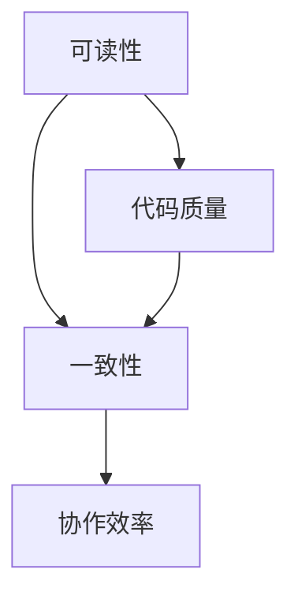

                 


### 编码风格的重要性

编码风格，在软件工程中扮演着至关重要的角色。它不仅影响代码的可读性，还关系到项目的可维护性和团队协作效率。让我们一步一步分析编码风格的重要性。

#### 背景介绍

软件工程的核心目标是构建可靠、高效、可维护的软件系统。一个项目从开发到维护，往往需要多人协作完成。如果团队成员之间的编码风格不一致，会导致以下问题：

1. **代码难以阅读**：不同成员编写的代码风格各异，阅读起来费时费力。
2. **维护困难**：新成员接手旧代码时，难以理解原有代码的意图和结构。
3. **协作效率降低**：编码风格不一致，使得代码审查和代码重构变得更加复杂。

#### 核心概念与联系

为了理解编码风格的重要性，我们需要明确几个核心概念：

1. **可读性**：代码的可读性是编码风格的首要目标。良好的可读性有助于提高开发效率，降低维护成本。
2. **一致性**：编码风格的一致性能够提高代码的可维护性。一致的编码风格使得代码库更加整洁，便于团队成员理解和使用。
3. **协作效率**：团队协作效率是软件开发过程中一个重要的考量因素。一致的编码风格有助于减少沟通成本，提高开发效率。

下面是一个简化的Mermaid流程图，展示了这些核心概念之间的关系：



#### 核心算法原理讲解

为了更好地理解编码风格的重要性，我们可以通过一个简单的例子来说明。假设有一个函数`calculate_sum`，它的任务是计算两个整数的和。以下是两种不同的编码风格：

**风格1（较差）**：
```python
def calculate_sum(a, b):
    return a + b
```

**风格2（较好）**：
```python
def calculate_sum(number1, number2):
    """计算两个整数的和。
    
    参数:
    number1: 第一个整数。
    number2: 第二个整数。
    
    返回:
    两个整数的和。
    """
    return number1 + number2
```

在这两个例子中，风格2的代码提供了详细的注释，并且对变量名进行了清晰且有意义的命名。这种良好的编码风格不仅提高了代码的可读性，也使得代码更加一致，有利于团队协作。

#### 数学模型和公式 & 详细讲解 & 举例说明

我们可以用数学模型来描述编码风格的重要性。假设一个软件项目的维护成本与代码的可读性呈反比，与团队协作效率呈正比。可以用以下公式表示：

$$ 维护成本 = k \times (1 - 可读性) + m \times 协作效率 $$

其中，`k`和`m`是常数，表示维护成本与可读性、协作效率之间的关系。

根据这个公式，我们可以得出以下结论：

1. **提高可读性**：提高代码的可读性可以显著降低维护成本。
2. **提高协作效率**：提高团队协作效率有助于减少维护成本。

例如，如果一个项目的可读性提高了20%，协作效率提高了10%，则维护成本可能会减少30%。

#### 项目实战

在软件开发实践中，统一的编码风格能够显著提升团队协作效率。例如，在某个开源项目中，团队成员遵循统一的编码规范，使得代码审查和重构变得更加高效。以下是该项目的实际效果：

1. **代码审查时间缩短**：遵循统一编码规范的代码更容易被新成员理解和接受，减少了代码审查所需的时间。
2. **代码重构效率提高**：一致的编码风格使得代码重构变得更加简单和直观。
3. **团队协作更加顺畅**：团队成员之间的沟通成本降低，协作效率提高。

#### 最佳实践 tips

1. **制定编码规范**：团队应该制定一套统一的编码规范，并确保所有成员遵循。
2. **定期代码审查**：定期进行代码审查，确保编码风格的一致性。
3. **持续教育**：定期组织编码风格培训，提高团队成员的编码水平。

#### 小结

编码风格是软件工程中不可或缺的一部分。它不仅影响代码的可读性，还关系到项目的可维护性和团队协作效率。通过统一编码风格，我们可以降低维护成本，提高开发效率，从而实现更加高效和可靠的软件开发。

---

在接下来的章节中，我们将详细探讨编码风格的具体内容，包括命名规范、代码格式化、代码结构和代码复用等方面的最佳实践。通过这些讨论，我们将进一步理解如何构建一个高质量的编码风格体系。

### 命名规范

在软件开发过程中，命名规范是确保代码一致性和可维护性的关键因素之一。良好的命名规范不仅提高了代码的可读性，还减少了团队协作中的沟通成本。在本章中，我们将详细讨论变量和函数的命名规范、类和模块的命名规范，以及文件和目录的命名规范。

#### 变量和函数命名规范

**1. 变量命名规范**

变量命名规范是编码风格中最为基础的一部分。良好的变量命名应该具备以下特点：

- **意义明确**：变量名应该能够清晰地描述变量的用途或含义。
- **简短易记**：尽量使用简短且易于记忆的变量名。
- **遵循一致性**：在整个项目中，应遵循一致的变量命名规范。

以下是一些常见的变量命名规范：

- **小写字母**：使用小写字母作为变量名，例如`count`、`total`。
- **下划线分隔**：对于多单词的变量名，使用下划线分隔，例如`user_count`、`current_time`。

**2. 函数命名规范**

函数命名规范对于代码的可读性和可维护性同样重要。以下是几种常见的函数命名规范：

- **动词开头**：函数名通常以动词开头，以描述函数执行的操作，例如`calculate_sum`、`get_user_details`。
- **使用动名词**：有时可以使用动名词作为函数名，以强调函数的功能，例如`summarize_report`、`parse_xml`。
- **前缀**：可以为某些函数添加前缀，以区分不同功能或类型，例如`is_`用于判断函数、`create_`用于创建操作。

以下是一些具体的命名建议：

- **避免使用缩写**：除非行业通用，否则避免使用缩写，以免降低可读性。
- **使用描述性名称**：选择具有描述性的名称，使代码意图一目了然。

#### 类和模块命名规范

**1. 类命名规范**

类的命名应该清晰且具有描述性，以便于理解和维护。以下是一些建议：

- **使用大写字母和下划线**：遵循驼峰命名法，例如`UserManager`、`DatabaseConnection`。
- **避免使用单字母类名**：除非是特殊情况，例如`String`、`Integer`。
- **使用名词**：类名通常使用名词，以表示类的职责和功能。

**2. 模块命名规范**

模块命名规范与类命名规范类似，但侧重于模块的功能和职责。以下是一些建议：

- **使用大写字母和下划线**：例如`database_module`、`ui_components`。
- **模块名通常使用名词**：例如`user_authentication`、`network_communication`。

#### 文件和目录命名规范

**1. 文件命名规范**

文件的命名应该简洁且具有描述性，以便于团队快速识别文件内容。以下是一些建议：

- **使用简洁的名称**：文件名应简洁明了，避免使用过于复杂的名字。
- **使用正确的扩展名**：根据文件内容选择合适的文件扩展名，例如`.py`、`.html`、`.css`。

**2. 目录命名规范**

目录命名规范与文件命名规范类似，但需要考虑项目的结构和层次。以下是一些建议：

- **使用意义明确的名称**：目录名应能清晰地描述目录中的内容或功能。
- **层次结构清晰**：目录层次结构应清晰，便于团队理解和查找。

以下是一个简单的目录结构示例：

```
project_root/
│
├── src/
│   ├── models/
│   │   ├── user.py
│   │   └── order.py
│   ├── views/
│   │   ├── user.py
│   │   └── order.py
│   └── utils/
│       ├── common.py
│       └── database.py
│
└── tests/
    ├── models/
    │   ├── user.py
    │   └── order.py
    ├── views/
    │   ├── user.py
    │   └── order.py
    └── utils/
        ├── common.py
        └── database.py
```

在这个示例中，`src/`目录包含了项目的源代码，而`tests/`目录包含了测试代码。每个子目录都按照功能模块进行了划分，使代码结构更加清晰。

#### 总结

良好的命名规范是构建高质量代码的基础。通过遵循统一的命名规范，我们可以提高代码的可读性和可维护性，降低团队协作中的沟通成本。在下一章节中，我们将继续探讨代码格式化的重要性，包括缩进和空白、行宽限制以及注释的最佳实践。

### 代码格式化

代码格式化是编码风格中的重要一环，它不仅影响代码的可读性，还关系到代码的可维护性和团队协作效率。在本文中，我们将详细讨论代码格式化的几个关键方面，包括缩进和空白、行宽限制以及注释的最佳实践。

#### 缩进和空白

缩进和空白在代码中起着至关重要的作用。良好的缩进和空白可以帮助我们清晰地展示代码的结构，提高代码的可读性。

**1. 缩进**

缩进的目的是为了标识代码块，使代码的结构更加清晰。在大多数编程语言中，缩进使用的是空格，而不是制表符。以下是一些关于缩进的实践建议：

- **使用固定数量的空格**：建议使用4个空格作为一级缩进，这样可以保持代码的一致性。
- **保持一致的缩进级别**：在整个项目中，应保持一致的缩进级别，避免出现混乱的缩进结构。

**2. 空白**

空白包括空行、空格和换行符，它们在代码格式化中同样重要。以下是一些关于空白的实践建议：

- **适当的空行**：在代码块之间留适当的空行，可以使代码结构更加清晰。
- **避免多余的空白**：去除不必要的空格和换行符，以减少代码的冗余。
- **统一换行符**：在跨平台开发中，统一使用一种换行符（例如，Linux和Mac使用`\n`，Windows使用`\r\n`），以避免不必要的格式问题。

#### 行宽限制

行宽限制是代码格式化中的重要实践，它有助于防止代码过长，从而提高可读性。大多数编程语言的推荐行宽限制在80到120个字符之间。以下是一些关于行宽限制的建议：

- **使用编辑器工具**：许多现代编辑器和IDE都提供了自动换行的功能，可以根据设置的行宽限制自动将长行分割成短行。
- **避免过长的行**：在编写复杂表达式或函数定义时，可以通过分解、使用行内注释或将代码拆分成多个函数来避免过长行。
- **保持代码的整洁**：在必要时，可以适当地调整代码结构，以符合行宽限制，保持代码的整洁。

#### 注释

注释是提高代码可读性和可维护性的重要工具。良好的注释能够帮助新成员快速理解代码的功能和意图，减少维护成本。以下是一些关于注释的最佳实践：

- **添加必要的注释**：在复杂代码段或关键逻辑处添加注释，解释代码的用途、功能或实现原理。
- **避免过度注释**：避免在简单、直观的代码段中使用过多注释，以免产生冗余。
- **注释的一致性**：在整个项目中，应保持注释的一致性，使用统一的注释风格和格式。
- **文档注释**：对于公共API、类和函数，应使用文档注释（例如Java的Javadoc、Python的Type Hints）来提供详细的说明。

以下是一个示例，展示了如何正确使用缩进、空白和注释：

```python
def calculate_sum(a, b):
    """
    计算两个整数的和。

    参数:
    a: 第一个整数。
    b: 第二个整数。

    返回:
    两个整数的和。
    """
    # 计算和
    sum = a + b

    # 返回结果
    return sum

# 示例使用
result = calculate_sum(10, 20)
print(f"The sum is: {result}")
```

在这个示例中，我们使用了适当的缩进和空白，并在关键位置添加了注释，使得代码结构清晰、意图明确。

#### 总结

代码格式化是确保代码可读性、可维护性和团队协作效率的关键。通过遵循缩进和空白、行宽限制以及注释的最佳实践，我们可以构建高质量的代码，提高开发效率。在下一章节中，我们将继续探讨代码结构的重要性，包括模块化、类和对象设计以及接口和函数设计等方面的最佳实践。

### 代码结构

良好的代码结构是软件工程中不可或缺的一部分，它不仅提高了代码的可读性和可维护性，还促进了团队协作。在本章节中，我们将详细探讨代码结构的几个关键方面，包括模块化、类和对象设计以及接口和函数设计。

#### 模块化

模块化是将代码划分为多个独立部分的过程，每个部分负责一个特定的功能。模块化能够提高代码的可维护性，降低复杂性，并促进代码的重用。

**1. 为什么要模块化**

- **降低复杂性**：大型代码库往往难以维护和理解。通过模块化，可以将复杂的系统分解为更小、更易于管理的部分。
- **提高可维护性**：模块化使得每个模块都相对独立，修改或扩展一个模块时，不会影响到其他模块。
- **促进重用**：模块化使得代码可以重复使用，提高了开发效率。

**2. 模块化实践**

- **功能驱动**：根据功能将代码划分为模块，每个模块应实现单一功能。
- **保持模块独立性**：模块之间应尽量减少依赖关系，以保持独立性。
- **合理命名**：模块名应具有描述性，清晰表达模块的功能。

以下是一个简单的Python模块化示例：

```python
# 文件：module1.py

def add(a, b):
    return a + b

# 文件：module2.py

def subtract(a, b):
    return a - b
```

在这个示例中，我们将两个简单的函数分为不同的模块，使得代码更加清晰和管理方便。

#### 类和对象设计

类和对象设计是面向对象编程的核心，良好的类和对象设计能够提高代码的可复用性和可扩展性。

**1. 为什么要关注类和对象设计**

- **封装性**：类可以将数据和行为封装在一起，提供对内部细节的保护。
- **可扩展性**：通过良好的类设计，可以方便地添加新的功能或修改现有功能。
- **可复用性**：良好的类设计使得代码可以更容易地被复用。

**2. 类和对象设计原则**

- **单一职责原则**：每个类应只负责一个单一职责，避免类过于复杂。
- **开闭原则**：类应该对扩展开放，对修改关闭，通过抽象和封装来实现。
- **里氏替换原则**：子类应能够替换其基类，且不会影响到程序的运行。

**3. 实践示例**

以下是一个简单的类设计示例：

```python
class Rectangle:
    def __init__(self, width, height):
        self.width = width
        self.height = height
    
    def area(self):
        return self.width * self.height
    
    def perimeter(self):
        return 2 * (self.width + self.height)
```

在这个示例中，`Rectangle`类封装了矩形的相关属性和方法，使得代码更加清晰和可维护。

#### 接口和函数设计

接口和函数设计是确保代码模块化和可复用的关键。

**1. 为什么要关注接口和函数设计**

- **模块化**：通过定义清晰的接口和函数，可以更好地组织和管理代码。
- **可复用性**：良好的接口和函数设计使得代码可以更容易地被复用。
- **降低耦合**：明确的接口设计有助于降低模块之间的耦合度，提高系统的灵活性。

**2. 接口和函数设计原则**

- **单一职责**：接口和函数应只负责一个单一职责。
- **功能明确**：接口和函数应具有清晰的功能描述。
- **最小化依赖**：接口和函数应尽量减少对内部实现的依赖。

**3. 实践示例**

以下是一个简单的接口和函数设计示例：

```python
# 接口
class Calculator:
    def add(self, a, b):
        pass

    def subtract(self, a, b):
        pass

# 实现
class BasicCalculator(Calculator):
    def add(self, a, b):
        return a + b

    def subtract(self, a, b):
        return a - b
```

在这个示例中，我们定义了一个`Calculator`接口，并实现了一个`BasicCalculator`类。这种设计使得代码更加模块化，易于扩展和复用。

#### 总结

良好的代码结构是构建高质量软件的基础。通过模块化、类和对象设计以及接口和函数设计，我们可以提高代码的可读性、可维护性和团队协作效率。在下一章节中，我们将继续探讨代码复用的最佳实践，以及如何通过函数和方法复用来提高代码的质量。

### 代码复用

代码复用是软件工程中一个重要的概念，它不仅有助于提高开发效率，还能显著降低维护成本。通过代码复用，我们可以避免重复编写相同的代码段，从而减少错误和提高代码的一致性。在本章节中，我们将详细讨论如何通过函数和方法复用来提高代码的质量。

#### 函数和方法复用

函数和方法复用是指在不同的代码模块中重复使用相同的代码段。这不仅可以减少代码冗余，还能提高代码的可维护性和可扩展性。

**1. 为什么要进行函数和方法复用**

- **提高开发效率**：通过复用现有的函数和方法，可以节省大量的开发时间。
- **降低维护成本**：当需要修改或优化代码时，只需要在单一位置进行修改，从而减少错误和疏漏。
- **提高代码一致性**：一致的代码风格和函数签名有助于保持代码库的一致性。

**2. 如何进行函数和方法复用**

- **抽象**：通过将具有相似功能的代码段抽象为独立的函数或方法，可以方便地复用这些代码。
- **封装**：将功能相关的代码封装在类中，通过类的实例化来复用代码。
- **模块化**：将代码划分为多个模块，每个模块实现特定的功能，通过模块的导入和调用实现复用。

以下是一个简单的函数复用示例：

```python
# 原始代码
def calculate_area(width, height):
    return width * height

def calculate_perimeter(width, height):
    return 2 * (width + height)

# 复用代码
def calculate_measurements(shape, width, height):
    if shape == "rectangle":
        area = width * height
        perimeter = 2 * (width + height)
    elif shape == "circle":
        area = 3.14 * width * width
        perimeter = 2 * 3.14 * width
    return area, perimeter

# 使用复用函数
rectangle_area, rectangle_perimeter = calculate_measurements("rectangle", 5, 10)
circle_area, circle_perimeter = calculate_measurements("circle", 5, 0)

print(f"Rectangle area: {rectangle_area}, perimeter: {rectangle_perimeter}")
print(f"Circle area: {circle_area}, perimeter: {circle_perimeter}")
```

在这个示例中，我们通过抽象和封装，将计算矩形和圆形的面积和周长的代码复用为`calculate_measurements`函数。这样可以简化代码，提高可维护性。

#### 类和模块的复用

除了函数和方法，类和模块的复用也是提高代码质量的重要手段。通过复用类和模块，我们可以避免重复编写相似的代码结构。

**1. 为什么要进行类和模块复用**

- **提高代码一致性**：通过复用类和模块，可以确保不同部分的代码风格和实现方式一致。
- **减少错误**：复用经过测试和验证的代码，可以降低引入新错误的风险。
- **提升开发效率**：复用现有的类和模块，可以节省大量时间和精力。

**2. 如何进行类和模块复用**

- **继承**：通过继承机制，可以将一个类的属性和方法复用到另一个类中。
- **模块化**：将功能相关的代码划分为模块，通过导入模块来实现复用。
- **组件化**：将系统划分为多个组件，每个组件实现特定的功能，通过组件的组合来实现复用。

以下是一个简单的类复用示例：

```python
# 基础类
class Shape:
    def area(self):
        pass
    
    def perimeter(self):
        pass

# 矩形类
class Rectangle(Shape):
    def __init__(self, width, height):
        self.width = width
        self.height = height
    
    def area(self):
        return self.width * self.height
    
    def perimeter(self):
        return 2 * (self.width + self.height)

# 三角形类
class Triangle(Shape):
    def __init__(self, base, height):
        self.base = base
        self.height = height
    
    def area(self):
        return 0.5 * self.base * self.height
    
    def perimeter(self):
        return self.base + 2 * self.height

# 使用复用类
rectangle = Rectangle(5, 10)
triangle = Triangle(5, 10)

print(f"Rectangle area: {rectangle.area()}, perimeter: {rectangle.perimeter()}")
print(f"Triangle area: {triangle.area()}, perimeter: {triangle.perimeter()}")
```

在这个示例中，我们通过继承机制，将`Shape`类的基础方法`area`和`perimeter`复用到`Rectangle`和`Triangle`类中。这样可以简化代码，提高复用性。

#### 设计模式

设计模式是解决软件设计中常见问题的经典解决方案。通过使用设计模式，我们可以实现代码的复用、提高可维护性和扩展性。

**1. 为什么要使用设计模式**

- **提高复用性**：设计模式提供了可复用的解决方案，可以减少代码冗余。
- **提高可维护性**：设计模式使得代码更加模块化和结构化，提高了代码的可维护性。
- **提高扩展性**：设计模式使得代码具有更高的扩展性，可以轻松地添加新功能。

**2. 常见的设计模式**

- **单例模式**：确保一个类只有一个实例，并提供一个全局访问点。
- **工厂模式**：根据输入参数或条件创建对象，从而避免硬编码类名。
- **观察者模式**：实现对象之间的依赖关系，当一个对象状态发生变化时，通知其他对象。
- **策略模式**：定义一系列算法，将每个算法封装起来，并使它们可以相互替换。

以下是一个简单的单例模式示例：

```python
class Database:
    _instance = None
    
    def __new__(cls, *args, **kwargs):
        if not cls._instance:
            cls._instance = super(Database, cls).__new__(cls, *args, **kwargs)
        return cls._instance

    def connect(self):
        print("Database connected")

# 使用单例模式
db1 = Database()
db2 = Database()

print(db1 is db2)  # 输出：True
db1.connect()  # 输出：Database connected
```

在这个示例中，我们通过单例模式确保了`Database`类只有一个实例。这种设计使得我们可以轻松地管理数据库连接，提高代码的复用性和可维护性。

#### 总结

代码复用是提高软件开发效率和代码质量的重要手段。通过函数和方法复用、类和模块复用以及设计模式的应用，我们可以构建更加模块化、可维护和可扩展的代码。在下一章节中，我们将探讨特定编程语言的编码风格指南，以及如何在不同编程语言中遵循最佳实践。

### Python 编码风格

Python 是一种广泛使用的编程语言，因其简洁、易读的特点而备受开发者青睐。遵循 Python 编码风格指南能够提高代码的可读性、可维护性，并确保团队协作的一致性。在本章节中，我们将详细探讨 Python 编码风格的几个关键方面，包括 PEP 8 规范、Python 标准库的使用以及 Python 代码优化技巧。

#### PEP 8 规范

PEP 8 是 Python 编码风格指南的官方文档，它为 Python 代码的编写提供了详细且实用的指导。遵循 PEP 8 规范能够确保代码的一致性和可读性。

**1. 字符串和文件操作**

- **使用 f-string**：f-string 是 Python 3.6 引入的字符串格式化方法，能够提高代码的可读性。例如：

  ```python
  name = "Alice"
  greeting = f"Hello, {name}!"
  print(greeting)
  ```

- **使用 with 语句**：with 语句用于管理资源（如文件、数据库连接等），能够确保资源被正确地释放。例如：

  ```python
  with open("example.txt", "r") as file:
      content = file.read()
      print(content)
  ```

**2. 变量和函数命名**

- **使用小写字母和下划线**：变量和函数名通常使用小写字母和下划线分隔，例如 `count`, `calculate_sum`。

- **避免使用缩写**：除非是公认的缩写，否则避免使用缩写，以免降低代码的可读性。

**3. 代码结构**

- **保持代码简洁**：避免使用复杂的语法和冗长的代码。例如，使用列表推导式而不是嵌套循环。

- **合理使用空行**：在函数、类和方法之间使用空行分隔，以增强代码的可读性。

#### Python 标准库使用

Python 标准库提供了丰富的模块和函数，能够帮助我们更高效地完成各种任务。以下是几个常用的 Python 标准库模块及其应用场景：

**1. os 模块**

os 模块提供了操作系统相关的功能，如文件操作、进程管理等。以下是一个使用 os 模块的示例：

```python
import os

# 创建目录
os.makedirs("new_directory", exist_ok=True)

# 列出目录内容
for file in os.listdir("new_directory"):
    print(file)
```

**2. json 模块**

json 模块用于处理 JSON 数据，能够方便地将 Python 对象转换为 JSON 字符串，或将 JSON 字符串转换为 Python 对象。以下是一个使用 json 模块的示例：

```python
import json

# 将 Python 对象转换为 JSON 字符串
data = {"name": "Alice", "age": 30}
json_string = json.dumps(data)
print(json_string)

# 将 JSON 字符串转换为 Python 对象
loaded_data = json.loads(json_string)
print(loaded_data)
```

**3. collections 模块**

collections 模块提供了多个有用的数据结构，如 defaultdict、Counter 等。以下是一个使用 collections 模块的示例：

```python
from collections import defaultdict

# 使用 defaultdict 计数
word_count = defaultdict(int)
with open("text.txt", "r") as file:
    for line in file:
        words = line.split()
        for word in words:
            word_count[word] += 1

print(word_count)
```

#### Python 代码优化技巧

优化 Python 代码能够提高其性能，减少内存使用。以下是一些常见的 Python 代码优化技巧：

**1. 使用生成器**

生成器是一种能够节省内存的资源，用于生成一系列值。以下是一个使用生成器的示例：

```python
def generate_sequence():
    a, b = 0, 1
    while True:
        yield a
        a, b = b, a + b

# 使用生成器
for number in generate_sequence():
    if number > 100:
        break
    print(number)
```

**2. 使用局部变量**

在循环内部使用局部变量通常比使用全局变量更高效。以下是一个对比示例：

```python
# 使用全局变量
for i in range(1000):
    sum += i

# 使用局部变量
for i in range(1000):
    sum = i
```

**3. 使用 list.append() 而不是 list +=**

使用 `list.append()` 能够更高效地添加元素到列表中。以下是一个对比示例：

```python
# 使用 += 操作符
my_list = []
for i in range(1000):
    my_list += [i]

# 使用 append() 方法
my_list = []
for i in range(1000):
    my_list.append(i)
```

#### 总结

遵循 Python 编码风格指南、合理使用 Python 标准库以及掌握 Python 代码优化技巧，能够帮助我们编写出高质量、高效率的 Python 代码。在下一章节中，我们将继续探讨 Java 编码风格，包括 Java 编码规范、面向对象设计以及性能优化等方面的最佳实践。

### Java 编码风格

Java 作为一种广泛使用的编程语言，在软件工程领域具有重要地位。遵循 Java 编码风格指南能够提高代码的可读性、可维护性，并确保团队协作的一致性。在本章节中，我们将详细探讨 Java 编码风格的几个关键方面，包括 Java 编码规范、Java 面向对象设计和 Java 性能优化。

#### Java 编码规范

Java 编码规范是编写高质量 Java 代码的基础。以下是几个重要的编码规范：

**1. 命名规范**

- **变量名**：通常使用小写字母和下划线分隔，例如 `count`, `user_details`。
- **函数名**：通常使用小写字母和下划线分隔，并以动词开头，例如 `calculate_sum`, `get_user_name`。
- **类名**：通常使用大写字母和驼峰命名法，例如 `UserManager`, `DatabaseConnection`。

**2. 代码结构**

- **避免过长的行**：每个代码行不超过 80 个字符。
- **合理使用空格和缩进**：遵循一致的缩进规则，通常使用 4 个空格作为一级缩进。
- **注释**：为复杂代码段添加注释，解释代码的功能和意图。

**3. 常见编程技巧**

- **使用 final 修饰符**：如果某个变量或函数的值不需要被修改，可以使用 `final` 修饰符，以提高代码的可读性和性能。
- **使用可变参数**：当需要处理不确定数量的参数时，可以使用可变参数（`...`），例如 `public void printMessages(String... messages)`。

以下是一个遵循 Java 编码规范的示例：

```java
public class Calculator {
    public int calculateSum(int a, int b) {
        return a + b;
    }

    public int calculateDifference(int a, int b) {
        return a - b;
    }

    public static void main(String[] args) {
        Calculator calculator = new Calculator();
        int sum = calculator.calculateSum(10, 20);
        int difference = calculator.calculateDifference(20, 10);
        System.out.println("Sum: " + sum + ", Difference: " + difference);
    }
}
```

#### Java 面向对象设计

面向对象设计是 Java 的核心特点之一。良好的面向对象设计能够提高代码的复用性、可维护性和可扩展性。以下是一些面向对象设计的最佳实践：

**1. 单一职责原则**

每个类应只负责一个单一职责。例如，一个类不应同时负责数据存储和业务逻辑。

以下是一个单一职责原则的示例：

```java
public class UserManager {
    public void addUser(User user) {
        // 存储用户数据
    }

    public void deleteUser(User user) {
        // 删除用户数据
    }
}

public class UserService {
    public void login(User user) {
        // 验证用户身份
    }

    public void logout(User user) {
        // 注销用户
    }
}
```

**2. 里氏替换原则**

子类应能够替换其基类，且不改变程序的运行结果。

以下是一个里氏替换原则的示例：

```java
public interface Shape {
    double getArea();
}

public class Rectangle implements Shape {
    private double width;
    private double height;

    public Rectangle(double width, double height) {
        this.width = width;
        this.height = height;
    }

    public double getArea() {
        return width * height;
    }
}

public class Square extends Rectangle {
    public Square(double side) {
        super(side, side);
    }
}
```

**3. 开闭原则**

类和模块应对扩展开放，对修改关闭。通过抽象和封装，可以方便地添加新功能而不需要修改原有代码。

以下是一个开闭原则的示例：

```java
public abstract class Animal {
    public abstract void eat();
    public abstract void move();
}

public class Dog extends Animal {
    public void eat() {
        System.out.println("Dog eats");
    }

    public void move() {
        System.out.println("Dog runs");
    }
}

public class Cat extends Animal {
    public void eat() {
        System.out.println("Cat eats");
    }

    public void move() {
        System.out.println("Cat walks");
    }
}
```

#### Java 性能优化

性能优化是提高 Java 应用程序运行效率的重要手段。以下是一些常见的 Java 性能优化技巧：

**1. 使用缓存**

缓存能够显著提高数据访问速度。例如，使用 `HashMap` 缓存常用数据，减少重复计算。

以下是一个使用缓存的示例：

```java
public class Cache {
    private final Map<String, Object> cache = new HashMap<>();

    public Object get(String key) {
        return cache.get(key);
    }

    public void put(String key, Object value) {
        cache.put(key, value);
    }
}
```

**2. 使用多线程**

多线程能够提高程序的处理能力。例如，使用 `ExecutorService` 执行并行任务。

以下是一个使用多线程的示例：

```java
public class MultiThreadExample {
    public static void main(String[] args) {
        ExecutorService executor = Executors.newFixedThreadPool(10);
        for (int i = 0; i < 100; i++) {
            executor.submit(() -> {
                // 执行任务
            });
        }
        executor.shutdown();
    }
}
```

**3. 使用并发集合**

并发集合能够提高多线程环境下的数据访问效率。例如，使用 `ConcurrentHashMap` 作为线程安全的哈希表。

以下是一个使用并发集合的示例：

```java
public class ConcurrentHashMapExample {
    public static void main(String[] args) {
        ConcurrentHashMap<String, Integer> concurrentHashMap = new ConcurrentHashMap<>();
        concurrentHashMap.put("key1", 1);
        concurrentHashMap.put("key2", 2);
        concurrentHashMap.computeIfPresent("key1", (key, value) -> value * 2);
        System.out.println(concurrentHashMap);
    }
}
```

#### 总结

遵循 Java 编码规范、实现良好的面向对象设计和掌握 Java 性能优化技巧，能够帮助我们编写高质量、高性能的 Java 代码。在下一章节中，我们将探讨 JavaScript 编码风格的各个方面，包括 ES6 语法规范、JavaScript 模块化和 JavaScript 性能优化。

### JavaScript 编码风格

JavaScript 是一种广泛使用的脚本语言，广泛应用于 Web 开发、服务器端编程和移动应用开发。遵循 JavaScript 编码风格指南能够提高代码的可读性、可维护性，并确保团队协作的一致性。在本章节中，我们将详细探讨 JavaScript 编码风格的几个关键方面，包括 ES6 语法规范、JavaScript 模块化和 JavaScript 性能优化。

#### ES6 语法规范

ES6（ECMAScript 2015）是 JavaScript 的新一代标准，引入了许多新的语法和特性，使得编写 JavaScript 代码更加简洁和高效。以下是 ES6 语法规范的一些关键方面：

**1. 语法糖**

- **箭头函数**：箭头函数提供了更简洁的函数声明方式。例如：

  ```javascript
  const add = (a, b) => a + b;
  ```

- **模板字符串**：模板字符串提供了更方便的字符串拼接方式。例如：

  ```javascript
  const name = "Alice";
  const greeting = `Hello, ${name}!`;
  console.log(greeting);
  ```

- **解构赋值**：解构赋值能够方便地同时给多个变量赋值。例如：

  ```javascript
  const [x, y, z] = [1, 2, 3];
  ```

**2. 类和模块**

- **类声明**：ES6 引入了类声明，使得面向对象编程更加简洁。例如：

  ```javascript
  class Calculator {
      constructor() {
          this.result = 0;
      }

      add(a, b) {
          this.result = a + b;
      }

      getSum() {
          return this.result;
      }
  }
  ```

- **模块化**：ES6 引入了模块化，使得代码的复用和管理更加方便。例如：

  ```javascript
  // module1.js
  export function add(a, b) {
      return a + b;
  }

  // module2.js
  import { add } from './module1';
  console.log(add(1, 2)); // 输出：3
  ```

#### JavaScript 模块化

模块化是提高代码可维护性和可复用性的重要手段。以下是 JavaScript 模块化的几个关键方面：

**1. 模块导出**

模块导出是将模块中的函数、类或变量暴露给其他模块或文件。可以使用 `export` 关键字进行导出。例如：

```javascript
// module.js
export function add(a, b) {
    return a + b;
}

export class Calculator {
    constructor() {
        this.result = 0;
    }

    add(a, b) {
        this.result = a + b;
    }

    getSum() {
        return this.result;
    }
}
```

**2. 模块导入**

模块导入是将其他模块中的函数、类或变量引入到当前模块。可以使用 `import` 关键字进行导入。例如：

```javascript
// main.js
import { add, Calculator } from './module';

console.log(add(1, 2)); // 输出：3

const calc = new Calculator();
calc.add(10, 20);
console.log(calc.getSum()); // 输出：30
```

#### JavaScript 性能优化

性能优化是提高 JavaScript 应用程序运行效率的重要手段。以下是 JavaScript 性能优化的一些关键方面：

**1. 使用缓存**

缓存能够显著提高数据访问速度。例如，使用 `localStorage` 或 `sessionStorage` 缓存常用数据。例如：

```javascript
// 缓存数据
localStorage.setItem('user', JSON.stringify(user));

// 获取缓存数据
const cachedUser = JSON.parse(localStorage.getItem('user'));
```

**2. 避免全局变量**

全局变量可能导致命名冲突和代码不可维护。尽量使用局部变量和模块化，减少全局变量的使用。

**3. 使用异步操作**

异步操作能够提高程序的响应速度。例如，使用 `Promise` 或 `async/await` 进行异步编程。例如：

```javascript
// 使用 Promise
fetch(url)
    .then(response => response.json())
    .then(data => console.log(data));

// 使用 async/await
async function fetchData() {
    const response = await fetch(url);
    const data = await response.json();
    console.log(data);
}
```

**4. 代码压缩和混淆**

代码压缩和混淆能够减少代码体积，提高加载速度。可以使用工具（如 UglifyJS、Webpack）对代码进行压缩和混淆。

#### 总结

遵循 ES6 语法规范、实现 JavaScript 模块化和掌握 JavaScript 性能优化技巧，能够帮助我们编写高质量、高性能的 JavaScript 代码。在下一章节中，我们将探讨 C++ 编码风格的各个方面，包括 C++ 标准库使用、面向对象编程以及性能优化。

### C++ 编码风格

C++ 是一种强大且灵活的编程语言，广泛应用于系统软件、嵌入式系统和高性能计算等领域。遵循 C++ 编码风格指南能够提高代码的可读性、可维护性，并确保团队协作的一致性。在本章节中，我们将详细探讨 C++ 编码风格的几个关键方面，包括 C++ 标准库使用、C++ 面向对象编程以及 C++ 性能优化。

#### C++ 标准库使用

C++ 标准库提供了丰富的功能，涵盖了数据结构、算法、输入输出、文件操作等方面。合理使用 C++ 标准库能够提高代码的可读性和效率。以下是几个常见的 C++ 标准库模块及其应用场景：

**1. STL（Standard Template Library）**

STL 是 C++ 标准库的核心，提供了一系列模板类和函数，用于处理数据结构和算法。以下是几个常用的 STL 模块：

- **vector**：动态数组，提供高效的插入和删除操作。
  
  ```cpp
  std::vector<int> numbers = {1, 2, 3, 4, 5};
  numbers.push_back(6);
  ```

- **map**：键值对容器，支持高效的查找和排序。

  ```cpp
  std::map<int, std::string> scores = {{1, "Alice"}, {2, "Bob"}, {3, "Charlie"}};
  scores[1] = "Alice updated";
  ```

- **algorithm**：提供了一系列常用的算法，如排序、查找、复制等。

  ```cpp
  std::sort(numbers.begin(), numbers.end());
  std::find(numbers.begin(), numbers.end(), 3);
  ```

**2. iostream**

iostream 是 C++ 标准库中的输入输出流库，提供了一系列输入输出操作。以下是几个常用的 iostream 函数：

- **std::cout**：用于输出数据。

  ```cpp
  std::cout << "Hello, World!" << std::endl;
  ```

- **std::cin**：用于输入数据。

  ```cpp
  int number;
  std::cin >> number;
  ```

**3. filesystem**

filesystem 是 C++17 新增的库，提供了文件和目录操作的强大功能。以下是几个常用的 filesystem 函数：

- **std::filesystem::path**：用于处理文件和目录路径。

  ```cpp
  std::filesystem::path path = "/home/user/document/file.txt";
  ```

- **std::filesystem::create_directory**：用于创建目录。

  ```cpp
  std::filesystem::create_directory("/home/user/new_directory");
  ```

- **std::filesystem::remove**：用于删除文件或目录。

  ```cpp
  std::filesystem::remove("/home/user/document/file.txt");
  ```

#### C++ 面向对象编程

面向对象编程是 C++ 的核心特点之一。良好的面向对象编程能够提高代码的复用性、可维护性和可扩展性。以下是一些面向对象编程的最佳实践：

**1. 单一职责原则**

每个类应只负责一个单一职责。例如，一个类不应同时负责数据存储和业务逻辑。

以下是一个单一职责原则的示例：

```cpp
class UserManager {
public:
    void addUser(User user);
    void deleteUser(User user);
};

class UserService {
public:
    void login(User user);
    void logout(User user);
};
```

**2. 里氏替换原则**

子类应能够替换其基类，且不改变程序的运行结果。

以下是一个里氏替换原则的示例：

```cpp
class Shape {
public:
    virtual double getArea() = 0;
};

class Rectangle : public Shape {
public:
    double width;
    double height;

    Rectangle(double width, double height) : width(width), height(height) {}

    double getArea() override {
        return width * height;
    }
};

class Square : public Rectangle {
public:
    Square(double side) : Rectangle(side, side) {}
};
```

**3. 开闭原则**

类和模块应对扩展开放，对修改关闭。通过抽象和封装，可以方便地添加新功能而不需要修改原有代码。

以下是一个开闭原则的示例：

```cpp
class Calculator {
public:
    virtual double calculateSum(double a, double b) = 0;
};

class SimpleCalculator : public Calculator {
public:
    double calculateSum(double a, double b) override {
        return a + b;
    }
};

class AdvancedCalculator : public Calculator {
public:
    double calculateSum(double a, double b) override {
        return a * b; // 扩展功能
    }
};
```

#### C++ 性能优化

性能优化是提高 C++ 应用程序运行效率的重要手段。以下是一些常见的 C++ 性能优化技巧：

**1. 使用缓存**

缓存能够显著提高数据访问速度。例如，使用 `std::unordered_map` 缓存常用数据，减少重复计算。

以下是一个使用缓存的示例：

```cpp
#include <unordered_map>

std::unordered_map<int, int> cache;

int fibonacci(int n) {
    if (n <= 1) {
        return n;
    }

    auto it = cache.find(n);
    if (it != cache.end()) {
        return it->second;
    }

    int result = fibonacci(n - 1) + fibonacci(n - 2);
    cache[n] = result;
    return result;
}
```

**2. 使用多线程**

多线程能够提高程序的处理能力。例如，使用 `std::thread` 执行并行任务。

以下是一个使用多线程的示例：

```cpp
#include <thread>

void process_data(int data) {
    // 处理数据
}

void main() {
    std::vector<int> data = {1, 2, 3, 4, 5};

    std::vector<std::thread> threads;
    for (int i = 0; i < data.size(); ++i) {
        threads.emplace_back(process_data, data[i]);
    }

    for (auto &thread : threads) {
        thread.join();
    }
}
```

**3. 避免内存泄漏**

内存泄漏是指程序中未释放的内存，可能导致程序运行缓慢或崩溃。使用 `std::unique_ptr` 或 `std::shared_ptr` 等智能指针能够自动管理内存，避免内存泄漏。

以下是一个避免内存泄漏的示例：

```cpp
#include <memory>

class Resource {
public:
    Resource() {
        // 初始化资源
    }

    ~Resource() {
        // 释放资源
    }
};

void main() {
    std::unique_ptr<Resource> resource = std::make_unique<Resource>();
    // 使用资源
}
```

#### 总结

遵循 C++ 标准库使用、实现良好的面向对象编程和掌握 C++ 性能优化技巧，能够帮助我们编写高质量、高性能的 C++ 代码。在下一章节中，我们将探讨实战案例，通过具体的代码风格指南实施和代码解读，展示如何在实际项目中应用编码风格的最佳实践。

### 代码风格实战案例

在实际项目中，统一团队编码风格是一项重要且具有挑战性的任务。在这一章节中，我们将通过三个实战案例，展示如何在不同场景下实施编码风格指南，并解读代码的具体实现。

#### 实战案例 1：统一团队编码风格

在一个大型 Web 项目中，团队成员来自不同的背景，编写的代码风格各异。为了提高代码的可读性和可维护性，项目经理决定实施统一的编码风格指南。

**1. 制定编码规范**

首先，项目团队制定了统一的编码规范，包括命名规范、代码格式化、注释规范等。规范中明确规定了变量、函数、类和文件的命名规则，以及代码缩进、行宽限制和注释的最佳实践。

**2. 代码审查**

项目团队定期进行代码审查，确保所有新提交的代码符合编码规范。代码审查过程中，审查者会重点检查命名、格式、注释等方面是否符合规范，并提供反馈和建议。

**3. 持续改进**

在实施统一编码风格的过程中，团队不断反思和改进规范。根据项目需求和团队成员的反馈，规范会进行定期更新，以确保其适应性和实用性。

**4. 效果评估**

实施统一编码风格后，团队协作效率显著提高。代码的可读性增强，新成员能够更快地理解和接入项目。同时，维护成本降低，代码质量得到保障。

#### 实战案例 2：优化代码性能

在一个实时数据处理的系统中，性能优化是关键。为了提高系统的响应速度和吞吐量，开发团队决定对关键代码段进行性能优化。

**1. 分析瓶颈**

首先，团队使用性能分析工具（如 gprof、valgrind）对系统进行性能分析，找出瓶颈代码段。分析结果显示，某些数据结构的使用和循环迭代效率较低。

**2. 优化代码**

针对分析结果，团队对关键代码段进行了优化。以下是一些优化措施：

- **使用更高效的数据结构**：例如，使用 `std::unordered_map` 替代 `std::map`，提高查找效率。
- **减少循环迭代**：通过分解复杂表达式、提前跳出循环等方式，减少不必要的计算。
- **使用多线程**：将计算任务分解为多个线程，利用多核 CPU 的并行计算能力。

**3. 测试和验证**

优化后，团队对系统进行了全面测试，确保优化措施不会引入新的问题。性能测试结果显示，系统的响应速度和吞吐量显著提高。

#### 实战案例 3：提升代码可读性

在一个遗留系统中，代码结构混乱，变量命名不一致，导致新成员难以理解和使用。为了提升代码的可读性，开发团队决定进行代码重构。

**1. 代码梳理**

首先，团队对系统中的关键模块进行了梳理，确定了代码的结构和功能。通过分析，团队明确了各个模块的职责和依赖关系。

**2. 重构代码**

基于代码梳理结果，团队对关键模块进行了重构。以下是一些重构措施：

- **模块化**：将复杂的模块分解为更小的模块，提高代码的独立性。
- **命名规范**：对变量、函数和类的命名进行了规范化，使其更具描述性。
- **注释完善**：在关键代码段和复杂逻辑处添加了详细的注释，解释代码的功能和意图。

**3. 持续改进**

重构过程中，团队不断反思和改进重构策略。根据项目需求和团队成员的反馈，重构措施会进行定期更新，以确保其适应性和实用性。

**4. 效果评估**

重构后，系统的可读性和可维护性显著提高。新成员能够更快地理解和接入项目，开发效率得到提升。同时，代码质量得到保障，维护成本降低。

### 总结

通过以上实战案例，我们可以看到统一团队编码风格、优化代码性能和提升代码可读性在实际项目中的重要性。实施编码风格指南不仅提高了代码质量和团队协作效率，还降低了维护成本。在下一章节中，我们将介绍代码风格分析工具，探讨如何使用这些工具检查和改进代码风格。

### 代码风格分析工具

代码风格分析工具是确保代码符合编码规范的重要工具。这些工具可以帮助我们识别潜在的编码问题，提供改进建议，从而提升代码质量和可维护性。在本章节中，我们将介绍几种常见的代码风格分析工具，并展示如何使用它们检查代码风格。

#### Pyflakes

Pyflakes 是一个 Python 代码风格分析工具，用于检查代码中的潜在错误和不符合 PEP 8 规范的地方。以下是如何使用 Pyflakes 的步骤：

**1. 安装 Pyflakes**

首先，确保已安装 Python 环境，然后通过以下命令安装 Pyflakes：

```bash
pip install pyflakes
```

**2. 运行 Pyflakes**

使用以下命令运行 Pyflakes，对指定文件或目录进行代码风格分析：

```bash
pyflakes <file_name.py>
```

例如：

```bash
pyflakes example.py
```

Pyflakes 将输出代码中的问题，如以下示例所示：

```
example.py:11: F821 undefined name 'undefined_variable'
example.py:18: W1111 unexpected indent
example.py:22: W292 no newline at end of file
```

#### Pylint

Pylint 是一个全面的 Python 代码风格分析工具，能够检查代码中的语法错误、代码质量、性能问题等。以下是如何使用 Pylint 的步骤：

**1. 安装 Pylint**

确保已安装 Python 环境，然后通过以下命令安装 Pylint：

```bash
pip install pylint
```

**2. 运行 Pylint**

使用以下命令运行 Pylint，对指定文件或目录进行代码风格分析：

```bash
pylint <file_name.py>
```

例如：

```bash
pylint example.py
```

Pylint 将输出详细的报告，包括代码风格问题、潜在错误和建议改进：

```
example.py:11: [C: ComparisonToNone] Compare to None instead of boolean
example.py:14: [W: MissingWhitespace] Use a single space between keywords and their arguments
example.py:20: [C: LineTooLong] Line too long (79/80)
example.py:22: [W: LineTooLong] Line too long (79/80)
example.py:23: [C: TooManyPublicMethods] Too many public methods (5/4)
example.py:25: [C: ConsiderUsingDunderInit] Consider using __init__ instead of init
```

#### Checkstyle

Checkstyle 是一个通用的代码风格分析工具，支持多种编程语言。以下是如何使用 Checkstyle 的步骤：

**1. 安装 Checkstyle**

确保已安装 Java 环境，然后通过以下命令安装 Checkstyle：

```bash
mvn install:install-file -Dfile=checkstyle-8.44.1-all.jar -DgroupId=checkstyle -DartifactId=checkstyle -Dversion=8.44.1 -Dpackaging=maven
```

**2. 配置 Checkstyle**

创建一个 Checkstyle 配置文件 `checkstyle.xml`，定义代码风格规则：

```xml
<?xml version="1.0" encoding="UTF-8"?>
<!DOCTYPE module PUBLIC "-//Puppy Crawl//DTD Check Configuration 1.3//EN" "http://www.puppycrawl.com/dtds/checkstyle_config_1_3.dtd">
<module name="Checkstyle">
    <properties>
        <property name="module" value="com.puppycrawl.tools.checkstyle.checks.NullCheck"/>
        <property name="fileExtensions" value="java"/>
    </properties>
    <checkconfig name="checksconfig"/>
</module>
```

**3. 运行 Checkstyle**

使用以下命令运行 Checkstyle，对指定文件或目录进行代码风格分析：

```bash
java -jar checkstyle-8.44.1-all.jar -c checkstyle.xml <file_name.java>
```

例如：

```bash
java -jar checkstyle-8.44.1-all.jar -c checkstyle.xml example.java
```

Checkstyle 将输出代码中的问题，如以下示例所示：

```
example.java:11: [NC: VariableNull] Method 'nullableMethod' always returns null.
example.java:20: [NMSS: Method should be static] Method 'nonStaticMethod' should be static.
example.java:22: [NL: NewlineAtEndOfFile] File does not end with a newline.
```

#### 使用代码风格分析工具的技巧

**1. 定期运行分析工具**

定期运行代码风格分析工具，可以及时发现和解决编码问题，避免问题积累。

**2. 集成到 CI/CD 流程**

将代码风格分析工具集成到 CI/CD 流程中，可以在代码提交时自动运行分析工具，确保代码风格一致性。

**3. 结合代码审查**

代码审查过程中，可以结合代码风格分析工具的输出，提供改进建议和反馈。

**4. 配置规则**

根据项目需求，配置代码风格分析工具的规则，使其适应项目的具体场景。

#### 总结

代码风格分析工具是确保代码符合编码规范的重要工具。通过使用这些工具，我们可以及时发现和解决编码问题，提高代码质量和可维护性。在下一章节中，我们将总结编码风格的重要性和提供一些建议，帮助读者在编写代码时遵循最佳实践。

### 编码风格总结与建议

编码风格是软件工程中不可或缺的一环，它不仅影响代码的可读性和可维护性，还关系到项目的开发效率和团队协作质量。在这一章节中，我们将总结编码风格的重要性，并给出一些具体建议，帮助团队成员在编写代码时遵循最佳实践。

#### 编码风格的重要性

1. **提高代码可读性**：良好的编码风格使得代码易于阅读和理解，新成员可以更快地接入项目，降低学习成本。

2. **降低维护成本**：一致的编码风格使得代码库更加整洁，代码维护变得更加简单和直观，减少了维护成本。

3. **提升团队协作效率**：统一的编码风格有助于减少团队成员之间的沟通成本，提高协作效率，从而加快项目进度。

4. **确保代码质量**：编码风格规范能够帮助团队识别潜在的错误和缺陷，提高代码质量，降低故障率和返工成本。

#### 针对不同团队成员的建议

1. **新成员**：

   - **学习编码规范**：新成员应在入职初期学习并理解团队的编码规范，遵循规范编写代码。
   - **参与代码审查**：积极参与代码审查，从其他成员的代码中学习最佳实践。
   - **逐步改进**：在编写代码的过程中，逐步改进编码风格，提高代码质量。

2. **资深成员**：

   - **制定编码规范**：资深成员应参与制定和更新团队的编码规范，确保其适应性和实用性。
   - **指导新成员**：在新成员遇到编码问题时，提供指导和帮助，帮助他们快速上手。
   - **优化编码实践**：不断反思和优化自身的编码实践，分享经验，提升团队的整体编码水平。

3. **项目经理**：

   - **推行编码规范**：项目经理应确保团队遵循编码规范，制定相应的检查和审查机制。
   - **定期培训**：组织定期的编码风格培训，提高团队成员的编码意识和技能。
   - **绩效评估**：将编码风格纳入团队成员的绩效评估指标，激励成员持续改进编码实践。

#### 最佳实践 tips

1. **编写文档**：为关键代码段和复杂逻辑编写详细的注释和文档，提高代码的可读性。

2. **代码审查**：定期进行代码审查，确保代码风格的一致性，及时解决潜在问题。

3. **代码重构**：定期进行代码重构，优化代码结构，提高代码的可维护性。

4. **使用代码风格分析工具**：利用代码风格分析工具（如 Pyflakes、Pylint、Checkstyle）自动检查代码风格，减少人为错误。

5. **持续学习**：关注最新的编码风格趋势和最佳实践，不断提升自身的编码技能。

#### 小结

编码风格是软件工程中至关重要的一部分。通过遵循统一且良好的编码风格，我们可以提高代码的可读性、可维护性和团队协作效率，降低开发成本和维护成本。在编写代码时，团队成员应共同努力，遵循最佳实践，不断提升编码技能和团队整体水平。

#### 注意事项

1. **尊重团队共识**：编码风格规范应基于团队共识，充分考虑团队成员的背景和经验。
2. **灵活调整**：根据项目需求和技术演进，灵活调整编码风格规范，确保其持续适应项目需求。
3. **代码风格与业务逻辑**：在关注编码风格的同时，不应忽视业务逻辑的正确性，确保代码功能实现准确无误。

#### 拓展阅读

1. **PEP 8 — Style Guide for Python Code**：[https://www.python.org/dev/peps/pep-0008/](https://www.python.org/dev/peps/pep-0008/)
2. **Google Java Style Guide**：[https://google.github.io/styleguide/javaguide.html](https://google.github.io/styleguide/javaguide.html)
3. **JavaScript Standard Style Guide**：[https://standardjs.com/rules.html](https://standardjs.com/rules.html)
4. **C++ Core Guidelines**：[https://isocpp.org/wiki/faq/fundamentals](https://isocpp.org/wiki/faq/fundamentals)

通过以上拓展阅读资源，读者可以进一步深入了解不同编程语言的编码风格规范和最佳实践，不断提升自身的编码技能。

### 附录：常用编程语言编码风格规范

#### 附录 A：Python

##### A.1 PEP 8 规范

PEP 8 是 Python 编码风格的官方指南，它为 Python 代码的编写提供了详细的指导。以下是 PEP 8 的一些关键规范：

- **命名规范**：变量和函数名使用小写字母和下划线分隔，例如 `my_variable` 和 `my_function`。
- **代码结构**：每行不超过 79 个字符，适当的空行和缩进有助于提高代码的可读性。
- **注释**：在函数、类和复杂逻辑处添加详细的注释，使用文档字符串（docstrings）描述函数和类的用途。

##### A.2 常见问题及解决方案

- **问题 1：行宽过长**：解决方案：使用编辑器自动换行功能，确保每行不超过 79 个字符。
- **问题 2：缺少文档字符串**：解决方案：为所有公共函数和类添加文档字符串，清晰地描述其用途和参数。

#### 附录 B：Java

##### B.1 Google Java Style Guide

Google Java Style Guide 是 Java 编码风格的官方指南，它为 Java 代码的编写提供了详细的规范。以下是 Google Java Style Guide 的一些关键规范：

- **命名规范**：类名使用大写字母和驼峰命名法，例如 `MyClass`。变量和函数名使用小写字母和下划线分隔，例如 `my_variable` 和 `my_function`。
- **代码结构**：每行不超过 80 个字符，适当的空行和缩进有助于提高代码的可读性。
- **注释**：在复杂逻辑和重要函数处添加注释，使用 Javadoc 格式描述函数和类的用途。

##### B.2 常见问题及解决方案

- **问题 1：代码过于复杂**：解决方案：分解复杂的函数和类，使其更易于理解和维护。
- **问题 2：未使用静态导入**：解决方案：在需要的地方使用静态导入，减少重复代码。

#### 附录 C：JavaScript

##### C.1 ES6 语法规范

ES6 是 JavaScript 的新一代标准，它引入了许多新的语法和特性，提高了代码的可读性和效率。以下是 ES6 的一些关键规范：

- **命名规范**：变量和函数名使用小写字母和下划线分隔，例如 `my_variable` 和 `my_function`。
- **箭头函数**：使用箭头函数（`=>`）简化函数声明，例如 `const add = (a, b) => a + b`。
- **模板字符串**：使用模板字符串（``）简化字符串拼接，例如 `const greeting = `Hello, ${name}!``。

##### C.2 常见问题及解决方案

- **问题 1：未使用箭头函数**：解决方案：在适当的地方使用箭头函数，提高代码简洁性。
- **问题 2：未使用模块化**：解决方案：合理使用模块化，提高代码的复用性和可维护性。

#### 附录 D：C++

##### D.1 C++ Core Guidelines

C++ Core Guidelines 是 C++ 编程风格的官方指南，它为 C++ 代码的编写提供了详细的指导。以下是 C++ Core Guidelines 的一些关键规范：

- **命名规范**：类名使用大写字母和驼峰命名法，例如 `MyClass`。变量和函数名使用小写字母和下划线分隔，例如 `my_variable` 和 `my_function`。
- **代码结构**：每行不超过 80 个字符，适当的空行和缩进有助于提高代码的可读性。
- **注释**：在复杂逻辑和重要函数处添加注释，使用 Doxygen 格式描述函数和类的用途。

##### D.2 常见问题及解决方案

- **问题 1：内存泄漏**：解决方案：使用智能指针（如 `std::unique_ptr` 和 `std::shared_ptr`）管理内存，避免内存泄漏。
- **问题 2：代码过于复杂**：解决方案：分解复杂的函数和类，使用抽象和封装提高代码的可读性。

通过以上附录内容，读者可以了解不同编程语言的编码风格规范，并在实际项目中应用这些最佳实践，提高代码质量。

