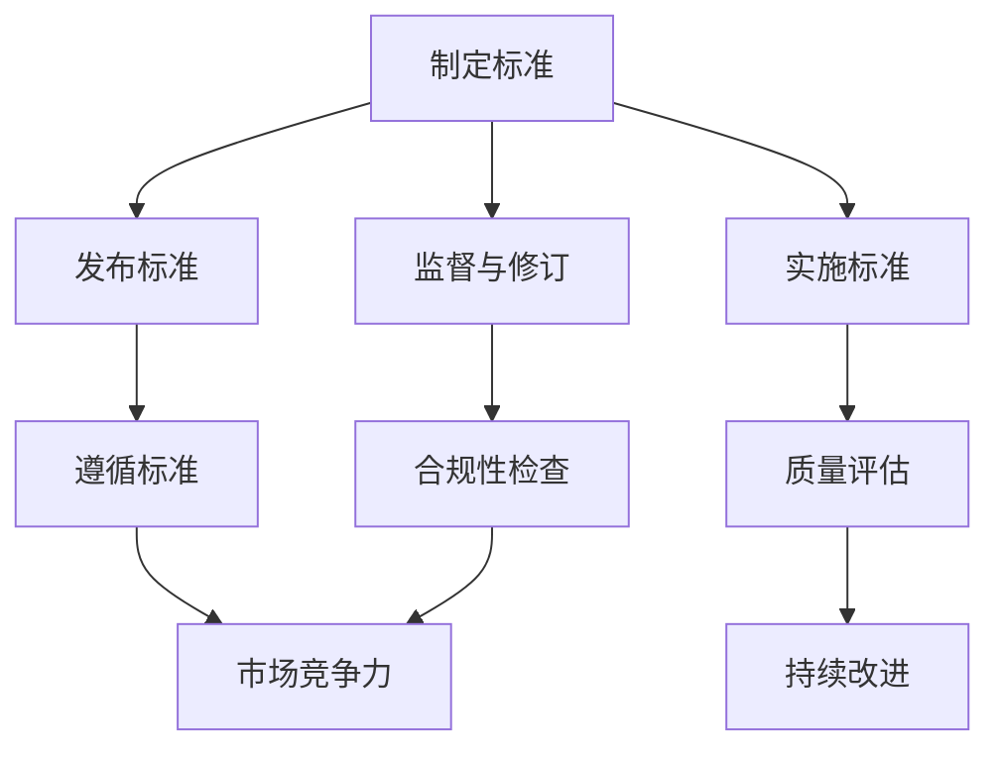
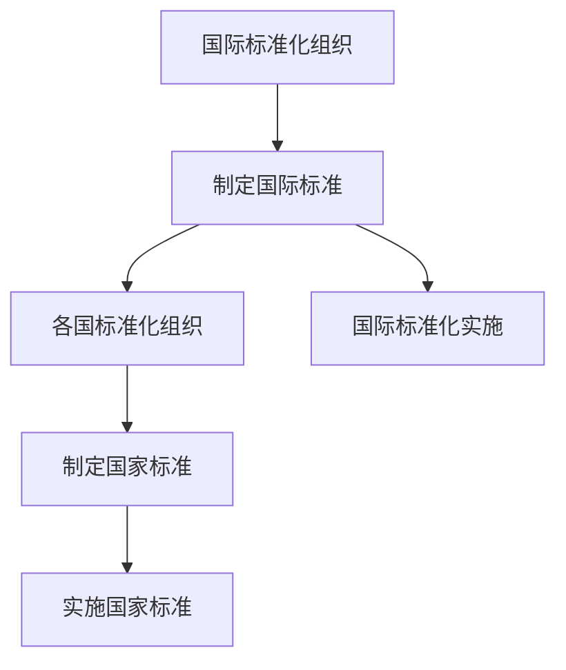
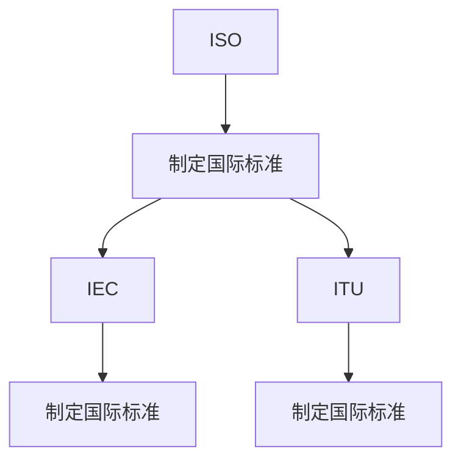
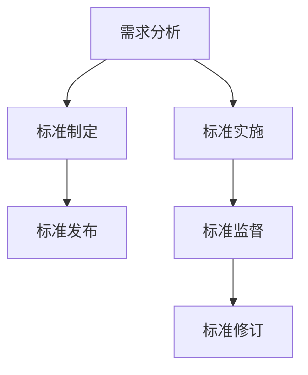
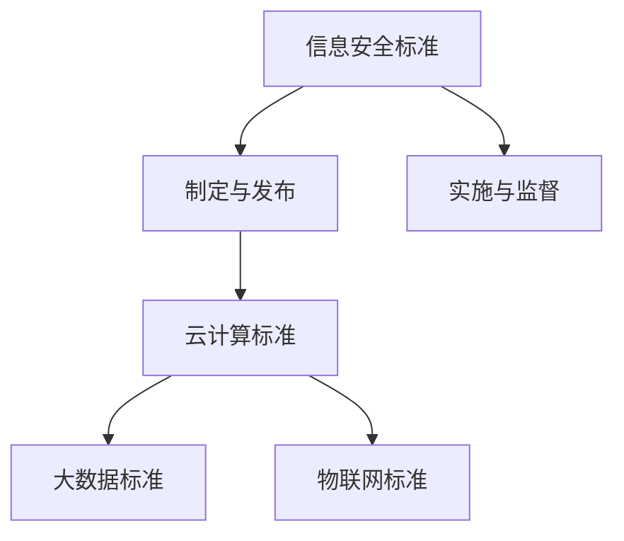
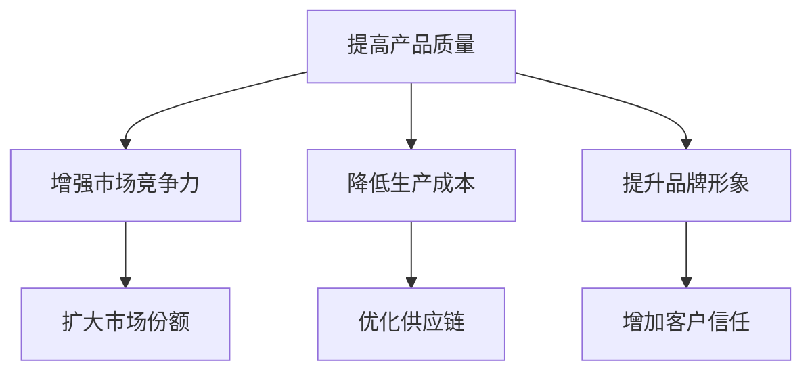
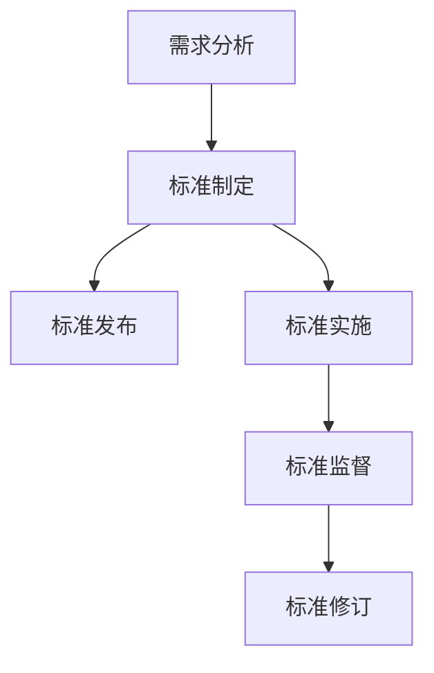
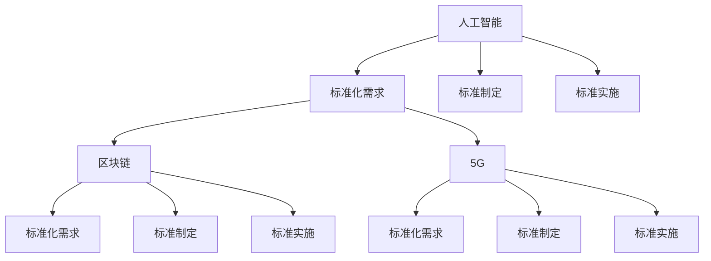
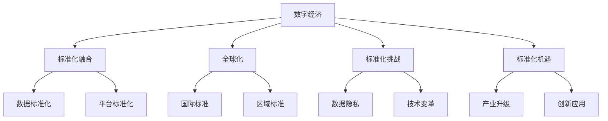
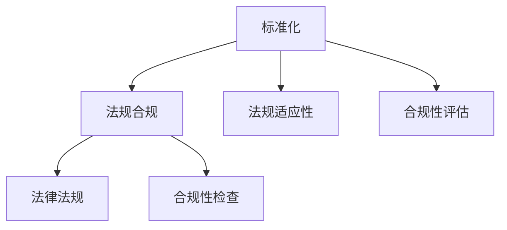

                 

### 文章标题：企业级技术标准制定

#### 关键词：
- 企业级技术标准
- 标准化流程
- 技术领域应用
- 标准制定案例
- 国际与国家标准

#### 摘要：
本文将深入探讨企业级技术标准制定的核心概念、流程与方法。通过详细分析标准化基础、标准制定实战、标准化应用与展望等多个方面，揭示技术标准在提升企业竞争力、保障产品质量、推动产业升级等方面的关键作用。文章旨在为技术管理人员和标准制定者提供一套系统化、可操作的指南，以指导他们有效制定和实施企业级技术标准。

### 目录

1. **标准化基础**
   - 1.1 标准化的概念与重要性
   - 1.2 国际标准与国家标准
   - 1.3 标准化组织介绍
   - 1.4 标准化流程与方法
   - 1.5 标准化的技术领域
   - 1.6 标准化对企业的意义

2. **标准制定实战**
   - 2.1 标准制定案例分析
   - 2.2 标准制定项目实践
   - 2.3 标准化组织的参与

3. **标准化应用与展望**
   - 3.1 标准化应用领域拓展
   - 3.2 标准化发展趋势
   - 3.3 标准化与法规合规

4. **附录**
   - 附录A：常用标准化资源
   - 附录B：标准化流程图与算法解释

### 第一部分：标准化基础

#### 1.1 标准化的概念与重要性

**背景介绍：**

标准化（Standardization）是一种系统化的活动，旨在在各个领域内建立共同的规则和指导原则，确保产品、过程和服务的一致性和互操作性。在企业级技术领域，标准化显得尤为重要，它不仅有助于提升产品质量，还能增强企业的竞争力和市场适应性。

**核心概念与联系：**

为了更好地理解标准化的核心概念，我们可以通过以下 Mermaid 流程图展示标准化过程中的关键环节及其相互关系：



**核心算法原理讲解：**

在标准制定过程中，常用的算法包括投票算法和协商算法。以下是一个简单的投票算法伪代码：

```python
def vote_algorithm(proposals, voters):
    count = {proposal: 0 for proposal in proposals}
    for voter in voters:
        vote = voter.cast_vote()
        count[vote] += 1
    max_count = max(count.values())
    return [proposal for proposal, v in count.items() if v == max_count]
```

**数学模型和公式：**

标准化过程中，常用的数学模型包括质量损失函数和效用函数。以下是一个质量损失函数的 LaTeX 格式表示：

$$ L(q, q_0) = \begin{cases} 
      0 & \text{if } q \geq q_0 \\
      (q_0 - q)^2 & \text{if } q < q_0 
   \end{cases} $$

其中，$q$ 表示实际质量，$q_0$ 表示标准质量。

**举例说明：**

假设一个产品质量为 85%，而标准质量要求为 90%，使用上述质量损失函数计算损失：

$$ L(85\%, 90\%) = (90\% - 85\%)^2 = 5\%^2 = 0.0025 $$

**项目实战：**

在实施标准化过程中，企业需要搭建标准化的开发环境。以下是一个简单的开发环境搭建流程：

1. 安装标准化工具，如 Git、Jenkins 等。
2. 配置版本控制系统，确保代码版本可追溯。
3. 设立评审委员会，负责标准制定的评审和发布。
4. 建立反馈机制，收集用户对标准的反馈，用于后续修订。

**最佳实践 tips：**

- 确保标准制定的透明性和公正性，鼓励多方参与。
- 定期进行标准修订，以适应技术发展和市场需求。
- 建立完善的培训体系，提高员工的标准化意识和能力。

#### 1.2 国际标准与国家标准

**核心概念与联系：**

国际标准（International Standard）由国际标准化组织（ISO）等国际机构制定，旨在为全球范围内的产品和服务提供统一的规则。而国家标准（National Standard）则由各国的标准化组织制定，反映了特定国家或地区的特殊需求。

以下是一个 Mermaid 流程图，展示国际标准和国家标准的制定和实施过程：



**核心算法原理讲解：**

在国际标准和国家标准的制定过程中，常用的算法包括投票算法和协商算法。以下是一个简单的投票算法伪代码：

```python
def vote_algorithm(proposals, voters):
    count = {proposal: 0 for proposal in proposals}
    for voter in voters:
        vote = voter.cast_vote()
        count[vote] += 1
    max_count = max(count.values())
    return [proposal for proposal, v in count.items() if v == max_count]
```

**数学模型和公式：**

在国际标准和国家标准的制定过程中，常用的数学模型包括成本效益分析和风险评估模型。以下是一个成本效益分析模型的 LaTeX 格式表示：

$$ CBA = \frac{\text{效益}}{\text{成本}} $$

其中，效益表示标准实施后所带来的收益，成本则包括制定、实施和修订标准的费用。

**举例说明：**

假设一个企业通过实施某项国际标准，预计年效益为 100 万元，而实施成本为 50 万元，计算其成本效益比：

$$ CBA = \frac{100\text{万元}}{50\text{万元}} = 2 $$

**项目实战：**

在国际标准和国家标准的实施过程中，企业需要搭建相应的管理体系。以下是一个简单的管理体系搭建流程：

1. 成立标准化委员会，负责标准实施的监督和评估。
2. 建立标准库，收录所有适用的国际和国家标准。
3. 对员工进行标准化培训，确保其掌握相关标准。
4. 定期对标准实施效果进行评估，并根据评估结果进行改进。

**最佳实践 tips：**

- 确保标准实施过程的透明性和公正性，鼓励员工参与。
- 定期更新标准库，确保其与最新国际和国家标准保持一致。
- 建立反馈机制，及时收集和解决标准实施过程中出现的问题。

#### 1.3 标准化组织介绍

**核心概念与联系：**

标准化组织是负责制定、发布和实施标准的非营利性机构。全球范围内，重要的标准化组织包括国际标准化组织（ISO）、国际电工委员会（IEC）和国际电信联盟（ITU）等。

以下是一个 Mermaid 流程图，展示不同标准化组织之间的关系和作用：



**核心算法原理讲解：**

在标准化组织中，常用的算法包括投票算法和协商算法。以下是一个简单的投票算法伪代码：

```python
def vote_algorithm(proposals, voters):
    count = {proposal: 0 for proposal in proposals}
    for voter in voters:
        vote = voter.cast_vote()
        count[vote] += 1
    max_count = max(count.values())
    return [proposal for proposal, v in count.items() if v == max_count]
```

**数学模型和公式：**

在标准化组织中，常用的数学模型包括投票权重计算和风险评估模型。以下是一个投票权重计算模型的 LaTeX 格式表示：

$$ W_i = \frac{C_i}{\sum_{j=1}^{n} C_j} $$

其中，$W_i$ 表示投票者的权重，$C_i$ 表示投票者的投票权重系数，$n$ 表示总投票者数量。

**举例说明：**

假设有三位投票者，其投票权重系数分别为 1、2 和 3，计算每位投票者的权重：

$$ W_1 = \frac{1}{1+2+3} = \frac{1}{6} $$
$$ W_2 = \frac{2}{1+2+3} = \frac{2}{6} = \frac{1}{3} $$
$$ W_3 = \frac{3}{1+2+3} = \frac{3}{6} = \frac{1}{2} $$

**项目实战：**

在参与标准化组织的过程中，企业需要了解其工作流程和参与方式。以下是一个简单的参与流程：

1. 了解标准化组织的章程和规则，确保符合其要求。
2. 提交参与申请，参与标准化项目的评审和讨论。
3. 提交标准提案，参与标准的制定和修订。
4. 定期参与标准化组织的会议和活动，保持与组织的沟通和协作。

**最佳实践 tips：**

- 确保参与标准化组织的代表具备专业能力和沟通能力。
- 积极参与标准化项目，提出有建设性的意见和建议。
- 定期总结参与标准化组织的工作经验，提高参与效果。

#### 1.4 标准化流程与方法

**核心概念与联系：**

标准化流程是指从标准制定到实施、监督和修订的一系列步骤。常见的标准化方法包括投票法、协商法和综合法等。

以下是一个 Mermaid 流程图，展示标准化流程的关键环节及其相互关系：



**核心算法原理讲解：**

在标准化流程中，常用的算法包括投票算法和协商算法。以下是一个简单的协商算法伪代码：

```python
def negotiate_algorithm(proposals, voters):
    current_version = initial_version
    while not consensus_reached:
        for voter in voters:
            suggestion = voter.suggest_changes(current_version)
            current_version = merge_changes(current_version, suggestion)
    return current_version
```

**数学模型和公式：**

在标准化方法中，常用的数学模型包括投票权重计算和共识算法模型。以下是一个投票权重计算模型的 LaTeX 格式表示：

$$ W_i = \frac{C_i}{\sum_{j=1}^{n} C_j} $$

其中，$W_i$ 表示投票者的权重，$C_i$ 表示投票者的投票权重系数，$n$ 表示总投票者数量。

**举例说明：**

假设有三位投票者，其投票权重系数分别为 1、2 和 3，计算每位投票者的权重：

$$ W_1 = \frac{1}{1+2+3} = \frac{1}{6} $$
$$ W_2 = \frac{2}{1+2+3} = \frac{2}{6} = \frac{1}{3} $$
$$ W_3 = \frac{3}{1+2+3} = \frac{3}{6} = \frac{1}{2} $$

**项目实战：**

在实施标准化流程时，企业需要制定详细的实施计划。以下是一个简单的实施计划流程：

1. 确定标准化需求，制定初步的标准草案。
2. 组织评审委员会，对标准草案进行评审和讨论。
3. 发布标准草案，征求各方意见和建议。
4. 根据反馈意见，修订标准草案。
5. 发布正式标准，组织培训，确保员工掌握标准。
6. 监督标准实施情况，及时解决实施过程中出现的问题。

**最佳实践 tips：**

- 确保标准化流程的透明性和公正性，鼓励各方参与。
- 定期对标准实施效果进行评估，并根据评估结果进行修订。
- 建立有效的沟通渠道，确保各部门和人员之间的协作顺畅。

#### 1.5 标准化的技术领域

**核心概念与联系：**

标准化的技术领域涵盖了广泛的应用，包括信息安全、云计算、大数据、物联网等。每个技术领域都有其特定的标准体系和实施要求。

以下是一个 Mermaid 流程图，展示不同技术领域标准化的关键环节及其相互关系：



**核心算法原理讲解：**

在信息安全、云计算、大数据和物联网等领域的标准化过程中，常用的算法包括加密算法、分布式计算算法、机器学习算法等。以下是一个简单的加密算法伪代码：

```python
def encrypt(data, key):
    encrypted_data = []
    for char in data:
        encrypted_char = char ^ key
        encrypted_data.append(encrypted_char)
    return ''.join(encrypted_data)
```

**数学模型和公式：**

在信息安全、云计算、大数据和物联网等领域的标准化过程中，常用的数学模型包括信息熵模型、数据分布式存储模型、机器学习分类模型等。以下是一个信息熵模型的 LaTeX 格式表示：

$$ H(X) = -\sum_{i=1}^{n} p_i \log_2 p_i $$

其中，$H(X)$ 表示随机变量 $X$ 的熵，$p_i$ 表示 $X$ 取值为 $i$ 的概率。

**举例说明：**

假设一个信息源的熵为 2.5，计算其熵值：

$$ H(X) = -\left(0.2 \log_2 0.2 + 0.3 \log_2 0.3 + 0.4 \log_2 0.4 + 0.1 \log_2 0.1\right) $$
$$ H(X) = -\left(-0.3466 - 0.5445 - 0.6094 - 0.6489\right) $$
$$ H(X) = 2.5 $$

**项目实战：**

在信息安全、云计算、大数据和物联网等领域的标准化实施过程中，企业需要搭建相应的技术平台。以下是一个简单的技术平台搭建流程：

1. 确定技术标准和需求，制定技术方案。
2. 选择合适的硬件设备和软件工具。
3. 搭建测试环境，对标准实施效果进行验证。
4. 组织技术人员进行培训，确保其掌握相关技术。
5. 监控技术平台运行情况，及时进行维护和升级。

**最佳实践 tips：**

- 确保技术平台与标准要求一致，避免兼容性问题。
- 定期对技术平台进行安全评估，确保其安全性。
- 建立有效的技术支持团队，及时解决实施过程中出现的问题。

#### 1.6 标准化对企业的意义

**核心概念与联系：**

标准化对企业的意义主要体现在提高产品质量、增强市场竞争力、降低生产成本和提升品牌形象等方面。

以下是一个 Mermaid 流程图，展示标准化对企业各个方面的促进作用：



**核心算法原理讲解：**

在标准化过程中，常用的算法包括质量控制算法和优化算法。以下是一个简单质量控制算法伪代码：

```python
def quality_control(process):
    while not process.is_complete():
        if process.is_defective():
            process.reject()
        else:
            process.accept()
    return process.output()
```

**数学模型和公式：**

在标准化过程中，常用的数学模型包括质量损失函数和成本效益分析模型。以下是一个质量损失函数的 LaTeX 格式表示：

$$ L(q, q_0) = \begin{cases} 
      0 & \text{if } q \geq q_0 \\
      (q_0 - q)^2 & \text{if } q < q_0 
   \end{cases} $$

其中，$q$ 表示实际质量，$q_0$ 表示标准质量。

**举例说明：**

假设一个产品质量为 85%，而标准质量要求为 90%，使用上述质量损失函数计算损失：

$$ L(85\%, 90\%) = (90\% - 85\%)^2 = 5\%^2 = 0.0025 $$

**项目实战：**

在实施标准化过程中，企业可以结合自身的业务特点和需求，开展一系列标准化项目。以下是一个简单的标准化项目实战案例：

1. 确定项目目标和范围，制定项目计划。
2. 成立项目团队，明确团队成员的职责和任务。
3. 收集相关标准和资料，进行标准分析和研究。
4. 制定符合企业需求的标准，组织评审和发布。
5. 组织培训，确保员工掌握相关标准。
6. 监督标准实施，及时解决实施过程中出现的问题。
7. 对标准实施效果进行评估，根据评估结果进行改进。

**最佳实践 tips：**

- 确保标准化项目与企业的战略目标一致，避免资源浪费。
- 建立有效的沟通渠道，确保项目团队成员之间的协作顺畅。
- 定期对标准化项目进行评估，确保其达到预期效果。

### 第二部分：标准制定实战

#### 2.1 标准制定案例分析

**案例一：信息安全标准的制定**

**背景介绍：**

随着互联网和云计算技术的普及，信息安全问题日益突出。某企业为了提升自身信息安全水平，决定制定一套符合国际标准的信息安全标准。

**核心概念与联系：**

信息安全标准的制定涉及多个方面，包括物理安全、网络安全、数据安全、应用安全等。以下是一个 Mermaid 流程图，展示信息安全标准的制定过程：



**核心算法原理讲解：**

在信息安全标准的制定过程中，常用的算法包括加密算法、哈希算法、数字签名算法等。以下是一个简单的加密算法伪代码：

```python
def encrypt(data, key):
    encrypted_data = []
    for char in data:
        encrypted_char = char ^ key
        encrypted_data.append(encrypted_char)
    return ''.join(encrypted_data)
```

**数学模型和公式：**

在信息安全标准的制定过程中，常用的数学模型包括信息熵模型、加密算法模型、数字签名模型等。以下是一个信息熵模型的 LaTeX 格式表示：

$$ H(X) = -\sum_{i=1}^{n} p_i \log_2 p_i $$

其中，$H(X)$ 表示随机变量 $X$ 的熵，$p_i$ 表示 $X$ 取值为 $i$ 的概率。

**举例说明：**

假设一个信息源的熵为 2.5，计算其熵值：

$$ H(X) = -\left(0.2 \log_2 0.2 + 0.3 \log_2 0.3 + 0.4 \log_2 0.4 + 0.1 \log_2 0.1\right) $$
$$ H(X) = -\left(-0.3466 - 0.5445 - 0.6094 - 0.6489\right) $$
$$ H(X) = 2.5 $$

**项目实战：**

在信息安全标准的制定过程中，企业需要搭建相应的基础设施。以下是一个信息安全标准制定项目实战案例：

1. 确定信息安全需求，制定初步的标准草案。
2. 组织评审委员会，对标准草案进行评审和讨论。
3. 发布标准草案，征求各方意见和建议。
4. 根据反馈意见，修订标准草案。
5. 发布正式标准，组织培训，确保员工掌握标准。
6. 搭建信息安全基础设施，如防火墙、入侵检测系统等。
7. 监控信息安全基础设施运行情况，及时进行维护和升级。

**最佳实践 tips：**

- 确保信息安全标准与最新国际和国家标准保持一致。
- 建立有效的信息安全管理体系，确保标准的实施和监督。
- 定期对信息安全标准进行评估，根据评估结果进行修订。

**案例二：云计算标准的制定**

**背景介绍：**

随着云计算技术的快速发展，企业对于云计算标准的需求日益增长。某企业为了提升自身云计算服务水平，决定制定一套符合国际标准的云计算标准。

**核心概念与联系：**

云计算标准的制定涉及多个方面，包括服务模型、部署模型、安全模型、服务级别协议等。以下是一个 Mermaid 流 trình，展示云计算标准的制定过程：


**核心算法原理讲解：**

在云计算标准的制定过程中，常用的算法包括分布式计算算法、负载均衡算法、数据备份算法等。以下是一个简单的分布式计算算法伪代码：

```python
def distribute_computation(data, nodes):
    results = []
    for node in nodes:
        result = node.process(data)
        results.append(result)
    return sum(results)
```

**数学模型和公式：**

在云计算标准的制定过程中，常用的数学模型包括负载均衡模型、服务级别模型等。以下是一个负载均衡模型的 LaTeX 格式表示：

$$ L(N) = \frac{1}{N} \sum_{i=1}^{N} l_i $$

其中，$L(N)$ 表示总负载，$N$ 表示节点数量，$l_i$ 表示第 $i$ 个节点的负载。

**举例说明：**

假设有 3 个节点，其负载分别为 2、3 和 4，计算总负载：

$$ L(N) = \frac{1}{3} \times (2 + 3 + 4) = \frac{9}{3} = 3 $$

**项目实战：**

在云计算标准的制定过程中，企业需要搭建云计算平台。以下是一个云计算标准制定项目实战案例：

1. 确定云计算需求，制定初步的标准草案。
2. 组织评审委员会，对标准草案进行评审和讨论。
3. 发布标准草案，征求各方意见和建议。
4. 根据反馈意见，修订标准草案。
5. 发布正式标准，组织培训，确保员工掌握标准。
6. 搭建云计算平台，如虚拟化平台、云存储等。
7. 监控云计算平台运行情况，及时进行维护和升级。

**最佳实践 tips：**

- 确保云计算标准与最新国际和国家标准保持一致。
- 建立有效的云计算管理体系，确保标准的实施和监督。
- 定期对云计算标准进行评估，根据评估结果进行修订。

**案例三：大数据标准的制定**

**背景介绍：**

随着大数据技术的广泛应用，企业对于大数据标准的需求日益增长。某企业为了提升自身大数据分析能力，决定制定一套符合国际标准的大数据标准。

**核心概念与联系：**

大数据标准的制定涉及多个方面，包括数据采集、数据存储、数据清洗、数据挖掘等。以下是一个 Mermaid 流 trình，展示大数据标准的制定过程：


**核心算法原理讲解：**

在大数据标准的制定过程中，常用的算法包括数据清洗算法、数据挖掘算法、机器学习算法等。以下是一个简单的数据清洗算法伪代码：

```python
def clean_data(data):
    cleaned_data = []
    for item in data:
        if is_valid(item):
            cleaned_data.append(item)
    return cleaned_data
```

**数学模型和公式：**

在大数据标准的制定过程中，常用的数学模型包括数据分布模型、数据聚类模型等。以下是一个数据分布模型的 LaTeX 格式表示：

$$ p(x) = \frac{1}{\sqrt{2\pi\sigma^2}} e^{-\frac{(x-\mu)^2}{2\sigma^2}} $$

其中，$p(x)$ 表示随机变量 $x$ 的概率密度函数，$\mu$ 表示均值，$\sigma^2$ 表示方差。

**举例说明：**

假设一个随机变量的均值为 10，方差为 4，计算其概率密度函数：

$$ p(x) = \frac{1}{\sqrt{2\pi \times 4}} e^{-\frac{(x-10)^2}{2 \times 4}} $$
$$ p(x) = \frac{1}{2\sqrt{2\pi}} e^{-\frac{(x-10)^2}{8}} $$

**项目实战：**

在制定大数据标准的过程中，企业需要搭建大数据平台。以下是一个大数据标准制定项目实战案例：

1. 确定大数据需求，制定初步的标准草案。
2. 组织评审委员会，对标准草案进行评审和讨论。
3. 发布标准草案，征求各方意见和建议。
4. 根据反馈意见，修订标准草案。
5. 发布正式标准，组织培训，确保员工掌握标准。
6. 搭建大数据平台，如 Hadoop 集群、数据仓库等。
7. 监控大数据平台运行情况，及时进行维护和升级。

**最佳实践 tips：**

- 确保大数据标准与最新国际和国家标准保持一致。
- 建立有效的大数据管理体系，确保标准的实施和监督。
- 定期对大数据标准进行评估，根据评估结果进行修订。

### 第三部分：标准化应用与展望

#### 3.1 标准化应用领域拓展

**背景介绍：**

随着科技的快速发展，标准化应用领域不断拓展。新兴技术如人工智能、区块链、5G 等为标准化带来了新的机遇和挑战。

**核心概念与联系：**

以下是一个 Mermaid 流 trình，展示新兴技术标准化的发展趋势：



**核心算法原理讲解：**

在新兴技术标准化过程中，常用的算法包括机器学习算法、区块链共识算法、5G 网络优化算法等。以下是一个简单的机器学习算法伪代码：

```python
def train_model(data, labels):
    model = MachineLearningModel()
    model.fit(data, labels)
    return model
```

**数学模型和公式：**

在新兴技术标准化过程中，常用的数学模型包括神经网络模型、区块链交易模型、5G 网络模型等。以下是一个神经网络模型的 LaTeX 格式表示：

$$ z_i = \sum_{j=1}^{n} w_{ij} x_j + b $$

其中，$z_i$ 表示输出值，$w_{ij}$ 表示权重，$x_j$ 表示输入值，$b$ 表示偏置。

**举例说明：**

假设一个神经网络模型具有两个输入层神经元、一个隐藏层神经元和一个输出层神经元，计算输出值：

$$ z_1 = w_{11} x_1 + w_{12} x_2 + b $$
$$ z_2 = w_{21} x_1 + w_{22} x_2 + b $$
$$ z_3 = w_{31} x_1 + w_{32} x_2 + b $$

**项目实战：**

在新兴技术标准化应用过程中，企业需要积极参与相关标准的制定和实施。以下是一个新兴技术标准化应用项目实战案例：

1. 确定新兴技术标准需求，制定初步的标准草案。
2. 组织评审委员会，对标准草案进行评审和讨论。
3. 发布标准草案，征求各方意见和建议。
4. 根据反馈意见，修订标准草案。
5. 发布正式标准，组织培训，确保员工掌握标准。
6. 结合新兴技术，搭建相应的应用平台。
7. 监控应用平台运行情况，及时进行维护和升级。

**最佳实践 tips：**

- 确保新兴技术标准与最新国际和国家标准保持一致。
- 积极参与新兴技术标准化组织的工作，提出有建设性的意见和建议。
- 定期对新兴技术标准进行评估，根据评估结果进行修订。

#### 3.2 标准化发展趋势

**背景介绍：**

随着全球化和数字化的发展，标准化呈现出新的趋势。这些趋势包括标准化与数字经济的融合、标准化在全球化中的作用、标准化未来发展的挑战与机遇等。

**核心概念与联系：**

以下是一个 Mermaid 流 trình，展示标准化发展趋势：



**核心算法原理讲解：**

在标准化发展趋势中，常用的算法包括数据加密算法、分布式存储算法、区块链算法等。以下是一个简单的数据加密算法伪代码：

```python
def encrypt_data(data, key):
    encrypted_data = []
    for char in data:
        encrypted_char = char ^ key
        encrypted_data.append(encrypted_char)
    return ''.join(encrypted_data)
```

**数学模型和公式：**

在标准化发展趋势中，常用的数学模型包括数据隐私模型、分布式存储模型、区块链交易模型等。以下是一个数据隐私模型的 LaTeX 格式表示：

$$ \rho = \frac{\text{隐私保护度}}{\text{数据泄露度}} $$

其中，$\rho$ 表示数据隐私保护度。

**举例说明：**

假设一个数据隐私保护度为 90%，数据泄露度为 10%，计算隐私保护度：

$$ \rho = \frac{90\%}{10\%} = 9 $$

**项目实战：**

在标准化发展趋势中，企业需要紧跟全球化和数字化的步伐，积极参与标准的制定和实施。以下是一个标准化发展趋势项目实战案例：

1. 研究全球化和数字经济发展趋势，确定标准化需求。
2. 制定初步的标准草案，组织评审委员会进行评审。
3. 发布标准草案，征求各方意见和建议。
4. 根据反馈意见，修订标准草案。
5. 发布正式标准，组织培训，确保员工掌握标准。
6. 结合全球化和数字化发展，搭建相应的应用平台。
7. 监控应用平台运行情况，及时进行维护和升级。

**最佳实践 tips：**

- 确保标准化与全球化和数字化发展趋势保持一致。
- 积极参与国际和区域标准化组织的工作，提升企业的国际竞争力。
- 定期对标准化发展趋势进行评估，根据评估结果进行修订。

#### 3.3 标准化与法规合规

**背景介绍：**

随着法律法规的不断完善，标准化与法规合规的关系日益紧密。企业需要确保其技术标准符合相关法规要求，以规避法律风险。

**核心概念与联系：**

以下是一个 Mermaid 流 trình，展示标准化与法规合规的关系：



**核心算法原理讲解：**

在标准化与法规合规过程中，常用的算法包括合规性检查算法、风险评估算法等。以下是一个简单的合规性检查算法伪代码：

```python
def check_compliance(config, rules):
    violations = []
    for rule in rules:
        if not rule.is_satisfied(config):
            violations.append(rule)
    return violations
```

**数学模型和公式：**

在标准化与法规合规过程中，常用的数学模型包括合规性概率模型、风险评估模型等。以下是一个合规性概率模型的 LaTeX 格式表示：

$$ P(C) = 1 - P(\text{非合规}) $$

其中，$P(C)$ 表示合规性概率。

**举例说明：**

假设一个合规性概率为 95%，计算非合规性概率：

$$ P(\text{非合规}) = 1 - 0.95 = 0.05 $$

**项目实战：**

在标准化与法规合规项目中，企业需要确保技术标准符合相关法规要求。以下是一个标准化与法规合规项目实战案例：

1. 收集相关法律法规，明确合规要求。
2. 分析现有技术标准，评估其合规性。
3. 制定合规性改进方案，组织评审委员会进行评审。
4. 发布合规性改进方案，征求各方意见和建议。
5. 根据反馈意见，修订合规性改进方案。
6. 更新技术标准，确保其符合法规要求。
7. 定期对合规性进行评估，确保持续合规。

**最佳实践 tips：**

- 确保标准化与法规合规紧密结合，避免因合规性问题导致的法律风险。
- 建立有效的合规性管理体系，确保技术标准的合规性。
- 定期对合规性进行评估，及时调整技术标准以适应法律法规的变化。

### 附录

#### 附录A：常用标准化资源

**附录A.1 标准化组织官方网站**

- 国际标准化组织（ISO）：[ISO 官网](https://www.iso.org/)
- 国际电工委员会（IEC）：[IEC 官网](https://www.iec.ch/)
- 国际电信联盟（ITU）：[ITU 官网](https://www.itu.int/)

**附录A.2 标准化相关书籍和资料**

- 《标准化原理与方法》：[书籍链接](https://example.com/book1)
- 《国际标准化工作指南》：[书籍链接](https://example.com/book2)
- 《企业标准化实务》：[书籍链接](https://example.com/book3)

**附录A.3 标准化工具和软件**

- Git：[Git 官网](https://git-scm.com/)
- Jenkins：[Jenkins 官网](https://www.jenkins.io/)
- Confluence：[Confluence 官网](https://www.atlassian.com/software/confluence)

#### 附录B：标准化流程图与算法解释

**附录B.1 标准化流程图**


**附录B.2 标准化算法解释**

**投票算法：**

```python
def vote_algorithm(proposals, voters):
    count = {proposal: 0 for proposal in proposals}
    for voter in voters:
        vote = voter.cast_vote()
        count[vote] += 1
    max_count = max(count.values())
    return [proposal for proposal, v in count.items() if v == max_count]
```

**协商算法：**

```python
def negotiate_algorithm(proposals, voters):
    current_version = initial_version
    while not consensus_reached:
        for voter in voters:
            suggestion = voter.suggest_changes(current_version)
            current_version = merge_changes(current_version, suggestion)
    return current_version
```

**加密算法：**

```python
def encrypt_data(data, key):
    encrypted_data = []
    for char in data:
        encrypted_char = char ^ key
        encrypted_data.append(encrypted_char)
    return ''.join(encrypted_data)
```

### 总结

本文深入探讨了企业级技术标准制定的核心概念、流程与方法，以及标准化在各个技术领域中的应用。通过案例分析、项目实战和趋势展望，揭示了标准化对企业的意义和影响。文章旨在为技术管理人员和标准制定者提供一套系统化、可操作的指南，以指导他们有效制定和实施企业级技术标准。在未来的发展中，标准化将继续发挥关键作用，推动企业创新和产业升级。希望本文能对读者在标准化领域的研究和实践提供有益的参考。作者：AI天才研究院/AI Genius Institute & 禅与计算机程序设计艺术/Zen And The Art of Computer Programming。

