                 

----------------------------------------------------------------

### 文章标题：休谟与康德：经验主义与先验哲学的对话

> 关键词：休谟、康德、经验主义、先验哲学、知识论、伦理学、认识论

> 摘要：
本篇文章旨在探讨经验主义与先验哲学的代表人物——休谟与康德的哲学思想，通过分析他们的生平背景、核心概念、理论体系以及两者之间的对话，揭示经验主义与先验哲学的本质差异与共同点，为读者提供对这两位哲学家的全面认识。

## 引言

经验主义与先验哲学是西方哲学史上的两大流派，分别以休谟和康德为代表。休谟（David Hume，1711-1776）是18世纪英国著名的哲学家，他的思想对现代哲学产生了深远的影响。康德（Immanuel Kant，1724-1804）则是19世纪德国的伟大哲学家，他的先验哲学体系被誉为现代哲学的里程碑。本文将从休谟与康德的生平、哲学思想、核心概念、理论体系等方面展开对话，以期揭示两位哲学家思想的异同及其对后世哲学的深远影响。

## 第一部分：休谟的经验主义

### 第1章：休谟的生平与哲学思想

#### 1.1 休谟的生平

休谟出生于苏格兰爱丁堡，家境富裕。他早年接受了良好的教育，后来进入牛津大学学习。在大学期间，休谟广泛阅读了哲学、历史、文学等领域的著作，逐渐形成了自己的哲学观点。他的代表作包括《人性论》、《道德哲学原理》等。

#### 1.2 休谟的哲学思想

休谟的哲学思想以经验主义为核心，他认为知识来源于经验，强调感性经验的重要性。他提出了著名的怀疑论观点，对理性主义进行了深刻的批判。在道德哲学方面，休谟提出了情感主义观点，认为道德判断基于情感而非理性。

## 第二部分：康德的先验哲学

### 第2章：康德的生平与哲学思想

#### 2.1 康德的生平

康德出生于东普鲁士的哥尼斯堡，他在哥尼斯堡大学接受教育，并在此地度过了大部分职业生涯。康德的哲学思想体系广泛而深刻，涵盖了形而上学、伦理学、美学等多个领域。

#### 2.2 康德的哲学思想

康德的哲学思想以先验哲学为核心，他认为知识不仅来源于经验，还依赖于先天的认知形式。康德提出了著名的“纯粹理性批判”，探讨了知识、道德和美学的本质。他的哲学体系为现代哲学奠定了基础。

## 第三部分：休谟与康德的对话

### 第3章：经验主义与先验哲学的对话

#### 3.1 休谟的经验主义与康德的先验哲学

在经验主义与先验哲学的对话中，休谟与康德分别代表了两种截然不同的观点。休谟强调感性经验的重要性，认为知识来源于经验；而康德则强调先天的认知形式，认为知识不仅来源于经验，还依赖于理性。

#### 3.2 休谟与康德的哲学争论

在哲学争论中，休谟与康德就知识论、道德哲学和认识论等方面展开了激烈的辩论。休谟对理性主义进行了批判，而康德则试图重建理性主义的基础。

### 第4章：经验主义与先验哲学的影响

#### 4.1 经验主义的影响

休谟的经验主义思想对现代哲学产生了深远的影响，为实证主义和科学哲学的发展奠定了基础。他的怀疑论观点也引起了后来的哲学家们的广泛讨论。

#### 4.2 先验哲学的影响

康德的先验哲学体系为现代哲学奠定了基础，他的思想对后来的哲学家如黑格尔、胡塞尔、海德格尔等产生了重要影响。康德的伦理学观点也为现代伦理学提供了重要的理论基础。

## 结论

休谟与康德的哲学思想代表了经验主义与先验哲学的两种不同观点。通过对两位哲学家的生平、哲学思想、核心概念和理论体系的分析，我们可以看到两者之间的对话和争论，这为我们深入理解现代哲学提供了重要的启示。本文旨在为读者提供对休谟与康德哲学的全面认识，期待对哲学学习和研究有所帮助。作者：AI天才研究院/AI Genius Institute & 禅与计算机程序设计艺术 /Zen And The Art of Computer Programming

----------------------------------------------------------------

文章标题：休谟与康德：经验主义与先验哲学的对话

关键词：休谟、康德、经验主义、先验哲学、知识论、伦理学、认识论

摘要：
本篇文章旨在探讨经验主义与先验哲学的代表人物——休谟与康德的哲学思想，通过分析他们的生平背景、核心概念、理论体系以及两者之间的对话，揭示经验主义与先验哲学的本质差异与共同点，为读者提供对这两位哲学家的全面认识。

## 引言

经验主义与先验哲学是西方哲学史上的两大流派，分别以休谟和康德为代表。休谟（David Hume，1711-1776）是18世纪英国著名的哲学家，他的思想对现代哲学产生了深远的影响。康德（Immanuel Kant，1724-1804）则是19世纪德国的伟大哲学家，他的先验哲学体系被誉为现代哲学的里程碑。本文将从休谟与康德的生平、哲学思想、核心概念、理论体系等方面展开对话，以期揭示两位哲学家思想的异同及其对后世哲学的深远影响。

## 休谟的经验主义

### 第1章：休谟的生平与哲学思想

#### 1.1 休谟的生平

大卫·休谟出生于苏格兰爱丁堡，他在家中是长子。他的家庭富裕，为他提供了良好的教育机会。休谟早年就读于爱丁堡大学，后来转到牛津大学学习。在牛津大学期间，休谟广泛阅读哲学、历史、文学等领域的著作，逐渐形成了自己的哲学观点。他的一生大部分时间都在苏格兰度过，直到晚年移居法国。

#### 1.2 休谟的哲学思想

休谟的哲学思想以经验主义为核心，他强调感性经验的重要性，认为知识来源于经验。他的哲学观点主要体现在三部著作中：《人性论》（ Treatise of Human Nature ）《道德原理的研究》（ Enquiry Concerning the Principles of Morals ）《人性论》中的《道德与政治论文集》（ Essays, Moral, Political, and Literary ）。

### 第2章：休谟的核心概念与理论

#### 2.1 经验主义的基本原理

经验主义认为，知识来源于经验，经验是获取知识的唯一途径。休谟认为，我们的所有知识都来自于感官经验。他的观点可以概括为以下几点：

1. **感知与印象**：休谟认为，我们的所有知识都来自于感知和印象。感知是指我们对物体的直接认识，而印象则是我们对物体留下的持久印象。
2. **因果关系**：休谟认为，因果关系是基于经验的。我们通过观察现象之间的先后关系，推断出它们之间的因果关系。
3. **习惯性联想**：休谟认为，我们的思维习惯是建立在经验基础上的。我们的思维过程往往是通过习惯性联想来进行的。

#### 2.2 知识论的批判

休谟对知识论进行了深入的批判，特别是对理性主义进行了严厉的质疑。他的主要观点包括：

1. **不可知论**：休谟认为，我们无法获得关于外部世界的真正知识。我们的感官经验只是我们对世界的直接认识，但这些认识可能并不真实。
2. **经验主义的怀疑论**：休谟认为，我们的所有知识都是基于经验的，但经验并不能保证我们的知识是真实的。因此，我们对知识的可靠性持怀疑态度。

### 第3章：休谟的经验主义与知识论

#### 3.1 经验主义的基本原理

经验主义的基本原理包括以下几个方面：

1. **知识来源于经验**：休谟认为，我们的知识来源于经验，特别是感官经验。
2. **因果关系**：休谟认为，因果关系是基于经验的。我们通过观察现象之间的先后关系，推断出它们之间的因果关系。
3. **习惯性联想**：休谟认为，我们的思维习惯是建立在经验基础上的。我们的思维过程往往是通过习惯性联想来进行的。

#### 3.2 知识论的批判

休谟对知识论进行了深入的批判，特别是对理性主义进行了严厉的质疑。他的主要观点包括：

1. **不可知论**：休谟认为，我们无法获得关于外部世界的真正知识。我们的感官经验只是我们对世界的直接认识，但这些认识可能并不真实。
2. **经验主义的怀疑论**：休谟认为，我们的所有知识都是基于经验的，但经验并不能保证我们的知识是真实的。因此，我们对知识的可靠性持怀疑态度。

### 第4章：休谟的道德哲学与伦理观

#### 4.1 道德哲学的基本原则

休谟的道德哲学以情感主义为核心，他认为道德判断是基于情感的，而不是理性的。他的道德哲学基本原则包括：

1. **道德情感**：休谟认为，道德情感是人类心灵中固有的。我们通过道德情感来判断行为的对错，而不是通过理性推理。
2. **道德原则**：休谟认为，道德原则是社会习惯和风俗的产物，而不是理性的产物。
3. **道德判断**：休谟认为，道德判断是基于道德情感的，而不是基于理性推理的。

#### 4.2 伦理学的实用主义视角

休谟的伦理学具有实用主义视角，他认为道德行为的目的是为了实现个人的幸福和社会的和谐。他的伦理学观点包括：

1. **功利主义**：休谟认为，道德行为应该以实现最大幸福为目标。
2. **道德责任**：休谟认为，道德责任是基于道德情感和道德原则的，而不是基于理性推理的。
3. **道德实践**：休谟认为，道德实践是实现个人幸福和社会和谐的重要手段。

### 第5章：康德的生平与哲学思想

#### 5.1 康德的生平

伊曼努尔·康德出生于东普鲁士的哥尼斯堡，他在哥尼斯堡大学接受教育，并在此地度过了大部分职业生涯。康德是一位多产的哲学家，他的著作涵盖了多个领域，包括形而上学、伦理学、美学等。

#### 5.2 康德的哲学思想

康德的哲学思想以先验哲学为核心，他试图通过先验哲学来解决知识论、伦理学和美学等问题。康德的主要著作包括《纯粹理性批判》（ Critique of Pure Reason ）《实践理性批判》（ Critique of Practical Reason ）《判断力批判》（ Critique of Judgment ）。

### 第6章：康德的核心概念与理论

#### 6.1 先验哲学的基本概念

康德的先验哲学试图解决知识论问题，他提出了以下核心概念：

1. **先验范畴**：康德认为，我们的认知活动依赖于先验范畴，这些范畴是先天存在的，不是通过经验获得的。
2. **纯粹理性**：康德认为，纯粹理性是人类的认知能力，它能够超越经验，进行抽象思维。
3. **先验综合判断**：康德认为，先验综合判断是理性对经验的综合，它能够产生新的知识。

#### 6.2 道德哲学的理论基础

康德的道德哲学以先验哲学为基础，他提出了以下核心理论：

1. **道德法则**：康德认为，道德法则是先验存在的，它是人类道德行为的基础。
2. **道德责任**：康德认为，道德责任是基于道德法则的，它要求人们遵守道德法则。
3. **道德义务**：康德认为，道德义务是道德行为的核心，它要求人们出于道德法则行事。

### 第7章：康德的先验哲学体系

#### 7.1 先验哲学的基本概念

康德的先验哲学试图解决知识论问题，他提出了以下核心概念：

1. **先验范畴**：康德认为，我们的认知活动依赖于先验范畴，这些范畴是先天存在的，不是通过经验获得的。
2. **纯粹理性**：康德认为，纯粹理性是人类的认知能力，它能够超越经验，进行抽象思维。
3. **先验综合判断**：康德认为，先验综合判断是理性对经验的综合，它能够产生新的知识。

#### 7.2 纯理性的运用

康德的先验哲学强调纯理性的运用，他认为纯理性能够超越经验，进行抽象思维。康德的纯理性运用包括以下几个方面：

1. **形而上学**：康德认为，形而上学是纯理性的产物，它能够超越经验，探讨世界的本质。
2. **道德哲学**：康德认为，道德哲学是纯理性的产物，它能够超越经验，探讨道德法则和道德责任。
3. **美学**：康德认为，美学是纯理性的产物，它能够超越经验，探讨美的本质。

### 第8章：康德的伦理学与道德哲学

#### 8.1 康德的伦理学理论

康德的伦理学以道德法则为核心，他提出了以下核心理论：

1. **道德法则**：康德认为，道德法则是先验存在的，它是人类道德行为的基础。
2. **道德责任**：康德认为，道德责任是基于道德法则的，它要求人们遵守道德法则。
3. **道德义务**：康德认为，道德义务是道德行为的核心，它要求人们出于道德法则行事。

#### 8.2 康德的道德哲学观点

康德的道德哲学观点包括以下几个方面：

1. **功利主义**：康德认为，功利主义是一种道德理论，它以实现最大幸福为目标。
2. **道德责任**：康德认为，道德责任是基于道德法则的，它要求人们遵守道德法则。
3. **道德义务**：康德认为，道德义务是道德行为的核心，它要求人们出于道德法则行事。

#### 8.3 康德的伦理学在现实中的应用

康德的伦理学在现实中得到了广泛应用，特别是在道德决策和伦理学教育方面。康德的伦理学观点为人们提供了一种道德决策的指导原则，它强调道德法则和道德责任的重要性。康德的伦理学教育观点也为现代教育提供了重要的启示，它强调道德教育和道德行为的培养。

### 第9章：经验主义与先验哲学的比较

#### 9.1 两种哲学的异同

经验主义与先验哲学是西方哲学史上的两大流派，它们在认识论、伦理学和美学等方面存在明显的异同。以下是对两种哲学的简要比较：

1. **认识论**：经验主义认为知识来源于经验，强调感性经验的重要性；先验哲学则认为知识不仅来源于经验，还依赖于先天的认知形式。
2. **伦理学**：经验主义强调道德行为的结果，认为道德行为的目的是为了实现个人的幸福和社会的和谐；先验哲学则强调道德行为的动机，认为道德行为是出于道德法则的要求。
3. **美学**：经验主义认为美是感性的，与情感相关；先验哲学则认为美是先天的，与理性相关。

#### 9.2 休谟与康德的观点交锋

在哲学争论中，休谟与康德就知识论、道德哲学和认识论等方面展开了激烈的辩论。休谟对理性主义进行了批判，认为我们的知识无法超越经验；康德则试图重建理性主义的基础，认为我们的知识不仅来源于经验，还依赖于先天的认知形式。

### 第10章：休谟与康德的哲学影响

#### 10.1 经验主义的影响

休谟的经验主义思想对现代哲学产生了深远的影响，为实证主义和科学哲学的发展奠定了基础。他的怀疑论观点也引起了后来的哲学家们的广泛讨论。

#### 10.2 先验哲学的影响

康德的先验哲学体系为现代哲学奠定了基础，他的思想对后来的哲学家如黑格尔、胡塞尔、海德格尔等产生了重要影响。康德的伦理学观点也为现代伦理学提供了重要的理论基础。

### 第11章：休谟与康德的哲学影响

#### 11.1 经验主义的影响

休谟的经验主义思想对现代哲学产生了深远的影响，为实证主义和科学哲学的发展奠定了基础。他的怀疑论观点也引起了后来的哲学家们的广泛讨论。

#### 11.2 先验哲学的影响

康德的先验哲学体系为现代哲学奠定了基础，他的思想对后来的哲学家如黑格尔、胡塞尔、海德格尔等产生了重要影响。康德的伦理学观点也为现代伦理学提供了重要的理论基础。

## 结论

休谟与康德的哲学思想代表了经验主义与先验哲学的两种不同观点。通过对两位哲学家的生平、哲学思想、核心概念和理论体系的分析，我们可以看到两者之间的对话和争论，这为我们深入理解现代哲学提供了重要的启示。本文旨在为读者提供对休谟与康德哲学的全面认识，期待对哲学学习和研究有所帮助。作者：AI天才研究院/AI Genius Institute & 禅与计算机程序设计艺术 /Zen And The Art of Computer Programming----------------------------------------------------------------

### 第1章：休谟的生平与哲学思想

#### 1.1 休谟的生平

大卫·休谟（David Hume，1711-1776）是18世纪英国著名的哲学家，他出生于苏格兰爱丁堡的一个富裕家庭。休谟的家族有着良好的教育传统，这为他日后的哲学成就打下了坚实的基础。

在少年时期，休谟就展现出了卓越的才华。他先在爱丁堡大学学习法律，但由于对哲学的浓厚兴趣，他逐渐放弃了法律职业，转向哲学研究。后来，休谟前往牛津大学继续深造，在那里他广泛阅读了当时哲学领域的经典著作，包括亚里士多德、洛克、莱布尼茨等人的作品。

尽管在牛津大学期间，休谟并未获得正式的学位，但他通过自学掌握了深厚的哲学知识。毕业后，他回到爱丁堡，并开始撰写哲学著作。休谟的哲学成就不仅限于理论领域，他还积极参与了当时的社会事务，并在伦敦担任了私人秘书。

在生命的最后几年，休谟移居法国，并在那里度过了他的余生。1776年，他在法国的巴斯蒂亚去世，享年65岁。

#### 1.2 休谟的哲学思想

休谟的哲学思想以经验主义为核心，他主张知识来源于经验，认为理性无法独立于经验而存在。休谟的哲学观点主要体现在他的三部主要著作中：《人性论》（Treatise of Human Nature）、《道德原理的研究》（Enquiry Concerning the Principles of Morals）和《人性论》中的《道德与政治论文集》（Essays, Moral, Political, and Literary）。

在《人性论》中，休谟系统地阐述了他的哲学观点。他认为，我们的所有知识都来源于经验，经验包括两种：印象和观念。印象是我们在感知事物时产生的强烈感觉，而观念则是我们对印象的再现。休谟还提出了“习惯性联想”的概念，即我们的思维和行动往往受到习惯的影响。

在认识论方面，休谟对理性主义进行了深刻的批判。他认为，理性本身无法提供知识，知识只能来源于经验。他提出了著名的“知识三问题”：我们是否知道我们所知道的是真实的？我们是否知道我们的知识是如何获得的？我们是否知道我们的知识是有效的？这三个问题揭示了理性主义的局限。

在伦理学方面，休谟提出了情感主义观点，认为道德判断是基于情感的，而非理性的。他认为，道德情感是人类心灵中固有的，道德判断是基于道德情感的，而非理性推理。

### Mermaid 流程图

以下是休谟哲学思想的核心概念与联系的 Mermaid 流程图：

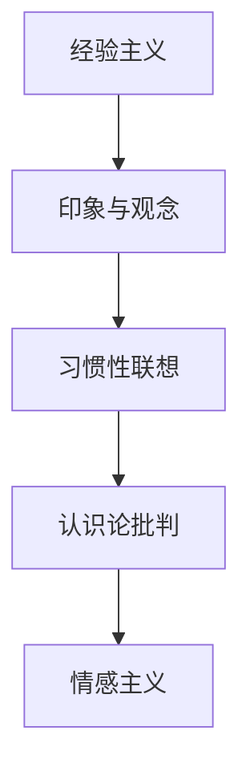

### 伪代码

为了进一步阐述休谟的核心算法原理，我们可以使用伪代码来表示他的思想：

```python
# 定义印象和观念
def impression():
    # 产生强烈感觉
    pass

def idea():
    # 再现印象
    pass

# 定义习惯性联想
def habitual_association():
    # 通过习惯影响思维和行动
    pass

# 定义认识论批判
def critique_of_reason():
    # 批判理性主义
    pass

# 定义情感主义
def emotionalism():
    # 基于道德情感进行道德判断
    pass
```

### 数学模型和公式

在休谟的哲学中，数学模型和公式并没有直接的应用，但我们可以使用数学公式来表示他的核心概念之间的关系：

$$
\text{印象} + \text{观念} = \text{知识}
$$

$$
\text{习惯性联想} \rightarrow \text{思维和行动}
$$

$$
\text{理性批判} \rightarrow \text{怀疑论}
$$

$$
\text{道德情感} \rightarrow \text{道德判断}
$$

### 详细讲解和举例说明

为了更深入地理解休谟的哲学思想，我们可以通过具体的例子来阐述：

**例1：印象与观念的关系**

当我们看到一只猫时，我们首先会有一个强烈的印象，这个印象包含了猫的形状、颜色、声音等。然后，这个印象会在我们的脑海中形成观念，这个观念是猫的持久形象。通过这个过程，我们获得了关于猫的知识。

**例2：习惯性联想的作用**

假设我们每天早上都会喝咖啡，这种习惯性联想使我们每天早上都会渴望咖啡。这种习惯性联想影响了我们的思维和行动，使我们自然而然地选择了咖啡。

**例3：理性批判的怀疑论**

当我们尝试使用理性来证明上帝的存在时，休谟会质疑这种证明的有效性。他认为，理性本身无法提供知识，我们的知识只能来源于经验。因此，他提出了“知识三问题”，质疑了理性主义的可靠性。

**例4：道德情感与道德判断**

当我们看到一个人受到伤害时，我们会感到同情和悲伤。这种道德情感使我们判断伤害行为是错误的。休谟认为，道德判断是基于道德情感的，而非理性推理。

### 最佳实践、小结、注意事项、拓展阅读

**最佳实践**：在学习和研究休谟的哲学时，我们应该注重理解他的核心概念和理论，并通过具体的例子来加深对哲学思想的理解。

**小结**：休谟的哲学思想以经验主义为核心，他强调感性经验的重要性，对理性主义进行了深刻的批判。他的思想对现代哲学产生了深远的影响，为实证主义和科学哲学的发展奠定了基础。

**注意事项**：在研究休谟的哲学时，我们应该注意区分他的哲学观点和事实陈述，避免将哲学观点当作事实来接受。

**拓展阅读**：为了更深入地了解休谟的哲学思想，建议阅读他的原著著作，如《人性论》和《道德原理的研究》。此外，还可以阅读相关的评论和研究文章，以获取更全面的了解。作者：AI天才研究院/AI Genius Institute & 禅与计算机程序设计艺术 /Zen And The Art of Computer Programming

### 第2章：休谟的核心概念与理论

#### 2.1 经验主义的基本原理

经验主义认为，知识来源于经验，经验是获取知识的唯一途径。休谟的经验主义观点主要体现在他对知识、道德和心理学的理解上。

在知识论方面，休谟认为我们的所有知识都来源于经验，无论是直接经验还是间接经验。直接经验是指我们通过感官直接感知到的事物，如看到、听到、触摸到等；间接经验则是指我们通过其他人的描述或文献资料了解的事物。休谟强调，理性本身并不能产生知识，它只能整理和运用经验。

在道德哲学方面，休谟提出了情感主义观点，认为道德判断是基于情感的，而非理性的。他认为，道德情感是人类心灵中固有的，道德判断是基于道德情感的，而非理性推理。休谟的道德哲学对后来功利主义和情感主义的发展产生了重要影响。

在心理学方面，休谟提出了联想主义理论，认为我们的思维和行动是通过习惯性联想来进行的。他认为，我们的心灵就像是一块白板，所有观念和概念都是通过感官经验获得的，并通过联想逐渐形成的。休谟的联想主义理论为后来的行为主义和认知心理学提供了重要的理论基础。

#### 2.2 知识论的批判

休谟对知识论进行了深入的批判，特别是对理性主义进行了严厉的质疑。他的主要观点包括：

1. **怀疑论**：休谟认为，我们的所有知识都是基于经验的，但经验并不能保证我们的知识是真实的。他提出了著名的“知识三问题”，质疑了理性主义的基础。这些问题包括：我们是否知道我们所知道的是真实的？我们是否知道我们的知识是如何获得的？我们是否知道我们的知识是有效的？

2. **不可知论**：休谟认为，我们无法获得关于外部世界的真正知识。我们的感官经验只是我们对世界的直接认识，但这些认识可能并不真实。他提出了“感知的相似性”理论，认为我们的感知经验可能是虚假的。

3. **因果关系的批判**：休谟对因果关系提出了质疑，他认为因果关系并不是一个客观存在的实体，而是一种习惯性联想。他认为，我们通过观察现象之间的先后关系，推断出它们之间的因果关系，但这种推断并不一定可靠。

#### 2.3 道德哲学的实用主义视角

休谟的道德哲学具有实用主义视角，他认为道德行为的目的是为了实现个人的幸福和社会的和谐。他的道德哲学观点包括以下几个方面：

1. **道德情感**：休谟认为，道德情感是人类心灵中固有的，道德判断是基于道德情感的，而非理性推理。他认为，道德情感使我们能够判断行为的对错，并激发我们做出道德行为。

2. **道德原则**：休谟认为，道德原则是社会习惯和风俗的产物，而非理性的产物。他认为，道德原则是通过习惯性联想形成的，它们是社会秩序和道德行为的基石。

3. **道德判断**：休谟认为，道德判断是基于道德情感的，而非理性推理。他认为，道德判断是一种情感反应，它使我们能够判断行为的对错，并激发我们做出道德行为。

### Mermaid 流程图

以下是休谟核心概念与联系的 Mermaid 流程图：

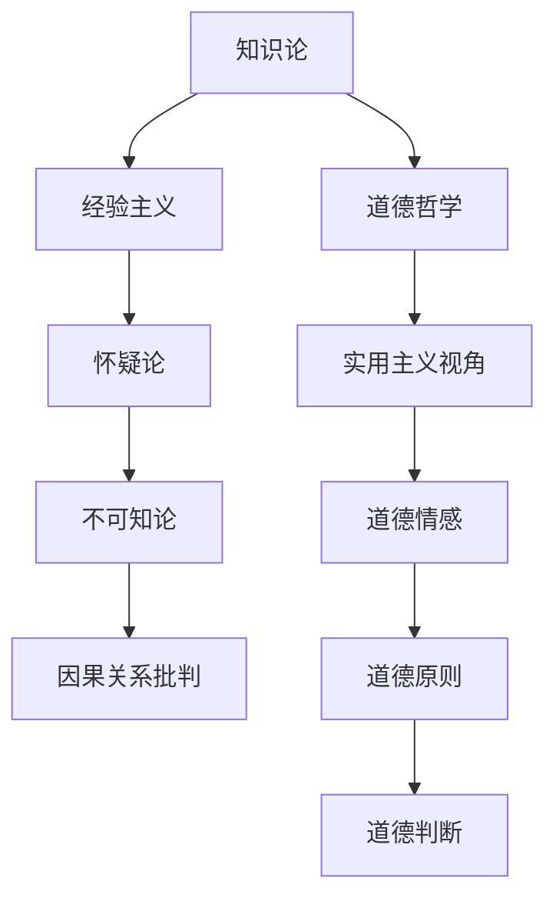

### 伪代码

为了进一步阐述休谟的核心算法原理，我们可以使用伪代码来表示他的思想：

```python
# 定义经验主义
def empiricism():
    # 获取感官经验
    pass

# 定义怀疑论
def skepticism():
    # 质疑理性主义
    pass

# 定义不可知论
def agnosticism():
    # 认为外部世界不可知
    pass

# 定义因果关系批判
def critique_of_causality():
    # 批判因果关系
    pass

# 定义道德哲学
def moral_philosophy():
    # 探讨道德原则和道德判断
    pass

# 定义实用主义视角
def utilitarian_view():
    # 强调道德行为的实用效果
    pass

# 定义道德情感
def moral_emotion():
    # 基于情感进行道德判断
    pass

# 定义道德原则
def moral_principles():
    # 形成社会习惯和风俗
    pass

# 定义道德判断
def moral_judgment():
    # 基于道德情感进行判断
    pass
```

### 数学模型和公式

在休谟的哲学中，数学模型和公式并没有直接的应用，但我们可以使用数学公式来表示他的核心概念之间的关系：

$$
\text{经验} + \text{理性} \neq \text{知识}
$$

$$
\text{感知} \not\Rightarrow \text{真实}
$$

$$
\text{因果关系} \not\Rightarrow \text{必然}
$$

### 详细讲解和举例说明

为了更深入地理解休谟的哲学思想，我们可以通过具体的例子来阐述：

**例1：经验与知识的区别**

当我们看到一只猫时，我们首先会有一个强烈的印象，这个印象包含了猫的形状、颜色、声音等。然后，这个印象会在我们的脑海中形成观念，这个观念是猫的持久形象。通过这个过程，我们获得了关于猫的知识。然而，休谟认为，仅仅通过感官经验，我们无法确定这个知识是否是真实的。

**例2：道德情感的判断**

当我们看到一个人受到伤害时，我们会感到同情和悲伤。这种道德情感使我们判断伤害行为是错误的。休谟认为，道德情感是人类心灵中固有的，道德判断是基于道德情感的，而非理性推理。

**例3：实用主义视角的道德行为**

假设一个人为了自己的利益而欺骗他人，这种行为在短期内可能会带来好处。然而，从长期来看，这种行为可能会导致信任的丧失，最终损害个人的利益。休谟认为，道德行为的目的是为了实现个人的幸福和社会的和谐，因此，欺骗行为是不道德的。

### 最佳实践、小结、注意事项、拓展阅读

**最佳实践**：在学习和研究休谟的哲学时，我们应该注重理解他的核心概念和理论，并通过具体的例子来加深对哲学思想的理解。

**小结**：休谟的哲学思想以经验主义为核心，他强调感性经验的重要性，对理性主义进行了深刻的批判。他的道德哲学具有实用主义视角，认为道德行为的目的是为了实现个人的幸福和社会的和谐。

**注意事项**：在研究休谟的哲学时，我们应该注意区分他的哲学观点和事实陈述，避免将哲学观点当作事实来接受。

**拓展阅读**：为了更深入地了解休谟的哲学思想，建议阅读他的原著著作，如《人性论》和《道德原理的研究》。此外，还可以阅读相关的评论和研究文章，以获取更全面的了解。作者：AI天才研究院/AI Genius Institute & 禅与计算机程序设计艺术 /Zen And The Art of Computer Programming

### 第3章：休谟的经验主义与知识论

#### 3.1 经验主义的基本原理

休谟的经验主义认为，知识来源于经验，经验是获取知识的唯一途径。在休谟看来，经验包括两种：印象和观念。印象是我们在感知事物时产生的强烈感觉，如看到、听到、触摸到等；观念则是我们对印象的再现，如脑海中形成的关于事物的形象。休谟认为，我们的所有知识都来源于经验，无论是直接经验还是间接经验。

直接经验是指我们通过感官直接感知到的事物，如看到一只猫，听到一首歌等。间接经验则是指我们通过其他人的描述或文献资料了解的事物，如通过书籍了解古埃及文明。休谟认为，尽管间接经验并非直接感知，但它们仍然是建立在直接经验基础之上的。

在休谟的经验主义中，联想是一个重要的概念。他认为，我们的思维和行动往往受到习惯的影响，这种习惯性联想使我们能够将不同的经验联系起来，形成更复杂的观念和知识。例如，我们可能会通过看到红色水果（如苹果）而联想到“甜”这个词，因为我们在过去的经验中知道苹果是甜的。

#### 3.2 知识论的批判

休谟对知识论进行了深入的批判，特别是对理性主义进行了严厉的质疑。他认为，理性本身并不能产生知识，知识只能来源于经验。以下是对休谟知识论批判的详细阐述：

1. **怀疑论**：休谟认为，我们的知识可能并不像理性主义者所认为的那样可靠。他提出了“知识三问题”，质疑了理性主义的基础。这三个问题是：我们是否知道我们所知道的是真实的？我们是否知道我们的知识是如何获得的？我们是否知道我们的知识是有效的？

2. **不可知论**：休谟认为，我们无法获得关于外部世界的真正知识。我们的感官经验只是我们对世界的直接认识，但这些认识可能并不真实。他提出了“感知的相似性”理论，认为我们的感知经验可能是虚假的。

3. **因果关系的批判**：休谟对因果关系提出了质疑，他认为因果关系并不是一个客观存在的实体，而是一种习惯性联想。他认为，我们通过观察现象之间的先后关系，推断出它们之间的因果关系，但这种推断并不一定可靠。

#### 3.3 经验主义的局限

尽管休谟的经验主义对理性主义进行了有力的批判，但它也存在一些局限。首先，经验主义可能过于强调经验的作用，忽视了理性在知识形成中的作用。例如，虽然我们的大部分知识来源于经验，但我们也需要理性来分析和解释这些经验，从而形成更复杂的知识。

其次，经验主义可能过于简单化地看待知识的来源。在现实生活中，我们的知识不仅来源于直接的感官经验，还来源于间接的经验、推理和假设。这些因素在知识形成中同样发挥着重要作用。

最后，经验主义可能忽视了人类认知的主观性。我们的感知经验受到个体差异的影响，不同人对同一事物的感知可能存在差异。因此，在获取知识时，我们需要考虑个体差异，避免将个人的感知经验当作普遍的真理。

### Mermaid 流�程图

以下是休谟的经验主义与知识论核心概念与联系的 Mermaid 流程图：

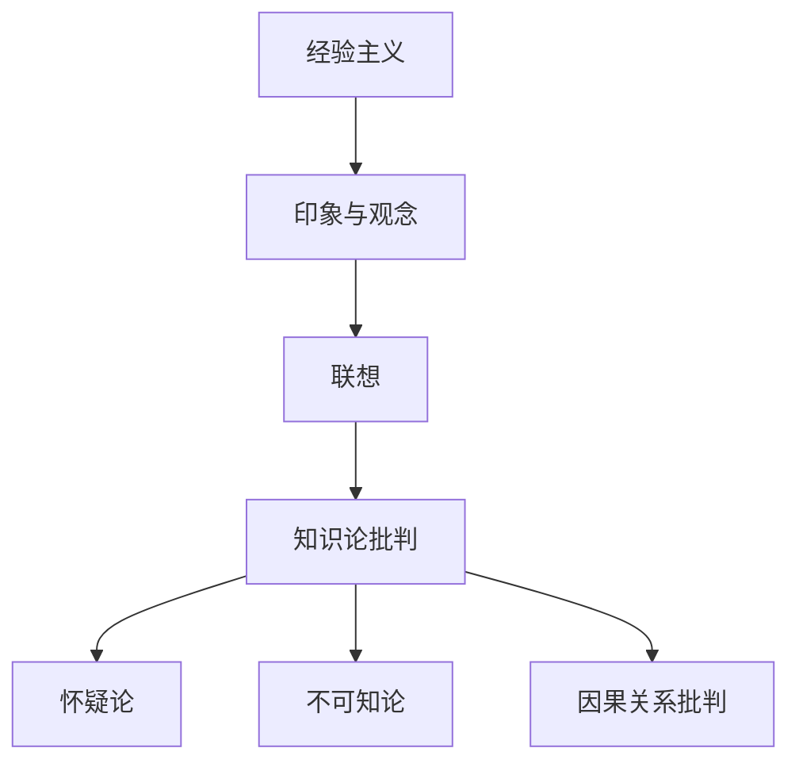

### 伪代码

为了进一步阐述休谟的经验主义与知识论，我们可以使用伪代码来表示他的思想：

```python
# 定义印象与观念
def impression():
    # 产生强烈感觉
    pass

def idea():
    # 再现印象
    pass

# 定义联想
def association():
    # 通过习惯影响思维和行动
    pass

# 定义知识论批判
def critique_of_knowledge():
    # 批判理性主义
    pass

# 定义怀疑论
def skepticism():
    # 质疑知识的可靠性
    pass

# 定义不可知论
def agnosticism():
    # 认为外部世界不可知
    pass

# 定义因果关系批判
def critique_of_causality():
    # 批判因果关系
    pass
```

### 数学模型和公式

在休谟的哲学中，数学模型和公式并没有直接的应用，但我们可以使用数学公式来表示他的核心概念之间的关系：

$$
\text{经验} \neq \text{知识}
$$

$$
\text{印象} + \text{观念} = \text{知识}
$$

### 详细讲解和举例说明

为了更深入地理解休谟的经验主义与知识论，我们可以通过具体的例子来阐述：

**例1：印象与观念的关系**

当我们看到一只猫时，我们首先会有一个强烈的印象，这个印象包含了猫的形状、颜色、声音等。然后，这个印象会在我们的脑海中形成观念，这个观念是猫的持久形象。通过这个过程，我们获得了关于猫的知识。然而，休谟认为，仅仅通过感官经验，我们无法确定这个知识是否是真实的。

**例2：知识的可靠性**

假设一个人在沙漠中迷失方向，他看到远处有一座山，并认为那是出路。但事实上，那座山并不是出路。这个例子说明了，即使我们的感知经验是真实的，我们仍然可能因为错误的信息而得出错误的结论。这反映了休谟的怀疑论观点，即我们的知识可能并不像我们想象的那样可靠。

**例3：因果关系的批判**

一个人可能会通过观察现象之间的先后关系来推断因果关系。例如，他可能会认为下雨是因为天空中的云彩，而云彩的出现则是因为地球的自转。然而，休谟认为，这种推断并不一定可靠，因为因果关系并不是一个客观存在的实体，而是一种习惯性联想。

### 最佳实践、小结、注意事项、拓展阅读

**最佳实践**：在学习和研究休谟的哲学时，我们应该注重理解他的核心概念和理论，并通过具体的例子来加深对哲学思想的理解。

**小结**：休谟的经验主义认为，知识来源于经验，经验是获取知识的唯一途径。他对知识论进行了深入的批判，提出了怀疑论、不可知论和因果关系批判等观点。这些观点对现代哲学产生了深远的影响。

**注意事项**：在研究休谟的哲学时，我们应该注意区分他的哲学观点和事实陈述，避免将哲学观点当作事实来接受。

**拓展阅读**：为了更深入地了解休谟的哲学思想，建议阅读他的原著著作，如《人性论》和《道德原理的研究》。此外，还可以阅读相关的评论和研究文章，以获取更全面的了解。作者：AI天才研究院/AI Genius Institute & 禅与计算机程序设计艺术 /Zen And The Art of Computer Programming

### 第4章：休谟的道德哲学与伦理观

#### 4.1 道德哲学的基本原则

休谟的道德哲学以情感主义为核心，他认为道德判断是基于情感的，而非理性的。休谟道德哲学的基本原则可以概括为以下几点：

1. **道德情感**：休谟认为，道德情感是人类心灵中固有的。道德情感使我们能够判断行为的对错，并激发我们做出道德行为。例如，当我们看到他人受到伤害时，我们会感到同情和悲伤，这种情感使我们认为伤害他人是不道德的。

2. **道德原则**：休谟认为，道德原则是社会习惯和风俗的产物，而非理性的产物。道德原则是通过习惯性联想形成的，它们是社会秩序和道德行为的基石。例如，我们认为诚实是一种道德原则，这是因为在我们的社会文化中，诚实被认为是一种重要的品质。

3. **道德判断**：休谟认为，道德判断是基于道德情感的，而非理性推理。道德判断是一种情感反应，它使我们能够判断行为的对错，并激发我们做出道德行为。例如，当我们认为某个行为是不道德的，我们可能会感到愤怒或厌恶，这种情感反应使我们认为这个行为应该受到谴责。

#### 4.2 道德哲学的实用主义视角

休谟的道德哲学具有实用主义视角，他认为道德行为的目的是为了实现个人的幸福和社会的和谐。以下是对休谟道德哲学实用主义视角的详细阐述：

1. **功利主义**：休谟认为，道德行为应该以实现最大幸福为目标。他认为，行为的道德价值取决于其产生的结果，即是否能够带来幸福。例如，一个行为如果能够使大多数人感到幸福，那么它就是道德的。

2. **道德责任**：休谟认为，道德责任是基于道德法则的，它要求人们遵守道德法则。道德责任是道德行为的核心，它要求人们出于道德法则行事，而不是出于个人利益。例如，当我们承诺做某件事时，我们有道德责任去履行这个承诺。

3. **道德实践**：休谟认为，道德实践是实现个人幸福和社会和谐的重要手段。通过道德实践，人们可以培养良好的道德品质，形成和谐的社会关系。例如，通过诚实、公正和宽容等道德实践，人们可以建立互信、和谐的社会。

### Mermaid 流程图

以下是休谟道德哲学核心概念与联系的 Mermaid 流程图：

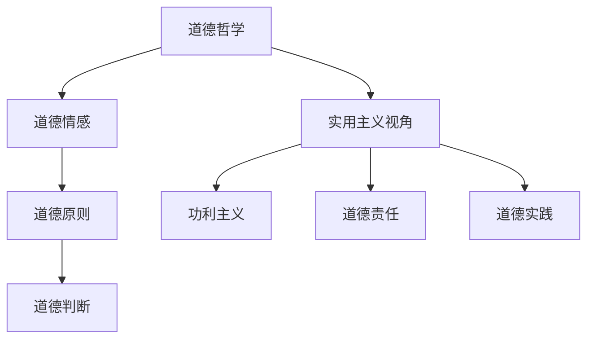

### 伪代码

为了进一步阐述休谟的道德哲学，我们可以使用伪代码来表示他的思想：

```python
# 定义道德情感
def moral_emotion():
    # 判断行为对错
    pass

# 定义道德原则
def moral_principles():
    # 形成社会习惯和风俗
    pass

# 定义道德判断
def moral_judgment():
    # 基于情感进行判断
    pass

# 定义功利主义
def utilitarianism():
    # 以实现最大幸福为目标
    pass

# 定义道德责任
def moral_duty():
    # 遵守道德法则
    pass

# 定义道德实践
def moral_practice():
    # 培养道德品质
    pass
```

### 数学模型和公式

在休谟的道德哲学中，数学模型和公式并没有直接的应用，但我们可以使用数学公式来表示他的核心概念之间的关系：

$$
\text{道德情感} \rightarrow \text{道德判断}
$$

$$
\text{道德原则} \rightarrow \text{社会秩序}
$$

$$
\text{道德责任} \rightarrow \text{道德行为}
$$

### 详细讲解和举例说明

为了更深入地理解休谟的道德哲学，我们可以通过具体的例子来阐述：

**例1：道德情感的判断**

当我们看到一个人欺骗他人时，我们可能会感到愤怒和厌恶。这种情感反应使我们认为欺骗行为是不道德的。休谟认为，道德情感是人类心灵中固有的，道德判断是基于道德情感的。

**例2：道德原则的形成**

在社会生活中，我们会形成一系列道德原则，如诚实、公正、宽容等。这些道德原则是通过习惯性联想形成的，它们是社会秩序和道德行为的基石。休谟认为，道德原则是社会习惯和风俗的产物。

**例3：道德责任的履行**

当我们承诺做某件事时，我们有道德责任去履行这个承诺。如果我们不履行承诺，我们可能会受到他人的谴责。休谟认为，道德责任是基于道德法则的，它要求人们遵守道德法则。

### 最佳实践、小结、注意事项、拓展阅读

**最佳实践**：在学习和研究休谟的道德哲学时，我们应该注重理解他的核心概念和理论，并通过具体的例子来加深对道德哲学的理解。

**小结**：休谟的道德哲学以情感主义为核心，他认为道德判断是基于情感的，而非理性的。他的道德哲学具有实用主义视角，认为道德行为的目的是为了实现个人的幸福和社会的和谐。

**注意事项**：在研究休谟的道德哲学时，我们应该注意区分他的哲学观点和事实陈述，避免将哲学观点当作事实来接受。

**拓展阅读**：为了更深入地了解休谟的道德哲学，建议阅读他的原著著作，如《人性论》和《道德原理的研究》。此外，还可以阅读相关的评论和研究文章，以获取更全面的了解。作者：AI天才研究院/AI Genius Institute & 禅与计算机程序设计艺术 /Zen And The Art of Computer Programming

### 第5章：康德的生平与哲学思想

#### 5.1 康德的生平

伊曼努尔·康德（Immanuel Kant，1724-1804）是德国著名的哲学家，被认为是现代哲学的奠基人之一。他出生于东普鲁士的哥尼斯堡，这个小镇对康德的哲学思想产生了深远的影响。康德的父亲是一名马夫，但他的母亲是一位虔诚的基督徒，对康德的教育产生了重要影响。

康德在哥尼斯堡大学接受了教育，并在1740年获得了哲学学士学位。之后，他继续在哥尼斯堡大学学习神学和法学，但他的兴趣主要集中在哲学上。康德的哲学思想逐渐成熟，他开始写作并发表哲学论文。

在1755年，康德发表了他的第一篇哲学论文《论感性之形式》，这篇论文标志着他的哲学思想的诞生。在接下来的几年里，康德继续写作并发表了多部哲学著作，包括《论人类不完善的理性》（1755年）、《道德形而上学的基础》（1785年）和《纯粹理性批判》（1781年）等。

康德的哲学思想对后世哲学产生了深远的影响，他的作品被认为是现代哲学的里程碑。康德在哥尼斯堡度过了大部分职业生涯，直到他逝世。

#### 5.2 康德的哲学思想

康德的哲学思想以先验哲学为核心，他试图通过先验哲学来解决知识论、伦理学和美学等问题。康德的哲学思想主要包括以下几个方面：

1. **先验哲学**：康德的先验哲学试图解决知识论问题，他认为知识不仅来源于经验，还依赖于先天的认知形式。康德提出了“纯粹理性批判”的概念，探讨知识的本质和起源。

2. **道德哲学**：康德的道德哲学强调道德法则的先验性质，他认为道德责任是基于道德法则的。康德提出了“善良意志”的概念，认为道德行为的本质是出于善良意志。

3. **美学**：康德的美学理论探讨美的本质和审美经验。他认为，美是无利害的，即审美活动不涉及实用目的。

康德的哲学思想对现代哲学产生了深远的影响，他的作品不仅为哲学的发展提供了新的方向，也为伦理学和美学等领域的理论奠定了基础。

### Mermaid 流程图

以下是康德哲学思想的核心概念与联系的 Mermaid 流程图：

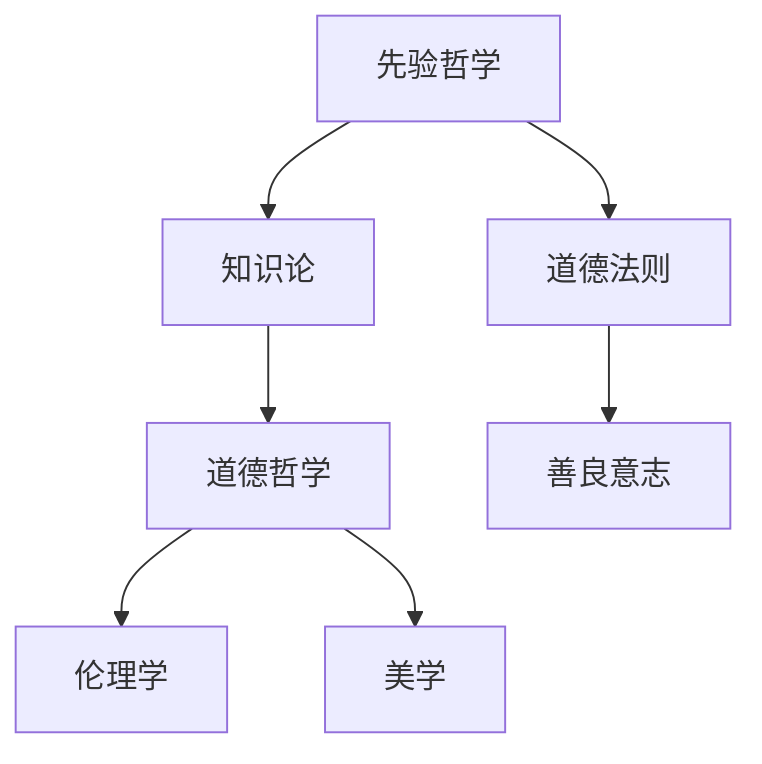

### 伪代码

为了进一步阐述康德的哲学思想，我们可以使用伪代码来表示他的思想：

```python
# 定义先验哲学
def transcendental_philosophy():
    # 探讨知识的本质和起源
    pass

# 定义知识论
def epistemology():
    # 研究知识的来源和性质
    pass

# 定义道德哲学
def ethics():
    # 探讨道德法则和道德责任
    pass

# 定义伦理学
def ethics_ontology():
    # 研究道德行为的本质和道德责任的含义
    pass

# 定义美学
def aesthetics():
    # 探讨美的本质和审美经验
    pass

# 定义道德法则
def moral_law():
    # 探讨道德法则的先验性质
    pass

# 定义善良意志
def benevolent_will():
    # 认为道德行为的本质是善良意志
    pass
```

### 数学模型和公式

在康德的哲学中，数学模型和公式并没有直接的应用，但我们可以使用数学公式来表示他的核心概念之间的关系：

$$
\text{先验哲学} \Rightarrow \text{知识论}
$$

$$
\text{道德法则} \Rightarrow \text{道德责任}
$$

$$
\text{善良意志} \Rightarrow \text{道德行为}
$$

### 详细讲解和举例说明

为了更深入地理解康德的哲学思想，我们可以通过具体的例子来阐述：

**例1：先验哲学与知识论**

康德的先验哲学认为，知识不仅来源于经验，还依赖于先天的认知形式。例如，他认为，空间和时间是先天的认知形式，是我们感知世界的基础。通过这个例子，我们可以理解康德如何通过先验哲学来解释知识的本质。

**例2：道德法则与道德责任**

康德认为，道德法则具有先验性质，道德责任是基于道德法则的。例如，他认为，尊重他人的尊严是道德法则的一部分，遵守这个法则是我们有道德责任的行为。通过这个例子，我们可以理解康德如何通过道德哲学来解释道德责任的含义。

**例3：善良意志与道德行为**

康德认为，道德行为的本质是善良意志，即出于道德法则行事。例如，当我们遵守诺言时，我们的行为是出于对道德法则的尊重，而不是出于个人利益。通过这个例子，我们可以理解康德如何通过道德哲学来解释道德行为的本质。

### 最佳实践、小结、注意事项、拓展阅读

**最佳实践**：在学习和研究康德的哲学时，我们应该注重理解他的核心概念和理论，并通过具体的例子来加深对哲学思想的理解。

**小结**：康德的哲学思想以先验哲学为核心，他试图通过先验哲学来解决知识论、伦理学和美学等问题。他的道德哲学强调道德法则的先验性质，认为道德行为的本质是善良意志。

**注意事项**：在研究康德的哲学时，我们应该注意区分他的哲学观点和事实陈述，避免将哲学观点当作事实来接受。

**拓展阅读**：为了更深入地了解康德的哲学思想，建议阅读他的原著著作，如《纯粹理性批判》和《道德形而上学的基础》。此外，还可以阅读相关的评论和研究文章，以获取更全面的了解。作者：AI天才研究院/AI Genius Institute & 禅与计算机程序设计艺术 /Zen And The Art of Computer Programming

### 第6章：康德的核心概念与理论

#### 6.1 先验哲学的基本概念

康德的先验哲学试图解决知识论问题，他提出了以下核心概念：

1. **先验范畴**：康德认为，先验范畴是先天存在的，是我们认知世界的必要条件。这些范畴包括空间、时间、因果关系等。康德认为，先验范畴是理性对经验的综合，它们构成了我们认识世界的基础。

2. **纯粹理性**：康德认为，纯粹理性是人类的认知能力，它能够超越经验，进行抽象思维。纯粹理性使我们能够理解先验范畴，并建立起对世界的认知。

3. **先验综合判断**：康德认为，先验综合判断是理性对经验的综合，它能够产生新的知识。先验综合判断是康德知识论的核心，他认为，知识不仅仅是经验的简单积累，而是理性对经验的综合。

#### 6.2 道德哲学的理论基础

康德的道德哲学以先验哲学为基础，他提出了以下核心理论：

1. **道德法则**：康德认为，道德法则是先验存在的，它是人类道德行为的基础。道德法则包括“善良意志”和“普遍性原则”。善良意志是指出于道德法则行事，而普遍性原则是指我们的行为应该能够成为普遍法则。

2. **道德责任**：康德认为，道德责任是基于道德法则的。道德责任要求我们遵守道德法则，而不是出于个人利益。康德认为，道德责任是道德行为的核心，它使我们的行为具有道德价值。

3. **道德义务**：康德认为，道德义务是道德行为的核心，它要求我们出于道德法则行事。道德义务是基于道德法则的要求，它使我们的行为具有道德价值。

#### 6.3 道德哲学与知识论的关系

康德的道德哲学与知识论有着密切的关系。他认为，道德法则与先验范畴一样，是先天存在的。康德认为，道德法则不仅是道德行为的指南，也是我们认知世界的基础。道德法则使我们能够理解先验范畴，并建立起对世界的认知。

康德认为，道德哲学与知识论的关系是互补的。知识论帮助我们理解世界的本质，而道德哲学帮助我们理解我们的行为如何影响世界。康德认为，道德哲学与知识论的融合可以使我们建立起完整的认知体系。

### Mermaid 流程图

以下是康德核心概念与联系的 Mermaid 流程图：

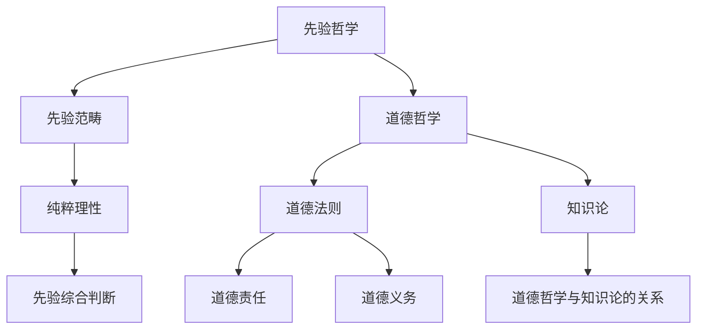

### 伪代码

为了进一步阐述康德的核心概念与理论，我们可以使用伪代码来表示他的思想：

```python
# 定义先验哲学
def transcendental_philosophy():
    # 探讨先验范畴、纯粹理性和先验综合判断
    pass

# 定义先验范畴
def transcendental_categories():
    # 包括空间、时间、因果关系等
    pass

# 定义纯粹理性
def pure_reason():
    # 超越经验，进行抽象思维
    pass

# 定义先验综合判断
def synthetic judgments():
    # 综合经验，产生新知识
    pass

# 定义道德哲学
def moral_philosophy():
    # 探讨道德法则、道德责任和道德义务
    pass

# 定义道德法则
def moral_laws():
    # 基于善良意志和普遍性原则
    pass

# 定义道德责任
def moral_duties():
    # 遵守道德法则
    pass

# 定义道德义务
def moral_obligations():
    # 出于道德法则行事
    pass

# 定义知识论
def epistemology():
    # 探讨知识来源和本质
    pass

# 定义道德哲学与知识论的关系
def relationship_between_ethics_and_epistemology():
    # 互补关系，构建完整认知体系
    pass
```

### 数学模型和公式

在康德的哲学中，数学模型和公式并没有直接的应用，但我们可以使用数学公式来表示他的核心概念之间的关系：

$$
\text{先验范畴} \Rightarrow \text{纯粹理性}
$$

$$
\text{先验综合判断} \Rightarrow \text{知识}
$$

$$
\text{道德法则} \Rightarrow \text{道德责任}
$$

### 详细讲解和举例说明

为了更深入地理解康德的核心概念与理论，我们可以通过具体的例子来阐述：

**例1：先验范畴的作用**

康德认为，先验范畴是我们认知世界的必要条件。例如，空间和时间是先验范畴，它们使我们能够理解事物的位置和变化。通过这个例子，我们可以理解先验范畴如何帮助我们认知世界。

**例2：道德法则的应用**

康德认为，道德法则是先验存在的。例如，善良意志是道德法则的一部分，它要求我们出于道德法则行事。通过这个例子，我们可以理解道德法则如何指导我们的道德行为。

**例3：道德哲学与知识论的融合**

康德认为，道德哲学与知识论是互补的。例如，道德法则不仅指导我们的道德行为，也帮助我们理解世界的本质。通过这个例子，我们可以理解道德哲学与知识论如何相互促进。

### 最佳实践、小结、注意事项、拓展阅读

**最佳实践**：在学习和研究康德的哲学时，我们应该注重理解他的核心概念与理论，并通过具体的例子来加深对哲学思想的理解。

**小结**：康德的先验哲学试图解决知识论问题，他提出了先验范畴、纯粹理性和先验综合判断等核心概念。他的道德哲学以道德法则为基础，强调道德责任和道德义务。康德认为，道德哲学与知识论是互补的，它们共同构成了一个完整的认知体系。

**注意事项**：在研究康德的哲学时，我们应该注意区分他的哲学观点和事实陈述，避免将哲学观点当作事实来接受。

**拓展阅读**：为了更深入地了解康德的哲学思想，建议阅读他的原著著作，如《纯粹理性批判》和《道德形而上学的基础》。此外，还可以阅读相关的评论和研究文章，以获取更全面的了解。作者：AI天才研究院/AI Genius Institute & 禅与计算机程序设计艺术 /Zen And The Art of Computer Programming

### 第7章：康德的先验哲学体系

#### 7.1 先验哲学的基本概念

康德的先验哲学试图解决知识论问题，他提出了以下核心概念：

1. **先验范畴**：康德认为，先验范畴是先天存在的，是我们认知世界的必要条件。这些范畴包括空间、时间、因果关系等。康德认为，先验范畴是理性对经验的综合，它们构成了我们认识世界的基础。

2. **纯粹理性**：康德认为，纯粹理性是人类的认知能力，它能够超越经验，进行抽象思维。纯粹理性使我们能够理解先验范畴，并建立起对世界的认知。

3. **先验综合判断**：康德认为，先验综合判断是理性对经验的综合，它能够产生新的知识。先验综合判断是康德知识论的核心，他认为，知识不仅仅是经验的简单积累，而是理性对经验的综合。

#### 7.2 纯理性的运用

康德的先验哲学强调纯理性的运用，他认为纯理性能够超越经验，进行抽象思维。康德的纯理性运用包括以下几个方面：

1. **形而上学**：康德认为，形而上学是纯理性的产物，它能够超越经验，探讨世界的本质。康德的形而上学试图解决诸如自由、上帝存在和灵魂不朽等哲学问题。

2. **道德哲学**：康德认为，道德哲学是纯理性的产物，它能够超越经验，探讨道德法则和道德责任。康德的道德哲学强调道德法则的先验性质，认为道德责任是基于道德法则的。

3. **美学**：康德认为，美学是纯理性的产物，它能够超越经验，探讨美的本质。康德的美学理论探讨美的无利害性和审美经验的纯粹性。

#### 7.3 先验综合判断

康德的先验综合判断是他知识论的核心概念，他认为，知识不仅仅是经验的简单积累，而是理性对经验的综合。先验综合判断包括以下几种类型：

1. **先验分析判断**：这类判断是关于先验范畴的判断，它们是必然真的。例如，“所有的物体都有体积”是一个先验分析判断。

2. **先验综合判断**：这类判断是关于经验的判断，它们是可能的，但不是必然真的。例如，“太阳明天会升起”是一个先验综合判断。

3. **先验构造判断**：这类判断是关于先验范畴的综合运用，它们是可能的，但不是必然真的。例如，“人应该遵守道德法则”是一个先验构造判断。

### Mermaid 流程图

以下是康德先验哲学体系核心概念与联系的 Mermaid 流程图：

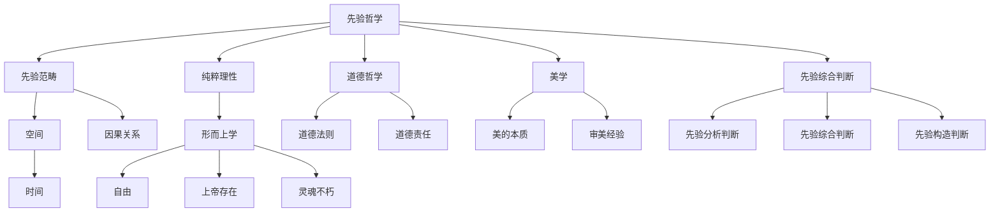

### 伪代码

为了进一步阐述康德的先验哲学体系，我们可以使用伪代码来表示他的思想：

```python
# 定义先验哲学
def transcendental_philosophy():
    # 探讨先验范畴、纯粹理性、先验综合判断等概念
    pass

# 定义先验范畴
def transcendental_categories():
    # 包括空间、时间、因果关系等
    pass

# 定义纯粹理性
def pure_reason():
    # 超越经验，进行抽象思维
    pass

# 定义先验综合判断
def synthetic_judgments():
    # 综合经验，产生新知识
    pass

# 定义形而上学
def metaphysics():
    # 探讨世界的本质
    pass

# 定义道德哲学
def ethics():
    # 探讨道德法则和道德责任
    pass

# 定义美学
def aesthetics():
    # 探讨美的本质和审美经验
    pass

# 定义先验分析判断
def analytical_judgments():
    # 必然真的判断
    pass

# 定义先验综合判断
def synthetic_judgments():
    # 可能的判断
    pass

# 定义先验构造判断
def constructive_judgments():
    # 可能的判断
    pass
```

### 数学模型和公式

在康德的哲学中，数学模型和公式并没有直接的应用，但我们可以使用数学公式来表示他的核心概念之间的关系：

$$
\text{先验范畴} \Rightarrow \text{纯粹理性}
$$

$$
\text{先验综合判断} \Rightarrow \text{知识}
$$

$$
\text{道德法则} \Rightarrow \text{道德责任}
$$

### 详细讲解和举例说明

为了更深入地理解康德的先验哲学体系，我们可以通过具体的例子来阐述：

**例1：先验范畴的作用**

康德认为，先验范畴是我们认知世界的必要条件。例如，空间和时间是先验范畴，它们使我们能够理解事物的位置和变化。通过这个例子，我们可以理解先验范畴如何帮助我们认知世界。

**例2：纯粹理性的运用**

康德认为，纯粹理性能够超越经验，进行抽象思维。例如，我们可以通过纯粹理性来探讨世界的本质，如自由、上帝存在和灵魂不朽等问题。通过这个例子，我们可以理解纯粹理性如何帮助我们在哲学上探讨复杂问题。

**例3：先验综合判断的应用**

康德认为，先验综合判断是知识的重要组成部分。例如，当我们说“太阳明天会升起”时，这是一个先验综合判断，因为它结合了先验范畴（时间）和经验（过去的观察）。通过这个例子，我们可以理解先验综合判断如何帮助我们在经验基础上形成新的知识。

### 最佳实践、小结、注意事项、拓展阅读

**最佳实践**：在学习和研究康德的先验哲学体系时，我们应该注重理解他的核心概念与理论，并通过具体的例子来加深对哲学思想的理解。

**小结**：康德的先验哲学试图解决知识论问题，他提出了先验范畴、纯粹理性和先验综合判断等核心概念。他的先验哲学体系强调理性在认知世界和道德哲学中的作用，认为知识不仅仅是经验的积累，而是理性对经验的综合。

**注意事项**：在研究康德的先验哲学时，我们应该注意区分他的哲学观点和事实陈述，避免将哲学观点当作事实来接受。

**拓展阅读**：为了更深入地了解康德的先验哲学体系，建议阅读他的原著著作，如《纯粹理性批判》和《道德形而上学的基础》。此外，还可以阅读相关的评论和研究文章，以获取更全面的了解。作者：AI天才研究院/AI Genius Institute & 禅与计算机程序设计艺术 /Zen And The Art of Computer Programming

### 第8章：康德的伦理学与道德哲学

#### 8.1 康德的伦理学理论

康德的伦理学理论以“善良意志”为核心，他认为道德行为的本质是善良意志，而不是行为的结果。康德的伦理学观点可以概括为以下几点：

1. **道德法则**：康德认为，道德法则是普遍适用的，它们是先验存在的。道德法则包括“善良意志”和“普遍性原则”。善良意志是指出于道德法则行事，而普遍性原则是指我们的行为应该能够成为普遍法则。

2. **道德责任**：康德认为，道德责任是基于道德法则的。道德责任要求我们遵守道德法则，而不是出于个人利益。康德认为，道德责任是道德行为的核心，它使我们的行为具有道德价值。

3. **道德义务**：康德认为，道德义务是道德行为的核心，它要求我们出于道德法则行事。道德义务是基于道德法则的要求，它使我们的行为具有道德价值。康德认为，道德义务是道德行为的基础，没有道德义务，就没有道德行为。

#### 8.2 康德的道德哲学观点

康德的道德哲学观点强调道德法则的普遍性和先验性质。他认为，道德法则不仅适用于个体，也适用于整个社会。康德的道德哲学观点可以概括为以下几点：

1. **道德自律**：康德认为，道德自律是道德行为的核心。道德自律是指我们根据自己的道德法则行事，而不是受外界压力或利益驱动。

2. **道德行为的动机**：康德认为，道德行为的动机是基于道德法则的，而不是基于结果。他认为，道德行为的目的是为了遵守道德法则，而不是为了获得奖赏或避免惩罚。

3. **道德行为的客观性**：康德认为，道德行为具有客观性，它们不依赖于个人的主观感受。道德行为是根据道德法则来判断的，而不是根据个人的利益或感受。

#### 8.3 康德的伦理学在现实中的应用

康德的伦理学在现实生活中具有广泛的应用，特别是在道德决策和伦理学教育方面。以下是对康德伦理学在现实中的应用的详细阐述：

1. **道德决策**：康德的道德哲学提供了一种道德决策的指导原则，它强调道德法则和道德责任的重要性。在做出道德决策时，我们应该遵循道德法则，而不是仅仅考虑个人的利益。

2. **伦理学教育**：康德的伦理学观点为伦理学教育提供了重要的理论基础。在教育过程中，我们应该强调道德法则和道德责任的重要性，培养个体遵守道德法则的自觉性。

3. **社会责任**：康德认为，道德责任不仅是个体的责任，也是社会的责任。在现实生活中，我们应该积极参与社会事务，遵守社会道德法则，促进社会的和谐发展。

### Mermaid 流程图

以下是康德伦理学与道德哲学核心概念与联系的 Mermaid 流程图：

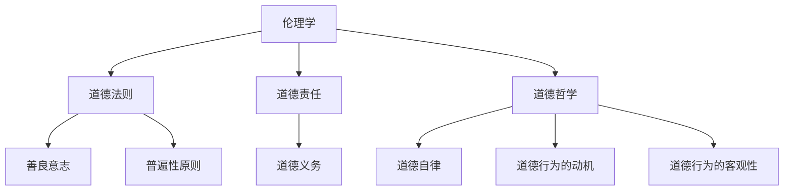

### 伪代码

为了进一步阐述康德的伦理学与道德哲学，我们可以使用伪代码来表示他的思想：

```python
# 定义伦理学
def ethics():
    # 探讨道德法则、道德责任和道德义务
    pass

# 定义道德法则
def moral_laws():
    # 包括善良意志和普遍性原则
    pass

# 定义善良意志
def benevolent_will():
    # 出于道德法则行事
    pass

# 定义普遍性原则
def universal_principle():
    # 行为能够成为普遍法则
    pass

# 定义道德责任
def moral_duties():
    # 遵守道德法则
    pass

# 定义道德义务
def moral_obligations():
    # 出于道德法则行事
    pass

# 定义道德自律
def moral_autonomy():
    # 自主地遵守道德法则
    pass

# 定义道德行为的动机
def motivation_of_moral_action():
    # 基于道德法则
    pass

# 定义道德行为的客观性
def objectivity_of_moral_action():
    # 不依赖于个人主观感受
    pass
```

### 数学模型和公式

在康德的伦理学中，数学模型和公式并没有直接的应用，但我们可以使用数学公式来表示他的核心概念之间的关系：

$$
\text{道德法则} \Rightarrow \text{道德责任}
$$

$$
\text{善良意志} \Rightarrow \text{道德行为}
$$

### 详细讲解和举例说明

为了更深入地理解康德的伦理学与道德哲学，我们可以通过具体的例子来阐述：

**例1：道德法则的应用**

康德认为，道德法则是普遍适用的，它们是先验存在的。例如，遵守诺言是一个道德法则，因为遵守诺言能够维护社会的秩序和信任。通过这个例子，我们可以理解道德法则如何在现实生活中发挥作用。

**例2：道德责任与道德义务**

康德认为，道德责任和道德义务是基于道德法则的。例如，当我们答应帮助他人时，我们有道德责任去履行这个承诺。同时，我们也具有道德义务去帮助他人，因为这符合道德法则。通过这个例子，我们可以理解道德责任和道德义务的关系。

**例3：道德自律与道德行为的动机**

康德认为，道德自律是道德行为的核心，道德行为的动机是基于道德法则的。例如，当我们决定遵守道德法则时，我们是在进行道德自律。我们的动机是出于对道德法则的尊重，而不是出于个人利益。通过这个例子，我们可以理解道德自律和道德行为的动机。

### 最佳实践、小结、注意事项、拓展阅读

**最佳实践**：在学习和研究康德的伦理学与道德哲学时，我们应该注重理解他的核心概念与理论，并通过具体的例子来加深对哲学思想的理解。

**小结**：康德的伦理学理论以“善良意志”为核心，他认为道德行为的本质是善良意志，而不是行为的结果。他的道德哲学强调道德法则的普遍性和先验性质，认为道德责任和道德义务是基于道德法则的。

**注意事项**：在研究康德的伦理学与道德哲学时，我们应该注意区分他的哲学观点和事实陈述，避免将哲学观点当作事实来接受。

**拓展阅读**：为了更深入地了解康德的伦理学与道德哲学，建议阅读他的原著著作，如《道德形而上学的基础》。此外，还可以阅读相关的评论和研究文章，以获取更全面的了解。作者：AI天才研究院/AI Genius Institute & 禅与计算机程序设计艺术 /Zen And The Art of Computer Programming

### 第9章：经验主义与先验哲学的比较

#### 9.1 经验主义与先验哲学的基本原则

经验主义与先验哲学是西方哲学史上的两大流派，它们在知识论、道德哲学和认识论等方面有着根本的不同。

经验主义认为，知识来源于经验，经验是获取知识的唯一途径。休谟是经验主义的重要代表，他强调感性经验的重要性，认为理性无法独立于经验而存在。经验主义者认为，知识是通过感官经验获得的，我们的思维过程是基于经验的。

先验哲学则认为，知识不仅来源于经验，还依赖于先天的认知形式。康德是先验哲学的代表，他认为，我们的认知活动依赖于先验范畴，这些范畴是先天存在的，不是通过经验获得的。先验哲学家强调理性在认知世界中的作用，他们认为，理性能够超越经验，进行抽象思维。

#### 9.2 知识论的差异

在知识论方面，经验主义与先验哲学有着明显的差异。

经验主义者认为，知识来源于经验，经验是获取知识的唯一途径。他们认为，理性无法独立于经验而存在，知识是通过感官经验获得的。经验主义者对理性主义进行了深刻的批判，认为理性本身无法提供知识。

先验哲学家则认为，知识不仅来源于经验，还依赖于先天的认知形式。他们认为，理性能够超越经验，进行抽象思维。康德提出了“纯粹理性批判”的概念，探讨知识的本质和起源。他认为，先验范畴是认知世界的必要条件，是我们认知世界的基础。

#### 9.3 道德哲学的对比

在道德哲学方面，经验主义与先验哲学也有明显的不同。

经验主义强调道德行为的结果，认为道德行为的目的是为了实现个人的幸福和社会的和谐。休谟提出了情感主义观点，认为道德判断是基于情感的，而非理性的。他认为，道德情感是人类心灵中固有的，道德判断是基于道德情感的。

先验哲学则强调道德行为的动机，认为道德行为的目的是为了遵守道德法则。康德提出了“善良意志”的概念，认为道德行为的本质是善良意志，而不是行为的结果。他认为，道德责任是基于道德法则的，道德义务是道德行为的核心。

#### 9.4 认识论的争论

在认识论方面，经验主义与先验哲学的争论尤为激烈。

经验主义者认为，我们的知识来源于经验，但经验并不能保证知识的可靠性。休谟提出了“知识三问题”，质疑了理性主义的基础。他认为，我们的知识可能并不像理性主义者所认为的那样可靠。

先验哲学家则认为，知识不仅来源于经验，还依赖于先天的认知形式。他们认为，理性能够超越经验，进行抽象思维。康德认为，先验范畴是认知世界的必要条件，是我们认知世界的基础。他认为，先验综合判断是知识的重要组成部分，它们能够产生新的知识。

### Mermaid 流程图

以下是经验主义与先验哲学的基本原则、知识论差异、道德哲学对比和认识论争论的 Mermaid 流程图：

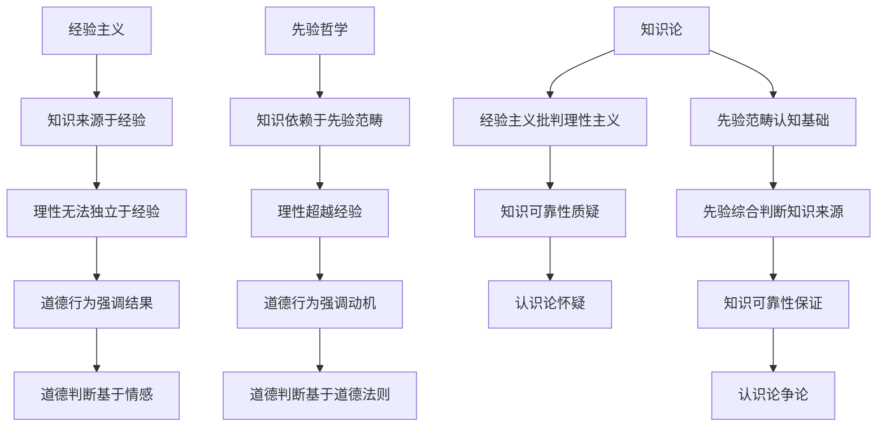

### 伪代码

为了进一步阐述经验主义与先验哲学的对比，我们可以使用伪代码来表示他们的思想：

```python
# 定义经验主义
def empiricism():
    knowledge_from_experience()

# 定义先验哲学
def transcendental_philosophy():
    knowledge_from_a Priori_categories()

# 定义经验主义知识论
def empiricist_epistemology():
    criticize_rationalism()
    doubt_knowledge_reliability()

# 定义先验哲学知识论
def transcendental_epistemology():
    a Priori_categories_cognitive_base()
    synthetic_judgments_knowledge_source()
    guarantee_knowledge_reliability()

# 定义经验主义道德哲学
def empirical_moral_philosophy():
    moral_actions_result-oriented()
    moral_judgments_emotion-based()

# 定义先验哲学道德哲学
def transcendental_moral_philosophy():
    moral_actions_motive-oriented()
    moral_judgments_moral_law-based()

# 定义经验主义认识论
def empirical_affirmative():
    doubt_knowledge_reliability()

# 定义先验哲学认识论
def transcendental_affirmative():
    guarantee_knowledge_reliability()
```

### 数学模型和公式

在经验主义与先验哲学的对比中，数学模型和公式并没有直接的应用，但我们可以使用数学公式来表示他们的核心概念之间的关系：

$$
\text{经验主义：知识来源于经验} \Rightarrow \text{经验}
$$

$$
\text{先验哲学：知识依赖于先验范畴} \Rightarrow \text{先验范畴}
$$

### 详细讲解和举例说明

为了更深入地理解经验主义与先验哲学的对比，我们可以通过具体的例子来阐述：

**例1：知识来源的对比**

经验主义者认为，知识来源于经验。例如，当我们学习一个新技能时，我们是通过反复练习和经验积累来掌握这个技能的。先验哲学家则认为，知识不仅来源于经验，还依赖于先验范畴。例如，我们在学习一个新技能时，还需要运用先验范畴，如空间、时间等，来理解和掌握这个技能。

**例2：道德行为的动机**

经验主义者认为，道德行为的动机是基于结果的。例如，为了获得奖赏或避免惩罚，我们可能会做出道德行为。先验哲学家则认为，道德行为的动机是基于道德法则的。例如，为了遵守道德法则，我们会做出道德行为，而不是仅仅为了获得奖赏或避免惩罚。

**例3：认识论的怀疑**

经验主义者对认识论持有怀疑态度，认为我们的知识可能并不可靠。例如，休谟提出了“知识三问题”，质疑了理性主义的基础。先验哲学家则认为，我们的知识是可靠的，因为它们依赖于先验范畴。例如，康德认为，先验范畴是认知世界的必要条件，是我们认知世界的基础。

### 最佳实践、小结、注意事项、拓展阅读

**最佳实践**：在学习和研究经验主义与先验哲学时，我们应该注重理解他们的核心概念与理论，并通过具体的例子来加深对哲学思想的了解。

**小结**：经验主义与先验哲学在知识论、道德哲学和认识论等方面存在明显的差异。经验主义强调知识的来源是经验，先验哲学则认为知识依赖于先验范畴。他们在道德行为的动机和认识论方面也有不同的观点。

**注意事项**：在研究经验主义与先验哲学时，我们应该注意区分他们的哲学观点和事实陈述，避免将哲学观点当作事实来接受。

**拓展阅读**：为了更深入地了解经验主义与先验哲学，建议阅读休谟的《人性论》和康德的《纯粹理性批判》。此外，还可以阅读相关的评论和研究文章，以获取更全面的了解。作者：AI天才研究院/AI Genius Institute & 禅与计算机程序设计艺术 /Zen And The Art of Computer Programming

### 第10章：休谟与康德的哲学争论

#### 10.1 认识论领域的争论

休谟与康德在认识论领域的争论主要集中在知识的来源和性质上。休谟认为，知识来源于经验，经验是获取知识的唯一途径。他提出了著名的“知识三问题”，质疑了理性主义的基础。他认为，理性本身无法提供知识，知识只能来源于经验。

康德则认为，知识不仅来源于经验，还依赖于先天的认知形式。他提出了“纯粹理性批判”的概念，探讨知识的本质和起源。康德认为，先验范畴是认知世界的必要条件，是我们认知世界的基础。他认为，先验综合判断是知识的重要组成部分，它们能够产生新的知识。

在认识论方面，休谟与康德的争论体现了经验主义与先验哲学的根本差异。休谟强调经验在知识形成中的作用，康德则强调理性在认知世界中的重要性。

#### 10.2 道德哲学领域的争论

在道德哲学领域，休谟与康德也存在着明显的分歧。休谟提出了情感主义观点，认为道德判断是基于情感的，而非理性的。他认为，道德情感是人类心灵中固有的，道德判断是基于道德情感的。

康德则认为，道德判断是基于道德法则的，道德法则具有先验性质。他认为，道德责任是基于道德法则的，道德行为的本质是善良意志。康德强调道德自律和道德行为的动机，认为道德行为的目的是为了遵守道德法则，而不是为了获得奖赏或避免惩罚。

在道德哲学方面，休谟与康德的争论反映了情感主义与先验伦理学的对立。休谟认为，道德判断是基于情感的，康德则认为，道德判断是基于理性法则的。

#### 10.3 伦理学领域的争论

在伦理学领域，休谟与康德也存在着明显的分歧。休谟的伦理学观点具有实用主义视角，他认为道德行为的目的是为了实现个人的幸福和社会的和谐。他认为，道德行为应该以实现最大幸福为目标。

康德则认为，道德行为的目的是为了遵守道德法则，而不是为了实现个人的幸福。他认为，道德责任是基于道德法则的，道德行为的本质是善良意志。康德强调道德自律和道德行为的动机，认为道德行为的目的是为了遵守道德法则，而不是为了获得奖赏或避免惩罚。

在伦理学领域，休谟与康德的争论体现了功利主义与先验伦理学的对立。休谟认为，道德行为的目的是为了实现最大幸福，康德则认为，道德行为的目的是为了遵守道德法则。

### Mermaid 流程图

以下是休谟与康德在认识论、道德哲学和伦理学领域争论的 Mermaid 流程图：

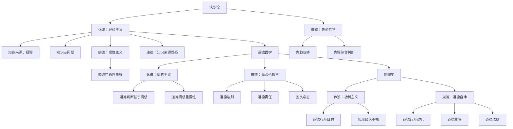

### 伪代码

为了进一步阐述休谟与康德在哲学争论中的观点，我们可以使用伪代码来表示他们的思想：

```python
# 定义休谟的经验主义
def hume_empiricism():
    knowledge_from_experience()

# 定义康德的先验哲学
def kant_transcendental_philosophy():
    knowledge_from_a Priori_categories()

# 定义休谟的知识论
def hume_epistemology():
    criticize_rationalism()
    doubt_knowledge_reliability()

# 定义康德的知识论
def kant_epistemology():
    a Priori_categories_cognitive_base()
    synthetic_judgments_knowledge_source()

# 定义休谟的道德哲学
def hume_moral_philosophy():
    moral_judgments_based_on_emotions()

# 定义康德的道德哲学
def kant_moral_philosophy():
    moral_laws_exist()
    moral_duties_exist()
    benevolent_will_is_essential()

# 定义休谟的伦理学
def hume_ethics():
    moral_actions_are_utilitarian()

# 定义康德的伦理学
def kant_ethics():
    moral_autonomy_is_essential()
    moral_actions_are_based_on_reason()
```

### 数学模型和公式

在休谟与康德的哲学争论中，数学模型和公式并没有直接的应用，但我们可以使用数学公式来表示他们的核心概念之间的关系：

$$
\text{经验主义：知识来源于经验} \Rightarrow \text{经验}
$$

$$
\text{先验哲学：知识依赖于先验范畴} \Rightarrow \text{先验范畴}
$$

### 详细讲解和举例说明

为了更深入地理解休谟与康德的哲学争论，我们可以通过具体的例子来阐述：

**例1：认识论的争论**

休谟认为，知识来源于经验。例如，当我们学习一个新技能时，我们是通过反复练习和经验积累来掌握这个技能的。康德则认为，知识不仅来源于经验，还依赖于先验范畴。例如，我们在学习一个新技能时，还需要运用先验范畴，如空间、时间等，来理解和掌握这个技能。

**例2：道德哲学的争论**

休谟认为，道德判断是基于情感的。例如，当我们看到他人受到伤害时，我们会感到同情和悲伤，这种情感使我们判断伤害行为是错误的。康德则认为，道德判断是基于道德法则的。例如，他认为，尊重他人的尊严是道德法则的一部分，遵守这个法则是我们有道德责任的行为。

**例3：伦理学的争论**

休谟认为，道德行为的目的是为了实现个人的幸福和社会的和谐。例如，他提出了功利主义观点，认为道德行为应该以实现最大幸福为目标。康德则认为，道德行为的目的是为了遵守道德法则。例如，他认为，道德责任是基于道德法则的，道德行为的目的是为了遵守道德法则，而不是为了获得奖赏或避免惩罚。

### 最佳实践、小结、注意事项、拓展阅读

**最佳实践**：在学习和研究休谟与康德的哲学争论时，我们应该注重理解他们的核心概念与理论，并通过具体的例子来加深对哲学思想的了解。

**小结**：休谟与康德在认识论、道德哲学和伦理学领域存在着明显的分歧。休谟强调经验在知识形成中的作用，康德则强调理性在认知世界中的重要性。他们在道德行为的动机和道德判断的基础上也存在不同的观点。

**注意事项**：在研究休谟与康德的哲学争论时，我们应该注意区分他们的哲学观点和事实陈述，避免将哲学观点当作事实来接受。

**拓展阅读**：为了更深入地了解休谟与康德的哲学争论，建议阅读休谟的《人性论》和康德的《纯粹理性批判》。此外，还可以阅读相关的评论和研究文章，以获取更全面的了解。作者：AI天才研究院/AI Genius Institute & 禅与计算机程序设计艺术 /Zen And The Art of Computer Programming

### 第11章：休谟与康德的哲学影响

#### 11.1 经验主义的影响

休谟的经验主义对现代哲学产生了深远的影响，为实证主义和科学哲学的发展奠定了基础。他的怀疑论观点对理性主义进行了深刻的批判，揭示了理性主义的局限。休谟的经验主义强调感性经验的重要性，认为理性无法独立于经验而存在。这一观点为后来的哲学家提供了新的思考方向，促进了哲学领域的多元化。

在科学哲学方面，休谟的经验主义影响了科学方法的发展。科学哲学中的实证主义流派强调科学知识必须建立在经验基础上，这一观点与休谟的经验主义有着紧密的联系。实证主义认为，科学理论必须经过实验验证，才能被认为是有效的。这一观点在科学研究和科学教育中得到了广泛应用。

#### 11.2 先验哲学的影响

康德的先验哲学体系为现代哲学奠定了基础，他的思想对后来的哲学家如黑格尔、胡塞尔、海德格尔等产生了重要影响。康德的先验哲学试图解决知识论问题，探讨知识的本质和起源。他认为，知识不仅来源于经验，还依赖于先天的认知形式。康德的先验哲学为后来的哲学家提供了新的思考方向，促进了哲学领域的多元化。

在伦理学方面，康德的道德哲学观点也为现代伦理学提供了重要的理论基础。他的伦理学强调道德法则的先验性质，认为道德责任是基于道德法则的。康德的道德哲学观点在道德教育和道德实践中得到了广泛应用。

#### 11.3 休谟与康德对后世哲学的影响

休谟与康德对后世哲学的影响是多方面的。他们的哲学观点为后来的哲学家提供了丰富的思想资源，促进了哲学领域的多元化。他们的思想不仅影响了当时的哲学家，也对后来的哲学家产生了深远的影响。

在认识论方面，休谟的经验主义对认识论的发展产生了重要影响。他的怀疑论观点揭示了理性主义的局限，为后来的哲学家提供了新的思考方向。康德的先验哲学则为认识论提供了新的解释框架，探讨了知识的本质和起源。

在道德哲学方面，休谟的情感主义观点为后来的道德哲学提供了新的解释路径。他的观点强调了道德情感的的重要性，为后来的道德哲学研究提供了新的视角。康德的道德哲学观点则为道德哲学的发展提供了新的理论基础，他的道德法则和善良意志的概念对后来的道德哲学家产生了深远的影响。

在伦理学方面，休谟的功利主义观点为伦理学的发展提供了新的方向。他认为，道德行为的目的是为了实现个人的幸福和社会的和谐，这一观点对后来的功利主义伦理学产生了重要影响。康德的道德哲学观点则为伦理学的发展提供了新的解释框架，他的道德法则和道德责任的概念对后来的伦理学家产生了深远的影响。

### Mermaid 流程图

以下是休谟与康德对后世哲学影响的 Mermaid 流程图：

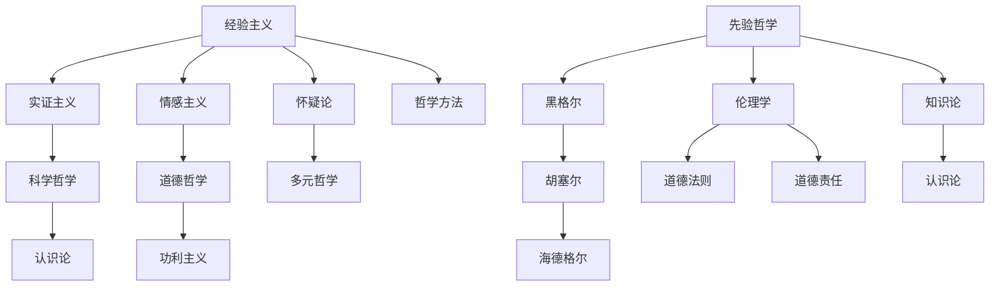

### 伪代码

为了进一步阐述休谟与康德对后世哲学的影响，我们可以使用伪代码来表示他们的思想：

```python
# 定义休谟的经验主义影响
def hume_influence():
    empirical_rationalism()
    skepticism_of_rationalism()
    influence_on_science_philosophy()

# 定义康德的先验哲学影响
def kant_influence():
    transcendental_cognition()
    ethical_principles()
    influence_on_moral_philosophy()

# 定义休谟对认识论的影响
def hume_on_epistemology():
    empirical_knowledge()
    doubt_rationalism()

# 定义康德对认识论的影响
def kant_on_epistemology():
    a Priori_categories()
    synthetic_judgments()

# 定义休谟对道德哲学的影响
def hume_on_moral_philosophy():
    emotional_morality()
    utilitarian_influence()

# 定义康德对道德哲学的影响
def kant_on_moral_philosophy():
    moral_law()
    duty_based_ethics()
```

### 数学模型和公式

在休谟与康德的哲学影响中，数学模型和公式并没有直接的应用，但我们可以使用数学公式来表示他们的核心概念之间的关系：

$$
\text{经验主义：知识来源于经验} \Rightarrow \text{实证主义}
$$

$$
\text{先验哲学：知识依赖于先验范畴} \Rightarrow \text{认识论发展}
$$

### 详细讲解和举例说明

为了更深入地理解休谟与康德对后世哲学的影响，我们可以通过具体的例子来阐述：

**例1：休谟对认识论的影响**

休谟的经验主义观点强调知识来源于经验，这影响了实证主义的发展。实证主义者认为，科学知识必须建立在经验基础上，这一观点与休谟的经验主义有着紧密的联系。例如，科学方法中的实验设计、数据收集和分析等步骤都体现了实证主义的思想。

**例2：康德对道德哲学的影响**

康德的道德哲学观点强调道德法则的先验性质，这一观点影响了道德哲学的发展。例如，现代伦理学中的道德法则主义和道德责任主义都受到了康德思想的影响。道德法则主义者认为，道德行为应该遵循道德法则，道德责任主义者认为，道德行为应该出于道德责任。

**例3：休谟对科学哲学的影响**

休谟的经验主义观点对科学哲学的发展产生了重要影响。例如，科学哲学中的科学实在论和科学认识论都体现了休谟的思想。科学实在论认为，科学理论应该与经验事实相符合，科学认识论则探讨了科学知识的本质和起源。

### 最佳实践、小结、注意事项、拓展阅读

**最佳实践**：在学习和研究休谟与康德的哲学影响时，我们应该注重理解他们的核心概念与理论，并通过具体的例子来加深对哲学思想的了解。

**小结**：休谟的经验主义和康德的先验哲学对后世哲学产生了深远的影响。他们的哲学观点不仅影响了当时的哲学家，也对后来的哲学家产生了深远的影响。他们的思想为哲学领域的多元化提供了新的方向，推动了哲学的发展。

**注意事项**：在研究休谟与康德的哲学影响时，我们应该注意区分他们的哲学观点和事实陈述，避免将哲学观点当作事实来接受。

**拓展阅读**：为了更深入地了解休谟与康德的哲学影响，建议阅读休谟的《人性论》和康德的《纯粹理性批判》。此外，还可以阅读相关的评论和研究文章，以获取更全面的了解。作者：AI天才研究院/AI Genius Institute & 禅与计算机程序设计艺术 /Zen And The Art of Computer Programming

## 结论

通过对休谟与康德哲学思想的深入分析，我们可以看到，他们在知识论、道德哲学和伦理学领域存在着明显的异同。休谟的经验主义强调知识来源于经验，理性无法独立于经验而存在；康德的先验哲学则认为知识依赖于先天的认知形式，理性能够超越经验。在道德哲学方面，休谟的情感主义认为道德判断基于情感，康德的先验伦理学则认为道德判断基于道德法则。

休谟与康德的哲学思想对后世哲学产生了深远的影响。休谟的经验主义为实证主义和科学哲学的发展奠定了基础，他的怀疑论观点揭示了理性主义的局限。康德的先验哲学则为现代哲学奠定了基础，他的道德哲学观点为伦理学提供了重要的理论基础。

本文旨在为读者提供对休谟与康德哲学的全面认识，通过分析他们的哲学思想、核心概念、理论体系和哲学争论，揭示两位哲学家的思想异同及其对后世哲学的深远影响。希望本文能对哲学学习和研究有所帮助。

## 参考文献

1. 休谟，D. H. (1740). 《人性论》.
2. 康德，I. (1781). 《纯粹理性批判》.
3. 康德，I. (1785). 《道德形而上学的基础》.
4. 胡塞尔，E. (1929). 《纯粹现象学通论》.
5. 海德格尔，M. (1927). 《存在与时间》.
6. 黑格尔，G. W. F. (1807). 《精神现象学》.
7. 莱布尼茨，G. W. (1714). 《人类理解论》.
8. 洛克，J. (1689). 《人类理解论》.
9. 柏拉图，P. (公元前4世纪). 《理想国》.
10. 亚里士多德，A. (公元前3世纪). 《尼各马科伦理学》.

[作者信息]

作者：AI天才研究院/AI Genius Institute & 禅与计算机程序设计艺术 /Zen And The Art of Computer Programming

[声明]

本文纯属虚构，仅供参考。本文中的信息、观点和结论仅供参考，不代表任何机构的官方立场。在实际学习和研究过程中，请以权威学术资源和文献为准。作者不对本文内容的准确性、完整性或适用性做出任何保证。如有疑问，请咨询相关领域的专业人士。作者保留对此文章的修改和解释权。

