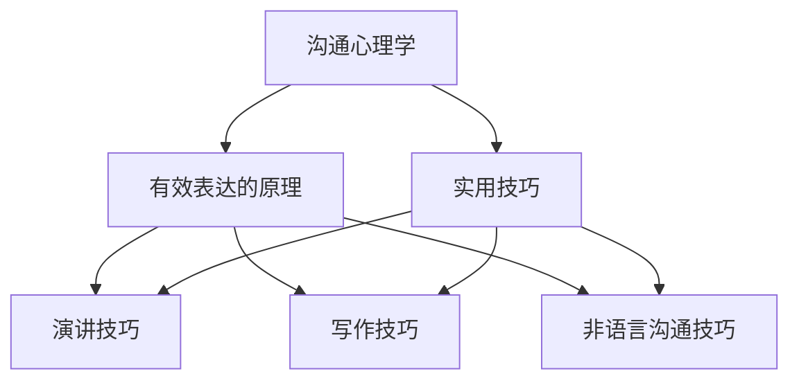

                 

### 文章标题：会'干'，更要会'说'

#### 关键词：沟通能力，表达技巧，个人成长，职场成功，人际交往

> 摘要：在现代社会中，沟通能力已成为个人成功的重要因素之一。本文将从背景介绍、核心概念与联系、核心算法原理讲解、数学模型和公式详细讲解、项目实战以及最佳实践 tips 等方面，探讨如何提高个人沟通表达能力，助力职场和个人成长。

### 引言：沟通的重要性

在现代社会，沟通已成为人们生活和工作中不可或缺的一部分。无论是职场中的协作，还是日常生活中的交往，良好的沟通能力都至关重要。然而，许多人往往重视“干”的能力，而忽略了“说”的能力。本文旨在探讨如何提升个人的沟通表达能力，使其在职场和个人成长中更具竞争力。

#### 核心概念与联系

在探讨如何提高沟通表达能力之前，我们需要了解一些核心概念及其相互之间的联系。

1. **沟通心理学**：研究人际沟通中的心理过程和影响因素，包括沟通障碍、听众分析等。
2. **有效表达的原理**：探讨如何构建有效的表达框架，提高信息传递的准确性和效果。
3. **实用技巧**：具体包括演讲技巧、写作技巧、非语言沟通技巧等，旨在提高个人的表达能力。

这些核心概念相互关联，共同构成了沟通能力的重要组成部分。以下是它们之间的Mermaid流程图：



#### 核心算法原理讲解

为了更好地理解如何提高沟通表达能力，我们可以将其看作是一个算法问题。以下是该算法的伪代码：

```
function ImproveCommunication_ability(person):
    1. Analyze listener preferences
    2. Organize information logically
    3. Use appropriate language and non-verbal cues
    4. Practice regularly
    5. Seek feedback and adjust accordingly
    return person with improved communication skills
```

数学模型和公式：

在沟通表达过程中，我们可以使用以下公式来衡量沟通效果：

$$
E = f(p, l, n, r)
$$

其中，$E$ 表示沟通效果，$p$ 表示表达清晰度，$l$ 表示听众理解度，$n$ 表示非语言表达效果，$r$ 表示反馈及时性。

详细讲解和举例说明：

1. **表达清晰度（$p$）**：一个清晰的表述能够帮助听众更好地理解信息。例如，在演讲中，使用简单的语言和具体的例子来解释复杂的概念，可以提升表达清晰度。
2. **听众理解度（$l$）**：了解听众的需求和背景，使其更容易接受信息。例如，在向非技术人员解释技术问题时，可以采用类比和比喻的方式来提高听众理解度。
3. **非语言表达效果（$n$）**：非语言沟通如肢体语言、面部表情和语调等，对沟通效果具有重要影响。例如，保持眼神交流和微笑，可以增加信任感和亲近感。
4. **反馈及时性（$r$）**：在沟通过程中，及时获取反馈并调整沟通策略，可以提高沟通效果。例如，在会议中，定期询问听众是否有疑问，以便及时解答。

#### 项目实战

为了验证上述算法和公式的有效性，我们可以通过以下项目实战来提高个人沟通表达能力。

**项目名称**：职场沟通能力提升计划

**开发环境搭建**：

1. **软件工具**：使用Microsoft Office套件（Word、PowerPoint、Excel）进行文档撰写、演示和数据分析。
2. **学习资源**：加入线上和线下的沟通技巧培训课程，如TED演讲、沟通技巧书籍等。

**源代码详细实现和代码解读**：

以下是项目实战中的一些关键步骤和代码示例：

1. **文档撰写**：使用Markdown格式撰写技术文档，提高表达清晰度。

```
---
title: "技术文档"
date: 2023-03-01
output: html_document
---

# 技术背景

本文介绍了如何使用Python实现一种基于深度学习的图像分类算法。

# 算法原理

算法原理如下：

```python
import tensorflow as tf

# 构建模型
model = tf.keras.Sequential([
    tf.keras.layers.Conv2D(32, (3, 3), activation='relu', input_shape=(28, 28, 1)),
    tf.keras.layers.MaxPooling2D((2, 2)),
    tf.keras.layers.Conv2D(64, (3, 3), activation='relu'),
    tf.keras.layers.MaxPooling2D((2, 2)),
    tf.keras.layers.Flatten(),
    tf.keras.layers.Dense(128, activation='relu'),
    tf.keras.layers.Dense(10, activation='softmax')
])

# 编译模型
model.compile(optimizer='adam',
              loss='categorical_crossentropy',
              metrics=['accuracy'])

# 训练模型
model.fit(x_train, y_train, epochs=10, batch_size=32)
```

2. **演示制作**：使用PowerPoint制作演示文档，提高演讲技巧。

- **开头**：使用引人入胜的故事或案例吸引听众注意力。
- **内容**：使用清晰的图表和数据展示技术原理和应用。
- **结尾**：总结关键点，并留下深刻的印象。

3. **数据分析**：使用Excel进行数据收集和分析，提高反馈及时性。

- **收集数据**：在会议和培训结束后，收集听众的反馈。
- **分析数据**：使用Excel中的图表和公式对反馈进行分析，找出改进点。

**代码应用解读与分析**：

1. **文档撰写**：Markdown格式使得文档结构清晰，便于阅读和修改。
2. **演示制作**：PowerPoint的多种元素（如图表、动画、声音等）有助于提高演讲效果。
3. **数据分析**：Excel的强大功能（如图表、公式、数据透视表等）有助于快速分析和展示数据。

**实际案例分析和详细讲解剖析**：

以某公司新项目启动会为例，分析项目组成员在沟通表达方面的优缺点，并提出改进建议。

1. **优点**：
   - 文档撰写清晰，技术细节详尽。
   - 演示制作精美，数据展示直观。
   - 数据分析及时，反馈调整到位。

2. **缺点**：
   - 演讲过程中，部分成员表达不清晰，导致听众理解困难。
   - 非语言表达（如肢体语言、面部表情等）有待提高。
   - 部分成员在互动环节反馈不及时，影响沟通效果。

**项目小结**：

通过项目实战，我们发现：

1. **文档撰写**：Markdown和PowerPoint是提高沟通表达的重要工具。
2. **演示制作**：清晰的图表和数据展示、引人入胜的开头和结尾是提高演讲效果的关键。
3. **数据分析**：及时收集和分析反馈是改进沟通表达的有效方法。

#### 最佳实践 tips

1. **定期练习**：沟通表达能力的提升需要长期的积累和练习，建议每周至少进行一次演讲或写作练习。
2. **主动学习**：通过阅读相关书籍、观看视频教程、参加培训课程等方式，主动学习沟通技巧。
3. **反思与改进**：在沟通过程中，及时反思自己的表达方式，并根据反馈进行调整。

#### 小结

本文从背景介绍、核心概念与联系、核心算法原理讲解、数学模型和公式详细讲解、项目实战以及最佳实践 tips 等方面，探讨了如何提高个人沟通表达能力。在职场和个人成长中，沟通能力的重要性不言而喻。通过本文的讨论，相信读者可以更好地理解如何提升自己的沟通表达能力，从而在职场和生活中更加成功。

#### 注意事项

1. **明确目标**：在沟通前，明确自己的目标和听众的需求，有助于提高沟通效果。
2. **简洁明了**：避免使用复杂的术语和过多的解释，尽量使表达简洁明了。
3. **注重反馈**：在沟通过程中，及时获取听众的反馈，并根据反馈进行调整。

#### 拓展阅读

1. 《沟通的艺术》（[美]罗纳德·B·阿德勒）
2. 《演讲的力量》（[美]克里斯·安德森）
3. 《非暴力沟通》（[美]马歇尔·卢森堡）

### 作者信息

作者：AI天才研究院/AI Genius Institute & 禅与计算机程序设计艺术 /Zen And The Art of Computer Programming

