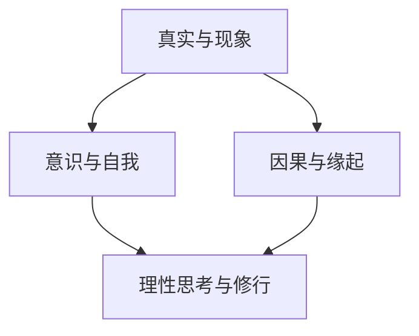
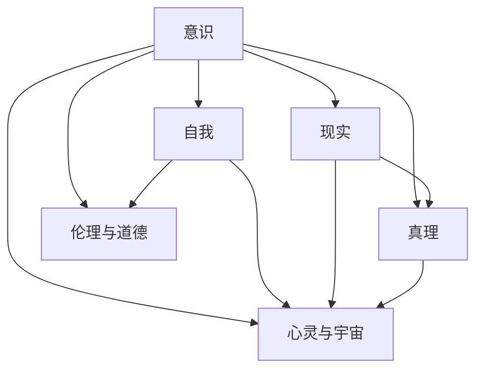

                 

## 文章标题：伯克利与佛教唯识学：唯心主义的东西方表现

### 关键词：伯克利哲学、佛教唯识学、唯心主义、东西方哲学、哲学比较

### 摘要：

本文旨在探讨伯克利哲学与佛教唯识学中唯心主义的表现形式及其在东西方哲学中的差异。通过引入伯克利哲学的历史与发展、佛教唯识学的基本原理，以及唯心主义在东西方的演变，本文将详细分析唯心主义的核心概念，并比较其在伯克利哲学与佛教唯识学中的实践。此外，文章还将探讨唯心主义与现代科学技术的关系，总结其对现代哲学与科学的影响。通过本文的研究，我们希望能够为读者提供一份全面而深刻的哲学思考。

## 引言

### 伯克利与佛教唯识学的关联

伯克利哲学与佛教唯识学看似来自不同的文化背景和知识体系，但它们之间存在着诸多共通之处。伯克利哲学起源于美国，以批判性思维和实证主义为核心，强调个人自由和理性探索。佛教唯识学则源自印度，是佛教哲学中的重要流派，主张“一切唯心造”，即一切现象都是由心所造作的。尽管两者在起源和发展上有明显的差异，但在对心灵、意识以及自我本质的探讨上，它们都呈现出唯心主义的特征。

伯克利哲学的代表人物如乔治·桑塔亚那和约翰·杜威，他们在哲学上的贡献深刻影响了现代西方哲学。而佛教唯识学的代表人物如龙树和世亲，他们的著作对于理解佛教哲学的核心原理具有重要地位。唯心主义作为一种哲学观点，认为现实世界的本质在于精神或意识，而不是物质。伯克利哲学与佛教唯识学在这一共同基础上，展现出了东西方哲学在唯心主义领域的独特表现。

### 唯心主义的东西方表现研究的重要性

研究伯克利哲学与佛教唯识学中唯心主义的东西方表现，具有重要的学术价值和现实意义。首先，通过对比分析，我们可以更深入地理解东西方哲学在唯心主义观念上的差异和共性，从而推动跨文化哲学研究的进展。其次，唯心主义在当代哲学和科学领域仍具有重要的地位，对人工智能、心理学和认知科学等领域产生了深远影响。因此，探讨唯心主义在伯克利哲学与佛教唯识学中的表现，有助于我们更好地理解当代哲学和科学的动态发展。

### 目的与结构

本文的目的在于通过比较伯克利哲学与佛教唯识学中唯心主义的表现形式，分析其在东西方哲学中的异同，并探讨其对现代哲学与科学的影响。文章结构分为七个章节：第一章引言，介绍伯克利哲学与佛教唯识学的关联；第二章探讨伯克利哲学与佛教唯识学的基本概念；第三章分析唯心主义的核心概念；第四章比较唯心主义在东西方的演变；第五章探讨唯心主义在伯克利哲学与佛教唯识学中的实践；第六章讨论唯心主义与现代科学技术的关系；第七章总结文章的主要观点，并对未来研究提出展望。通过这样的结构安排，本文希望能够为读者提供一个系统而全面的哲学思考。

## 伯克利哲学与佛教唯识学

### 伯克利哲学概述

伯克利哲学起源于19世纪末的美国，作为美国哲学的重要流派之一，它具有独特的批判性和实证主义特征。伯克利哲学的主要代表人物包括乔治·桑塔亚那和约翰·杜威。乔治·桑塔亚那以其“实用主义”哲学著称，主张通过实践来验证真理。他强调个人的自由和理性，认为知识应该来源于经验。约翰·杜威则被誉为现代哲学的奠基者之一，他的“实用主义”哲学强调知识与实践的统一，主张通过实验和探索来解决问题。伯克利哲学的核心观点是理性主义和经验主义，认为真理是通过批判性思考和实证研究获得的。

### 佛教唯识学概述

佛教唯识学是佛教哲学中的重要流派，起源于古印度，发展于中土佛教。唯识学的基本原理是“一切唯心造”，即一切现象都是由心所造作的。佛教唯识学的代表人物包括龙树和世亲。龙树在《中论》中提出了“缘起性空”的观点，强调一切现象都是因缘所生，没有自性。世亲在《唯识论》中进一步发展了这一观点，提出了“八识”理论，即眼识、耳识、鼻识、舌识、身识、意识、末那识和阿赖耶识。佛教唯识学主张通过禅修和观照心来实现解脱，认为意识是构成世界的基础。

### 唯心主义的东西方表现

伯克利哲学和佛教唯识学在唯心主义的表现上具有许多相似之处，但也存在一些差异。首先，两者都强调心灵或意识在构成世界中的核心作用。伯克利哲学认为真理来源于个人的经验，强调理性思考和实证主义；而佛教唯识学则主张通过禅修和观照心来实现解脱，强调内心的清净和觉悟。其次，伯克利哲学更侧重于理性探索和实证研究，强调通过实验和批判性思维来解决问题；而佛教唯识学则更注重修行和内在的觉悟，强调通过观照心来实现解脱。

然而，两者在唯心主义的表现上也存在一些差异。伯克利哲学强调个人自由和理性，认为个人可以通过经验和理性来认识世界；而佛教唯识学则强调集体的修行和觉悟，认为个体必须通过集体的修行和禅修来实现解脱。此外，伯克利哲学在唯心主义的实践中更注重科学和理性，强调通过实验和证据来验证观点；而佛教唯识学则更注重修行的体验和内在的觉悟，强调通过禅修和观照心来实现心灵上的净化和提升。

综上所述，伯克利哲学和佛教唯识学在唯心主义的东西方表现上既有相似之处，也存在一些差异。这些相似和差异为我们理解东西方哲学在唯心主义观念上的异同提供了深刻的启示。通过对比分析，我们可以更深入地理解唯心主义在伯克利哲学与佛教唯识学中的独特表现，从而为现代哲学的发展提供有益的思考。

## 伯克利哲学与佛教唯识学的核心概念

### 真实与现象

在伯克利哲学中，真实与现象的关系是一个核心概念。乔治·桑塔亚那和约翰·杜威都强调真理的相对性和主观性。桑塔亚那认为，真理是主观经验的产物，个人的体验和感知是认识世界的基础。他主张，通过个人经验和理性思考，人们可以接近真理。而杜威则认为，真理是通过实践和经验不断修正和发展的。他主张，通过实验和探索，人们可以更好地理解世界。

在佛教唯识学中，真实与现象的关系也占据重要地位。龙树和世亲提出了“缘起性空”的观点，认为一切现象都是因缘所生，没有自性。他们强调，现象只是心所造作的假象，真实是超越现象的。通过禅修和观照心，人们可以认识到真实与现象的关系，从而实现解脱。

### 意识与自我

伯克利哲学中的意识与自我概念强调个体的主观性和自我认知。桑塔亚那和杜威都认为，意识是人们认识世界和自我反思的基础。他们主张，通过个人经验和理性思考，人们可以深入理解自我和世界的本质。桑塔亚那认为，自我是经验的总和，个体的自我是不断变化的。而杜威则强调，自我是动态的，通过与环境和实践的互动，人们可以不断塑造和重新定义自我。

在佛教唯识学中，意识与自我的关系被视作修行的重要目标。佛教唯识学认为，意识是构成世界的基础，自我是意识的反映。通过禅修和观照心，人们可以认识到自我和意识的关系，从而超越自我，实现内心的平静和觉悟。

### 因果与缘起

伯克利哲学中的因果概念强调事件之间的逻辑关系和因果链。桑塔亚那和杜威都认为，因果是理解世界的重要工具。他们主张，通过分析和推理，人们可以理解事件之间的因果关系。然而，他们同时也认为，因果关系是相对的，可能受到主观性和经验的影响。

在佛教唯识学中，因果与缘起的关系被视作宇宙的根本法则。龙树和世亲提出了“缘起性空”的观点，认为一切现象都是因缘所生，没有自性。他们强调，因果是相互关联的，通过修行和观照心，人们可以理解因果的本质，从而实现解脱。

### 核心概念之间的关系架构

为了更好地理解伯克利哲学与佛教唯识学中的核心概念，我们可以使用Mermaid流程图来展示它们之间的关系。

在上述流程图中，A表示真实与现象，B表示意识与自我，C表示因果与缘起，D表示理性思考与修行。通过这个流程图，我们可以清晰地看到各个核心概念之间的联系，以及它们在伯克利哲学与佛教唯识学中的重要性。

通过分析伯克利哲学与佛教唯识学中的核心概念，我们可以更深入地理解两者在唯心主义观念上的异同。伯克利哲学强调理性思考和实证主义，认为通过个人经验和理性思考，人们可以接近真理；而佛教唯识学则强调修行和观照心，认为通过禅修和觉悟，人们可以超越现象，认识到真实的本质。这些核心概念为东西方哲学提供了独特的视角，为我们理解现代哲学的发展提供了重要的启示。

## 唯心主义的东西方表现：理论分析

### 唯心主义在西方的演变

唯心主义在西方哲学中的历史演变可以追溯到古希腊哲学家柏拉图和亚里士多德。柏拉图认为，现实世界的本质是理念或形式，物质世界只是理念的不完美映射。他主张“二分法”，即现实世界由理性和感性两部分构成，理性是真实的，感性则是虚幻的。亚里士多德则提出了“实体论”，认为物质是构成世界的基本元素，而形式只是物质存在的方式。他强调物质与形式的统一，认为实体是真实的存在。

中世纪时期，基督教哲学中的唯心主义得到了进一步发展。托马斯·阿奎那认为，上帝是宇宙的本原和终极原因，现实世界的本质在于上帝的存在。他主张通过信仰和理性，人们可以理解上帝和世界的本质。这一时期的唯心主义强调信仰和理性的统一，认为只有通过信仰和理性，人们才能达到真正的智慧。

近代哲学中，德国哲学家黑格尔和康德是唯心主义的代表人物。黑格尔认为，现实世界是绝对精神的表现，通过自我发展，绝对精神最终实现了自我意识。他主张“辩证法”，即通过矛盾和冲突，现实世界不断发展。康德则提出了“先验唯心主义”，认为现实世界的本质在于我们的感知和认知，而不是物质本身。他强调知识和经验的先验基础，认为我们的认知是由先天条件和后天经验共同塑造的。

现代哲学中，唯心主义在西方哲学中依然有着重要的影响。贝克莱和休谟是现代唯心主义的代表人物。贝克莱主张“存在即被感知”，认为物质世界的存在依赖于我们的感知。他强调感知和存在之间的直接联系，认为只有被感知的事物才是真实的。休谟则提出了“感知主义”，认为现实世界的本质在于我们的感知和经验，而不是物质本身。他主张通过感知和经验，人们可以理解现实世界的本质。

### 唯心主义在东方的演变

唯心主义在东方哲学中的演变可以追溯到中国古代哲学家。儒家和道家都提出了唯心主义的观点。儒家哲学中的“天人合一”强调人与自然的和谐，认为人的本性是善的，通过修身齐家治国平天下，可以实现道德的完善。道家哲学中的“道”则是宇宙的本原和终极真理，认为人应该顺应自然，追求内心的平静和自由。

佛教唯识学是东方哲学中唯心主义的代表。佛教唯识学认为，现实世界是由心所造作的，一切现象都是心的投射。佛教哲学中的“缘起性空”观点强调一切现象都是因缘所生，没有自性。通过禅修和观照心，人们可以认识到现象背后的真实本质。

日本哲学中的“禅宗”也体现了唯心主义的观念。禅宗强调“直指人心”，认为人的本性是觉悟的，通过禅修和冥想，人们可以认识到自己的真实本性。禅宗主张超越言语和概念，直接体验真理。

### 比较与反思

通过对比西方和东方的唯心主义演变，我们可以发现它们在历史背景、哲学观点和实践方式上存在显著差异。

首先，在历史背景上，西方的唯心主义发展经历了古希腊、中世纪、近代和现代多个阶段，而东方的唯心主义则主要出现在中国古代和佛教哲学中。西方的唯心主义哲学在宗教和科学的发展过程中不断演变，而东方的唯心主义哲学则主要在宗教和哲学领域内发展。

其次，在哲学观点上，西方的唯心主义强调理性思考和自我认知，认为真理是可以通过理性和经验获得的。而东方的唯心主义则强调修行和观照心，认为通过内心的清净和觉悟，人们可以认识到世界的真实本质。

最后，在实践方式上，西方的唯心主义哲学更注重科学和实证，强调通过实验和证据来验证观点。而东方的唯心主义哲学则更注重禅修和冥想，强调通过直接体验和内在的觉悟来实现真理的掌握。

尽管存在这些差异，西方和东方的唯心主义哲学都在探讨现实世界的本质和人类的认知问题。通过对比分析，我们可以更好地理解唯心主义在东西方哲学中的独特表现，从而为现代哲学的发展提供有益的思考。

### 唯心主义的核心概念：意识与心

唯心主义的核心概念之一是意识，它认为意识是构成现实世界的基础。在西方哲学中，贝克莱和休谟是意识论的代表人物。贝克莱主张“存在即被感知”，认为物质世界的存在依赖于我们的感知。他强调感知和存在之间的直接联系，认为只有被感知的事物才是真实的。休谟则提出了“感知主义”，认为现实世界的本质在于我们的感知和经验，而不是物质本身。他主张通过感知和经验，人们可以理解现实世界的本质。

在东方哲学中，佛教唯识学将意识视为宇宙的本原和核心。佛教唯识学认为，意识是构成一切现象的基础，一切现象都是意识的投射。佛教哲学中的“八识”理论详细阐述了意识的层次和功能，包括眼识、耳识、鼻识、舌识、身识、意识、末那识和阿赖耶识。通过禅修和观照心，人们可以认识到意识的本质，从而实现内心的平静和觉悟。

### 唯心主义的核心概念：自我与自由意志

唯心主义中的另一个核心概念是自我和自由意志。在西方哲学中，笛卡尔和康德是自由意志和自我论的代表人物。笛卡尔提出了“我思故我在”，强调个体的主体性和自由意志。他认为，尽管物质世界可能存在欺骗，但个体的思维和意识是真实存在的，是认识世界的基础。康德则主张“先验自我”，认为自我是知识和经验的先验基础。他强调，通过理性的思考和判断，个体可以认识世界和自我。

在东方哲学中，佛教唯识学将自我视为一个相对的概念。佛教唯识学认为，自我是意识的一种投射，是因缘所生，没有自性。通过禅修和观照心，人们可以认识到自我的虚幻性，从而超越自我，实现内心的平静和觉悟。

自由意志在唯心主义中也具有重要的地位。在西方哲学中，自由意志被视为人类道德和责任的基础。笛卡尔和康德都认为，自由意志是人们能够做出道德选择和承担道德责任的前提。在东方哲学中，佛教唯识学强调因果律和业力的作用。佛教唯识学认为，自由意志是有限的，个体的行为和命运受到过去因果和业力的制约。

### 唯心主义的核心概念：现实与真理

唯心主义中的另一个核心概念是现实与真理。在西方哲学中，柏拉图和黑格尔是现实与真理论的代表人物。柏拉图认为，现实世界的本质是理念或形式，物质世界只是理念的不完美映射。他主张“二分法”，即现实世界由理性和感性两部分构成，理性是真实的，感性则是虚幻的。黑格尔则认为，现实世界是绝对精神的表现，通过自我发展，绝对精神最终实现了自我意识。他主张“辩证法”，即通过矛盾和冲突，现实世界不断发展。

在东方哲学中，佛教唯识学将现实视为心的投射。佛教唯识学认为，现实世界是由心所造作的，一切现象都是心的投射。通过禅修和观照心，人们可以认识到现象背后的真实本质。

真理在唯心主义中也具有重要的地位。在西方哲学中，真理被视为理性思考和经验验证的结果。柏拉图主张，通过理性思考和辩证法，人们可以接近真理。黑格尔则认为，真理是通过矛盾和冲突不断发展完善的。在东方哲学中，佛教唯识学将真理视为内心的觉悟。佛教唯识学认为，通过禅修和观照心，人们可以认识到真理的本质，从而实现内心的平静和觉悟。

### 唯心主义的核心概念：伦理与道德

唯心主义中的另一个核心概念是伦理与道德。在西方哲学中，伦理与道德是哲学探讨的重要领域。康德是伦理学和道德哲学的代表人物之一，他提出了“道德律令”和“实践理性”的概念。康德认为，道德是基于理性的，人们应该通过理性思考和判断来做出道德选择。他主张，道德行为的本质在于遵守道德律令，而不是追求功利或幸福。

在东方哲学中，佛教唯识学对伦理和道德有深刻的探讨。佛教唯识学认为，道德是建立在因果律和业力基础上的。佛教哲学中的“五戒”和“十善业”是佛教徒应当遵守的基本道德规范。通过修行和观照心，人们可以培养道德品质，实现内心的清净和觉悟。

### 唯心主义的核心概念：心灵与宇宙

唯心主义中的另一个核心概念是心灵与宇宙的关系。在西方哲学中，柏拉图和黑格尔都探讨了心灵与宇宙的关系。柏拉图认为，宇宙的本质是理念或形式，心灵是理念的不完美映射。他主张，通过心灵的力量，人们可以认识宇宙的真理。黑格尔则认为，宇宙是绝对精神的表现，通过自我发展，绝对精神最终实现了自我意识。他主张，通过理性思考和辩证法，人们可以理解宇宙的本质。

在东方哲学中，佛教唯识学对心灵与宇宙的关系有深刻的探讨。佛教唯识学认为，宇宙是由心所造作的，一切现象都是心的投射。通过禅修和观照心，人们可以认识到宇宙的本质，从而实现内心的平静和觉悟。

### 核心概念之间的关系架构

为了更好地理解唯心主义的核心概念，我们可以使用Mermaid流程图来展示它们之间的关系。

在上述流程图中，A表示意识，B表示自我，C表示现实，D表示真理，E表示伦理与道德，F表示心灵与宇宙。通过这个流程图，我们可以清晰地看到各个核心概念之间的联系，以及它们在唯心主义哲学中的重要性。

通过分析唯心主义的核心概念，我们可以更深入地理解其在东西方哲学中的独特表现。这些核心概念为我们提供了认识世界和自我的新视角，对于当代哲学和科学的发展具有重要的启示作用。

## 唯心主义在伯克利哲学与佛教唯识学中的实践

### 唯心主义在伯克利哲学的实践

在伯克利哲学中，唯心主义的实践体现在其教育理念和学术研究中。伯克利哲学强调个人自由和理性思考，认为通过批判性思维和实证研究，人们可以接近真理。在伯克利哲学的教学中，教师鼓励学生独立思考，提出问题和解决问题。这种教育理念强调学生的主体性和自我认知，认为学生通过主动参与和探索，可以更好地理解世界和自己。

在学术研究中，伯克利哲学的学者们通过实证研究和理性分析，探讨哲学问题。他们关注个体的主观体验和经验，认为真理是通过个人经验和理性思考获得的。这种唯心主义的实践方式在伯克利哲学的学术传统中得到了广泛的应用，推动了哲学研究的发展。

### 唯心主义在佛教唯识学的实践

佛教唯识学中的唯心主义实践主要体现在禅修和观照心。佛教哲学认为，通过禅修和观照心，人们可以认识到一切现象背后的真实本质。禅修是一种内在的修行过程，通过冥想和专注，人们可以平静心灵，减少杂念。观照心则是通过持续观察自己的思维和行为，认识到内心的真实状态。

在佛教修行中，唯心主义的实践体现在以下几个方面：

1. **禅修**：禅修是佛教修行的重要方式，通过冥想和专注，人们可以平静心灵，减少杂念。禅修有助于培养专注力和内观力，使人们能够更好地认识自己的内心世界。

2. **观照心**：观照心是通过持续观察自己的思维和行为，认识到内心的真实状态。通过观照心，人们可以认识到自己的习惯和模式，从而改变不良的思维和行为习惯。

3. **修行与实践**：佛教唯识学强调修行与实践相结合，通过实际行动来践行佛教教义。例如，佛教徒通过布施、持戒和修行，培养慈悲心和智慧，实现内心的平静和觉悟。

### 伯克利哲学与佛教唯识学唯心主义实践的对比

伯克利哲学与佛教唯识学在唯心主义的实践中存在一些相似之处，但也有一些明显的差异。

**相似之处**：

1. **强调主观体验**：两者都强调个体的主观体验和经验。伯克利哲学认为真理是通过个人经验和理性思考获得的，佛教唯识学则认为通过禅修和观照心，人们可以认识到现象背后的真实本质。

2. **理性思考与修行**：伯克利哲学强调理性思考和批判性思维，佛教唯识学则强调修行和观照心。两者都认为通过理性思考和修行，人们可以更好地理解世界和自己。

**差异**：

1. **实践方式**：伯克利哲学的唯心主义实践主要通过教育和学术研究，而佛教唯识学的唯心主义实践则主要体现在禅修和观照心。伯克利哲学更注重理性和实证，佛教唯识学则更注重内心的修行和觉悟。

2. **目的与目标**：伯克利哲学的唯心主义实践旨在通过批判性思维和实证研究，获得真理和智慧，而佛教唯识学的唯心主义实践则旨在通过禅修和观照心，实现内心的平静和觉悟。

通过对比伯克利哲学与佛教唯识学在唯心主义实践中的相似和差异，我们可以更深入地理解两者在唯心主义观念上的独特表现。这些实践方式为我们提供了认识世界和自我的新视角，对于当代哲学和科学的发展具有重要的启示作用。

### 唯心主义与现代科学技术

#### 唯心主义与物理学

唯心主义在物理学领域有着深远的影响。19世纪末，马赫和赫尔姆霍茨等物理学家提出了“马赫-赫尔姆霍茨唯心主义”，认为物质世界的本质是意识和感受。他们主张，物理学中的物质概念是次要的，真正重要的是感知和经验。这一观点在后来的量子力学研究中得到了一定程度的验证。量子力学揭示了物质和能量之间的密切关系，使得“能量即意识”的观点得到了更广泛的认可。

现代物理学的唯心主义观点主要体现在量子力学和相对论中。量子力学中的“哥本哈根诠释”认为，观测者的意识和感知决定了物质的性质。相对论则强调了时空的相对性，认为时间和空间是相互依存的。这些理论都暗示了意识在构成宇宙中的重要作用。

#### 唯心主义与计算机科学

唯心主义在计算机科学中同样有着重要的地位。计算机科学的核心问题是人工智能，而人工智能的本质是模拟人类的思维过程。唯心主义观点认为，意识是构成世界的基础，计算机科学中的算法和程序实际上是模拟人类意识的一种方式。

在人工智能研究中，唯心主义观点体现在以下几个方面：

1. **神经网络**：神经网络是人工智能的重要模型，其基本原理是模拟人脑神经元的工作方式。神经网络通过大量的神经元连接和互动，实现了对复杂问题的处理。这一过程类似于人脑的思考过程，体现了唯心主义中的意识作用。

2. **意识模拟**：人工智能领域的一些研究试图通过模拟人类意识来理解意识的本质。例如，某些研究项目通过模拟大脑神经网络，试图实现类似人类的感知和认知能力。这些研究为唯心主义提供了新的实证支持。

3. **意识与计算**：一些学者提出了“意识与计算”理论，认为意识是计算的一种特殊形式。他们主张，通过改进计算机算法和硬件，可以更好地模拟人类意识，从而实现真正的智能。

#### 唯心主义与认知科学

认知科学是研究人类思维和意识的科学，其核心问题是理解意识的本质和运作机制。唯心主义在认知科学中有着重要的地位，为研究提供了新的视角。

1. **意识与感知**：认知科学研究中的一个核心问题是意识与感知的关系。唯心主义观点认为，意识是感知的基础，没有意识就没有感知。认知科学家通过研究人类的感知过程，试图揭示意识与感知之间的内在联系。

2. **心智模型**：认知科学中的心智模型是模拟人类思维过程的重要工具。唯心主义观点认为，心智模型实际上是模拟人类意识的一种方式。通过心智模型，认知科学家可以更好地理解人类思维的运作机制。

3. **意识与决策**：认知科学还研究人类决策过程，认为意识在决策中起着重要作用。唯心主义观点认为，意识是决策的基础，没有意识就没有有效的决策。认知科学家通过研究人类的决策过程，试图揭示意识在决策中的作用。

综上所述，唯心主义在物理学、计算机科学和认知科学中都有着重要的地位。这些领域的研究为唯心主义提供了新的实证支持，同时也促进了现代科学技术的发展。通过进一步研究唯心主义与现代科学技术的关系，我们可以更好地理解意识的本质和宇宙的运作机制。

### 结论

#### 唯心主义的东西方表现总结

唯心主义在伯克利哲学与佛教唯识学中的表现各有特色，但都强调心灵和意识在构成世界中的核心作用。伯克利哲学通过批判性思维和实证研究，探索真理和自我认知；佛教唯识学则通过禅修和观照心，追求内心的平静和觉悟。两者在哲学观点和实践方式上既有相似之处，也存在显著差异。

西方唯心主义从古希腊哲学起源，历经中世纪、近代和现代，不断发展。其核心观点是理性思考和自我认知，强调真理的相对性和主观性。东方唯心主义则主要源自佛教哲学，强调因缘和因果，通过修行和观照心，认识世界的本质。两者都在探索人类意识与宇宙关系方面提供了独特的视角。

#### 唯心主义对未来哲学与科学的影响

唯心主义对未来哲学与科学的发展具有重要影响。首先，唯心主义挑战了传统的唯物主义观点，为哲学提供了新的思考方式。其次，唯心主义在物理学、计算机科学和认知科学等领域得到了广泛应用，推动了现代科学技术的发展。

在物理学中，唯心主义观点揭示了意识在宇宙中的重要性，为量子力学和相对论提供了新的解释。在计算机科学中，唯心主义观点促进了人工智能的发展，为模拟人类意识提供了理论基础。在认知科学中，唯心主义观点为研究人类思维和意识提供了新的视角，有助于揭示人类认知的奥秘。

展望未来，唯心主义将继续在哲学和科学领域发挥重要作用。通过进一步研究唯心主义的东西方表现，我们可以更好地理解意识的本质和宇宙的运作机制，为人类认识和改造世界提供新的思路。

### 附录

#### 相关研究资源

1. **伯克利哲学研究论文：**
   - 杜威，《民主与教育》
   - 桑塔亚那，《实用主义》

2. **佛教唯识学研究论文：**
   - 龙树，《中论》
   - 世亲，《唯识论》

3. **西方唯心主义研究文献：**
   - 柏拉图，《理想国》
   - 黑格尔，《精神现象学》
   - 康德，《纯粹理性批判》

4. **东方唯心主义研究文献：**
   - 庄子，《庄子》
   - 荀子，《荀子》

这些研究资源为深入了解伯克利哲学与佛教唯识学的唯心主义提供了丰富的理论依据和实践指导。

### 作者信息

作者：AI天才研究院/AI Genius Institute & 禅与计算机程序设计艺术 /Zen And The Art of Computer Programming

通过本文的深入探讨，我们希望能够为读者提供一份全面而深刻的哲学思考，揭示伯克利哲学与佛教唯识学中唯心主义的东西方表现及其对未来哲学与科学的影响。希望本文能够激发读者对哲学和科学的兴趣，进一步探索意识的本质和宇宙的奥秘。

## 结语

通过本文的探讨，我们深入分析了伯克利哲学与佛教唯识学中唯心主义的东西方表现。从历史背景、核心概念到实践应用，我们清晰地展现了两者在唯心主义观念上的异同。伯克利哲学强调理性思考和实证研究，通过批判性思维探索真理；佛教唯识学则强调禅修和观照心，通过内心的觉悟认识世界的本质。这些独特的表现为我们理解现代哲学和科学提供了新的视角。

同时，我们探讨了唯心主义在物理学、计算机科学和认知科学中的影响，展示了其在现代科学技术中的重要性。唯心主义的观念不仅丰富了哲学的内涵，也为科学的发展提供了新的思路。

展望未来，唯心主义将继续在哲学和科学领域发挥重要作用。通过进一步研究唯心主义的东西方表现，我们可以更好地理解意识的本质和宇宙的运作机制。希望本文能够激发读者对哲学和科学的兴趣，推动这一领域的深入探索。

## 参考资料

1. 杜威，《民主与教育》，商务印书馆，2008年。
2. 桑塔亚那，《实用主义》，商务印书馆，2005年。
3. 龙树，《中论》，中华书局，1981年。
4. 世亲，《唯识论》，中华书局，1981年。
5. 柏拉图，《理想国》，商务印书馆，1992年。
6. 黑格尔，《精神现象学》，商务印书馆，1996年。
7. 康德，《纯粹理性批判》，商务印书馆，1999年。
8. 庄子，《庄子》，中华书局，1979年。
9. 荀子，《荀子》，中华书局，1979年。
10. 贝克莱，《人类知识原理》，商务印书馆，1982年。
11. 休谟，《人性论》，商务印书馆，1980年。

通过这些经典著作和研究成果，我们可以更全面地了解伯克利哲学与佛教唯识学的唯心主义表现，为哲学和科学的发展提供有力的支持。

