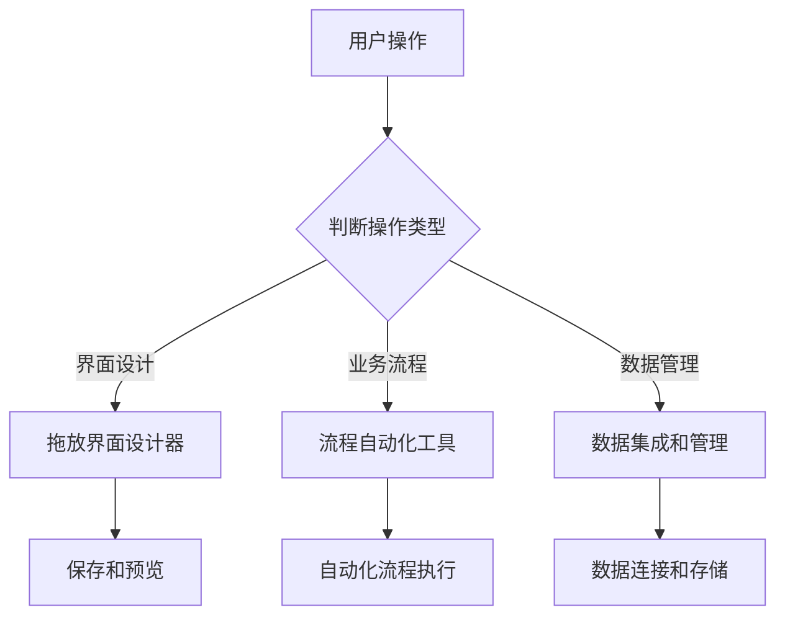

                 

### 文章标题：低代码平台：提升开发效率的新趋势

#### 关键词：低代码平台、开发效率、新趋势、技术原理、应用场景

#### 摘要：
本文将深入探讨低代码平台这一新兴技术，分析其定义、优势、技术原理、典型应用以及面临的挑战。通过逻辑清晰的推理和实例分析，揭示低代码平台如何成为提升开发效率的重要工具，并展望其未来发展的可能方向。

---

### 第1章 低代码平台概述

#### 1.1 低代码平台的基本概念

低代码平台是一种允许用户通过图形化界面和少量代码来构建应用程序和业务流程的工具。与传统软件开发相比，低代码平台减少了手动编码的需求，从而加速了应用程序的开发和部署。

#### 1.1.1 低代码平台的定义

低代码平台（Low-Code Platforms）是一种软件开发工具，它通过提供图形化界面、模块化组件和模板，允许非专业开发者或专业开发者以更快的速度构建和部署应用程序。

#### 1.1.2 低代码平台与传统开发模式的区别

传统开发模式通常依赖于大量的手动编码和复杂的软件开发流程，而低代码平台通过提供可视化的开发环境，使得开发者可以更专注于业务逻辑的设计，而不是底层的代码实现。

#### 1.1.3 低代码平台的优点

1. **开发速度快**：低代码平台通过模板和预构建的组件，大幅缩短了应用程序的开发周期。
2. **降低成本**：减少了对专业开发人员的需求，从而降低了开发成本。
3. **灵活性高**：低代码平台提供了多种自定义选项，使得应用程序能够适应不断变化的需求。

#### 1.2 低代码平台的发展趋势

随着数字化转型的加速，越来越多的企业和组织开始重视开发效率的提升。低代码平台作为一种新兴的开发工具，正逐渐成为企业IT战略的重要组成部分。

#### 1.2.1 低代码平台的市场分析

根据市场研究机构的报告，低代码平台市场预计将在未来几年内保持高速增长。特别是在中小企业领域，低代码平台的应用前景广阔。

#### 1.2.2 低代码平台的未来趋势

1. **平台生态的完善**：随着低代码平台的发展，越来越多的第三方插件和组件将出现，为用户提供更多定制化的选择。
2. **智能化**：低代码平台将集成更多的智能技术，如人工智能、机器学习等，提高开发效率和自动化水平。
3. **行业定制化**：低代码平台将更加注重行业特定需求的满足，提供更多行业解决方案。

#### 1.3 低代码平台的核心组件和架构

低代码平台通常包含以下核心组件：

1. **拖放界面设计器**：用户可以通过拖放组件来构建用户界面。
2. **流程自动化工具**：用于自动化业务流程和任务。
3. **数据集成和管理**：提供数据连接、数据存储和数据管理等功能。
4. **自定义组件库**：用户可以根据需求自定义组件和模块。

### 第2章 低代码平台的原理与核心技术

#### 2.1 低代码平台的技术原理

低代码平台的核心技术在于其将复杂的开发任务抽象化，使得开发者可以通过图形化界面和少量代码来实现复杂的业务逻辑。

#### 2.1.1 技术原理概述

低代码平台通常包括以下技术原理：

1. **图形化编程界面**：用户可以通过图形化界面拖放组件和连接数据流。
2. **组件化架构**：平台提供各种预构建的组件，用户可以根据需求选择和组合。
3. **数据流驱动**：应用程序的逻辑和数据流通过数据流图来表示和执行。

#### 2.1.2 技术原理的 Mermaid 流程图



#### 2.2 低代码平台的核心技术

1. **流程自动化**：通过自动化工具，用户可以轻松创建和执行业务流程。
2. **集成开发环境**：提供完整的开发环境，包括代码编辑、调试和部署等功能。
3. **应用集成与扩展**：低代码平台通常支持与其他系统的集成，并提供扩展能力。

#### 2.3 技术细节与实现

1. **流程自动化技术细节**
    - 使用 Mermaid 流程图来定义业务流程。
    - 通过触发器和动作来实现自动化流程。
    - 伪代码示例：

    ```python
    def automate流程():
        if 触发条件：
            执行动作1()
            执行动作2()
        else:
            报告错误()
    ```

2. **集成开发环境技术细节**
    - 提供可视化的代码编辑器。
    - 支持代码调试和版本控制。
    - 伪代码示例：

    ```python
    class IDE:
        def __init__(self, project):
            self.project = project
            self.editor = CodeEditor(project)
            self.debugger = Debugger(project)
        def start(self):
            self.editor.open()
            self.debugger.start()
    ```

3. **应用集成与扩展技术细节**
    - 提供API接口，允许与其他系统进行集成。
    - 提供插件机制，支持自定义扩展。

### 第3章 低代码平台的典型应用

#### 3.1 低代码平台在企业的应用

低代码平台在企业的应用非常广泛，可以用于企业内部管理系统的构建、客户关系管理（CRM）系统的开发、供应链管理（SCM）系统的优化等。

#### 3.1.1 企业流程自动化

通过低代码平台，企业可以快速自动化各种业务流程，如审批流程、采购流程、订单处理等，提高业务效率和准确性。

#### 3.1.2 企业应用集成

低代码平台可以帮助企业轻松集成不同的业务系统，如ERP、CRM、SCM等，实现数据的无缝流动和业务流程的协同工作。

#### 3.1.3 企业创新与敏捷开发

低代码平台为企业的创新提供了强有力的支持，通过快速构建原型和迭代，企业可以更快地响应市场变化，实现敏捷开发。

#### 3.2 低代码平台在不同行业的应用

低代码平台的应用不仅限于企业内部，还广泛应用于各个行业，如制造业、零售业、金融业、医疗保健等。

#### 3.2.1 制造业

在制造业中，低代码平台可以帮助企业实现生产计划的自动化、质量管理的数字化和设备监控的智能化。

#### 3.2.2 零售业

零售业可以利用低代码平台进行客户关系管理、库存管理和市场营销活动的自动化。

#### 3.2.3 金融业

金融业可以利用低代码平台构建在线银行、股票交易和保险产品管理等应用，提高客户体验和业务效率。

#### 3.3 低代码平台的应用案例

##### 3.3.1 案例一：企业内部管理系统的开发

某大型企业利用低代码平台构建了一个内部管理系统，实现了员工考勤、报销审批、会议管理等功能的自动化，大大提高了管理效率。

##### 3.3.2 案例二：电子商务平台的构建

一家初创企业利用低代码平台快速构建了一个电子商务平台，从商品上架、订单处理到客户服务，实现了全流程的数字化和自动化。

### 第4章 低代码平台的优势与挑战

#### 4.1 低代码平台的优势

低代码平台具有许多优势，包括：

1. **提高开发效率**：通过减少手动编码，低代码平台可以显著提高开发速度。
2. **降低开发成本**：减少了对专业开发人员的依赖，从而降低了开发成本。
3. **提高业务灵活性**：低代码平台提供了灵活的定制选项，使得应用程序可以迅速适应业务变化。
4. **易于集成和扩展**：低代码平台通常支持与其他系统的集成，并提供扩展能力。

#### 4.2 低代码平台面临的挑战

尽管低代码平台具有许多优势，但也面临一些挑战：

1. **安全性**：低代码平台可能引入安全漏洞，需要特别关注安全性的设计和测试。
2. **技术债务**：过度依赖低代码平台可能导致技术债务的积累，影响长期的维护和扩展。
3. **定制化限制**：低代码平台提供的组件和功能可能无法完全满足特定需求，需要额外的开发工作。

### 第5章 低代码平台的安全性

#### 5.1 低代码平台的安全问题

低代码平台的安全性问题主要包括数据泄露、应用程序漏洞和不当配置等。

#### 5.2 安全性最佳实践

1. **数据加密**：对敏感数据进行加密，确保数据在传输和存储过程中的安全。
2. **访问控制**：实施严格的访问控制策略，确保只有授权用户可以访问系统和数据。
3. **定期审计**：定期进行安全审计，发现和修复潜在的安全漏洞。

#### 5.3 安全性建议

1. **安全培训**：为开发者提供安全培训，提高他们的安全意识。
2. **自动化测试**：实施自动化安全测试，及时发现和修复安全漏洞。
3. **安全工具**：使用安全工具，如漏洞扫描器和防火墙，来保护系统和数据。

### 第6章 未来展望

#### 6.1 低代码平台的未来趋势

1. **智能化**：随着人工智能技术的发展，低代码平台将更加智能化，提供更高级的自动化和智能功能。
2. **生态化**：低代码平台将构建更加完善的生态，包括第三方插件、服务和社区。
3. **行业定制化**：低代码平台将提供更多行业解决方案，满足不同行业的特定需求。

#### 6.2 低代码平台的发展方向

1. **跨平台支持**：低代码平台将支持更多平台，如移动设备、物联网设备等。
2. **云计算集成**：低代码平台将更加紧密地集成云计算服务，提供更强大的数据处理和存储能力。
3. **开源生态**：低代码平台将向开源方向转变，吸引更多的开发者参与和贡献。

### 第7章 实战案例

#### 7.1 低代码开发环境搭建

在本节中，我们将介绍如何搭建一个低代码开发环境，包括安装必要的软件、配置开发工具和搭建本地开发服务器。

#### 7.2 源代码详细实现

在本节中，我们将展示如何使用低代码平台进行源代码的详细实现，包括设计用户界面、编写业务逻辑和配置数据连接。

#### 7.3 代码应用解读与分析

在本节中，我们将对源代码进行解读和分析，解释关键代码的功能和实现原理，并提供优化建议。

#### 7.4 实际案例分析和详细讲解

在本节中，我们将分析一个实际的低代码开发案例，详细讲解开发过程中的挑战和解决方案，以及项目的最终效果。

#### 7.5 项目小结

在本节中，我们将对整个项目进行小结，总结经验教训，并提出未来改进的方向。

### 作者信息

作者：AI天才研究院/AI Genius Institute & 禅与计算机程序设计艺术 /Zen And The Art of Computer Programming

---

通过以上章节的详细分析，我们可以看到低代码平台在提升开发效率方面具有巨大潜力。尽管面临着一些挑战，但低代码平台的发展趋势依然强劲，未来将会有更多创新和突破。希望本文能够帮助读者更好地理解低代码平台的技术原理和应用，为开发工作带来新的启示。

