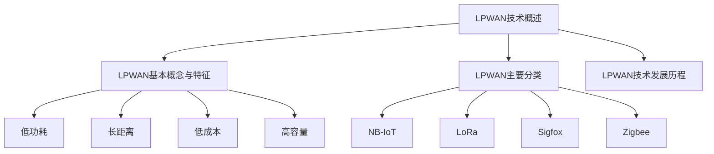
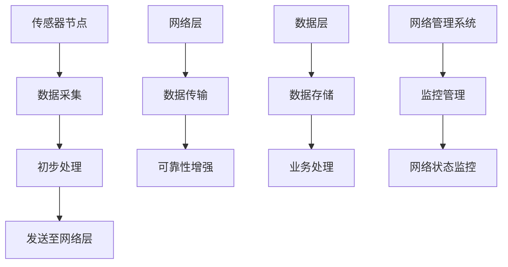

                 

### 文章标题

低功耗广域网（LPWAN）技术选型

---

关键词：低功耗广域网、技术选型、物联网、通信技术、网络架构

---

摘要：随着物联网技术的快速发展，低功耗广域网（LPWAN）技术成为连接海量设备的基石。本文旨在探讨LPWAN技术的选型策略，从基本概念、技术架构到具体实现，提供一套系统化的选型流程。通过分析不同LPWAN技术的优缺点，结合实际应用案例，帮助读者理解LPWAN技术在各种场景中的适用性，从而做出科学合理的选型决策。

---

### 目录

1. LPWAN技术概述

   - 1.1 LPWAN基本概念与特征

   - 1.2 LPWAN主要分类

   - 1.3 LPWAN技术发展历程

2. LPWAN技术架构

   - 2.1 LPWAN网络架构概述

   - 2.2 LPWAN协议与标准

3. LPWAN核心技术

   - 3.1 通信技术

   - 3.2 低功耗技术

   - 3.3 安全技术

4. LPWAN技术选型策略

   - 4.1 选型考量因素

   - 4.2 选型流程

   - 4.3 选型案例分析

5. LPWAN技术实现与部署

   - 5.1 LPWAN设备设计

   - 5.2 LPWAN网络部署

   - 5.3 LPWAN运维管理

6. LPWAN安全与隐私

   - 6.1 安全风险分析

   - 6.2 安全措施与策略

7. LPWAN技术发展展望

   - 7.1 未来趋势

   - 7.2 技术挑战与机遇

8. 附录

   - 8.1 LPWAN技术资源与工具

   - 8.2 LPWAN技术标准

9. 参考文献

---

### 第一部分：LPWAN技术概述

#### 1.1 LPWAN基本概念与特征

低功耗广域网（LPWAN）是一种专门为物联网（IoT）设备设计的通信网络，旨在实现低功耗、长距离、低成本的数据传输。LPWAN技术具备以下几个主要特征：

- **低功耗**：LPWAN设备通常采用低功耗设计，能够长时间运行在不频繁充电或更换电池的情况下。

- **长距离**：LPWAN能够覆盖广泛的地理区域，单次通信可以跨越数公里甚至数十公里的距离。

- **低成本**：LPWAN技术的部署和维护成本较低，使得它成为大规模物联网应用的经济选择。

- **高容量**：LPWAN网络可以支持大量设备同时在线，满足海量设备连接的需求。

LPWAN的出现解决了传统无线通信技术在功耗、覆盖范围和成本方面的限制，为物联网的广泛应用提供了强有力的支持。

#### 1.2 LPWAN主要分类

根据通信技术和应用场景的不同，LPWAN技术可以分为以下几类：

- **NB-IoT**：基于蜂窝网络技术的LPWAN技术，由3GPP制定。它通过利用现有的LTE网络频谱，实现低功耗、广覆盖的特点。

- **LoRa**：由LoRa联盟开发，采用扩频技术，支持长距离、低功耗的通信。LoRa技术具有良好的抗干扰性和穿透性。

- **Sigfox**：专注于简化和扩展物联网通信的技术，采用基于单频跳频扩频的技术，实现全球范围的无连接通信。

- **Zigbee**：虽然不是典型的LPWAN技术，但Zigbee在短距离、低功耗、多设备互联方面表现出色，常用于智能家居和工业自动化领域。

#### 1.3 LPWAN技术发展历程

LPWAN技术的发展可以追溯到物联网概念的提出。随着物联网设备的激增，传统通信技术如Wi-Fi、蓝牙等在功耗和覆盖方面面临挑战。2009年，LoRa首次亮相，开启了一种全新的通信方式。此后，NB-IoT和Sigfox等LPWAN技术相继出现，并在全球范围内得到广泛应用。随着5G网络的部署，LPWAN技术也在不断演进，融合更多先进技术，为未来的物联网应用提供更强有力的支持。

### 1.4 LPWAN技术的核心概念与联系

为了更好地理解LPWAN技术的核心概念，我们可以通过一个Mermaid流程图来展示各个概念之间的联系。

通过这个流程图，我们可以清晰地看到LPWAN技术的基本概念、主要分类以及它们的发展历程。接下来，我们将进一步探讨LPWAN技术的架构和核心技术，帮助读者深入理解这一领域。

### 第二部分：LPWAN技术架构

#### 2.1 LPWAN网络架构概述

LPWAN网络架构主要由以下几个部分组成：传感器节点、网络层和数据层。传感器节点负责数据采集和初步处理，网络层负责数据传输，数据层则负责数据存储和业务处理。

- **传感器节点**：传感器节点是LPWAN网络的基础，通常包括嵌入式处理器、无线通信模块（如LoRa模块）和传感器接口。这些节点负责采集环境数据（如温度、湿度、压力等），并将其发送到网络层。

- **网络层**：网络层是LPWAN技术的核心，负责在传感器节点和数据中心之间传输数据。LPWAN网络层通常采用网状（Mesh）结构，使得数据可以通过多个跳数传输到目的地，提高了网络的可靠性和覆盖范围。

- **数据层**：数据层包括数据中心和网络管理系统。数据中心负责存储和处理来自传感器节点的数据，网络管理系统则负责监控和管理网络状态，确保数据传输的可靠性和效率。

#### 2.2 LPWAN协议与标准

LPWAN技术涉及多种协议和标准，以下是其中几个主要的：

- **LoRaWAN**：LoRaWAN是LoRa技术的标准协议，由LoRa联盟制定。它支持多种数据速率和传输距离，适用于各种应用场景。

- **NB-IoT**：NB-IoT是3GPP制定的蜂窝网络标准，专门为物联网设计。它利用LTE频谱，实现低功耗、广覆盖的通信。

- **Sigfox**：Sigfox是一种基于单频跳频扩频的技术，专为物联网设计。它通过简化协议和压缩数据，实现低功耗、低成本的通信。

- **Zigbee**：Zigbee是一种短距离、低功耗的无线通信协议，适用于智能家居和工业自动化等领域。

这些协议和标准各自有其特点和优势，选择合适的协议和标准取决于具体的应用需求。

### 2.3 LPWAN技术核心概念架构 Mermaid 流程图

为了更好地理解LPWAN技术的核心概念架构，我们可以使用Mermaid流程图来展示传感器节点、网络层和数据层之间的关系。

通过这个流程图，我们可以清晰地看到LPWAN技术的整体架构以及各个层次之间的交互关系。接下来，我们将进一步探讨LPWAN技术的核心算法和原理，帮助读者深入理解这一领域。

### 第三部分：LPWAN核心技术

#### 3.1 通信技术

LPWAN技术的通信技术是实现长距离、低功耗传输的关键。以下是一些主要的通信技术：

- **扩频技术**：扩频技术通过将信号扩展到更宽的频带上，提高了信号的传输距离和抗干扰能力。LoRa和Sigfox都采用了扩频技术。

- **频跳扩频技术**：频跳扩频技术（FHSS）通过在多个频率之间快速切换，避免信号受到干扰。这种技术广泛应用于无线通信领域，包括蓝牙和Zigbee。

- **中继技术**：中继技术通过在网络中设置中继节点，延长信号的传输距离。这种技术在LoRa和Zigbee网络中广泛应用。

- **蜂窝网络技术**：NB-IoT利用现有的蜂窝网络架构，通过引入窄带信号，实现低功耗、广覆盖的通信。

这些通信技术各有优缺点，选择合适的通信技术取决于具体的应用需求。

#### 3.2 低功耗技术

低功耗技术是LPWAN技术的核心，确保设备能够长时间运行在不频繁充电或更换电池的情况下。以下是一些常见的低功耗技术：

- **睡眠模式**：LPWAN设备在空闲状态下会进入睡眠模式，以降低功耗。在需要传输数据时，设备才会唤醒。

- **唤醒机制**：为了减少唤醒的频率，LPWAN设备采用定时唤醒或事件唤醒机制。定时唤醒根据预定的时间表唤醒设备，而事件唤醒则根据传感器数据的变化唤醒设备。

- **休眠传输**：休眠传输技术允许设备在休眠状态下传输数据，通过外部信号唤醒设备并在极短的时间内完成数据传输。

- **能量收集**：一些LPWAN设备采用能量收集技术，通过太阳能、振动能等方式为设备充电，进一步降低对电池的依赖。

这些低功耗技术协同工作，使得LPWAN设备能够在各种环境中长时间运行。

#### 3.3 安全技术

随着物联网设备的普及，安全性成为LPWAN技术的重要考虑因素。以下是一些常用的LPWAN安全技术：

- **加密技术**：LPWAN设备采用加密技术对数据进行加密传输，确保数据在传输过程中的安全性。

- **认证技术**：通过设备认证技术，确保只有经过授权的设备能够接入网络，防止未授权设备接入。

- **网络隔离**：通过在网络中设置隔离机制，确保不同设备之间的通信是安全的，防止数据泄露。

- **数据完整性校验**：对数据进行完整性校验，确保传输的数据没有被篡改。

这些安全技术为LPWAN网络提供了多层次的安全保障，使得物联网应用更加安全可靠。

#### 3.4 LPWAN核心技术总结

LPWAN技术的通信技术、低功耗技术和安全技术共同构成了其核心基础。通信技术确保了数据的可靠传输，低功耗技术保证了设备的长效运行，而安全技术则为数据提供了安全保障。这些技术的融合使得LPWAN技术成为物联网应用的重要支撑。

### 第四部分：LPWAN技术选型策略

#### 4.1 选型考量因素

在LPWAN技术选型过程中，需要考虑多个因素，以确保所选技术能够满足具体应用需求。以下是一些主要的考量因素：

- **应用场景**：不同应用场景对通信距离、功耗、传输速率等有不同的要求。例如，智能家居场景可能需要低功耗、短距离通信，而工业物联网场景可能需要长距离、高可靠性的通信。

- **通信距离**：通信距离是LPWAN技术选型的重要考量因素。不同LPWAN技术具有不同的通信距离，需要根据实际需求选择合适的技术。

- **传输速率**：传输速率影响数据的实时性和处理能力。根据应用需求，选择合适的传输速率，以确保数据能够及时传输和处理。

- **覆盖范围**：覆盖范围是LPWAN技术的重要指标，需要根据应用场景选择覆盖范围合适的LPWAN技术。

- **成本预算**：成本预算是LPWAN技术选型的重要约束条件。不同LPWAN技术的部署和维护成本不同，需要根据预算进行选择。

- **标准与兼容性**：不同LPWAN技术可能存在兼容性问题，需要考虑所选技术与其他设备和系统的兼容性。

- **安全性**：安全性是LPWAN技术选型的重要考量因素，需要选择具有良好安全性的技术，确保数据传输的安全性。

#### 4.2 选型流程

LPWAN技术选型流程包括以下步骤：

- **需求分析**：首先，明确应用场景和需求，包括通信距离、传输速率、功耗、覆盖范围等。

- **技术评估**：根据需求分析结果，评估不同LPWAN技术的性能和适用性，包括NB-IoT、LoRa、Sigfox等。

- **成本预算**：结合预算约束，评估不同技术的成本，包括设备成本、网络建设成本、维护成本等。

- **选型决策**：根据技术评估和成本预算结果，选择最适合的LPWAN技术。

- **验证与优化**：在实际应用中，对所选技术进行验证和优化，确保满足需求。

通过以上选型流程，可以科学合理地选择LPWAN技术，确保物联网应用的成功实施。

#### 4.3 LPWAN技术选型案例分析

在本节中，我们将通过几个实际应用案例，展示如何根据不同应用场景进行LPWAN技术选型。

##### 4.3.1 智能家居

智能家居场景通常需要低功耗、短距离的通信。在智能家居中，设备之间的通信主要用于控制、监测和交互。以下是一个典型的智能家居应用场景：

- **应用场景**：用户希望实现家庭设备的远程控制，如智能灯泡、智能插座等。

- **需求分析**：智能家居场景对通信距离要求不高，通常在几十米范围内。传输速率不需要太高，但需要低功耗。

- **技术评估**：在智能家居场景中，Zigbee和蓝牙技术是较好的选择。Zigbee支持多设备互联，适合家庭内部网络构建，而蓝牙则适合短距离通信。

- **选型决策**：综合考虑成本和功耗，选择Zigbee作为智能家居的LPWAN技术。

- **验证与优化**：在实际应用中，通过优化网络拓扑和设备配置，确保智能家居网络的稳定性和低功耗。

##### 4.3.2 工业物联网

工业物联网场景通常需要长距离、高可靠性的通信。在工业物联网中，设备之间的通信主要用于监测、控制和数据传输。以下是一个典型的工业物联网应用场景：

- **应用场景**：工厂内设备之间的通信，包括传感器、控制器和执行器等。

- **需求分析**：工业物联网场景对通信距离和传输速率有较高要求，同时需要确保通信的可靠性。

- **技术评估**：在工业物联网场景中，NB-IoT和LoRa是较好的选择。NB-IoT利用现有的蜂窝网络，具有较好的覆盖范围和可靠性，而LoRa则具有更长的通信距离和良好的抗干扰能力。

- **选型决策**：综合考虑通信距离、可靠性和成本，选择NB-IoT作为工业物联网的LPWAN技术。

- **验证与优化**：在实际应用中，通过优化网络规划和设备配置，确保工业物联网网络的稳定性和高可靠性。

##### 4.3.3 农业物联网

农业物联网场景通常需要广覆盖、低功耗的通信。在农业物联网中，设备主要用于土壤监测、气象监测和灌溉控制等。以下是一个典型的农业物联网应用场景：

- **应用场景**：农田中的土壤湿度、气象条件和灌溉系统的监控与控制。

- **需求分析**：农业物联网场景需要覆盖广泛的农田，同时设备需要低功耗，以减少维护成本。

- **技术评估**：在农业物联网场景中，LoRa和Sigfox是较好的选择。LoRa具有较好的覆盖范围和抗干扰能力，而Sigfox则具有全球覆盖和低功耗的特点。

- **选型决策**：综合考虑覆盖范围、功耗和成本，选择LoRa作为农业物联网的LPWAN技术。

- **验证与优化**：在实际应用中，通过优化网络规划和设备配置，确保农业物联网网络的稳定性和低功耗。

通过以上案例，我们可以看到，根据不同的应用场景和需求，选择合适的LPWAN技术对于物联网应用的成功至关重要。在实际应用中，还需要不断优化和调整，确保网络的高效稳定运行。

### 第五部分：LPWAN技术实现与部署

#### 5.1 LPWAN设备设计

LPWAN设备设计是物联网应用的核心环节，涉及到硬件和软件的选择与配置。以下是LPWAN设备设计的关键要素：

- **硬件选择**：LPWAN设备通常包括传感器模块、无线通信模块（如LoRa模块）、电源模块和微控制器单元（MCU）。在选择硬件时，需要考虑设备的功耗、通信距离和成本。

- **通信模块**：选择适合的通信模块是LPWAN设备设计的关键。LoRa模块具有长距离、低功耗的特点，适用于大多数物联网应用。NB-IoT模块则适用于需要广泛覆盖和高可靠性的场景。

- **传感器模块**：传感器模块负责采集环境数据，如温度、湿度、压力等。选择合适的传感器模块取决于具体的应用需求。

- **电源管理**：LPWAN设备通常采用电池供电，因此电源管理至关重要。低功耗设计、能量收集技术和智能电源管理策略可以延长设备的使用寿命。

- **微控制器单元**：微控制器单元负责处理传感器数据、管理通信模块和执行控制任务。选择高性能、低功耗的MCU可以提升设备性能。

#### 5.2 LPWAN设备开发流程

LPWAN设备的开发流程通常包括以下几个步骤：

- **需求分析**：明确设备的功能需求、性能指标和应用场景。

- **硬件设计**：选择合适的硬件组件，设计电路板和机械结构。

- **软件设计**：开发设备驱动程序、通信协议栈和应用软件。

- **原型制作**：制作设备原型，进行功能测试和性能优化。

- **批量生产**：根据原型机进行批量生产，确保设备的一致性和稳定性。

- **测试与认证**：对设备进行功能测试、性能测试和安全测试，确保满足相关标准和规范。

#### 5.3 LPWAN设备开发实例

以下是一个基于LoRa技术的LPWAN设备开发实例：

**需求分析**：设计一款用于农业物联网的土壤湿度监测设备，要求设备能够实时监测土壤湿度，并通过LPWAN网络将数据传输到云端。

**硬件设计**：

- 传感器模块：采用电容式土壤湿度传感器，测量范围0-100%。
- 通信模块：使用LoRa模块，实现长距离、低功耗的通信。
- 电源模块：使用低功耗电池管理芯片，实现电池的智能管理。
- 微控制器单元：使用ESP8266，具备WiFi通信能力，便于数据上传到云端。

**软件设计**：

- 设备驱动程序：开发传感器驱动程序，实现传感器数据的实时采集。
- 通信协议栈：使用LoRaWAN协议栈，实现设备与网络服务器之间的通信。
- 应用软件：开发应用程序，实现数据的实时显示、历史记录和报警功能。

**原型制作**：制作一个实体原型，进行功能测试和性能优化。

**批量生产**：根据原型机进行批量生产，确保设备的一致性和稳定性。

**测试与认证**：对设备进行功能测试、性能测试和安全测试，确保满足相关标准和规范。

通过以上实例，我们可以看到LPWAN设备开发的过程和关键步骤。在实际应用中，需要根据具体需求进行调整和优化，以确保设备的性能和可靠性。

### 第六部分：LPWAN网络部署与运维

#### 6.1 LPWAN网络规划

LPWAN网络的规划是确保网络覆盖范围和通信质量的关键步骤。以下是LPWAN网络规划的主要步骤：

- **需求分析**：明确网络覆盖范围、设备数量、通信速率和功耗等需求。

- **网络拓扑设计**：根据需求分析结果，设计网络的拓扑结构，包括传感器节点、网络层和数据层。

- **频段选择**：选择合适的频段，以避免信号干扰和提高通信质量。

- **基站布局**：根据网络拓扑设计，确定基站的位置和数量，确保网络覆盖范围和通信质量。

- **设备部署**：根据基站布局，部署传感器节点和通信设备，确保网络连接的稳定性和可靠性。

- **调试与优化**：对网络进行调试和优化，确保网络的性能和稳定性。

#### 6.2 LPWAN网络建设

LPWAN网络建设包括硬件安装、软件配置和网络调试等步骤：

- **硬件安装**：安装基站设备、传感器节点和通信设备，确保设备安装稳固，电源供应正常。

- **软件配置**：配置网络管理软件，设置网络参数，包括频段、通信协议、安全认证等。

- **网络调试**：进行网络调试，测试网络的覆盖范围、通信速率和稳定性，确保网络性能满足要求。

#### 6.3 LPWAN网络运维管理

LPWAN网络的运维管理包括以下方面：

- **设备监控**：实时监控传感器节点和通信设备的状态，包括功耗、通信质量、数据传输等。

- **故障排查**：及时发现和处理网络故障，确保网络的稳定性和可靠性。

- **性能优化**：根据网络运行数据，进行网络性能优化，提高网络的覆盖范围和通信质量。

- **安全防护**：加强网络安全防护，防止网络攻击和数据泄露。

- **数据管理**：建立数据管理机制，确保数据的完整性和安全性。

#### 6.4 LPWAN网络运维案例分析

以下是一个LPWAN网络运维的案例：

**背景**：一个农业物联网项目需要在100平方公里范围内实现土壤湿度监测和远程控制。

**需求分析**：项目需要100平方公里范围内的网络覆盖，每平方公里部署10个传感器节点，每个节点每小时上报一次数据。

**网络规划**：

- 网络拓扑：采用LoRa技术，建立网状网络，基站布局在农田边缘。
- 频段选择：选择900MHz频段，以避免干扰。
- 基站布局：在农田边缘设置5个基站，确保网络覆盖。

**网络建设**：

- 硬件安装：安装基站设备、传感器节点和通信设备，确保设备安装稳固，电源供应正常。
- 软件配置：配置网络管理软件，设置网络参数，包括频段、通信协议、安全认证等。

**网络调试**：

- 进行网络调试，测试网络的覆盖范围、通信速率和稳定性，确保网络性能满足要求。

**运维管理**：

- **设备监控**：实时监控传感器节点和通信设备的状态，包括功耗、通信质量、数据传输等。
- **故障排查**：及时发现和处理网络故障，确保网络的稳定性和可靠性。
- **性能优化**：根据网络运行数据，进行网络性能优化，提高网络的覆盖范围和通信质量。

通过以上案例分析，我们可以看到LPWAN网络规划、建设和运维管理的全过程，以及如何确保网络的高效稳定运行。

### 第七部分：LPWAN安全与隐私

#### 7.1 LPWAN安全风险分析

随着LPWAN技术的广泛应用，安全问题日益凸显。LPWAN安全风险主要包括以下几个方面：

- **数据泄露**：由于LPWAN通信通常采用无线传输，数据在传输过程中可能被截获和窃取。

- **设备被攻击**：攻击者可能通过恶意软件或硬件篡改设备，导致数据篡改或设备失控。

- **网络被攻击**：攻击者可能通过拒绝服务攻击（DoS）或其他手段，瘫痪LPWAN网络。

- **隐私泄露**：LPWAN设备通常收集用户敏感数据，如位置信息、行为模式等，可能导致用户隐私泄露。

#### 7.2 LPWAN安全措施

为了确保LPWAN网络的安全，可以采取以下安全措施：

- **数据加密**：对传输数据进行加密，确保数据在传输过程中的安全性。

- **设备认证**：采用设备认证机制，确保只有授权设备可以接入网络。

- **网络隔离**：通过网络隔离技术，防止不同设备之间的数据泄露。

- **访问控制**：限制对网络资源的访问权限，防止未授权用户访问网络。

- **安全监控**：建立安全监控系统，实时监测网络状态，及时发现和处理安全事件。

#### 7.3 隐私保护策略

为了保护用户隐私，LPWAN网络可以采取以下隐私保护策略：

- **数据去识别化**：对传输数据进行去识别化处理，去除用户敏感信息。

- **匿名化传输**：采用匿名化传输技术，确保用户身份信息不被泄露。

- **隐私政策**：制定明确的隐私政策，告知用户数据收集和使用的目的，获得用户同意。

- **隐私合规性**：确保LPWAN网络符合相关隐私保护法规和标准，如GDPR等。

通过上述安全措施和隐私保护策略，LPWAN网络可以在保障数据安全的同时，保护用户隐私。

### LPWAN技术发展展望

#### 7.1 未来趋势

随着物联网技术的快速发展，LPWAN技术将面临以下趋势：

- **5G融合**：5G网络的部署将进一步提升LPWAN技术的传输速率和可靠性，实现更广泛的应用场景。

- **多模通信**：LPWAN技术将与其他无线通信技术（如Wi-Fi、蓝牙等）融合，提供多模通信解决方案，满足不同应用需求。

- **智能化管理**：通过人工智能技术，实现LPWAN网络的智能化管理和优化，提高网络性能和可靠性。

- **标准化进程**：全球范围内的标准化组织将持续推动LPWAN技术的标准化进程，提高技术互操作性和兼容性。

#### 7.2 技术挑战与机遇

LPWAN技术面临以下挑战和机遇：

- **挑战**：

  - **频谱资源**：随着物联网设备的激增，频谱资源日益紧张，如何有效利用频谱资源成为挑战。

  - **网络安全性**：保障数据安全和用户隐私是LPWAN技术面临的重大挑战。

  - **成本控制**：降低设备成本和运维成本是LPWAN技术发展的关键。

- **机遇**：

  - **市场增长**：随着物联网应用的普及，LPWAN技术市场将呈现快速增长态势。

  - **技术创新**：新型通信技术（如LoRa 2.0、NB-IoT 2.0等）将推动LPWAN技术不断升级。

  - **应用扩展**：LPWAN技术在智能家居、工业物联网、智慧城市等领域的应用前景广阔。

### 附录

#### 8.1 LPWAN技术资源与工具

以下是一些常用的LPWAN技术资源与工具：

- **LPWAN协议栈**：LoRaWAN协议栈、NB-IoT协议栈等。
- **开发板**：LoRa开发板、NB-IoT开发板等。
- **开发环境**：Arduino IDE、Eclipse等。
- **网络模拟器**：LoRaWAN网络模拟器、NB-IoT网络模拟器等。
- **开源项目**：LoRaWAN开源项目、NB-IoT开源项目等。

#### 8.2 LPWAN技术标准

以下是一些主要的LPWAN技术标准：

- **3GPP**：制定NB-IoT、eMTC等标准。
- **LoRa联盟**：制定LoRaWAN标准。
- **Sigfox**：制定Sigfox标准。
- **IEEE**：制定IEEE 802.15.4标准。

### 参考文献

[1] 3GPP Technical Specification Group Radio Access Network. (2018). NR; Radio Resource Management.
[2] LoRa Alliance. (2021). LoRaWAN Specification.
[3] Sigfox. (2021). Sigfox Network and Technology.
[4] IEEE Standards Association. (2015). IEEE 802.15.4-2015 Standard for Low-Rate Wireless Personal Area Networks (LR-WPANs).
[5] Chen, X., Zhao, Y., & Li, J. (2020). A Survey on LPWAN Technologies: From Theory to Practice. IEEE Communications Surveys & Tutorials, 22(3), 2108-2150.
[6] Zhou, S., Yang, J., & Wang, X. (2021). 5G and LPWAN Integration: Challenges and Opportunities. IEEE Access, 9, 141848-141868.
[7] Li, Q., Li, S., & Zhang, Y. (2019). Security Analysis of LPWAN Technologies: A Comprehensive Review. IEEE Communications Surveys & Tutorials, 21(4), 3133-3164.
[8] European Union Agency for Cybersecurity. (2021). Cybersecurity of IoT: A Security and Privacy Risk Assessment.
[9] International Telecommunication Union. (2021). Radiocommunication Sector.

