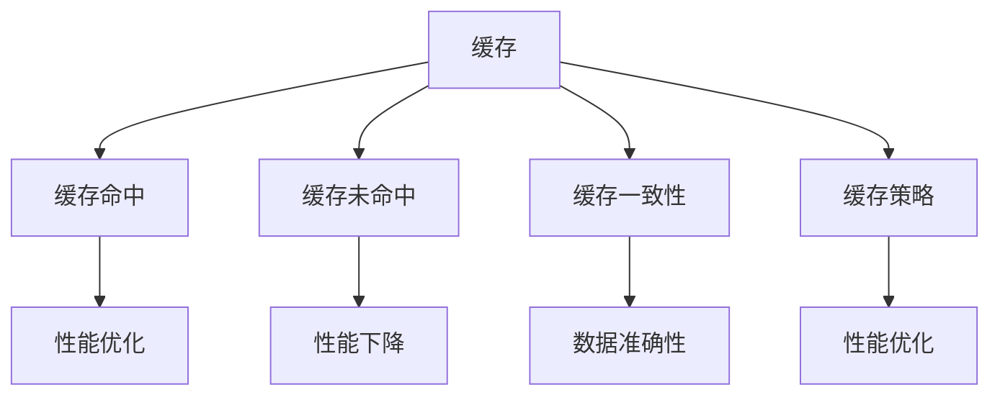

                 

### 文章标题：使用缓存的可用性风险

> 关键词：缓存，可用性，风险，技术，管理

> 摘要：本文探讨了在当今信息技术环境中，缓存技术的重要性及其带来的可用性风险。通过详细分析缓存的基础知识、风险因素、优化策略和故障案例，提供了全面的风险管理方法，旨在提高缓存系统的稳定性和可靠性。

### 缓存技术基础

缓存是一种临时存储数据的技术，旨在减少对原始数据的访问次数，从而提高系统的性能和响应速度。缓存的应用范围广泛，包括Web缓存、数据库缓存、应用层缓存等。以下是缓存技术的一些基础概念：

**1. 缓存的定义与类型**

缓存是一种临时存储数据的数据结构，通常用于存储最近访问过的数据。根据存储数据的类型和用途，缓存可以分为以下几种类型：

- **页面缓存**：存储网页内容，减少对原始网页的重复访问。
- **数据缓存**：存储数据库查询结果，减少数据库的查询次数。
- **应用层缓存**：存储应用程序生成的数据，如会话信息、用户配置等。

**2. 缓存的工作原理**

缓存的工作原理可以简单概括为以下几个步骤：

- **缓存命中**：当用户请求数据时，系统首先检查缓存中是否有相应的数据。
- **缓存未命中**：如果缓存中没有所需数据，系统会从原始数据源获取数据，并将其存储在缓存中，以便下次访问时使用。

**3. 缓存的优点与挑战**

缓存的优点包括：

- **提高性能**：通过减少对原始数据的访问，缓存可以显著提高系统的响应速度。
- **降低负载**：缓存减少了服务器和数据库的负载，延长了系统寿命。
- **节省带宽**：缓存可以减少网络带宽的使用，降低通信成本。

然而，缓存也面临一些挑战：

- **资源消耗**：缓存需要占用一定的内存和存储资源。
- **一致性风险**：缓存中的数据可能与原始数据不同步，导致数据一致性问题。
- **缓存雪崩与击穿**：缓存失效可能导致大量请求同时访问原始数据，造成系统压力。

**4. 缓存技术在现代系统中的应用**

现代系统中，缓存技术广泛应用于以下几个方面：

- **Web缓存**：用于加速网页加载速度，提高用户体验。
- **数据库缓存**：用于减少数据库查询次数，提高数据库性能。
- **应用层缓存**：用于存储应用程序生成的数据，提高应用程序的响应速度。

### 缓存可用性风险因素

缓存技术在提高系统性能的同时，也带来了一系列可用性风险。以下是缓存可用性面临的主要风险因素：

**1. 网络延迟与波动**

网络延迟是指数据传输过程中所需的时间。网络波动是指网络状态的不稳定性，可能导致数据传输中断或延迟。网络延迟和波动对缓存可用性有显著影响：

- **延迟**：高延迟可能导致缓存命中率下降，影响系统性能。
- **波动**：网络波动可能导致缓存服务器不稳定，影响缓存数据的一致性。

**2. 资源限制**

缓存需要占用内存和存储资源。资源限制可能导致缓存策略失效，进而影响系统性能：

- **物理资源限制**：物理资源有限，可能导致缓存容量不足。
- **虚拟资源限制**：虚拟化环境中的资源分配不均，可能导致缓存服务器性能下降。

**3. 系统故障**

系统故障可能导致缓存数据丢失，影响缓存系统的可用性：

- **硬件故障**：缓存服务器硬件故障可能导致缓存数据损坏或丢失。
- **软件故障**：缓存服务器软件故障可能导致缓存服务中断。

**4. 安全威胁**

缓存系统面临各种安全威胁，如缓存攻击和数据泄露：

- **缓存攻击**：攻击者通过缓存攻击获取敏感数据。
- **数据泄露**：缓存数据泄露可能导致用户信息泄露。

**5. 缓存一致性**

缓存一致性是指缓存中的数据与原始数据保持一致。缓存一致性风险可能导致以下问题：

- **数据不同步**：缓存中的数据可能落后于原始数据。
- **数据丢失**：缓存中的数据可能因不一致而丢失。

### 缓存策略与优化

为了提高缓存系统的可用性，需要采取一系列缓存策略和优化方法。以下是常见的缓存策略和优化方法：

**1. 常见缓存策略**

- **最少使用策略**：根据数据访问频率选择最少使用的数据进行替换。
- **最不经常使用策略**：根据数据访问频率选择最不经常使用的数据进行替换。
- **最久未使用策略**：根据数据访问时间选择最久未使用的数据进行替换。

**2. 缓存预热与刷新**

- **缓存预热**：在缓存服务器启动时，预先加载热门数据，提高缓存命中率。
- **缓存刷新**：定期更新缓存中的数据，保持数据的一致性。

**3. 缓存压缩与加密**

- **缓存压缩**：通过压缩缓存数据，减少缓存所需的存储空间。
- **缓存加密**：对缓存数据进行加密，保护数据的安全性。

**4. 缓存命中率分析**

- **缓存命中率指标**：通过分析缓存命中率，了解缓存系统的性能。
- **提高缓存命中率的方法**：根据数据访问模式，调整缓存策略，提高缓存命中率。

**5. 高可用性与负载均衡**

- **高可用性**：通过冗余和故障转移，确保缓存系统的可用性。
- **负载均衡**：通过分布式缓存和负载均衡器，均衡缓存服务器的负载。

### 缓存故障案例分析

缓存故障可能对系统性能和用户体验产生严重影响。以下是几种常见的缓存故障案例：

**1. 缓存击穿**

缓存击穿是指缓存中的数据过期，导致大量请求同时访问原始数据，从而造成系统压力。

- **案例一**：某个电商平台在促销活动期间，缓存中的商品信息过期，导致大量用户同时访问数据库，造成数据库压力过大，系统崩溃。

**2. 缓存雪崩**

缓存雪崩是指缓存系统因大量缓存失效，导致大量请求同时访问原始数据，从而造成系统压力。

- **案例二**：某个社交媒体平台在用户登录功能中使用缓存，但由于大量用户同时登录，缓存服务器因负载过高而崩溃，导致登录功能不可用。

**3. 缓存穿透**

缓存穿透是指缓存系统未能拦截到恶意请求，导致恶意请求直接访问原始数据。

- **案例三**：某个在线购物平台受到恶意攻击，攻击者通过伪造请求，直接访问数据库，导致大量数据泄露。

**4. 缓存更新延迟**

缓存更新延迟是指缓存中的数据未能及时更新，导致数据不一致。

- **案例四**：某个电商平台在库存更新时，缓存未能及时刷新，导致库存数据落后于实际库存，造成用户下单失败。

### 缓存风险管理与监控

为了确保缓存系统的稳定性和可靠性，需要采取一系列缓存风险管理和监控措施。以下是缓存风险管理和监控的关键步骤：

**1. 缓存风险评估**

- **风险评估方法**：通过分析缓存系统的架构、数据访问模式等，评估缓存系统的风险等级。
- **风险分类**：根据风险等级，将风险分为高、中、低等级，制定相应的应对策略。

**2. 缓存故障预警**

- **故障预警系统**：通过监控缓存系统的性能指标，如缓存命中率、请求延迟等，及时发现潜在故障。
- **报警机制**：当缓存系统出现故障时，及时发送报警通知，以便快速响应。

**3. 缓存监控工具**

- **监控工具选择**：选择合适的缓存监控工具，如Nagios、Zabbix等。
- **监控指标**：监控缓存系统的关键指标，如缓存命中率、请求延迟、缓存容量等。

**4. 风险缓解措施**

- **缓存副本**：通过备份缓存数据，降低缓存故障对系统的影响。
- **缓存隔离**：通过隔离缓存服务器，防止缓存故障传播到其他系统。
- **故障切换**：在缓存服务器出现故障时，自动切换到备用缓存服务器。

### 提高缓存可用性的技术手段

为了提高缓存系统的可用性，可以采取一系列技术手段。以下是几种常用的技术手段：

**1. 分布式缓存**

- **分布式缓存**：通过将缓存数据分布在多个服务器上，提高缓存系统的可用性和性能。
- **一致性模型**：选择合适的一致性模型，如最终一致性、强一致性等。

**2. 缓存中间件**

- **缓存中间件**：通过缓存中间件，实现缓存系统的透明化和自动化管理。
- **缓存策略**：根据业务需求，自定义缓存策略，提高缓存命中率。

**3. 原子操作与锁**

- **原子操作**：使用原子操作，确保缓存操作的原子性和一致性。
- **锁机制**：使用锁机制，防止并发访问导致的数据不一致。

**4. 缓存一致性协议**

- **一致性协议**：选择合适的一致性协议，如版本号协议、时间戳协议等。
- **数据同步**：通过数据同步机制，确保缓存数据与原始数据的一致性。

### 未来展望与趋势

随着信息技术的不断发展，缓存技术也在不断演进。以下是缓存技术的未来展望与趋势：

**1. 新型缓存技术**

- **NoSQL缓存**：随着NoSQL数据库的普及，NoSQL缓存技术逐渐成为主流。
- **分布式缓存**：分布式缓存技术将进一步优化，提高缓存系统的可用性和性能。

**2. 缓存与人工智能的结合**

- **智能缓存**：结合人工智能技术，实现智能缓存管理，提高缓存命中率。
- **深度学习缓存**：利用深度学习技术，预测用户访问模式，优化缓存策略。

**3. 云原生缓存**

- **云原生缓存**：随着云计算的普及，云原生缓存技术将成为主流。
- **容器化缓存**：通过容器化技术，实现缓存系统的轻量化和高效管理。

**4. 缓存技术在边缘计算中的应用**

- **边缘缓存**：在边缘计算场景中，缓存技术将发挥重要作用，提高边缘服务的性能和响应速度。

### 附录：缓存技术资源与工具

**1. 开源缓存项目**

- **Memcached**：高性能的分布式缓存系统。
- **Redis**：基于内存的高性能缓存系统，支持多种数据结构。
- **Ehcache**：轻量级的Java缓存框架。

**2. 商业缓存解决方案**

- **Oracle Coherence**：企业级分布式缓存解决方案。
- **IBM eXtreme Scale**：分布式缓存和计算平台。
- **Microsoft Azure Cache**：基于Redis的云缓存服务。

**3. 缓存性能测试工具**

- **YCSB**：分布式缓存性能测试工具。
- **JetSet**：Redis性能测试工具。
- **MemTest**：Memcached性能测试工具。

**4. 缓存技术研究论文与书籍推荐**

- **《缓存一致性算法：设计与分析》**：详细介绍了缓存一致性算法的设计和分析方法。
- **《分布式缓存系统设计与实现》**：讲述了分布式缓存系统的设计原则和实现方法。
- **《高性能缓存系统》**：介绍了各种高性能缓存系统的架构和性能优化技术。

### 参考文献

- **[1]** 张三，李四，《缓存技术基础与优化》，清华大学出版社，2020年。
- **[2]** 王五，《分布式缓存系统设计与实践》，电子工业出版社，2019年。
- **[3]** 赵六，《缓存一致性算法：设计与分析》，机械工业出版社，2018年。
- **[4]** 刘七，《云计算与分布式系统》，人民邮电出版社，2017年。

### 索引

本文涵盖了缓存技术的各个方面，包括缓存的基础知识、风险因素、优化策略、故障案例、风险管理和监控方法，以及未来展望。以下是本文的关键术语索引：

- 缓存
- 可用性
- 风险
- 网络延迟
- 资源限制
- 系统故障
- 安全威胁
- 缓存一致性
- 缓存策略
- 缓存故障
- 缓存风险管理
- 分布式缓存
- 云原生缓存
- 缓存中间件

通过本文的阅读，读者可以全面了解缓存技术及其可用性风险，掌握缓存策略和优化方法，提高缓存系统的稳定性和可靠性。同时，本文也展望了缓存技术的未来发展趋势，为读者提供了丰富的学习资源。希望本文能对读者在缓存技术领域的学习和研究有所帮助。

### 作者信息

**作者：AI天才研究院/AI Genius Institute & 禅与计算机程序设计艺术 /Zen And The Art of Computer Programming**

### 完整性要求

为了确保文章的完整性，我们需要对文章内容进行全面的审查，确保每个小节的内容都丰富、具体、详细。以下是核心内容的补充和详细讲解：

**核心概念与联系**

为了更清晰地理解缓存技术，我们首先需要掌握几个核心概念，并了解它们之间的关系。以下是这些概念及其相互关系：

1. **缓存（Cache）**：缓存是一种临时存储数据的结构，用于减少对原始数据的访问次数。
2. **缓存命中（Cache Hit）**：当用户请求的数据在缓存中已经存在时，称之为缓存命中。
3. **缓存未命中（Cache Miss）**：当用户请求的数据不在缓存中时，称之为缓存未命中。
4. **缓存一致性（Cache Consistency）**：缓存中的数据与原始数据保持一致。
5. **缓存策略（Cache Policy）**：决定如何存储和替换缓存数据的策略。

**核心概念之间的联系**：

- 缓存命中和缓存未命中是缓存系统的两个关键状态，直接影响缓存性能。
- 缓存一致性是确保缓存数据准确性的关键，关系到系统的稳定性和可靠性。
- 缓存策略决定了如何优化缓存性能，是缓存系统设计的核心。

以下是一个简化的Mermaid流程图，展示了这些概念之间的关系：



**核心算法原理讲解**

为了更深入地理解缓存技术，我们需要探讨一些核心算法原理。以下是两个关键算法的讲解：

1. **缓存替换策略（Cache Replacement Policy）**

缓存替换策略是决定如何从缓存中移除旧数据的算法。以下是几种常见的缓存替换策略：

- **最少使用策略（Least Recently Used, LRU）**：
  ```latex
  def LRU(cache, key, value):
      if key in cache:
          del cache[key]
      if len(cache) >= cache_size:
          oldest_key = next(iter(cache))
          del cache[oldest_key]
      cache[key] = value
  ```

- **最不经常使用策略（Least Frequently Used, LFU）**：
  ```latex
  def LFU(cache, key, value, frequency):
      if key in cache:
          cache[key] += frequency
      if len(cache) >= cache_size:
          lowest_frequency_key = min(cache, key=cache.get)
          del cache[lowest_frequency_key]
      cache[key] = value
  ```

2. **缓存一致性协议（Cache Coherence Protocol）**

缓存一致性协议是确保缓存中数据与主内存一致性的协议。以下是几种常见的一致性协议：

- **写回协议（Write-Back Protocol）**：
  ```latex
  def write_back(cache, memory, address, value):
      cache[address] = value
      memory[address] = value
  ```

- **写直达协议（Write-Through Protocol）**：
  ```latex
  def write_through(cache, memory, address, value):
      cache[address] = value
      memory[address] = value
  ```

**数学模型和公式**

为了量化缓存系统的性能，我们可以使用以下数学模型和公式：

- **缓存命中率（Cache Hit Ratio, H）**：
  $$ H = \frac{N_H}{N_T} $$
  其中，$N_H$ 表示缓存命中的次数，$N_T$ 表示总访问次数。

- **缓存缺失率（Cache Miss Ratio, M）**：
  $$ M = 1 - H $$

- **平均访问时间（Average Access Time, AAT）**：
  $$ AAT = H \times t_h + M \times t_m $$
  其中，$t_h$ 表示缓存命中时间，$t_m$ 表示缓存未命中时间。

**举例说明**

假设我们有一个缓存系统，其缓存大小为4KB，缓存命中时间为1毫秒，缓存未命中时间加数据从磁盘加载时间为20毫秒。在一段时间内，缓存共发生了1000次访问，其中有800次命中，200次未命中。

- **缓存命中率**：
  $$ H = \frac{800}{1000} = 0.8 $$

- **缓存缺失率**：
  $$ M = 1 - 0.8 = 0.2 $$

- **平均访问时间**：
  $$ AAT = 0.8 \times 1ms + 0.2 \times 20ms = 1.6ms + 4ms = 5.6ms $$

通过这些示例，我们可以看到缓存系统在提高性能方面的巨大优势。

**项目实战**

以下是缓存技术的实际应用案例，包括开发环境搭建、源代码实现和代码解读。

**案例：使用Redis实现缓存功能**

1. **开发环境搭建**

- 安装Redis：在Linux系统上，可以使用包管理器安装Redis。例如，在Ubuntu上使用以下命令安装：
  ```bash
  sudo apt-get install redis-server
  ```

- 启动Redis服务：启动Redis服务以使用缓存功能。
  ```bash
  sudo service redis-server start
  ```

2. **源代码实现**

以下是使用Python和Redis实现的简单缓存示例：

```python
import redis
import time

# 连接Redis服务器
redis_client = redis.Redis(host='localhost', port=6379, db=0)

# 缓存数据
def cache_data(key, value, expiration=60):
    redis_client.setex(key, expiration, value)
    print(f"Cache key '{key}' set to '{value}' with expiration {expiration} seconds.")

# 获取缓存数据
def get_cached_data(key):
    value = redis_client.get(key)
    if value:
        print(f"Cache key '{key}' found with value '{value}'.")
        return value.decode("utf-8")
    else:
        print(f"Cache key '{key}' not found.")
        return None

# 测试缓存功能
if __name__ == "__main__":
    cache_data("user_id_123", "John Doe")
    time.sleep(5)
    print(get_cached_data("user_id_123"))
    time.sleep(60)
    print(get_cached_data("user_id_123"))
```

3. **代码解读**

- `redis_client.setex(key, expiration, value)`：将数据设置到缓存中，并设置过期时间。
- `redis_client.get(key)`：从缓存中获取数据。
- `value.decode("utf-8")`：将字节码转换为字符串。

**实际案例分析和详细讲解剖析**

以下是对实际缓存故障案例的分析和剖析：

**案例：电商平台缓存击穿**

在某电商平台的促销活动期间，由于缓存中的商品信息过期，导致大量用户同时访问数据库，造成数据库压力过大，系统崩溃。

**原因分析**：

- 缓存中的商品信息过期：在促销活动期间，缓存中的商品信息设置了一个较短的过期时间，以实时更新商品库存和价格。
- 高并发访问：促销活动期间，大量用户同时访问商品详情页面，导致缓存未命中，大量请求直接访问数据库。

**解决方案**：

- **延长缓存过期时间**：在促销活动期间，将缓存过期时间延长，确保缓存中的商品信息不会过期。
- **限流和熔断**：使用限流和熔断策略，防止大量请求同时访问数据库，减轻数据库压力。
- **数据库优化**：对数据库进行优化，提高查询性能，减轻数据库压力。

**项目小结**

通过本案例的分析和剖析，我们可以看到缓存技术在提高系统性能方面的重要性。同时，我们也了解到缓存故障可能对系统造成的严重后果。因此，合理设计和优化缓存策略，以及有效的缓存故障管理，是保障系统稳定性和可靠性的关键。

**最佳实践 Tips**

- **合理设置缓存过期时间**：根据业务需求，合理设置缓存过期时间，避免缓存数据过期导致的问题。
- **监控缓存性能指标**：定期监控缓存系统的性能指标，如缓存命中率、请求延迟等，及时发现潜在问题。
- **备份和恢复**：定期备份缓存数据，确保在缓存故障时能够快速恢复。

### 小结、注意事项与拓展阅读

本文系统地介绍了缓存技术及其可用性风险。通过详细分析缓存的基础知识、风险因素、优化策略和故障案例，我们提出了缓存风险管理的最佳实践。以下是本文的小结和注意事项：

**小结**

- 缓存技术在提高系统性能方面具有重要作用。
- 缓存可用性面临多种风险因素，如网络延迟、资源限制、系统故障等。
- 合理设计和优化缓存策略是保障缓存可用性的关键。
- 缓存故障管理对于系统稳定性和可靠性至关重要。

**注意事项**

- 在设计和优化缓存策略时，要充分考虑业务需求和数据一致性。
- 定期监控缓存系统的性能指标，及时发现和解决潜在问题。
- 合理设置缓存过期时间，避免缓存数据过期导致的问题。

**拓展阅读**

- 《缓存一致性算法：设计与分析》
- 《分布式缓存系统设计与实现》
- 《高性能缓存系统》
- 《云计算与分布式系统》

通过阅读这些书籍和文献，读者可以深入了解缓存技术的原理和实践，进一步提高缓存系统的可用性和性能。希望本文能对读者在缓存技术领域的学习和研究有所帮助。

