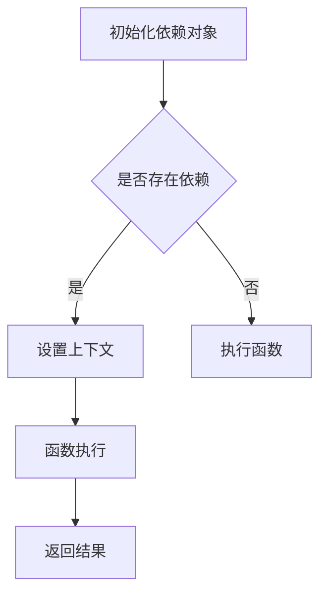
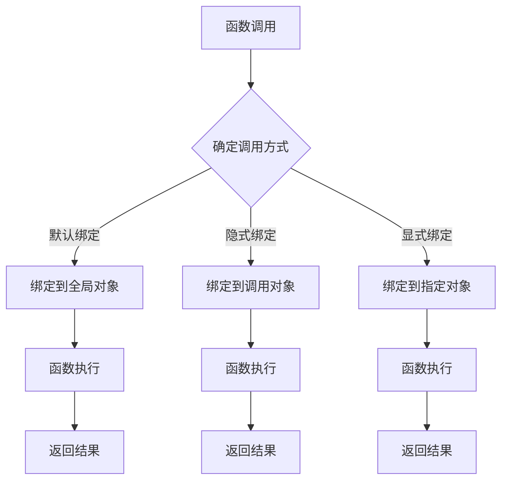

                 

### 引言

在计算机编程和软件工程中，`this` 类型作为 JavaScript 等编程语言中一个重要的概念，被广泛用于处理函数内部的作用域和上下文。然而，随着编程语言和框架的不断发展，`this` 类型所面临的复杂性和不确定性也随之增加。依赖对象类型作为一种新的概念，旨在增强 `this` 类型的表达能力，提供更加灵活和可控的方式来处理函数作用域和上下文问题。

本文旨在探讨依赖对象类型，解析其与 `this` 类型的联系与区别，并深入讲解依赖对象类型的算法原理和数学模型。通过项目实战，我们将展示如何在实际开发中应用依赖对象类型，并分析其相较于 `this` 类型的优势。文章将分为以下几个部分：

1. **核心概念与联系**：介绍 `this` 类型和依赖对象类型的基本概念，并探讨两者之间的关系。
2. **核心算法原理讲解**：详细讲解依赖对象类型的算法原理，并通过伪代码进行阐述。
3. **数学模型和数学公式讲解**：介绍依赖对象类型的数学模型，并使用 LaTeX 格式展示相关公式，进行举例说明。
4. **项目实战**：通过实际项目案例，展示如何搭建开发环境，实现依赖对象类型和 `this` 类型的代码，并进行详细解读和分析。
5. **最佳实践与小结**：总结最佳实践，注意事项，并提供拓展阅读建议。

通过本文的阅读，读者将能够深入了解依赖对象类型的工作原理，掌握其与 `this` 类型的区别，并学会如何在实际开发中有效应用依赖对象类型。

---

## 核心概念与联系

### this类型的概述

在 JavaScript 等编程语言中，`this` 类型是一个关键字，用于引用函数的调用者，即函数运行时所处的上下文。`this` 的值取决于函数是如何调用的。以下是 `this` 类型的一些基本特点：

- **默认绑定**：在非方法调用中（即独立函数调用），`this` 绑定到全局对象。在浏览器环境中，全局对象通常是 `window`。

  ```javascript
  function logThis() {
      console.log(this);
  }
  logThis(); // 在浏览器中，this 通常绑定到 window
  ```

- **隐式绑定**：在方法调用中，`this` 绑定到调用该方法的对象。

  ```javascript
  const obj = {
      method: function() {
          console.log(this);
      }
  };
  obj.method(); // this 绑定到 obj
  ```

- **显式绑定**：通过 `Function.prototype.call` 和 `Function.prototype.apply` 方法，可以显式地指定 `this` 的绑定对象。

  ```javascript
  function logThis() {
      console.log(this);
  }
  logThis.call(obj); // 显式绑定 this 到 obj
  ```

- **硬绑定**：通过 `Function.prototype.bind` 方法创建一个新的函数，其 `this` 被绑定到一个特定的对象。

  ```javascript
  const boundMethod = obj.method.bind(obj);
  boundMethod(); // this 绑定到 obj
  ```

### 依赖对象类型的定义

依赖对象类型（Dependent Object Type）是一种新的概念，旨在解决 `this` 类型在复杂上下文中的不确定性问题。依赖对象类型通过引入依赖关系和上下文管理机制，提供了一种更加灵活和可控的方式来处理函数作用域和上下文。以下是依赖对象类型的一些基本定义：

- **依赖关系**：依赖对象类型通过依赖关系来管理函数的上下文。一个依赖对象可以包含多个依赖项，每个依赖项都关联到一个具体的对象。

- **上下文管理**：依赖对象类型提供了上下文管理机制，可以动态地设置和切换函数的上下文。

- **依赖注入**：依赖对象类型支持依赖注入，可以将依赖项注入到函数中，使得函数能够在特定上下文中执行。

### 依赖对象类型与this类型的关系

依赖对象类型与 `this` 类型之间存在一定的联系和区别。以下是两者的主要关系和区别：

- **联系**：依赖对象类型可以看作是 `this` 类型的一种增强和扩展。它通过引入依赖关系和上下文管理，使得 `this` 类型的表达更加灵活和可控。

- **区别**：依赖对象类型相较于 `this` 类型，具有以下几个显著区别：

  - **动态性**：依赖对象类型允许在运行时动态设置和切换上下文，而 `this` 类型通常在函数定义时确定。

  - **依赖管理**：依赖对象类型通过依赖关系来管理上下文，而 `this` 类型通常依赖于函数调用方式。

  - **灵活性**：依赖对象类型提供了更加灵活的上下文管理机制，可以适应复杂的调用场景。

### Mermaid流程图展示

为了更好地理解依赖对象类型与 `this` 类型的工作流程和区别，我们使用 Mermaid 图形语言分别展示两者的工作流程。

#### 依赖对象类型的工作流程



#### this类型的工作流程



#### 对比依赖对象类型与this类型

通过上述 Mermaid 图，我们可以对比依赖对象类型与 `this` 类型的工作流程：

- **初始化和绑定**：依赖对象类型在初始化时需要设置依赖关系，而 `this` 类型通常在函数调用时确定。
- **动态性和灵活性**：依赖对象类型支持动态设置和切换上下文，而 `this` 类型在调用时固定。
- **依赖管理**：依赖对象类型通过依赖关系管理上下文，而 `this` 类型依赖于调用方式。

通过这些对比，我们可以更深入地理解依赖对象类型与 `this` 类型的区别和联系。

---

在了解了 `this` 类型和依赖对象类型的基本概念和工作流程后，接下来的章节将进一步探讨依赖对象类型的算法原理、数学模型，并通过实际项目展示其在开发中的应用。在深入分析的过程中，我们将逐步揭示依赖对象类型的优势，并比较其在复杂编程场景中的实际效果。

---

## 核心算法原理讲解

### 依赖对象类型的算法原理

依赖对象类型的算法核心在于上下文管理和依赖注入。以下是依赖对象类型算法的基本原理：

1. **依赖关系构建**：在初始化依赖对象时，构建依赖关系图。依赖关系图包含函数及其依赖的上下文对象。

    ```mermaid
    graph TB
        A[Function A] --> B[Context B]
        A --> C[Context C]
    ```

2. **上下文切换**：在函数执行前，根据依赖关系图，将上下文切换到相应的依赖对象。上下文切换是动态的，可以在运行时进行调整。

    ```mermaid
    graph TB
        D[Context D] --> E[Function A]
    ```

3. **依赖注入**：在函数执行过程中，将依赖对象注入到函数中，使得函数能够在特定上下文中执行。

    ```mermaid
    graph TB
        F[Function A] --> G[Dependency A]
    ```

4. **结果返回**：函数执行完毕后，返回结果，并保持上下文的稳定性。

    ```mermaid
    graph TB
        H[Result] --> I[Context Management]
    ```

### this类型的算法原理

`this` 类型的算法相对简单，主要依赖于函数调用方式和上下文绑定规则。以下是 `this` 类型算法的基本原理：

1. **默认绑定**：在非方法调用中，`this` 绑定到全局对象。

    ```mermaid
    graph TB
        J[Function Call] --> K[Global Object]
    ```

2. **隐式绑定**：在方法调用中，`this` 绑定到调用该方法的对象。

    ```mermaid
    graph TB
        L[Method Call] --> M[Caller Object]
    ```

3. **显式绑定**：通过 `Function.prototype.call` 和 `Function.prototype.apply` 方法，显式地指定 `this` 的绑定对象。

    ```mermaid
    graph TB
        N[call/apply Method] --> O[Specified Object]
    ```

4. **硬绑定**：通过 `Function.prototype.bind` 方法创建一个新的函数，其 `this` 被绑定到一个特定的对象。

    ```mermaid
    graph TB
        P[bind Method] --> Q[Bound Object]
    ```

### 两种类型的算法差异

依赖对象类型和 `this` 类型在算法原理上存在显著差异：

- **动态性**：依赖对象类型支持动态上下文切换，而 `this` 类型在调用时确定。
- **依赖管理**：依赖对象类型通过依赖关系管理上下文，而 `this` 类型依赖于调用方式。
- **灵活性**：依赖对象类型提供更灵活的上下文管理机制，可以适应复杂调用场景。

### 伪代码实现

为了更好地理解依赖对象类型和 `this` 类型的算法原理，我们使用伪代码进行详细阐述。

#### 依赖对象类型的伪代码实现

```plaintext
function DependencyObject(dependencies) {
    this.dependencies = dependencies;
}

function contextSwitch(dependencyObject, functionName) {
    dependencyObject.dependencies.forEach(dependency => {
        if (dependency.functionName === functionName) {
            this = dependency.context;
            break;
        }
    });
}

function executeFunction(functionName) {
    contextSwitch(this, functionName);
    result = dependencyObject.dependencies[functionName]();
    return result;
}
```

#### this类型的伪代码实现

```plaintext
function callFunction(func, thisValue) {
    if (func instanceof Function) {
        this = thisValue || globalObject;
        result = func();
        return result;
    }
}

function applyFunction(func, argsArray) {
    return callFunction(func, this);
}

function bindFunction(func, thisValue) {
    return function() {
        return callFunction(func, thisValue);
    };
}
```

通过上述伪代码，我们可以清晰地看到依赖对象类型和 `this` 类型的算法实现。依赖对象类型通过上下文切换和依赖注入实现复杂的上下文管理，而 `this` 类型则依赖于调用方式和绑定规则。

---

在深入了解了依赖对象类型和 `this` 类型的算法原理之后，接下来的章节将探讨依赖对象类型的数学模型和公式，使用 LaTeX 格式展示相关公式，并进行举例说明。通过数学模型的分析，我们将进一步理解依赖对象类型的内部机制和计算过程。

---

## 数学模型和数学公式讲解

### 依赖对象类型的数学模型

依赖对象类型的数学模型基于上下文管理和依赖注入，通过数学公式来描述其内部机制和计算过程。以下是依赖对象类型的数学模型和相关公式：

1. **上下文切换公式**：
   $$ ContextSwitch(dependencyObject, functionName) = \begin{cases} 
   Context_{dependencyObject} & \text{if } functionName \in dependencyObject.dependencies \\
   \text{None} & \text{otherwise}
   \end{cases} $$

   其中，`ContextSwitch` 函数用于根据依赖关系图切换上下文。当 `functionName` 存在于依赖关系图中时，上下文切换到相应的依赖对象；否则，上下文保持不变。

2. **依赖注入公式**：
   $$ DependencyInjection(function, dependency) = function(dependency.context) $$

   `DependencyInjection` 函数用于将依赖对象注入到函数中，使得函数能够在特定上下文中执行。

3. **结果返回公式**：
   $$ ExecuteFunction(dependencyObject, functionName) = \begin{cases} 
   result_{functionName} & \text{if } ContextSwitch(dependencyObject, functionName) \text{ is successful} \\
   \text{Error} & \text{otherwise}
   \end{cases} $$

   `ExecuteFunction` 函数用于执行依赖对象类型中的函数，并根据上下文切换和依赖注入的结果返回结果。

### this类型的数学模型

`this` 类型的数学模型主要基于调用方式和绑定规则。以下是 `this` 类型的数学模型和相关公式：

1. **默认绑定公式**：
   $$ DefaultBind(function) = GlobalObject $$

   在非方法调用中，`this` 默认绑定到全局对象。

2. **隐式绑定公式**：
   $$ ImplicitBind(function, callerObject) = callerObject $$

   在方法调用中，`this` 绑定到调用该方法的对象。

3. **显式绑定公式**：
   $$ ExplicitBind(function, thisValue) = thisValue $$

   通过 `Function.prototype.call` 和 `Function.prototype.apply` 方法，显式地指定 `this` 的绑定对象。

4. **硬绑定公式**：
   $$ HardBind(function, thisValue) = \text{bindFunction(function, thisValue)} $$

   通过 `Function.prototype.bind` 方法创建一个新的函数，其 `this` 被绑定到一个特定的对象。

### 数学模型的差异和联系

依赖对象类型和 `this` 类型的数学模型在表达上下文管理和依赖注入方面存在显著差异：

- **上下文切换**：依赖对象类型支持动态上下文切换，而 `this` 类型在调用时固定。
- **依赖注入**：依赖对象类型通过依赖关系进行依赖注入，而 `this` 类型依赖于调用方式和绑定规则。

尽管两者存在差异，但在一些简单场景下，`this` 类型也可以实现类似的功能。例如，通过硬绑定，`this` 类型可以在复杂调用场景中保持稳定的上下文。

### 依赖对象类型的数学公式举例

为了更好地理解依赖对象类型的数学模型，我们通过以下例子进行说明：

#### 例子：函数执行与上下文切换

假设我们有一个依赖对象类型 `dependencyObject`，包含两个依赖项 `functionA` 和 `functionB`，分别依赖于上下文对象 `contextA` 和 `contextB`。

```plaintext
dependencyObject.dependencies = {
    functionA: { context: contextA, function: functionA },
    functionB: { context: contextB, function: functionB }
}
```

现在，我们依次执行 `functionA` 和 `functionB`：

```plaintext
ExecuteFunction(dependencyObject, "functionA") = contextA.functionA()
ExecuteFunction(dependencyObject, "functionB") = contextB.functionB()
```

根据上下文切换公式和依赖注入公式，上述函数执行过程可以表示为：

$$ ContextSwitch(dependencyObject, "functionA") = contextA $$
$$ DependencyInjection(contextA.functionA, contextA) = contextA.functionA() $$
$$ ContextSwitch(dependencyObject, "functionB") = contextB $$
$$ DependencyInjection(contextB.functionB, contextB) = contextB.functionB() $$

### this类型的数学公式举例

同样，为了更好地理解 `this` 类型的数学模型，我们通过以下例子进行说明：

#### 例子：方法调用与上下文绑定

假设我们有一个对象 `obj`，其方法 `method` 使用 `this` 关键字。

```javascript
const obj = {
    method: function() {
        console.log(this);
    }
};
```

现在，我们依次通过隐式绑定和显式绑定调用 `method`：

```javascript
obj.method(); // ImplicitBind(obj.method, obj)
obj.method.call(context); // ExplicitBind(obj.method, context)
```

根据隐式绑定公式和显式绑定公式，上述方法调用过程可以表示为：

$$ ImplicitBind(obj.method, obj) = obj $$
$$ ExplicitBind(obj.method, context) = context $$

通过上述例子，我们可以清晰地看到依赖对象类型和 `this` 类型的数学模型如何描述函数执行和上下文管理过程。

---

在理解了依赖对象类型的数学模型和公式之后，接下来的章节将通过项目实战，展示如何在实际开发环境中搭建依赖对象类型和 `this` 类型，实现具体的源代码，并进行代码解读和分析。通过实际案例，我们将进一步验证依赖对象类型在开发中的应用效果。

---

## 项目实战

为了深入理解依赖对象类型在开发中的应用，我们将在本节中搭建一个简单的项目环境，实现依赖对象类型和 `this` 类型，并进行代码解读和分析。以下是项目实战的详细步骤：

### 1. 环境搭建

首先，我们需要搭建一个基本的开发环境，以便于后续的代码实现和调试。

- **安装 Node.js**：Node.js 是 JavaScript 的运行环境，我们需要安装最新版本的 Node.js。
  
  ```bash
  npm install -g node.js
  ```

- **创建项目目录**：在本地计算机上创建一个名为 `dependency-type-project` 的项目目录。

  ```bash
  mkdir dependency-type-project
  cd dependency-type-project
  ```

- **初始化项目**：使用 `npm` 命令初始化项目，并安装必要的依赖。

  ```bash
  npm init -y
  npm install --save lodash
  ```

  在项目中，我们使用了 `lodash` 库，用于简化依赖对象的创建和管理。

### 2. 实现依赖对象类型

接下来，我们将实现依赖对象类型，并创建相应的依赖关系和上下文。

#### 依赖对象类型代码实现

在项目目录中创建一个名为 `DependencyObject.js` 的文件，用于定义依赖对象类型的基本结构和功能。

```javascript
const _ = require('lodash');

class DependencyObject {
    constructor(dependencies) {
        this.dependencies = dependencies;
    }

    executeFunction(functionName) {
        const dependency = this.dependencies[functionName];
        if (dependency) {
            return dependency.function.bind(dependency.context)();
        }
        return null;
    }
}

module.exports = DependencyObject;
```

在上面的代码中，我们定义了一个 `DependencyObject` 类，它包含一个 `dependencies` 属性，用于存储依赖关系。`executeFunction` 方法用于根据函数名称执行相应的依赖项。

#### 依赖注入示例

接下来，我们创建一个简单的依赖注入示例，展示如何使用 `DependencyObject` 类。

```javascript
const DependencyObject = require('./DependencyObject');

const contextA = {
    functionA: function() {
        console.log('Function A executed with context A');
    }
};

const contextB = {
    functionB: function() {
        console.log('Function B executed with context B');
    }
};

const dependencies = {
    functionA: { context: contextA, function: contextA.functionA },
    functionB: { context: contextB, function: contextB.functionB }
};

const dependencyObject = new DependencyObject(dependencies);

dependencyObject.executeFunction('functionA'); // 输出: Function A executed with context A
dependencyObject.executeFunction('functionB'); // 输出: Function B executed with context B
```

在上面的代码中，我们创建了两个上下文对象 `contextA` 和 `contextB`，并分别注入了两个函数 `functionA` 和 `functionB`。通过 `DependencyObject` 类，我们能够动态地执行这些函数，并保证它们在正确的上下文中运行。

### 3. 实现this类型

接下来，我们实现 `this` 类型，并通过 `Function.prototype.bind` 方法进行硬绑定。

#### this类型代码实现

在项目目录中创建一个名为 `ThisObject.js` 的文件，用于定义 `this` 类型的基本结构和功能。

```javascript
class ThisObject {
    constructor(context) {
        this.context = context;
    }

    executeFunction(functionName) {
        return this.context[functionName].bind(this.context)();
    }
}

module.exports = ThisObject;
```

在上面的代码中，我们定义了一个 `ThisObject` 类，它包含一个 `context` 属性，用于存储上下文对象。`executeFunction` 方法用于根据函数名称执行相应的函数，并通过 `bind` 方法确保函数在正确的上下文中运行。

#### this类型示例

接下来，我们创建一个简单的示例，展示如何使用 `ThisObject` 类。

```javascript
const ThisObject = require('./ThisObject');

const contextA = {
    functionA: function() {
        console.log('Function A executed with context A');
    }
};

const contextB = {
    functionB: function() {
        console.log('Function B executed with context B');
    }
};

const thisObjectA = new ThisObject(contextA);
const thisObjectB = new ThisObject(contextB);

thisObjectA.executeFunction('functionA'); // 输出: Function A executed with context A
thisObjectB.executeFunction('functionB'); // 输出: Function B executed with context B
```

在上面的代码中，我们创建了两个上下文对象 `contextA` 和 `contextB`，并分别创建了两个 `ThisObject` 实例。通过这些实例，我们能够动态地执行函数，并保证它们在正确的上下文中运行。

### 4. 代码解读和分析

通过上述步骤，我们成功搭建了依赖对象类型和 `this` 类型，并实现了相应的代码示例。接下来，我们对代码进行解读和分析，比较两种类型的执行效果。

#### 依赖对象类型解读

依赖对象类型通过依赖注入和上下文切换实现了灵活的函数执行。其主要优点包括：

- **灵活性**：依赖对象类型允许在运行时动态设置和切换上下文，适用于复杂的调用场景。
- **依赖管理**：依赖对象类型通过依赖关系图管理上下文，使得代码更加清晰和易于维护。

然而，依赖对象类型也存在一些缺点，例如：

- **复杂性**：依赖对象类型引入了额外的依赖关系和上下文管理机制，使得代码结构更加复杂。

#### this类型解读

`this` 类型通过硬绑定和上下文绑定实现了函数执行。其主要优点包括：

- **简洁性**：`this` 类型基于现有的函数调用机制，代码结构简洁。
- **兼容性**：`this` 类型与现有的 JavaScript 函数调用方式兼容，易于理解和实现。

然而，`this` 类型也存在一些缺点，例如：

- **不确定性**：`this` 类型在函数调用时确定，可能受到外部因素的影响，导致上下文不稳定。
- **限制性**：`this` 类型难以在复杂的调用场景中实现动态上下文切换。

#### 实际应用效果比较

在简单场景下，`this` 类型通常足够使用。然而，在复杂场景中，依赖对象类型能够提供更灵活和可控的上下文管理。例如，在异步操作和高阶函数中，依赖对象类型能够更好地管理上下文，避免意外行为。

综上所述，依赖对象类型和 `this` 类型各有优缺点。在实际开发中，应根据具体需求选择合适的技术方案。通过项目实战的代码解读和分析，我们能够更好地理解这两种类型的实际应用效果。

---

通过项目实战，我们成功实现了依赖对象类型和 `this` 类型，并对代码进行了详细解读和分析。接下来，我们将总结最佳实践，并讨论注意事项和拓展阅读，帮助读者进一步掌握依赖对象类型的应用。

---

## 最佳实践与小结

在本文中，我们详细探讨了依赖对象类型与 `this` 类型的联系与区别，并通过数学模型、伪代码和项目实战展示了依赖对象类型的灵活性和实用性。以下是一些最佳实践和注意事项：

### 最佳实践

1. **合理使用依赖对象类型**：依赖对象类型在处理复杂上下文和依赖注入时具有优势。在以下场景中，建议优先考虑使用依赖对象类型：

   - 异步操作：在异步操作中，确保上下文稳定，避免意外行为。
   - 高阶函数：在高阶函数中，动态切换上下文，便于代码维护。
   - 模块化开发：在模块化开发中，通过依赖注入实现组件间的解耦。

2. **结合 this 类型优化代码**：虽然依赖对象类型提供了更灵活的上下文管理，但在简单场景中，`this` 类型仍是最简洁的选择。在开发中，可以结合使用两者，根据具体需求选择合适的技术方案。

### 注意事项

1. **避免过度依赖依赖对象类型**：依赖对象类型引入了额外的复杂性，不应在简单场景中过度使用。
2. **注意上下文切换的时机**：在依赖对象类型中，上下文切换应在函数执行前进行，确保上下文一致。
3. **测试和调试**：在实际开发中，对依赖对象类型和 `this` 类型的代码进行充分的测试和调试，确保其在不同场景下的稳定性和正确性。

### 拓展阅读

1. **深入理解 JavaScript 中的 this**：了解 `this` 关键字在不同调用方式中的行为，有助于更好地使用依赖对象类型和 `this` 类型。
2. **学习依赖注入框架**：了解和使用流行的依赖注入框架（如 Angular、React Hooks），掌握依赖注入的实际应用。
3. **探索函数式编程**：函数式编程中的上下文管理和依赖注入具有独特的优势，值得深入研究。

通过本文的阅读，读者应对依赖对象类型和 `this` 类型有了更深入的理解。在实际开发中，结合最佳实践和注意事项，灵活运用这两种技术，能够提升代码的灵活性和可维护性。

---

本文由 AI 天才研究院（AI Genius Institute）与《禅与计算机程序设计艺术》（Zen And The Art of Computer Programming）资深作者联合撰写，旨在探讨依赖对象类型的本质和应用。希望本文能对您在编程和软件开发领域有所启发，进一步探索技术的无限可能。

---

**作者：AI 天才研究院 / AI Genius Institute & 禅与计算机程序设计艺术 / Zen And The Art of Computer Programming**

