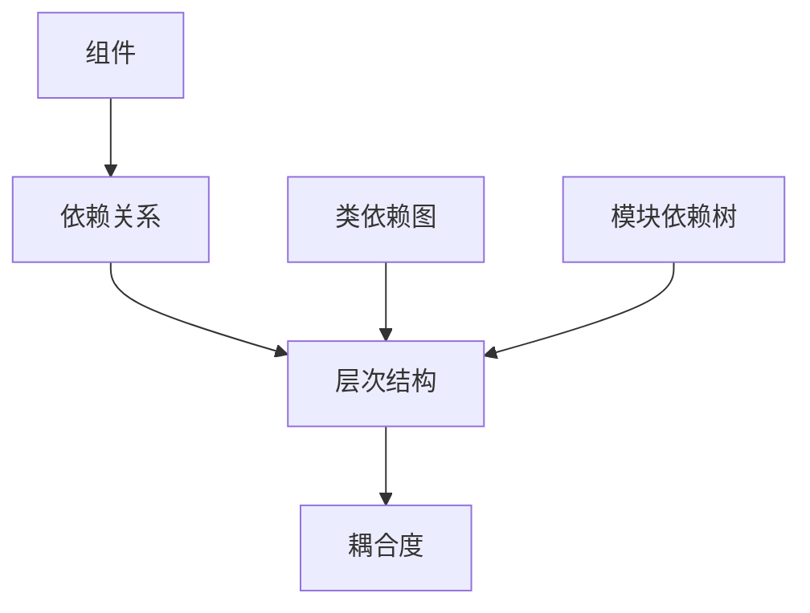
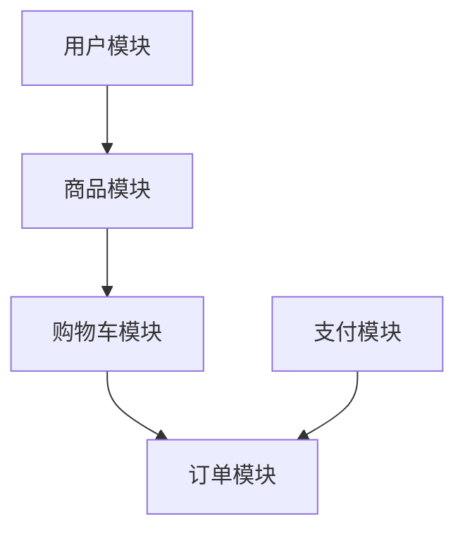

                 


### 文章标题：依赖类型在软件规范中的作用

#### 关键词：依赖类型、软件规范、算法原理、数学模型、项目实战

#### 摘要：
本文将深入探讨依赖类型在软件规范中的作用。首先，我们会对依赖类型的背景和重要性进行介绍。接着，我们将详细讲解依赖类型的定义、核心概念及其在软件规范中的应用。随后，文章将阐述依赖类型的基本算法原理和数学模型，并通过实例说明其具体应用。最后，我们将结合实际项目案例，展示依赖类型在软件开发中的实际效果和最佳实践，为读者提供全面的指导和启示。

### 第1章：依赖类型概述

#### 1.1 依赖类型的定义
依赖类型是一种用于描述组件之间依赖关系的概念。在软件工程中，依赖类型可以帮助我们更好地理解和控制软件系统的复杂性，提高代码的可维护性和可扩展性。

#### 1.2 核心概念与联系
为了更好地理解依赖类型，我们需要明确以下几个核心概念：

- **依赖关系**：组件之间的相互依赖关系，如类之间的依赖、模块之间的依赖等。
- **层次结构**：依赖类型形成的层次结构，如模块依赖树、类依赖图等。
- **耦合度**：组件之间的依赖程度，如强依赖、弱依赖等。

以下是依赖类型核心概念之间的Mermaid流程图：



#### 1.3 依赖类型在软件规范中的重要性
依赖类型在软件规范中具有重要作用，主要体现在以下几个方面：

- **提高可维护性**：通过明确组件之间的依赖关系，有助于更好地管理和维护代码。
- **降低复杂性**：依赖类型可以帮助我们梳理复杂的软件系统结构，降低系统的复杂性。
- **提高可扩展性**：依赖类型使得系统更容易进行功能扩展和模块化开发。

### 第2章：依赖类型的基本算法

#### 2.1 依赖类型的基本算法原理
依赖类型的基本算法主要包括以下几种：

1. **深度优先搜索（DFS）**：用于遍历依赖关系图，找出所有直接或间接依赖的组件。
2. **广度优先搜索（BFS）**：用于遍历依赖关系图，找出所有具有直接依赖关系的组件。
3. **拓扑排序**：用于对依赖关系图进行排序，使得依赖关系满足层次结构。

以下是DFS算法的伪代码：

```python
def DFS(G, v, visited, stack):
    visited[v] = True
    for neighbor in G[v]:
        if not visited[neighbor]:
            DFS(G, neighbor, visited, stack)
    stack.append(v)

def topological_sort(G):
    visited = [False] * len(G)
    stack = []

    for v in range(len(G)):
        if not visited[v]:
            DFS(G, v, visited, stack)

    return stack[::-1]
```

#### 2.2 核心算法原理讲解
以下是依赖类型的基本算法原理讲解：

1. **深度优先搜索（DFS）**：DFS算法是一种用于遍历图的算法，通过递归方式访问图中的所有节点。在依赖类型中，DFS算法可以用来遍历组件之间的依赖关系，找出所有直接或间接依赖的组件。
2. **广度优先搜索（BFS）**：BFS算法是一种用于遍历图的算法，通过队列实现。在依赖类型中，BFS算法可以用来找出所有具有直接依赖关系的组件。
3. **拓扑排序**：拓扑排序是一种对有向无环图进行排序的算法，使得排序后的序列满足层次结构。在依赖类型中，拓扑排序可以用来对组件进行排序，确保依赖关系满足层次结构。

### 第3章：依赖类型的数学模型

#### 3.1 数学模型的基本原理
依赖类型的数学模型主要包括以下两个方面：

1. **依赖关系矩阵**：用于表示组件之间的依赖关系，通常是一个二维矩阵。
2. **传递闭包**：用于计算组件之间的传递依赖关系，通常是一个幂等运算。

以下是依赖关系矩阵的例子：

|    | A | B | C | D |
|----|---|---|---|---|
| A  | 0 | 1 | 0 | 0 |
| B  | 0 | 0 | 1 | 0 |
| C  | 1 | 0 | 0 | 1 |
| D  | 0 | 1 | 0 | 0 |

#### 3.2 数学公式和详细讲解
以下是依赖类型的数学公式和详细讲解：

1. **依赖关系矩阵**：
   - $$ M_{ij} = \begin{cases} 
      1 & \text{如果 } A_i \text{ 依赖于 } A_j \\
      0 & \text{否则} 
   \end{cases} $$
   - 依赖关系矩阵用于表示组件之间的依赖关系，其中 $$ M_{ij} $$ 表示组件 $$ A_i $$ 是否依赖于组件 $$ A_j $$。

2. **传递闭包**：
   - $$ C = M^k $$
   - 传递闭包用于计算组件之间的传递依赖关系，其中 $$ M^k $$ 表示依赖关系矩阵的幂运算。

#### 3.3 举例说明
假设我们有以下依赖关系矩阵：

|    | A | B | C | D |
|----|---|---|---|---|
| A  | 0 | 1 | 0 | 0 |
| B  | 0 | 0 | 1 | 0 |
| C  | 1 | 0 | 0 | 1 |
| D  | 0 | 1 | 0 | 0 |

计算传递闭包：

$$
C = \begin{bmatrix}
0 & 1 & 1 & 0 \\
0 & 0 & 1 & 1 \\
1 & 0 & 0 & 1 \\
0 & 1 & 0 & 0
\end{bmatrix}
$$

### 第4章：依赖类型在软件架构中的应用

#### 4.1 依赖类型在软件架构设计中的实践
依赖类型在软件架构设计中具有重要意义，可以帮助我们更好地理解和管理系统的复杂性。以下是依赖类型在软件架构设计中的实际应用：

1. **模块划分**：通过分析组件之间的依赖关系，我们可以将系统划分为多个模块，提高代码的可维护性和可扩展性。
2. **组件依赖分析**：分析组件之间的依赖关系，可以帮助我们识别系统中的关键组件和潜在风险，为系统优化提供依据。
3. **架构演化**：随着项目的发展，依赖类型可以帮助我们跟踪系统架构的演化过程，及时发现和解决潜在问题。

#### 4.2 实际项目的架构设计和优化
以下是一个实际项目中的依赖类型应用案例：

1. **项目背景**：某电商项目需要实现商品展示、购物车、订单处理等功能。
2. **架构设计**：通过分析功能模块之间的依赖关系，我们将项目划分为以下几个模块：
   - **商品模块**：负责商品信息的展示和管理。
   - **购物车模块**：负责购物车的创建和管理。
   - **订单模块**：负责订单的创建、处理和查询。

以下是项目架构的Mermaid流程图：



3. **架构优化**：通过分析组件之间的依赖关系，我们发现以下优化点：
   - **降低模块耦合度**：将购物车模块与订单模块的依赖关系改为依赖接口，提高系统的可维护性。
   - **引入缓存机制**：对商品模块的查询操作引入缓存，提高系统性能。

### 第5章：依赖类型在代码质量提升中的应用

#### 5.1 依赖类型在代码质量评估中的运用
依赖类型可以帮助我们评估代码质量，发现潜在问题，提高代码的可维护性。以下是依赖类型在代码质量评估中的实际应用：

1. **模块划分**：通过分析组件之间的依赖关系，我们可以评估模块划分是否合理，确保模块之间的依赖关系清晰。
2. **代码复用**：分析组件之间的依赖关系，可以帮助我们识别代码复用的机会，提高代码的可复用性。
3. **代码复杂度**：分析组件之间的依赖关系，可以帮助我们评估代码的复杂度，及时发现和解决潜在问题。

#### 5.2 实际代码案例分析
以下是一个实际代码案例分析：

1. **项目背景**：某电商项目的商品模块存在以下代码：

```python
class Product:
    def __init__(self, name, price):
        self.name = name
        self.price = price

    def display(self):
        print(f"Name: {self.name}, Price: {self.price}")

class ShoppingCart:
    def __init__(self):
        self.products = []

    def add_product(self, product):
        self.products.append(product)

    def remove_product(self, product):
        self.products.remove(product)

    def display_cart(self):
        for product in self.products:
            product.display()
```

2. **依赖关系分析**：商品模块中的组件之间存在以下依赖关系：
   - `ShoppingCart` 依赖于 `Product` 类。

3. **代码质量评估**：通过分析组件之间的依赖关系，我们发现以下问题：
   - **依赖关系不清晰**：`ShoppingCart` 直接依赖于 `Product` 类，导致模块之间的依赖关系不清晰。
   - **代码可维护性低**：依赖关系不清晰导致代码的可维护性较低。

4. **优化建议**：为了提高代码质量，我们可以进行以下优化：
   - **引入接口**：将 `Product` 类改为接口，`ShoppingCart` 通过接口与 `Product` 进行依赖，降低模块之间的耦合度。
   - **代码重构**：对代码进行重构，提高代码的可读性和可维护性。

### 第6章：依赖类型在项目管理中的应用

#### 6.1 依赖类型在项目管理中的作用
依赖类型在项目管理中具有重要作用，可以帮助项目经理更好地规划和管理项目进度。以下是依赖类型在项目管理中的实际应用：

1. **任务分配**：通过分析任务之间的依赖关系，可以帮助项目经理合理分配任务，确保项目进度顺利。
2. **风险评估**：分析任务之间的依赖关系，可以帮助项目经理识别潜在的风险，制定相应的风险应对策略。
3. **进度监控**：依赖类型可以帮助项目经理实时监控项目进度，及时发现和解决问题。

#### 6.2 项目管理的实际案例
以下是一个项目管理的实际案例：

1. **项目背景**：某电商项目包含以下任务：
   - **任务1**：商品模块的开发。
   - **任务2**：购物车模块的开发。
   - **任务3**：订单模块的开发。
   - **任务4**：支付模块的开发。

2. **任务依赖关系**：
   - **任务1** 依赖于 **任务2**。
   - **任务2** 依赖于 **任务3**。
   - **任务3** 依赖于 **任务4**。

3. **项目进度规划**：
   - **任务1**：第1周。
   - **任务2**：第2周。
   - **任务3**：第3周。
   - **任务4**：第4周。

4. **项目进度监控**：
   - **第1周**：完成商品模块的开发。
   - **第2周**：完成购物车模块的开发。
   - **第3周**：完成订单模块的开发。
   - **第4周**：完成支付模块的开发。

### 第7章：实战案例与经验分享

#### 7.1 依赖类型在多个实际项目中的应用
以下是一些实际项目中的依赖类型应用案例：

1. **电商项目**：通过依赖类型进行模块划分，提高代码的可维护性和可扩展性。
2. **社交网络项目**：利用依赖类型优化系统架构，提高系统的性能和可靠性。
3. **金融项目**：通过依赖类型分析风险管理，确保项目的安全性和稳定性。

#### 7.2 经验教训和最佳实践
以下是依赖类型在项目开发中的经验教训和最佳实践：

1. **合理划分模块**：在项目初期，通过分析组件之间的依赖关系，合理划分模块，降低系统复杂性。
2. **依赖关系可视化**：使用Mermaid等工具将依赖关系可视化，帮助团队成员更好地理解系统架构。
3. **持续优化**：在项目开发过程中，持续分析依赖关系，优化系统架构和代码质量。
4. **文档和注释**：为代码添加详细的注释和文档，确保依赖关系的清晰可读。

### 附录：依赖类型相关资源

#### 附录A：依赖类型相关的工具
以下是依赖类型相关的常用工具：

1. **Mermaid**：用于生成依赖关系图的Markdown工具。
2. **Graphviz**：用于生成依赖关系图的图形化工具。
3. **Maven**：用于管理依赖关系的Java构建工具。

#### 附录B：依赖类型相关的参考资料
以下是依赖类型相关的经典参考资料：

1. **《设计模式：可复用面向对象软件的基础》**：描述了依赖类型在各种设计模式中的应用。
2. **《软件架构：实践者的研究方法》**：详细介绍了依赖类型在软件架构设计中的应用。
3. **《代码大全》**：讨论了依赖类型在代码质量评估中的重要性。

### 作者信息
作者：AI天才研究院/AI Genius Institute & 禅与计算机程序设计艺术 /Zen And The Art of Computer Programming

### 小结
本文详细介绍了依赖类型在软件规范中的作用，包括核心概念、算法原理、数学模型、实际应用和最佳实践。通过本文的学习，读者可以更好地理解依赖类型，并将其应用于实际项目中，提高软件系统的可维护性、可扩展性和可靠性。希望本文能为读者的软件开发提供有益的指导和启示。

### 注意事项
1. 在实际项目中，依赖类型的分析需要根据具体情况进行调整和优化。
2. 依赖类型的可视化工具有助于更好地理解和沟通系统架构。
3. 在项目开发过程中，持续关注依赖关系的变化，及时进行优化和调整。

### 拓展阅读
1. 《设计模式：可复用面向对象软件的基础》
2. 《软件架构：实践者的研究方法》
3. 《代码大全》

### 结论
依赖类型在软件规范中具有重要作用，通过本文的介绍，读者可以深入了解依赖类型的基本原理和应用方法。在实际项目中，合理利用依赖类型，有助于提高软件系统的质量和开发效率。希望本文能为读者的软件开发提供有益的参考和启示。

