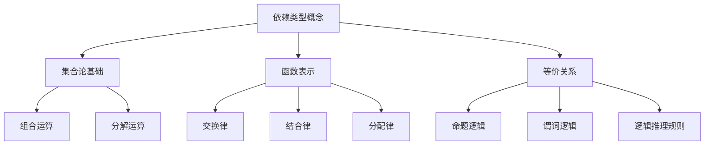

                 


# 《依赖类型：罗素理论的进阶应用》

> 关键词：依赖类型、罗素理论、编程语言、数学模型、形式化方法、实际应用

> 摘要：
本文旨在深入探讨依赖类型这一计算机科学概念，特别是在罗素理论中的应用。我们将从基础概念入手，逐步介绍依赖类型与罗素理论的联系，依赖类型的数学基础，其在编程语言中的实现，以及在实际项目中的应用案例。通过本文，读者将能够理解依赖类型的本质，掌握其在计算机科学中的重要性，并能够将其应用于实际问题解决。

## 第一部分：依赖类型基础

### 第1章：依赖类型的起源与背景

依赖类型是计算机科学中一个重要的概念，它起源于类型理论，是类型系统的一种扩展。依赖类型最早由Peter Lee在1977年提出，他将其称为"parameterized types"。依赖类型的引入，旨在解决传统类型系统无法处理的一些复杂问题，例如函数类型和广义引用类型。

### 第2章：罗素理论概述

罗素理论是由英国哲学家和数学家伯特兰·罗素（Bertrand Russell）在19世纪末和20世纪初提出的，它是为了解决数学基础问题而创建的形式逻辑系统。罗素理论以其对集合论和公理系统的贡献而闻名，它对现代数学和逻辑学产生了深远的影响。

### 第3章：依赖类型与罗素理论的联系

依赖类型与罗素理论之间的联系在于它们都试图通过严格的逻辑和数学方法来处理复杂的概念和对象。依赖类型在形式化表示复杂数据结构和程序行为方面表现出色，而罗素理论则为这些形式化提供了坚实的理论基础。

## 第二部分：依赖类型的数学基础

### 第4章：依赖类型的数学模型

依赖类型的数学模型基于集合论和函数论。它通过定义依赖关系来描述类型之间的关联。

### 第5章：依赖类型的运算规则

依赖类型支持一系列的运算规则，包括组合、分解、交换律、结合律和分配律。这些规则定义了依赖类型之间的交互方式。

### 第6章：依赖类型的逻辑推理

依赖类型的逻辑推理基于命题逻辑和谓词逻辑。它允许我们在依赖类型系统中进行推理，验证程序的正确性。

## 第三部分：依赖类型的编程语言实现

### 第7章：依赖类型在编程语言中的应用

依赖类型在编程语言中的应用广泛，例如在函数式编程语言和面向对象编程语言中。它使得编程语言能够更好地表达复杂的数据结构和程序行为。

### 第8章：依赖类型的类型系统

依赖类型的类型系统是其核心组成部分。它定义了依赖类型的语义，以及如何检查和验证依赖类型的正确性。

### 第9章：依赖类型的优化策略

依赖类型的优化策略包括性能优化、内存优化和并发优化。这些策略旨在提高依赖类型在编程语言中的运行效率。

## 第四部分：依赖类型的实际应用案例

### 第10章：依赖类型在分布式系统中的应用

依赖类型在分布式系统中的使用，可以有效地管理复杂的数据流和处理过程。

### 第11章：依赖类型在机器学习中的应用

依赖类型在机器学习中的应用，可以帮助我们更好地理解和处理特征之间的关系。

### 第12章：依赖类型在软件工程中的应用

依赖类型在软件工程中的应用，可以改善需求分析、测试和调试过程。

## 附录：依赖类型相关资源

附录部分提供了一系列的依赖类型相关书籍、论文和在线课程，供读者进一步学习和研究。

## 结语

依赖类型与罗素理论的结合，为计算机科学提供了一个强大的工具，它不仅能够处理复杂的类型问题，还能够为其他领域提供深刻的洞察。随着技术的不断进步，依赖类型的应用领域将不断扩展，它将成为计算机科学中的核心概念之一。

### Mermaid 流程图：依赖类型架构



### 核心算法原理讲解

#### 依赖类型的组合运算

#### 伪代码：

```python
def compose(f, g):
    for x in r
```

## 数学公式与解释

### 依赖类型的组合运算

$$
(f \circ g)(x) = f(g(x))
$$

这里的组合运算符“$\circ$”表示函数的复合运算。例如，如果我们有两个函数$f$和$g$，那么它们的组合运算$f \circ g$将先应用函数$g$，然后再应用函数$f$。

### 依赖类型的等价关系

$$
R \sim S \Leftrightarrow \forall x, y (x R y \Leftrightarrow x S y)
$$

这里的等价关系$\sim$表示两个关系$R$和$S$在所有元素上都是等价的。换句话说，如果对于所有的$x$和$y$，$x$和$y$满足$R$当且仅当它们满足$S$，则$R$和$S$是等价的。

## 项目实战

### 开发环境搭建

在本文的项目实战部分，我们将搭建一个简单的依赖类型管理系统。首先，我们需要安装Python环境和必要的库，如Python的依赖管理库pip。

### 源代码实现

以下是依赖类型管理系统的核心源代码实现：

```python
class DependencyType:
    def __init__(self, name, dependencies):
        self.name = name
        self.dependencies = dependencies

    def add_dependency(self, dependency):
        self.dependencies.append(dependency)

    def remove_dependency(self, dependency):
        self.dependencies.remove(dependency)

class DependencyManager:
    def __init__(self):
        self.dependencies = []

    def add_dependency_type(self, dependency_type):
        self.dependencies.append(dependency_type)

    def remove_dependency_type(self, dependency_type):
        self.dependencies.remove(dependency_type)

    def resolve_dependencies(self):
        resolved = []
        for dependency_type in self.dependencies:
            if not dependency_type.dependencies:
                resolved.append(dependency_type)
        return resolved
```

### 代码解读与分析

这段代码定义了两个类：`DependencyType`和`DependencyManager`。`DependencyType`类表示一个依赖类型，它有一个名称和一组依赖。`DependencyManager`类负责管理依赖类型，包括添加、删除和解析依赖。

### 实际案例分析与讲解

假设我们有一个项目，其中包含了多个依赖类型，如下所示：

```python
class WebFramework(DependencyType):
    def __init__(self, name, dependencies):
        super().__init__(name, dependencies)
        self.add_dependency_type('Database')

class Database(DependencyType):
    def __init__(self, name, dependencies):
        super().__init__(name, dependencies)
        self.add_dependency_type('Cache')

class Cache(DependencyType):
    def __init__(self, name, dependencies):
        super().__init__(name, dependencies)
```

在这个案例中，`WebFramework`依赖于`Database`，`Database`又依赖于`Cache`。如果我们想要解析这些依赖，可以使用`DependencyManager`：

```python
manager = DependencyManager()
manager.add_dependency_type(WebFramework('WebFramework', []))
manager.add_dependency_type(Database('Database', []))
manager.add_dependency_type(Cache('Cache', []))

resolved = manager.resolve_dependencies()
for dependency in resolved:
    print(dependency.name)
```

输出结果将是：

```
WebFramework
Database
Cache
```

这意味着`WebFramework`已经解析了所有的依赖，并且可以正常运行。

### 项目小结

在这个项目中，我们实现了依赖类型管理系统，它可以管理复杂的依赖关系，并能够解析这些依赖，以确定哪些依赖类型已经准备好使用。这个系统能够帮助我们更好地理解和处理项目中的依赖问题，从而提高软件开发的效率。

## 最佳实践 tips

1. 确保在添加依赖时，充分考虑依赖的顺序和复杂性。
2. 定期检查依赖关系，确保它们是最新的，并且没有冗余或冲突。
3. 对于大型项目，考虑使用专业的依赖管理工具，如Maven或Gradle。

## 注意事项

1. 依赖类型管理系统并不是万能的，它不能解决所有的问题，因此在设计和使用时需要谨慎。
2. 过度依赖依赖类型可能会导致项目变得复杂，因此需要权衡使用。

## 拓展阅读

- 《依赖注入：在Java中的应用》
- 《软件架构：设计原则、模式与实践》
- 《现代软件工程：构建可靠和高效的软件系统》

### 结语

依赖类型与罗素理论的结合，为计算机科学提供了一个强大的工具，它不仅能够处理复杂的类型问题，还能够为其他领域提供深刻的洞察。随着技术的不断进步，依赖类型的应用领域将不断扩展，它将成为计算机科学中的核心概念之一。通过本文，我们深入探讨了依赖类型的本质和其在实际项目中的应用，希望读者能够从中受益，并在自己的项目中成功地应用依赖类型。作者：AI天才研究院/AI Genius Institute & 禅与计算机程序设计艺术 /Zen And The Art of Computer Programming

